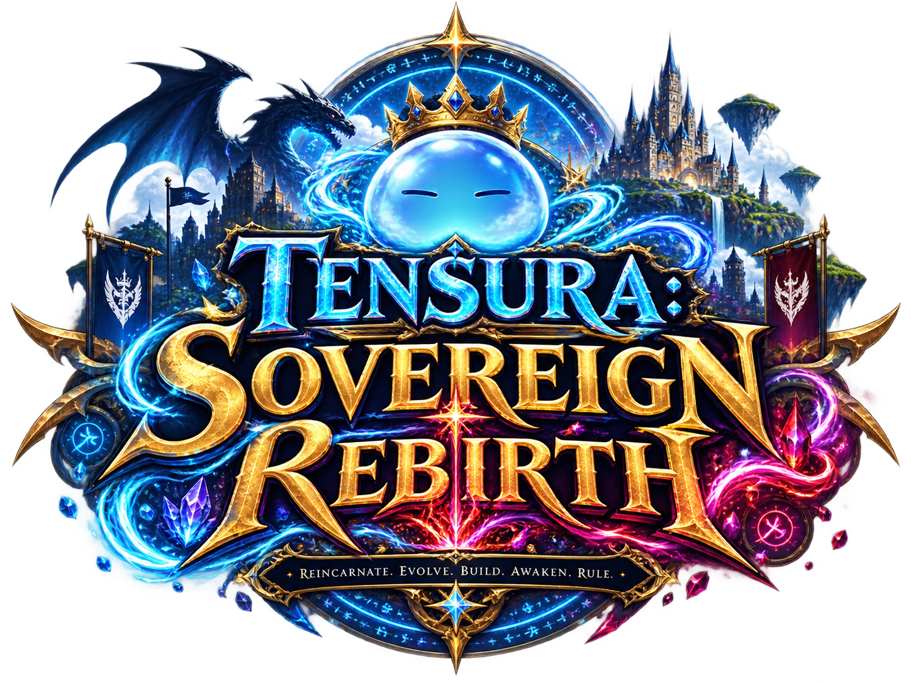

<p align="center">
  
</p>

<h1 align="center">Tensura: Sovereign Rebirth</h1>
<p align="center"><strong>Reincarnate. Evolve. Build. Awaken. Rule.</strong></p>

<p align="center">
  Minecraft 1.21.1 · NeoForge · Tensura RPG · Nation Building · Multiplayer
</p>

## About

**Tensura: Sovereign Rebirth (TSR)** is a curated Minecraft modpack project centered on Tensura: Reincarnated and designed as a connected RPG/civilization experience rather than a generic kitchen-sink pack.

The project combines character evolution, skills, Great Sage, Gear Evolution, subordinates, guild progression, MineColonies nation building, Tensura-aware claims/teams, external boss scaling, dimensions, prestige, and long-term awakening progression.

## Documentation

- **Documentation site:** https://lastnahaj.github.io/Tensura-Sovereign-Rebirth/
- [Getting Started](docs/getting-started.md)
- [Progression Overview](docs/progression-overview.md)
- [Mod Manifest](docs/mod-manifest.md)
- [Compatibility Matrix](docs/compatibility-matrix.md)
- [Roadmap](docs/roadmap.md)

## Project status

**Version 1 Beta — staged assembly**

The mod identities and major system ownership decisions are frozen. Runtime phases through core Tensura, civilization/magic, gear, forging, backpacks, physical storage, and terminal access have recorded passes. Later adventure, world, multiplayer, client, performance, export, and campaign gates remain staged or under validation.

Current campaign target: **8 Acts · 32 Chapters · ~512 handcrafted FTB Quests**, in addition to SlimeThrone Extras' own repeatable/prestige systems.

## Core design rules

- Gear Evolution is the authoritative equipment progression system.
- SlimeThrone Extras owns prestige/Soul Grade progression.
- Ascension owns major high-end awakening and supported external boss scaling.
- MineColonies owns civilization/NPC settlement gameplay.
- FTB Quests owns the handcrafted campaign.
- LuckPerms owns permissions.
- Sophisticated Storage owns physical storage; Tom's is terminal/wireless access only.
- Unsupported registry IDs, permission nodes, APIs, or quest detectors are never guessed.

## Repository layout

```text
.github/          GitHub Actions and issue forms
data/             Machine-readable project manifests
docs/             Documentation source for GitHub Pages
scripts/          Repository validation tools
mkdocs.yml        Documentation site configuration
requirements.txt  Documentation build dependency
```

## Local documentation build

```bash
python -m venv .venv
source .venv/bin/activate  # Windows: .venv\Scripts\activate
pip install -r requirements.txt
mkdocs serve
```

Then open `http://127.0.0.1:8000/Tensura-Sovereign-Rebirth/`.

## Tensura reference synchronization

The generated base-mod reference is sourced through the official Tensura wiki's MediaWiki API. Raw responses are cached under the ignored `.build/wiki-cache/` directory.

```bash
pip install -r requirements.txt -r requirements-wiki.txt
python scripts/wiki/sync_tensura_wiki.py
python scripts/wiki/check_reference.py
mkdocs build --strict
python scripts/wiki/check_built_site.py
```

The synchronizer records upstream revisions, categories, aliases, link conversions, and File-page licensing decisions. It never overwrites handcrafted TSR guides.

## Contributions and bug reports

Use the repository's issue forms for bugs, compatibility reports, and mod suggestions. The project is intentionally conservative about adding overlapping systems after the v0.1 freeze.

## Attribution

TSR depends on many independent Minecraft mods. Public releases must retain the individual mod authors' required attribution and distribution terms. See [Credits](docs/credits.md).
