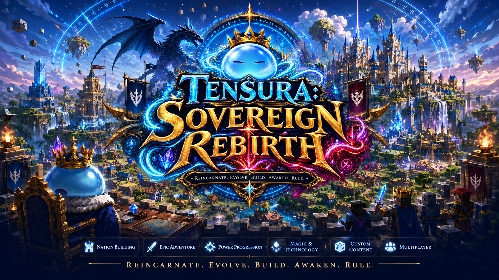

# Tensura: Sovereign Rebirth

### Reincarnate. Evolve. Build. Awaken. Rule.

**Minecraft 1.21.1 · NeoForge 21.1.248 · Java 21 · Version 1 Beta**

[Get Started](getting-started.md){ .md-button .md-button--primary }
[Search the Tensura Reference](tensura-reference/index.md){ .md-button }
[Explore TSR Progression](progression-overview.md){ .md-button }

---

**Tensura: Sovereign Rebirth (TSR)** is a Minecraft **1.21.1 NeoForge** RPG/civilization modpack built around Tensura: Reincarnated. The pack is designed so that character progression, race evolution, skills, equipment, subordinates, guild progression, nation building, bosses, dimensions, prestige, and endgame awakening all feed into one coherent progression loop.

Version 1 Beta

The wiki combines a self-contained base Tensura reference with the verified TSR modpack layer. The current upstream snapshot contains **975 relevant articles**, **387 local redirect aliases**, and **zero failed article imports**. Source media is mirrored with File-page attribution and per-file license exception checks.

## Choose your path

<article class="reference-path-card reference-theme-evolution">

<h2>Reincarnate & Evolve</h2>

Compare forms, inspect race infoboxes, and follow documented evolution requirements.

<a href="tensura-reference/races/">Races 69</a>
<a href="tensura-reference/races/evolution-trees/">Evolution paths</a>

</article>

<article class="reference-path-card reference-theme-abilities">

<h2>Master Skills & Magic</h2>

Filter abilities, spells, resistances, and Battlewill by the way you want to build.

<a href="tensura-reference/skills/unique/">Unique Skills 58</a>
<a href="tensura-reference/magic/">Magic 144</a>

</article>

<article class="reference-path-card reference-theme-bestiary">

<h2>Hunt & Conquer</h2>

Browse the animated bestiary and review major encounters before you challenge them.

<a href="tensura-reference/mobs/">Mobs 56</a>
<a href="tensura-reference/bosses/">Bosses 13</a>

</article>

<article class="reference-path-card reference-theme-world">

<h2>Build a Sovereignty</h2>

Explore source screenshots, structures, biomes, equipment, and nation-building guides.

<a href="tensura-reference/items/">Items 201</a>
<a href="tensura-reference/structures/">Structures 13</a>

</article>

## Practical guides

- **[Getting Started](getting-started.md)** 
  Reincarnation, starter policy, early resources, and first branches.
- **[Races](tensura-reference/races/index.md)** 
  All documented race forms plus verified evolution relationships.
- **[Skills](tensura-reference/skills/other/index.md)** 
  Intrinsic, Common, Extra, Unique, and resistance directories.
- **[Magic](tensura-reference/magic/index.md)** 
  Base spells, Battlewill, and TSR's external magic integration.
- **[EP, Magicules & Aura](tensura-reference/core-mechanics/ep-magicule-aura.md)** 
  Base resource mechanics with TSR version context.
- **[Items & Equipment](tensura-reference/items/index.md)** 
  Items, materials, weapons, armor, tools, and blocks.
- **[Mobs & Bosses](tensura-reference/mobs/index.md)** 
  Base entities alongside a separate TSR boss layer.
- **[Quests & Campaign](campaign.md)** 
  Actual implementation status for the planned eight-act campaign.
- **[World & Nations](minecolonies-and-nations.md)** 
  Terrain, structures, settlements, naming, and sovereignty.
- **[Server Setup](server-administration.md)** 
  Java, NeoForge, configuration, backups, and operations.
- **[Compatibility](compatibility-matrix.md)** 
  Installed, verified, blocked, and under-validation integrations.
- **[Mod Manifest](mod-manifest.md)** 
  Frozen design authority and current runtime dispositions.

## What makes TSR different?

- **Tensura-first progression.** External content is selected because it complements Tensura rather than competing with it.
- **Nation building.** MineColonies and Tensura x MineColonies turn settlement growth into a major RPG progression path.
- **Equipment that evolves with you.** Tensura Gear Evolution is the authoritative gear progression system.
- **Meaningful endgame.** SlimeThrone Extras, Ascension, boss content, racial prestige, Soul Grade, and Ultimate Skill progression provide long-term goals.
- **Guided but not linear.** The planned campaign uses FTB Quests for the main story while optional branches cover building, dimensions, bosses, magic, exploration, and mastery.
- **Multiplayer-ready design.** LuckPerms, FTB Teams/Chunks, Tensura FTB compatibility, grief logging, backups, profiling, and curated server-side optimization are part of the baseline.

## Current project stage

The published build branch has passed runtime phases through **gear, forging, backpacks, physical storage, and terminal access**. Adventure, Terratonic world generation, decoration, multiplayer administration, client QoL, performance, exports, and the authored quest campaign remain staged or under validation. See the [Roadmap](roadmap.md) for exact status language.
