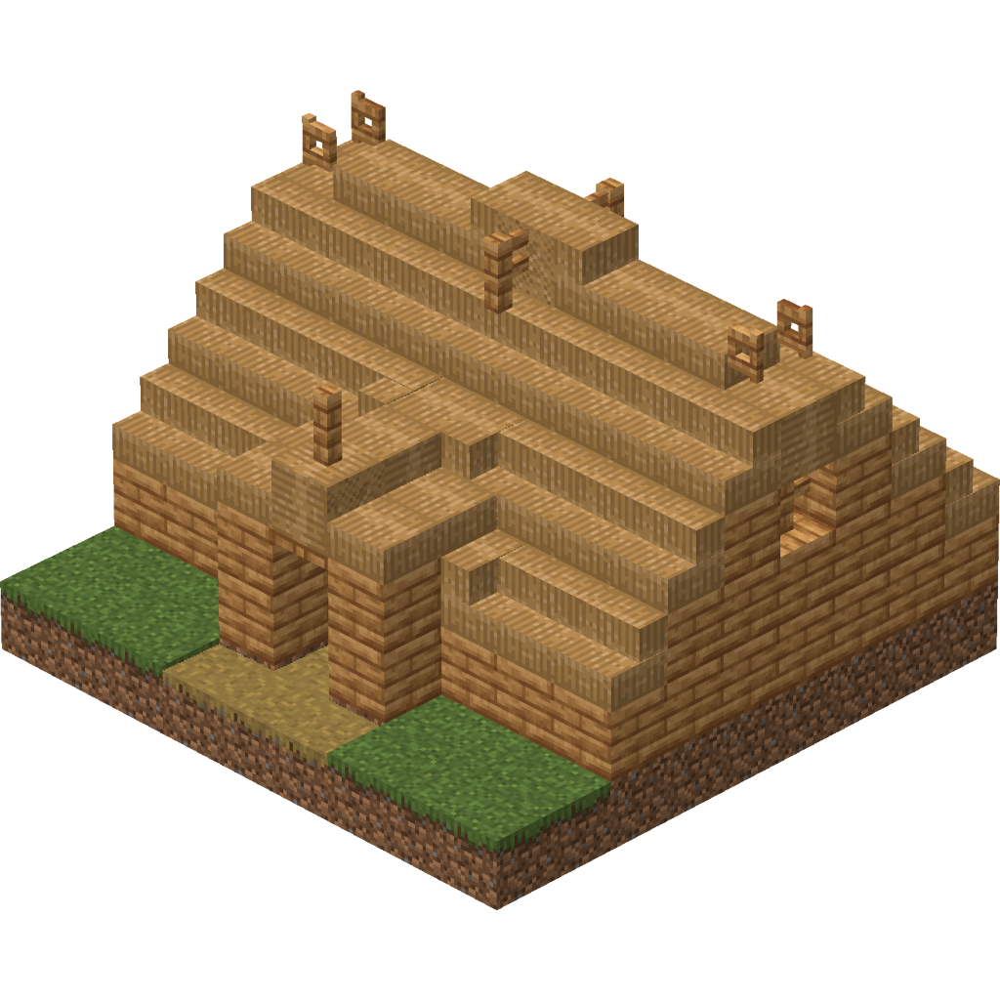
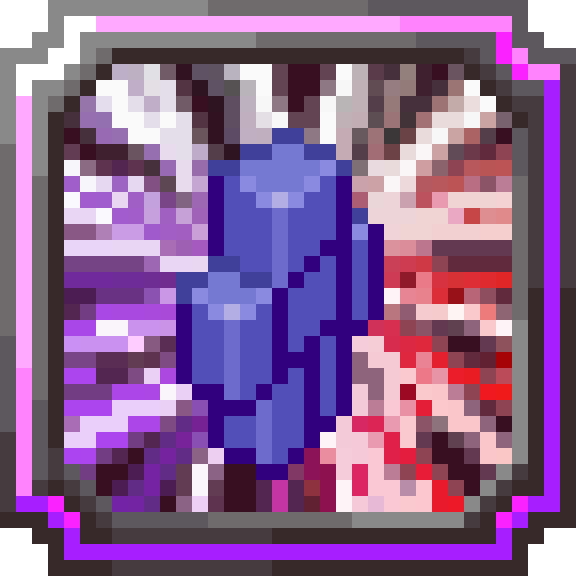
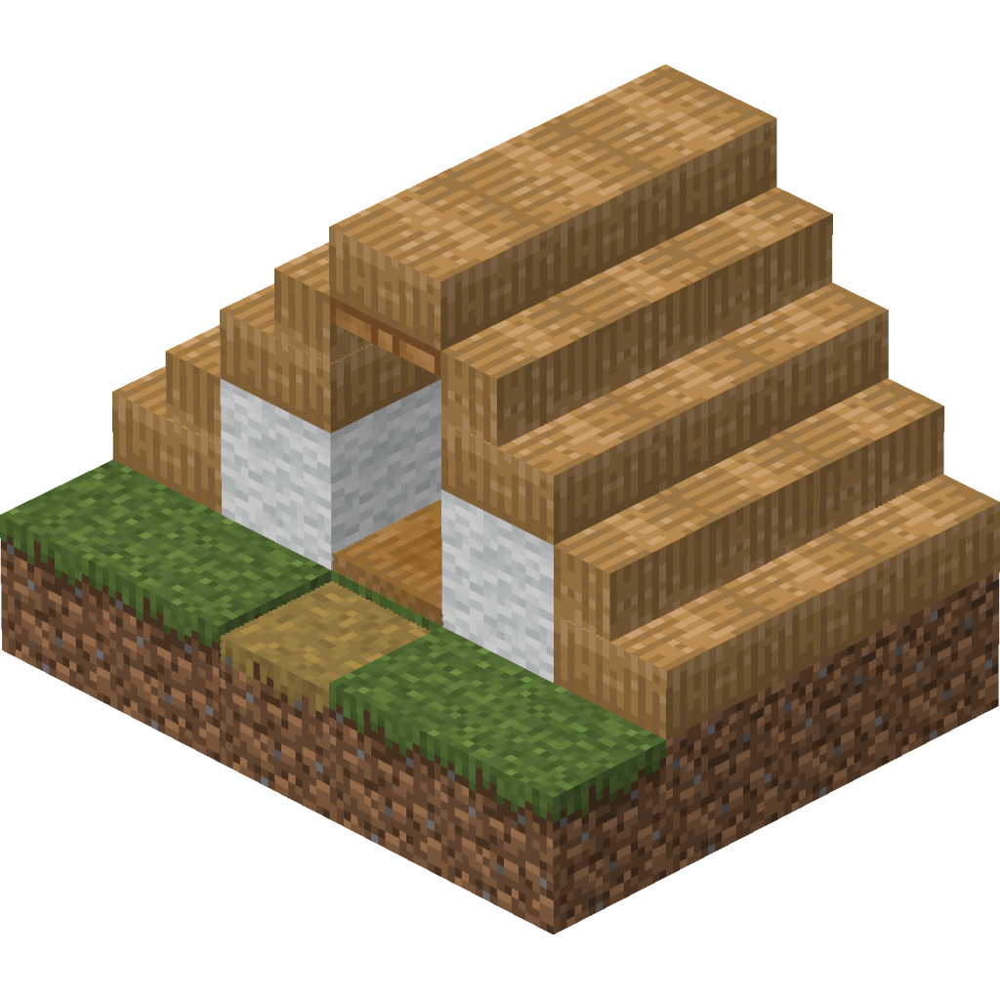

<section class="tsr-home-hero" aria-labelledby="home-title">
  

    
 The player wiki · Minecraft 1.21.1

    <h1 id="home-title">Tensura:SovereignRebirth</h1>
    
A new life. A world of possibilities.

    
Find your race. Master your skills. Turn your first steps into a story worth telling.

    

      <a class="home-button home-button--primary" href="getting-started/">Get started ↗</a>
      <a class="home-button home-button--secondary" href="#explore">Explore the wiki ↓</a>
    

    
Reincarnate <i>·</i> Evolve <i>·</i> Build <i>·</i> Awaken <i>·</i> Rule

  

  

    
  

</section>

  
<strong>Version 1 Beta</strong>NeoForge · Minecraft 1.21.1

  <a href="roadmap/">See what’s being built →</a>

<section class="home-explore" id="explore" aria-labelledby="home-explore-title">
  

The world, at your fingertips
<h2 id="home-explore-title">Find your next move.</h2>
<a href="tensura-reference/">All reference sections ↗</a>

  

    <a class="home-directory-card home-directory-card--race" href="tensura-reference/races/">
Become something more<h3>Races &amp; evolutions</h3>
Explore your family, compare forms, and follow each evolution path.
Find your race <b aria-hidden="true">→</b>
</a>
    <a class="home-directory-card home-directory-card--skill" href="tensura-reference/skills/">
Shape your abilities<h3>Skills &amp; magic</h3>
Learn what skills do, how to obtain them, and what they unlock.
Build your skill set <b aria-hidden="true">→</b>
</a>
    <a class="home-directory-card home-directory-card--equipment" href="tensura-reference/items/">
Prepare for the journey<h3>Items &amp; equipment</h3>
Browse materials, weapons, armor, tools, and useful discoveries.
Open the item guide <b aria-hidden="true">→</b>
</a>
    <a class="home-directory-card home-directory-card--mobs" href="tensura-reference/mobs/">
Know what awaits<h3>Mobs &amp; bosses</h3>
Meet the creatures of Tensura and prepare for larger encounters.
Explore the bestiary <b aria-hidden="true">→</b>
</a>
    <a class="home-directory-card home-directory-card--world" href="tensura-reference/structures/">
Go beyond the horizon<h3>World &amp; structures</h3>
Discover settlements, landmarks, and places worth exploring.
Plan an expedition <b aria-hidden="true">→</b>
</a>
    <a class="home-directory-card home-directory-card--progression" href="progression-overview/">
Make every life count<h3>Prestige &amp; progression</h3>
Understand awakening, Soul Grade, prestige, and skill locking.
See the progression guide <b aria-hidden="true">→</b>
</a>
  

  <nav class="home-quick-links" aria-label="More wiki sections">Also explore<a href="tensura-reference/blocks/">Blocks ↗</a><a href="tensura-reference/biomes/">Biomes ↗</a><a href="tensura-reference/bosses/">Bosses ↗</a><a href="tensura-reference/commands/">Commands ↗</a><a href="tensura-reference/configuration/">Configuration ↗</a><a href="mod-guide-directory/">Mod guides ↗</a></nav>
</section>

<section class="home-start" aria-labelledby="home-start-title">
  

Your first hour
<h2 id="home-start-title">Every legend starts somewhere.</h2>
<a href="getting-started/">Read the starter guide ↗</a>

  

    <a href="getting-started/#your-first-hour">
01

<small>00–10 minutes · Reincarnate</small><h3>Meet your new self.</h3>
Check your race, resources, abilities, and controls before your first fight.
Understand your character →
</a>
    <a href="getting-started/#field-checklist">
02

<small>10–30 minutes · Establish</small><h3>Find your footing.</h3>
Gather food, build a shelter, and learn how to protect your first home.
Open the field checklist →
</a>
    <a href="getting-started/#choose-a-path-not-a-class">
03

<small>30–60 minutes · Explore</small><h3>Choose a first ambition.</h3>
Pursue an evolution, try a new skill, explore, or lay the foundations of a nation.
Find a path that fits →
</a>
  

</section>

<section class="home-community" aria-labelledby="home-community-title">
  

A shared world
<h2 id="home-community-title">Your story has company.</h2>
Build a home, meet other players, and find your place in the realm.
<a class="home-button home-button--secondary" href="getting-started/">How to join ↗</a>

  

    
TSR REALM<strong data-status-label>Checking…</strong>

    
tsr.infinitegamingservers.com

    
<strong data-status-online>—</strong>players online

    <ul class="server-player-list" data-status-players aria-label="Publicly reported online players"><li>Checking the public player sample…</li></ul>
    
Requesting the latest public server status.

    
<button type="button" data-copy-server>Copy server address</button><button type="button" data-status-refresh>Refresh</button>

    
 · Public status may be cached. Names appear when the server shares them.

  

</section>

<footer class="home-footer">
<strong>Tensura: Sovereign Rebirth</strong>
A Minecraft 1.21.1 adventure built around Tensura: Reincarnated.

<nav aria-label="Project information"><a href="project/sources-and-attribution/">Sources &amp; image credits</a><a href="current-modlist/">Current modlist</a><a href="roadmap/">Roadmap</a><a href="https://github.com/lastnahaj/Tensura-Sovereign-Rebirth/issues">Report an issue</a></nav></footer>

  
Homepage image credits

  
The blue slime hero is original TSR illustration. Reference thumbnails are from the Tensura: Reincarnated Wiki and retain their recorded File-page license declarations:

  <ul>
    <li><a href="https://tensura.wiki.gg/wiki/File:RaceSlime.png">RaceSlime.png</a> · <a href="https://tensura.wiki.gg/wiki/File:Great_sage.png">Great sage.png</a> · <a href="https://tensura.wiki.gg/wiki/File:Block_of_Pure_Magisteel.png">Block of Pure Magisteel.png</a></li>
    <li><a href="https://tensura.wiki.gg/wiki/File:Direwolf.gif">Direwolf.gif</a> · <a href="https://tensura.wiki.gg/wiki/File:Goblin_chief_tent.png">Goblin chief tent.png</a> · <a href="https://tensura.wiki.gg/wiki/File:Awakening1.png">Awakening1.png</a></li>
    <li><a href="https://tensura.wiki.gg/wiki/File:RaceHuman.png">RaceHuman.png</a> · <a href="https://tensura.wiki.gg/wiki/File:Goblin_small_tent.png">Goblin small tent.png</a> · <a href="https://tensura.wiki.gg/wiki/File:Predator.png">Predator.png</a></li>
  </ul>
  
See the <a href="project/upstream-attribution/">Tensura attribution record</a> for contributors and CC BY-SA 4.0 terms. This community project is not an official Tensura franchise website.

