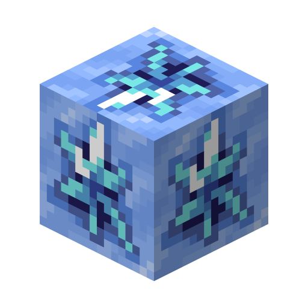

<section class="reference-directory" data-reference-directory="blocks">
<header class="reference-directory-hero reference-theme-world">

Tensura reference collection

<h1>Blocks</h1>

Mechanically relevant blocks and block families.

<strong>1</strong> articles
<a class="reference-directory-overview-link" href="blocks/">Read collection overview →</a>

</header>

<label class="reference-filter-label">
Filter this collection
<input type="search" class="reference-filter-input" placeholder="Search titles and summaries…" autocomplete="off">
</label>

<button type="button" class="is-active" data-letter="all" aria-pressed="true">All</button>
<button type="button" data-letter="I" aria-pressed="false">I</button>

Showing 1 of 1 articles

<article class="reference-card" data-letter="I" data-search="ice ore upon breaking the ore with a ... , one can get ice essence">
<a href="blocks-ice-ore/" aria-label="Open Ice Ore">
<figure class="reference-card-media reference-card-media--source">

<figcaption>Source media</figcaption>
</figure>

<h2>Ice Ore</h2>

Upon breaking the ore with a ... , one can get Ice Essence

Open reference →

</a>
</article>

No matching articles. Try a broader search.

</section>
