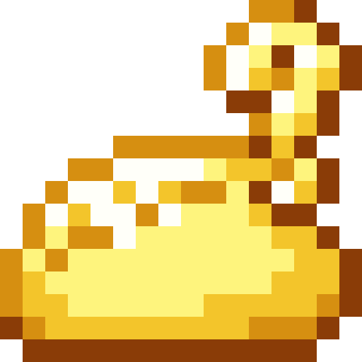
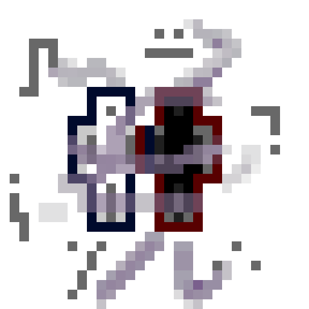
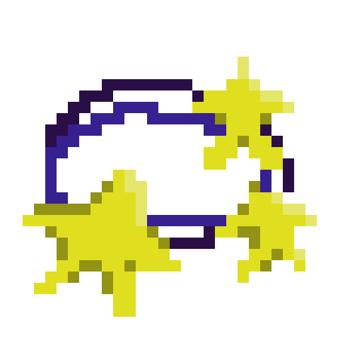
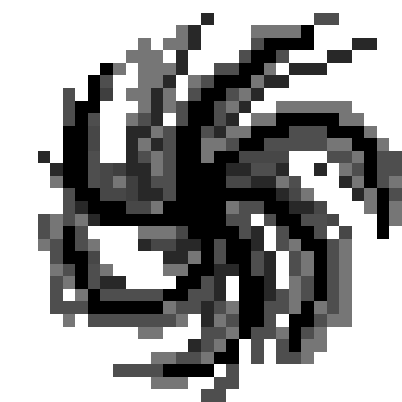
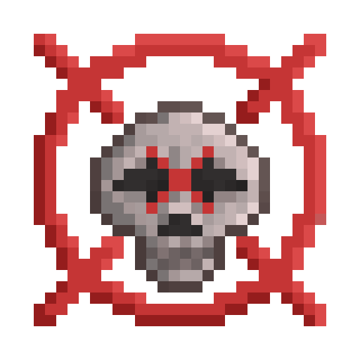
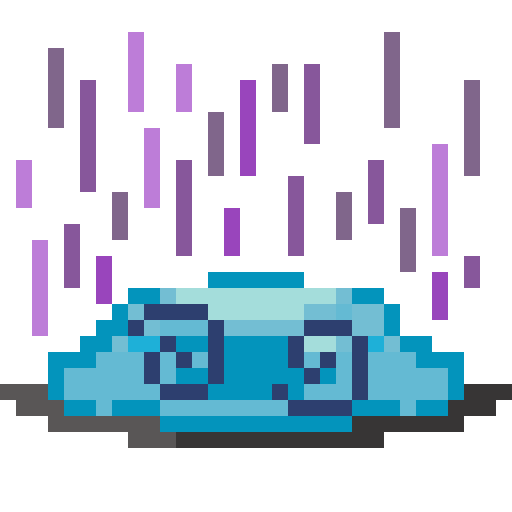
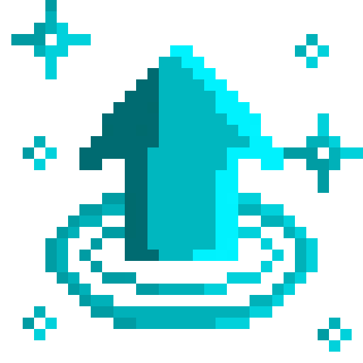
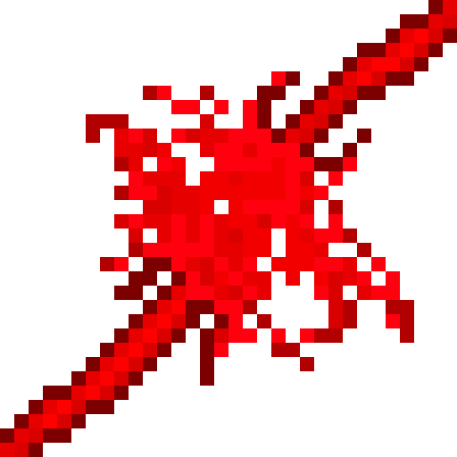
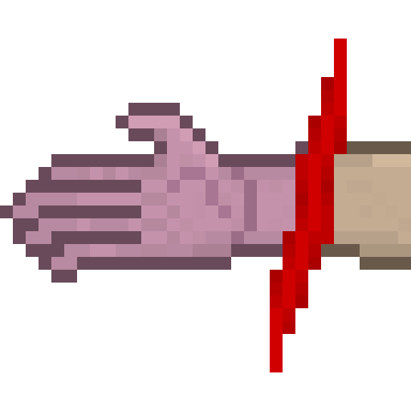
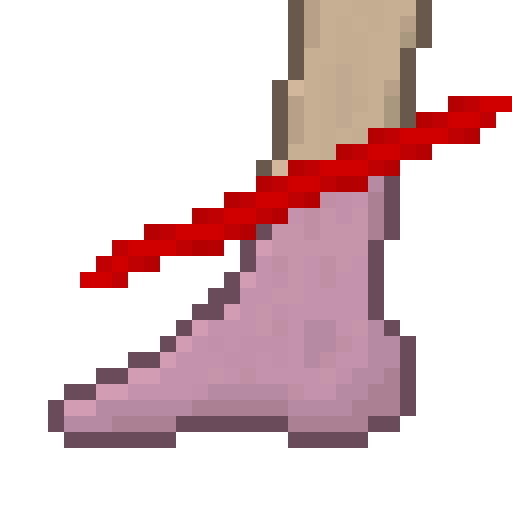

<section class="reference-directory" data-reference-directory="core-mechanics">
<header class="reference-directory-hero reference-theme-evolution">

Tensura reference collection

<h1>Core Mechanics</h1>

Foundational resources and progression mechanics.

<strong>29</strong> articles

</header>

<label class="reference-filter-label">
Filter this collection
<input type="search" class="reference-filter-input" placeholder="Search titles and summaries…" autocomplete="off">
</label>

<button type="button" class="is-active" data-letter="all" aria-pressed="true">All</button>
<button type="button" data-letter="A" aria-pressed="false">A</button>
<button type="button" data-letter="B" aria-pressed="false">B</button>
<button type="button" data-letter="C" aria-pressed="false">C</button>
<button type="button" data-letter="D" aria-pressed="false">D</button>
<button type="button" data-letter="E" aria-pressed="false">E</button>
<button type="button" data-letter="F" aria-pressed="false">F</button>
<button type="button" data-letter="G" aria-pressed="false">G</button>
<button type="button" data-letter="I" aria-pressed="false">I</button>
<button type="button" data-letter="L" aria-pressed="false">L</button>
<button type="button" data-letter="M" aria-pressed="false">M</button>
<button type="button" data-letter="P" aria-pressed="false">P</button>
<button type="button" data-letter="R" aria-pressed="false">R</button>
<button type="button" data-letter="S" aria-pressed="false">S</button>
<button type="button" data-letter="U" aria-pressed="false">U</button>

Showing 29 of 29 articles

<article class="reference-card" data-letter="A" data-search="aura healing aura healing is caused by toggling the skill tenacity .">
<a href="effects-aura-healing/" aria-label="Open Aura Healing">
<figure class="reference-card-media reference-card-media--source">

<figcaption>Source media</figcaption>
</figure>

<h2>Aura Healing</h2>

Aura Healing is caused by toggling the Skill Tenacity .

Open reference →

</a>
</article>
<article class="reference-card" data-letter="A" data-search="awakened foresight awakened foresight is an effect that...">
<a href="effects-awakened-foresight/" aria-label="Open Awakened Foresight">
<figure class="reference-card-media reference-card-media--source">

<figcaption>Source media</figcaption>
</figure>

<h2>Awakened Foresight</h2>

Awakened Foresight is an effect that...

Open reference →

</a>
</article>
<article class="reference-card" data-letter="B" data-search="brimstone flames brimstone flames is applied by axiom with the engraving holy flames">
<a href="effects-brimstone-flames/" aria-label="Open Brimstone Flames">
<figure class="reference-card-media reference-card-media--source">

<figcaption>Source media</figcaption>
</figure>

<h2>Brimstone Flames</h2>

Brimstone Flames is applied by Axiom with the engraving Holy Flames

Open reference →

</a>
</article>
<article class="reference-card" data-letter="C" data-search="collective collective is an effect that...">
<a href="effects-collective/" aria-label="Open Collective">
<figure class="reference-card-media reference-card-media--source">

<figcaption>Source media</figcaption>
</figure>

<h2>Collective</h2>

Collective is an effect that...

Open reference →

</a>
</article>
<article class="reference-card" data-letter="C" data-search="compatibility system can be disabled in config files. functions in truly unique">
<a href="compatibility-system/" aria-label="Open Compatibility System">
<figure class="reference-card-media reference-card-media--theme">

<figcaption>TSR artwork</figcaption>
</figure>

<h2>Compatibility System</h2>

Can be disabled in config files. Functions in truly unique

Open reference →

</a>
</article>
<article class="reference-card" data-letter="C" data-search="countering countering is caused by activating the ability &quot;counter&quot; with restricted .">
<a href="effects-countering/" aria-label="Open Countering">
<figure class="reference-card-media reference-card-media--source">

<figcaption>Source media</figcaption>
</figure>

<h2>Countering</h2>

Countering is caused by activating the ability &quot;Counter&quot; with Restricted .

Open reference →

</a>
</article>
<article class="reference-card" data-letter="C" data-search="cultivating cultivating is an effect that...">
<a href="effects-cultivating/" aria-label="Open Cultivating">
<figure class="reference-card-media reference-card-media--source">

<figcaption>Source media</figcaption>
</figure>

<h2>Cultivating</h2>

Cultivating is an effect that...

Open reference →

</a>
</article>
<article class="reference-card" data-letter="D" data-search="dazzled dazzled is an effect that...">
<a href="effects-dazzled/" aria-label="Open Dazzled">
<figure class="reference-card-media reference-card-media--source">

<figcaption>Source media</figcaption>
</figure>

<h2>Dazzled</h2>

Dazzled is an effect that...

Open reference →

</a>
</article>
<article class="reference-card" data-letter="E" data-search="effects aura healing awakened foresight brimstone flames collective countering cultivating dazzled eternal permafrost fixation imbalanced intangible lightning mode marked for…">
<a href="effects/" aria-label="Open Effects">
<figure class="reference-card-media reference-card-media--source">

<figcaption>Source media</figcaption>
</figure>

<h2>Effects</h2>

Aura Healing Awakened Foresight Brimstone Flames Collective Countering Cultivating Dazzled Eternal Permafrost Fixation Imbalanced Intangible Lightning Mode Marked For…

Open reference →

</a>
</article>
<article class="reference-card" data-letter="E" data-search="eternal permafrost eternal permafrost is applied by &quot;waltz&quot; with its unique engraving, &quot;boreal frost&quot;.">
<a href="effects-eternal-permafrost/" aria-label="Open Eternal Permafrost">
<figure class="reference-card-media reference-card-media--source">

<figcaption>Source media</figcaption>
</figure>

<h2>Eternal Permafrost</h2>

Eternal Permafrost is applied by &quot;Waltz&quot; with its unique engraving, &quot;Boreal Frost&quot;.

Open reference →

</a>
</article>
<article class="reference-card" data-letter="F" data-search="fixation fixation is an effect that...">
<a href="effects-fixation/" aria-label="Open Fixation">
<figure class="reference-card-media reference-card-media--source">

<figcaption>Source media</figcaption>
</figure>

<h2>Fixation</h2>

Fixation is an effect that...

Open reference →

</a>
</article>
<article class="reference-card" data-letter="G" data-search="getting started upstream reference information for getting started.">
<a href="getting-started/" aria-label="Open Getting Started">
<figure class="reference-card-media reference-card-media--source">

<figcaption>Source media</figcaption>
</figure>

<h2>Getting Started</h2>

Upstream reference information for Getting Started.

Open reference →

</a>
</article>
<article class="reference-card" data-letter="I" data-search="imbalanced see countering effect">
<a href="effects-imbalanced/" aria-label="Open Imbalanced">
<figure class="reference-card-media reference-card-media--source">

<figcaption>Source media</figcaption>
</figure>

<h2>Imbalanced</h2>

See Countering effect

Open reference →

</a>
</article>
<article class="reference-card" data-letter="I" data-search="intangible intangible is an effect that...">
<a href="effects-intangible/" aria-label="Open Intangible">
<figure class="reference-card-media reference-card-media--source">

<figcaption>Source media</figcaption>
</figure>

<h2>Intangible</h2>

Intangible is an effect that...

Open reference →

</a>
</article>
<article class="reference-card" data-letter="L" data-search="lightning mode lightning mode is an effect that...">
<a href="effects-lightning-mode/" aria-label="Open Lightning Mode">
<figure class="reference-card-media reference-card-media--source">

<figcaption>Source media</figcaption>
</figure>

<h2>Lightning Mode</h2>

Lightning Mode is an effect that...

Open reference →

</a>
</article>
<article class="reference-card" data-letter="M" data-search="marked for death marked for death is an effect that...">
<a href="effects-marked-for-death/" aria-label="Open Marked For Death">
<figure class="reference-card-media reference-card-media--source">

<figcaption>Source media</figcaption>
</figure>

<h2>Marked For Death</h2>

Marked For Death is an effect that...

Open reference →

</a>
</article>
<article class="reference-card" data-letter="M" data-search="mechanics these mechanics are mechanics added by this mod:">
<a href="mechanics/" aria-label="Open Mechanics">
<figure class="reference-card-media reference-card-media--source">

<figcaption>Source media</figcaption>
</figure>

<h2>Mechanics</h2>

These Mechanics are mechanics added by this mod:

Open reference →

</a>
</article>
<article class="reference-card" data-letter="P" data-search="pay it forward pay it forward is an effect that...">
<a href="effects-pay-it-forward/" aria-label="Open Pay It Forward">
<figure class="reference-card-media reference-card-media--source">

<figcaption>Source media</figcaption>
</figure>

<h2>Pay It Forward</h2>

Pay It Forward is an effect that...

Open reference →

</a>
</article>
<article class="reference-card" data-letter="P" data-search="pressure pressure is an effect that...">
<a href="effects-pressure/" aria-label="Open Pressure">
<figure class="reference-card-media reference-card-media--source">

<figcaption>Source media</figcaption>
</figure>

<h2>Pressure</h2>

Pressure is an effect that...

Open reference →

</a>
</article>
<article class="reference-card" data-letter="P" data-search="provider boost provider boost is an effect that...">
<a href="effects-provider-boost/" aria-label="Open Provider Boost">
<figure class="reference-card-media reference-card-media--source">

<figcaption>Source media</figcaption>
</figure>

<h2>Provider Boost</h2>

Provider Boost is an effect that...

Open reference →

</a>
</article>
<article class="reference-card" data-letter="R" data-search="reducer holy coat reducer holy coat is an effect that...">
<a href="effects-reducer-holy-coat/" aria-label="Open Reducer Holy Coat">
<figure class="reference-card-media reference-card-media--source">

<figcaption>Source media</figcaption>
</figure>

<h2>Reducer Holy Coat</h2>

Reducer Holy Coat is an effect that...

Open reference →

</a>
</article>
<article class="reference-card" data-letter="R" data-search="reducer purity edge reducer purity edge is an effect that...">
<a href="effects-reducer-purity-edge/" aria-label="Open Reducer Purity Edge">
<figure class="reference-card-media reference-card-media--source">

<figcaption>Source media</figcaption>
</figure>

<h2>Reducer Purity Edge</h2>

Reducer Purity Edge is an effect that...

Open reference →

</a>
</article>
<article class="reference-card" data-letter="R" data-search="revenant horror revenant horror is an effect that...">
<a href="effects-revenant-horror/" aria-label="Open Revenant Horror">
<figure class="reference-card-media reference-card-media--source">

<figcaption>Source media</figcaption>
</figure>

<h2>Revenant Horror</h2>

Revenant Horror is an effect that...

Open reference →

</a>
</article>
<article class="reference-card" data-letter="R" data-search="rupturing rupturing is an effect that...">
<a href="effects-rupturing/" aria-label="Open Rupturing">
<figure class="reference-card-media reference-card-media--source">

<figcaption>Source media</figcaption>
</figure>

<h2>Rupturing</h2>

Rupturing is an effect that...

Open reference →

</a>
</article>
<article class="reference-card" data-letter="S" data-search="sanctifying light sanctifying light is an effect that...">
<a href="effects-sanctifying-light/" aria-label="Open Sanctifying Light">
<figure class="reference-card-media reference-card-media--source">

<figcaption>Source media</figcaption>
</figure>

<h2>Sanctifying Light</h2>

Sanctifying Light is an effect that...

Open reference →

</a>
</article>
<article class="reference-card" data-letter="S" data-search="severed arm severed arm is an effect that...">
<a href="effects-severed-arm/" aria-label="Open Severed Arm">
<figure class="reference-card-media reference-card-media--source">

<figcaption>Source media</figcaption>
</figure>

<h2>Severed Arm</h2>

Severed Arm is an effect that...

Open reference →

</a>
</article>
<article class="reference-card" data-letter="S" data-search="severed leg severed leg is an effect that...">
<a href="effects-severed-leg/" aria-label="Open Severed Leg">
<figure class="reference-card-media reference-card-media--source">

<figcaption>Source media</figcaption>
</figure>

<h2>Severed Leg</h2>

Severed Leg is an effect that...

Open reference →

</a>
</article>
<article class="reference-card" data-letter="S" data-search="soul quality the soul quality determines how many ultimate skills one soul can be engraved with.">
<a href="soul-quality/" aria-label="Open Soul Quality">
<figure class="reference-card-media reference-card-media--source">

<figcaption>Source media</figcaption>
</figure>

<h2>Soul Quality</h2>

The soul quality determines how many ultimate skills one soul can be engraved with.

Open reference →

</a>
</article>
<article class="reference-card" data-letter="U" data-search="unstable requiem unstable requiem is an effect that...">
<a href="effects-unstable-requiem/" aria-label="Open Unstable Requiem">
<figure class="reference-card-media reference-card-media--source">

<figcaption>Source media</figcaption>
</figure>

<h2>Unstable Requiem</h2>

Unstable Requiem is an effect that...

Open reference →

</a>
</article>

No matching articles. Try a broader search.

</section>
