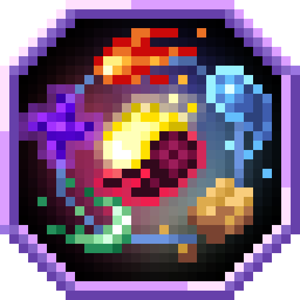
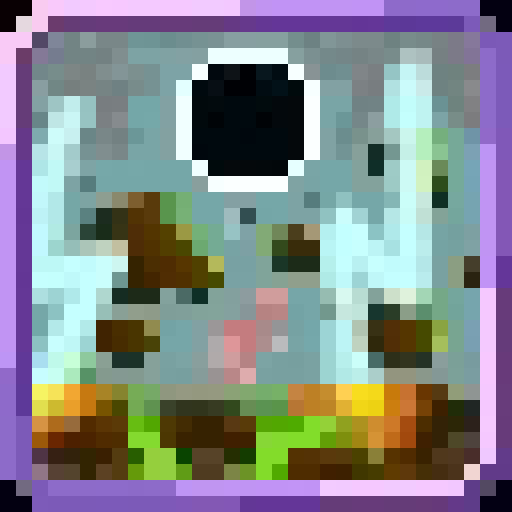
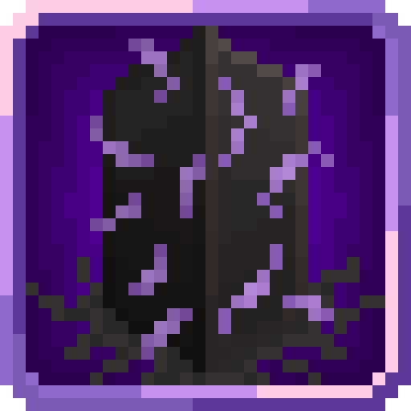

<section class="reference-directory" data-reference-directory="magic">
<header class="reference-directory-hero reference-theme-abilities">

Tensura reference collection

<h1>Magic</h1>

Magic systems, aspects, and individual spells.

<strong>3</strong> articles

</header>

<label class="reference-filter-label">
Filter this collection
<input type="search" class="reference-filter-input" placeholder="Search titles and summaries…" autocomplete="off">
</label>

<button type="button" class="is-active" data-letter="all" aria-pressed="true">All</button>
<button type="button" data-letter="A" aria-pressed="false">A</button>
<button type="button" data-letter="G" aria-pressed="false">G</button>
<button type="button" data-letter="S" aria-pressed="false">S</button>

Showing 3 of 3 articles

<article class="reference-card" data-letter="A" data-search="abilities/magics spiritual magic">
<a href="abilities-magics/" aria-label="Open Abilities/Magics">
<figure class="reference-card-media reference-card-media--source">

<figcaption>Source media</figcaption>
</figure>

<h2>Abilities/Magics</h2>

Spiritual Magic

Open reference →

</a>
</article>
<article class="reference-card" data-letter="G" data-search="gravitational void targets being pulled by the black hole gain slowness 1.">
<a href="gravitational-void/" aria-label="Open Gravitational Void">
<figure class="reference-card-media reference-card-media--source">

<figcaption>Source media</figcaption>
</figure>

<h2>Gravitational Void</h2>

Targets being pulled by the black hole gain Slowness 1.

Open reference →

</a>
</article>
<article class="reference-card" data-letter="S" data-search="spatial void while charging the spell, all entities in a 30 block radius from the user (except subordinates) will gain intense gravity and movement speed reduction.">
<a href="spatial-void/" aria-label="Open Spatial Void">
<figure class="reference-card-media reference-card-media--source">

<figcaption>Source media</figcaption>
</figure>

<h2>Spatial Void</h2>

While charging the spell, all entities in a 30 block radius from the user (except subordinates) will gain intense gravity and movement speed reduction.

Open reference →

</a>
</article>

No matching articles. Try a broader search.

</section>
