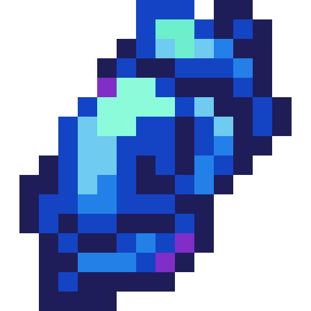
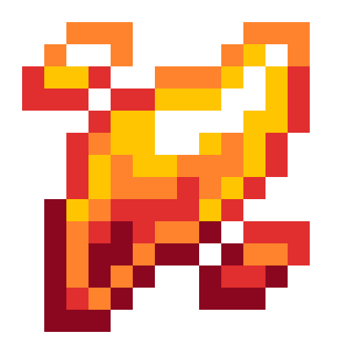
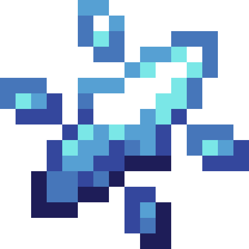
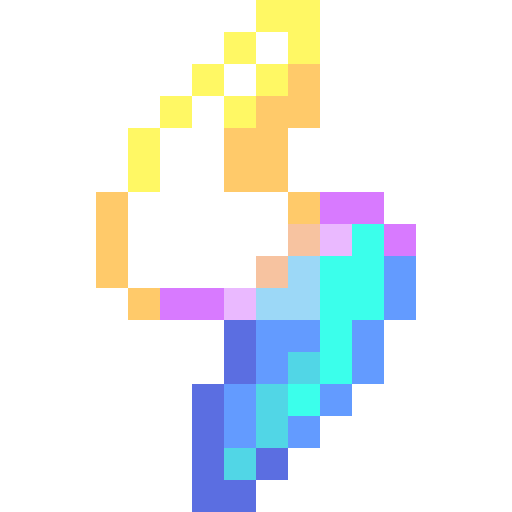

<section class="reference-directory" data-reference-directory="other">
<header class="reference-directory-hero reference-theme-world">

Tensura reference collection

<h1>Other Reference</h1>

Additional maintained reference articles.

<strong>8</strong> articles

</header>

<label class="reference-filter-label">
Filter this collection
<input type="search" class="reference-filter-input" placeholder="Search titles and summaries…" autocomplete="off">
</label>

<button type="button" class="is-active" data-letter="all" aria-pressed="true">All</button>
<button type="button" data-letter="C" aria-pressed="false">C</button>
<button type="button" data-letter="D" aria-pressed="false">D</button>
<button type="button" data-letter="E" aria-pressed="false">E</button>
<button type="button" data-letter="F" aria-pressed="false">F</button>
<button type="button" data-letter="I" aria-pressed="false">I</button>
<button type="button" data-letter="K" aria-pressed="false">K</button>
<button type="button" data-letter="L" aria-pressed="false">L</button>
<button type="button" data-letter="S" aria-pressed="false">S</button>

Showing 8 of 8 articles

<article class="reference-card" data-letter="C" data-search="cryptid essence evolving from lesser angel to phantom (needs 1)">
<a href="cryptid-essence/" aria-label="Open Cryptid Essence">
<figure class="reference-card-media reference-card-media--source">

<figcaption>Source media</figcaption>
</figure>

<h2>Cryptid Essence</h2>

Evolving from Lesser Angel to Phantom (Needs 1)

Open reference →

</a>
</article>
<article class="reference-card" data-letter="D" data-search="divine emperor scorpion redirect divine loxodrome scorpion">
<a href="divine-emperor-scorpion/" aria-label="Open Divine Emperor Scorpion">
<figure class="reference-card-media reference-card-media--theme">

<figcaption>TSR artwork</figcaption>
</figure>

<h2>Divine Emperor Scorpion</h2>

REDIRECT Divine Loxodrome Scorpion

Open reference →

</a>
</article>
<article class="reference-card" data-letter="E" data-search="emperor scorpion redirect loxodrome scorpion savant">
<a href="emperor-scorpion/" aria-label="Open Emperor Scorpion">
<figure class="reference-card-media reference-card-media--theme">

<figcaption>TSR artwork</figcaption>
</figure>

<h2>Emperor Scorpion</h2>

REDIRECT Loxodrome Scorpion Savant

Open reference →

</a>
</article>
<article class="reference-card" data-letter="F" data-search="flame essence evolving sculk worm to molten perforator (needs 3)">
<a href="blaze-essence/" aria-label="Open Flame Essence">
<figure class="reference-card-media reference-card-media--source">

<figcaption>Source media</figcaption>
</figure>

<h2>Flame Essence</h2>

Evolving Sculk Worm to Molten Perforator (Needs 3)

Open reference →

</a>
</article>
<article class="reference-card" data-letter="I" data-search="ice essence evolving from attuned wyrm to lesser glacier wyrm (needs 5)">
<a href="ice-essence/" aria-label="Open Ice Essence">
<figure class="reference-card-media reference-card-media--source">

<figcaption>Source media</figcaption>
</figure>

<h2>Ice Essence</h2>

Evolving from Attuned Wyrm to Lesser Glacier Wyrm (Needs 5)

Open reference →

</a>
</article>
<article class="reference-card" data-letter="K" data-search="king scorpion insectar redirect loxodrome scorpion insectar">
<a href="king-scorpion-insectar/" aria-label="Open King Scorpion Insectar">
<figure class="reference-card-media reference-card-media--theme">

<figcaption>TSR artwork</figcaption>
</figure>

<h2>King Scorpion Insectar</h2>

REDIRECT Loxodrome Scorpion Insectar

Open reference →

</a>
</article>
<article class="reference-card" data-letter="L" data-search="lightning essence evolving sculk worm to charged perforator (needs 10)">
<a href="lightning-essence/" aria-label="Open Lightning Essence">
<figure class="reference-card-media reference-card-media--source">

<figcaption>Source media</figcaption>
</figure>

<h2>Lightning Essence</h2>

Evolving Sculk Worm to Charged Perforator (Needs 10)

Open reference →

</a>
</article>
<article class="reference-card" data-letter="S" data-search="soul energy on first reincarnation, the player is given a random soul energy amount ranging from 500,000 to 7,000,000. you will always have enough to gain your first unique skill.">
<a href="soul-energy/" aria-label="Open Soul Energy">
<figure class="reference-card-media reference-card-media--source">

<figcaption>Source media</figcaption>
</figure>

<h2>Soul Energy</h2>

On first reincarnation, the player is given a random Soul Energy amount ranging from 500,000 to 7,000,000. You will always have enough to gain your first Unique Skill.

Open reference →

</a>
</article>

No matching articles. Try a broader search.

</section>
