<section class="reference-directory" data-reference-directory="skills/intrinsic">
<header class="reference-directory-hero reference-theme-abilities">

Tensura reference collection

<h1>Intrinsic Skills</h1>

Intrinsic racial and species-linked skills.

<strong>20</strong> articles

</header>

<label class="reference-filter-label">
Filter this collection
<input type="search" class="reference-filter-input" placeholder="Search titles and summaries…" autocomplete="off">
</label>

<button type="button" class="is-active" data-letter="all" aria-pressed="true">All</button>
<button type="button" data-letter="B" aria-pressed="false">B</button>
<button type="button" data-letter="C" aria-pressed="false">C</button>
<button type="button" data-letter="D" aria-pressed="false">D</button>
<button type="button" data-letter="E" aria-pressed="false">E</button>
<button type="button" data-letter="H" aria-pressed="false">H</button>
<button type="button" data-letter="L" aria-pressed="false">L</button>
<button type="button" data-letter="M" aria-pressed="false">M</button>
<button type="button" data-letter="P" aria-pressed="false">P</button>
<button type="button" data-letter="R" aria-pressed="false">R</button>
<button type="button" data-letter="S" aria-pressed="false">S</button>
<button type="button" data-letter="T" aria-pressed="false">T</button>

Showing 20 of 20 articles

<article class="reference-card" data-letter="B" data-search="bullet punch when mastered, becomes toggleable.">
<a href="bullet-punch/" aria-label="Open Bullet Punch">
<figure class="reference-card-media reference-card-media--source">
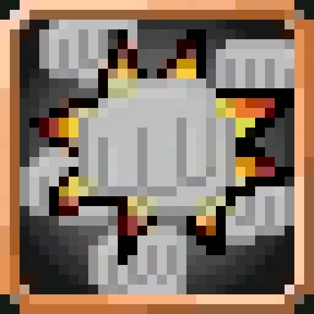
<figcaption>Source media</figcaption>
</figure>

<h2>Bullet Punch</h2>

When mastered, becomes toggleable.

Open reference →

</a>
</article>
<article class="reference-card" data-letter="B" data-search="burrow upstream reference information for burrow.">
<a href="burrow/" aria-label="Open Burrow">
<figure class="reference-card-media reference-card-media--source">
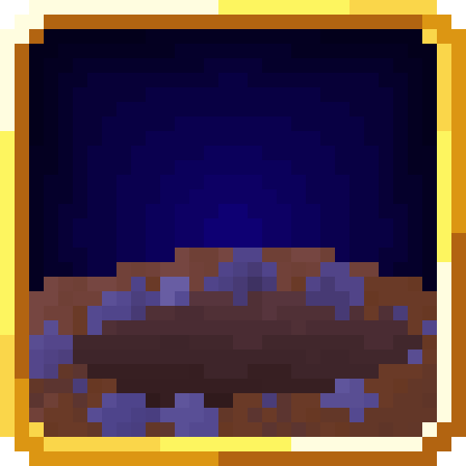
<figcaption>Source media</figcaption>
</figure>

<h2>Burrow</h2>

Upstream reference information for Burrow.

Open reference →

</a>
</article>
<article class="reference-card" data-letter="C" data-search="command undead turn heads as a king of the undead, commanding all nearby undead creatures nearby to attack your appointed target.">
<a href="command-undead/" aria-label="Open Command Undead">
<figure class="reference-card-media reference-card-media--source">
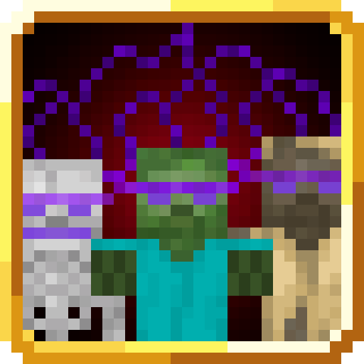
<figcaption>Source media</figcaption>
</figure>

<h2>Command Undead</h2>

Turn heads as a king of the undead, commanding all nearby undead creatures nearby to attack your appointed target.

Open reference →

</a>
</article>
<article class="reference-card" data-letter="C" data-search="contract beware: if the host dies to void damage...this kills both the contracter and contracted. wee woo. even across dimensions. the spirit does not have to be in spectator…">
<a href="contract/" aria-label="Open Contract">
<figure class="reference-card-media reference-card-media--source">
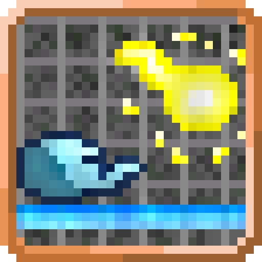
<figcaption>Source media</figcaption>
</figure>

<h2>Contract</h2>

BEWARE: If the host dies to void damage...this kills both the contracter and contracted. Wee Woo. Even across dimensions. The spirit does not have to be in spectator…

Open reference →

</a>
</article>
<article class="reference-card" data-letter="C" data-search="corrosion transform channel your inner corrosion to burn and bleed of the flesh of your enemies">
<a href="corrosion-transform/" aria-label="Open Corrosion Transform">
<figure class="reference-card-media reference-card-media--source">

<figcaption>Source media</figcaption>
</figure>

<h2>Corrosion Transform</h2>

Channel your inner corrosion to burn and bleed of the flesh of your enemies

Open reference →

</a>
</article>
<article class="reference-card" data-letter="C" data-search="corruption will to live every time you check if its been fixed.">
<a href="corruption/" aria-label="Open Corruption">
<figure class="reference-card-media reference-card-media--source">

<figcaption>Source media</figcaption>
</figure>

<h2>Corruption</h2>

will to live every time you check if its been fixed.

Open reference →

</a>
</article>
<article class="reference-card" data-letter="D" data-search="discharge strike a bolt of lightning using your inner bio-electricity generated from a sac within you. can be used without thundering weather.">
<a href="discharge/" aria-label="Open Discharge">
<figure class="reference-card-media reference-card-media--source">

<figcaption>Source media</figcaption>
</figure>

<h2>Discharge</h2>

Strike a bolt of lightning using your inner bio-electricity generated from a sac within you. Can be used without thundering weather.

Open reference →

</a>
</article>
<article class="reference-card" data-letter="D" data-search="dissonance you are the calamity. you are the storm, and you are approaching. strike lightning in all cardinal directions that deal massive electricity damage to all those…">
<a href="dissonance/" aria-label="Open Dissonance">
<figure class="reference-card-media reference-card-media--source">

<figcaption>Source media</figcaption>
</figure>

<h2>Dissonance</h2>

You are the calamity. You are the storm, and you are approaching. Strike lightning in all cardinal directions that deal massive Electricity Damage to all those…

Open reference →

</a>
</article>
<article class="reference-card" data-letter="E" data-search="exoskeleton reinforce your shell, making it much harder and gaining progressively stronger armor depending on your ep. becomes toggleable on mastery">
<a href="exoskeleton/" aria-label="Open Exoskeleton">
<figure class="reference-card-media reference-card-media--source">
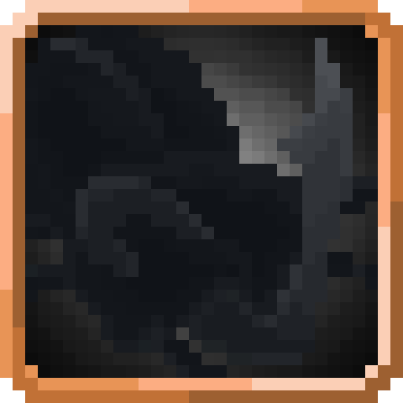
<figcaption>Source media</figcaption>
</figure>

<h2>Exoskeleton</h2>

Reinforce your shell, making it much harder and gaining progressively stronger armor depending on your EP. Becomes Toggleable on mastery

Open reference →

</a>
</article>
<article class="reference-card" data-letter="H" data-search="hell gate your demonic prowess allows you to enter hell at will, creating a portal between both dimensions and instantly warping to the other side.">
<a href="hell-gate/" aria-label="Open Hell Gate">
<figure class="reference-card-media reference-card-media--source">
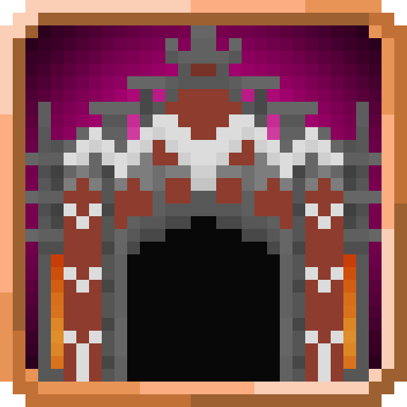
<figcaption>Source media</figcaption>
</figure>

<h2>Hell Gate</h2>

Your demonic prowess allows you to enter Hell at will, creating a portal between both dimensions and instantly warping to the other side.

Open reference →

</a>
</article>
<article class="reference-card" data-letter="H" data-search="hell hall rupture the floor, raising your natural body temperature to liquefy all surfaces around you to molten levels.">
<a href="hell-hall/" aria-label="Open Hell Hall">
<figure class="reference-card-media reference-card-media--source">
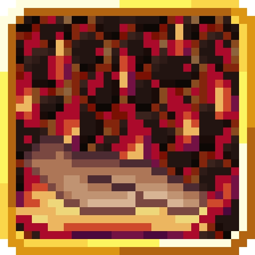
<figcaption>Source media</figcaption>
</figure>

<h2>Hell Hall</h2>

Rupture the floor, raising your natural body temperature to liquefy all surfaces around you to molten levels.

Open reference →

</a>
</article>
<article class="reference-card" data-letter="L" data-search="lethal poison as the king of scorpions, your poison is highly dangerous. an upgrade to the poison skill.">
<a href="lethal-poison/" aria-label="Open Lethal Poison">
<figure class="reference-card-media reference-card-media--source">
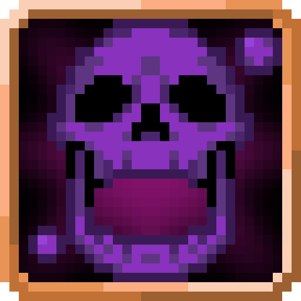
<figcaption>Source media</figcaption>
</figure>

<h2>Lethal Poison</h2>

As the King of Scorpions, your poison is highly dangerous. An upgrade to the Poison skill.

Open reference →

</a>
</article>
<article class="reference-card" data-letter="L" data-search="lightning mode burst forth with great speed and power, enhancing your abilities for a short period of time.">
<a href="lightning-mode/" aria-label="Open Lightning Mode">
<figure class="reference-card-media reference-card-media--source">
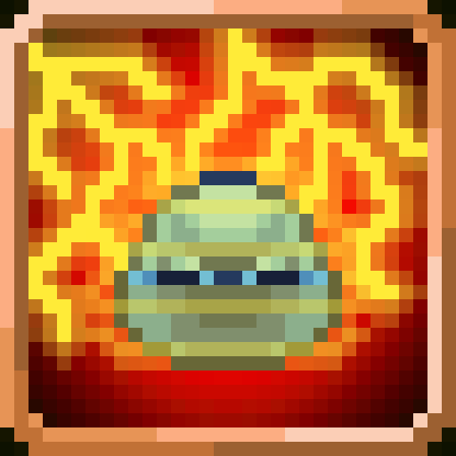
<figcaption>Source media</figcaption>
</figure>

<h2>Lightning Mode</h2>

Burst forth with great speed and power, enhancing your abilities for a short period of time.

Open reference →

</a>
</article>
<article class="reference-card" data-letter="M" data-search="magisteel body have a body made of magisteel, making it much harder and gaining progressively stronger armor depending on your ep.">
<a href="magisteel-body/" aria-label="Open Magisteel Body">
<figure class="reference-card-media reference-card-media--source">
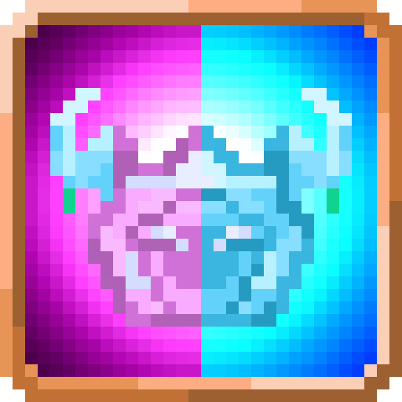
<figcaption>Source media</figcaption>
</figure>

<h2>Magisteel Body</h2>

Have a body made of magisteel, making it much harder and gaining progressively stronger armor depending on your EP.

Open reference →

</a>
</article>
<article class="reference-card" data-letter="P" data-search="paralysis transform channel your inner paralysis to emit paralyzing enzymes that make your target go numb from just your presence">
<a href="paralysis-transform/" aria-label="Open Paralysis Transform">
<figure class="reference-card-media reference-card-media--source">

<figcaption>Source media</figcaption>
</figure>

<h2>Paralysis Transform</h2>

Channel your inner paralysis to emit paralyzing enzymes that make your target go numb from just your presence

Open reference →

</a>
</article>
<article class="reference-card" data-letter="P" data-search="poison transform channel your inner poison to inject deadly venom into your target trough every pore.">
<a href="poison-transform/" aria-label="Open Poison Transform">
<figure class="reference-card-media reference-card-media--source">
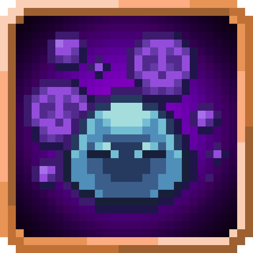
<figcaption>Source media</figcaption>
</figure>

<h2>Poison Transform</h2>

Channel your inner poison to inject deadly venom into your target trough every pore.

Open reference →

</a>
</article>
<article class="reference-card" data-letter="R" data-search="relapse collapse back into whence you came. your memory is fleeting and the people you once knew start to forget you as well. relapse and claim what belongs to you.">
<a href="relapse/" aria-label="Open Relapse">
<figure class="reference-card-media reference-card-media--source">
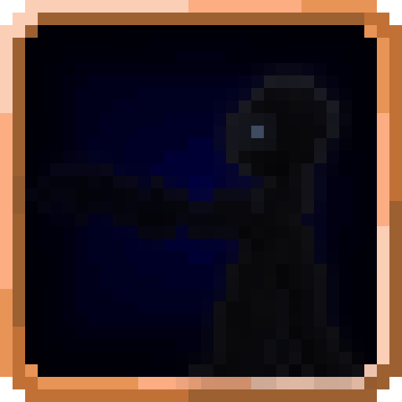
<figcaption>Source media</figcaption>
</figure>

<h2>Relapse</h2>

Collapse back into whence you came. Your memory is fleeting and the people you once knew start to forget you as well. Relapse and claim what belongs to you.

Open reference →

</a>
</article>
<article class="reference-card" data-letter="S" data-search="spark light your fists and weaponry ablaze.&quot;">
<a href="spark/" aria-label="Open Spark">
<figure class="reference-card-media reference-card-media--source">
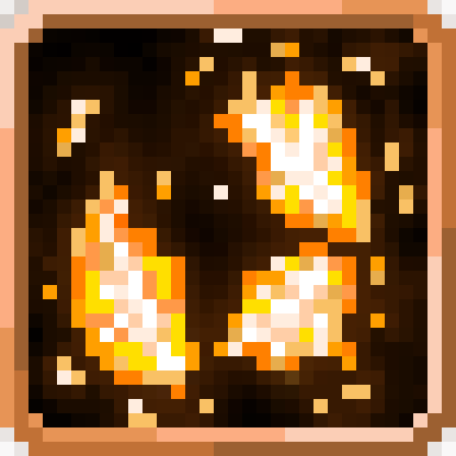
<figcaption>Source media</figcaption>
</figure>

<h2>Spark</h2>

Light your fists and weaponry ablaze.&quot;

Open reference →

</a>
</article>
<article class="reference-card" data-letter="S" data-search="summon wasp spawn army wasps straight from your womb. is that too graphic? well, it is.">
<a href="summon-wasp/" aria-label="Open Summon Wasp">
<figure class="reference-card-media reference-card-media--source">
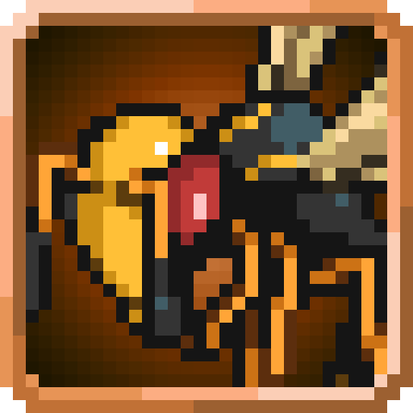
<figcaption>Source media</figcaption>
</figure>

<h2>Summon Wasp</h2>

Spawn Army Wasps straight from your womb. Is that too graphic? Well, it is.

Open reference →

</a>
</article>
<article class="reference-card" data-letter="T" data-search="tenacity become tenacious and repair your body. since magic and mana itself has rejected you, utilise your pure aura alone.">
<a href="tenacity/" aria-label="Open Tenacity">
<figure class="reference-card-media reference-card-media--source">

<figcaption>Source media</figcaption>
</figure>

<h2>Tenacity</h2>

Become tenacious and repair your body. Since magic and mana itself has rejected you, utilise your pure aura alone.

Open reference →

</a>
</article>

No matching articles. Try a broader search.

</section>
