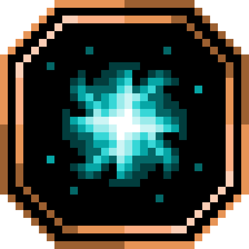

<section class="reference-directory" data-reference-directory="skills/other">
<header class="reference-directory-hero reference-theme-abilities">

Tensura reference collection

<h1>Other Skills</h1>

Skills outside the primary class directories.

<strong>2</strong> articles

</header>

<label class="reference-filter-label">
Filter this collection
<input type="search" class="reference-filter-input" placeholder="Search titles and summaries…" autocomplete="off">
</label>

<button type="button" class="is-active" data-letter="all" aria-pressed="true">All</button>
<button type="button" data-letter="A" aria-pressed="false">A</button>
<button type="button" data-letter="S" aria-pressed="false">S</button>

Showing 2 of 2 articles

<article class="reference-card" data-letter="A" data-search="abilities you only celebrate in the light because i allow it.">
<a href="abilities/" aria-label="Open Abilities">
<figure class="reference-card-media reference-card-media--source">

<figcaption>Source media</figcaption>
</figure>

<h2>Abilities</h2>

You only celebrate in the light because I allow it.

Open reference →

</a>
</article>
<article class="reference-card" data-letter="S" data-search="skills intrinsic skills extra skills unique skills">
<a href="abilities-skills/" aria-label="Open Skills">
<figure class="reference-card-media reference-card-media--source">

<figcaption>Source media</figcaption>
</figure>

<h2>Skills</h2>

Intrinsic Skills Extra Skills Unique Skills

Open reference →

</a>
</article>

No matching articles. Try a broader search.

</section>
