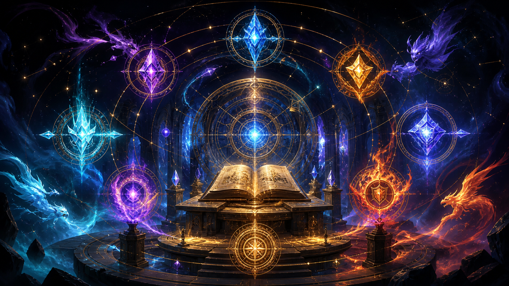
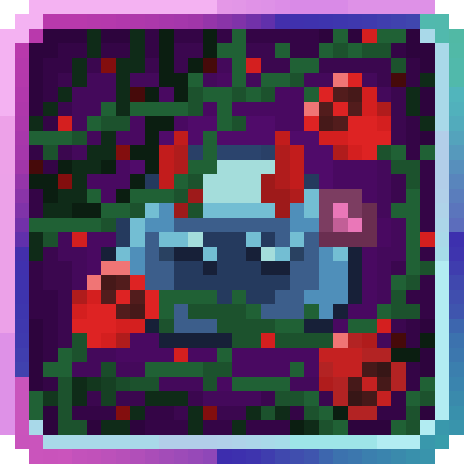
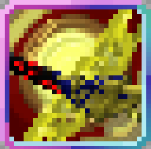
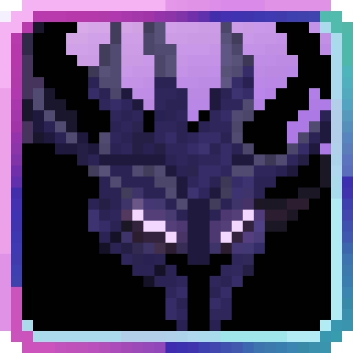
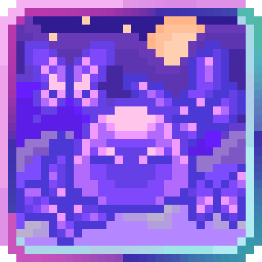
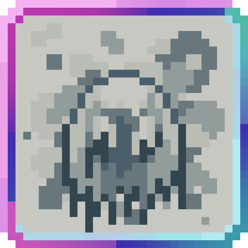
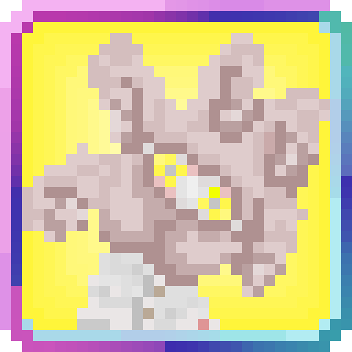
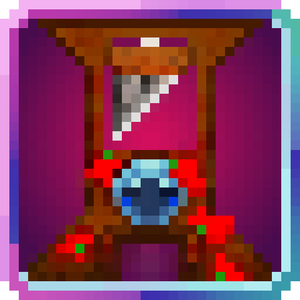
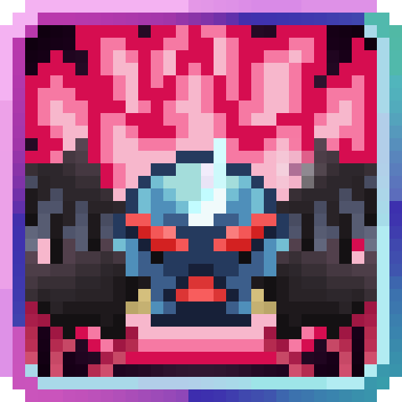

<section class="reference-directory" data-reference-directory="skills/ultimate">
<header class="reference-directory-hero reference-theme-abilities">

Tensura reference collection

<h1>Ultimate Skills</h1>

Ultimate-class skills and related evolutions.

<strong>33</strong> articles

</header>

<label class="reference-filter-label">
Filter this collection
<input type="search" class="reference-filter-input" placeholder="Search titles and summaries…" autocomplete="off">
</label>

<button type="button" class="is-active" data-letter="all" aria-pressed="true">All</button>
<button type="button" data-letter="A" aria-pressed="false">A</button>
<button type="button" data-letter="B" aria-pressed="false">B</button>
<button type="button" data-letter="D" aria-pressed="false">D</button>
<button type="button" data-letter="G" aria-pressed="false">G</button>
<button type="button" data-letter="H" aria-pressed="false">H</button>
<button type="button" data-letter="I" aria-pressed="false">I</button>
<button type="button" data-letter="L" aria-pressed="false">L</button>
<button type="button" data-letter="M" aria-pressed="false">M</button>
<button type="button" data-letter="O" aria-pressed="false">O</button>
<button type="button" data-letter="P" aria-pressed="false">P</button>
<button type="button" data-letter="S" aria-pressed="false">S</button>
<button type="button" data-letter="T" aria-pressed="false">T</button>
<button type="button" data-letter="U" aria-pressed="false">U</button>
<button type="button" data-letter="V" aria-pressed="false">V</button>
<button type="button" data-letter="X" aria-pressed="false">X</button>

Showing 33 of 33 articles

<article class="reference-card" data-letter="A" data-search="adephaga, lord of devouring &quot;you are no god... but i shall feast upon your essence regardless!&quot; ...now, where have you heard that from?">
<a href="adephaga/" aria-label="Open Adephaga, Lord Of Devouring">
<figure class="reference-card-media reference-card-media--source">

<figcaption>Source media</figcaption>
</figure>

<h2>Adephaga, Lord Of Devouring</h2>

&quot;You are no god... but I shall feast upon your essence regardless!&quot; ...Now, where have you heard that from?

Open reference →

</a>
</article>
<article class="reference-card" data-letter="A" data-search="amaterasu, lord of shimmering flame command not just your troops, but the essence of fire and flames itself. a mark truly worthy of a warrior of your caliber.">
<a href="amaterasu/" aria-label="Open Amaterasu, Lord of Shimmering Flame">
<figure class="reference-card-media reference-card-media--source">

<figcaption>Source media</figcaption>
</figure>

<h2>Amaterasu, Lord of Shimmering Flame</h2>

Command not just your troops, but the essence of Fire and Flames itself. A mark truly worthy of a warrior of your caliber.

Open reference →

</a>
</article>
<article class="reference-card" data-letter="A" data-search="ame-no-uzume-no-mikoto, lord of entertainment you&#x27;ve managed to transcend the limits of your innate abilities. now borrowing the name of a deity, make the audience smile. enrapture them and captivate. you are an…">
<a href="ame-no-uzume-no-mikoto/" aria-label="Open Ame-no-Uzume-no-Mikoto, Lord of Entertainment">
<figure class="reference-card-media reference-card-media--source">

<figcaption>Source media</figcaption>
</figure>

<h2>Ame-no-Uzume-no-Mikoto, Lord of Entertainment</h2>

You&#x27;ve managed to transcend the limits of your innate abilities. Now borrowing the name of a deity, make the audience smile. Enrapture them and captivate. You are an…

Open reference →

</a>
</article>
<article class="reference-card" data-letter="A" data-search="antaeus, lord of opposition gravity and the forces of attraction bend to your every whim. some could even say you are limitless.">
<a href="antaeus/" aria-label="Open Antaeus, Lord Of Opposition">
<figure class="reference-card-media reference-card-media--source">

<figcaption>Source media</figcaption>
</figure>

<h2>Antaeus, Lord Of Opposition</h2>

Gravity and the forces of attraction bend to your every whim. Some could even say you are limitless.

Open reference →

</a>
</article>
<article class="reference-card" data-letter="A" data-search="antevorta, lord of predictions the future belongs to you alone. seize your opportunities and let none go to waste.">
<a href="antevorta/" aria-label="Open Antevorta, Lord Of Predictions">
<figure class="reference-card-media reference-card-media--source">

<figcaption>Source media</figcaption>
</figure>

<h2>Antevorta, Lord Of Predictions</h2>

The future belongs to you alone. Seize your opportunities and let none go to waste.

Open reference →

</a>
</article>
<article class="reference-card" data-letter="A" data-search="antithesis, lord of inversion w.i.p">
<a href="antithesis/" aria-label="Open Antithesis, Lord of Inversion">
<figure class="reference-card-media reference-card-media--source">

<figcaption>Source media</figcaption>
</figure>

<h2>Antithesis, Lord of Inversion</h2>

W.I.P

Open reference →

</a>
</article>
<article class="reference-card" data-letter="A" data-search="apollo, lord of music sing the songs of war, death and destruction. use sound to create super powerful blasts which ignore armor. fine tune your hearing even further.">
<a href="apollo/" aria-label="Open Apollo, Lord Of Music">
<figure class="reference-card-media reference-card-media--source">

<figcaption>Source media</figcaption>
</figure>

<h2>Apollo, Lord Of Music</h2>

Sing the songs of war, death and destruction. Use sound to create super powerful blasts which ignore armor. Fine tune your hearing even further.

Open reference →

</a>
</article>
<article class="reference-card" data-letter="A" data-search="asmodeus, lord of lust upstream reference information for asmodeus, lord of lust.">
<a href="asmodeus/" aria-label="Open Asmodeus, Lord of Lust">
<figure class="reference-card-media reference-card-media--source">

<figcaption>Source media</figcaption>
</figure>

<h2>Asmodeus, Lord of Lust</h2>

Upstream reference information for Asmodeus, Lord of Lust.

Open reference →

</a>
</article>
<article class="reference-card" data-letter="B" data-search="beelzebub, lord of gourmet damn, so hungry bring me nuggets">
<a href="beelzebub/" aria-label="Open Beelzebub, Lord Of Gourmet">
<figure class="reference-card-media reference-card-media--source">

<figcaption>Source media</figcaption>
</figure>

<h2>Beelzebub, Lord Of Gourmet</h2>

Damn, so hungry bring me nuggets

Open reference →

</a>
</article>
<article class="reference-card" data-letter="B" data-search="belphegor, lord of sloth your enemies falls to their knees around you, unable to support your aura of stillness.">
<a href="belphegor/" aria-label="Open Belphegor, Lord of Sloth">
<figure class="reference-card-media reference-card-media--source">

<figcaption>Source media</figcaption>
</figure>

<h2>Belphegor, Lord of Sloth</h2>

Your enemies falls to their knees around you, unable to support your aura of stillness.

Open reference →

</a>
</article>
<article class="reference-card" data-letter="B" data-search="bushyasta, lord of stagnation the antithesis to progress, you cause the world to cease all change around you, locking your enemies in temporal stasis, stopping the very flow of their life force, and…">
<a href="bushyasta/" aria-label="Open Bushyasta, Lord Of Stagnation">
<figure class="reference-card-media reference-card-media--source">

<figcaption>Source media</figcaption>
</figure>

<h2>Bushyasta, Lord Of Stagnation</h2>

The antithesis to progress, you cause the world to cease all change around you, locking your enemies in temporal stasis, stopping the very flow of their life force, and…

Open reference →

</a>
</article>
<article class="reference-card" data-letter="D" data-search="dionysus, lord of crashing the true essence of the destroyer. decimate and remove all threats from existence and delete chunks with your indomitable will.">
<a href="dionysus/" aria-label="Open Dionysus, Lord of Crashing">
<figure class="reference-card-media reference-card-media--source">

<figcaption>Source media</figcaption>
</figure>

<h2>Dionysus, Lord of Crashing</h2>

The true essence of the destroyer. Decimate and remove all threats from existence and delete chunks with your indomitable will.

Open reference →

</a>
</article>
<article class="reference-card" data-letter="G" data-search="galileo, lord of observation the true-sight of one who has mastered their instincts, able to notice all at a moment&#x27;s glance. petrify your enemies and turn them into dust. nothing escapes your…">
<a href="galileo/" aria-label="Open Galileo, Lord of Observation">
<figure class="reference-card-media reference-card-media--source">

<figcaption>Source media</figcaption>
</figure>

<h2>Galileo, Lord of Observation</h2>

The true-sight of one who has mastered their instincts, able to notice all at a moment&#x27;s glance. Petrify your enemies and turn them into dust. Nothing escapes your…

Open reference →

</a>
</article>
<article class="reference-card" data-letter="G" data-search="gilgamesh, lord of treasures there are two kinds of arrogance. one where you are unequal to the task and one where your dreams are too big. the former is commonplace stupidity… but the latter is a…">
<a href="gilgamesh/" aria-label="Open Gilgamesh, Lord Of Treasures">
<figure class="reference-card-media reference-card-media--source">

<figcaption>Source media</figcaption>
</figure>

<h2>Gilgamesh, Lord Of Treasures</h2>

There are two kinds of arrogance. One where you are unequal to the task and one where your dreams are too big. The former is commonplace stupidity… but the latter is a…

Open reference →

</a>
</article>
<article class="reference-card" data-letter="H" data-search="hades, lord of death destroy all, kill all. your reputation as the visage of death precedes you. execute your enemies with clones and strong, stacking debuffs, including one that can double…">
<a href="hades/" aria-label="Open Hades, Lord of Death">
<figure class="reference-card-media reference-card-media--source">

<figcaption>Source media</figcaption>
</figure>

<h2>Hades, Lord of Death</h2>

Destroy all, kill all. Your reputation as the Visage of Death precedes you. Execute your enemies with clones and strong, stacking debuffs, including one that can double…

Open reference →

</a>
</article>
<article class="reference-card" data-letter="H" data-search="heracles, lord of the hunt breathe. one misstep and your power... breathe. it could even slay a god. breathe.">
<a href="heracles/" aria-label="Open Heracles, Lord Of The Hunt">
<figure class="reference-card-media reference-card-media--source">

<figcaption>Source media</figcaption>
</figure>

<h2>Heracles, Lord Of The Hunt</h2>

Breathe. One misstep and your power... Breathe. It could even slay a God. Breathe.

Open reference →

</a>
</article>
<article class="reference-card" data-letter="I" data-search="ignis, lord of explosions harness the power of fire and destruction to dominate your surroundings.">
<a href="ignis/" aria-label="Open Ignis, Lord of Explosions">
<figure class="reference-card-media reference-card-media--source">

<figcaption>Source media</figcaption>
</figure>

<h2>Ignis, Lord of Explosions</h2>

Harness the power of fire and destruction to dominate your surroundings.

Open reference →

</a>
</article>
<article class="reference-card" data-letter="I" data-search="invictus, lord of victory you are deemed god&#x27;s chosen warrior, an emperor who does not know the meaning of loss, a being whose very presence shatters the morale of his enemies, and uplifts the…">
<a href="invictus/" aria-label="Open Invictus, Lord Of Victory">
<figure class="reference-card-media reference-card-media--source">

<figcaption>Source media</figcaption>
</figure>

<h2>Invictus, Lord Of Victory</h2>

You are deemed god&#x27;s chosen warrior, an emperor who does not know the meaning of loss, a being whose very presence shatters the morale of his enemies, and uplifts the…

Open reference →

</a>
</article>
<article class="reference-card" data-letter="L" data-search="laverna, lord of vainglory is this the domain of the one who is regarded as the ruler of the shadows? perhaps it is. but only you know the real answer. something deep inside of you stirs. let it…">
<a href="laverna/" aria-label="Open Laverna, Lord Of Vainglory">
<figure class="reference-card-media reference-card-media--source">

<figcaption>Source media</figcaption>
</figure>

<h2>Laverna, Lord Of Vainglory</h2>

Is this the domain of the one who is regarded as the ruler of the Shadows? Perhaps it is. But only you know the real answer. Something deep inside of you stirs. Let it…

Open reference →

</a>
</article>
<article class="reference-card" data-letter="M" data-search="mephisto, lord of fantasy the over-arching lord of fantasy is able to destroy all and pull them into a world where the user&#x27;s desires come first and foremost. just remember, no matter how many…">
<a href="mephisto/" aria-label="Open Mephisto, Lord Of Fantasy">
<figure class="reference-card-media reference-card-media--source">

<figcaption>Source media</figcaption>
</figure>

<h2>Mephisto, Lord Of Fantasy</h2>

The over-arching Lord of Fantasy is able to destroy all and pull them into a world where the user&#x27;s desires come first and foremost. Just remember, no matter how many…

Open reference →

</a>
</article>
<article class="reference-card" data-letter="O" data-search="oizys, lord of melancholy the overwhelming grief of the sins of transgressions long past have come back to haunt you. will you make the right choice this time?">
<a href="oizys/" aria-label="Open Oizys, Lord Of Melancholy">
<figure class="reference-card-media reference-card-media--source">

<figcaption>Source media</figcaption>
</figure>

<h2>Oizys, Lord Of Melancholy</h2>

The overwhelming grief of the sins of transgressions long past have come back to haunt you. Will you make the right choice this time?

Open reference →

</a>
</article>
<article class="reference-card" data-letter="P" data-search="pernida, lord of compliance the left hand of god">
<a href="pernida/" aria-label="Open Pernida, Lord Of Compliance">
<figure class="reference-card-media reference-card-media--source">

<figcaption>Source media</figcaption>
</figure>

<h2>Pernida, Lord Of Compliance</h2>

The Left Hand of God

Open reference →

</a>
</article>
<article class="reference-card" data-letter="S" data-search="sandalphon, lord of condemnation serve as the hammer of justice, delivering retribution upon those who have defied it.">
<a href="sandalphon/" aria-label="Open Sandalphon, Lord Of Condemnation">
<figure class="reference-card-media reference-card-media--source">

<figcaption>Source media</figcaption>
</figure>

<h2>Sandalphon, Lord Of Condemnation</h2>

Serve as the hammer of Justice, delivering retribution upon those who have defied it.

Open reference →

</a>
</article>
<article class="reference-card" data-letter="S" data-search="sariel, lord of hope a beacon of unwavering hope and heroism, inspiring allies and unleashing divine resolve to shape destiny.">
<a href="sariel/" aria-label="Open Sariel, Lord Of Hope">
<figure class="reference-card-media reference-card-media--source">

<figcaption>Source media</figcaption>
</figure>

<h2>Sariel, Lord Of Hope</h2>

A beacon of unwavering hope and heroism, inspiring allies and unleashing divine resolve to shape destiny.

Open reference →

</a>
</article>
<article class="reference-card" data-letter="S" data-search="satanael, lord of wrath the world bows to your endless wrath. unleash pure unbridled rage and use it to get infinitely stronger the longer your anger persists.">
<a href="satanael/" aria-label="Open Satanael, Lord of Wrath">
<figure class="reference-card-media reference-card-media--source">

<figcaption>Source media</figcaption>
</figure>

<h2>Satanael, Lord of Wrath</h2>

The world bows to your endless Wrath. Unleash pure unbridled rage and use it to get infinitely stronger the longer your anger persists.

Open reference →

</a>
</article>
<article class="reference-card" data-letter="S" data-search="sephirot, lord of life play with the fickle force of life like it was thread on the water. gain control over the ethereal forces of life and death. remember that as long as you live, death is…">
<a href="sephirot/" aria-label="Open Sephirot, Lord Of Life">
<figure class="reference-card-media reference-card-media--source">

<figcaption>Source media</figcaption>
</figure>

<h2>Sephirot, Lord Of Life</h2>

Play with the fickle force of Life like it was thread on the water. Gain control over the ethereal forces of life and death. Remember that as long as you live, death is…

Open reference →

</a>
</article>
<article class="reference-card" data-letter="S" data-search="susano&#x27;o, lord of tyranny bend reality to ensure your enemies meet their demise. break every obstacle and twist the fabric of existence itself. regard all phenomena null and crumble all into dust.">
<a href="susano-o/" aria-label="Open Susano&#x27;o, Lord of Tyranny">
<figure class="reference-card-media reference-card-media--source">

<figcaption>Source media</figcaption>
</figure>

<h2>Susano&#x27;o, Lord of Tyranny</h2>

Bend reality to ensure your enemies meet their demise. Break every obstacle and twist the fabric of existence itself. Regard all phenomena null and crumble all into dust.

Open reference →

</a>
</article>
<article class="reference-card" data-letter="T" data-search="takemikazuchi, lord of combat become the ruler of physical combat. gain increased reaction speed and attack speed while channeling all your power into melee attacks, and accelerate to lightspeed…">
<a href="takemikazuchi/" aria-label="Open Takemikazuchi, Lord of Combat">
<figure class="reference-card-media reference-card-media--source">

<figcaption>Source media</figcaption>
</figure>

<h2>Takemikazuchi, Lord of Combat</h2>

Become the ruler of physical combat. Gain increased reaction speed and attack speed while channeling all your power into melee attacks, and accelerate to lightspeed…

Open reference →

</a>
</article>
<article class="reference-card" data-letter="T" data-search="tsukuyomi, lord of moon shadow manipulate perception and move beyond time and space. manifest countless forms that copy your skills, control minds, and erase all obstacles in your path.">
<a href="tsukuyomi/" aria-label="Open Tsukuyomi, Lord of Moon Shadow">
<figure class="reference-card-media reference-card-media--source">

<figcaption>Source media</figcaption>
</figure>

<h2>Tsukuyomi, Lord of Moon Shadow</h2>

Manipulate perception and move beyond time and space. Manifest countless forms that copy your skills, control minds, and erase all obstacles in your path.

Open reference →

</a>
</article>
<article class="reference-card" data-letter="U" data-search="ultimate skill aquisition to evolve a unique skill to an ultimate skill, all of the following requirements have to be met">
<a href="ultimate-skill-aquisition/" aria-label="Open Ultimate Skill Aquisition">
<figure class="reference-card-media reference-card-media--source">

<figcaption>Source media</figcaption>
</figure>

<h2>Ultimate Skill Aquisition</h2>

To evolve a unique skill to an ultimate skill, all of the following requirements have to be met

Open reference →

</a>
</article>
<article class="reference-card" data-letter="U" data-search="uriel, lord of oath the ultimate shield against any attack, control the laws of the world to your liking and become unstoppable.">
<a href="uriel/" aria-label="Open Uriel, Lord Of Oath">
<figure class="reference-card-media reference-card-media--source">

<figcaption>Source media</figcaption>
</figure>

<h2>Uriel, Lord Of Oath</h2>

The Ultimate shield against any attack, control the laws of the world to your liking and become unstoppable.

Open reference →

</a>
</article>
<article class="reference-card" data-letter="V" data-search="viciel, lord of lurking transcend the limits of the mortal realm as the one true commander over the shadows and stealth. you truly are a monster, melding anything and everything together.">
<a href="viciel/" aria-label="Open Viciel, Lord Of Lurking">
<figure class="reference-card-media reference-card-media--source">

<figcaption>Source media</figcaption>
</figure>

<h2>Viciel, Lord Of Lurking</h2>

Transcend the limits of the mortal realm as the one true commander over the shadows and stealth. You truly are a monster, melding anything and everything together.

Open reference →

</a>
</article>
<article class="reference-card" data-letter="X" data-search="xezbeth, lord of lies you sit atop a throne. a throne built by lies. deceive all who stand before you and play the fool. but this time, you will have the last laugh.">
<a href="xezbeth/" aria-label="Open Xezbeth, Lord of Lies">
<figure class="reference-card-media reference-card-media--source">

<figcaption>Source media</figcaption>
</figure>

<h2>Xezbeth, Lord of Lies</h2>

You sit atop a throne. A throne built by lies. Deceive all who stand before you and play The Fool. But this time, you will have the last laugh.

Open reference →

</a>
</article>

No matching articles. Try a broader search.

</section>
