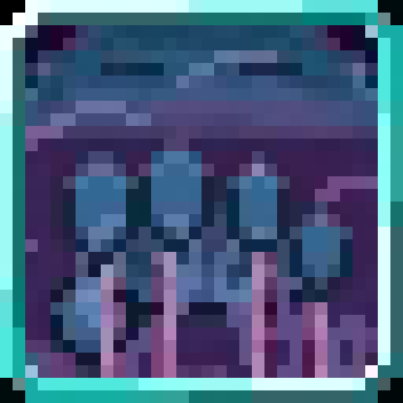

<section class="reference-directory" data-reference-directory="skills/unique">
<header class="reference-directory-hero reference-theme-abilities">

Tensura reference collection

<h1>Unique Skills</h1>

Unique-class skills and their documented mechanics.

<strong>33</strong> articles

</header>

<label class="reference-filter-label">
Filter this collection
<input type="search" class="reference-filter-input" placeholder="Search titles and summaries…" autocomplete="off">
</label>

<button type="button" class="is-active" data-letter="all" aria-pressed="true">All</button>
<button type="button" data-letter="B" aria-pressed="false">B</button>
<button type="button" data-letter="C" aria-pressed="false">C</button>
<button type="button" data-letter="D" aria-pressed="false">D</button>
<button type="button" data-letter="E" aria-pressed="false">E</button>
<button type="button" data-letter="G" aria-pressed="false">G</button>
<button type="button" data-letter="H" aria-pressed="false">H</button>
<button type="button" data-letter="I" aria-pressed="false">I</button>
<button type="button" data-letter="K" aria-pressed="false">K</button>
<button type="button" data-letter="M" aria-pressed="false">M</button>
<button type="button" data-letter="P" aria-pressed="false">P</button>
<button type="button" data-letter="R" aria-pressed="false">R</button>
<button type="button" data-letter="S" aria-pressed="false">S</button>
<button type="button" data-letter="T" aria-pressed="false">T</button>
<button type="button" data-letter="V" aria-pressed="false">V</button>
<button type="button" data-letter="Z" aria-pressed="false">Z</button>

Showing 33 of 33 articles

<article class="reference-card" data-letter="B" data-search="butcher oh, your heart, aortic work of art, my love, my knife">
<a href="butcher/" aria-label="Open Butcher">
<figure class="reference-card-media reference-card-media--source">

<figcaption>Source media</figcaption>
</figure>

<h2>Butcher</h2>

Oh, your heart, Aortic work of art, My love, my knife

Open reference →

</a>
</article>
<article class="reference-card" data-letter="C" data-search="captivator your previous life, you were the brightest, shining star. your ability to turn lies into truths… perhaps it’s the other way around? whatever it may be, your eyes shine…">
<a href="captivator/" aria-label="Open Captivator">
<figure class="reference-card-media reference-card-media--source">

<figcaption>Source media</figcaption>
</figure>

<h2>Captivator</h2>

Your previous life, you were the brightest, shining star. Your ability to turn lies into truths… Perhaps it’s the other way around? Whatever it may be, your eyes shine…

Open reference →

</a>
</article>
<article class="reference-card" data-letter="C" data-search="coalescence za warudo!!! wait, wrong one? oh well, we got time, itll be fixed later">
<a href="coalescence/" aria-label="Open Coalescence">
<figure class="reference-card-media reference-card-media--source">

<figcaption>Source media</figcaption>
</figure>

<h2>Coalescence</h2>

ZA WARUDO!!! Wait, wrong one? Oh well, we got time, itll be fixed later

Open reference →

</a>
</article>
<article class="reference-card" data-letter="C" data-search="compulsor wip">
<a href="compulsor/" aria-label="Open Compulsor">
<figure class="reference-card-media reference-card-media--source">

<figcaption>Source media</figcaption>
</figure>

<h2>Compulsor</h2>

WIP

Open reference →

</a>
</article>
<article class="reference-card" data-letter="C" data-search="constant after 15 seconds of holding this ability down, this mode automatically turns off with a longer cooldown of 15 seconds.">
<a href="constant/" aria-label="Open Constant">
<figure class="reference-card-media reference-card-media--source">

<figcaption>Source media</figcaption>
</figure>

<h2>Constant</h2>

After 15 seconds of holding this ability down, this mode automatically turns off with a longer cooldown of 15 seconds.

Open reference →

</a>
</article>
<article class="reference-card" data-letter="C" data-search="corroder corroder? more toxic than my ex somehow">
<a href="corroder/" aria-label="Open Corroder">
<figure class="reference-card-media reference-card-media--source">

<figcaption>Source media</figcaption>
</figure>

<h2>Corroder</h2>

Corroder? More toxic than my ex somehow

Open reference →

</a>
</article>
<article class="reference-card" data-letter="C" data-search="crasher the essence of &quot;deletion&quot;. completely and utterly erase your foes from the plane of existence with the power of your sheer will alone.">
<a href="crasher/" aria-label="Open Crasher">
<figure class="reference-card-media reference-card-media--source">

<figcaption>Source media</figcaption>
</figure>

<h2>Crasher</h2>

The essence of &quot;deletion&quot;. Completely and utterly erase your foes from the plane of existence with the power of your sheer will alone.

Open reference →

</a>
</article>
<article class="reference-card" data-letter="C" data-search="cultivator embody the relentless pursuit of ascension, gathering and refining energy to reach unparalleled heights. a cultivator walks the path of self-perfection and dominion…">
<a href="cultivator/" aria-label="Open Cultivator">
<figure class="reference-card-media reference-card-media--source">

<figcaption>Source media</figcaption>
</figure>

<h2>Cultivator</h2>

Embody the relentless pursuit of ascension, gathering and refining energy to reach unparalleled heights. A Cultivator walks the path of self-perfection and dominion…

Open reference →

</a>
</article>
<article class="reference-card" data-letter="D" data-search="dreamer save your current health, shp, magicules, aura, and location. reactivating dream will restore your stats back to the saved values and instantly teleport you to the…">
<a href="dreamer/" aria-label="Open Dreamer">
<figure class="reference-card-media reference-card-media--source">

<figcaption>Source media</figcaption>
</figure>

<h2>Dreamer</h2>

Save your current health, SHP, magicules, aura, and location. Reactivating Dream will restore your stats back to the saved values and instantly teleport you to the…

Open reference →

</a>
</article>
<article class="reference-card" data-letter="E" data-search="engineer tinkering and tinkering. no one understood the machines as much as you did. in fact, no one understood you either. perhaps it was always meant to be.">
<a href="engineer/" aria-label="Open Engineer">
<figure class="reference-card-media reference-card-media--source">

<figcaption>Source media</figcaption>
</figure>

<h2>Engineer</h2>

Tinkering and tinkering. No one understood the machines as much as you did. In fact, no one understood you either. Perhaps it was always meant to be.

Open reference →

</a>
</article>
<article class="reference-card" data-letter="G" data-search="gardener the crops, the wild, everything was there for you. you sow the seeds and wish only for a bountiful harvest. and in turn, the crops bless you.">
<a href="gardener/" aria-label="Open Gardener">
<figure class="reference-card-media reference-card-media--source">

<figcaption>Source media</figcaption>
</figure>

<h2>Gardener</h2>

The crops, the wild, everything was there for you. You sow the seeds and wish only for a bountiful harvest. And in turn, the crops bless you.

Open reference →

</a>
</article>
<article class="reference-card" data-letter="G" data-search="gatekeeper wield the authority of kings and command treasures beyond mortal reach. summon divine armaments from the vault, binding foes in chains of judgment while asserting…">
<a href="gatekeeper/" aria-label="Open Gatekeeper">
<figure class="reference-card-media reference-card-media--source">

<figcaption>Source media</figcaption>
</figure>

<h2>Gatekeeper</h2>

Wield the authority of kings and command treasures beyond mortal reach. Summon divine armaments from the vault, binding foes in chains of judgment while asserting…

Open reference →

</a>
</article>
<article class="reference-card" data-letter="H" data-search="hidden ruler the one who lurks in the shadows... just waiting for things to happen. the one who answers your questions at every call...">
<a href="hidden-ruler/" aria-label="Open Hidden Ruler">
<figure class="reference-card-media reference-card-media--source">

<figcaption>Source media</figcaption>
</figure>

<h2>Hidden Ruler</h2>

The one who lurks in the shadows... Just waiting for things to happen. The one who answers your questions at every call...

Open reference →

</a>
</article>
<article class="reference-card" data-letter="I" data-search="inverse w.i.p">
<a href="inverse/" aria-label="Open Inverse">
<figure class="reference-card-media reference-card-media--source">

<figcaption>Source media</figcaption>
</figure>

<h2>Inverse</h2>

W.I.P

Open reference →

</a>
</article>
<article class="reference-card" data-letter="K" data-search="kyurem &quot;a husk of what you formally were. the leftovers, discarded without a second thought when the split happened. coldness seeps through your skin as you freeze everything…">
<a href="kyurem/" aria-label="Open Kyurem">
<figure class="reference-card-media reference-card-media--source">

<figcaption>Source media</figcaption>
</figure>

<h2>Kyurem</h2>

&quot;A husk of what you formally were. The leftovers, discarded without a second thought when the split happened. Coldness seeps through your skin as you freeze everything…

Open reference →

</a>
</article>
<article class="reference-card" data-letter="M" data-search="malleable [sub-skill] cold clay - the user will learn flame attack resistance when malleable is acquired.">
<a href="malleable/" aria-label="Open Malleable">
<figure class="reference-card-media reference-card-media--source">

<figcaption>Source media</figcaption>
</figure>

<h2>Malleable</h2>

[Sub-Skill] Cold Clay - The user will learn Flame Attack Resistance when Malleable is acquired.

Open reference →

</a>
</article>
<article class="reference-card" data-letter="M" data-search="melancholy summon an aura of sorrow that slows and weakens nearby enemies, filling them with despair. the skill also throws objects or air, amplifying the feeling of hopelessness…">
<a href="melancholy/" aria-label="Open Melancholy">
<figure class="reference-card-media reference-card-media--source">

<figcaption>Source media</figcaption>
</figure>

<h2>Melancholy</h2>

Summon an aura of sorrow that slows and weakens nearby enemies, filling them with despair. The skill also throws objects or air, amplifying the feeling of hopelessness…

Open reference →

</a>
</article>
<article class="reference-card" data-letter="P" data-search="phaser &quot;when a man learns to love, he must also bear the risk of carrying hate&quot;">
<a href="phaser/" aria-label="Open Phaser">
<figure class="reference-card-media reference-card-media--source">

<figcaption>Source media</figcaption>
</figure>

<h2>Phaser</h2>

&quot;When a man learns to love, he must also bear the risk of carrying hate&quot;

Open reference →

</a>
</article>
<article class="reference-card" data-letter="P" data-search="plunderer blend the shadows together for a perfect mix of discord and harmony. rule over them and destroy all who dare to disrupt the shadow monarch&#x27;s reign.">
<a href="plunderer/" aria-label="Open Plunderer">
<figure class="reference-card-media reference-card-media--source">

<figcaption>Source media</figcaption>
</figure>

<h2>Plunderer</h2>

Blend the shadows together for a perfect mix of discord and harmony. Rule over them and destroy all who dare to disrupt the Shadow Monarch&#x27;s reign.

Open reference →

</a>
</article>
<article class="reference-card" data-letter="P" data-search="provider here, take my glorious stuff! (i like these texts)">
<a href="provider/" aria-label="Open Provider">
<figure class="reference-card-media reference-card-media--source">

<figcaption>Source media</figcaption>
</figure>

<h2>Provider</h2>

HERE, TAKE MY GLORIOUS STUFF! (I like these texts)

Open reference →

</a>
</article>
<article class="reference-card" data-letter="R" data-search="reducer damn bro, no magicules?">
<a href="reducer/" aria-label="Open Reducer">
<figure class="reference-card-media reference-card-media--source">

<figcaption>Source media</figcaption>
</figure>

<h2>Reducer</h2>

Damn bro, no magicules?

Open reference →

</a>
</article>
<article class="reference-card" data-letter="R" data-search="repeater any physical damage you perform will be repeated a second time.">
<a href="repeater/" aria-label="Open Repeater">
<figure class="reference-card-media reference-card-media--source">

<figcaption>Source media</figcaption>
</figure>

<h2>Repeater</h2>

Any physical damage you perform will be repeated a second time.

Open reference →

</a>
</article>
<article class="reference-card" data-letter="R" data-search="reshiram &quot;you seek to build a world of truths. are you prepared to scorch and burn everything in your path to make the truthful world you seek so badly?&quot;">
<a href="reshiram/" aria-label="Open Reshiram">
<figure class="reference-card-media reference-card-media--source">

<figcaption>Source media</figcaption>
</figure>

<h2>Reshiram</h2>

&quot;You seek to build a world of Truths. Are you prepared to scorch and burn everything in your path to make the truthful world you seek so badly?&quot;

Open reference →

</a>
</article>
<article class="reference-card" data-letter="R" data-search="restricted the user of this skill can no longer gain any magicules, nor gain any more skills (except for the ones provided to them on reincarnation by their race, or if a skill…">
<a href="restricted/" aria-label="Open Restricted">
<figure class="reference-card-media reference-card-media--source">

<figcaption>Source media</figcaption>
</figure>

<h2>Restricted</h2>

The user of this skill can no longer gain any magicules, nor gain any more skills (except for the ones provided to them on reincarnation by their race, OR if a skill…

Open reference →

</a>
</article>
<article class="reference-card" data-letter="S" data-search="scholar have you heard about the scholar of 53?">
<a href="scholar/" aria-label="Open Scholar">
<figure class="reference-card-media reference-card-media--source">

<figcaption>Source media</figcaption>
</figure>

<h2>Scholar</h2>

Have you heard about the Scholar of 53?

Open reference →

</a>
</article>
<article class="reference-card" data-letter="S" data-search="schrodinger schrodinger? like the cat?">
<a href="schrodinger/" aria-label="Open Schrodinger">
<figure class="reference-card-media reference-card-media--source">

<figcaption>Source media</figcaption>
</figure>

<h2>Schrodinger</h2>

Schrodinger? Like the cat?

Open reference →

</a>
</article>
<article class="reference-card" data-letter="S" data-search="spiritualist the soul formula is as follows: (mainhand weapon damage + base atk dmg) x critical multiplier (typically 1.5) / 5">
<a href="spiritualist/" aria-label="Open Spiritualist">
<figure class="reference-card-media reference-card-media--source">

<figcaption>Source media</figcaption>
</figure>

<h2>Spiritualist</h2>

The Soul formula is as follows: (Mainhand Weapon Damage + Base Atk Dmg) x Critical Multiplier (typically 1.5) / 5

Open reference →

</a>
</article>
<article class="reference-card" data-letter="S" data-search="stagnator stagnate the world around you, could this be a jojo reference...?">
<a href="stagnator/" aria-label="Open Stagnator">
<figure class="reference-card-media reference-card-media--source">

<figcaption>Source media</figcaption>
</figure>

<h2>Stagnator</h2>

Stagnate the world around you, could this be a jojo reference...?

Open reference →

</a>
</article>
<article class="reference-card" data-letter="S" data-search="subjugator empower your allies to fight with you and benefit from their fait, start subjugating it!">
<a href="subjugator/" aria-label="Open Subjugator">
<figure class="reference-card-media reference-card-media--source">

<figcaption>Source media</figcaption>
</figure>

<h2>Subjugator</h2>

Empower your allies to fight with you and benefit from their fait, start subjugating it!

Open reference →

</a>
</article>
<article class="reference-card" data-letter="T" data-search="the balance upstream reference information for the balance.">
<a href="the-balance/" aria-label="Open The Balance">
<figure class="reference-card-media reference-card-media--source">

<figcaption>Source media</figcaption>
</figure>

<h2>The Balance</h2>

Upstream reference information for The Balance.

Open reference →

</a>
</article>
<article class="reference-card" data-letter="V" data-search="vainglory you, the one who conquers this sacred land, in control over both shadow and light. may all your enemies bow before the might of your shadow army.">
<a href="vainglory/" aria-label="Open Vainglory">
<figure class="reference-card-media reference-card-media--source">

<figcaption>Source media</figcaption>
</figure>

<h2>Vainglory</h2>

You, the one who conquers this sacred land, in control over both Shadow and Light. May all your enemies bow before the might of your Shadow Army.

Open reference →

</a>
</article>
<article class="reference-card" data-letter="V" data-search="victorious harbinger you are the forerunner of victory, your presence declares near fated victory, both demon and angel of all battles.">
<a href="victorious-harbinger/" aria-label="Open Victorious Harbinger">
<figure class="reference-card-media reference-card-media--source">

<figcaption>Source media</figcaption>
</figure>

<h2>Victorious Harbinger</h2>

You are the forerunner of victory, your presence declares near fated victory, both demon and angel of all battles.

Open reference →

</a>
</article>
<article class="reference-card" data-letter="Z" data-search="zekrom &quot;you seek to build a world of ideals. be warned as not everyone shares the same ideals. raze anything in your path with a clap of lightning.&quot;)">
<a href="zekrom/" aria-label="Open Zekrom">
<figure class="reference-card-media reference-card-media--source">

<figcaption>Source media</figcaption>
</figure>

<h2>Zekrom</h2>

&quot;You seek to build a world of ideals. Be warned as not everyone shares the same ideals. Raze anything in your path with a clap of lightning.&quot;)

Open reference →

</a>
</article>

No matching articles. Try a broader search.

</section>
