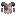
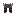

<section class="reference-directory" data-reference-directory="armor">
<header class="reference-directory-hero reference-theme-world">

Tensura reference collection

<h1>Armor</h1>

Documented armor pieces and sets.

<strong>51</strong> articles

</header>

<label class="reference-filter-label">
Filter this collection
<input type="search" class="reference-filter-input" placeholder="Search titles and summaries…" autocomplete="off">
</label>

<button type="button" class="is-active" data-letter="all" aria-pressed="true">All</button>
<button type="button" data-letter="A" aria-pressed="false">A</button>
<button type="button" data-letter="C" aria-pressed="false">C</button>
<button type="button" data-letter="H" aria-pressed="false">H</button>
<button type="button" data-letter="K" aria-pressed="false">K</button>
<button type="button" data-letter="L" aria-pressed="false">L</button>
<button type="button" data-letter="M" aria-pressed="false">M</button>
<button type="button" data-letter="O" aria-pressed="false">O</button>
<button type="button" data-letter="P" aria-pressed="false">P</button>
<button type="button" data-letter="S" aria-pressed="false">S</button>

Showing 51 of 51 articles

<article class="reference-card" data-letter="A" data-search="adamantite boots obtainable through killing mobs while having pure magisteel boots in your offhand or equipped">
<a href="adamantite-boots/" aria-label="Open Adamantite Boots">
<figure class="reference-card-media reference-card-media--source">

<figcaption>Source media</figcaption>
</figure>

<h2>Adamantite Boots</h2>

Obtainable through killing mobs while having Pure Magisteel Boots in your offhand or equipped

Open reference →

</a>
</article>
<article class="reference-card" data-letter="A" data-search="adamantite chestplate obtainable through killing mobs while having pure magisteel chestplate in your offhand or equipped">
<a href="adamantite-chestplate/" aria-label="Open Adamantite Chestplate">
<figure class="reference-card-media reference-card-media--source">

<figcaption>Source media</figcaption>
</figure>

<h2>Adamantite Chestplate</h2>

Obtainable through killing mobs while having Pure Magisteel Chestplate in your offhand or equipped

Open reference →

</a>
</article>
<article class="reference-card" data-letter="A" data-search="adamantite helmet obtainable through killing mobs while having pure magisteel helmet in your offhand or equipped">
<a href="adamantite-helmet/" aria-label="Open Adamantite Helmet">
<figure class="reference-card-media reference-card-media--source">

<figcaption>Source media</figcaption>
</figure>

<h2>Adamantite Helmet</h2>

Obtainable through killing mobs while having Pure Magisteel Helmet in your offhand or equipped

Open reference →

</a>
</article>
<article class="reference-card" data-letter="A" data-search="adamantite leggings obtainable through killing mobs while having pure magisteel leggings in your offhand or equipped">
<a href="adamantite-leggings/" aria-label="Open Adamantite Leggings">
<figure class="reference-card-media reference-card-media--source">

<figcaption>Source media</figcaption>
</figure>

<h2>Adamantite Leggings</h2>

Obtainable through killing mobs while having Pure Magisteel Leggings in your offhand or equipped

Open reference →

</a>
</article>
<article class="reference-card" data-letter="A" data-search="ant carapace boots to craft the armor, one must have used a (schematic) to craft, you need a smithing bench .">
<a href="ant-carapace-boots/" aria-label="Open Ant Carapace Boots">
<figure class="reference-card-media reference-card-media--source">

<figcaption>Source media</figcaption>
</figure>

<h2>Ant Carapace Boots</h2>

To craft the armor, one must have used a (schematic) To craft, you need a Smithing Bench .

Open reference →

</a>
</article>
<article class="reference-card" data-letter="A" data-search="ant carapace chestplate to craft the armor, one must have used a (schematic) to craft, you need a smithing bench .">
<a href="ant-carapace-chestplate/" aria-label="Open Ant Carapace Chestplate">
<figure class="reference-card-media reference-card-media--source">

<figcaption>Source media</figcaption>
</figure>

<h2>Ant Carapace Chestplate</h2>

To craft the armor, one must have used a (schematic) To craft, you need a Smithing Bench .

Open reference →

</a>
</article>
<article class="reference-card" data-letter="A" data-search="ant carapace helmet to craft the armor, one must have used a (schematic) to craft, you need a smithing bench .">
<a href="ant-carapace-helmet/" aria-label="Open Ant Carapace Helmet">
<figure class="reference-card-media reference-card-media--source">

<figcaption>Source media</figcaption>
</figure>

<h2>Ant Carapace Helmet</h2>

To craft the armor, one must have used a (schematic) To craft, you need a Smithing Bench .

Open reference →

</a>
</article>
<article class="reference-card" data-letter="A" data-search="ant carapace leggings to craft the armor, one must have used a (schematic) to craft, you need a smithing bench .">
<a href="ant-carapace-leggings/" aria-label="Open Ant Carapace Leggings">
<figure class="reference-card-media reference-card-media--source">

<figcaption>Source media</figcaption>
</figure>

<h2>Ant Carapace Leggings</h2>

To craft the armor, one must have used a (schematic) To craft, you need a Smithing Bench .

Open reference →

</a>
</article>
<article class="reference-card" data-letter="C" data-search="charybdis scale boots killing/defeating charybdis">
<a href="charybdis-scalemail-boots/" aria-label="Open Charybdis Scale Boots">
<figure class="reference-card-media reference-card-media--source">

<figcaption>Source media</figcaption>
</figure>

<h2>Charybdis Scale Boots</h2>

Killing/Defeating Charybdis

Open reference →

</a>
</article>
<article class="reference-card" data-letter="C" data-search="charybdis scale chestplate killing/defeating charybdis">
<a href="charybdis-scalemail-chestplate/" aria-label="Open Charybdis Scale Chestplate">
<figure class="reference-card-media reference-card-media--source">

<figcaption>Source media</figcaption>
</figure>

<h2>Charybdis Scale Chestplate</h2>

Killing/Defeating Charybdis

Open reference →

</a>
</article>
<article class="reference-card" data-letter="C" data-search="charybdis scale helmet to craft the armor, one must have used a charybdis scalemail schematic . to craft, you need a smithing bench .">
<a href="charybdis-scalemail-helmet/" aria-label="Open Charybdis Scale Helmet">
<figure class="reference-card-media reference-card-media--source">

<figcaption>Source media</figcaption>
</figure>

<h2>Charybdis Scale Helmet</h2>

To craft the armor, one must have used a Charybdis Scalemail Schematic . To craft, you need a Smithing Bench .

Open reference →

</a>
</article>
<article class="reference-card" data-letter="C" data-search="charybdis scale leggings killing/defeating charybdis">
<a href="charybdis-scalemail-leggings/" aria-label="Open Charybdis Scale Leggings">
<figure class="reference-card-media reference-card-media--source">

<figcaption>Source media</figcaption>
</figure>

<h2>Charybdis Scale Leggings</h2>

Killing/Defeating Charybdis

Open reference →

</a>
</article>
<article class="reference-card" data-letter="H" data-search="high magisteel boots obtainable through killing mobs while having low magisteel boots in your offhand or equipped">
<a href="high-magisteel-boots/" aria-label="Open High Magisteel Boots">
<figure class="reference-card-media reference-card-media--source">

<figcaption>Source media</figcaption>
</figure>

<h2>High Magisteel Boots</h2>

Obtainable through killing mobs while having Low Magisteel Boots in your offhand or equipped

Open reference →

</a>
</article>
<article class="reference-card" data-letter="H" data-search="high magisteel chestplate obtainable through killing mobs while having low magisteel chestplate in your offhand or equipped">
<a href="high-magisteel-chestplate/" aria-label="Open High Magisteel Chestplate">
<figure class="reference-card-media reference-card-media--source">

<figcaption>Source media</figcaption>
</figure>

<h2>High Magisteel Chestplate</h2>

Obtainable through killing mobs while having Low Magisteel Chestplate in your offhand or equipped

Open reference →

</a>
</article>
<article class="reference-card" data-letter="H" data-search="high magisteel helmet obtainable through killing mobs while having low magisteel helmet in your offhand or equiped">
<a href="high-magisteel-helmet/" aria-label="Open High Magisteel Helmet">
<figure class="reference-card-media reference-card-media--source">

<figcaption>Source media</figcaption>
</figure>

<h2>High Magisteel Helmet</h2>

Obtainable through killing mobs while having Low Magisteel Helmet in your offhand or equiped

Open reference →

</a>
</article>
<article class="reference-card" data-letter="H" data-search="high magisteel leggings obtainable through killing mobs while having low magisteel leggings in your offhand or equipped">
<a href="high-magisteel-leggings/" aria-label="Open High Magisteel Leggings">
<figure class="reference-card-media reference-card-media--source">

<figcaption>Source media</figcaption>
</figure>

<h2>High Magisteel Leggings</h2>

Obtainable through killing mobs while having Low Magisteel Leggings in your offhand or equipped

Open reference →

</a>
</article>
<article class="reference-card" data-letter="H" data-search="hihi&#x27;irokane boots obtainable through killing mobs while having adamantite boots in your offhand or equipped">
<a href="hihiirokane-boots/" aria-label="Open Hihi&#x27;irokane Boots">
<figure class="reference-card-media reference-card-media--source">

<figcaption>Source media</figcaption>
</figure>

<h2>Hihi&#x27;irokane Boots</h2>

Obtainable through killing mobs while having Adamantite Boots in your offhand or equipped

Open reference →

</a>
</article>
<article class="reference-card" data-letter="H" data-search="hihi&#x27;irokane chestplate obtainable through killing mobs while having adamantite chestplate in your offhand or equipped">
<a href="hihiirokane-chestplate/" aria-label="Open Hihi&#x27;irokane Chestplate">
<figure class="reference-card-media reference-card-media--source">

<figcaption>Source media</figcaption>
</figure>

<h2>Hihi&#x27;irokane Chestplate</h2>

Obtainable through killing mobs while having Adamantite Chestplate in your offhand or equipped

Open reference →

</a>
</article>
<article class="reference-card" data-letter="H" data-search="hihi&#x27;irokane helmet obtainable through killing mobs while having adamantite helmet or orichalcum helmet in your offhand or equipped">
<a href="hihiirokane-helmet/" aria-label="Open Hihi&#x27;irokane Helmet">
<figure class="reference-card-media reference-card-media--source">

<figcaption>Source media</figcaption>
</figure>

<h2>Hihi&#x27;irokane Helmet</h2>

Obtainable through killing mobs while having Adamantite Helmet or Orichalcum Helmet in your offhand or equipped

Open reference →

</a>
</article>
<article class="reference-card" data-letter="H" data-search="hihi&#x27;irokane leggings obtainable through killing mobs while having adamantite leggings in your offhand or equipped">
<a href="hihiirokane-leggings/" aria-label="Open Hihi&#x27;irokane Leggings">
<figure class="reference-card-media reference-card-media--source">

<figcaption>Source media</figcaption>
</figure>

<h2>Hihi&#x27;irokane Leggings</h2>

Obtainable through killing mobs while having Adamantite Leggings in your offhand or equipped

Open reference →

</a>
</article>
<article class="reference-card" data-letter="H" data-search="holy armaments boots killing/defeating hinata sakaguchi while in stage 4 (8.5% obtain chance)">
<a href="holy-armaments-boots/" aria-label="Open Holy Armaments Boots">
<figure class="reference-card-media reference-card-media--source">

<figcaption>Source media</figcaption>
</figure>

<h2>Holy Armaments Boots</h2>

Killing/defeating Hinata Sakaguchi while in stage 4 (8.5% obtain chance)

Open reference →

</a>
</article>
<article class="reference-card" data-letter="H" data-search="holy armaments chestplate killing/defeating hinata sakaguchi while in stage 4 (8.5% obtain chance)">
<a href="holy-armaments-chestplate/" aria-label="Open Holy Armaments Chestplate">
<figure class="reference-card-media reference-card-media--source">

<figcaption>Source media</figcaption>
</figure>

<h2>Holy Armaments Chestplate</h2>

Killing/defeating Hinata Sakaguchi while in stage 4 (8.5% obtain chance)

Open reference →

</a>
</article>
<article class="reference-card" data-letter="H" data-search="holy armaments leggings killing/defeating hinata sakaguchi while in stage 4 (8.5% obtain chance)">
<a href="holy-armaments-leggings/" aria-label="Open Holy Armaments Leggings">
<figure class="reference-card-media reference-card-media--source">

<figcaption>Source media</figcaption>
</figure>

<h2>Holy Armaments Leggings</h2>

Killing/defeating Hinata Sakaguchi while in stage 4 (8.5% obtain chance)

Open reference →

</a>
</article>
<article class="reference-card" data-letter="K" data-search="knight spider carapace boots to craft the armor, one must have used a (schematic) to craft, you need a smithing bench .">
<a href="knight-spider-carapace-boots/" aria-label="Open Knight Spider Carapace Boots">
<figure class="reference-card-media reference-card-media--source">

<figcaption>Source media</figcaption>
</figure>

<h2>Knight Spider Carapace Boots</h2>

To craft the armor, one must have used a (schematic) To craft, you need a Smithing Bench .

Open reference →

</a>
</article>
<article class="reference-card" data-letter="K" data-search="knight spider carapace chestplate to craft the armor, one must have used a (schematic) to craft, you need a smithing bench .">
<a href="knight-spider-carapace-chestplate/" aria-label="Open Knight Spider Carapace Chestplate">
<figure class="reference-card-media reference-card-media--source">

<figcaption>Source media</figcaption>
</figure>

<h2>Knight Spider Carapace Chestplate</h2>

To craft the armor, one must have used a (schematic) To craft, you need a Smithing Bench .

Open reference →

</a>
</article>
<article class="reference-card" data-letter="K" data-search="knight spider carapace helmet to craft the armor, one must have used a (schematic) to craft, you need a smithing bench .">
<a href="knight-spider-carapace-helmet/" aria-label="Open Knight Spider Carapace Helmet">
<figure class="reference-card-media reference-card-media--source">

<figcaption>Source media</figcaption>
</figure>

<h2>Knight Spider Carapace Helmet</h2>

To craft the armor, one must have used a (schematic) To craft, you need a Smithing Bench .

Open reference →

</a>
</article>
<article class="reference-card" data-letter="K" data-search="knight spider carapace leggings to craft the armor, one must have used a (schematic) to craft, you need a smithing bench .">
<a href="knight-spider-carapace-leggings/" aria-label="Open Knight Spider Carapace Leggings">
<figure class="reference-card-media reference-card-media--source">

<figcaption>Source media</figcaption>
</figure>

<h2>Knight Spider Carapace Leggings</h2>

To craft the armor, one must have used a (schematic) To craft, you need a Smithing Bench .

Open reference →

</a>
</article>
<article class="reference-card" data-letter="L" data-search="low magisteel boots to craft the armor, one must have used a low magisteel gear schematic . to craft, you need a smithing bench .">
<a href="low-magisteel-boots/" aria-label="Open Low Magisteel Boots">
<figure class="reference-card-media reference-card-media--source">

<figcaption>Source media</figcaption>
</figure>

<h2>Low Magisteel Boots</h2>

To craft the armor, one must have used a Low Magisteel Gear Schematic . To craft, you need a Smithing Bench .

Open reference →

</a>
</article>
<article class="reference-card" data-letter="L" data-search="low magisteel chestplate to craft the armor, one must have used a low magisteel gear schematic . to craft, you need a smithing bench .">
<a href="low-magisteel-chestplate/" aria-label="Open Low Magisteel Chestplate">
<figure class="reference-card-media reference-card-media--source">

<figcaption>Source media</figcaption>
</figure>

<h2>Low Magisteel Chestplate</h2>

To craft the armor, one must have used a Low Magisteel Gear Schematic . To craft, you need a Smithing Bench .

Open reference →

</a>
</article>
<article class="reference-card" data-letter="L" data-search="low magisteel helmet to craft the armor, one must have used a low magisteel gear schematic . to craft, you need a smithing bench .">
<a href="low-magisteel-helmet/" aria-label="Open Low Magisteel Helmet">
<figure class="reference-card-media reference-card-media--source">

<figcaption>Source media</figcaption>
</figure>

<h2>Low Magisteel Helmet</h2>

To craft the armor, one must have used a Low Magisteel Gear Schematic . To craft, you need a Smithing Bench .

Open reference →

</a>
</article>
<article class="reference-card" data-letter="L" data-search="low magisteel leggings to craft the armor, one must have used a low magisteel gear schematic . to craft, you need a smithing bench .">
<a href="low-magisteel-leggings/" aria-label="Open Low Magisteel Leggings">
<figure class="reference-card-media reference-card-media--source">

<figcaption>Source media</figcaption>
</figure>

<h2>Low Magisteel Leggings</h2>

To craft the armor, one must have used a Low Magisteel Gear Schematic . To craft, you need a Smithing Bench .

Open reference →

</a>
</article>
<article class="reference-card" data-letter="M" data-search="mithril boots to craft the armor, one must have used a mithril gear schematic . to craft, you need a smithing bench .">
<a href="mithril-boots/" aria-label="Open Mithril Boots">
<figure class="reference-card-media reference-card-media--source">

<figcaption>Source media</figcaption>
</figure>

<h2>Mithril Boots</h2>

To craft the armor, one must have used a Mithril Gear Schematic . To craft, you need a Smithing Bench .

Open reference →

</a>
</article>
<article class="reference-card" data-letter="M" data-search="mithril chestplate to craft the armor, one must have used a mithril gear schematic . to craft, you need a smithing bench .">
<a href="mithril-chestplate/" aria-label="Open Mithril Chestplate">
<figure class="reference-card-media reference-card-media--source">

<figcaption>Source media</figcaption>
</figure>

<h2>Mithril Chestplate</h2>

To craft the armor, one must have used a Mithril Gear Schematic . To craft, you need a Smithing Bench .

Open reference →

</a>
</article>
<article class="reference-card" data-letter="M" data-search="mithril helmet to craft the armor, one must have used a mithril gear schematic . to craft, you need a smithing bench .">
<a href="mithril-helmet/" aria-label="Open Mithril Helmet">
<figure class="reference-card-media reference-card-media--source">

<figcaption>Source media</figcaption>
</figure>

<h2>Mithril Helmet</h2>

To craft the armor, one must have used a Mithril Gear Schematic . To craft, you need a Smithing Bench .

Open reference →

</a>
</article>
<article class="reference-card" data-letter="M" data-search="mithril leggings to craft the armor, one must have used a mithril gear schematic . to craft, you need a smithing bench .">
<a href="mithril-leggings/" aria-label="Open Mithril Leggings">
<figure class="reference-card-media reference-card-media--source">

<figcaption>Source media</figcaption>
</figure>

<h2>Mithril Leggings</h2>

To craft the armor, one must have used a Mithril Gear Schematic . To craft, you need a Smithing Bench .

Open reference →

</a>
</article>
<article class="reference-card" data-letter="O" data-search="orichalcum boots to craft the armor, one must have used a orichalcum gear schematic . to craft, you need a smithing bench .">
<a href="orichalcum-boots/" aria-label="Open Orichalcum Boots">
<figure class="reference-card-media reference-card-media--source">

<figcaption>Source media</figcaption>
</figure>

<h2>Orichalcum Boots</h2>

To craft the armor, one must have used a Orichalcum Gear Schematic . To craft, you need a Smithing Bench .

Open reference →

</a>
</article>
<article class="reference-card" data-letter="O" data-search="orichalcum chestplate to craft the armor, one must have used a orichalcum gear schematic . to craft, you need a smithing bench .">
<a href="orichalcum-chestplate/" aria-label="Open Orichalcum Chestplate">
<figure class="reference-card-media reference-card-media--source">

<figcaption>Source media</figcaption>
</figure>

<h2>Orichalcum Chestplate</h2>

To craft the armor, one must have used a Orichalcum Gear Schematic . To craft, you need a Smithing Bench .

Open reference →

</a>
</article>
<article class="reference-card" data-letter="O" data-search="orichalcum helmet to craft the armor, one must have used a orichalcum gear schematic . to craft, you need a smithing bench .">
<a href="orichalcum-helmet/" aria-label="Open Orichalcum Helmet">
<figure class="reference-card-media reference-card-media--source">

<figcaption>Source media</figcaption>
</figure>

<h2>Orichalcum Helmet</h2>

To craft the armor, one must have used a Orichalcum Gear Schematic . To craft, you need a Smithing Bench .

Open reference →

</a>
</article>
<article class="reference-card" data-letter="O" data-search="orichalcum leggings to craft the armor, one must have used a orichalcum gear schematic . to craft, you need a smithing bench .">
<a href="orichalcum-leggings/" aria-label="Open Orichalcum Leggings">
<figure class="reference-card-media reference-card-media--source">

<figcaption>Source media</figcaption>
</figure>

<h2>Orichalcum Leggings</h2>

To craft the armor, one must have used a Orichalcum Gear Schematic . To craft, you need a Smithing Bench .

Open reference →

</a>
</article>
<article class="reference-card" data-letter="P" data-search="pure magisteel boots obtainable through killing mobs while having high magisteel boots in your offhand or equiped">
<a href="pure-magisteel-boots/" aria-label="Open Pure Magisteel Boots">
<figure class="reference-card-media reference-card-media--source">

<figcaption>Source media</figcaption>
</figure>

<h2>Pure Magisteel Boots</h2>

Obtainable through killing mobs while having High Magisteel Boots in your offhand or equiped

Open reference →

</a>
</article>
<article class="reference-card" data-letter="P" data-search="pure magisteel chestplate obtainable through killing mobs while having high magisteel chestplate in your offhand or equiped">
<a href="pure-magisteel-chestplate/" aria-label="Open Pure Magisteel Chestplate">
<figure class="reference-card-media reference-card-media--source">

<figcaption>Source media</figcaption>
</figure>

<h2>Pure Magisteel Chestplate</h2>

Obtainable through killing mobs while having High Magisteel Chestplate in your offhand or equiped

Open reference →

</a>
</article>
<article class="reference-card" data-letter="P" data-search="pure magisteel helmet obtainable through killing mobs while having high magisteel helmet in your offhand or equiped">
<a href="pure-magisteel-helmet/" aria-label="Open Pure Magisteel Helmet">
<figure class="reference-card-media reference-card-media--source">

<figcaption>Source media</figcaption>
</figure>

<h2>Pure Magisteel Helmet</h2>

Obtainable through killing mobs while having High Magisteel Helmet in your offhand or equiped

Open reference →

</a>
</article>
<article class="reference-card" data-letter="P" data-search="pure magisteel leggings obtainable through killing mobs while having high magisteel leggings in your offhand or equiped">
<a href="pure-magisteel-leggings/" aria-label="Open Pure Magisteel Leggings">
<figure class="reference-card-media reference-card-media--source">

<figcaption>Source media</figcaption>
</figure>

<h2>Pure Magisteel Leggings</h2>

Obtainable through killing mobs while having High Magisteel Leggings in your offhand or equiped

Open reference →

</a>
</article>
<article class="reference-card" data-letter="S" data-search="serpent scalemail boots to craft the armor, one must have used a (schematic) to craft, you need a smithing bench .">
<a href="serpent-scalemail-boots/" aria-label="Open Serpent Scalemail Boots">
<figure class="reference-card-media reference-card-media--source">

<figcaption>Source media</figcaption>
</figure>

<h2>Serpent Scalemail Boots</h2>

To craft the armor, one must have used a (schematic) To craft, you need a Smithing Bench .

Open reference →

</a>
</article>
<article class="reference-card" data-letter="S" data-search="serpent scalemail chestplate to craft the armor, one must have used a (schematic) to craft, you need a smithing bench .">
<a href="serpent-scalemail-chestplate/" aria-label="Open Serpent Scalemail Chestplate">
<figure class="reference-card-media reference-card-media--source">

<figcaption>Source media</figcaption>
</figure>

<h2>Serpent Scalemail Chestplate</h2>

To craft the armor, one must have used a (schematic) To craft, you need a Smithing Bench .

Open reference →

</a>
</article>
<article class="reference-card" data-letter="S" data-search="serpent scalemail helmet to craft the armor, one must have used a (schematic) to craft, you need a smithing bench .">
<a href="serpent-scalemail-helmet/" aria-label="Open Serpent Scalemail Helmet">
<figure class="reference-card-media reference-card-media--source">

<figcaption>Source media</figcaption>
</figure>

<h2>Serpent Scalemail Helmet</h2>

To craft the armor, one must have used a (schematic) To craft, you need a Smithing Bench .

Open reference →

</a>
</article>
<article class="reference-card" data-letter="S" data-search="serpent scalemail leggings to craft the armor, one must have used a (schematic) to craft, you need a smithing bench .">
<a href="serpent-scalemail-leggings/" aria-label="Open Serpent Scalemail Leggings">
<figure class="reference-card-media reference-card-media--source">

<figcaption>Source media</figcaption>
</figure>

<h2>Serpent Scalemail Leggings</h2>

To craft the armor, one must have used a (schematic) To craft, you need a Smithing Bench .

Open reference →

</a>
</article>
<article class="reference-card" data-letter="S" data-search="silver boots to craft the armor, one must have used a silver gear schematic . to craft, you need a smithing bench .">
<a href="silver-boots/" aria-label="Open Silver Boots">
<figure class="reference-card-media reference-card-media--source">

<figcaption>Source media</figcaption>
</figure>

<h2>Silver Boots</h2>

To craft the armor, one must have used a Silver Gear Schematic . To craft, you need a Smithing Bench .

Open reference →

</a>
</article>
<article class="reference-card" data-letter="S" data-search="silver chestplate to craft the armor, one must have used a silver gear schematic . to craft, you need a smithing bench .">
<a href="silver-chestplate/" aria-label="Open Silver Chestplate">
<figure class="reference-card-media reference-card-media--source">

<figcaption>Source media</figcaption>
</figure>

<h2>Silver Chestplate</h2>

To craft the armor, one must have used a Silver Gear Schematic . To craft, you need a Smithing Bench .

Open reference →

</a>
</article>
<article class="reference-card" data-letter="S" data-search="silver helmet to craft the armor, one must have used a silver gear schematic . to craft, you need a smithing bench .">
<a href="silver-helmet/" aria-label="Open Silver Helmet">
<figure class="reference-card-media reference-card-media--source">

<figcaption>Source media</figcaption>
</figure>

<h2>Silver Helmet</h2>

To craft the armor, one must have used a Silver Gear Schematic . To craft, you need a Smithing Bench .

Open reference →

</a>
</article>
<article class="reference-card" data-letter="S" data-search="silver leggings to craft the armor, one must have used a silver gear schematic . to craft, you need a smithing bench .">
<a href="silver-leggings/" aria-label="Open Silver Leggings">
<figure class="reference-card-media reference-card-media--source">

<figcaption>Source media</figcaption>
</figure>

<h2>Silver Leggings</h2>

To craft the armor, one must have used a Silver Gear Schematic . To craft, you need a Smithing Bench .

Open reference →

</a>
</article>

No matching articles. Try a broader search.

</section>
