<section class="reference-directory" data-reference-directory="battlewill">
<header class="reference-directory-hero reference-theme-abilities">

Tensura reference collection

<h1>Battlewill</h1>

Aura-powered Battlewill techniques and manuals.

<strong>24</strong> articles

</header>

<label class="reference-filter-label">
Filter this collection
<input type="search" class="reference-filter-input" placeholder="Search titles and summaries…" autocomplete="off">
</label>

<button type="button" class="is-active" data-letter="all" aria-pressed="true">All</button>
<button type="button" data-letter="A" aria-pressed="false">A</button>
<button type="button" data-letter="B" aria-pressed="false">B</button>
<button type="button" data-letter="C" aria-pressed="false">C</button>
<button type="button" data-letter="D" aria-pressed="false">D</button>
<button type="button" data-letter="E" aria-pressed="false">E</button>
<button type="button" data-letter="F" aria-pressed="false">F</button>
<button type="button" data-letter="H" aria-pressed="false">H</button>
<button type="button" data-letter="I" aria-pressed="false">I</button>
<button type="button" data-letter="M" aria-pressed="false">M</button>
<button type="button" data-letter="O" aria-pressed="false">O</button>
<button type="button" data-letter="P" aria-pressed="false">P</button>
<button type="button" data-letter="R" aria-pressed="false">R</button>
<button type="button" data-letter="V" aria-pressed="false">V</button>

Showing 24 of 24 articles

<article class="reference-card" data-letter="A" data-search="air flight use your aura to propel you forward, and hover in air">
<a href="air-flight/" aria-label="Open Air Flight">
<figure class="reference-card-media reference-card-media--source">
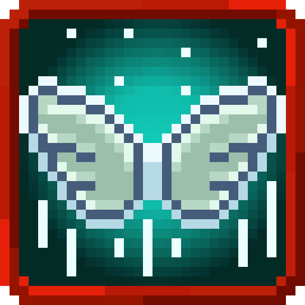
<figcaption>Source media</figcaption>
</figure>

<h2>Air Flight</h2>

Use your aura to propel you forward, and hover in air

Open reference →

</a>
</article>
<article class="reference-card" data-letter="A" data-search="aura shield create a shield of condensed aura to block attacks">
<a href="aura-shield/" aria-label="Open Aura Shield">
<figure class="reference-card-media reference-card-media--source">
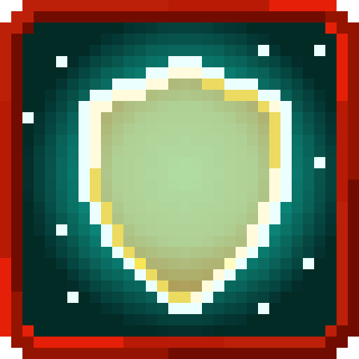
<figcaption>Source media</figcaption>
</figure>

<h2>Aura Shield</h2>

Create a shield of condensed aura to block attacks

Open reference →

</a>
</article>
<article class="reference-card" data-letter="A" data-search="aura slash condense your aura along your blade and release a ranged slash">
<a href="aura-slash/" aria-label="Open Aura Slash">
<figure class="reference-card-media reference-card-media--source">
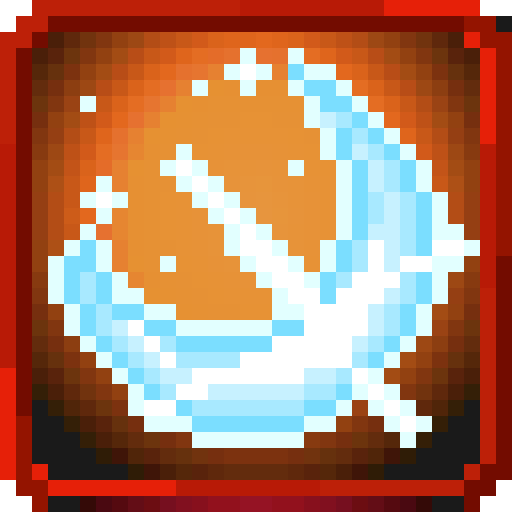
<figcaption>Source media</figcaption>
</figure>

<h2>Aura Slash</h2>

Condense your aura along your blade and release a ranged slash

Open reference →

</a>
</article>
<article class="reference-card" data-letter="A" data-search="aura sword coat your weapon in aura enhancing its blows">
<a href="aura-sword/" aria-label="Open Aura Sword">
<figure class="reference-card-media reference-card-media--source">
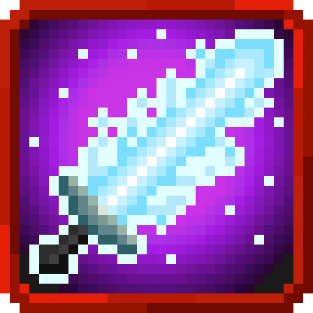
<figcaption>Source media</figcaption>
</figure>

<h2>Aura Sword</h2>

Coat your weapon in aura enhancing its blows

Open reference →

</a>
</article>
<article class="reference-card" data-letter="B" data-search="battlewill channel your will, converting magicules into aura">
<a href="battlewill/" aria-label="Open Battlewill">
<figure class="reference-card-media reference-card-media--source">
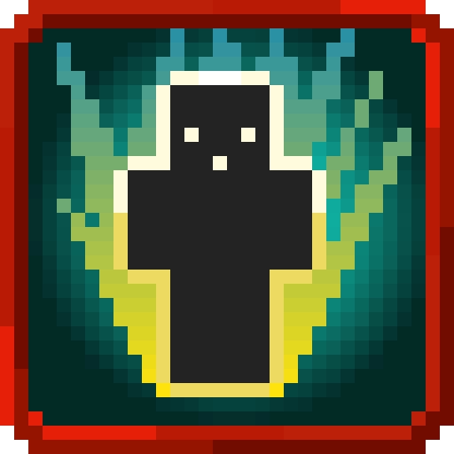
<figcaption>Source media</figcaption>
</figure>

<h2>Battlewill</h2>

Channel your will, converting magicules into aura

Open reference →

</a>
</article>
<article class="reference-card" data-letter="B" data-search="battlewill manual in all these locations its 50% chance">
<a href="items-misc-battlewill-manual/" aria-label="Open Battlewill Manual">
<figure class="reference-card-media reference-card-media--source">
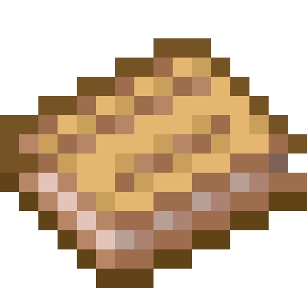
<figcaption>Source media</figcaption>
</figure>

<h2>Battlewill Manual</h2>

In all these locations its 50% chance

Open reference →

</a>
</article>
<article class="reference-card" data-letter="C" data-search="cherry blossoms - eight petals flash create a shield of condensed aura to block attacks">
<a href="double-cherry-blossoms-eight-petals-flash/" aria-label="Open Cherry Blossoms - Eight Petals Flash">
<figure class="reference-card-media reference-card-media--source">
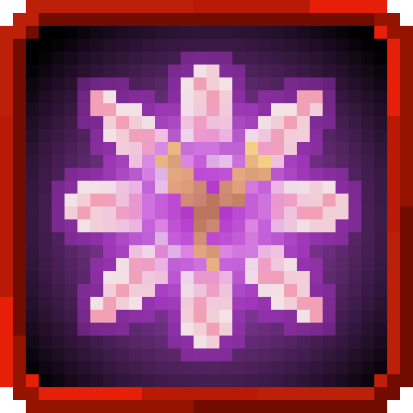
<figcaption>Source media</figcaption>
</figure>

<h2>Cherry Blossoms - Eight Petals Flash</h2>

Create a shield of condensed aura to block attacks

Open reference →

</a>
</article>
<article class="reference-card" data-letter="D" data-search="dark eight palms launch up to eight devastating aura blasts at foes">
<a href="dark-eight-palms/" aria-label="Open Dark Eight Palms">
<figure class="reference-card-media reference-card-media--source">
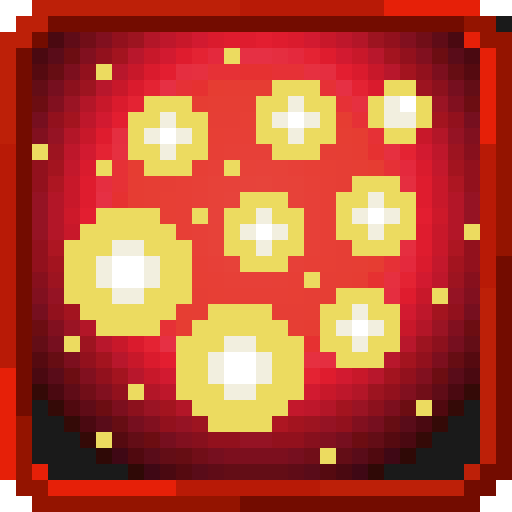
<figcaption>Source media</figcaption>
</figure>

<h2>Dark Eight Palms</h2>

Launch up to eight devastating aura blasts at foes

Open reference →

</a>
</article>
<article class="reference-card" data-letter="D" data-search="death march dance gather your aura into a ring of devastating aura spheres that come crashing down">
<a href="death-march-dance/" aria-label="Open Death March Dance">
<figure class="reference-card-media reference-card-media--source">
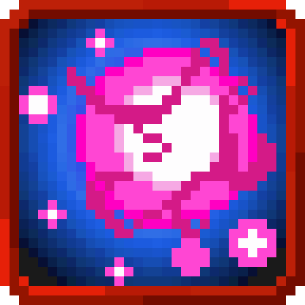
<figcaption>Source media</figcaption>
</figure>

<h2>Death March Dance</h2>

Gather your aura into a ring of devastating aura spheres that come crashing down

Open reference →

</a>
</article>
<article class="reference-card" data-letter="D" data-search="diamond path harden your aura around you to block incoming attacks">
<a href="diamond-path/" aria-label="Open Diamond Path">
<figure class="reference-card-media reference-card-media--source">
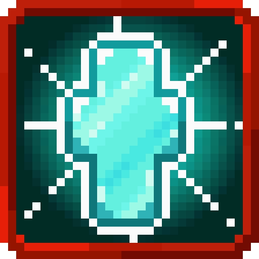
<figcaption>Source media</figcaption>
</figure>

<h2>Diamond Path</h2>

Harden your aura around you to block incoming attacks

Open reference →

</a>
</article>
<article class="reference-card" data-letter="E" data-search="earthshatter kick stomp your foot down upheaving the land around you">
<a href="earthshatter-kick/" aria-label="Open Earthshatter Kick">
<figure class="reference-card-media reference-card-media--source">
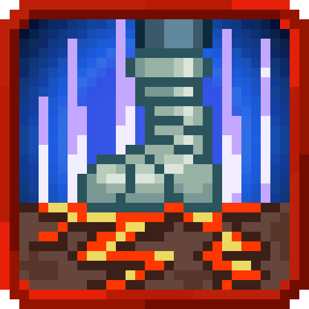
<figcaption>Source media</figcaption>
</figure>

<h2>Earthshatter Kick</h2>

Stomp your foot down upheaving the land around you

Open reference →

</a>
</article>
<article class="reference-card" data-letter="E" data-search="elephant stampede throw a ring of aura spheres around you">
<a href="elephant-stampede/" aria-label="Open Elephant Stampede">
<figure class="reference-card-media reference-card-media--source">
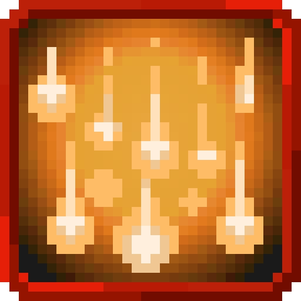
<figcaption>Source media</figcaption>
</figure>

<h2>Elephant Stampede</h2>

Throw a ring of aura spheres around you

Open reference →

</a>
</article>
<article class="reference-card" data-letter="F" data-search="formhide match your aura to the surroundings, which makes you imperceptible.">
<a href="formhide/" aria-label="Open Formhide">
<figure class="reference-card-media reference-card-media--source">
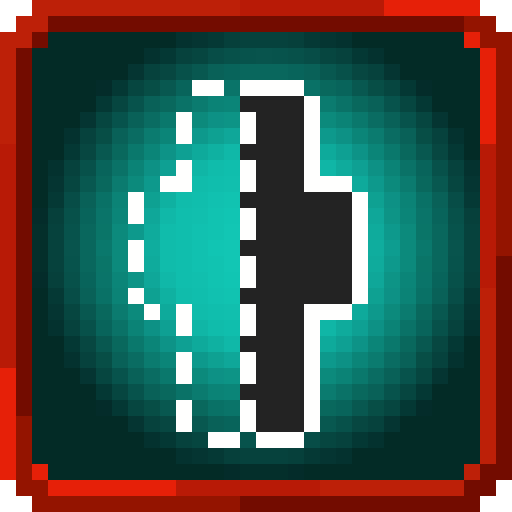
<figcaption>Source media</figcaption>
</figure>

<h2>Formhide</h2>

Match your aura to the surroundings, which makes you imperceptible.

Open reference →

</a>
</article>
<article class="reference-card" data-letter="H" data-search="haze wrap yourself in a cloak of aura concealing yourself from even the most of heightened of senses">
<a href="haze/" aria-label="Open Haze">
<figure class="reference-card-media reference-card-media--source">
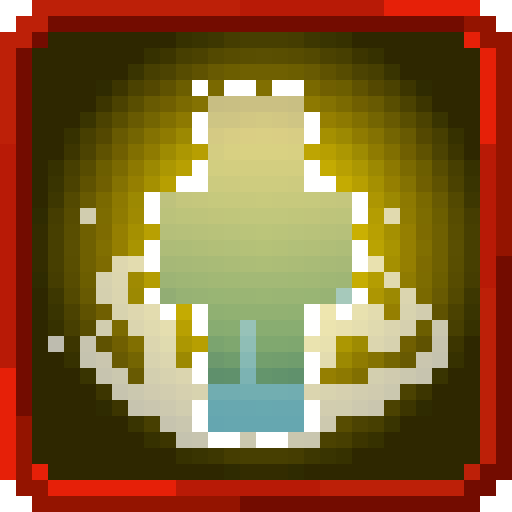
<figcaption>Source media</figcaption>
</figure>

<h2>Haze</h2>

Wrap yourself in a cloak of aura concealing yourself from even the most of heightened of senses

Open reference →

</a>
</article>
<article class="reference-card" data-letter="H" data-search="heavy slash channel your aura into your arms and bring down a mountain-splitting slash">
<a href="heavy-slash/" aria-label="Open Heavy Slash">
<figure class="reference-card-media reference-card-media--source">
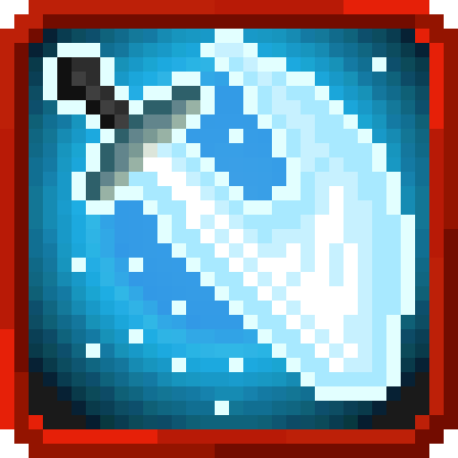
<figcaption>Source media</figcaption>
</figure>

<h2>Heavy Slash</h2>

Channel your aura into your arms and bring down a mountain-splitting slash

Open reference →

</a>
</article>
<article class="reference-card" data-letter="I" data-search="instant-move gather your aura at your feet to travel faster than the eye can see">
<a href="instant-move/" aria-label="Open Instant-move">
<figure class="reference-card-media reference-card-media--source">
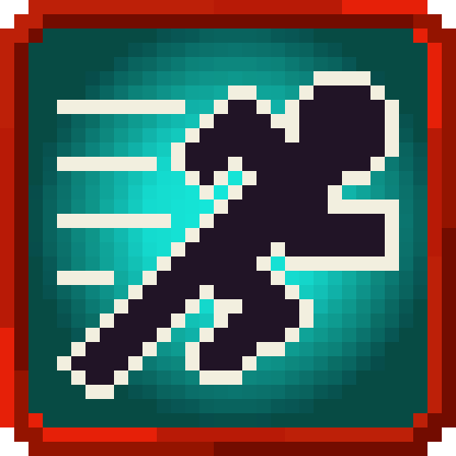
<figcaption>Source media</figcaption>
</figure>

<h2>Instant-move</h2>

Gather your aura at your feet to travel faster than the eye can see

Open reference →

</a>
</article>
<article class="reference-card" data-letter="M" data-search="magic bullet gather your aura into a powerful blast">
<a href="magic-bullet/" aria-label="Open Magic Bullet">
<figure class="reference-card-media reference-card-media--source">
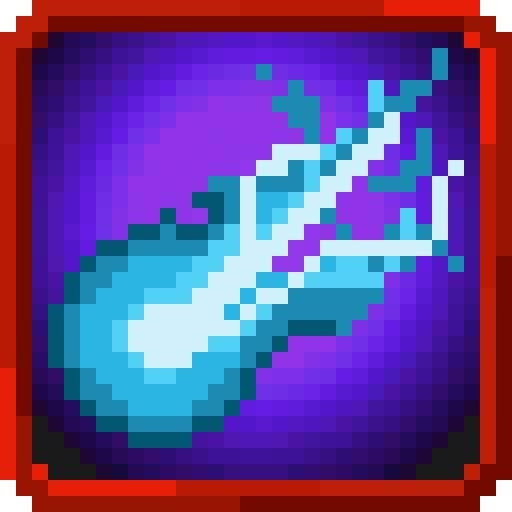
<figcaption>Source media</figcaption>
</figure>

<h2>Magic Bullet</h2>

Gather your aura into a powerful blast

Open reference →

</a>
</article>
<article class="reference-card" data-letter="M" data-search="maximum magic bullet gather your aura into a gargantuan blast obliterating all who dare oppose you">
<a href="maximum-magic-bullet/" aria-label="Open Maximum Magic Bullet">
<figure class="reference-card-media reference-card-media--source">
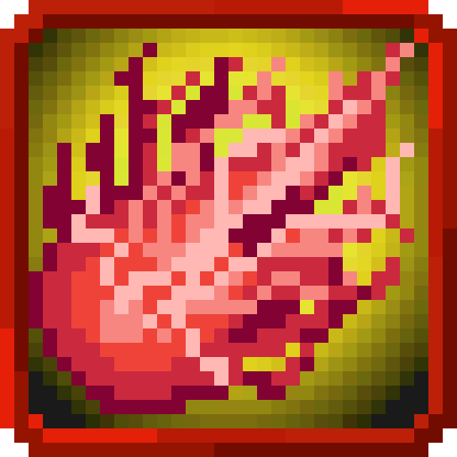
<figcaption>Source media</figcaption>
</figure>

<h2>Maximum Magic Bullet</h2>

Gather your aura into a gargantuan blast obliterating all who dare oppose you

Open reference →

</a>
</article>
<article class="reference-card" data-letter="O" data-search="ogre flame use your aura to create a pillar of fire">
<a href="ogre-flame/" aria-label="Open Ogre Flame">
<figure class="reference-card-media reference-card-media--source">
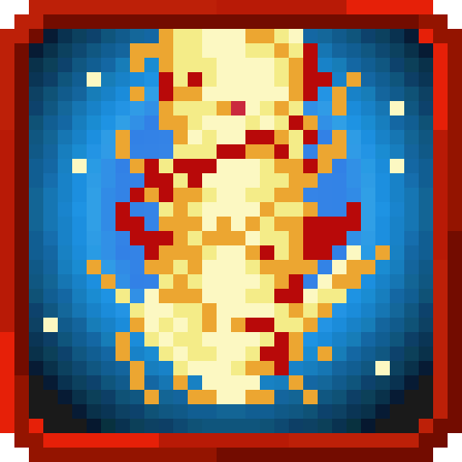
<figcaption>Source media</figcaption>
</figure>

<h2>Ogre Flame</h2>

Use your aura to create a pillar of fire

Open reference →

</a>
</article>
<article class="reference-card" data-letter="O" data-search="ogre-sword cannon condense your aura into a blade projectile">
<a href="ogre-sword-cannon/" aria-label="Open Ogre-sword Cannon">
<figure class="reference-card-media reference-card-media--source">
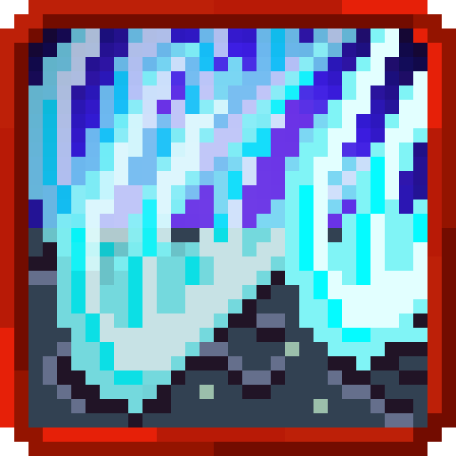
<figcaption>Source media</figcaption>
</figure>

<h2>Ogre-sword Cannon</h2>

Condense your aura into a blade projectile

Open reference →

</a>
</article>
<article class="reference-card" data-letter="O" data-search="ogre-sword guillotine coat your weapon in aura enhancing its blows">
<a href="ogre-sword-guillotine/" aria-label="Open Ogre-sword Guillotine">
<figure class="reference-card-media reference-card-media--source">
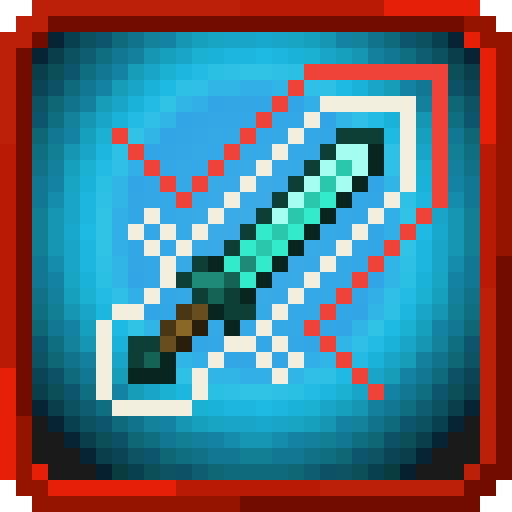
<figcaption>Source media</figcaption>
</figure>

<h2>Ogre-sword Guillotine</h2>

Coat your weapon in aura enhancing its blows

Open reference →

</a>
</article>
<article class="reference-card" data-letter="P" data-search="plum blossoms - five petals thrust create a shield of condensed aura to block attacks">
<a href="plum-blossoms-five-petals-thrust/" aria-label="Open Plum Blossoms - Five Petals Thrust">
<figure class="reference-card-media reference-card-media--source">
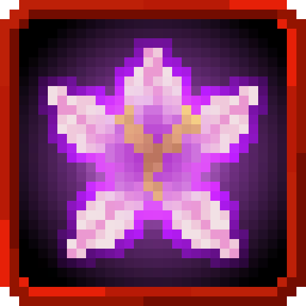
<figcaption>Source media</figcaption>
</figure>

<h2>Plum Blossoms - Five Petals Thrust</h2>

Create a shield of condensed aura to block attacks

Open reference →

</a>
</article>
<article class="reference-card" data-letter="R" data-search="roaring lion punch focus your aura into a fearsome blow with the regalness of a lion">
<a href="roaring-lion-punch/" aria-label="Open Roaring Lion Punch">
<figure class="reference-card-media reference-card-media--source">
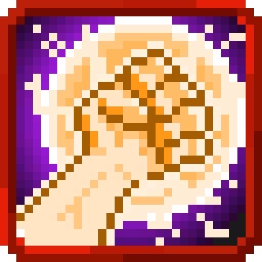
<figcaption>Source media</figcaption>
</figure>

<h2>Roaring Lion Punch</h2>

Focus your aura into a fearsome blow with the regalness of a lion

Open reference →

</a>
</article>
<article class="reference-card" data-letter="V" data-search="violent break channel your aura recklessly enhancing your strength and cleansing you of any negative effects">
<a href="violent-break/" aria-label="Open Violent Break">
<figure class="reference-card-media reference-card-media--source">

<figcaption>Source media</figcaption>
</figure>

<h2>Violent Break</h2>

Channel your aura recklessly enhancing your strength and cleansing you of any negative effects

Open reference →

</a>
</article>

No matching articles. Try a broader search.

</section>
