<section class="reference-directory" data-reference-directory="biomes">
<header class="reference-directory-hero reference-theme-world">

Tensura reference collection

<h1>Biomes</h1>

Documented biomes and biome-specific behavior.

<strong>12</strong> articles

</header>

<label class="reference-filter-label">
Filter this collection
<input type="search" class="reference-filter-input" placeholder="Search titles and summaries…" autocomplete="off">
</label>

<button type="button" class="is-active" data-letter="all" aria-pressed="true">All</button>
<button type="button" data-letter="A" aria-pressed="false">A</button>
<button type="button" data-letter="B" aria-pressed="false">B</button>
<button type="button" data-letter="D" aria-pressed="false">D</button>
<button type="button" data-letter="E" aria-pressed="false">E</button>
<button type="button" data-letter="F" aria-pressed="false">F</button>
<button type="button" data-letter="K" aria-pressed="false">K</button>
<button type="button" data-letter="L" aria-pressed="false">L</button>
<button type="button" data-letter="M" aria-pressed="false">M</button>
<button type="button" data-letter="S" aria-pressed="false">S</button>
<button type="button" data-letter="W" aria-pressed="false">W</button>

Showing 12 of 12 articles

<article class="reference-card" data-letter="A" data-search="ancient forest a high-magicule forest surrounding the spirit tree, with rare plants, spirits, and giant-tree portals.">
<a href="biomes-ancient-forest/" aria-label="Open Ancient Forest">
<figure class="reference-card-media reference-card-media--theme">
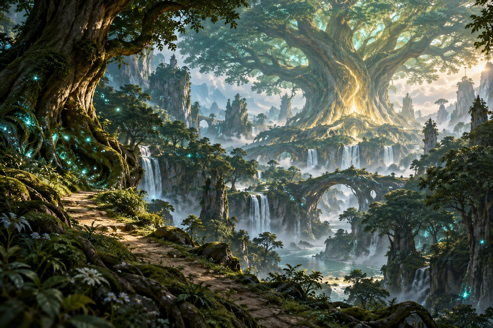
<figcaption>TSR artwork</figcaption>
</figure>

<h2>Ancient Forest</h2>

A high-magicule forest surrounding the Spirit Tree, with rare plants, spirits, and giant-tree portals.

<dl class="reference-card-stats"><dt>Amount</dt><dd>19,500</dd><dt>Mobs</dt><dd>CattledeerDirewolfBlade TigerFeathered SerpentSalamanderWinged CatBeast GnomeAqua FrogSylphideIfritAkashWar GnomeUndine</dd></dl><small class="reference-card-source-note">Upstream reference values; server settings may differ.</small>
Open reference →

</a>
</article>
<article class="reference-card" data-letter="B" data-search="barren lands a stark, high-magicule wasteland with increased magic ore generation and no listed creature spawns.">
<a href="biomes-barren-lands/" aria-label="Open Barren Lands">
<figure class="reference-card-media reference-card-media--theme">
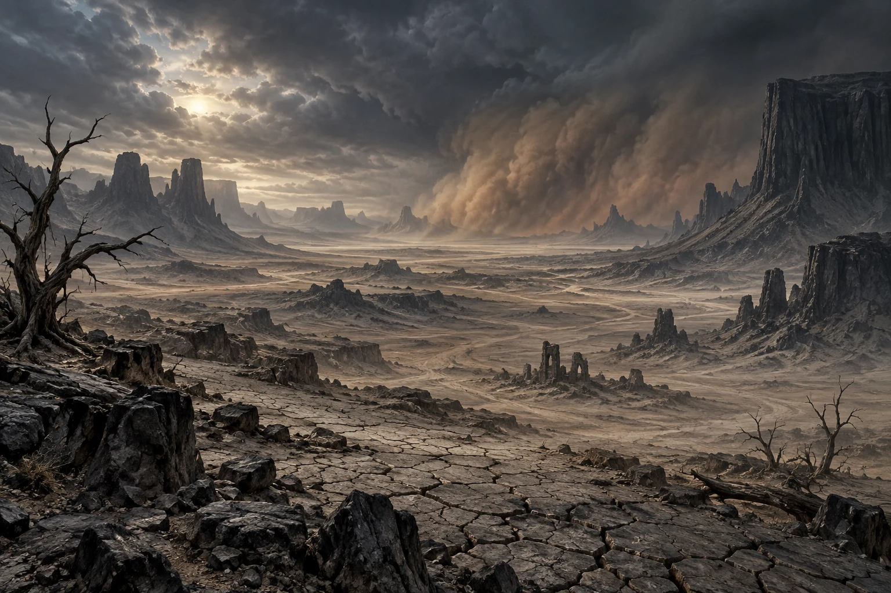
<figcaption>TSR artwork</figcaption>
</figure>

<h2>Barren Lands</h2>

A stark, high-magicule wasteland with increased Magic Ore generation and no listed creature spawns.

<dl class="reference-card-stats"><dt>Amount</dt><dd>45,500</dd><dt>Mobs</dt><dd>None</dd></dl><small class="reference-card-source-note">Upstream reference values; server settings may differ.</small>
Open reference →

</a>
</article>
<article class="reference-card" data-letter="D" data-search="dark biome shadow imp wither skeleton">
<a href="../../mysticism-reference/biomes/structures-and-biomes-dark-biome/" aria-label="Open Dark Biome">
<figure class="reference-card-media reference-card-media--source">
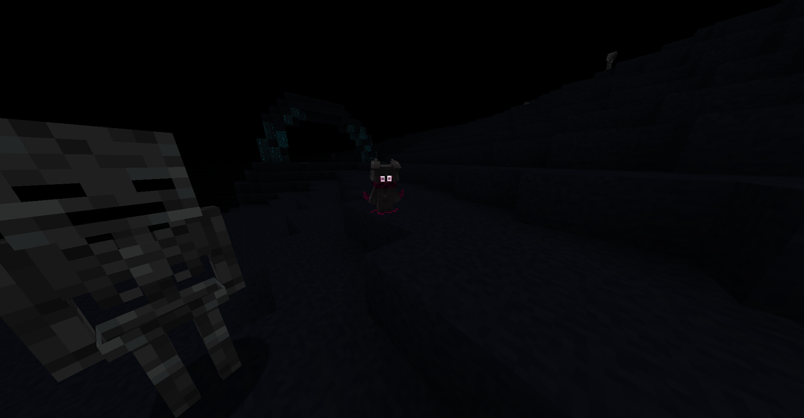
<figcaption>Source media</figcaption>
</figure>

<h2>Dark Biome</h2>

Shadow Imp Wither Skeleton

Open reference →

</a>
</article>
<article class="reference-card" data-letter="D" data-search="desert of death a lethal desert without ordinary animal spawns, inhabited by the biome&#x27;s strongest hostile creatures.">
<a href="biomes-desert-of-death/" aria-label="Open Desert of Death">
<figure class="reference-card-media reference-card-media--theme">
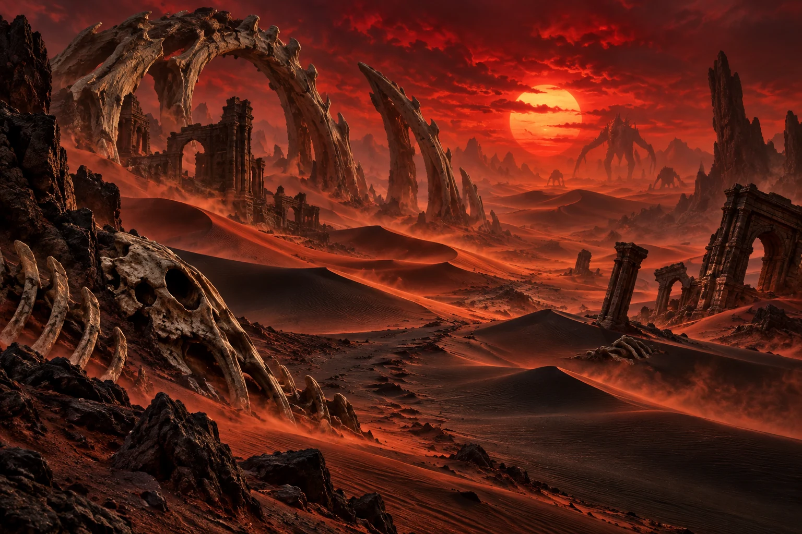
<figcaption>TSR artwork</figcaption>
</figure>

<h2>Desert of Death</h2>

A lethal desert without ordinary animal spawns, inhabited by the biome&#x27;s strongest hostile creatures.

<dl class="reference-card-stats"><dt>Amount</dt><dd>29,500</dd><dt>Mobs</dt><dd>Knight SpiderTempest SerpentArmorsaurusBasilisk</dd></dl><small class="reference-card-source-note">Upstream reference values; server settings may differ.</small>
Open reference →

</a>
</article>
<article class="reference-card" data-letter="E" data-search="earth biome beast gnomes war gnomes (rare chance)">
<a href="../../mysticism-reference/biomes/structures-and-biomes-earth-biome/" aria-label="Open Earth Biome">
<figure class="reference-card-media reference-card-media--source">
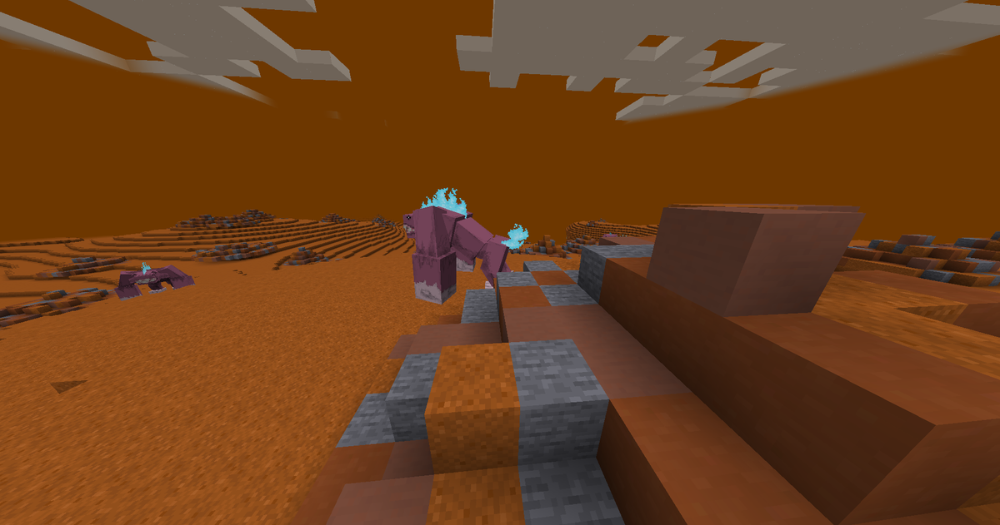
<figcaption>Source media</figcaption>
</figure>

<h2>Earth Biome</h2>

Beast Gnomes War Gnomes (Rare chance)

Open reference →

</a>
</article>
<article class="reference-card" data-letter="F" data-search="fire biome blaze salamander ifrit (rare chance)">
<a href="../../mysticism-reference/biomes/structures-and-biomes-fire-biome/" aria-label="Open Fire Biome">
<figure class="reference-card-media reference-card-media--source">
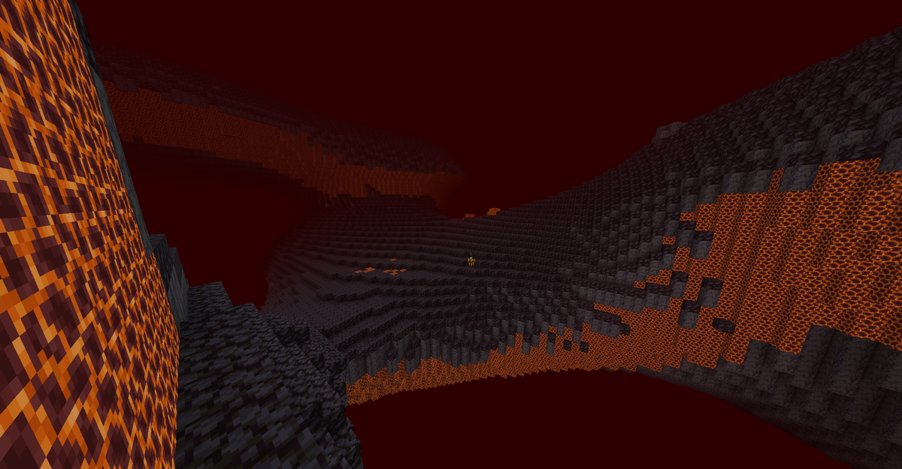
<figcaption>Source media</figcaption>
</figure>

<h2>Fire Biome</h2>

Blaze Salamander Ifrit (Rare chance)

Open reference →

</a>
</article>
<article class="reference-card" data-letter="K" data-search="kamui biome the empty, cube-filled biome used by mysticism&#x27;s kamui pocket dimension in the pinned 1.21.1 build.">
<a href="../../mysticism-reference/biomes/kamui-biome/" aria-label="Open Kamui Biome">
<figure class="reference-card-media reference-card-media--theme">
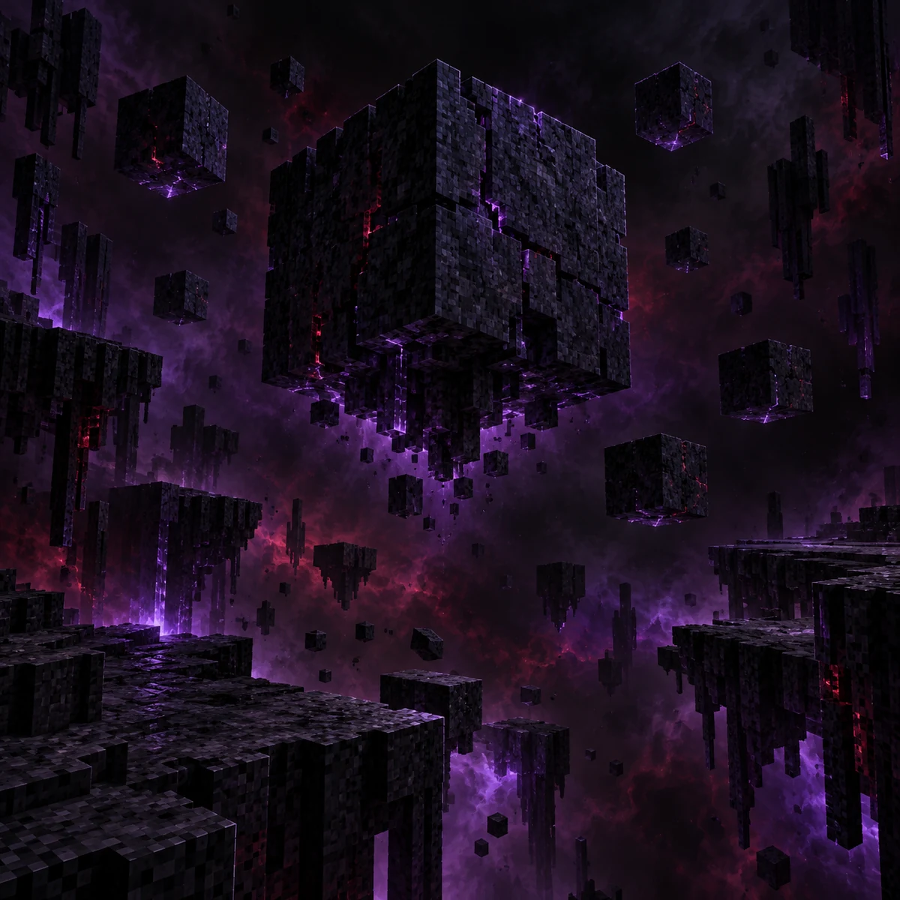
<figcaption>TSR artwork</figcaption>
</figure>

<h2>Kamui Biome</h2>

The empty, cube-filled biome used by Mysticism&#x27;s Kamui pocket dimension in the pinned 1.21.1 build.

<dl class="reference-card-stats"><dt>Source</dt><dd>Mysticism 2.1.2</dd><dt>Registry ID</dt><dd>mysticism:kamui_biome</dd><dt>Dimension</dt><dd>mysticism:kamui_dimension</dd><dt>Precipitation</dt><dd>None</dd><dt>Temperature</dt><dd>0.6</dd><dt>Natural spawns</dt><dd>None</dd><dt>Placed feature</dt><dd>mysticism:kamui_cube</dd></dl><small class="reference-card-source-note">Pinned Mysticism 2.1.2 pack data; server settings may differ.</small>
Open reference →

</a>
</article>
<article class="reference-card" data-letter="L" data-search="light biome winged lion wither skeleton">
<a href="../../mysticism-reference/biomes/structures-and-biomes-light-biome/" aria-label="Open Light Biome">
<figure class="reference-card-media reference-card-media--source">
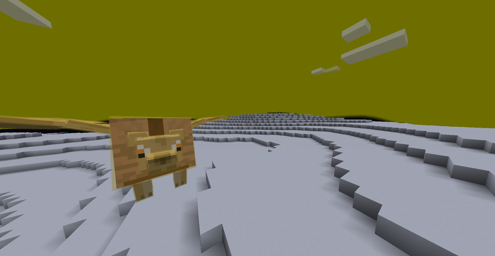
<figcaption>Source media</figcaption>
</figure>

<h2>Light Biome</h2>

Winged Lion Wither Skeleton

Open reference →

</a>
</article>
<article class="reference-card" data-letter="M" data-search="miasmic plains an undead-filled plain where ancient wizard towers can appear and sunlight no longer restrains undead spawns.">
<a href="biomes-miasmic-plains/" aria-label="Open Miasmic Plains">
<figure class="reference-card-media reference-card-media--theme">
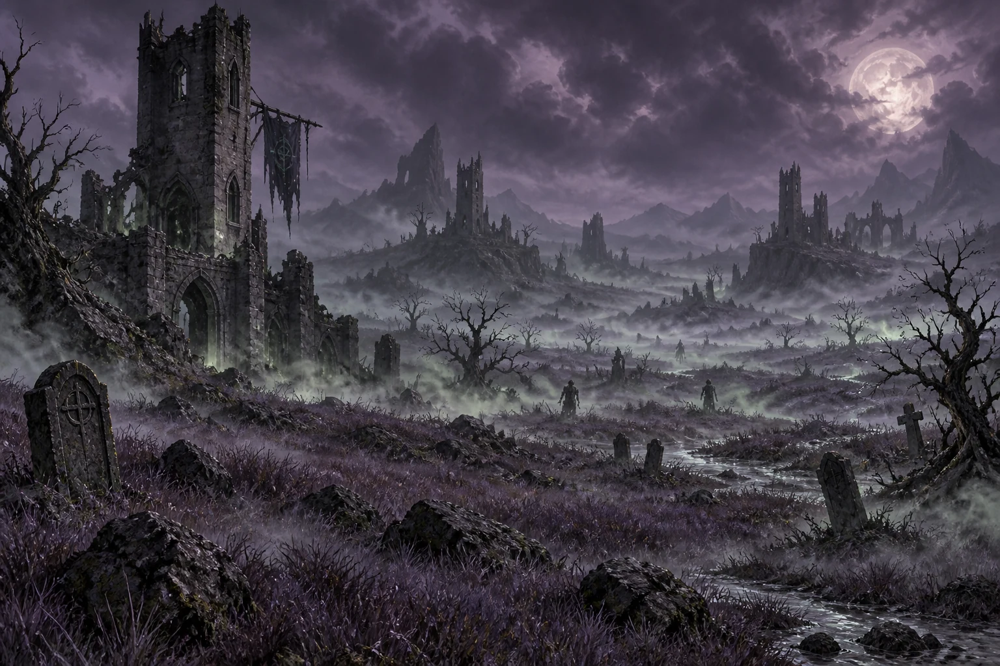
<figcaption>TSR artwork</figcaption>
</figure>

<h2>Miasmic Plains</h2>

An undead-filled plain where ancient Wizard Towers can appear and sunlight no longer restrains undead spawns.

<dl class="reference-card-stats"><dt>Amount</dt><dd>19,500</dd><dt>Mobs</dt><dd>ZombieSkeletonSkeleton HorseZombie HorseEvil CentipedeBarghest</dd></dl><small class="reference-card-source-note">Upstream reference values; server settings may differ.</small>
Open reference →

</a>
</article>
<article class="reference-card" data-letter="S" data-search="space biome spawning area for medium and greater spirits of space">
<a href="../../mysticism-reference/biomes/structures-and-biomes-space-biome/" aria-label="Open Space Biome">
<figure class="reference-card-media reference-card-media--source">
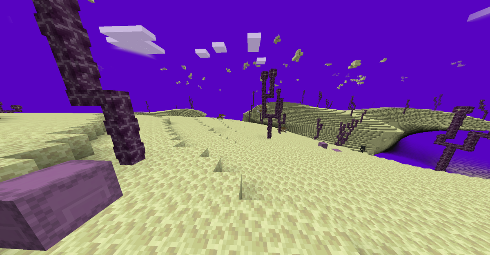
<figcaption>Source media</figcaption>
</figure>

<h2>Space Biome</h2>

Spawning area for medium and greater spirits of space

Open reference →

</a>
</article>
<article class="reference-card" data-letter="W" data-search="water biome landfish aqua frog undine (rare chance)">
<a href="../../mysticism-reference/biomes/structures-and-biomes-water-biome/" aria-label="Open Water Biome">
<figure class="reference-card-media reference-card-media--source">
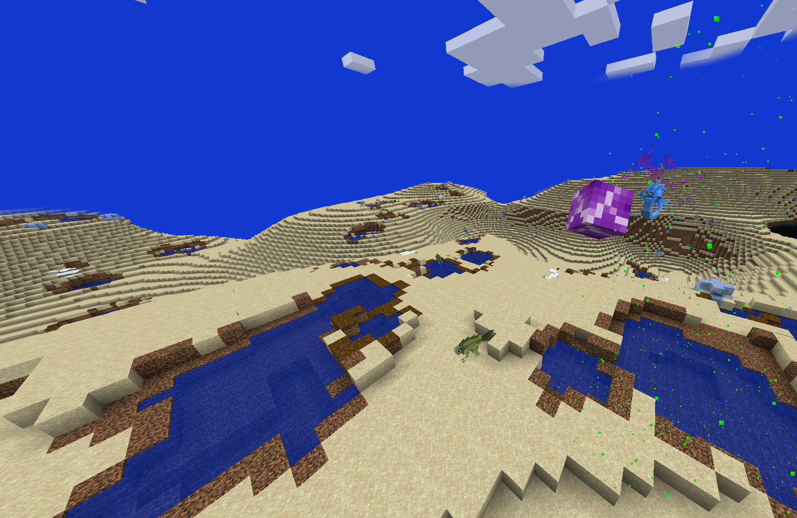
<figcaption>Source media</figcaption>
</figure>

<h2>Water Biome</h2>

Landfish Aqua Frog Undine (Rare Chance)

Open reference →

</a>
</article>
<article class="reference-card" data-letter="W" data-search="wind biome dragon peacock feathered serpent sylphide (rare chance)">
<a href="../../mysticism-reference/biomes/structures-and-biomes-wind-biome/" aria-label="Open Wind Biome">
<figure class="reference-card-media reference-card-media--source">
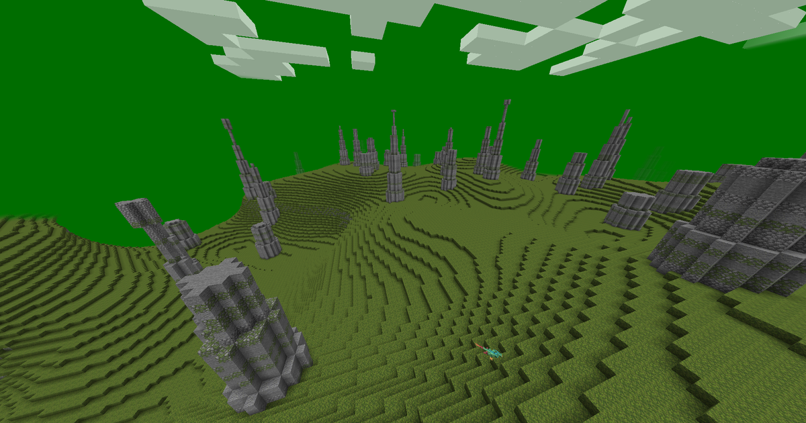
<figcaption>Source media</figcaption>
</figure>

<h2>Wind Biome</h2>

Dragon Peacock Feathered Serpent Sylphide (Rare Chance)

Open reference →

</a>
</article>

No matching articles. Try a broader search.

</section>
