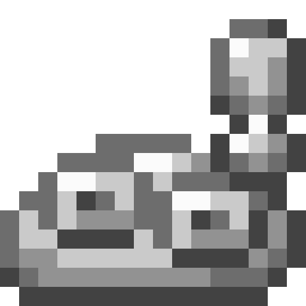

<section class="reference-directory" data-reference-directory="biomes">
<header class="reference-directory-hero reference-theme-world">

Tensura reference collection

<h1>Biomes</h1>

Base Tensura biomes and biome-specific behavior.

<strong>5</strong> articles

</header>

<label class="reference-filter-label">
Filter this collection
<input type="search" class="reference-filter-input" placeholder="Search titles and summaries…" autocomplete="off">
</label>

<button type="button" class="is-active" data-letter="all" aria-pressed="true">All</button>
<button type="button" data-letter="A" aria-pressed="false">A</button>
<button type="button" data-letter="B" aria-pressed="false">B</button>

Showing 5 of 5 articles

<article class="reference-card" data-letter="A" data-search="ancient forest a rare biome with high magicule count, and home of the spirit tree .">
<a href="biomes-ancient-forest/" aria-label="Open Ancient Forest">
<figure class="reference-card-media reference-card-media--theme">

<figcaption>TSR artwork</figcaption>
</figure>

<h2>Ancient Forest</h2>

A rare biome with high magicule count, and home of the Spirit Tree .

Open reference →

</a>
</article>
<article class="reference-card" data-letter="B" data-search="biomes ancient forest miasmic plains barren lands desert of death">
<a href="biomes/" aria-label="Open Biomes">
<figure class="reference-card-media reference-card-media--source">

<figcaption>Source media</figcaption>
</figure>

<h2>Biomes</h2>

Ancient Forest Miasmic Plains Barren Lands Desert Of Death

Open reference →

</a>
</article>
<article class="reference-card" data-letter="B" data-search="biomes/barren lands as the name implies, there is nothing">
<a href="biomes-barren-lands/" aria-label="Open Biomes/Barren Lands">
<figure class="reference-card-media reference-card-media--theme">

<figcaption>TSR artwork</figcaption>
</figure>

<h2>Biomes/Barren Lands</h2>

As the name implies, there is nothing

Open reference →

</a>
</article>
<article class="reference-card" data-letter="B" data-search="biomes/desert of death only the strong survive.">
<a href="biomes-desert-of-death/" aria-label="Open Biomes/Desert of Death">
<figure class="reference-card-media reference-card-media--theme">

<figcaption>TSR artwork</figcaption>
</figure>

<h2>Biomes/Desert of Death</h2>

Only the strong survive.

Open reference →

</a>
</article>
<article class="reference-card" data-letter="B" data-search="biomes/miasmic plains a land of death, swarmed with undead. wizard towers from long ago can be found here.">
<a href="biomes-miasmic-plains/" aria-label="Open Biomes/Miasmic Plains">
<figure class="reference-card-media reference-card-media--theme">

<figcaption>TSR artwork</figcaption>
</figure>

<h2>Biomes/Miasmic Plains</h2>

A land of death, swarmed with undead. Wizard towers from long ago can be found here.

Open reference →

</a>
</article>

No matching articles. Try a broader search.

</section>
