<section class="reference-directory" data-reference-directory="blocks">
<header class="reference-directory-hero reference-theme-world">

Tensura reference collection

<h1>Blocks</h1>

Mechanically relevant blocks and block families.

<strong>28</strong> articles
<a class="reference-directory-overview-link" href="blocks/">Read collection overview →</a>

</header>

<label class="reference-filter-label">
Filter this collection
<input type="search" class="reference-filter-input" placeholder="Search titles and summaries…" autocomplete="off">
</label>

<button type="button" class="is-active" data-letter="all" aria-pressed="true">All</button>
<button type="button" data-letter="B" aria-pressed="false">B</button>
<button type="button" data-letter="C" aria-pressed="false">C</button>
<button type="button" data-letter="H" aria-pressed="false">H</button>
<button type="button" data-letter="K" aria-pressed="false">K</button>
<button type="button" data-letter="L" aria-pressed="false">L</button>
<button type="button" data-letter="M" aria-pressed="false">M</button>
<button type="button" data-letter="P" aria-pressed="false">P</button>
<button type="button" data-letter="S" aria-pressed="false">S</button>
<button type="button" data-letter="U" aria-pressed="false">U</button>

Showing 28 of 28 articles

<article class="reference-card" data-letter="B" data-search="block of adamantite upstream reference information for block of adamantite.">
<a href="blocks-block-of-adamantite/" aria-label="Open Block of Adamantite">
<figure class="reference-card-media reference-card-media--source">
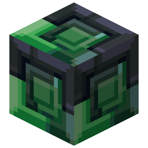
<figcaption>Source media</figcaption>
</figure>

<h2>Block of Adamantite</h2>

Upstream reference information for Block of Adamantite.

Open reference →

</a>
</article>
<article class="reference-card" data-letter="B" data-search="block of high magisteel block of high magisteel">
<a href="blocks-block-of-high-magisteel/" aria-label="Open Block of High Magisteel">
<figure class="reference-card-media reference-card-media--source">
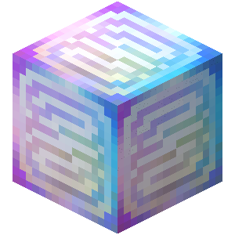
<figcaption>Source media</figcaption>
</figure>

<h2>Block of High Magisteel</h2>

Block of High Magisteel

Open reference →

</a>
</article>
<article class="reference-card" data-letter="B" data-search="block of hihi&#x27;irokane block of hihi&#x27;irokane">
<a href="blocks-block-of-hihiirokane/" aria-label="Open Block of Hihi&#x27;Irokane">
<figure class="reference-card-media reference-card-media--source">
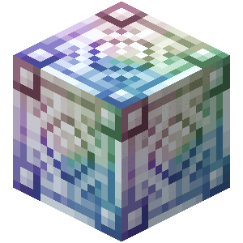
<figcaption>Source media</figcaption>
</figure>

<h2>Block of Hihi&#x27;Irokane</h2>

Block of Hihi&#x27;irokane

Open reference →

</a>
</article>
<article class="reference-card" data-letter="B" data-search="block of low magisteel block of low magisteel">
<a href="blocks-block-of-low-magisteel/" aria-label="Open Block of Low Magisteel">
<figure class="reference-card-media reference-card-media--source">
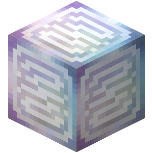
<figcaption>Source media</figcaption>
</figure>

<h2>Block of Low Magisteel</h2>

Block of Low Magisteel

Open reference →

</a>
</article>
<article class="reference-card" data-letter="B" data-search="block of magic ore refining 1 block of magic ore into 2 pure magisteel ingots">
<a href="blocks-block-of-magic-ore/" aria-label="Open Block of Magic Ore">
<figure class="reference-card-media reference-card-media--source">
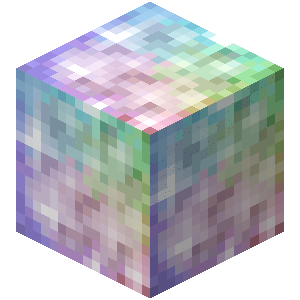
<figcaption>Source media</figcaption>
</figure>

<h2>Block of Magic Ore</h2>

Refining 1 Block of Magic Ore into 2 Pure Magisteel Ingots

Open reference →

</a>
</article>
<article class="reference-card" data-letter="B" data-search="block of mithril upstream reference information for block of mithril.">
<a href="blocks-block-of-mithril/" aria-label="Open Block of Mithril">
<figure class="reference-card-media reference-card-media--source">
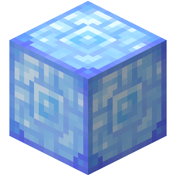
<figcaption>Source media</figcaption>
</figure>

<h2>Block of Mithril</h2>

Upstream reference information for Block of Mithril.

Open reference →

</a>
</article>
<article class="reference-card" data-letter="B" data-search="block of orichalcum upstream reference information for block of orichalcum.">
<a href="blocks-block-of-orichalcum/" aria-label="Open Block of Orichalcum">
<figure class="reference-card-media reference-card-media--source">
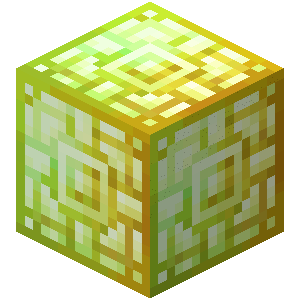
<figcaption>Source media</figcaption>
</figure>

<h2>Block of Orichalcum</h2>

Upstream reference information for Block of Orichalcum.

Open reference →

</a>
</article>
<article class="reference-card" data-letter="B" data-search="block of pure magisteel block of pure magisteel">
<a href="blocks-block-of-pure-magisteel/" aria-label="Open Block of Pure Magisteel">
<figure class="reference-card-media reference-card-media--source">
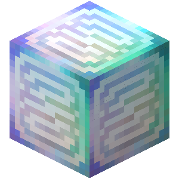
<figcaption>Source media</figcaption>
</figure>

<h2>Block of Pure Magisteel</h2>

Block of Pure Magisteel

Open reference →

</a>
</article>
<article class="reference-card" data-letter="B" data-search="block of raw silver upstream reference information for block of raw silver.">
<a href="blocks-block-of-raw-silver/" aria-label="Open Block of Raw Silver">
<figure class="reference-card-media reference-card-media--source">
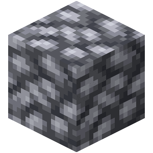
<figcaption>Source media</figcaption>
</figure>

<h2>Block of Raw Silver</h2>

Upstream reference information for Block of Raw Silver.

Open reference →

</a>
</article>
<article class="reference-card" data-letter="B" data-search="block of silver upstream reference information for block of silver.">
<a href="blocks-block-of-silver/" aria-label="Open Block of Silver">
<figure class="reference-card-media reference-card-media--source">
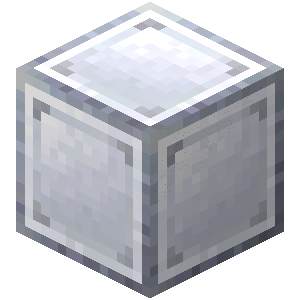
<figcaption>Source media</figcaption>
</figure>

<h2>Block of Silver</h2>

Upstream reference information for Block of Silver.

Open reference →

</a>
</article>
<article class="reference-card" data-letter="C" data-search="charybdis core found inside the core room of the charybdis cave and used to summon charybdis .">
<a href="blocks-charybdis-core/" aria-label="Open Charybdis Core">
<figure class="reference-card-media reference-card-media--source">
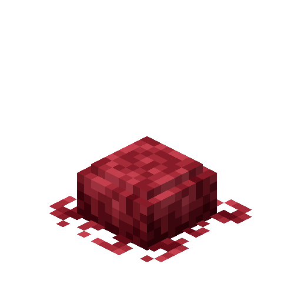
<figcaption>Source media</figcaption>
</figure>

<h2>Charybdis Core</h2>

Found inside the Core room of the Charybdis Cave and used to summon Charybdis .

Open reference →

</a>
</article>
<article class="reference-card" data-letter="C" data-search="chilled slime block upstream reference information for chilled slime block.">
<a href="blocks-chilled-slime-block/" aria-label="Open Chilled Slime Block">
<figure class="reference-card-media reference-card-media--source">
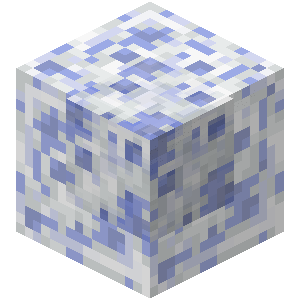
<figcaption>Source media</figcaption>
</figure>

<h2>Chilled Slime Block</h2>

Upstream reference information for Chilled Slime Block.

Open reference →

</a>
</article>
<article class="reference-card" data-letter="H" data-search="high quality magic crystal block high quality magic crystal block">
<a href="blocks-high-quality-magic-crystal-block/" aria-label="Open High Quality Magic Crystal Block">
<figure class="reference-card-media reference-card-media--source">
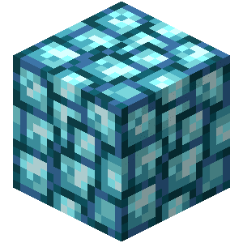
<figcaption>Source media</figcaption>
</figure>

<h2>High Quality Magic Crystal Block</h2>

High Quality Magic Crystal Block

Open reference →

</a>
</article>
<article class="reference-card" data-letter="K" data-search="kiln to activate, right click the kiln to open the menu">
<a href="blocks-kiln/" aria-label="Open Kiln">
<figure class="reference-card-media reference-card-media--source">
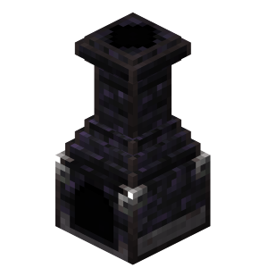
<figcaption>Source media</figcaption>
</figure>

<h2>Kiln</h2>

To activate, right click the Kiln to open the menu

Open reference →

</a>
</article>
<article class="reference-card" data-letter="L" data-search="low quality magic crystal block low quality magic crystal block">
<a href="blocks-low-quality-magic-crystal-block/" aria-label="Open Low Quality Magic Crystal Block">
<figure class="reference-card-media reference-card-media--source">
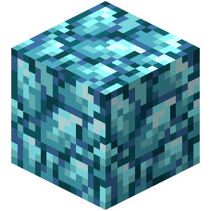
<figcaption>Source media</figcaption>
</figure>

<h2>Low Quality Magic Crystal Block</h2>

Low Quality Magic Crystal Block

Open reference →

</a>
</article>
<article class="reference-card" data-letter="M" data-search="magic engine to activate, you need to right click the magic engine to work.">
<a href="blocks-magic-engine/" aria-label="Open Magic Engine">
<figure class="reference-card-media reference-card-media--source">
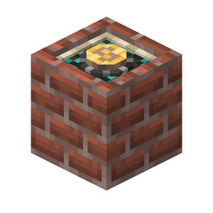
<figcaption>Source media</figcaption>
</figure>

<h2>Magic Engine</h2>

To activate, you need to right click the magic engine to work.

Open reference →

</a>
</article>
<article class="reference-card" data-letter="M" data-search="magic ore magic ore : 3 deepslate magic ore : 4.5">
<a href="blocks-magic-ore/" aria-label="Open Magic Ore">
<figure class="reference-card-media reference-card-media--source">
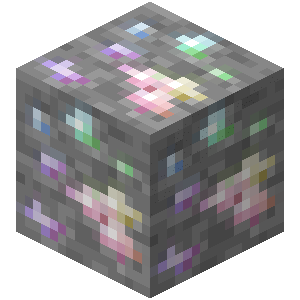
<figcaption>Source media</figcaption>
</figure>

<h2>Magic Ore</h2>

Magic Ore : 3 Deepslate Magic Ore : 4.5

Open reference →

</a>
</article>
<article class="reference-card" data-letter="M" data-search="medium quality magic crystal block medium quality magic crystal block">
<a href="blocks-medium-quality-magic-crystal-block/" aria-label="Open Medium Quality Magic Crystal Block">
<figure class="reference-card-media reference-card-media--source">
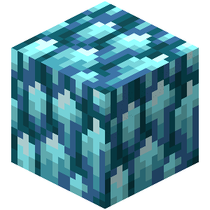
<figcaption>Source media</figcaption>
</figure>

<h2>Medium Quality Magic Crystal Block</h2>

Medium Quality Magic Crystal Block

Open reference →

</a>
</article>
<article class="reference-card" data-letter="M" data-search="moth egg upstream reference information for moth egg.">
<a href="blocks-moth-egg/" aria-label="Open Moth Egg">
<figure class="reference-card-media reference-card-media--source">
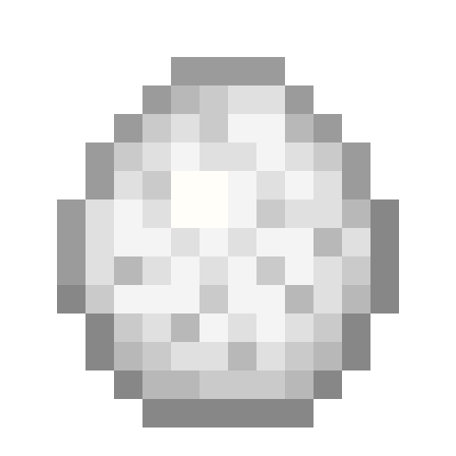
<figcaption>Source media</figcaption>
</figure>

<h2>Moth Egg</h2>

Upstream reference information for Moth Egg.

Open reference →

</a>
</article>
<article class="reference-card" data-letter="P" data-search="palm log upstream reference information for palm log.">
<a href="blocks-palm-log/" aria-label="Open Palm Log">
<figure class="reference-card-media reference-card-media--source">
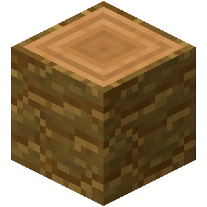
<figcaption>Source media</figcaption>
</figure>

<h2>Palm Log</h2>

Upstream reference information for Palm Log.

Open reference →

</a>
</article>
<article class="reference-card" data-letter="P" data-search="palm wood upstream reference information for palm wood.">
<a href="blocks-palm-wood/" aria-label="Open Palm Wood">
<figure class="reference-card-media reference-card-media--source">
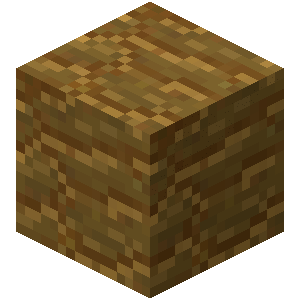
<figcaption>Source media</figcaption>
</figure>

<h2>Palm Wood</h2>

Upstream reference information for Palm Wood.

Open reference →

</a>
</article>
<article class="reference-card" data-letter="S" data-search="silver ore deepslate silver ore">
<a href="blocks-silver-ore/" aria-label="Open Silver Ore">
<figure class="reference-card-media reference-card-media--source">
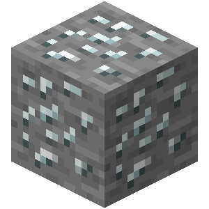
<figcaption>Source media</figcaption>
</figure>

<h2>Silver Ore</h2>

Deepslate Silver Ore

Open reference →

</a>
</article>
<article class="reference-card" data-letter="S" data-search="slime chunk block upstream reference information for slime chunk block.">
<a href="blocks-slime-chunk-block/" aria-label="Open Slime Chunk Block">
<figure class="reference-card-media reference-card-media--source">
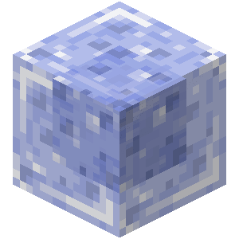
<figcaption>Source media</figcaption>
</figure>

<h2>Slime Chunk Block</h2>

Upstream reference information for Slime Chunk Block.

Open reference →

</a>
</article>
<article class="reference-card" data-letter="S" data-search="smithing bench the smithing bench is used to make a variety of tensura:reincarnated armor, gear and other special items. most of the gear created with the smithing bench is unlocked…">
<a href="blocks-smithing-bench/" aria-label="Open Smithing Bench">
<figure class="reference-card-media reference-card-media--source">
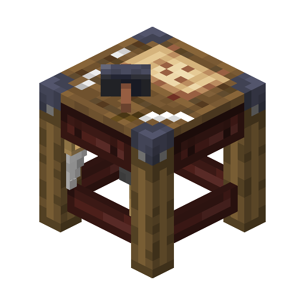
<figcaption>Source media</figcaption>
</figure>

<h2>Smithing Bench</h2>

The Smithing Bench is used to make a variety of Tensura:Reincarnated Armor, Gear and other special items. Most of the gear created with the Smithing Bench is unlocked…

Open reference →

</a>
</article>
<article class="reference-card" data-letter="U" data-search="underworld barrens daemons for days! magicule density - 104,000">
<a href="underworld-barrens/" aria-label="Open Underworld Barrens">
<figure class="reference-card-media reference-card-media--theme">

<figcaption>TSR artwork</figcaption>
</figure>

<h2>Underworld Barrens</h2>

Daemons for days! Magicule Density - 104,000

Open reference →

</a>
</article>
<article class="reference-card" data-letter="U" data-search="underworld red sands i wonder why the sand is red.">
<a href="underworld-red-sands/" aria-label="Open Underworld Red Sands">
<figure class="reference-card-media reference-card-media--theme">

<figcaption>TSR artwork</figcaption>
</figure>

<h2>Underworld Red Sands</h2>

I wonder why the sand is red.

Open reference →

</a>
</article>
<article class="reference-card" data-letter="U" data-search="underworld sands its like the beach! but without water and the fish are evil!">
<a href="underworld-sands/" aria-label="Open Underworld Sands">
<figure class="reference-card-media reference-card-media--theme">

<figcaption>TSR artwork</figcaption>
</figure>

<h2>Underworld Sands</h2>

Its like the beach! But without water and the fish are evil!

Open reference →

</a>
</article>
<article class="reference-card" data-letter="U" data-search="underworld spikes spiky magicule density - 103,000">
<a href="underworld-spikes/" aria-label="Open Underworld Spikes">
<figure class="reference-card-media reference-card-media--theme">

<figcaption>TSR artwork</figcaption>
</figure>

<h2>Underworld Spikes</h2>

Spiky Magicule Density - 103,000

Open reference →

</a>
</article>

No matching articles. Try a broader search.

</section>
