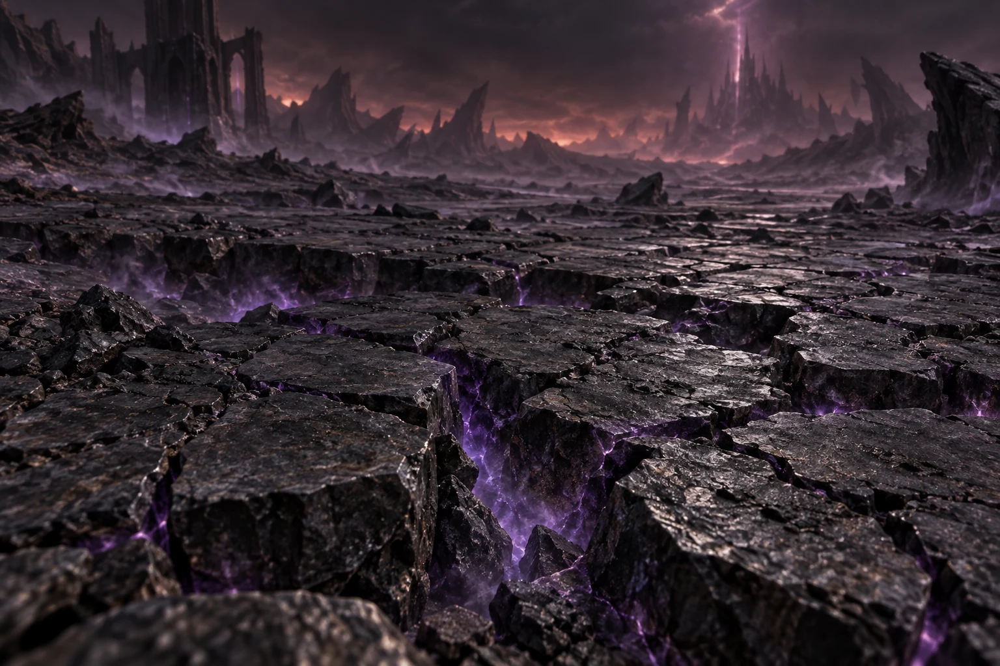
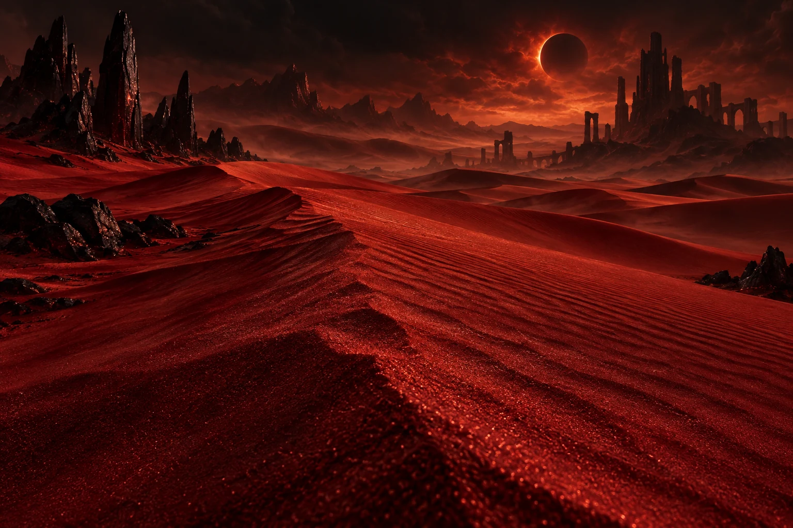
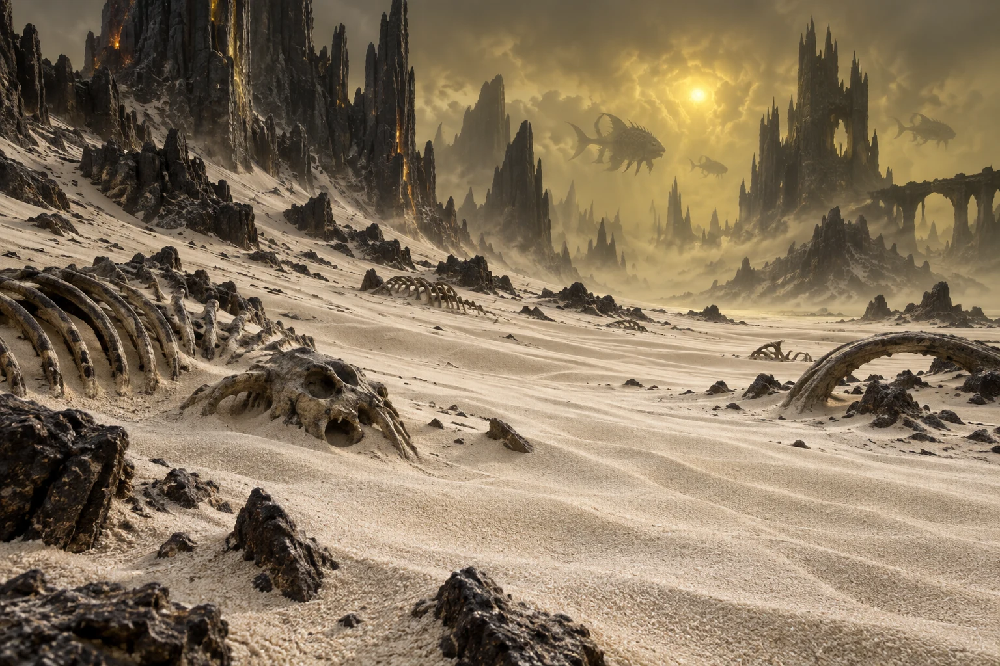
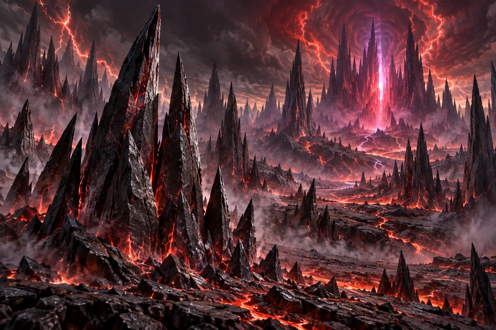

<section class="reference-directory" data-reference-directory="blocks">
<header class="reference-directory-hero reference-theme-world">

Tensura reference collection

<h1>Blocks</h1>

Mechanically relevant blocks and block families.

<strong>35</strong> articles

</header>

<label class="reference-filter-label">
Filter this collection
<input type="search" class="reference-filter-input" placeholder="Search titles and summaries…" autocomplete="off">
</label>

<button type="button" class="is-active" data-letter="all" aria-pressed="true">All</button>
<button type="button" data-letter="B" aria-pressed="false">B</button>
<button type="button" data-letter="C" aria-pressed="false">C</button>
<button type="button" data-letter="D" aria-pressed="false">D</button>
<button type="button" data-letter="E" aria-pressed="false">E</button>
<button type="button" data-letter="G" aria-pressed="false">G</button>
<button type="button" data-letter="H" aria-pressed="false">H</button>
<button type="button" data-letter="I" aria-pressed="false">I</button>
<button type="button" data-letter="K" aria-pressed="false">K</button>
<button type="button" data-letter="L" aria-pressed="false">L</button>
<button type="button" data-letter="M" aria-pressed="false">M</button>
<button type="button" data-letter="P" aria-pressed="false">P</button>
<button type="button" data-letter="S" aria-pressed="false">S</button>
<button type="button" data-letter="U" aria-pressed="false">U</button>

Showing 35 of 35 articles

<article class="reference-card" data-letter="B" data-search="block of adamantite the solid block form of adamantite, the late-stage material reached after high magisteel equipment progression.">
<a href="blocks-block-of-adamantite/" aria-label="Open Block of Adamantite">
<figure class="reference-card-media reference-card-media--source">

<figcaption>Source media</figcaption>
</figure>

<h2>Block of Adamantite</h2>

The solid block form of Adamantite, the late-stage material reached after High Magisteel equipment progression.

Open reference →

</a>
</article>
<article class="reference-card" data-letter="B" data-search="block of high magisteel a consolidated high magisteel material block represented by its verified upstream game texture.">
<a href="blocks-block-of-high-magisteel/" aria-label="Open Block of High Magisteel">
<figure class="reference-card-media reference-card-media--source">

<figcaption>Source media</figcaption>
</figure>

<h2>Block of High Magisteel</h2>

A consolidated High Magisteel material block represented by its verified upstream game texture.

Open reference →

</a>
</article>
<article class="reference-card" data-letter="B" data-search="block of hihi&#x27;irokane the solid block form of hihi&#x27;irokane, a high-tier material used across advanced equipment progression.">
<a href="blocks-block-of-hihiirokane/" aria-label="Open Block of Hihi&#x27;Irokane">
<figure class="reference-card-media reference-card-media--source">

<figcaption>Source media</figcaption>
</figure>

<h2>Block of Hihi&#x27;Irokane</h2>

The solid block form of Hihi&#x27;Irokane, a high-tier material used across advanced equipment progression.

Open reference →

</a>
</article>
<article class="reference-card" data-letter="B" data-search="block of low magisteel a consolidated low magisteel material block represented by its verified upstream game texture.">
<a href="blocks-block-of-low-magisteel/" aria-label="Open Block of Low Magisteel">
<figure class="reference-card-media reference-card-media--source">

<figcaption>Source media</figcaption>
</figure>

<h2>Block of Low Magisteel</h2>

A consolidated Low Magisteel material block represented by its verified upstream game texture.

Open reference →

</a>
</article>
<article class="reference-card" data-letter="B" data-search="block of magic ore a compressed magic ore block that the source documents as refining into two pure magisteel ingots.">
<a href="blocks-block-of-magic-ore/" aria-label="Open Block of Magic Ore">
<figure class="reference-card-media reference-card-media--source">

<figcaption>Source media</figcaption>
</figure>

<h2>Block of Magic Ore</h2>

A compressed Magic Ore block that the source documents as refining into two Pure Magisteel Ingots.

Open reference →

</a>
</article>
<article class="reference-card" data-letter="B" data-search="block of mithril the solid block form of mithril, one of tensura&#x27;s equipment and crafting materials.">
<a href="blocks-block-of-mithril/" aria-label="Open Block of Mithril">
<figure class="reference-card-media reference-card-media--source">

<figcaption>Source media</figcaption>
</figure>

<h2>Block of Mithril</h2>

The solid block form of Mithril, one of Tensura&#x27;s equipment and crafting materials.

Open reference →

</a>
</article>
<article class="reference-card" data-letter="B" data-search="block of orichalcum the solid block form of orichalcum, an advanced material used in high-tier equipment progression.">
<a href="blocks-block-of-orichalcum/" aria-label="Open Block of Orichalcum">
<figure class="reference-card-media reference-card-media--source">

<figcaption>Source media</figcaption>
</figure>

<h2>Block of Orichalcum</h2>

The solid block form of Orichalcum, an advanced material used in high-tier equipment progression.

Open reference →

</a>
</article>
<article class="reference-card" data-letter="B" data-search="block of pure magisteel a pure magisteel material block that can be used to revive the elemental colossus.">
<a href="blocks-block-of-pure-magisteel/" aria-label="Open Block of Pure Magisteel">
<figure class="reference-card-media reference-card-media--source">

<figcaption>Source media</figcaption>
</figure>

<h2>Block of Pure Magisteel</h2>

A Pure Magisteel material block that can be used to revive the Elemental Colossus.

Open reference →

</a>
</article>
<article class="reference-card" data-letter="B" data-search="block of raw silver the block form of raw silver obtained from the mod&#x27;s silver ore family.">
<a href="blocks-block-of-raw-silver/" aria-label="Open Block of Raw Silver">
<figure class="reference-card-media reference-card-media--source">

<figcaption>Source media</figcaption>
</figure>

<h2>Block of Raw Silver</h2>

The block form of Raw Silver obtained from the mod&#x27;s Silver Ore family.

Open reference →

</a>
</article>
<article class="reference-card" data-letter="B" data-search="block of silver the refined block form of silver, a material associated with holy equipment properties.">
<a href="blocks-block-of-silver/" aria-label="Open Block of Silver">
<figure class="reference-card-media reference-card-media--source">

<figcaption>Source media</figcaption>
</figure>

<h2>Block of Silver</h2>

The refined block form of Silver, a material associated with holy equipment properties.

Open reference →

</a>
</article>
<article class="reference-card" data-letter="C" data-search="cadence acceleration glass a replaceable glass field block tracked by the nightmares cadence time-acceleration handler.">
<a href="nightmares-cadence-acceleration-glass/" aria-label="Open Cadence Acceleration Glass">
<figure class="reference-card-media reference-card-media--source">

<figcaption>TSR reference symbol</figcaption>
</figure>

<h2>Cadence Acceleration Glass</h2>
<small class="skill-reference-status">1.21.1 reference · Server build match pending</small>

A replaceable glass field block tracked by the Nightmares Cadence time-acceleration handler.

<dl class="reference-card-stats"><dt>Source</dt><dd>Tensura Nightmares 1.0.3.2.8</dd><dt>Registry ID</dt><dd>trnightmare:cadence_accel_glass</dd><dt>Role</dt><dd>Cadence time-field helper</dd><dt>Visual</dt><dd>Glass-textured field block</dd><dt>Player access</dt><dd>Skill-created/internal block</dd></dl><small class="reference-card-source-note">Reference release; server build match pending.</small>
Open reference →

</a>
</article>
<article class="reference-card" data-letter="C" data-search="charybdis core a boss-summoning core found in charybdis cave that must absorb 100,000 ep from nearby kills before activation.">
<a href="blocks-charybdis-core/" aria-label="Open Charybdis Core">
<figure class="reference-card-media reference-card-media--source">

<figcaption>Source media</figcaption>
</figure>

<h2>Charybdis Core</h2>

A boss-summoning core found in Charybdis Cave that must absorb 100,000 EP from nearby kills before activation.

Open reference →

</a>
</article>
<article class="reference-card" data-letter="C" data-search="chilled slime block a chilled variant of the slime resource block, shown with its verified upstream game texture.">
<a href="blocks-chilled-slime-block/" aria-label="Open Chilled Slime Block">
<figure class="reference-card-media reference-card-media--source">

<figcaption>Source media</figcaption>
</figure>

<h2>Chilled Slime Block</h2>

A chilled variant of the Slime resource block, shown with its verified upstream game texture.

Open reference →

</a>
</article>
<article class="reference-card" data-letter="D" data-search="domicile door an ownership-aware doorway that connects a player with the private space created by domicile.">
<a href="nightmares-domicile-door/" aria-label="Open Domicile Door">
<figure class="reference-card-media reference-card-media--source">

<figcaption>TSR reference symbol</figcaption>
</figure>

<h2>Domicile Door</h2>
<small class="skill-reference-status">1.21.1 reference · Server build match pending</small>

An ownership-aware doorway that connects a player with the private space created by Domicile.

<dl class="reference-card-stats"><dt>Source</dt><dd>Tensura Nightmares 1.0.3.2.8</dd><dt>Registry ID</dt><dd>trnightmare:domicile_door</dd><dt>Role</dt><dd>Owned Domicile entrance</dd><dt>Visual</dt><dd>Oak-door model</dd><dt>Player access</dt><dd>Domicile-generated block</dd></dl><small class="reference-card-source-note">Reference release; server build match pending.</small>
Open reference →

</a>
</article>
<article class="reference-card" data-letter="D" data-search="domicile trapdoor the trapdoor form of the domicile entrance, with the same ownership and return-travel checks.">
<a href="nightmares-domicile-trapdoor/" aria-label="Open Domicile Trapdoor">
<figure class="reference-card-media reference-card-media--source">

<figcaption>TSR reference symbol</figcaption>
</figure>

<h2>Domicile Trapdoor</h2>
<small class="skill-reference-status">1.21.1 reference · Server build match pending</small>

The trapdoor form of the Domicile entrance, with the same ownership and return-travel checks.

<dl class="reference-card-stats"><dt>Source</dt><dd>Tensura Nightmares 1.0.3.2.8</dd><dt>Registry ID</dt><dd>trnightmare:domicile_trapdoor</dd><dt>Role</dt><dd>Owned Domicile entrance</dd><dt>Visual</dt><dd>Oak-trapdoor model</dd><dt>Player access</dt><dd>Domicile-generated block</dd></dl><small class="reference-card-source-note">Reference release; server build match pending.</small>
Open reference →

</a>
</article>
<article class="reference-card" data-letter="E" data-search="elemental realm portal the invisible, collisionless portal surface used by mysticism&#x27;s registered elemental realm portals.">
<a href="elemental-realm-portal/" aria-label="Open Elemental Realm Portal">
<figure class="reference-card-media reference-card-media--source">

<figcaption>TSR reference symbol</figcaption>
</figure>

<h2>Elemental Realm Portal</h2>

The invisible, collisionless portal surface used by Mysticism&#x27;s registered Elemental Realm portals.

<dl class="reference-card-stats"><dt>Source</dt><dd>TR Mysticism 2.1.2</dd><dt>Registry ID</dt><dd>mysticism:elemental_realm_portal</dd><dt>Role</dt><dd>Dimension portal surface</dd><dt>Visual</dt><dd>Invisible in-world render</dd><dt>Player access</dt><dd>Structure/internal block</dd></dl><small class="reference-card-source-note">Pinned TR Mysticism 2.1.2 artifact.</small>
Open reference →

</a>
</article>
<article class="reference-card" data-letter="G" data-search="gabriel snow crystal a non-occluding ice-textured support block registered for gabriel&#x27;s frost mechanics.">
<a href="nightmares-gabriel-snow-crystal/" aria-label="Open Gabriel Snow Crystal">
<figure class="reference-card-media reference-card-media--source">

<figcaption>TSR reference symbol</figcaption>
</figure>

<h2>Gabriel Snow Crystal</h2>
<small class="skill-reference-status">1.21.1 reference · Server build match pending</small>

A non-occluding ice-textured support block registered for Gabriel&#x27;s frost mechanics.

<dl class="reference-card-stats"><dt>Source</dt><dd>Tensura Nightmares 1.0.3.2.8</dd><dt>Registry ID</dt><dd>trnightmare:gabriel_snow_crystal</dd><dt>Role</dt><dd>Gabriel frost-field helper</dd><dt>Visual</dt><dd>Ice-textured crystal block</dd><dt>Player access</dt><dd>Skill-created/internal block</dd></dl><small class="reference-card-source-note">Reference release; server build match pending.</small>
Open reference →

</a>
</article>
<article class="reference-card" data-letter="H" data-search="high quality magic crystal block the high-quality tier of the consolidated magic crystal block family.">
<a href="blocks-high-quality-magic-crystal-block/" aria-label="Open High Quality Magic Crystal Block">
<figure class="reference-card-media reference-card-media--source">

<figcaption>Source media</figcaption>
</figure>

<h2>High Quality Magic Crystal Block</h2>

The high-quality tier of the consolidated Magic Crystal block family.

Open reference →

</a>
</article>
<article class="reference-card" data-letter="I" data-search="ice ore mysticism&#x27;s ice essence ore, documented for cold-biome generation in the pinned 1.21.1 build.">
<a href="../../mysticism-reference/blocks/blocks-ice-ore/" aria-label="Open Ice Ore">
<figure class="reference-card-media reference-card-media--source">

<figcaption>Source media</figcaption>
</figure>

<h2>Ice Ore</h2>

Mysticism&#x27;s Ice Essence ore, documented for cold-biome generation in the pinned 1.21.1 build.

Open reference →

</a>
</article>
<article class="reference-card" data-letter="K" data-search="kiln a processing station that smelts magic ore shards into molten magisteel for further material refinement.">
<a href="blocks-kiln/" aria-label="Open Kiln">
<figure class="reference-card-media reference-card-media--source">

<figcaption>Source media</figcaption>
</figure>

<h2>Kiln</h2>

A processing station that smelts Magic Ore Shards into Molten Magisteel for further material refinement.

Open reference →

</a>
</article>
<article class="reference-card" data-letter="L" data-search="low quality magic crystal block the low-quality tier of the consolidated magic crystal block family.">
<a href="blocks-low-quality-magic-crystal-block/" aria-label="Open Low Quality Magic Crystal Block">
<figure class="reference-card-media reference-card-media--source">

<figcaption>Source media</figcaption>
</figure>

<h2>Low Quality Magic Crystal Block</h2>

The low-quality tier of the consolidated Magic Crystal block family.

Open reference →

</a>
</article>
<article class="reference-card" data-letter="M" data-search="magic engine an activatable machine that lowers ambient magicules in a configurable 16-block radius and can suppress mob spawning.">
<a href="blocks-magic-engine/" aria-label="Open Magic Engine">
<figure class="reference-card-media reference-card-media--source">

<figcaption>Source media</figcaption>
</figure>

<h2>Magic Engine</h2>

An activatable machine that lowers ambient Magicules in a configurable 16-block radius and can suppress mob spawning.

Open reference →

</a>
</article>
<article class="reference-card" data-letter="M" data-search="magic ore a rare ore whose deepslate variant is concentrated near y -27 and drops magic ore shards when mined with the required tool.">
<a href="blocks-magic-ore/" aria-label="Open Magic Ore">
<figure class="reference-card-media reference-card-media--source">

<figcaption>Source media</figcaption>
</figure>

<h2>Magic Ore</h2>

A rare ore whose deepslate variant is concentrated near Y -27 and drops Magic Ore Shards when mined with the required tool.

Open reference →

</a>
</article>
<article class="reference-card" data-letter="M" data-search="medium quality magic crystal block the medium-quality tier of the consolidated magic crystal block family.">
<a href="blocks-medium-quality-magic-crystal-block/" aria-label="Open Medium Quality Magic Crystal Block">
<figure class="reference-card-media reference-card-media--source">

<figcaption>Source media</figcaption>
</figure>

<h2>Medium Quality Magic Crystal Block</h2>

The medium-quality tier of the consolidated Magic Crystal block family.

Open reference →

</a>
</article>
<article class="reference-card" data-letter="M" data-search="moth egg a placed egg block associated with tensura&#x27;s moth creature; the source does not document a normal acquisition route.">
<a href="blocks-moth-egg/" aria-label="Open Moth Egg">
<figure class="reference-card-media reference-card-media--source">

<figcaption>Source media</figcaption>
</figure>

<h2>Moth Egg</h2>

A placed egg block associated with Tensura&#x27;s Moth creature; the source does not document a normal acquisition route.

Open reference →

</a>
</article>
<article class="reference-card" data-letter="P" data-search="palm log the bark-sided log from tensura&#x27;s palm wood set and its matching construction family.">
<a href="blocks-palm-log/" aria-label="Open Palm Log">
<figure class="reference-card-media reference-card-media--source">

<figcaption>Source media</figcaption>
</figure>

<h2>Palm Log</h2>

The bark-sided log from Tensura&#x27;s Palm wood set and its matching construction family.

Open reference →

</a>
</article>
<article class="reference-card" data-letter="P" data-search="palm wood the all-bark wood block from tensura&#x27;s palm construction set.">
<a href="blocks-palm-wood/" aria-label="Open Palm Wood">
<figure class="reference-card-media reference-card-media--source">

<figcaption>Source media</figcaption>
</figure>

<h2>Palm Wood</h2>

The all-bark wood block from Tensura&#x27;s Palm construction set.

Open reference →

</a>
</article>
<article class="reference-card" data-letter="S" data-search="silver ore the ore source for raw silver; its regular and deepslate variants require different minimum pickaxe tiers.">
<a href="blocks-silver-ore/" aria-label="Open Silver Ore">
<figure class="reference-card-media reference-card-media--source">

<figcaption>Source media</figcaption>
</figure>

<h2>Silver Ore</h2>

The ore source for Raw Silver; its regular and deepslate variants require different minimum pickaxe tiers.

Open reference →

</a>
</article>
<article class="reference-card" data-letter="S" data-search="slime chunk block the block form of slime chunks, represented with its verified upstream game texture.">
<a href="blocks-slime-chunk-block/" aria-label="Open Slime Chunk Block">
<figure class="reference-card-media reference-card-media--source">

<figcaption>Source media</figcaption>
</figure>

<h2>Slime Chunk Block</h2>

The block form of Slime Chunks, represented with its verified upstream game texture.

Open reference →

</a>
</article>
<article class="reference-card" data-letter="S" data-search="smithing bench tensura&#x27;s specialist crafting station for schematic-unlocked armor, weapons, tools, and other gear.">
<a href="blocks-smithing-bench/" aria-label="Open Smithing Bench">
<figure class="reference-card-media reference-card-media--source">

<figcaption>Source media</figcaption>
</figure>

<h2>Smithing Bench</h2>

Tensura&#x27;s specialist crafting station for schematic-unlocked armor, weapons, tools, and other gear.

Open reference →

</a>
</article>
<article class="reference-card" data-letter="S" data-search="stasis lattice an invisible lattice block registered as implementation support for nightmares&#x27; stasis field.">
<a href="nightmares-stasis-lattice/" aria-label="Open Stasis Lattice">
<figure class="reference-card-media reference-card-media--source">

<figcaption>TSR reference symbol</figcaption>
</figure>

<h2>Stasis Lattice</h2>
<small class="skill-reference-status">1.21.1 reference · Server build match pending</small>

An invisible lattice block registered as implementation support for Nightmares&#x27; Stasis field.

<dl class="reference-card-stats"><dt>Source</dt><dd>Tensura Nightmares 1.0.3.2.8</dd><dt>Registry ID</dt><dd>trnightmare:stasis_lattice</dd><dt>Role</dt><dd>Stasis field boundary</dd><dt>Visual</dt><dd>Structure-void model</dd><dt>Player access</dt><dd>Skill-created/internal block</dd></dl><small class="reference-card-source-note">Reference release; server build match pending.</small>
Open reference →

</a>
</article>
<article class="reference-card" data-letter="U" data-search="underworld barrens a 104,000-density underworld terrain block associated with daemon and hound dog territory.">
<a href="underworld-barrens/" aria-label="Open Underworld Barrens">
<figure class="reference-card-media reference-card-media--theme">

<figcaption>TSR artwork</figcaption>
</figure>

<h2>Underworld Barrens</h2>

A 104,000-density Underworld terrain block associated with Daemon and Hound Dog territory.

<dl class="reference-card-stats"><dt>Mobs</dt><dd>Arch DaemonGreater DaemonLesser DaemonHound Dog</dd></dl><small class="reference-card-source-note">Upstream reference values; server settings may differ.</small>
Open reference →

</a>
</article>
<article class="reference-card" data-letter="U" data-search="underworld red sands a 102,000-density red underworld sand found around big ruins and hostile local spawns.">
<a href="underworld-red-sands/" aria-label="Open Underworld Red Sands">
<figure class="reference-card-media reference-card-media--theme">

<figcaption>TSR artwork</figcaption>
</figure>

<h2>Underworld Red Sands</h2>

A 102,000-density red Underworld sand found around Big Ruins and hostile local spawns.

<dl class="reference-card-stats"><dt>Mobs</dt><dd>Arch DaemonGreater DaemonLesser DaemonMegalodon</dd></dl><small class="reference-card-source-note">Upstream reference values; server settings may differ.</small>
Open reference →

</a>
</article>
<article class="reference-card" data-letter="U" data-search="underworld sands a 101,000-density underworld sand used around ruins and hostile local spawns.">
<a href="underworld-sands/" aria-label="Open Underworld Sands">
<figure class="reference-card-media reference-card-media--theme">

<figcaption>TSR artwork</figcaption>
</figure>

<h2>Underworld Sands</h2>

A 101,000-density Underworld sand used around Ruins and hostile local spawns.

<dl class="reference-card-stats"><dt>Mobs</dt><dd>Arch DaemonGreater DaemonLesser DaemonMegalodon</dd></dl><small class="reference-card-source-note">Upstream reference values; server settings may differ.</small>
Open reference →

</a>
</article>
<article class="reference-card" data-letter="U" data-search="underworld spikes a 103,000-density spiked underworld terrain block associated with daemon territory.">
<a href="underworld-spikes/" aria-label="Open Underworld Spikes">
<figure class="reference-card-media reference-card-media--theme">

<figcaption>TSR artwork</figcaption>
</figure>

<h2>Underworld Spikes</h2>

A 103,000-density spiked Underworld terrain block associated with Daemon territory.

<dl class="reference-card-stats"><dt>Mobs</dt><dd>Arch DaemonGreater DaemonLesser Daemon</dd></dl><small class="reference-card-source-note">Upstream reference values; server settings may differ.</small>
Open reference →

</a>
</article>

No matching articles. Try a broader search.

</section>
