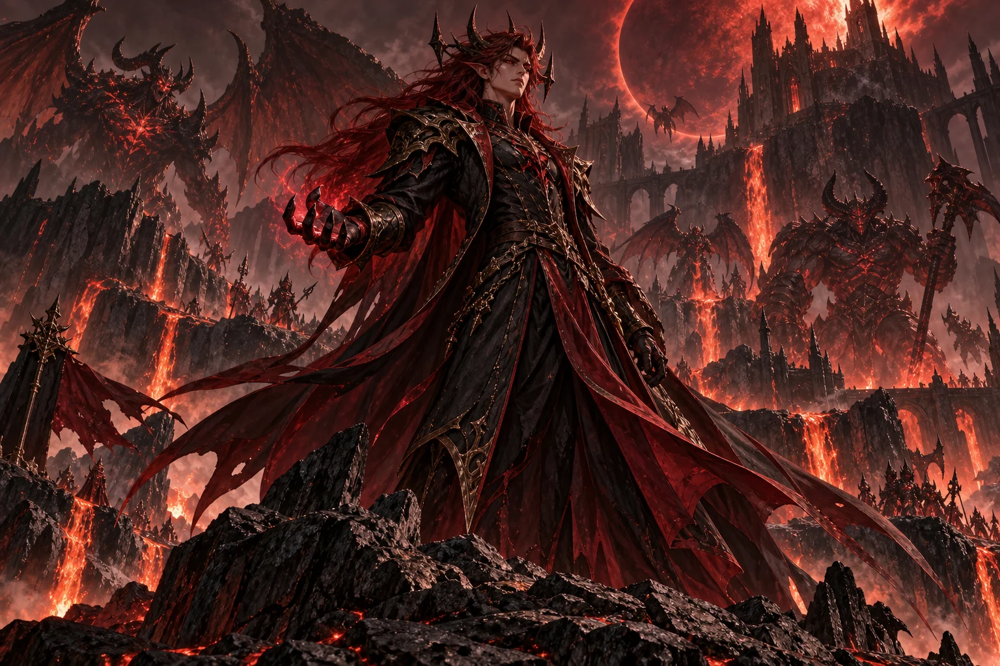
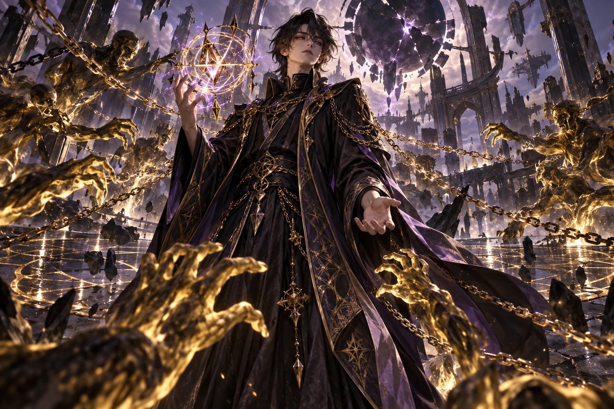

<section class="reference-directory" data-reference-directory="bosses">
<header class="reference-directory-hero reference-theme-bestiary">

Tensura reference collection

<h1>Bosses</h1>

Documented boss encounters.

<strong>15</strong> articles

</header>

<label class="reference-filter-label">
Filter this collection
<input type="search" class="reference-filter-input" placeholder="Search titles and summaries…" autocomplete="off">
</label>

<button type="button" class="is-active" data-letter="all" aria-pressed="true">All</button>
<button type="button" data-letter="A" aria-pressed="false">A</button>
<button type="button" data-letter="C" aria-pressed="false">C</button>
<button type="button" data-letter="E" aria-pressed="false">E</button>
<button type="button" data-letter="G" aria-pressed="false">G</button>
<button type="button" data-letter="H" aria-pressed="false">H</button>
<button type="button" data-letter="I" aria-pressed="false">I</button>
<button type="button" data-letter="O" aria-pressed="false">O</button>
<button type="button" data-letter="P" aria-pressed="false">P</button>
<button type="button" data-letter="S" aria-pressed="false">S</button>
<button type="button" data-letter="U" aria-pressed="false">U</button>
<button type="button" data-letter="W" aria-pressed="false">W</button>
<button type="button" data-letter="Y" aria-pressed="false">Y</button>

Showing 15 of 15 articles

<article class="reference-card" data-letter="A" data-search="akash this is a greater space spirit summoned by hinata sakaguchi.">
<a href="mobs-akash/" aria-label="Open Akash">
<figure class="reference-card-media reference-card-media--source">

<figcaption>Source media</figcaption>
</figure>

<h2>Akash</h2>

This is a Greater Space Spirit summoned by Hinata Sakaguchi.

<dl class="reference-card-stats"><dt>Health</dt><dd>240</dd><dt>Spiritual Health</dt><dd>480</dd><dt>Armor</dt><dd>5</dd><dt>Minimum EP</dt><dd>120000</dd><dt>Maximum EP</dt><dd>150000</dd><dt>Resistances</dt><dd>Spatial Attack Nullification</dd><dt>Intrinsic</dt><dd>Space Transform</dd><dt>Extra</dt><dd>Spatial Manipulation</dd></dl><small class="reference-card-source-note">Upstream reference values; server settings may differ.</small>
Open reference →

</a>
</article>
<article class="reference-card" data-letter="C" data-search="charybdis a mob that only appears once the charybdis core is filled with 100k ep and right clicked. very dangerous">
<a href="mobs-charybdis/" aria-label="Open Charybdis">
<figure class="reference-card-media reference-card-media--source">

<figcaption>Source media</figcaption>
</figure>

<h2>Charybdis</h2>

A mob that only appears once the Charybdis Core is filled with 100K EP and Right Clicked. Very Dangerous

<dl class="reference-card-stats"><dt>Health</dt><dd>3000</dd><dt>Spiritual Health</dt><dd>6000</dd><dt>Armor</dt><dd>20</dd><dt>Minimum EP</dt><dd>1400000</dd><dt>Maximum EP</dt><dd>1600000</dd><dt>Resistances</dt><dd>Pain Resistance · Physical Attack Resistance · Paralysis Resistance</dd><dt>Common</dt><dd>Gravity Flight</dd><dt>Extra</dt><dd>Gravity Manipulation · Magic Jamming · Magic Sense · Ultraspeed Regeneration</dd></dl><small class="reference-card-source-note">Upstream reference values; server settings may differ.</small>
Open reference →

</a>
</article>
<article class="reference-card" data-letter="E" data-search="elemental colossus the elemental colossus is a heavily armored melee boss that can both fight nearby targets and rapidly close large distances. its attacks include melee strikes, a…">
<a href="mobs-elemental-colossus/" aria-label="Open Elemental Colossus">
<figure class="reference-card-media reference-card-media--source">

<figcaption>Source media</figcaption>
</figure>

<h2>Elemental Colossus</h2>

The Elemental Colossus is a heavily armored melee boss that can both fight nearby targets and rapidly close large distances. Its attacks include melee strikes, a…

<dl class="reference-card-stats"><dt>Health</dt><dd>600</dd><dt>Spiritual Health</dt><dd>1200</dd><dt>Armor</dt><dd>40</dd><dt>Attack</dt><dd>50</dd><dt>Minimum EP</dt><dd>330000</dd><dt>Maximum EP</dt><dd>350000</dd><dt>Resistances</dt><dd>Thermal Fluctuation Resistance</dd></dl><small class="reference-card-source-note">Upstream reference values; server settings may differ.</small>
Open reference →

</a>
</article>
<article class="reference-card" data-letter="G" data-search="gazel dwargo the king of the dwarves, one of the strongest bosses in the game with the sole exception of hinata sakaguchi of course. hostile towards those who enter his chamber to…">
<a href="mobs-gazel-dwargo/" aria-label="Open Gazel Dwargo">
<figure class="reference-card-media reference-card-media--source">

<figcaption>Source media</figcaption>
</figure>

<h2>Gazel Dwargo</h2>

The king of the dwarves, One of the strongest bosses in the game with the sole exception of Hinata Sakaguchi of course. Hostile towards those who enter his chamber to…

<dl class="reference-card-stats"><dt>Health</dt><dd>1000</dd><dt>Spiritual Health</dt><dd>3600</dd><dt>Armor</dt><dd>50</dd><dt>Minimum EP</dt><dd>1036331</dd><dt>Maximum EP</dt><dd>1036332</dd><dt>Nullifications</dt><dd>Poison Nullification · Corrosion Nullification</dd><dt>Resistances</dt><dd>Darkness Attack Resistance · Heat Resistance · Cold Resistance · Abnormal Condition Resistance · Physical Attack Resistance · Spiritual Attack Resistance · Magic Resistance · Holy Attack Resistance · Earth Attack Resistance · Flame Attack Resistance · Light Attack Resistance · Spatial Attack Resistance · Water Attack Resistance · Wind Attack Resistance</dd><dt>Extra</dt><dd>Magic Sense · Earth Domination</dd></dl><small class="reference-card-source-note">Upstream reference values; server settings may differ.</small>
Open reference →

</a>
</article>
<article class="reference-card" data-letter="H" data-search="hinata sakaguchi a rare otherworlder, one of the strongest bosses in the game at that. hostile towards the &quot;majin&quot; race (because lore wise, hates monsters), neutral towards non majin">
<a href="mobs-hinata-sakaguchi/" aria-label="Open Hinata Sakaguchi">
<figure class="reference-card-media reference-card-media--source">

<figcaption>Source media</figcaption>
</figure>

<h2>Hinata Sakaguchi</h2>

A Rare otherworlder, One of the strongest bosses in the game at that. Hostile towards the &quot;majin&quot; race (because lore wise, hates monsters), neutral towards non majin

<dl class="reference-card-stats"><dt>Biome</dt><dd>Plains · Snowy Plains · Sunflower Plains· Meadow · Desert · Badlands· Windswept Hills · Sparse Jungle · Savanna Plateau</dd><dt>Health</dt><dd>3000</dd><dt>Spiritual Health</dt><dd>3600</dd><dt>Armor</dt><dd>50</dd><dt>Minimum EP</dt><dd>1036331</dd><dt>Maximum EP</dt><dd>1036332</dd><dt>Nullifications</dt><dd>Earth Attack Nullification · Flame Attack Nullification · Light Attack Nullification · Spatial Attack Nullification · Water Attack Nullification · Wind Attack Nullification · Poison Nullification · Corrosion Nullification · Electricity Nullification</dd><dt>Resistances</dt><dd>Darkness Attack Resistance · Heat Resistance · Cold Resistance · Abnormal Condition Resistance · Physical Attack Resistance · Spiritual Attack Resistance · Magic Resistance · Holy Attack Resistance</dd></dl><small class="reference-card-source-note">Upstream reference values; server settings may differ.</small>
Open reference →

</a>
</article>
<article class="reference-card" data-letter="I" data-search="ifrit the greater fire spirit that is one of the many spirits that hinata has, but also inhabits shizu&#x27;s body.">
<a href="mobs-ifrit/" aria-label="Open Ifrit">
<figure class="reference-card-media reference-card-media--source">

<figcaption>Source media</figcaption>
</figure>

<h2>Ifrit</h2>

The Greater Fire Spirit that is one of the many spirits that Hinata has, but also inhabits Shizu&#x27;s body.

<dl class="reference-card-stats"><dt>Health</dt><dd>400</dd><dt>Spiritual Health</dt><dd>800</dd><dt>Armor</dt><dd>5</dd><dt>Minimum EP</dt><dd>120000</dd><dt>Maximum EP</dt><dd>150000</dd><dt>Resistances</dt><dd>Flame Attack Nullification</dd><dt>Intrinsic</dt><dd>Flame Transform</dd><dt>Common</dt><dd>Ranged Barrier</dd></dl><small class="reference-card-source-note">Upstream reference values; server settings may differ.</small>
Open reference →

</a>
</article>
<article class="reference-card" data-letter="O" data-search="orc disaster a boss that appears after an orc lord reaches 200k ep">
<a href="mobs-orc-disaster/" aria-label="Open Orc Disaster">
<figure class="reference-card-media reference-card-media--source">

<figcaption>Source media</figcaption>
</figure>

<h2>Orc Disaster</h2>

A Boss that appears after an Orc Lord reaches 200k EP

<dl class="reference-card-stats"><dt>Biome</dt><dd>Desert</dd><dt>Health</dt><dd>700</dd><dt>Spiritual Health</dt><dd>1400</dd><dt>Armor</dt><dd>20</dd><dt>Minimum EP</dt><dd>224435</dd><dt>Maximum EP</dt><dd>250000</dd><dt>Intrinsic</dt><dd>Scale Armor</dd><dt>Common</dt><dd>Corrosion · Self Regeneration · Strength</dd></dl><small class="reference-card-source-note">Upstream reference values; server settings may differ.</small>
Open reference →

</a>
</article>
<article class="reference-card" data-letter="O" data-search="orc lord &quot;eat, kill, all to satisfy my hunger&quot;">
<a href="mobs-orc-lord/" aria-label="Open Orc Lord">
<figure class="reference-card-media reference-card-media--source">

<figcaption>Source media</figcaption>
</figure>

<h2>Orc Lord</h2>

&quot;Eat, kill, all to satisfy my hunger&quot;

<dl class="reference-card-stats"><dt>Biome</dt><dd>Desert, Badlands</dd><dt>Health</dt><dd>200</dd><dt>Spiritual Health</dt><dd>400</dd><dt>Armor</dt><dd>0</dd><dt>Minimum EP</dt><dd>80000</dd><dt>Maximum EP</dt><dd>90000</dd><dt>Intrinsic</dt><dd>Scale Armor</dd><dt>Common</dt><dd>Corrosion · Self Regeneration · Strength</dd></dl><small class="reference-card-source-note">Upstream reference values; server settings may differ.</small>
Open reference →

</a>
</article>
<article class="reference-card" data-letter="P" data-search="primordial rouge the nightmares primordial rouge / gii crimson boss encounter, distinct from the similarly named playable race.">
<a href="nightmares-primordial-rouge/" aria-label="Open Primordial Rouge">
<figure class="reference-card-media reference-card-media--theme">

<figcaption>TSR artwork</figcaption>
</figure>

<h2>Primordial Rouge</h2>
<small class="skill-reference-status">1.21.1 reference · Server build match pending</small>

The Nightmares Primordial Rouge / Gii Crimson boss encounter, distinct from the similarly named playable race.

<dl class="reference-card-stats"><dt>Base health</dt><dd>850</dd><dt>Base spiritual health</dt><dd>5,500</dd><dt>Base armor</dt><dd>40</dd><dt>Base attack damage</dt><dd>15</dd><dt>Minimum EP</dt><dd>1,500,000</dd><dt>Maximum EP</dt><dd>6,666,666</dd><dt>Melee dodge attribute</dt><dd>50%</dd><dt>Projectile dodge attribute</dt><dd>50%</dd></dl><small class="reference-card-source-note">Reference release values; server build match pending.</small>
Open reference →

</a>
</article>
<article class="reference-card" data-letter="S" data-search="shizu a rare otherworlder, upon near death triggers the release of ifrit - after ifrit&#x27;s defeat, shizu will appear defeated and slowly dying. shizu cannot be tamed">
<a href="mobs-shizu/" aria-label="Open Shizu">
<figure class="reference-card-media reference-card-media--source">

<figcaption>Source media</figcaption>
</figure>

<h2>Shizu</h2>

A Rare Otherworlder, upon near death triggers the release of Ifrit - After Ifrit&#x27;s defeat, Shizu will appear defeated and slowly dying. Shizu cannot be tamed

<dl class="reference-card-stats"><dt>Biome</dt><dd>Plains · Snowy Plains · Sunflower Plains· Meadow · Desert · Badlands· Windswept Hills · Sparse Jungle · Savanna Plateau</dd><dt>Health</dt><dd>60</dd><dt>Spiritual Health</dt><dd>120</dd><dt>Armor</dt><dd>13</dd><dt>Minimum EP</dt><dd>193543</dd><dt>Maximum EP</dt><dd>193543</dd><dt>Resistances</dt><dd>Physical Attack Resistance · Flame Attack Nullification</dd><dt>Intrinsic</dt><dd>Flame Transform</dd></dl><small class="reference-card-source-note">Upstream reference values; server settings may differ.</small>
Open reference →

</a>
</article>
<article class="reference-card" data-letter="S" data-search="supermassive slime a rare mob that has a 1/1000 chance to spawn in place of a normal slime">
<a href="mobs-supermassive-slime/" aria-label="Open Supermassive Slime">
<figure class="reference-card-media reference-card-media--source">

<figcaption>Source media</figcaption>
</figure>

<h2>Supermassive Slime</h2>

A rare mob that has a 1/1000 chance to spawn in place of a normal Slime

<dl class="reference-card-stats"><dt>Biome</dt><dd>Plains, Swamps</dd><dt>Health</dt><dd>200</dd><dt>Spiritual Health</dt><dd>400</dd><dt>Armor</dt><dd>2</dd><dt>Minimum EP</dt><dd>50000</dd><dt>Maximum EP</dt><dd>100000</dd><dt>Intrinsic</dt><dd>Absorb &amp; Dissolve</dd><dt>Extra</dt><dd>Ultraspeed Regeneration</dd></dl><small class="reference-card-source-note">Upstream reference values; server settings may differ.</small>
Open reference →

</a>
</article>
<article class="reference-card" data-letter="S" data-search="sylphide the greater wind spirit">
<a href="mobs-sylphide/" aria-label="Open Sylphide">
<figure class="reference-card-media reference-card-media--source">

<figcaption>Source media</figcaption>
</figure>

<h2>Sylphide</h2>

The Greater Wind Spirit

<dl class="reference-card-stats"><dt>Health</dt><dd>400</dd><dt>Spiritual Health</dt><dd>800</dd><dt>Armor</dt><dd>5</dd><dt>Minimum EP</dt><dd>120000</dd><dt>Maximum EP</dt><dd>150000</dd><dt>Resistances</dt><dd>Wind Attack Nullification</dd><dt>Intrinsic</dt><dd>Wind Transform</dd><dt>Extra</dt><dd>Wind Manipulation</dd></dl><small class="reference-card-source-note">Upstream reference values; server settings may differ.</small>
Open reference →

</a>
</article>
<article class="reference-card" data-letter="U" data-search="undine a greater water spirit">
<a href="mobs-undine/" aria-label="Open Undine">
<figure class="reference-card-media reference-card-media--source">

<figcaption>Source media</figcaption>
</figure>

<h2>Undine</h2>

A Greater Water Spirit

<dl class="reference-card-stats"><dt>Health</dt><dd>400</dd><dt>Spiritual Health</dt><dd>800</dd><dt>Armor</dt><dd>5</dd><dt>Minimum EP</dt><dd>120000</dd><dt>Maximum EP</dt><dd>150000</dd><dt>Resistances</dt><dd>Water Attack Nullification</dd><dt>Intrinsic</dt><dd>Water Transform</dd><dt>Extra</dt><dd>Water Manipulation</dd></dl><small class="reference-card-source-note">Upstream reference values; server settings may differ.</small>
Open reference →

</a>
</article>
<article class="reference-card" data-letter="W" data-search="war gnome a greater earth spirit">
<a href="mobs-war-gnome/" aria-label="Open War Gnome">
<figure class="reference-card-media reference-card-media--source">

<figcaption>Source media</figcaption>
</figure>

<h2>War Gnome</h2>

A Greater Earth Spirit

<dl class="reference-card-stats"><dt>Health</dt><dd>400</dd><dt>Spiritual Health</dt><dd>800</dd><dt>Armor</dt><dd>20</dd><dt>Minimum EP</dt><dd>120000</dd><dt>Maximum EP</dt><dd>150000</dd><dt>Resistances</dt><dd>Earth Attack Nullification</dd><dt>Intrinsic</dt><dd>Earth Transform</dd><dt>Extra</dt><dd>Earth Manipulation</dd></dl><small class="reference-card-source-note">Upstream reference values; server settings may differ.</small>
Open reference →

</a>
</article>
<article class="reference-card" data-letter="Y" data-search="yuuki of desire nightmares&#x27; yuuki encounter, named grandmaster - yuuki in the reference release, with creator and greed.">
<a href="nightmares-yuuki-of-desire/" aria-label="Open Yuuki of Desire">
<figure class="reference-card-media reference-card-media--theme">

<figcaption>TSR artwork</figcaption>
</figure>

<h2>Yuuki of Desire</h2>
<small class="skill-reference-status">1.21.1 reference · Server build match pending</small>

Nightmares&#x27; Yuuki encounter, named Grandmaster - Yuuki in the reference release, with Creator and Greed.

<dl class="reference-card-stats"><dt>Base health</dt><dd>4,000</dd><dt>Base spiritual health</dt><dd>6,000</dd><dt>Base armor</dt><dd>0</dd><dt>Base attack damage</dt><dd>45</dd><dt>Minimum EP</dt><dd>3,500,000</dd><dt>Maximum EP</dt><dd>4,500,000</dd><dt>Melee dodge attribute</dt><dd>10%</dd><dt>Projectile dodge attribute</dt><dd>10%</dd></dl><small class="reference-card-source-note">Reference release values; server build match pending.</small>
Open reference →

</a>
</article>

No matching articles. Try a broader search.

</section>
