<section class="reference-directory" data-reference-directory="bosses">
<header class="reference-directory-hero reference-theme-bestiary">

Tensura reference collection

<h1>Bosses</h1>

Documented boss encounters.

<strong>13</strong> articles

</header>

<label class="reference-filter-label">
Filter this collection
<input type="search" class="reference-filter-input" placeholder="Search titles and summaries…" autocomplete="off">
</label>

<button type="button" class="is-active" data-letter="all" aria-pressed="true">All</button>
<button type="button" data-letter="A" aria-pressed="false">A</button>
<button type="button" data-letter="C" aria-pressed="false">C</button>
<button type="button" data-letter="E" aria-pressed="false">E</button>
<button type="button" data-letter="G" aria-pressed="false">G</button>
<button type="button" data-letter="H" aria-pressed="false">H</button>
<button type="button" data-letter="I" aria-pressed="false">I</button>
<button type="button" data-letter="O" aria-pressed="false">O</button>
<button type="button" data-letter="S" aria-pressed="false">S</button>
<button type="button" data-letter="U" aria-pressed="false">U</button>
<button type="button" data-letter="W" aria-pressed="false">W</button>

Showing 13 of 13 articles

<article class="reference-card" data-letter="A" data-search="akash this is a greater space spirit summoned by hinata sakaguchi.">
<a href="mobs-akash/" aria-label="Open Akash">
<figure class="reference-card-media reference-card-media--source">
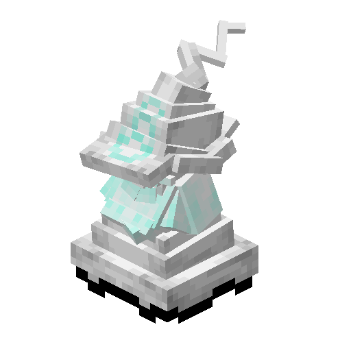
<figcaption>Source media</figcaption>
</figure>

<h2>Akash</h2>

This is a Greater Space Spirit summoned by Hinata Sakaguchi.

Open reference →

</a>
</article>
<article class="reference-card" data-letter="C" data-search="charybdis a mob that only appears once the charybdis core is filled with 100k ep and right clicked. very dangerous">
<a href="mobs-charybdis/" aria-label="Open Charybdis">
<figure class="reference-card-media reference-card-media--source">
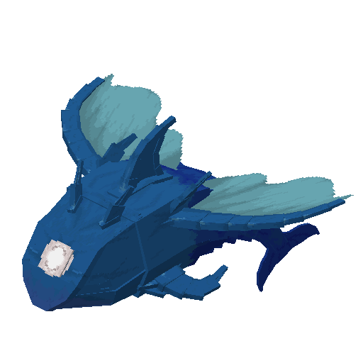
<figcaption>Source media</figcaption>
</figure>

<h2>Charybdis</h2>

A mob that only appears once the Charybdis Core is filled with 100K EP and Right Clicked. Very Dangerous

Open reference →

</a>
</article>
<article class="reference-card" data-letter="E" data-search="elemental colossus the fairy&#x27;s not gonna like this...">
<a href="mobs-elemental-colossus/" aria-label="Open Elemental Colossus">
<figure class="reference-card-media reference-card-media--source">
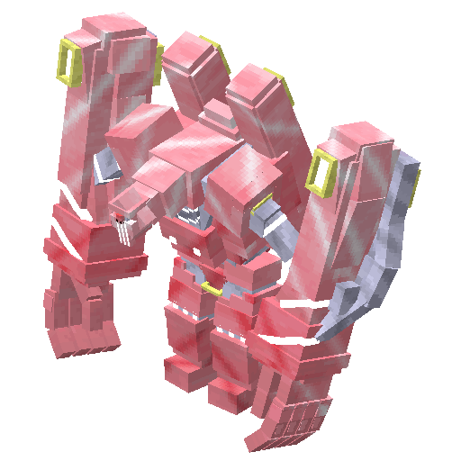
<figcaption>Source media</figcaption>
</figure>

<h2>Elemental Colossus</h2>

The Fairy&#x27;s not gonna like this...

Open reference →

</a>
</article>
<article class="reference-card" data-letter="G" data-search="gazel dwargo the king of the dwarves, one of the strongest bosses in the game with the sole exception of hinata sakaguchi of course. hostile towards those who enter his chamber to…">
<a href="mobs-gazel-dwargo/" aria-label="Open Gazel Dwargo">
<figure class="reference-card-media reference-card-media--source">
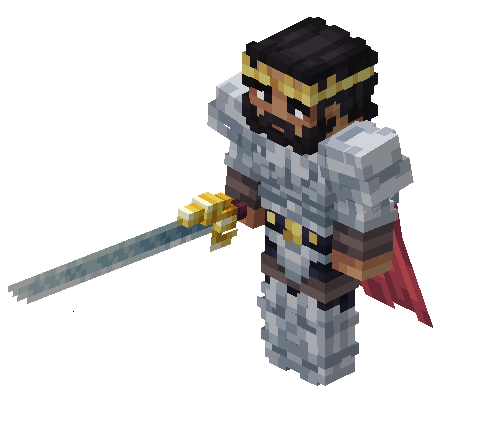
<figcaption>Source media</figcaption>
</figure>

<h2>Gazel Dwargo</h2>

The king of the dwarves, One of the strongest bosses in the game with the sole exception of Hinata Sakaguchi of course. Hostile towards those who enter his chamber to…

Open reference →

</a>
</article>
<article class="reference-card" data-letter="H" data-search="hinata sakaguchi a rare otherworlder, one of the strongest bosses in the game at that. hostile towards the &quot;majin&quot; race (because lore wise, hates monsters), neutral towards non majin">
<a href="mobs-hinata-sakaguchi/" aria-label="Open Hinata Sakaguchi">
<figure class="reference-card-media reference-card-media--source">
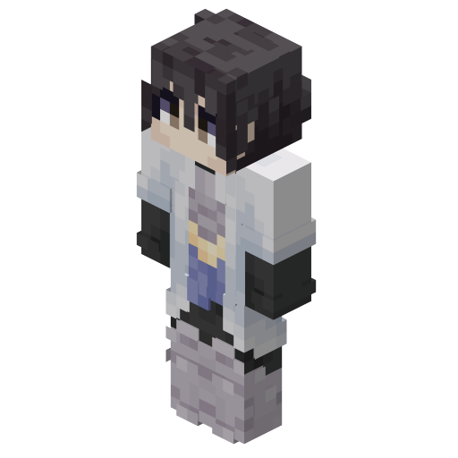
<figcaption>Source media</figcaption>
</figure>

<h2>Hinata Sakaguchi</h2>

A Rare otherworlder, One of the strongest bosses in the game at that. Hostile towards the &quot;majin&quot; race (because lore wise, hates monsters), neutral towards non majin

Open reference →

</a>
</article>
<article class="reference-card" data-letter="I" data-search="ifrit the greater fire spirit that is one of the many spirits that hinata has, but also inhabits shizu&#x27;s body.">
<a href="mobs-ifrit/" aria-label="Open Ifrit">
<figure class="reference-card-media reference-card-media--source">
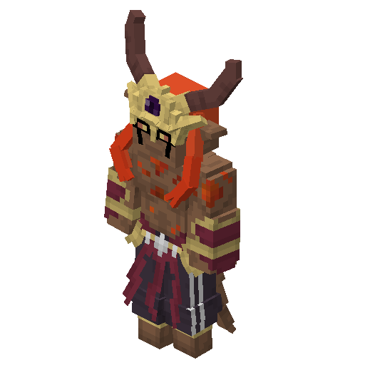
<figcaption>Source media</figcaption>
</figure>

<h2>Ifrit</h2>

The Greater Fire Spirit that is one of the many spirits that Hinata has, but also inhabits Shizu&#x27;s body.

Open reference →

</a>
</article>
<article class="reference-card" data-letter="O" data-search="orc disaster a boss that appears after an orc lord reaches 200k ep">
<a href="mobs-orc-disaster/" aria-label="Open Orc Disaster">
<figure class="reference-card-media reference-card-media--source">
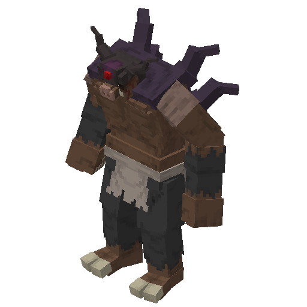
<figcaption>Source media</figcaption>
</figure>

<h2>Orc Disaster</h2>

A Boss that appears after an Orc Lord reaches 200k EP

Open reference →

</a>
</article>
<article class="reference-card" data-letter="O" data-search="orc lord &quot;eat, kill, all to satisfy my hunger&quot;">
<a href="mobs-orc-lord/" aria-label="Open Orc Lord">
<figure class="reference-card-media reference-card-media--source">
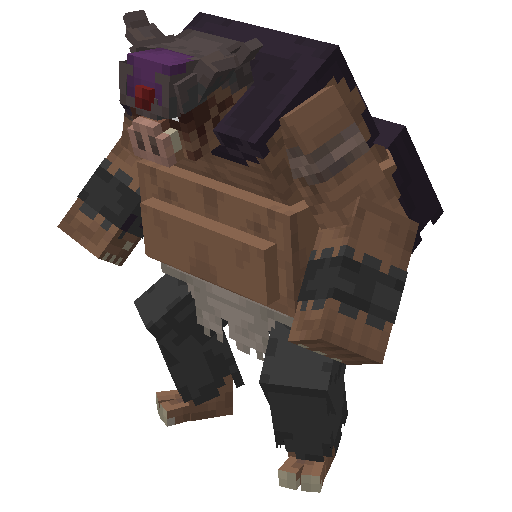
<figcaption>Source media</figcaption>
</figure>

<h2>Orc Lord</h2>

&quot;Eat, kill, all to satisfy my hunger&quot;

Open reference →

</a>
</article>
<article class="reference-card" data-letter="S" data-search="shizu a rare otherworlder, upon near death triggers the release of ifrit - after ifrit&#x27;s defeat, shizu will appear defeated and slowly dying. shizu cannot be tamed">
<a href="mobs-shizu/" aria-label="Open Shizu">
<figure class="reference-card-media reference-card-media--source">
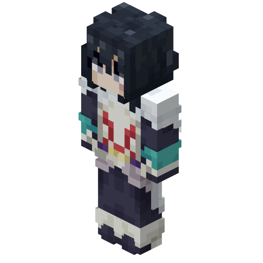
<figcaption>Source media</figcaption>
</figure>

<h2>Shizu</h2>

A Rare Otherworlder, upon near death triggers the release of Ifrit - After Ifrit&#x27;s defeat, Shizu will appear defeated and slowly dying. Shizu cannot be tamed

Open reference →

</a>
</article>
<article class="reference-card" data-letter="S" data-search="supermassive slime a rare mob that has a 1/1000 chance to spawn in place of a normal slime">
<a href="mobs-supermassive-slime/" aria-label="Open Supermassive Slime">
<figure class="reference-card-media reference-card-media--source">

<figcaption>Source media</figcaption>
</figure>

<h2>Supermassive Slime</h2>

A rare mob that has a 1/1000 chance to spawn in place of a normal Slime

Open reference →

</a>
</article>
<article class="reference-card" data-letter="S" data-search="sylphide the greater wind spirit">
<a href="mobs-sylphide/" aria-label="Open Sylphide">
<figure class="reference-card-media reference-card-media--source">
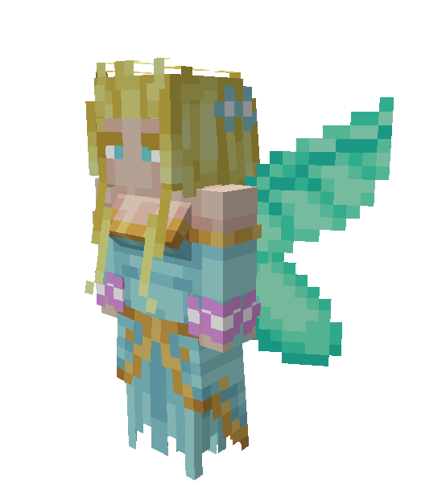
<figcaption>Source media</figcaption>
</figure>

<h2>Sylphide</h2>

The Greater Wind Spirit

Open reference →

</a>
</article>
<article class="reference-card" data-letter="U" data-search="undine a greater water spirit">
<a href="mobs-undine/" aria-label="Open Undine">
<figure class="reference-card-media reference-card-media--source">
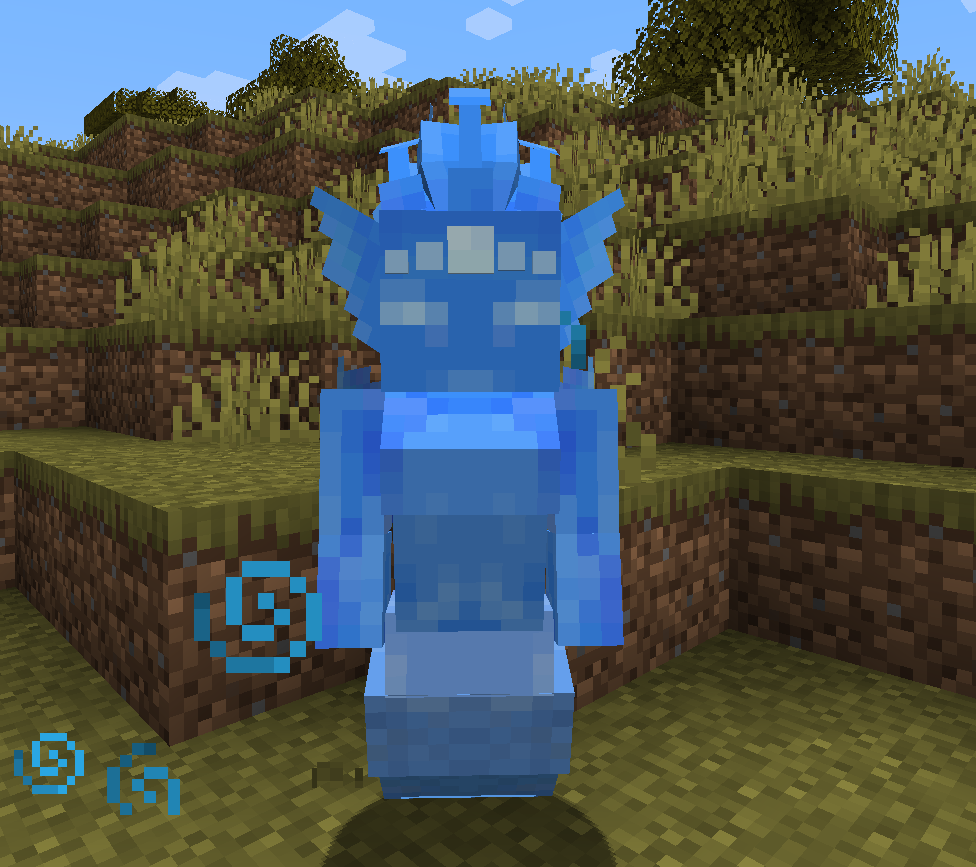
<figcaption>Source media</figcaption>
</figure>

<h2>Undine</h2>

A Greater Water Spirit

Open reference →

</a>
</article>
<article class="reference-card" data-letter="W" data-search="war gnome a greater earth spirit">
<a href="mobs-war-gnome/" aria-label="Open War Gnome">
<figure class="reference-card-media reference-card-media--source">
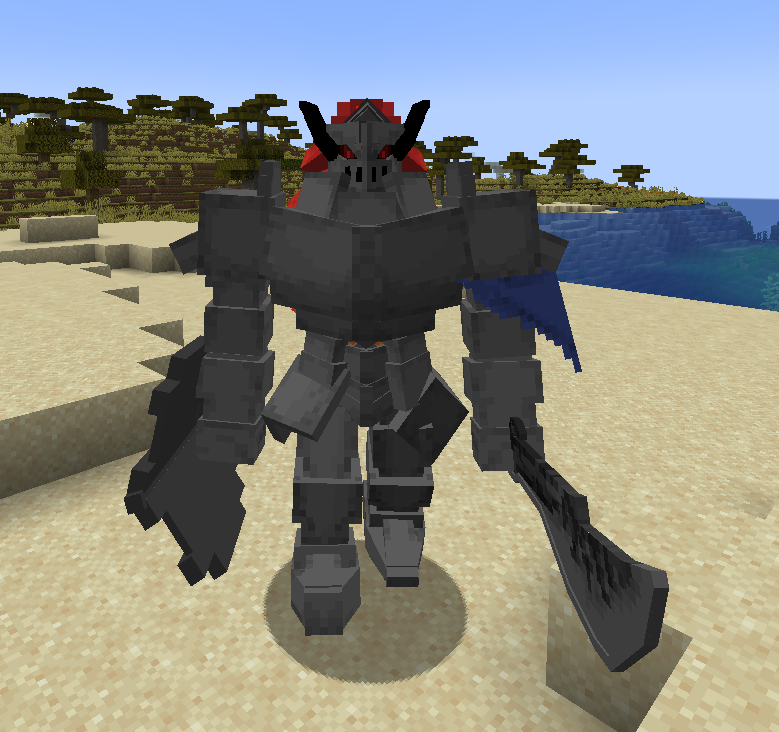
<figcaption>Source media</figcaption>
</figure>

<h2>War Gnome</h2>

A Greater Earth Spirit

Open reference →

</a>
</article>

No matching articles. Try a broader search.

</section>
