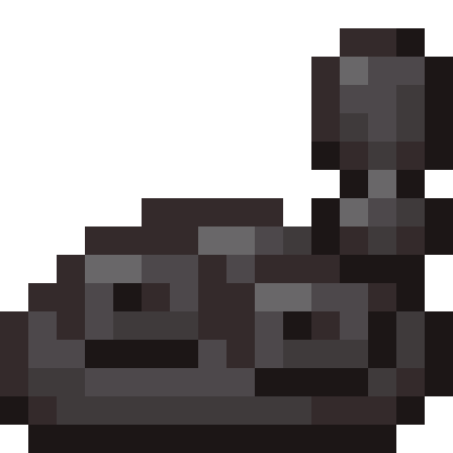

<section class="reference-directory" data-reference-directory="configuration">
<header class="reference-directory-hero reference-theme-world">

Tensura reference collection

<h1>Configuration</h1>

Base Tensura configuration reference.

<strong>2</strong> articles
<a class="reference-directory-overview-link" href="config/">Read collection overview →</a>

</header>

<label class="reference-filter-label">
Filter this collection
<input type="search" class="reference-filter-input" placeholder="Search titles and summaries…" autocomplete="off">
</label>

<button type="button" class="is-active" data-letter="all" aria-pressed="true">All</button>
<button type="button" data-letter="C" aria-pressed="false">C</button>
<button type="button" data-letter="S" aria-pressed="false">S</button>

Showing 2 of 2 articles

<article class="reference-card" data-letter="C" data-search="client switch to true for spiders to have a more friendly appearance default: false arachnophobiamode = false wip wip wip wip wip wip">
<a href="config-client/" aria-label="Open Client">
<figure class="reference-card-media reference-card-media--theme">

<figcaption>TSR artwork</figcaption>
</figure>

<h2>Client</h2>

Switch to true for Spiders to have a more friendly appearance Default: false arachnophobiaMode = false wip wip wip wip wip wip

Open reference →

</a>
</article>
<article class="reference-card" data-letter="S" data-search="spawnrate-common how many times will the entity attempt to spawn before failing 0 = disabled, 1 = guaranteed, higher = lower chance">
<a href="config-spawnrate-common/" aria-label="Open Spawnrate-Common">
<figure class="reference-card-media reference-card-media--source">

<figcaption>Source media</figcaption>
</figure>

<h2>Spawnrate-Common</h2>

How many times will the entity attempt to spawn before failing 0 = disabled, 1 = guaranteed, higher = lower chance

Open reference →

</a>
</article>

No matching articles. Try a broader search.

</section>
