<section class="reference-directory" data-reference-directory="core-mechanics">
<header class="reference-directory-hero reference-theme-evolution">
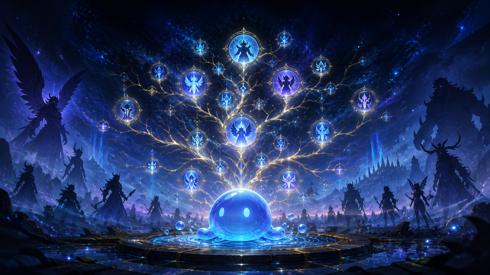

Tensura reference collection

<h1>Core Mechanics</h1>

Foundational resources and progression mechanics.

<strong>34</strong> articles

</header>

<label class="reference-filter-label">
Filter this collection
<input type="search" class="reference-filter-input" placeholder="Search titles and summaries…" autocomplete="off">
</label>

<button type="button" class="is-active" data-letter="all" aria-pressed="true">All</button>
<button type="button" data-letter="A" aria-pressed="false">A</button>
<button type="button" data-letter="B" aria-pressed="false">B</button>
<button type="button" data-letter="C" aria-pressed="false">C</button>
<button type="button" data-letter="D" aria-pressed="false">D</button>
<button type="button" data-letter="E" aria-pressed="false">E</button>
<button type="button" data-letter="F" aria-pressed="false">F</button>
<button type="button" data-letter="G" aria-pressed="false">G</button>
<button type="button" data-letter="H" aria-pressed="false">H</button>
<button type="button" data-letter="I" aria-pressed="false">I</button>
<button type="button" data-letter="M" aria-pressed="false">M</button>
<button type="button" data-letter="N" aria-pressed="false">N</button>
<button type="button" data-letter="P" aria-pressed="false">P</button>
<button type="button" data-letter="R" aria-pressed="false">R</button>
<button type="button" data-letter="S" aria-pressed="false">S</button>
<button type="button" data-letter="T" aria-pressed="false">T</button>

Showing 34 of 34 articles

<article class="reference-card" data-letter="A" data-search="ability usage tensura: reincarnated comes with many different ways of utilizing abilities.">
<a href="mechanics-ability-usage/" aria-label="Open Ability Usage">
<figure class="reference-card-media reference-card-media--source">
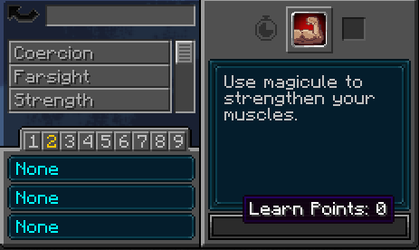
<figcaption>Source media</figcaption>
</figure>

<h2>Ability Usage</h2>

Tensura: Reincarnated comes with many different ways of utilizing abilities.

Open reference →

</a>
</article>
<article class="reference-card" data-letter="A" data-search="alignment a term for non-majin life forms that have achieved saint level">
<a href="races-alignment/" aria-label="Open Alignment">
<figure class="reference-card-media reference-card-media--source">
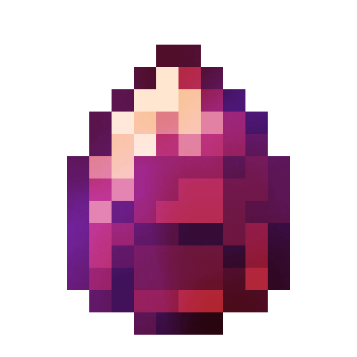
<figcaption>Source media</figcaption>
</figure>

<h2>Alignment</h2>

A term for non-majin life forms that have achieved Saint level

Open reference →

</a>
</article>
<article class="reference-card" data-letter="A" data-search="awakening awakening is a term used to refer to the process of becoming a higher form of existence">
<a href="races-awakening/" aria-label="Open Awakening">
<figure class="reference-card-media reference-card-media--source">

<figcaption>Source media</figcaption>
</figure>

<h2>Awakening</h2>

Awakening is a term used to refer to the process of becoming a higher form of existence

Open reference →

</a>
</article>
<article class="reference-card" data-letter="B" data-search="burden increases weight, preventing jumping">
<a href="effects-burden/" aria-label="Open Burden">
<figure class="reference-card-media reference-card-media--source">

<figcaption>Source media</figcaption>
</figure>

<h2>Burden</h2>

Increases weight, preventing jumping

Open reference →

</a>
</article>
<article class="reference-card" data-letter="C" data-search="chant speed chant speed is the amount of time it takes to cast spells. this cast time can be reduced and varies between spells.">
<a href="chantspeed/" aria-label="Open Chant Speed">
<figure class="reference-card-media reference-card-media--theme">

<figcaption>TSR artwork</figcaption>
</figure>

<h2>Chant Speed</h2>

Chant speed is the amount of time it takes to cast spells. This cast time can be reduced and varies between spells.

Open reference →

</a>
</article>
<article class="reference-card" data-letter="C" data-search="corrosion deals corrosion damage over time like poison and also degrades tools/armour at an increased rate. used to obtain corrosion resistance">
<a href="effects-corrosion/" aria-label="Open Corrosion">
<figure class="reference-card-media reference-card-media--source">

<figcaption>Source media</figcaption>
</figure>

<h2>Corrosion</h2>

Deals Corrosion damage over time like Poison and also degrades tools/armour at an increased rate. Used to obtain Corrosion Resistance

Open reference →

</a>
</article>
<article class="reference-card" data-letter="D" data-search="damage types energy drain damage is applied when a damage source meets any of the following conditions:">
<a href="damage-types/" aria-label="Open Damage Types">
<figure class="reference-card-media reference-card-media--theme">

<figcaption>TSR artwork</figcaption>
</figure>

<h2>Damage Types</h2>

Energy Drain damage is applied when a damage source meets any of the following conditions:

Open reference →

</a>
</article>
<article class="reference-card" data-letter="D" data-search="dodging observe...observer..observation haki!?">
<a href="dodging/" aria-label="Open Dodging">
<figure class="reference-card-media reference-card-media--theme">

<figcaption>TSR artwork</figcaption>
</figure>

<h2>Dodging</h2>

Observe...Observer..Observation Haki!?

Open reference →

</a>
</article>
<article class="reference-card" data-letter="E" data-search="effects the effects of tensura: reincarnated!">
<a href="effects/" aria-label="Open Effects">
<figure class="reference-card-media reference-card-media--source">
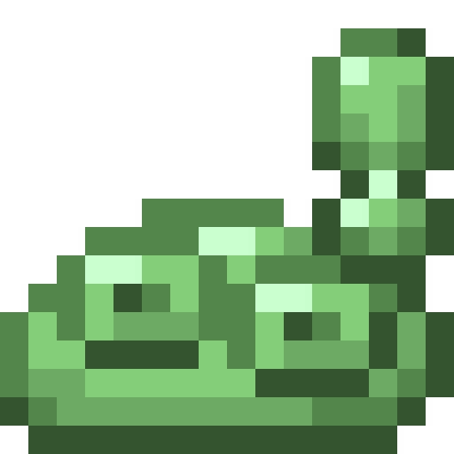
<figcaption>Source media</figcaption>
</figure>

<h2>Effects</h2>

The Effects of Tensura: Reincarnated!

Open reference →

</a>
</article>
<article class="reference-card" data-letter="E" data-search="engravings allow your weapons, armor and tools to be enchanted with specific effects">
<a href="engravings/" aria-label="Open Engravings">
<figure class="reference-card-media reference-card-media--source">
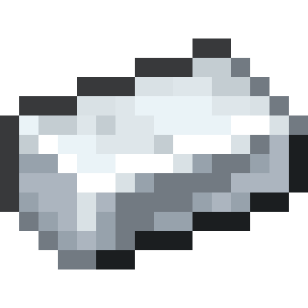
<figcaption>Source media</figcaption>
</figure>

<h2>Engravings</h2>

Allow your Weapons, Armor and Tools to be enchanted with specific effects

Open reference →

</a>
</article>
<article class="reference-card" data-letter="E" data-search="ep, magicule, aura ep (short for evolution points ) is a rough indicator of how strong a mob, player, or item is. both you and certain items — such as monster leather and magic steel gear…">
<a href="ep-magicule-aura/" aria-label="Open EP, Magicule, Aura">
<figure class="reference-card-media reference-card-media--theme">

<figcaption>TSR artwork</figcaption>
</figure>

<h2>EP, Magicule, Aura</h2>

EP (short for Evolution Points ) is a rough indicator of how strong a Mob, Player, or Item is. Both you and certain items — such as Monster Leather and Magic Steel gear…

Open reference →

</a>
</article>
<article class="reference-card" data-letter="E" data-search="existence points did someone just rate my existence...? and its over 9000!?!?!?!">
<a href="existence-points/" aria-label="Open Existence Points">
<figure class="reference-card-media reference-card-media--theme">

<figcaption>TSR artwork</figcaption>
</figure>

<h2>Existence Points</h2>

Did someone just rate my existence...? and its over 9000!?!?!?!

Open reference →

</a>
</article>
<article class="reference-card" data-letter="F" data-search="fatal poison a strong poison effect">
<a href="effects-fatal-poison/" aria-label="Open Fatal Poison">
<figure class="reference-card-media reference-card-media--source">

<figcaption>Source media</figcaption>
</figure>

<h2>Fatal Poison</h2>

A strong poison effect

Open reference →

</a>
</article>
<article class="reference-card" data-letter="F" data-search="fear effect is given to entity&#x27;s using coercion or any form of haki .">
<a href="effects-fear/" aria-label="Open Fear">
<figure class="reference-card-media reference-card-media--source">

<figcaption>Source media</figcaption>
</figure>

<h2>Fear</h2>

Effect is given to entity&#x27;s using Coercion or any form of Haki .

Open reference →

</a>
</article>
<article class="reference-card" data-letter="F" data-search="fragility each level of fragility increases damage taken">
<a href="effects-fragility/" aria-label="Open Fragility">
<figure class="reference-card-media reference-card-media--source">

<figcaption>Source media</figcaption>
</figure>

<h2>Fragility</h2>

Each level of fragility increases damage taken

Open reference →

</a>
</article>
<article class="reference-card" data-letter="G" data-search="gear evolution some items are eligible for evolution, that being monster leather, and magisteel by default.">
<a href="gear-evolution/" aria-label="Open Gear Evolution">
<figure class="reference-card-media reference-card-media--theme">

<figcaption>TSR artwork</figcaption>
</figure>

<h2>Gear Evolution</h2>

Some items are eligible for evolution, that being Monster Leather, and Magisteel by default.

Open reference →

</a>
</article>
<article class="reference-card" data-letter="G" data-search="getting started when spawning in, a menu will pop up, showing races you can pick. depending on what race you pick, the difficulty of your progression will change.">
<a href="getting-started/" aria-label="Open Getting Started">
<figure class="reference-card-media reference-card-media--source">

<figcaption>Source media</figcaption>
</figure>

<h2>Getting Started</h2>

When spawning in, a menu will pop up, showing races you can pick. Depending on what race you pick, the difficulty of your progression will change.

Open reference →

</a>
</article>
<article class="reference-card" data-letter="H" data-search="hardcore race hardcore races is a gamerule which makes races significantly harder upon choosing them. the following occurs when hardcore races is toggled on:">
<a href="mechanics-hardcore-race/" aria-label="Open Hardcore Race">
<figure class="reference-card-media reference-card-media--theme">

<figcaption>TSR artwork</figcaption>
</figure>

<h2>Hardcore Race</h2>

Hardcore races is a gamerule which makes races significantly harder upon choosing them. The following occurs when hardcore races is toggled on:

Open reference →

</a>
</article>
<article class="reference-card" data-letter="H" data-search="hipokute farming place down hipokute seeds">
<a href="mechanics-hipokute-farming/" aria-label="Open Hipokute Farming">
<figure class="reference-card-media reference-card-media--source">
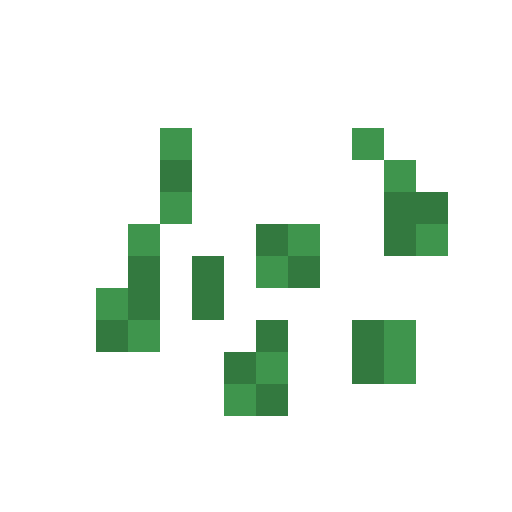
<figcaption>Source media</figcaption>
</figure>

<h2>Hipokute Farming</h2>

Place down Hipokute Seeds

Open reference →

</a>
</article>
<article class="reference-card" data-letter="H" data-search="hypnosis has a 1% chance per level to cause the screen to randomly rotate every tick.">
<a href="effect-hypnosis/" aria-label="Open Hypnosis">
<figure class="reference-card-media reference-card-media--source">
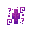
<figcaption>Source media</figcaption>
</figure>

<h2>Hypnosis</h2>

Has a 1% chance per level to cause the screen to randomly rotate every tick.

Open reference →

</a>
</article>
<article class="reference-card" data-letter="I" data-search="infection infection is an effect that makes your health blood red and gets stronger effects the longer you have it, culminating in instant death.">
<a href="effects-infection/" aria-label="Open Infection">
<figure class="reference-card-media reference-card-media--source">

<figcaption>Source media</figcaption>
</figure>

<h2>Infection</h2>

Infection is an effect that makes your health blood red and gets stronger effects the longer you have it, culminating in instant death.

Open reference →

</a>
</article>
<article class="reference-card" data-letter="I" data-search="insanity hear random scary sounds, items in inventory have a chance to randomly move around and have nightmares when sleeping. level 2+ - if in shadow/darkness, will take…">
<a href="effects-insanity/" aria-label="Open Insanity">
<figure class="reference-card-media reference-card-media--source">

<figcaption>Source media</figcaption>
</figure>

<h2>Insanity</h2>

Hear random scary sounds, items in inventory have a chance to randomly move around and have nightmares when sleeping. Level 2+ - If in shadow/darkness, will take…

Open reference →

</a>
</article>
<article class="reference-card" data-letter="M" data-search="magicule poison magicule poison is an effect which applies a nausea-like screen effect to the player as well as reddens the border of the screen.">
<a href="effects-magicule-poison/" aria-label="Open Magicule Poison">
<figure class="reference-card-media reference-card-media--source">

<figcaption>Source media</figcaption>
</figure>

<h2>Magicule Poison</h2>

Magicule Poison is an effect which applies a nausea-like screen effect to the player as well as reddens the border of the screen.

Open reference →

</a>
</article>
<article class="reference-card" data-letter="M" data-search="mechanics ability usage dodging engravings gear evolution hipokute farming naming praying reputation reset scrolls trading ep, magicule and aura">
<a href="mechanics/" aria-label="Open Mechanics">
<figure class="reference-card-media reference-card-media--source">
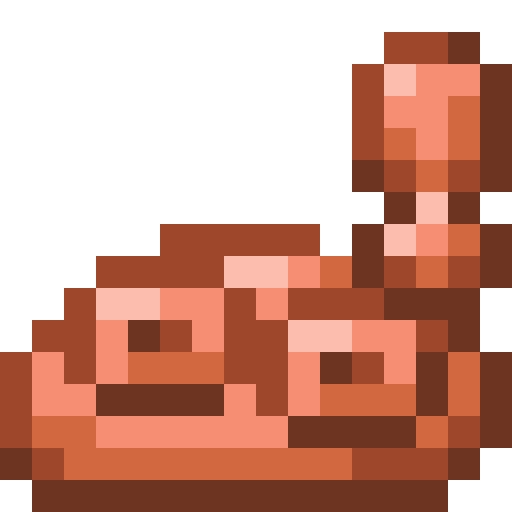
<figcaption>Source media</figcaption>
</figure>

<h2>Mechanics</h2>

Ability Usage Dodging Engravings Gear Evolution Hipokute Farming Naming Praying Reputation Reset Scrolls Trading EP, Magicule and Aura

Open reference →

</a>
</article>
<article class="reference-card" data-letter="N" data-search="naming from now on.. your name is...!">
<a href="naming/" aria-label="Open Naming">
<figure class="reference-card-media reference-card-media--source">
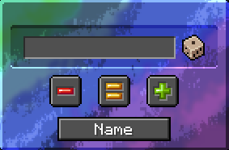
<figcaption>Source media</figcaption>
</figure>

<h2>Naming</h2>

From now on.. Your name is...!

Open reference →

</a>
</article>
<article class="reference-card" data-letter="P" data-search="paralysis paralysis - decreases movement speed per level">
<a href="effects-paralysis/" aria-label="Open Paralysis">
<figure class="reference-card-media reference-card-media--source">

<figcaption>Source media</figcaption>
</figure>

<h2>Paralysis</h2>

Paralysis - decreases movement speed per level

Open reference →

</a>
</article>
<article class="reference-card" data-letter="P" data-search="petrification the basilisk tail ranged attack.">
<a href="effects-petrification/" aria-label="Open Petrification">
<figure class="reference-card-media reference-card-media--source">
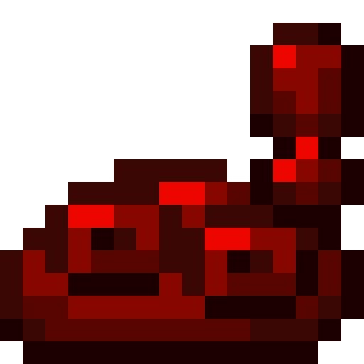
<figcaption>Source media</figcaption>
</figure>

<h2>Petrification</h2>

The Basilisk tail ranged attack.

Open reference →

</a>
</article>
<article class="reference-card" data-letter="R" data-search="rampage rampage is an effect that makes the edges of your screen turn reddish with red lines, as if seeing red, and deals damage when the duration is low.">
<a href="effects-rampage/" aria-label="Open Rampage">
<figure class="reference-card-media reference-card-media--theme">

<figcaption>TSR artwork</figcaption>
</figure>

<h2>Rampage</h2>

Rampage is an effect that makes the edges of your screen turn reddish with red lines, as if seeing red, and deals damage when the duration is low.

Open reference →

</a>
</article>
<article class="reference-card" data-letter="R" data-search="reincarnation who would&#x27;ve thought, the isekai mod has a reincarnation magic.">
<a href="reincarnation/" aria-label="Open Reincarnation">
<figure class="reference-card-media reference-card-media--source">

<figcaption>Source media</figcaption>
</figure>

<h2>Reincarnation</h2>

Who would&#x27;ve thought, the isekai mod has a reincarnation magic.

Open reference →

</a>
</article>
<article class="reference-card" data-letter="R" data-search="reset counter this is a counting system for how many a player has reset at the end of their playthrough.">
<a href="mechanics-reset-counter/" aria-label="Open Reset Counter">
<figure class="reference-card-media reference-card-media--theme">

<figcaption>TSR artwork</figcaption>
</figure>

<h2>Reset Counter</h2>

This is a counting system for how many a player has Reset at the end of their playthrough.

Open reference →

</a>
</article>
<article class="reference-card" data-letter="R" data-search="reset scrolls what if i want to do it all again?">
<a href="mechanics-reset-scrolls/" aria-label="Open Reset Scrolls">
<figure class="reference-card-media reference-card-media--source">

<figcaption>Source media</figcaption>
</figure>

<h2>Reset Scrolls</h2>

What if I want to do it all again?

Open reference →

</a>
</article>
<article class="reference-card" data-letter="R" data-search="rimuru mode rimuru mode is a gamerule that as the name implies, can turn the person into rimuru and give him/her the full rimuru experience. warning, if you turn this on in…">
<a href="mechanics-rimuru-mode/" aria-label="Open Rimuru Mode">
<figure class="reference-card-media reference-card-media--source">
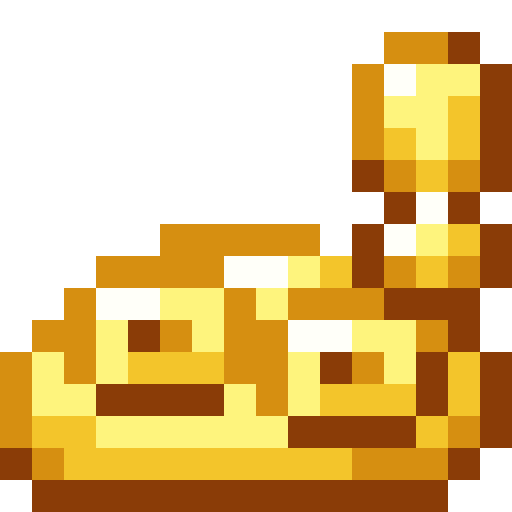
<figcaption>Source media</figcaption>
</figure>

<h2>Rimuru Mode</h2>

Rimuru mode is a Gamerule that as the name implies, can turn the person into Rimuru and give him/her the full Rimuru experience. Warning, if you turn this on in…

Open reference →

</a>
</article>
<article class="reference-card" data-letter="S" data-search="strengthen gives strength 2 per level">
<a href="effects-strengthen/" aria-label="Open Strengthen">
<figure class="reference-card-media reference-card-media--source">
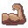
<figcaption>Source media</figcaption>
</figure>

<h2>Strengthen</h2>

Gives Strength 2 per level

Open reference →

</a>
</article>
<article class="reference-card" data-letter="T" data-search="trading she sells sea shells on the sea shore">
<a href="trading/" aria-label="Open Trading">
<figure class="reference-card-media reference-card-media--theme">

<figcaption>TSR artwork</figcaption>
</figure>

<h2>Trading</h2>

She sells sea shells on the sea shore

Open reference →

</a>
</article>

No matching articles. Try a broader search.

</section>
