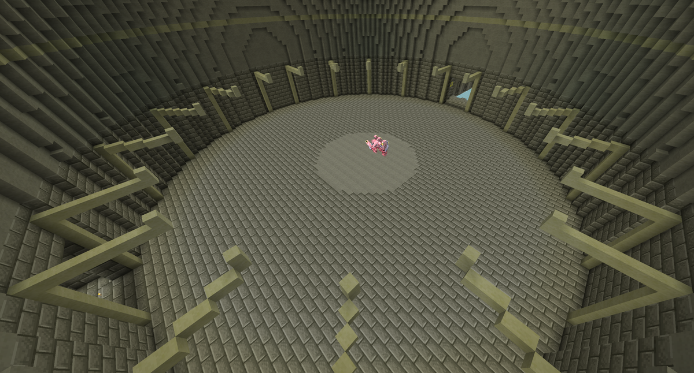
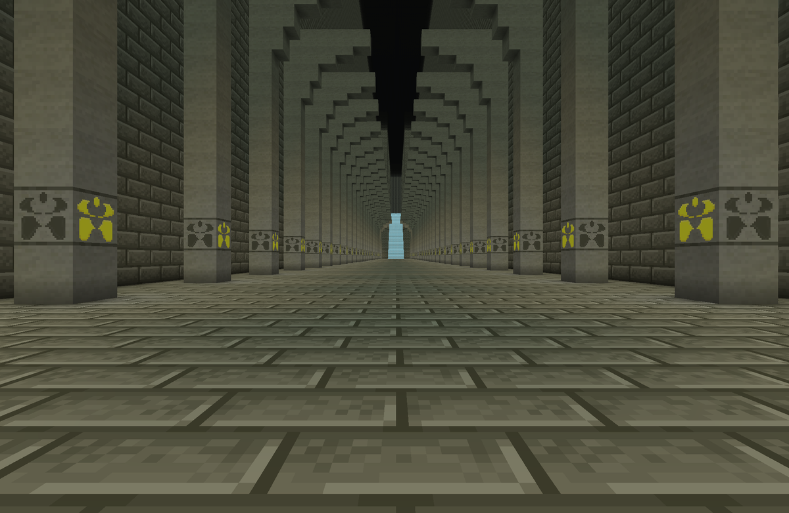

<section class="reference-directory" data-reference-directory="dimensions">
<header class="reference-directory-hero reference-theme-world">

World travel and encounter spaces

<h1>Dimensions</h1>

Every dimension registered by TSR's pinned Tensura, Mysticism, and Ascension builds, with entry routes and version evidence.

<strong>6</strong> verified realms
<a class="reference-directory-overview-link" href="../biomes/">Browse their biomes →</a>

</header>
<aside class="skill-evidence-note"><strong>Scope:</strong> This catalogue covers registered dimensions in the pinned Minecraft 1.21.1 pack. The separate Tensura: Dungeon project is not installed and is not included.</aside>

<label class="reference-filter-label">Find a realm<input type="search" class="reference-filter-input" placeholder="Search realms, routes, and registry IDs…" autocomplete="off"></label>

<button type="button" class="is-active" data-letter="all" aria-pressed="true">All</button>
<button type="button" data-letter="B" aria-pressed="false">B</button>
<button type="button" data-letter="E" aria-pressed="false">E</button>
<button type="button" data-letter="H" aria-pressed="false">H</button>
<button type="button" data-letter="K" aria-pressed="false">K</button>
<button type="button" data-letter="L" aria-pressed="false">L</button>

Showing 6 of 6 realms

<article class="reference-card reference-dimension-card" data-letter="B" data-search="boss area tensura: reincarnated a flat, void-based encounter space used internally by tensura&#x27;s boss systems rather than a normal exploration destination. registry id world type time beds raids player route tensura:boss_area flat void fixed at 3000 disabled disabled encounter-controlled">
<a href="boss-area/" aria-label="Open Boss Area">
<figure class="reference-card-media reference-card-media--theme">

<figcaption>Tensura: Reincarnated</figcaption>
</figure>

Tensura: Reincarnated

<h2>Boss Area</h2>

A flat, void-based encounter space used internally by Tensura&#x27;s boss systems rather than a normal exploration destination.

<dl class="reference-card-stats"><dt>Registry ID</dt><dd>tensura:boss_area</dd><dt>World type</dt><dd>Flat void</dd><dt>Time</dt><dd>Fixed at 3000</dd><dt>Beds</dt><dd>Disabled</dd><dt>Raids</dt><dd>Disabled</dd><dt>Player route</dt><dd>Encounter-controlled</dd></dl>
<small class="reference-card-source-note">Verified against the pinned 1.21.1 artifact and pack selection.</small>
Open travel guide →

</a>
</article>
<article class="reference-card reference-dimension-card" data-letter="E" data-search="elemental realm tensura: mysticism mysticism&#x27;s seven-biome elemental world, called the spirit realm by the upstream guide and elemental realm by the 1.21.1 registry. registry id world type biomes time beds return route mysticism:elemental_realm noise-generated 7 elemental biomes fixed at 6000 disabled fall into the void">
<a href="elemental-realm/" aria-label="Open Elemental Realm">
<figure class="reference-card-media reference-card-media--theme">

<figcaption>Tensura: Mysticism</figcaption>
</figure>

Tensura: Mysticism

<h2>Elemental Realm</h2>

Mysticism&#x27;s seven-biome elemental world, called the Spirit Realm by the upstream guide and Elemental Realm by the 1.21.1 registry.

<dl class="reference-card-stats"><dt>Registry ID</dt><dd>mysticism:elemental_realm</dd><dt>World type</dt><dd>Noise-generated</dd><dt>Biomes</dt><dd>7 elemental biomes</dd><dt>Time</dt><dd>Fixed at 6000</dd><dt>Beds</dt><dd>Disabled</dd><dt>Return route</dt><dd>Fall into the void</dd></dl>
<small class="reference-card-source-note">Verified against the pinned 1.21.1 artifact and pack selection.</small>
Open travel guide →

</a>
</article>
<article class="reference-card reference-dimension-card" data-letter="H" data-search="hell tensura: reincarnated tensura&#x27;s underworld dimension, reached through hell gate portals and generated from four verified 1.21.1 biomes. registry id world type biomes time beds portal tensura:hell noise-generated 4 underworld biomes fixed at 6000 disabled hell gate">
<a href="hell/" aria-label="Open Hell">
<figure class="reference-card-media reference-card-media--theme">

<figcaption>Tensura: Reincarnated</figcaption>
</figure>

Tensura: Reincarnated

<h2>Hell</h2>

Tensura&#x27;s Underworld dimension, reached through Hell Gate portals and generated from four verified 1.21.1 biomes.

<dl class="reference-card-stats"><dt>Registry ID</dt><dd>tensura:hell</dd><dt>World type</dt><dd>Noise-generated</dd><dt>Biomes</dt><dd>4 Underworld biomes</dd><dt>Time</dt><dd>Fixed at 6000</dd><dt>Beds</dt><dd>Disabled</dd><dt>Portal</dt><dd>Hell Gate</dd></dl>
<small class="reference-card-source-note">Verified against the pinned 1.21.1 artifact and pack selection.</small>
Open travel guide →

</a>
</article>
<article class="reference-card reference-dimension-card" data-letter="H" data-search="hyperbolic chamber tensura: ascension ascension&#x27;s dangerous training dimension, entered with hyperbolic passage and configured for three-times ep gain on tsr. registry id purpose tsr ep multiplier entry skill hazard world type ascension:hyperbolic_chamber late-game training 3× hyperbolic passage magicule poisoning single-biome chamber">
<a href="../../hyperbolic-chamber/" aria-label="Open Hyperbolic Chamber">
<figure class="reference-card-media reference-card-media--portrait">

<figcaption>Tensura: Ascension</figcaption>
</figure>

Tensura: Ascension

<h2>Hyperbolic Chamber</h2>

Ascension&#x27;s dangerous training dimension, entered with Hyperbolic Passage and configured for three-times EP gain on TSR.

<dl class="reference-card-stats"><dt>Registry ID</dt><dd>ascension:hyperbolic_chamber</dd><dt>Purpose</dt><dd>Late-game training</dd><dt>TSR EP multiplier</dt><dd>3×</dd><dt>Entry skill</dt><dd>Hyperbolic Passage</dd><dt>Hazard</dt><dd>Magicule Poisoning</dd><dt>World type</dt><dd>Single-biome chamber</dd></dl>
<small class="reference-card-source-note">Verified against the pinned 1.21.1 artifact and pack selection.</small>
Open travel guide →

</a>
</article>
<article class="reference-card reference-dimension-card" data-letter="K" data-search="kamui tensura: mysticism a sparse mysticism pocket dimension tied to phaser, with isolated kamui cubes and no natural mob spawns in its fixed biome. registry id world type biome natural spawns entry skill tsr warp time mysticism:kamui_dimension sparse pocket realm mysticism:kamui_biome none phaser 60 ticks">
<a href="kamui/" aria-label="Open Kamui">
<figure class="reference-card-media reference-card-media--theme">

<figcaption>Tensura: Mysticism</figcaption>
</figure>

Tensura: Mysticism

<h2>Kamui</h2>

A sparse Mysticism pocket dimension tied to Phaser, with isolated Kamui cubes and no natural mob spawns in its fixed biome.

<dl class="reference-card-stats"><dt>Registry ID</dt><dd>mysticism:kamui_dimension</dd><dt>World type</dt><dd>Sparse pocket realm</dd><dt>Biome</dt><dd>mysticism:kamui_biome</dd><dt>Natural spawns</dt><dd>None</dd><dt>Entry skill</dt><dd>Phaser</dd><dt>TSR warp time</dt><dd>60 ticks</dd></dl>
<small class="reference-card-source-note">Verified against the pinned 1.21.1 artifact and pack selection.</small>
Open travel guide →

</a>
</article>
<article class="reference-card reference-dimension-card" data-letter="L" data-search="labyrinth tensura: reincarnated tensura&#x27;s generated challenge maze, entered through a labyrinth tree and built around the elemental colossus route. registry id world type entry suggested minimum beds key encounter tensura:labyrinth generated maze in a void world labyrinth tree portal 8,000 ep disabled elemental colossus">
<a href="labyrinth/" aria-label="Open Labyrinth">
<figure class="reference-card-media reference-card-media--theme">

<figcaption>Tensura: Reincarnated</figcaption>
</figure>

Tensura: Reincarnated

<h2>Labyrinth</h2>

Tensura&#x27;s generated challenge maze, entered through a Labyrinth Tree and built around the Elemental Colossus route.

<dl class="reference-card-stats"><dt>Registry ID</dt><dd>tensura:labyrinth</dd><dt>World type</dt><dd>Generated maze in a void world</dd><dt>Entry</dt><dd>Labyrinth Tree portal</dd><dt>Suggested minimum</dt><dd>8,000 EP</dd><dt>Beds</dt><dd>Disabled</dd><dt>Key encounter</dt><dd>Elemental Colossus</dd></dl>
<small class="reference-card-source-note">Verified against the pinned 1.21.1 artifact and pack selection.</small>
Open travel guide →

</a>
</article>

No matching realms. Try a broader search.

</section>
