<section class="reference-directory" data-reference-directory="items">
<header class="reference-directory-hero reference-theme-world">

Tensura reference collection

<h1>Items &amp; Materials</h1>

Materials, consumables, drops, and special items.

<strong>204</strong> articles

</header>

<label class="reference-filter-label">
Filter this collection
<input type="search" class="reference-filter-input" placeholder="Search titles and summaries…" autocomplete="off">
</label>

<button type="button" class="is-active" data-letter="all" aria-pressed="true">All</button>
<button type="button" data-letter="A" aria-pressed="false">A</button>
<button type="button" data-letter="B" aria-pressed="false">B</button>
<button type="button" data-letter="C" aria-pressed="false">C</button>
<button type="button" data-letter="D" aria-pressed="false">D</button>
<button type="button" data-letter="E" aria-pressed="false">E</button>
<button type="button" data-letter="F" aria-pressed="false">F</button>
<button type="button" data-letter="G" aria-pressed="false">G</button>
<button type="button" data-letter="H" aria-pressed="false">H</button>
<button type="button" data-letter="I" aria-pressed="false">I</button>
<button type="button" data-letter="J" aria-pressed="false">J</button>
<button type="button" data-letter="K" aria-pressed="false">K</button>
<button type="button" data-letter="L" aria-pressed="false">L</button>
<button type="button" data-letter="M" aria-pressed="false">M</button>
<button type="button" data-letter="O" aria-pressed="false">O</button>
<button type="button" data-letter="P" aria-pressed="false">P</button>
<button type="button" data-letter="R" aria-pressed="false">R</button>
<button type="button" data-letter="S" aria-pressed="false">S</button>
<button type="button" data-letter="T" aria-pressed="false">T</button>
<button type="button" data-letter="U" aria-pressed="false">U</button>
<button type="button" data-letter="W" aria-pressed="false">W</button>
<button type="button" data-letter="Z" aria-pressed="false">Z</button>

Showing 204 of 204 articles

<article class="reference-card" data-letter="A" data-search="adamantite bone golem a golem resembling a skeleton made out of adamantite. allows the player to possess it and works as a physical body, can also be given to spirit or daemon subordinates…">
<a href="adamantite-bone-golem/" aria-label="Open Adamantite Bone Golem">
<figure class="reference-card-media reference-card-media--source">

<figcaption>Source media</figcaption>
</figure>

<h2>Adamantite Bone Golem</h2>

A golem resembling a skeleton made out of Adamantite. Allows the player to possess it and works as a physical body, can also be given to spirit or daemon subordinates…

Open reference →

</a>
</article>
<article class="reference-card" data-letter="A" data-search="adamantite gear schematic obtained by picking up an adamantite ingot">
<a href="items-schematics-adamantite-gear-schematic/" aria-label="Open Adamantite Gear Schematic">
<figure class="reference-card-media reference-card-media--source">

<figcaption>Source media</figcaption>
</figure>

<h2>Adamantite Gear Schematic</h2>

Obtained by picking up an Adamantite Ingot

Open reference →

</a>
</article>
<article class="reference-card" data-letter="A" data-search="adamantite ingot smelting adamantite gear into nuggets and then crafting an ingot.">
<a href="adamantite-ingot/" aria-label="Open Adamantite Ingot">
<figure class="reference-card-media reference-card-media--source">

<figcaption>Source media</figcaption>
</figure>

<h2>Adamantite Ingot</h2>

Smelting Adamantite gear into nuggets and then crafting an ingot.

Open reference →

</a>
</article>
<article class="reference-card" data-letter="A" data-search="adamantite nugget smelting adamantite armor/gear">
<a href="adamantite-nugget/" aria-label="Open Adamantite Nugget">
<figure class="reference-card-media reference-card-media--source">

<figcaption>Source media</figcaption>
</figure>

<h2>Adamantite Nugget</h2>

Smelting Adamantite armor/gear

Open reference →

</a>
</article>
<article class="reference-card" data-letter="A" data-search="angry pierrot mask to craft the angry pierrot mask, one must have used a pierrot mask schematic . to craft, you need a smithing bench .">
<a href="angry-pierrot-mask/" aria-label="Open Angry Pierrot Mask">
<figure class="reference-card-media reference-card-media--source">

<figcaption>Source media</figcaption>
</figure>

<h2>Angry Pierrot Mask</h2>

To craft the Angry Pierrot Mask, one must have used a Pierrot Mask Schematic . To craft, you need a Smithing Bench .

Open reference →

</a>
</article>
<article class="reference-card" data-letter="A" data-search="ant carapace gear schematic obtained by picking up a giant ant carapace">
<a href="items-schematics-ant-carapace-gear-schematic/" aria-label="Open Ant Carapace Gear Schematic">
<figure class="reference-card-media reference-card-media--source">

<figcaption>Source media</figcaption>
</figure>

<h2>Ant Carapace Gear Schematic</h2>

Obtained by picking up a Giant Ant Carapace

Open reference →

</a>
</article>
<article class="reference-card" data-letter="A" data-search="armorsaurus scale an armor like scale from the skin of an armorsaurus .">
<a href="armorsaurus-scale/" aria-label="Open Armorsaurus Scale">
<figure class="reference-card-media reference-card-media--source">

<figcaption>Source media</figcaption>
</figure>

<h2>Armorsaurus Scale</h2>

An armor like scale from the skin of an Armorsaurus .

Open reference →

</a>
</article>
<article class="reference-card" data-letter="A" data-search="armorsaurus scalemail schematic obtained by picking up an armorsaurus scale">
<a href="items-schematics-armorsaurus-scalemail-gear-schematic/" aria-label="Open Armorsaurus Scalemail Schematic">
<figure class="reference-card-media reference-card-media--source">

<figcaption>Source media</figcaption>
</figure>

<h2>Armorsaurus Scalemail Schematic</h2>

Obtained by picking up an Armorsaurus Scale

Open reference →

</a>
</article>
<article class="reference-card" data-letter="A" data-search="armorsaurus shell a tough casing from the back of an armorsaurus .">
<a href="armorsaurus-shell/" aria-label="Open Armorsaurus Shell">
<figure class="reference-card-media reference-card-media--source">

<figcaption>Source media</figcaption>
</figure>

<h2>Armorsaurus Shell</h2>

A tough casing from the back of an Armorsaurus .

Open reference →

</a>
</article>
<article class="reference-card" data-letter="A" data-search="armours upstream reference information for armours.">
<a href="items-armours/" aria-label="Open Armours">
<figure class="reference-card-media reference-card-media--source">
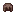
<figcaption>Source media</figcaption>
</figure>

<h2>Armours</h2>

Upstream reference information for Armours.

Open reference →

</a>
</article>
<article class="reference-card" data-letter="B" data-search="baffledill baffledills apply the hypnosis to all players within 8 blocks of the flower. non-default alignments (majin/holy/chaos) and spiritual beings are unaffected.">
<a href="baffledill/" aria-label="Open Baffledill">
<figure class="reference-card-media reference-card-media--theme">

<figcaption>TSR artwork</figcaption>
</figure>

<h2>Baffledill</h2>

Baffledills apply the Hypnosis to all players within 8 blocks of the flower. Non-default alignments (majin/holy/chaos) and spiritual beings are unaffected.

Open reference →

</a>
</article>
<article class="reference-card" data-letter="B" data-search="basic bow schematic found in goblin towers &amp; lizard towers - 10% or found in fletcher villager houses &amp; pillager outposts - 20% chance">
<a href="items-schematics-basic-bow-schematic/" aria-label="Open Basic Bow Schematic">
<figure class="reference-card-media reference-card-media--source">

<figcaption>Source media</figcaption>
</figure>

<h2>Basic Bow Schematic</h2>

Found in Goblin Towers &amp; Lizard Towers - 10% OR Found in Fletcher Villager Houses &amp; Pillager Outposts - 20% Chance

Open reference →

</a>
</article>
<article class="reference-card" data-letter="B" data-search="bat glider ripoff ellyta, good enough? obtain a bat glider">
<a href="bat-glider/" aria-label="Open Bat Glider">
<figure class="reference-card-media reference-card-media--source">

<figcaption>Source media</figcaption>
</figure>

<h2>Bat Glider</h2>

Ripoff Ellyta, good enough? Obtain a bat glider

Open reference →

</a>
</article>
<article class="reference-card" data-letter="B" data-search="beast horn a severed spike from the head or a horned creature.">
<a href="beast-horn/" aria-label="Open Beast Horn">
<figure class="reference-card-media reference-card-media--source">

<figcaption>Source media</figcaption>
</figure>

<h2>Beast Horn</h2>

A severed spike from the head or a horned creature.

Open reference →

</a>
</article>
<article class="reference-card" data-letter="B" data-search="blade tiger steak cooking a raw blade tiger meat with a campfire, furnace, etc">
<a href="blade-tiger-steak/" aria-label="Open Blade Tiger Steak">
<figure class="reference-card-media reference-card-media--source">
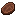
<figcaption>Source media</figcaption>
</figure>

<h2>Blade Tiger Steak</h2>

Cooking a Raw Blade Tiger Meat with a campfire, furnace, etc

Open reference →

</a>
</article>
<article class="reference-card" data-letter="B" data-search="blade tiger tail a razor sharp blade from the tail of a blade tiger .">
<a href="blade-tiger-tail/" aria-label="Open Blade Tiger Tail">
<figure class="reference-card-media reference-card-media--source">

<figcaption>Source media</figcaption>
</figure>

<h2>Blade Tiger Tail</h2>

A razor sharp blade from the tail of a Blade Tiger .

Open reference →

</a>
</article>
<article class="reference-card" data-letter="B" data-search="bucket of slime this item can be obtained by right clicking a slime with a bucket .">
<a href="items-misc-bucket-of-slime/" aria-label="Open Bucket of Slime">
<figure class="reference-card-media reference-card-media--source">
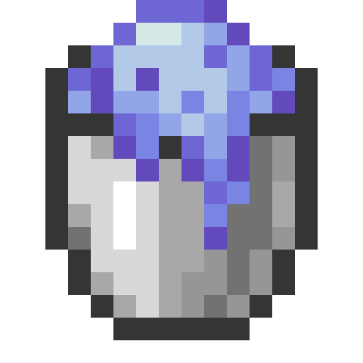
<figcaption>Source media</figcaption>
</figure>

<h2>Bucket of Slime</h2>

This item can be obtained by right clicking a Slime with a Bucket .

Open reference →

</a>
</article>
<article class="reference-card" data-letter="B" data-search="bulldeer milk bucket this page is a work in progress!!! big things coming soon!!">
<a href="bulldeer-milk-bucket/" aria-label="Open Bulldeer Milk Bucket">
<figure class="reference-card-media reference-card-media--source">
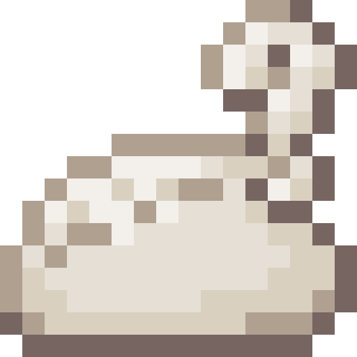
<figcaption>Source media</figcaption>
</figure>

<h2>Bulldeer Milk Bucket</h2>

This page is a Work In Progress!!! Big Things Coming Soon!!

Open reference →

</a>
</article>
<article class="reference-card" data-letter="C" data-search="cargotest upstream reference information for cargotest.">
<a href="cargotest/" aria-label="Open CargoTest">
<figure class="reference-card-media reference-card-media--source">

<figcaption>Source media</figcaption>
</figure>

<h2>CargoTest</h2>

Upstream reference information for CargoTest.

Open reference →

</a>
</article>
<article class="reference-card" data-letter="C" data-search="cattledeer beef killing/defeating a cattledeer">
<a href="cattledeer-beef/" aria-label="Open Cattledeer Beef">
<figure class="reference-card-media reference-card-media--source">

<figcaption>Source media</figcaption>
</figure>

<h2>Cattledeer Beef</h2>

Killing/Defeating a Cattledeer

Open reference →

</a>
</article>
<article class="reference-card" data-letter="C" data-search="cattledeer steak cooking a cattledeer beef with a campfire, furnace, etc, will give cattledeer steak .">
<a href="cattledeer-steak/" aria-label="Open Cattledeer Steak">
<figure class="reference-card-media reference-card-media--source">
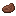
<figcaption>Source media</figcaption>
</figure>

<h2>Cattledeer Steak</h2>

Cooking a Cattledeer Beef with a campfire, furnace, etc, will give Cattledeer Steak .

Open reference →

</a>
</article>
<article class="reference-card" data-letter="C" data-search="centipede stinger a sharp venomous barb from an evil centipede .">
<a href="centipede-stinger/" aria-label="Open Centipede Stinger">
<figure class="reference-card-media reference-card-media--source">

<figcaption>Source media</figcaption>
</figure>

<h2>Centipede Stinger</h2>

A sharp venomous barb from an Evil Centipede .

Open reference →

</a>
</article>
<article class="reference-card" data-letter="C" data-search="character reset scroll resets everything from the user, pretty much like reincarnating from scratch. this also means achievements that you&#x27;ve obtained. also used for the reset counter…">
<a href="character-reset-scroll/" aria-label="Open Character Reset Scroll">
<figure class="reference-card-media reference-card-media--source">

<figcaption>Source media</figcaption>
</figure>

<h2>Character Reset Scroll</h2>

Resets EVERYTHING from the User, Pretty much like reincarnating from scratch. This also means achievements that you&#x27;ve obtained. Also used for the Reset Counter…

Open reference →

</a>
</article>
<article class="reference-card" data-letter="C" data-search="charybdis core yes (64) (but only when the cores you are stacking have exactly the same ep amount)">
<a href="charybdis-core/" aria-label="Open Charybdis Core">
<figure class="reference-card-media reference-card-media--source">
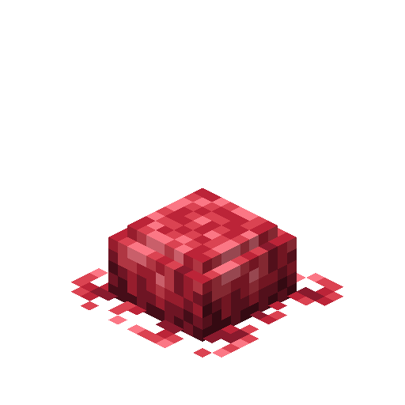
<figcaption>Source media</figcaption>
</figure>

<h2>Charybdis Core</h2>

Yes (64) (But only when the cores you are stacking have exactly the same EP amount)

Open reference →

</a>
</article>
<article class="reference-card" data-letter="C" data-search="charybdis core, inert an inert charybdis core">
<a href="inert-charybdis-core/" aria-label="Open Charybdis Core, Inert">
<figure class="reference-card-media reference-card-media--source">
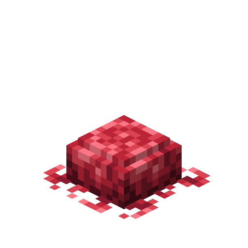
<figcaption>Source media</figcaption>
</figure>

<h2>Charybdis Core, Inert</h2>

An Inert Charybdis Core

Open reference →

</a>
</article>
<article class="reference-card" data-letter="C" data-search="charybdis scale a massive blue scale from charybdis .">
<a href="charybdis-scale/" aria-label="Open Charybdis Scale">
<figure class="reference-card-media reference-card-media--source">

<figcaption>Source media</figcaption>
</figure>

<h2>Charybdis Scale</h2>

A massive blue scale from Charybdis .

Open reference →

</a>
</article>
<article class="reference-card" data-letter="C" data-search="charybdis scalemail schematic obtained by defeating charybdis">
<a href="items-schematics-charybdis-scalemail-gear-schematic/" aria-label="Open Charybdis Scalemail Schematic">
<figure class="reference-card-media reference-card-media--source">

<figcaption>Source media</figcaption>
</figure>

<h2>Charybdis Scalemail Schematic</h2>

Obtained by defeating Charybdis

Open reference →

</a>
</article>
<article class="reference-card" data-letter="C" data-search="chilled slime killing/defeating a slime in one of the following cold biomes: (t.b.a)">
<a href="chilled-slime/" aria-label="Open Chilled Slime">
<figure class="reference-card-media reference-card-media--source">

<figcaption>Source media</figcaption>
</figure>

<h2>Chilled Slime</h2>

Killing/Defeating a Slime in one of the following cold biomes: (T.B.A)

Open reference →

</a>
</article>
<article class="reference-card" data-letter="C" data-search="consumables upstream reference information for consumables.">
<a href="items-consumables/" aria-label="Open Consumables">
<figure class="reference-card-media reference-card-media--source">

<figcaption>Source media</figcaption>
</figure>

<h2>Consumables</h2>

Upstream reference information for Consumables.

Open reference →

</a>
</article>
<article class="reference-card" data-letter="C" data-search="cooked armorsaurus meat cooking a raw armorsaurus meat with a campfire, furnace, etc">
<a href="cooked-armorsaurus-meat/" aria-label="Open Cooked Armorsaurus Meat">
<figure class="reference-card-media reference-card-media--source">

<figcaption>Source media</figcaption>
</figure>

<h2>Cooked Armorsaurus Meat</h2>

Cooking a Raw Armorsaurus Meat with a campfire, furnace, etc

Open reference →

</a>
</article>
<article class="reference-card" data-letter="C" data-search="cooked blade tiger meat cooking a raw blade tiger meat with a campfire, furnace, etc">
<a href="cooked-blade-tiger-meat/" aria-label="Open Cooked Blade Tiger Meat">
<figure class="reference-card-media reference-card-media--source">
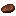
<figcaption>Source media</figcaption>
</figure>

<h2>Cooked Blade Tiger Meat</h2>

Cooking a Raw Blade Tiger Meat with a campfire, furnace, etc

Open reference →

</a>
</article>
<article class="reference-card" data-letter="C" data-search="cooked charybdis meat cooking a raw charybdis meat with a campfire, furnace, etc">
<a href="cooked-charybdis-meat/" aria-label="Open Cooked Charybdis Meat">
<figure class="reference-card-media reference-card-media--source">
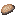
<figcaption>Source media</figcaption>
</figure>

<h2>Cooked Charybdis Meat</h2>

Cooking a Raw Charybdis Meat with a campfire, furnace, etc

Open reference →

</a>
</article>
<article class="reference-card" data-letter="C" data-search="cooked giant ant leg cooking a giant ant leg with a campfire, furnace, etc">
<a href="cooked-giant-ant-leg/" aria-label="Open Cooked Giant Ant Leg">
<figure class="reference-card-media reference-card-media--source">

<figcaption>Source media</figcaption>
</figure>

<h2>Cooked Giant Ant Leg</h2>

Cooking a Giant Ant Leg with a campfire, furnace, etc

Open reference →

</a>
</article>
<article class="reference-card" data-letter="C" data-search="cooked giant bat meat consumption is deadly">
<a href="cooked-giant-bat-meat/" aria-label="Open Cooked Giant Bat Meat">
<figure class="reference-card-media reference-card-media--source">
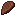
<figcaption>Source media</figcaption>
</figure>

<h2>Cooked Giant Bat Meat</h2>

Consumption is deadly

Open reference →

</a>
</article>
<article class="reference-card" data-letter="C" data-search="cooked knight spider leg cooking a knight spider leg with a campfire, furnace, etc">
<a href="cooked-knight-spider-leg/" aria-label="Open Cooked Knight Spider Leg">
<figure class="reference-card-media reference-card-media--source">

<figcaption>Source media</figcaption>
</figure>

<h2>Cooked Knight Spider Leg</h2>

Cooking a Knight Spider Leg with a campfire, furnace, etc

Open reference →

</a>
</article>
<article class="reference-card" data-letter="C" data-search="cooked megalodon meat cooking a raw megalodon meat with a campfire, furnace, etc">
<a href="cooked-megalodon-meat/" aria-label="Open Cooked Megalodon Meat">
<figure class="reference-card-media reference-card-media--source">
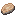
<figcaption>Source media</figcaption>
</figure>

<h2>Cooked Megalodon Meat</h2>

Cooking a Raw Megalodon Meat with a campfire, furnace, etc

Open reference →

</a>
</article>
<article class="reference-card" data-letter="C" data-search="cooked serpent meat cooking a raw serpent meat with a campfire, furnace, etc">
<a href="cooked-serpent-meat/" aria-label="Open Cooked Serpent Meat">
<figure class="reference-card-media reference-card-media--source">

<figcaption>Source media</figcaption>
</figure>

<h2>Cooked Serpent Meat</h2>

Cooking a Raw Serpent Meat with a campfire, furnace, etc

Open reference →

</a>
</article>
<article class="reference-card" data-letter="C" data-search="cooked sissie fin cooking a sissie fin with a campfire, furnace, etc">
<a href="cooked-sissie-fin/" aria-label="Open Cooked Sissie Fin">
<figure class="reference-card-media reference-card-media--source">
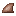
<figcaption>Source media</figcaption>
</figure>

<h2>Cooked Sissie Fin</h2>

Cooking a Sissie Fin with a campfire, furnace, etc

Open reference →

</a>
</article>
<article class="reference-card" data-letter="C" data-search="cooked sissie meat cooking a raw sissie meat with a campfire, furnace, etc">
<a href="cooked-sissie-meat/" aria-label="Open Cooked Sissie Meat">
<figure class="reference-card-media reference-card-media--source">
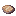
<figcaption>Source media</figcaption>
</figure>

<h2>Cooked Sissie Meat</h2>

Cooking a Raw Sissie Meat with a campfire, furnace, etc

Open reference →

</a>
</article>
<article class="reference-card" data-letter="C" data-search="cooked spear toro fin cooking a spear toro fin with a campfire, furnace, etc">
<a href="cooked-spear-toro-fin/" aria-label="Open Cooked Spear Toro Fin">
<figure class="reference-card-media reference-card-media--source">
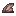
<figcaption>Source media</figcaption>
</figure>

<h2>Cooked Spear Toro Fin</h2>

Cooking a Spear Toro Fin with a campfire, furnace, etc

Open reference →

</a>
</article>
<article class="reference-card" data-letter="C" data-search="cooked spear toro meat cooking a raw spear toro meat with a campfire, furnace, etc">
<a href="cooked-spear-toro-meat/" aria-label="Open Cooked Spear Toro Meat">
<figure class="reference-card-media reference-card-media--source">
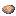
<figcaption>Source media</figcaption>
</figure>

<h2>Cooked Spear Toro Meat</h2>

Cooking a Raw Spear Toro Meat with a campfire, furnace, etc

Open reference →

</a>
</article>
<article class="reference-card" data-letter="C" data-search="crazy pierrot mask to craft the crazy pierrot mask, one must have used a pierrot mask schematic . to craft, you need a smithing bench .">
<a href="crazy-pierrot-mask/" aria-label="Open Crazy Pierrot Mask">
<figure class="reference-card-media reference-card-media--source">

<figcaption>Source media</figcaption>
</figure>

<h2>Crazy Pierrot Mask</h2>

To craft the Crazy Pierrot Mask, one must have used a Pierrot Mask Schematic . To craft, you need a Smithing Bench .

Open reference →

</a>
</article>
<article class="reference-card" data-letter="D" data-search="daemon core can be obtained by crafting at a smithing bench">
<a href="daemon-core/" aria-label="Open Daemon Core">
<figure class="reference-card-media reference-card-media--source">

<figcaption>Source media</figcaption>
</figure>

<h2>Daemon Core</h2>

Can be obtained by crafting at a Smithing Bench

Open reference →

</a>
</article>
<article class="reference-card" data-letter="D" data-search="daemon essence the dark grisly essence of a daemon.">
<a href="daemon-essence/" aria-label="Open Daemon Essence">
<figure class="reference-card-media reference-card-media--source">

<figcaption>Source media</figcaption>
</figure>

<h2>Daemon Essence</h2>

The dark grisly essence of a daemon.

Open reference →

</a>
</article>
<article class="reference-card" data-letter="D" data-search="dagger schematic found in butcher villager houses - 20% chance">
<a href="items-schematics-dagger-schematic/" aria-label="Open Dagger Schematic">
<figure class="reference-card-media reference-card-media--source">
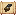
<figcaption>Source media</figcaption>
</figure>

<h2>Dagger Schematic</h2>

Found in Butcher Villager Houses - 20% Chance

Open reference →

</a>
</article>
<article class="reference-card" data-letter="D" data-search="dark set schematic earn the advancement [ ruler of monsters ] which requires taming lizardman , goblin , orc , direwolf , and slime">
<a href="items-schematics-dark-set-schematic/" aria-label="Open Dark Set Schematic">
<figure class="reference-card-media reference-card-media--source">

<figcaption>Source media</figcaption>
</figure>

<h2>Dark Set Schematic</h2>

Earn the Advancement [ Ruler Of Monsters ] which requires taming Lizardman , Goblin , Orc , Direwolf , and Slime

Open reference →

</a>
</article>
<article class="reference-card" data-letter="D" data-search="diamond gear schematic obtained by picking up a diamond">
<a href="items-schematics-diamond-gear-schematic/" aria-label="Open Diamond Gear Schematic">
<figure class="reference-card-media reference-card-media--source">

<figcaption>Source media</figcaption>
</figure>

<h2>Diamond Gear Schematic</h2>

Obtained by picking up a Diamond

Open reference →

</a>
</article>
<article class="reference-card" data-letter="D" data-search="dragon essence the overwhelming essence of a large and powerful beast.">
<a href="dragon-essence/" aria-label="Open Dragon Essence">
<figure class="reference-card-media reference-card-media--source">

<figcaption>Source media</figcaption>
</figure>

<h2>Dragon Essence</h2>

The overwhelming essence of a large and powerful beast.

Open reference →

</a>
</article>
<article class="reference-card" data-letter="D" data-search="dragon peacock feather a multicoloured feather plucked from a dragon peacock .">
<a href="dragon-peacock-feather/" aria-label="Open Dragon Peacock Feather">
<figure class="reference-card-media reference-card-media--source">

<figcaption>Source media</figcaption>
</figure>

<h2>Dragon Peacock Feather</h2>

A multicoloured feather plucked from a Dragon Peacock .

Open reference →

</a>
</article>
<article class="reference-card" data-letter="D" data-search="dubious food when eaten, the dubious food can give various effects based on an 80% chance per effect. these effects include:">
<a href="dubious-food/" aria-label="Open Dubious Food">
<figure class="reference-card-media reference-card-media--source">

<figcaption>Source media</figcaption>
</figure>

<h2>Dubious Food</h2>

When eaten, the Dubious Food can give various effects based on an 80% chance per effect. These effects include:

Open reference →

</a>
</article>
<article class="reference-card" data-letter="E" data-search="element core (earth) there are 2 obtainment methods:">
<a href="element-core-earth/" aria-label="Open Element Core (Earth)">
<figure class="reference-card-media reference-card-media--source">

<figcaption>Source media</figcaption>
</figure>

<h2>Element Core (Earth)</h2>

There are 2 obtainment methods:

Open reference →

</a>
</article>
<article class="reference-card" data-letter="E" data-search="element core (empty) can be obtained by crafting">
<a href="element-core-empty/" aria-label="Open Element Core (Empty)">
<figure class="reference-card-media reference-card-media--source">

<figcaption>Source media</figcaption>
</figure>

<h2>Element Core (Empty)</h2>

Can be obtained by crafting

Open reference →

</a>
</article>
<article class="reference-card" data-letter="E" data-search="element core (fire) there are 2 obtainment methods:">
<a href="element-core-fire/" aria-label="Open Element Core (Fire)">
<figure class="reference-card-media reference-card-media--source">

<figcaption>Source media</figcaption>
</figure>

<h2>Element Core (Fire)</h2>

There are 2 obtainment methods:

Open reference →

</a>
</article>
<article class="reference-card" data-letter="E" data-search="element core (space) there are 2 obtainment methods:">
<a href="element-core-space/" aria-label="Open Element Core (Space)">
<figure class="reference-card-media reference-card-media--source">

<figcaption>Source media</figcaption>
</figure>

<h2>Element Core (Space)</h2>

There are 2 obtainment methods:

Open reference →

</a>
</article>
<article class="reference-card" data-letter="E" data-search="element core (water) there are 2 obtainment methods:">
<a href="element-core-water/" aria-label="Open Element Core (Water)">
<figure class="reference-card-media reference-card-media--source">

<figcaption>Source media</figcaption>
</figure>

<h2>Element Core (Water)</h2>

There are 2 obtainment methods:

Open reference →

</a>
</article>
<article class="reference-card" data-letter="E" data-search="element core (wind) there are 2 obtainment methods:">
<a href="element-core-wind/" aria-label="Open Element Core (Wind)">
<figure class="reference-card-media reference-card-media--source">

<figcaption>Source media</figcaption>
</figure>

<h2>Element Core (Wind)</h2>

There are 2 obtainment methods:

Open reference →

</a>
</article>
<article class="reference-card" data-letter="E" data-search="elemental essence the essence carried with a creature as it is summoned.">
<a href="elemental-essence/" aria-label="Open Elemental Essence">
<figure class="reference-card-media reference-card-media--source">

<figcaption>Source media</figcaption>
</figure>

<h2>Elemental Essence</h2>

The essence carried with a creature as it is summoned.

Open reference →

</a>
</article>
<article class="reference-card" data-letter="E" data-search="elemental shard (earth) this item can be obtained by killing:">
<a href="items-misc-elemental-shard-earth/" aria-label="Open Elemental Shard (Earth)">
<figure class="reference-card-media reference-card-media--source">

<figcaption>Source media</figcaption>
</figure>

<h2>Elemental Shard (Earth)</h2>

This item can be obtained by killing:

Open reference →

</a>
</article>
<article class="reference-card" data-letter="E" data-search="elemental shard (fire)) this item can be obtained by killing:">
<a href="elemental-shard-fire/" aria-label="Open Elemental Shard (Fire))">
<figure class="reference-card-media reference-card-media--source">
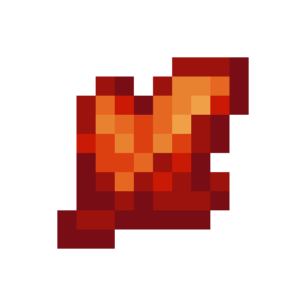
<figcaption>Source media</figcaption>
</figure>

<h2>Elemental Shard (Fire))</h2>

This item can be obtained by killing:

Open reference →

</a>
</article>
<article class="reference-card" data-letter="E" data-search="elemental shard (space) this item can be obtained by killing:">
<a href="elemental-shard-space/" aria-label="Open Elemental Shard (Space)">
<figure class="reference-card-media reference-card-media--source">

<figcaption>Source media</figcaption>
</figure>

<h2>Elemental Shard (Space)</h2>

This item can be obtained by killing:

Open reference →

</a>
</article>
<article class="reference-card" data-letter="E" data-search="elemental shard (water) this item can be obtained by killing:">
<a href="elemental-shard-water/" aria-label="Open Elemental Shard (Water)">
<figure class="reference-card-media reference-card-media--source">

<figcaption>Source media</figcaption>
</figure>

<h2>Elemental Shard (Water)</h2>

This item can be obtained by killing:

Open reference →

</a>
</article>
<article class="reference-card" data-letter="E" data-search="elemental shard (wind) this item can be obtained by killing:">
<a href="elemental-shard-wind/" aria-label="Open Elemental Shard (Wind)">
<figure class="reference-card-media reference-card-media--source">

<figcaption>Source media</figcaption>
</figure>

<h2>Elemental Shard (Wind)</h2>

This item can be obtained by killing:

Open reference →

</a>
</article>
<article class="reference-card" data-letter="E" data-search="enchanted silver apple to craft, you need a smithing bench .">
<a href="enchanted-silver-apple/" aria-label="Open Enchanted Silver Apple">
<figure class="reference-card-media reference-card-media--source">

<figcaption>Source media</figcaption>
</figure>

<h2>Enchanted Silver Apple</h2>

To craft, you need a Smithing Bench .

Open reference →

</a>
</article>
<article class="reference-card" data-letter="E" data-search="explorer maps master level dwarf cartographer have a chance to have a hell gate explorer map or a labyrinth explorer map as an option. the trade costs 5 - 15 gold coin . and they can…">
<a href="explorer-maps/" aria-label="Open Explorer Maps">
<figure class="reference-card-media reference-card-media--source">
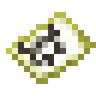
<figcaption>Source media</figcaption>
</figure>

<h2>Explorer Maps</h2>

Master level Dwarf Cartographer have a chance to have a Hell Gate Explorer Map or a Labyrinth Explorer Map as an option. The trade costs 5 - 15 Gold Coin . And they can…

Open reference →

</a>
</article>
<article class="reference-card" data-letter="F" data-search="full potion obtained by brewing hipokute flower with a vacuumed magic bottle of water">
<a href="full-potion/" aria-label="Open Full Potion">
<figure class="reference-card-media reference-card-media--source">

<figcaption>Source media</figcaption>
</figure>

<h2>Full Potion</h2>

Obtained by brewing Hipokute Flower with a Vacuumed Magic Bottle of Water

Open reference →

</a>
</article>
<article class="reference-card" data-letter="G" data-search="gear upstream reference information for gear.">
<a href="items-gear/" aria-label="Open Gear">
<figure class="reference-card-media reference-card-media--source">

<figcaption>Source media</figcaption>
</figure>

<h2>Gear</h2>

Upstream reference information for Gear.

Open reference →

</a>
</article>
<article class="reference-card" data-letter="G" data-search="gehenna-moth silk a dark dusty silk spun by a gehenna moth.">
<a href="gehenna-moth-silk/" aria-label="Open Gehenna-Moth Silk">
<figure class="reference-card-media reference-card-media--source">

<figcaption>Source media</figcaption>
</figure>

<h2>Gehenna-Moth Silk</h2>

A dark dusty silk spun by a Gehenna Moth.

Open reference →

</a>
</article>
<article class="reference-card" data-letter="G" data-search="giant ant carapace a thick brown scale from the exoskeleton of a giant ant .">
<a href="giant-ant-carapace/" aria-label="Open Giant Ant Carapace">
<figure class="reference-card-media reference-card-media--source">
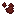
<figcaption>Source media</figcaption>
</figure>

<h2>Giant Ant Carapace</h2>

A thick brown scale from the exoskeleton of a Giant Ant .

Open reference →

</a>
</article>
<article class="reference-card" data-letter="G" data-search="giant ant leg killing/defeating a giant ant">
<a href="giant-ant-leg/" aria-label="Open Giant Ant Leg">
<figure class="reference-card-media reference-card-media--source">

<figcaption>Source media</figcaption>
</figure>

<h2>Giant Ant Leg</h2>

Killing/Defeating a Giant Ant

Open reference →

</a>
</article>
<article class="reference-card" data-letter="G" data-search="giant bat wing a large black wing from a giant bat .">
<a href="giant-bat-wing/" aria-label="Open Giant Bat Wing">
<figure class="reference-card-media reference-card-media--source">

<figcaption>Source media</figcaption>
</figure>

<h2>Giant Bat Wing</h2>

A large black wing from a Giant Bat .

Open reference →

</a>
</article>
<article class="reference-card" data-letter="G" data-search="goblin club can be crafted into a kanabo to craft, you need a smithing bench .">
<a href="goblin-club/" aria-label="Open Goblin Club">
<figure class="reference-card-media reference-card-media--source">
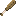
<figcaption>Source media</figcaption>
</figure>

<h2>Goblin Club</h2>

Can be crafted into a Kanabo To craft, you need a Smithing Bench .

Open reference →

</a>
</article>
<article class="reference-card" data-letter="G" data-search="gold gear schematic obtained by picking up a gold ingot">
<a href="items-schematics-gold-gear-schematic/" aria-label="Open Gold Gear Schematic">
<figure class="reference-card-media reference-card-media--source">

<figcaption>Source media</figcaption>
</figure>

<h2>Gold Gear Schematic</h2>

Obtained by picking up a Gold Ingot

Open reference →

</a>
</article>
<article class="reference-card" data-letter="G" data-search="great sword schematic found in weaponsmith village houses - 20% chance">
<a href="items-schematics-great-sword-schematic/" aria-label="Open Great Sword Schematic">
<figure class="reference-card-media reference-card-media--source">
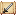
<figcaption>Source media</figcaption>
</figure>

<h2>Great Sword Schematic</h2>

Found in Weaponsmith Village Houses - 20% Chance

Open reference →

</a>
</article>
<article class="reference-card" data-letter="G" data-search="greater holy water this page is a work in progress!!! big things coming soon!!">
<a href="greater-holy-water/" aria-label="Open Greater Holy Water">
<figure class="reference-card-media reference-card-media--source">
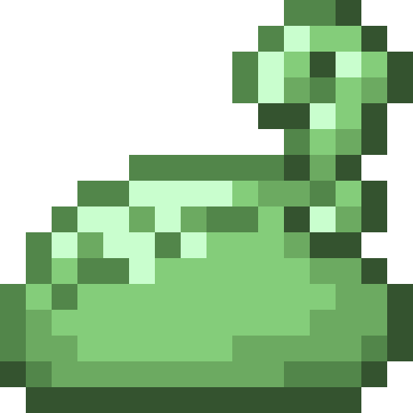
<figcaption>Source media</figcaption>
</figure>

<h2>Greater Holy Water</h2>

This page is a Work In Progress!!! Big Things Coming Soon!!

Open reference →

</a>
</article>
<article class="reference-card" data-letter="G" data-search="grimoire(a) a semi-high level grimoire for casting magic.">
<a href="grimoire-a/" aria-label="Open Grimoire(A)">
<figure class="reference-card-media reference-card-media--source">

<figcaption>Source media</figcaption>
</figure>

<h2>Grimoire(A)</h2>

A semi-high level grimoire for casting magic.

Open reference →

</a>
</article>
<article class="reference-card" data-letter="G" data-search="grimoire(b) a mid level grimoire for casting magic.">
<a href="grimoire-b/" aria-label="Open Grimoire(B)">
<figure class="reference-card-media reference-card-media--source">

<figcaption>Source media</figcaption>
</figure>

<h2>Grimoire(B)</h2>

A mid level grimoire for casting magic.

Open reference →

</a>
</article>
<article class="reference-card" data-letter="G" data-search="grimoire(c) a low level grimoire for casting magic.">
<a href="grimoire-c/" aria-label="Open Grimoire(C)">
<figure class="reference-card-media reference-card-media--source">

<figcaption>Source media</figcaption>
</figure>

<h2>Grimoire(C)</h2>

A low level grimoire for casting magic.

Open reference →

</a>
</article>
<article class="reference-card" data-letter="G" data-search="grimoire(d) a low level grimoire for casting magic.">
<a href="grimoire-d/" aria-label="Open Grimoire(D)">
<figure class="reference-card-media reference-card-media--source">

<figcaption>Source media</figcaption>
</figure>

<h2>Grimoire(D)</h2>

A low level grimoire for casting magic.

Open reference →

</a>
</article>
<article class="reference-card" data-letter="G" data-search="grimoire(special a) a high level grimoire for casting magic.">
<a href="grimoire-special-a/" aria-label="Open Grimoire(Special A)">
<figure class="reference-card-media reference-card-media--source">
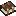
<figcaption>Source media</figcaption>
</figure>

<h2>Grimoire(Special A)</h2>

A high level grimoire for casting magic.

Open reference →

</a>
</article>
<article class="reference-card" data-letter="H" data-search="hell-moth silk a soft silk spun by a hell moth .">
<a href="hell-moth-silk/" aria-label="Open Hell-Moth Silk">
<figure class="reference-card-media reference-card-media--source">

<figcaption>Source media</figcaption>
</figure>

<h2>Hell-Moth Silk</h2>

A soft silk spun by a Hell Moth .

Open reference →

</a>
</article>
<article class="reference-card" data-letter="H" data-search="high  magisteel bone golem a golem resembling a skeleton made out of high magisteel. allows the player to possess it and works as a physical body, can also be given to spirit or daemon…">
<a href="high-magisteel-bone-golem/" aria-label="Open High  Magisteel Bone Golem">
<figure class="reference-card-media reference-card-media--source">
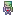
<figcaption>Source media</figcaption>
</figure>

<h2>High  Magisteel Bone Golem</h2>

A golem resembling a skeleton made out of high magisteel. Allows the player to possess it and works as a physical body, can also be given to spirit or daemon…

Open reference →

</a>
</article>
<article class="reference-card" data-letter="H" data-search="high magisteel gear schematic obtained by picking up a high magisteel ingot">
<a href="items-schematics-high-magisteel-gear-schematic/" aria-label="Open High Magisteel Gear Schematic">
<figure class="reference-card-media reference-card-media--source">

<figcaption>Source media</figcaption>
</figure>

<h2>High Magisteel Gear Schematic</h2>

Obtained by picking up a High Magisteel Ingot

Open reference →

</a>
</article>
<article class="reference-card" data-letter="H" data-search="high magisteel ingot smelting magic ore and iron in kiln each high magisteel ingot is made with 4 parts molten magisteel, 5 parts molten iron.">
<a href="high-magisteel-ingot/" aria-label="Open High Magisteel Ingot">
<figure class="reference-card-media reference-card-media--source">

<figcaption>Source media</figcaption>
</figure>

<h2>High Magisteel Ingot</h2>

Smelting Magic Ore and Iron in Kiln Each High Magisteel Ingot is made with 4 parts Molten Magisteel, 5 parts Molten Iron.

Open reference →

</a>
</article>
<article class="reference-card" data-letter="H" data-search="high magisteel nugget smelting magic ore and iron in kiln each high magisteel ingot is made with 4 parts molten magisteel, 5 parts molten iron.">
<a href="items-misc-high-magisteel-nugget/" aria-label="Open High Magisteel Nugget">
<figure class="reference-card-media reference-card-media--source">

<figcaption>Source media</figcaption>
</figure>

<h2>High Magisteel Nugget</h2>

Smelting Magic Ore and Iron in Kiln Each High Magisteel Ingot is made with 4 parts Molten Magisteel, 5 parts Molten Iron.

Open reference →

</a>
</article>
<article class="reference-card" data-letter="H" data-search="high potion obtained by brewing hipokute flower with a magic bottle of water or by brewing hipokute grass with a vacuumed magic bottle of water">
<a href="high-potion/" aria-label="Open High Potion">
<figure class="reference-card-media reference-card-media--source">

<figcaption>Source media</figcaption>
</figure>

<h2>High Potion</h2>

Obtained by brewing Hipokute Flower with a Magic Bottle of Water OR By brewing Hipokute Grass with a Vacuumed Magic Bottle of Water

Open reference →

</a>
</article>
<article class="reference-card" data-letter="H" data-search="hihi&#x27;irokane  bone golem a golem resembling a skeleton made out of hihi&#x27;irokane. allows the player to possess it and works as a physical body, can also be given to spirit or daemon subordinates…">
<a href="hihiirokane-bone-golem/" aria-label="Open Hihi&#x27;irokane  Bone Golem">
<figure class="reference-card-media reference-card-media--source">

<figcaption>Source media</figcaption>
</figure>

<h2>Hihi&#x27;irokane  Bone Golem</h2>

A golem resembling a skeleton made out of Hihi&#x27;irokane. Allows the player to possess it and works as a physical body, can also be given to spirit or daemon subordinates…

Open reference →

</a>
</article>
<article class="reference-card" data-letter="H" data-search="hihi&#x27;irokane ingot smelting hihi&#x27;irokane gear into nuggets and then crafting an ingot.">
<a href="hihiirokane-ingot/" aria-label="Open Hihi&#x27;irokane Ingot">
<figure class="reference-card-media reference-card-media--source">

<figcaption>Source media</figcaption>
</figure>

<h2>Hihi&#x27;irokane Ingot</h2>

Smelting Hihi&#x27;irokane gear into nuggets and then crafting an ingot.

Open reference →

</a>
</article>
<article class="reference-card" data-letter="H" data-search="hihi&#x27;irokane nugget smelting hihi&#x27;irokane armor/gear">
<a href="hihiirokane-nugget/" aria-label="Open Hihi&#x27;irokane Nugget">
<figure class="reference-card-media reference-card-media--source">

<figcaption>Source media</figcaption>
</figure>

<h2>Hihi&#x27;irokane Nugget</h2>

Smelting hihi&#x27;irokane armor/gear

Open reference →

</a>
</article>
<article class="reference-card" data-letter="H" data-search="hihiirokane gear schematic obtained by picking up an hihiirokane ingot">
<a href="items-schematics-hihiirokane-gear-schematic/" aria-label="Open HihiIrokane Gear Schematic">
<figure class="reference-card-media reference-card-media--source">

<figcaption>Source media</figcaption>
</figure>

<h2>HihiIrokane Gear Schematic</h2>

Obtained by picking up an HihiIrokane Ingot

Open reference →

</a>
</article>
<article class="reference-card" data-letter="H" data-search="hipokute flower this item can be obtained by right clicking a hipokute grass or destroying it. this whether in the wild or whether by hipokute farming .">
<a href="hipokute-flower/" aria-label="Open Hipokute Flower">
<figure class="reference-card-media reference-card-media--source">

<figcaption>Source media</figcaption>
</figure>

<h2>Hipokute Flower</h2>

This item can be obtained by right clicking a hipokute grass or destroying it. This whether in the wild or whether by hipokute farming .

Open reference →

</a>
</article>
<article class="reference-card" data-letter="H" data-search="hipokute grass this item can be obtained by destroying/harvesting hipokute grass sprouts in the world. this is whether it is found in the wild or by hipokute farming .">
<a href="hipokute-grass/" aria-label="Open Hipokute Grass">
<figure class="reference-card-media reference-card-media--source">

<figcaption>Source media</figcaption>
</figure>

<h2>Hipokute Grass</h2>

This item can be obtained by destroying/harvesting hipokute grass sprouts in the world. This is whether it is found in the wild or by hipokute farming .

Open reference →

</a>
</article>
<article class="reference-card" data-letter="H" data-search="hipokute seeds this item can be obtained by destroying/harvesting hipokute grass sprouts in the world. this whether naturally generated in the wild or grown by hipokute farming…">
<a href="hipokute-seeds/" aria-label="Open Hipokute Seeds">
<figure class="reference-card-media reference-card-media--source">

<figcaption>Source media</figcaption>
</figure>

<h2>Hipokute Seeds</h2>

This item can be obtained by destroying/harvesting hipokute grass sprouts in the world. This whether naturally generated in the wild or grown by hipokute farming…

Open reference →

</a>
</article>
<article class="reference-card" data-letter="H" data-search="holy milk this page is a work in progress!!! big things coming soon!!">
<a href="holy-milk/" aria-label="Open Holy Milk">
<figure class="reference-card-media reference-card-media--source">
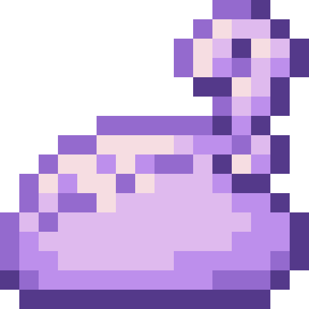
<figcaption>Source media</figcaption>
</figure>

<h2>Holy Milk</h2>

This page is a Work In Progress!!! Big Things Coming Soon!!

Open reference →

</a>
</article>
<article class="reference-card" data-letter="H" data-search="holy milk bucket this page is a work in progress!!! big things coming soon!!">
<a href="holy-milk-bucket/" aria-label="Open Holy Milk Bucket">
<figure class="reference-card-media reference-card-media--source">

<figcaption>Source media</figcaption>
</figure>

<h2>Holy Milk Bucket</h2>

This page is a Work In Progress!!! Big Things Coming Soon!!

Open reference →

</a>
</article>
<article class="reference-card" data-letter="H" data-search="holy water this page is a work in progress!!! big things coming soon!!">
<a href="holy-water/" aria-label="Open Holy Water">
<figure class="reference-card-media reference-card-media--source">
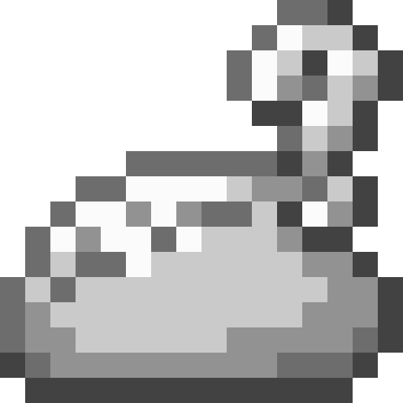
<figcaption>Source media</figcaption>
</figure>

<h2>Holy Water</h2>

This page is a Work In Progress!!! Big Things Coming Soon!!

Open reference →

</a>
</article>
<article class="reference-card" data-letter="H" data-search="hot spring water bucket this page is a work in progress!!! big things coming soon!!">
<a href="items-misc-hot-spring-water-bucket/" aria-label="Open Hot Spring Water Bucket">
<figure class="reference-card-media reference-card-media--source">
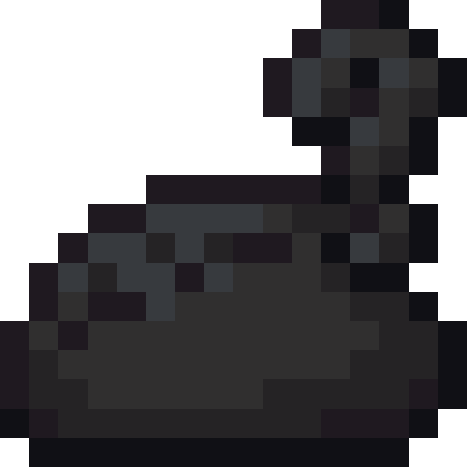
<figcaption>Source media</figcaption>
</figure>

<h2>Hot Spring Water Bucket</h2>

This page is a Work In Progress!!! Big Things Coming Soon!!

Open reference →

</a>
</article>
<article class="reference-card" data-letter="I" data-search="ice blade to craft, you need a smithing bench and have used high magisteel gear schematic , and long sword schematic">
<a href="ice-blade/" aria-label="Open Ice Blade">
<figure class="reference-card-media reference-card-media--source">

<figcaption>Source media</figcaption>
</figure>

<h2>Ice Blade</h2>

To craft, you need a Smithing Bench and have used High Magisteel Gear Schematic , and Long Sword Schematic

Open reference →

</a>
</article>
<article class="reference-card" data-letter="I" data-search="insectar carapace a strong armor from the body of an army wasp .">
<a href="insectar-carapace/" aria-label="Open Insectar Carapace">
<figure class="reference-card-media reference-card-media--source">

<figcaption>Source media</figcaption>
</figure>

<h2>Insectar Carapace</h2>

A strong armor from the body of an Army Wasp .

Open reference →

</a>
</article>
<article class="reference-card" data-letter="I" data-search="invisible feather a transparent feather plucked from a one eyed owl .">
<a href="invisible-feather/" aria-label="Open Invisible Feather">
<figure class="reference-card-media reference-card-media--source">

<figcaption>Source media</figcaption>
</figure>

<h2>Invisible Feather</h2>

A transparent feather plucked from a One Eyed Owl .

Open reference →

</a>
</article>
<article class="reference-card" data-letter="I" data-search="iron gear schematic obtained by picking up an iron ingot">
<a href="items-schematics-iron-gear-schematic/" aria-label="Open Iron Gear Schematic">
<figure class="reference-card-media reference-card-media--source">

<figcaption>Source media</figcaption>
</figure>

<h2>Iron Gear Schematic</h2>

Obtained by picking up an Iron Ingot

Open reference →

</a>
</article>
<article class="reference-card" data-letter="I" data-search="items tensura:reincarnated adds a number of unique and interesting items.">
<a href="items/" aria-label="Open Items">
<figure class="reference-card-media reference-card-media--source">
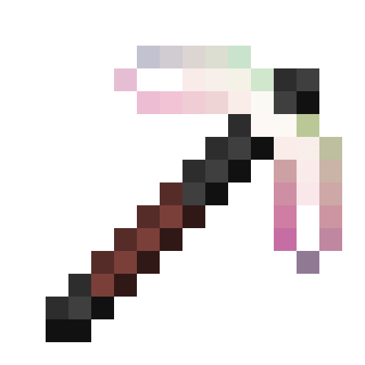
<figcaption>Source media</figcaption>
</figure>

<h2>Items</h2>

Tensura:Reincarnated adds a number of unique and interesting Items.

Open reference →

</a>
</article>
<article class="reference-card" data-letter="I" data-search="items mob drops ores">
<a href="../../mysticism-reference/items/items/" aria-label="Open Items">
<figure class="reference-card-media reference-card-media--source">

<figcaption>Source media</figcaption>
</figure>

<h2>Items</h2>

Mob Drops Ores

Open reference →

</a>
</article>
<article class="reference-card" data-letter="I" data-search="items/mob drops cryptid essence flame essence ice essence lightning essence">
<a href="../../mysticism-reference/items/items-mob-drops/" aria-label="Open Items/Mob Drops">
<figure class="reference-card-media reference-card-media--source">

<figcaption>Source media</figcaption>
</figure>

<h2>Items/Mob Drops</h2>

Cryptid Essence Flame Essence Ice Essence Lightning Essence

Open reference →

</a>
</article>
<article class="reference-card" data-letter="I" data-search="items/ores ice essence">
<a href="../../mysticism-reference/items/items-ores/" aria-label="Open Items/Ores">
<figure class="reference-card-media reference-card-media--source">

<figcaption>Source media</figcaption>
</figure>

<h2>Items/Ores</h2>

Ice Essence

Open reference →

</a>
</article>
<article class="reference-card" data-letter="J" data-search="japanese schematic found in woodland mansions &amp; ancient cities - 10% chance">
<a href="items-schematics-japanese-schematic/" aria-label="Open Japanese Schematic">
<figure class="reference-card-media reference-card-media--source">

<figcaption>Source media</figcaption>
</figure>

<h2>Japanese Schematic</h2>

Found in Woodland Mansions &amp; Ancient Cities - 10% Chance

Open reference →

</a>
</article>
<article class="reference-card" data-letter="K" data-search="kanabo to craft, you need a smithing bench .">
<a href="kanabo/" aria-label="Open Kanabo">
<figure class="reference-card-media reference-card-media--source">

<figcaption>Source media</figcaption>
</figure>

<h2>Kanabo</h2>

To craft, you need a Smithing Bench .

Open reference →

</a>
</article>
<article class="reference-card" data-letter="K" data-search="knight spider carapace a strong armor from the body of a knight spider .">
<a href="knight-spider-carapace/" aria-label="Open Knight Spider Carapace">
<figure class="reference-card-media reference-card-media--source">
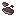
<figcaption>Source media</figcaption>
</figure>

<h2>Knight Spider Carapace</h2>

A strong armor from the body of a Knight Spider .

Open reference →

</a>
</article>
<article class="reference-card" data-letter="K" data-search="knight spider carapace gear schematic obtained by picking up a knight spider carapace">
<a href="items-schematics-knight-spider-carapace-gear-schematic/" aria-label="Open Knight Spider Carapace Gear Schematic">
<figure class="reference-card-media reference-card-media--source">

<figcaption>Source media</figcaption>
</figure>

<h2>Knight Spider Carapace Gear Schematic</h2>

Obtained by picking up a Knight Spider Carapace

Open reference →

</a>
</article>
<article class="reference-card" data-letter="K" data-search="knight spider leg killing/defeating a knight spider">
<a href="knight-spider-leg/" aria-label="Open Knight Spider Leg">
<figure class="reference-card-media reference-card-media--source">

<figcaption>Source media</figcaption>
</figure>

<h2>Knight Spider Leg</h2>

Killing/Defeating a Knight Spider

Open reference →

</a>
</article>
<article class="reference-card" data-letter="K" data-search="kunai schematic found in abandoned mineshafts - 10% chance">
<a href="items-schematics-kunai-schematic/" aria-label="Open Kunai Schematic">
<figure class="reference-card-media reference-card-media--source">
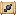
<figcaption>Source media</figcaption>
</figure>

<h2>Kunai Schematic</h2>

Found in Abandoned Mineshafts - 10% Chance

Open reference →

</a>
</article>
<article class="reference-card" data-letter="L" data-search="learnable battlewills are skills equal to magic that use aura instead of magicules. see battlewill manual for all possible battlewills">
<a href="items-learnable/" aria-label="Open Learnable">
<figure class="reference-card-media reference-card-media--source">

<figcaption>Source media</figcaption>
</figure>

<h2>Learnable</h2>

Battlewills are skills equal to magic that use aura instead of magicules. See Battlewill Manual for all possible battlewills

Open reference →

</a>
</article>
<article class="reference-card" data-letter="L" data-search="leather gear schematic obtained by picking up leather">
<a href="items-schematics-leather-gear-schematic/" aria-label="Open Leather Gear Schematic">
<figure class="reference-card-media reference-card-media--source">

<figcaption>Source media</figcaption>
</figure>

<h2>Leather Gear Schematic</h2>

Obtained by picking up leather

Open reference →

</a>
</article>
<article class="reference-card" data-letter="L" data-search="long sword schematic found in dwarf blacksmiths - 10% or found in toolsmith villager houses - 20% chance">
<a href="items-schematics-long-sword-schematic/" aria-label="Open Long Sword Schematic">
<figure class="reference-card-media reference-card-media--source">
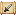
<figcaption>Source media</figcaption>
</figure>

<h2>Long Sword Schematic</h2>

Found in Dwarf Blacksmiths - 10% OR Found in Toolsmith Villager Houses - 20% Chance

Open reference →

</a>
</article>
<article class="reference-card" data-letter="L" data-search="low magisteel bone golem a golem resembling a skeleton made out of low magisteel. allows the player to possess it and works as a physical body, can also be given to spirit or daemon…">
<a href="low-magisteel-bone-golem/" aria-label="Open Low Magisteel Bone Golem">
<figure class="reference-card-media reference-card-media--source">

<figcaption>Source media</figcaption>
</figure>

<h2>Low Magisteel Bone Golem</h2>

A golem resembling a skeleton made out of low magisteel. Allows the player to possess it and works as a physical body, can also be given to spirit or daemon…

Open reference →

</a>
</article>
<article class="reference-card" data-letter="L" data-search="low magisteel gear schematic obtained by picking up a low magisteel ingot">
<a href="items-schematics-low-magisteel-gear-schematic/" aria-label="Open Low Magisteel Gear Schematic">
<figure class="reference-card-media reference-card-media--source">

<figcaption>Source media</figcaption>
</figure>

<h2>Low Magisteel Gear Schematic</h2>

Obtained by picking up a Low Magisteel Ingot

Open reference →

</a>
</article>
<article class="reference-card" data-letter="L" data-search="low magisteel ingot smelting magic ore and iron in kiln each low magisteel ingot is made with 1 part molten magisteel and 8 parts molten iron.">
<a href="low-magisteel-ingot/" aria-label="Open Low Magisteel Ingot">
<figure class="reference-card-media reference-card-media--source">

<figcaption>Source media</figcaption>
</figure>

<h2>Low Magisteel Ingot</h2>

Smelting Magic Ore and Iron in Kiln Each Low Magisteel Ingot is made with 1 part Molten Magisteel and 8 parts Molten Iron.

Open reference →

</a>
</article>
<article class="reference-card" data-letter="L" data-search="low magisteel nugget smelting magic ore and iron in kiln each low magisteel nugget is made with 1 part molten magisteel and 8 parts molten iron.">
<a href="low-magisteel-nugget/" aria-label="Open Low Magisteel Nugget">
<figure class="reference-card-media reference-card-media--source">

<figcaption>Source media</figcaption>
</figure>

<h2>Low Magisteel Nugget</h2>

Smelting Magic Ore and Iron in Kiln Each Low Magisteel Nugget is made with 1 part Molten Magisteel and 8 parts Molten Iron.

Open reference →

</a>
</article>
<article class="reference-card" data-letter="L" data-search="low potion obtained by brewing hipokute grass with a magic bottle of water">
<a href="low-potion/" aria-label="Open Low Potion">
<figure class="reference-card-media reference-card-media--source">

<figcaption>Source media</figcaption>
</figure>

<h2>Low Potion</h2>

Obtained by brewing Hipokute Grass with a Magic Bottle of Water

Open reference →

</a>
</article>
<article class="reference-card" data-letter="M" data-search="marionette heart a rare magic item that can turn the user into a majin with the cost of half their max hp in damage and most of their current magicule. this does not mean that the…">
<a href="marionette-heart/" aria-label="Open Marionette Heart">
<figure class="reference-card-media reference-card-media--source">
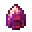
<figcaption>Source media</figcaption>
</figure>

<h2>Marionette Heart</h2>

A rare magic item that can turn the user into a Majin with the cost of half their max HP in damage and most of their current Magicule. This does NOT mean that the…

Open reference →

</a>
</article>
<article class="reference-card" data-letter="M" data-search="meat crusher holding right click and releasing it when fully charge deals a heavy blow which deals 26 damage but also deals corrosion damage for ~2 seconds(40 ticks)">
<a href="meat-crusher/" aria-label="Open Meat Crusher">
<figure class="reference-card-media reference-card-media--source">
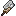
<figcaption>Source media</figcaption>
</figure>

<h2>Meat Crusher</h2>

Holding right click and releasing it when fully charge deals a heavy blow which deals 26 damage but also deals Corrosion damage for ~2 seconds(40 ticks)

Open reference →

</a>
</article>
<article class="reference-card" data-letter="M" data-search="misc upstream reference information for misc.">
<a href="items-misc/" aria-label="Open Misc">
<figure class="reference-card-media reference-card-media--source">

<figcaption>Source media</figcaption>
</figure>

<h2>Misc</h2>

Upstream reference information for Misc.

Open reference →

</a>
</article>
<article class="reference-card" data-letter="M" data-search="mithril  magisteel bone golem a golem resembling a skeleton made out of mithril. allows the player to possess it and works as a physical body, can also be given to spirit or daemon subordinates by…">
<a href="mithril-magisteel-bone-golem/" aria-label="Open Mithril  Magisteel Bone Golem">
<figure class="reference-card-media reference-card-media--source">
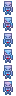
<figcaption>Source media</figcaption>
</figure>

<h2>Mithril  Magisteel Bone Golem</h2>

A golem resembling a skeleton made out of Mithril. Allows the player to possess it and works as a physical body, can also be given to spirit or daemon subordinates by…

Open reference →

</a>
</article>
<article class="reference-card" data-letter="M" data-search="mithril gear schematic obtained by picking up a mithril ingot">
<a href="items-schematics-mithril-gear-schematic/" aria-label="Open Mithril Gear Schematic">
<figure class="reference-card-media reference-card-media--source">

<figcaption>Source media</figcaption>
</figure>

<h2>Mithril Gear Schematic</h2>

Obtained by picking up a Mithril Ingot

Open reference →

</a>
</article>
<article class="reference-card" data-letter="M" data-search="mithril ingot smelting magic ore and silver in kiln each mithril ingot is made with 5 parts molten magisteel and 4 parts molten silver.">
<a href="mithril-ingot/" aria-label="Open Mithril Ingot">
<figure class="reference-card-media reference-card-media--source">

<figcaption>Source media</figcaption>
</figure>

<h2>Mithril Ingot</h2>

Smelting Magic Ore and Silver in Kiln Each Mithril Ingot is made with 5 parts Molten Magisteel and 4 parts Molten Silver.

Open reference →

</a>
</article>
<article class="reference-card" data-letter="M" data-search="mithril nugget smelting magic ore and iron in kiln each mithril ingot is made with 5 parts molten magisteel, 4 parts molten silver.">
<a href="mithril-nugget/" aria-label="Open Mithril Nugget">
<figure class="reference-card-media reference-card-media--source">

<figcaption>Source media</figcaption>
</figure>

<h2>Mithril Nugget</h2>

Smelting Magic Ore and Iron in Kiln Each Mithril Ingot is made with 5 parts Molten Magisteel, 4 parts Molten Silver.

Open reference →

</a>
</article>
<article class="reference-card" data-letter="M" data-search="mob drops these are primarily obtained via mobs, unless specified otherwise">
<a href="items-mob-drops/" aria-label="Open Mob Drops">
<figure class="reference-card-media reference-card-media--source">

<figcaption>Source media</figcaption>
</figure>

<h2>Mob Drops</h2>

These are primarily obtained via Mobs, unless specified otherwise

Open reference →

</a>
</article>
<article class="reference-card" data-letter="M" data-search="monster leather (a) a monster leather of rank-a">
<a href="monster-leather-a/" aria-label="Open Monster Leather (A)">
<figure class="reference-card-media reference-card-media--source">
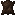
<figcaption>Source media</figcaption>
</figure>

<h2>Monster Leather (A)</h2>

A Monster Leather of Rank-A

Open reference →

</a>
</article>
<article class="reference-card" data-letter="M" data-search="monster leather (b) a monster leather of rank-b">
<a href="monster-leather-b/" aria-label="Open Monster Leather (B)">
<figure class="reference-card-media reference-card-media--source">

<figcaption>Source media</figcaption>
</figure>

<h2>Monster Leather (B)</h2>

A Monster Leather of Rank-B

Open reference →

</a>
</article>
<article class="reference-card" data-letter="M" data-search="monster leather (c) a monster leather of rank-c">
<a href="monster-leather-c/" aria-label="Open Monster Leather (C)">
<figure class="reference-card-media reference-card-media--source">
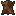
<figcaption>Source media</figcaption>
</figure>

<h2>Monster Leather (C)</h2>

A Monster Leather of Rank-C

Open reference →

</a>
</article>
<article class="reference-card" data-letter="M" data-search="monster leather (d) a monster leather of rank-d">
<a href="monster-leather-d/" aria-label="Open Monster Leather (D)">
<figure class="reference-card-media reference-card-media--source">
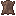
<figcaption>Source media</figcaption>
</figure>

<h2>Monster Leather (D)</h2>

A Monster Leather of Rank-D

Open reference →

</a>
</article>
<article class="reference-card" data-letter="M" data-search="monster leather (special a) a monster leather of rank-special a">
<a href="monster-leather-special-a/" aria-label="Open Monster Leather (Special A)">
<figure class="reference-card-media reference-card-media--source">

<figcaption>Source media</figcaption>
</figure>

<h2>Monster Leather (Special A)</h2>

A Monster Leather of Rank-Special A

Open reference →

</a>
</article>
<article class="reference-card" data-letter="M" data-search="monster leather boots (a) obtainable through killing mobs while having monster leather boots (b) in your offhand or equiped">
<a href="monster-leather-boots-a/" aria-label="Open Monster Leather Boots (A)">
<figure class="reference-card-media reference-card-media--source">
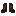
<figcaption>Source media</figcaption>
</figure>

<h2>Monster Leather Boots (A)</h2>

Obtainable through killing mobs while having Monster Leather Boots (B) in your offhand or equiped

Open reference →

</a>
</article>
<article class="reference-card" data-letter="M" data-search="monster leather boots (b) obtainable through killing mobs while having monster leather boots (c) in your offhand or equiped">
<a href="monster-leather-boots-b/" aria-label="Open Monster Leather Boots (B)">
<figure class="reference-card-media reference-card-media--source">

<figcaption>Source media</figcaption>
</figure>

<h2>Monster Leather Boots (B)</h2>

Obtainable through killing mobs while having Monster Leather Boots (C) in your offhand or equiped

Open reference →

</a>
</article>
<article class="reference-card" data-letter="M" data-search="monster leather boots (c) obtainable through killing mobs while having monster leather boots (d) in your offhand or equiped">
<a href="monster-leather-boots-c/" aria-label="Open Monster Leather Boots (C)">
<figure class="reference-card-media reference-card-media--source">
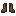
<figcaption>Source media</figcaption>
</figure>

<h2>Monster Leather Boots (C)</h2>

Obtainable through killing mobs while having Monster Leather Boots (D) in your offhand or equiped

Open reference →

</a>
</article>
<article class="reference-card" data-letter="M" data-search="monster leather boots (d) to craft the armor, one must have used a monster leather gear schematic . to craft, you need a smithing bench .">
<a href="monster-leather-boots-d/" aria-label="Open Monster Leather Boots (D)">
<figure class="reference-card-media reference-card-media--source">
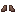
<figcaption>Source media</figcaption>
</figure>

<h2>Monster Leather Boots (D)</h2>

To craft the armor, one must have used a Monster Leather Gear Schematic . To craft, you need a Smithing Bench .

Open reference →

</a>
</article>
<article class="reference-card" data-letter="M" data-search="monster leather boots (special a) obtainable through killing mobs while having monster leather boots (a) in your offhand or equiped">
<a href="monster-leather-boots-special-a/" aria-label="Open Monster Leather Boots (Special A)">
<figure class="reference-card-media reference-card-media--source">

<figcaption>Source media</figcaption>
</figure>

<h2>Monster Leather Boots (Special A)</h2>

Obtainable through killing mobs while having Monster Leather Boots (A) in your offhand or equiped

Open reference →

</a>
</article>
<article class="reference-card" data-letter="M" data-search="monster leather chestplate (a) obtainable through killing mobs while having monster leather chestplate (b) in your offhand or equiped">
<a href="monster-leather-chestplate-a/" aria-label="Open Monster Leather Chestplate (A)">
<figure class="reference-card-media reference-card-media--source">
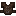
<figcaption>Source media</figcaption>
</figure>

<h2>Monster Leather Chestplate (A)</h2>

Obtainable through killing mobs while having Monster Leather Chestplate (B) in your offhand or equiped

Open reference →

</a>
</article>
<article class="reference-card" data-letter="M" data-search="monster leather chestplate (b) obtainable through killing mobs while having monster leather chestplate (c) in your offhand or equiped">
<a href="monster-leather-chestplate-b/" aria-label="Open Monster Leather Chestplate (B)">
<figure class="reference-card-media reference-card-media--source">

<figcaption>Source media</figcaption>
</figure>

<h2>Monster Leather Chestplate (B)</h2>

Obtainable through killing mobs while having Monster Leather Chestplate (C) in your offhand or equiped

Open reference →

</a>
</article>
<article class="reference-card" data-letter="M" data-search="monster leather chestplate (c) obtainable through killing mobs while having monster leather chestplate (d) in your offhand or equiped">
<a href="monster-leather-chestplate-c/" aria-label="Open Monster Leather Chestplate (C)">
<figure class="reference-card-media reference-card-media--source">
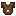
<figcaption>Source media</figcaption>
</figure>

<h2>Monster Leather Chestplate (C)</h2>

Obtainable through killing mobs while having Monster Leather Chestplate (D) in your offhand or equiped

Open reference →

</a>
</article>
<article class="reference-card" data-letter="M" data-search="monster leather chestplate (d) to craft the armor, one must have used a monster leather gear schematic . to craft, you need a smithing bench .">
<a href="monster-leather-chestplate-d/" aria-label="Open Monster Leather Chestplate (D)">
<figure class="reference-card-media reference-card-media--source">
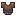
<figcaption>Source media</figcaption>
</figure>

<h2>Monster Leather Chestplate (D)</h2>

To craft the armor, one must have used a Monster Leather Gear Schematic . To craft, you need a Smithing Bench .

Open reference →

</a>
</article>
<article class="reference-card" data-letter="M" data-search="monster leather chestplate (special a) obtainable through killing mobs while having monster leather chestplate (a) in your offhand or equiped">
<a href="monster-leather-chestplate-special-a/" aria-label="Open Monster Leather Chestplate (Special A)">
<figure class="reference-card-media reference-card-media--source">

<figcaption>Source media</figcaption>
</figure>

<h2>Monster Leather Chestplate (Special A)</h2>

Obtainable through killing mobs while having Monster Leather Chestplate (A) in your offhand or equiped

Open reference →

</a>
</article>
<article class="reference-card" data-letter="M" data-search="monster leather gear schematic obtained by picking up any monster leather">
<a href="items-schematics-monster-leather-gear-schematic/" aria-label="Open Monster Leather Gear Schematic">
<figure class="reference-card-media reference-card-media--source">

<figcaption>Source media</figcaption>
</figure>

<h2>Monster Leather Gear Schematic</h2>

Obtained by picking up any Monster Leather

Open reference →

</a>
</article>
<article class="reference-card" data-letter="M" data-search="monster leather helmet (a) obtainable through killing mobs while having monster leather helmet (b) in your offhand or equiped">
<a href="monster-leather-helmet-a/" aria-label="Open Monster Leather Helmet (A)">
<figure class="reference-card-media reference-card-media--source">
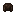
<figcaption>Source media</figcaption>
</figure>

<h2>Monster Leather Helmet (A)</h2>

Obtainable through killing mobs while having Monster Leather Helmet (B) in your offhand or equiped

Open reference →

</a>
</article>
<article class="reference-card" data-letter="M" data-search="monster leather helmet (b) obtainable through killing mobs while having monster leather helmet (c) in your offhand or equiped">
<a href="monster-leather-helmet-b/" aria-label="Open Monster Leather Helmet (B)">
<figure class="reference-card-media reference-card-media--source">

<figcaption>Source media</figcaption>
</figure>

<h2>Monster Leather Helmet (B)</h2>

Obtainable through killing mobs while having Monster Leather Helmet (C) in your offhand or equiped

Open reference →

</a>
</article>
<article class="reference-card" data-letter="M" data-search="monster leather helmet (c) obtainable through killing mobs while having monster leather helmet (d) in your offhand or equiped">
<a href="monster-leather-helmet-c/" aria-label="Open Monster Leather Helmet (C)">
<figure class="reference-card-media reference-card-media--source">
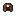
<figcaption>Source media</figcaption>
</figure>

<h2>Monster Leather Helmet (C)</h2>

Obtainable through killing mobs while having Monster Leather Helmet (D) in your offhand or equiped

Open reference →

</a>
</article>
<article class="reference-card" data-letter="M" data-search="monster leather helmet (d) to craft the armor, one must have used a monster leather gear schematic . to craft, you need a smithing bench .">
<a href="monster-leather-helmet-d/" aria-label="Open Monster Leather Helmet (D)">
<figure class="reference-card-media reference-card-media--source">

<figcaption>Source media</figcaption>
</figure>

<h2>Monster Leather Helmet (D)</h2>

To craft the armor, one must have used a Monster Leather Gear Schematic . To craft, you need a Smithing Bench .

Open reference →

</a>
</article>
<article class="reference-card" data-letter="M" data-search="monster leather helmet (special a) obtainable through killing mobs while having monster leather helmet (a) in your offhand or equiped">
<a href="monster-leather-helmet-special-a/" aria-label="Open Monster Leather Helmet (Special A)">
<figure class="reference-card-media reference-card-media--source">

<figcaption>Source media</figcaption>
</figure>

<h2>Monster Leather Helmet (Special A)</h2>

Obtainable through killing mobs while having Monster Leather Helmet (A) in your offhand or equiped

Open reference →

</a>
</article>
<article class="reference-card" data-letter="M" data-search="monster leather leggings (a) obtainable through killing mobs while having monster leather leggings (b) in your offhand or equiped">
<a href="monster-leather-leggings-a/" aria-label="Open Monster Leather Leggings (A)">
<figure class="reference-card-media reference-card-media--source">
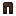
<figcaption>Source media</figcaption>
</figure>

<h2>Monster Leather Leggings (A)</h2>

Obtainable through killing mobs while having Monster Leather Leggings (B) in your offhand or equiped

Open reference →

</a>
</article>
<article class="reference-card" data-letter="M" data-search="monster leather leggings (b) obtainable through killing mobs while having monster leather leggings (c) in your offhand or equiped">
<a href="monster-leather-leggings-b/" aria-label="Open Monster Leather Leggings (B)">
<figure class="reference-card-media reference-card-media--source">

<figcaption>Source media</figcaption>
</figure>

<h2>Monster Leather Leggings (B)</h2>

Obtainable through killing mobs while having Monster Leather Leggings (C) in your offhand or equiped

Open reference →

</a>
</article>
<article class="reference-card" data-letter="M" data-search="monster leather leggings (c) obtainable through killing mobs while having monster leather leggings (d) in your offhand or equiped">
<a href="monster-leather-leggings-c/" aria-label="Open Monster Leather Leggings (C)">
<figure class="reference-card-media reference-card-media--source">
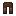
<figcaption>Source media</figcaption>
</figure>

<h2>Monster Leather Leggings (C)</h2>

Obtainable through killing mobs while having Monster Leather Leggings (D) in your offhand or equiped

Open reference →

</a>
</article>
<article class="reference-card" data-letter="M" data-search="monster leather leggings (d) to craft the armor, one must have used a monster leather gear schematic . to craft, you need a smithing bench .">
<a href="monster-leather-leggings-d/" aria-label="Open Monster Leather Leggings (D)">
<figure class="reference-card-media reference-card-media--source">

<figcaption>Source media</figcaption>
</figure>

<h2>Monster Leather Leggings (D)</h2>

To craft the armor, one must have used a Monster Leather Gear Schematic . To craft, you need a Smithing Bench .

Open reference →

</a>
</article>
<article class="reference-card" data-letter="M" data-search="monster leather leggings (special a) obtainable through killing mobs while having monster leather leggings (a) in your offhand or equiped">
<a href="monster-leather-leggings-special-a/" aria-label="Open Monster Leather Leggings (Special A)">
<figure class="reference-card-media reference-card-media--source">
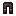
<figcaption>Source media</figcaption>
</figure>

<h2>Monster Leather Leggings (Special A)</h2>

Obtainable through killing mobs while having Monster Leather Leggings (A) in your offhand or equiped

Open reference →

</a>
</article>
<article class="reference-card" data-letter="M" data-search="monster saddle to craft, you need a smithing bench .">
<a href="monster-saddle/" aria-label="Open Monster Saddle">
<figure class="reference-card-media reference-card-media--source">

<figcaption>Source media</figcaption>
</figure>

<h2>Monster Saddle</h2>

To craft, you need a Smithing Bench .

Open reference →

</a>
</article>
<article class="reference-card" data-letter="O" data-search="orc disaster head the severed head of the orc disaster taken as a trophy.">
<a href="orc-disaster-head/" aria-label="Open Orc Disaster Head">
<figure class="reference-card-media reference-card-media--source">
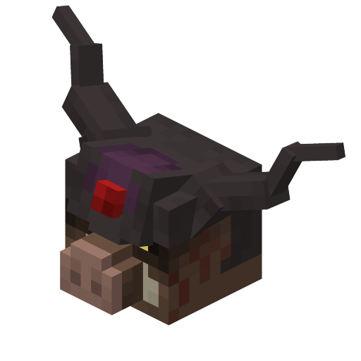
<figcaption>Source media</figcaption>
</figure>

<h2>Orc Disaster Head</h2>

The severed head of the Orc Disaster taken as a trophy.

Open reference →

</a>
</article>
<article class="reference-card" data-letter="O" data-search="orichalcum bone golem a golem resembling a skeleton made out of orichalcum. allows the player to possess it and works as a physical body, can also be given to spirit or daemon subordinates…">
<a href="orichalcum-bone-golem/" aria-label="Open Orichalcum Bone Golem">
<figure class="reference-card-media reference-card-media--source">
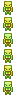
<figcaption>Source media</figcaption>
</figure>

<h2>Orichalcum Bone Golem</h2>

A golem resembling a skeleton made out of Orichalcum. Allows the player to possess it and works as a physical body, can also be given to spirit or daemon subordinates…

Open reference →

</a>
</article>
<article class="reference-card" data-letter="O" data-search="orichalcum gear schematic obtained by picking up an orichalcum ingot">
<a href="items-schematics-orichalcum-gear-schematic/" aria-label="Open Orichalcum Gear Schematic">
<figure class="reference-card-media reference-card-media--source">

<figcaption>Source media</figcaption>
</figure>

<h2>Orichalcum Gear Schematic</h2>

Obtained by picking up an Orichalcum Ingot

Open reference →

</a>
</article>
<article class="reference-card" data-letter="O" data-search="orichalcum ingot smelting magic ore and gold in kiln each orichalcum ingot is made with 5 parts molten magisteel and 4 parts molten gold.">
<a href="orichalcum-ingot/" aria-label="Open Orichalcum Ingot">
<figure class="reference-card-media reference-card-media--source">

<figcaption>Source media</figcaption>
</figure>

<h2>Orichalcum Ingot</h2>

Smelting Magic Ore and Gold in Kiln Each Orichalcum Ingot is made with 5 parts Molten Magisteel and 4 parts Molten Gold.

Open reference →

</a>
</article>
<article class="reference-card" data-letter="O" data-search="orichalcum nugget smelting magic ore and iron in kiln each orichalcum ingot is made with 4 parts molten magisteel, 5 parts molten iron.">
<a href="orichalcum-nugget/" aria-label="Open Orichalcum Nugget">
<figure class="reference-card-media reference-card-media--source">

<figcaption>Source media</figcaption>
</figure>

<h2>Orichalcum Nugget</h2>

Smelting Magic Ore and Iron in Kiln Each Orichalcum Ingot is made with 4 parts Molten Magisteel, 5 parts Molten Iron.

Open reference →

</a>
</article>
<article class="reference-card" data-letter="P" data-search="phantaspore upstream reference information for phantaspore.">
<a href="phantaspore/" aria-label="Open Phantaspore">
<figure class="reference-card-media reference-card-media--source">

<figcaption>Source media</figcaption>
</figure>

<h2>Phantaspore</h2>

Upstream reference information for Phantaspore.

Open reference →

</a>
</article>
<article class="reference-card" data-letter="P" data-search="pierrot mask schematic found in spawner chests - 10% chance">
<a href="items-schematics-pierrot-mask-schematic/" aria-label="Open Pierrot Mask Schematic">
<figure class="reference-card-media reference-card-media--source">

<figcaption>Source media</figcaption>
</figure>

<h2>Pierrot Mask Schematic</h2>

Found in Spawner Chests - 10% Chance

Open reference →

</a>
</article>
<article class="reference-card" data-letter="P" data-search="pure magisteel bone golem a golem resembling a skeleton made out of pure magisteel. allows the player to possess it and works as a physical body, can also be given to spirit or daemon…">
<a href="pure-magisteel-bone-golem/" aria-label="Open Pure Magisteel Bone Golem">
<figure class="reference-card-media reference-card-media--source">

<figcaption>Source media</figcaption>
</figure>

<h2>Pure Magisteel Bone Golem</h2>

A golem resembling a skeleton made out of pure magisteel. Allows the player to possess it and works as a physical body, can also be given to spirit or daemon…

Open reference →

</a>
</article>
<article class="reference-card" data-letter="P" data-search="pure magisteel gear schematic obtained by picking up a pure magisteel ingot">
<a href="items-schematics-pure-magisteel-gear-schematic/" aria-label="Open Pure Magisteel Gear Schematic">
<figure class="reference-card-media reference-card-media--source">

<figcaption>Source media</figcaption>
</figure>

<h2>Pure Magisteel Gear Schematic</h2>

Obtained by picking up a Pure Magisteel Ingot

Open reference →

</a>
</article>
<article class="reference-card" data-letter="P" data-search="pure magisteel ingot smelting magic ore shard in kiln each pure magisteel ingot is made with 9 parts molten magisteel.">
<a href="pure-magisteel-ingot/" aria-label="Open Pure Magisteel Ingot">
<figure class="reference-card-media reference-card-media--source">

<figcaption>Source media</figcaption>
</figure>

<h2>Pure Magisteel Ingot</h2>

Smelting Magic Ore Shard in Kiln Each Pure Magisteel Ingot is made with 9 parts Molten Magisteel.

Open reference →

</a>
</article>
<article class="reference-card" data-letter="P" data-search="pure magisteel nugget smelting magic ore in kiln">
<a href="pure-magisteel-nugget/" aria-label="Open Pure Magisteel Nugget">
<figure class="reference-card-media reference-card-media--source">

<figcaption>Source media</figcaption>
</figure>

<h2>Pure Magisteel Nugget</h2>

Smelting magic ore in Kiln

Open reference →

</a>
</article>
<article class="reference-card" data-letter="R" data-search="race reset scroll can only be obtained by crafting">
<a href="race-reset-scroll/" aria-label="Open Race Reset Scroll">
<figure class="reference-card-media reference-card-media--source">

<figcaption>Source media</figcaption>
</figure>

<h2>Race Reset Scroll</h2>

Can only be obtained by crafting

Open reference →

</a>
</article>
<article class="reference-card" data-letter="R" data-search="raw armorsaurus meat killing/defeating a armorsaurus">
<a href="raw-armorsaurus-meat/" aria-label="Open Raw Armorsaurus Meat">
<figure class="reference-card-media reference-card-media--source">

<figcaption>Source media</figcaption>
</figure>

<h2>Raw Armorsaurus Meat</h2>

Killing/Defeating a Armorsaurus

Open reference →

</a>
</article>
<article class="reference-card" data-letter="R" data-search="raw blade tiger meat killing/defeating a blade tiger">
<a href="raw-blade-tiger-meat/" aria-label="Open Raw Blade Tiger Meat">
<figure class="reference-card-media reference-card-media--source">

<figcaption>Source media</figcaption>
</figure>

<h2>Raw Blade Tiger Meat</h2>

Killing/Defeating a Blade Tiger

Open reference →

</a>
</article>
<article class="reference-card" data-letter="R" data-search="raw charybdis meat killing/defeating charybdis">
<a href="raw-charybdis-meat/" aria-label="Open Raw Charybdis Meat">
<figure class="reference-card-media reference-card-media--source">

<figcaption>Source media</figcaption>
</figure>

<h2>Raw Charybdis Meat</h2>

Killing/Defeating Charybdis

Open reference →

</a>
</article>
<article class="reference-card" data-letter="R" data-search="raw giant bat meat upon consumption has a chance to give the infection effect. this is used to obtain abnormal resistance, however be warned, this might kill you.">
<a href="raw-giant-bat-meat/" aria-label="Open Raw Giant Bat Meat">
<figure class="reference-card-media reference-card-media--source">

<figcaption>Source media</figcaption>
</figure>

<h2>Raw Giant Bat Meat</h2>

Upon consumption has a chance to give the Infection effect. This is used to obtain abnormal resistance, however be warned, this might kill you.

Open reference →

</a>
</article>
<article class="reference-card" data-letter="R" data-search="raw megalodon meat killing/defeating a megalodon">
<a href="raw-megalodon-meat/" aria-label="Open Raw Megalodon Meat">
<figure class="reference-card-media reference-card-media--source">

<figcaption>Source media</figcaption>
</figure>

<h2>Raw Megalodon Meat</h2>

Killing/Defeating a Megalodon

Open reference →

</a>
</article>
<article class="reference-card" data-letter="R" data-search="raw serpent meat killing/defeating a tempest serpent">
<a href="raw-serpent-meat/" aria-label="Open Raw Serpent Meat">
<figure class="reference-card-media reference-card-media--source">

<figcaption>Source media</figcaption>
</figure>

<h2>Raw Serpent Meat</h2>

Killing/Defeating a Tempest Serpent

Open reference →

</a>
</article>
<article class="reference-card" data-letter="R" data-search="raw silver obtained by mining silver ore with a stone pickaxe (or deepslate silver ore with an iron pickaxe )">
<a href="raw-silver/" aria-label="Open Raw Silver">
<figure class="reference-card-media reference-card-media--source">

<figcaption>Source media</figcaption>
</figure>

<h2>Raw Silver</h2>

Obtained by mining Silver Ore with a Stone Pickaxe (or Deepslate Silver Ore with an Iron Pickaxe )

Open reference →

</a>
</article>
<article class="reference-card" data-letter="R" data-search="raw sissie meat killing/defeating a sissie">
<a href="raw-sissie-meat/" aria-label="Open Raw Sissie Meat">
<figure class="reference-card-media reference-card-media--source">

<figcaption>Source media</figcaption>
</figure>

<h2>Raw Sissie Meat</h2>

Killing/Defeating a Sissie

Open reference →

</a>
</article>
<article class="reference-card" data-letter="R" data-search="raw spear toro meat killing/defeating a spear toro">
<a href="raw-spear-toro-meat/" aria-label="Open Raw Spear Toro Meat">
<figure class="reference-card-media reference-card-media--source">

<figcaption>Source media</figcaption>
</figure>

<h2>Raw Spear Toro Meat</h2>

Killing/Defeating a Spear Toro

Open reference →

</a>
</article>
<article class="reference-card" data-letter="R" data-search="revival elixir this page is a work in progress!!! big things coming soon!!">
<a href="revival-elixir/" aria-label="Open Revival Elixir">
<figure class="reference-card-media reference-card-media--source">

<figcaption>Source media</figcaption>
</figure>

<h2>Revival Elixir</h2>

This page is a Work In Progress!!! Big Things Coming Soon!!

Open reference →

</a>
</article>
<article class="reference-card" data-letter="R" data-search="royal blood the pure shimmering blood of royalty.">
<a href="royal-blood/" aria-label="Open Royal Blood">
<figure class="reference-card-media reference-card-media--source">

<figcaption>Source media</figcaption>
</figure>

<h2>Royal Blood</h2>

The pure shimmering blood of royalty.

Open reference →

</a>
</article>
<article class="reference-card" data-letter="S" data-search="serpent scale a slippery scale from the skin of tempest serpent .">
<a href="serpent-scale/" aria-label="Open Serpent Scale">
<figure class="reference-card-media reference-card-media--source">

<figcaption>Source media</figcaption>
</figure>

<h2>Serpent Scale</h2>

A slippery scale from the skin of Tempest Serpent .

Open reference →

</a>
</article>
<article class="reference-card" data-letter="S" data-search="serpent scalemail gear schematic obtained by picking up a serpent scale">
<a href="items-schematics-serpent-scalemail-gear-schematic/" aria-label="Open Serpent Scalemail Gear Schematic">
<figure class="reference-card-media reference-card-media--source">

<figcaption>Source media</figcaption>
</figure>

<h2>Serpent Scalemail Gear Schematic</h2>

Obtained by picking up a Serpent Scale

Open reference →

</a>
</article>
<article class="reference-card" data-letter="S" data-search="shield schematic found in armorer village chests - 20% chance">
<a href="items-schematics-shield-schematic/" aria-label="Open Shield Schematic">
<figure class="reference-card-media reference-card-media--source">

<figcaption>Source media</figcaption>
</figure>

<h2>Shield Schematic</h2>

Found in Armorer Village Chests - 20% Chance

Open reference →

</a>
</article>
<article class="reference-card" data-letter="S" data-search="short sword schematic goblin chief houses - 25% chance or found in dwarf blacksmiths - 10% chance or found in tannery villager houses - 20%">
<a href="items-schematics-short-sword-schematic/" aria-label="Open Short Sword Schematic">
<figure class="reference-card-media reference-card-media--source">

<figcaption>Source media</figcaption>
</figure>

<h2>Short Sword Schematic</h2>

Goblin Chief Houses - 25% Chance OR Found in Dwarf Blacksmiths - 10% Chance OR Found in Tannery Villager Houses - 20%

Open reference →

</a>
</article>
<article class="reference-card" data-letter="S" data-search="silver apple upon consumption gives the effects magicule regeneration for 60 seconds and haste for 120 seconds.">
<a href="silver-apple/" aria-label="Open Silver Apple">
<figure class="reference-card-media reference-card-media--source">

<figcaption>Source media</figcaption>
</figure>

<h2>Silver Apple</h2>

Upon consumption gives the effects Magicule Regeneration for 60 seconds and Haste for 120 seconds.

Open reference →

</a>
</article>
<article class="reference-card" data-letter="S" data-search="silver gear schematic obtained by picking up a silver ingot">
<a href="items-schematics-silver-gear-schematic/" aria-label="Open Silver Gear Schematic">
<figure class="reference-card-media reference-card-media--source">

<figcaption>Source media</figcaption>
</figure>

<h2>Silver Gear Schematic</h2>

Obtained by picking up a Silver Ingot

Open reference →

</a>
</article>
<article class="reference-card" data-letter="S" data-search="silver ingot to craft armor/gear one must have used a silver gear schematic">
<a href="silver-ingot/" aria-label="Open Silver Ingot">
<figure class="reference-card-media reference-card-media--source">

<figcaption>Source media</figcaption>
</figure>

<h2>Silver Ingot</h2>

To craft armor/gear one must have used a Silver Gear Schematic

Open reference →

</a>
</article>
<article class="reference-card" data-letter="S" data-search="silver nugget smelting silver ore in a kiln.">
<a href="items-misc-silver-nugget/" aria-label="Open Silver Nugget">
<figure class="reference-card-media reference-card-media--source">

<figcaption>Source media</figcaption>
</figure>

<h2>Silver Nugget</h2>

Smelting Silver Ore in a kiln.

Open reference →

</a>
</article>
<article class="reference-card" data-letter="S" data-search="sissie fin killing/defeating a sissie">
<a href="sissie-fin/" aria-label="Open Sissie Fin">
<figure class="reference-card-media reference-card-media--source">

<figcaption>Source media</figcaption>
</figure>

<h2>Sissie Fin</h2>

Killing/Defeating a Sissie

Open reference →

</a>
</article>
<article class="reference-card" data-letter="S" data-search="sissie tooth a sharp tooth from the jaws of a sissie .">
<a href="sissie-tooth/" aria-label="Open Sissie Tooth">
<figure class="reference-card-media reference-card-media--source">

<figcaption>Source media</figcaption>
</figure>

<h2>Sissie Tooth</h2>

A sharp tooth from the jaws of a Sissie .

Open reference →

</a>
</article>
<article class="reference-card" data-letter="S" data-search="slime chunk a gooey ball of slime from a slime .">
<a href="slime-chunk/" aria-label="Open Slime Chunk">
<figure class="reference-card-media reference-card-media--source">

<figcaption>Source media</figcaption>
</figure>

<h2>Slime Chunk</h2>

A gooey ball of slime from a Slime .

Open reference →

</a>
</article>
<article class="reference-card" data-letter="S" data-search="slime core the beating core of a supermassive slime .">
<a href="slime-core/" aria-label="Open Slime Core">
<figure class="reference-card-media reference-card-media--source">

<figcaption>Source media</figcaption>
</figure>

<h2>Slime Core</h2>

The beating core of a Supermassive Slime .

Open reference →

</a>
</article>
<article class="reference-card" data-letter="S" data-search="spatial blade schematic drops from kyoya tachibana">
<a href="items-schematics-spatial-blade-schematic/" aria-label="Open Spatial Blade Schematic">
<figure class="reference-card-media reference-card-media--source">

<figcaption>Source media</figcaption>
</figure>

<h2>Spatial Blade Schematic</h2>

Drops from Kyoya Tachibana

Open reference →

</a>
</article>
<article class="reference-card" data-letter="S" data-search="spear schematic found in lizardman blacksmiths &amp; lizardman throne rooms - 25% chance or found in lizardman storages - 10% chance or found in orc tents - 2% chance">
<a href="items-schematics-spear-schematic/" aria-label="Open Spear Schematic">
<figure class="reference-card-media reference-card-media--source">

<figcaption>Source media</figcaption>
</figure>

<h2>Spear Schematic</h2>

Found in Lizardman Blacksmiths &amp; Lizardman Throne Rooms - 25% Chance OR Found in Lizardman Storages - 10% Chance OR Found in Orc Tents - 2% Chance

Open reference →

</a>
</article>
<article class="reference-card" data-letter="S" data-search="spear toro fin killing/defeating a spear toro">
<a href="spear-toro-fin/" aria-label="Open Spear Toro Fin">
<figure class="reference-card-media reference-card-media--source">

<figcaption>Source media</figcaption>
</figure>

<h2>Spear Toro Fin</h2>

Killing/Defeating a Spear Toro

Open reference →

</a>
</article>
<article class="reference-card" data-letter="S" data-search="spider bows schematic by holding knight spider legs or knight spider carapace">
<a href="items-schematics-spider-bows-schematic/" aria-label="Open Spider Bows Schematic">
<figure class="reference-card-media reference-card-media--source">

<figcaption>Source media</figcaption>
</figure>

<h2>Spider Bows Schematic</h2>

By holding knight spider legs or Knight Spider Carapace

Open reference →

</a>
</article>
<article class="reference-card" data-letter="S" data-search="spider fang a venomous fang from the mouth of a black spider .">
<a href="spider-fang/" aria-label="Open Spider Fang">
<figure class="reference-card-media reference-card-media--source">

<figcaption>Source media</figcaption>
</figure>

<h2>Spider Fang</h2>

A venomous fang from the mouth of a Black Spider .

Open reference →

</a>
</article>
<article class="reference-card" data-letter="S" data-search="steel thread a strong thread spun by a black spider .">
<a href="steel-thread/" aria-label="Open Steel Thread">
<figure class="reference-card-media reference-card-media--source">

<figcaption>Source media</figcaption>
</figure>

<h2>Steel Thread</h2>

A strong thread spun by a Black Spider .

Open reference →

</a>
</article>
<article class="reference-card" data-letter="S" data-search="sticky thread an glue like thread spun by a black spider .">
<a href="sticky-thread/" aria-label="Open Sticky Thread">
<figure class="reference-card-media reference-card-media--source">

<figcaption>Source media</figcaption>
</figure>

<h2>Sticky Thread</h2>

An glue like thread spun by a Black Spider .

Open reference →

</a>
</article>
<article class="reference-card" data-letter="T" data-search="teardrop pierrot mask to craft the teardrop mask, one must have used a pierrot mask schematic . to craft, you need a smithing bench .">
<a href="teardrop-mask/" aria-label="Open Teardrop Pierrot Mask">
<figure class="reference-card-media reference-card-media--source">

<figcaption>Source media</figcaption>
</figure>

<h2>Teardrop Pierrot Mask</h2>

To craft the Teardrop Mask, one must have used a Pierrot Mask Schematic . To craft, you need a Smithing Bench .

Open reference →

</a>
</article>
<article class="reference-card" data-letter="T" data-search="tempest scale knife to craft, you need a smithing bench and have used charybdis scalemail gear schematic , pure magisteel gear schematic and dagger schematic">
<a href="tempest-scale-knife/" aria-label="Open Tempest Scale Knife">
<figure class="reference-card-media reference-card-media--source">

<figcaption>Source media</figcaption>
</figure>

<h2>Tempest Scale Knife</h2>

To craft, you need a Smithing Bench and have used Charybdis Scalemail Gear Schematic , Pure Magisteel Gear Schematic and Dagger Schematic

Open reference →

</a>
</article>
<article class="reference-card" data-letter="U" data-search="unbound tome can only be found not crafted.">
<a href="unbound-tome/" aria-label="Open Unbound Tome">
<figure class="reference-card-media reference-card-media--source">

<figcaption>Source media</figcaption>
</figure>

<h2>Unbound Tome</h2>

Can only be Found not Crafted.

Open reference →

</a>
</article>
<article class="reference-card" data-letter="U" data-search="unicorn horn an ethereal horn from a unicorn . you monster...">
<a href="unicorn-horn/" aria-label="Open Unicorn Horn">
<figure class="reference-card-media reference-card-media--source">

<figcaption>Source media</figcaption>
</figure>

<h2>Unicorn Horn</h2>

An ethereal horn from a Unicorn . You monster...

Open reference →

</a>
</article>
<article class="reference-card" data-letter="W" data-search="warp core can be obtained by crafting at a smithing bench">
<a href="warp-core/" aria-label="Open Warp Core">
<figure class="reference-card-media reference-card-media--source">

<figcaption>Source media</figcaption>
</figure>

<h2>Warp Core</h2>

Can be obtained by crafting at a Smithing Bench

Open reference →

</a>
</article>
<article class="reference-card" data-letter="W" data-search="web gun schematic found in spider nest - 20% chance or killing a black spider">
<a href="items-schematics-web-gun-schematic/" aria-label="Open Web Gun Schematic">
<figure class="reference-card-media reference-card-media--source">

<figcaption>Source media</figcaption>
</figure>

<h2>Web Gun Schematic</h2>

Found in Spider Nest - 20% Chance OR Killing a Black Spider

Open reference →

</a>
</article>
<article class="reference-card" data-letter="W" data-search="winged shoes schematic holding a dragon peacock feather">
<a href="items-schematics-winged-shoes-schematic/" aria-label="Open Winged Shoes Schematic">
<figure class="reference-card-media reference-card-media--source">

<figcaption>Source media</figcaption>
</figure>

<h2>Winged Shoes Schematic</h2>

Holding a Dragon Peacock Feather

Open reference →

</a>
</article>
<article class="reference-card" data-letter="W" data-search="wonder pierrot mask to craft the wonder pierrot mask, one must have used a pierrot mask schematic . to craft, you need a smithing bench .">
<a href="wonder-pierrot-mask/" aria-label="Open Wonder Pierrot Mask">
<figure class="reference-card-media reference-card-media--source">

<figcaption>Source media</figcaption>
</figure>

<h2>Wonder Pierrot Mask</h2>

To craft the Wonder Pierrot Mask, one must have used a Pierrot Mask Schematic . To craft, you need a Smithing Bench .

Open reference →

</a>
</article>
<article class="reference-card" data-letter="Z" data-search="zane blood the blood of an ancient vampire.">
<a href="zane-blood/" aria-label="Open Zane Blood">
<figure class="reference-card-media reference-card-media--source">

<figcaption>Source media</figcaption>
</figure>

<h2>Zane Blood</h2>

The blood of an ancient vampire.

Open reference →

</a>
</article>

No matching articles. Try a broader search.

</section>
