<section class="reference-directory" data-reference-directory="magic">
<header class="reference-directory-hero reference-theme-abilities">

Tensura reference collection

<h1>Magic</h1>

Magic systems, aspects, and individual spells.

<strong>144</strong> articles

</header>

<label class="reference-filter-label">
Filter this collection
<input type="search" class="reference-filter-input" placeholder="Search titles and summaries…" autocomplete="off">
</label>

<button type="button" class="is-active" data-letter="all" aria-pressed="true">All</button>
<button type="button" data-letter="A" aria-pressed="false">A</button>
<button type="button" data-letter="B" aria-pressed="false">B</button>
<button type="button" data-letter="C" aria-pressed="false">C</button>
<button type="button" data-letter="D" aria-pressed="false">D</button>
<button type="button" data-letter="E" aria-pressed="false">E</button>
<button type="button" data-letter="F" aria-pressed="false">F</button>
<button type="button" data-letter="G" aria-pressed="false">G</button>
<button type="button" data-letter="H" aria-pressed="false">H</button>
<button type="button" data-letter="I" aria-pressed="false">I</button>
<button type="button" data-letter="L" aria-pressed="false">L</button>
<button type="button" data-letter="M" aria-pressed="false">M</button>
<button type="button" data-letter="N" aria-pressed="false">N</button>
<button type="button" data-letter="P" aria-pressed="false">P</button>
<button type="button" data-letter="R" aria-pressed="false">R</button>
<button type="button" data-letter="S" aria-pressed="false">S</button>
<button type="button" data-letter="T" aria-pressed="false">T</button>
<button type="button" data-letter="V" aria-pressed="false">V</button>
<button type="button" data-letter="W" aria-pressed="false">W</button>

Showing 144 of 144 articles

<article class="reference-card" data-letter="A" data-search="acid rain summon an acidic cloud which will corrode any afflicted entities">
<a href="acid-rain/" aria-label="Open Acid Rain">
<figure class="reference-card-media reference-card-media--source">
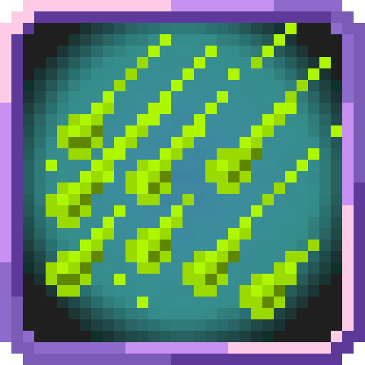
<figcaption>Source media</figcaption>
</figure>

<h2>Acid Rain</h2>

Summon an acidic cloud which will corrode any afflicted entities

Open reference →

</a>
</article>
<article class="reference-card" data-letter="A" data-search="acid shell create a ball of acid that corrodes the target">
<a href="acid-shell/" aria-label="Open Acid Shell">
<figure class="reference-card-media reference-card-media--source">
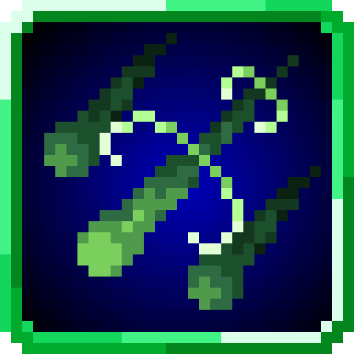
<figcaption>Source media</figcaption>
</figure>

<h2>Acid Shell</h2>

Create a ball of acid that corrodes the target

Open reference →

</a>
</article>
<article class="reference-card" data-letter="A" data-search="aerial blade pull in any nearby entities before dealing massive damage by unleashing the power of your spirit">
<a href="aerial-blade/" aria-label="Open Aerial Blade">
<figure class="reference-card-media reference-card-media--source">
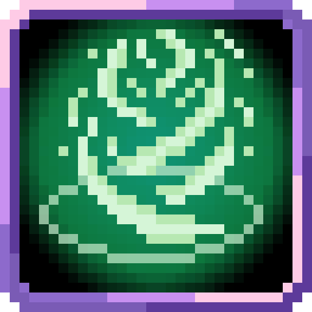
<figcaption>Source media</figcaption>
</figure>

<h2>Aerial Blade</h2>

Pull in any nearby entities before dealing massive damage by unleashing the power of your spirit

Open reference →

</a>
</article>
<article class="reference-card" data-letter="A" data-search="agility greatly increase your agility and speed using magic">
<a href="agility/" aria-label="Open Agility">
<figure class="reference-card-media reference-card-media--source">
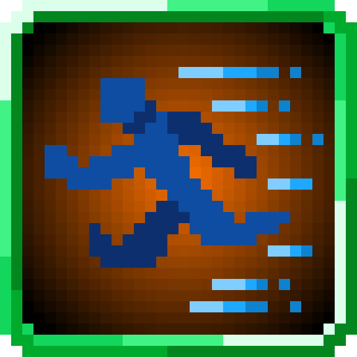
<figcaption>Source media</figcaption>
</figure>

<h2>Agility</h2>

Greatly increase your agility and speed using magic

Open reference →

</a>
</article>
<article class="reference-card" data-letter="A" data-search="airflow shut silence the target making them unable to cast magic verbally">
<a href="airflow-shut/" aria-label="Open Airflow Shut">
<figure class="reference-card-media reference-card-media--source">
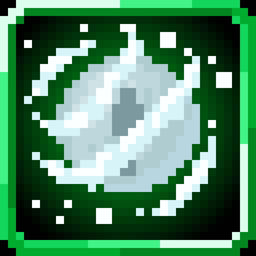
<figcaption>Source media</figcaption>
</figure>

<h2>Airflow Shut</h2>

Silence the target making them unable to cast magic verbally

Open reference →

</a>
</article>
<article class="reference-card" data-letter="A" data-search="analyze hmmm, hmmmmmmmhmhmhmhmmm, certainly an analysis we are having here.">
<a href="analyze/" aria-label="Open Analyze">
<figure class="reference-card-media reference-card-media--source">
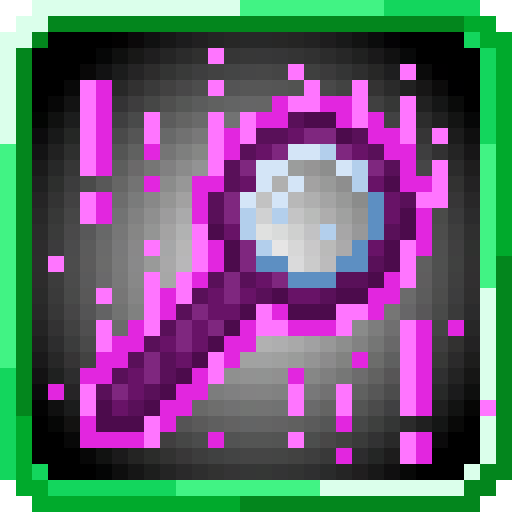
<figcaption>Source media</figcaption>
</figure>

<h2>Analyze</h2>

Hmmm, hmmmmmmmhmhmhmhmmm, certainly an analysis we are having here.

Open reference →

</a>
</article>
<article class="reference-card" data-letter="A" data-search="anti-magic area completely stop anyone inside the area to use aspectual or summoning magic, with the sole exception of satoru go- cough people with law manipulation">
<a href="anti-magic-area/" aria-label="Open Anti-Magic Area">
<figure class="reference-card-media reference-card-media--source">
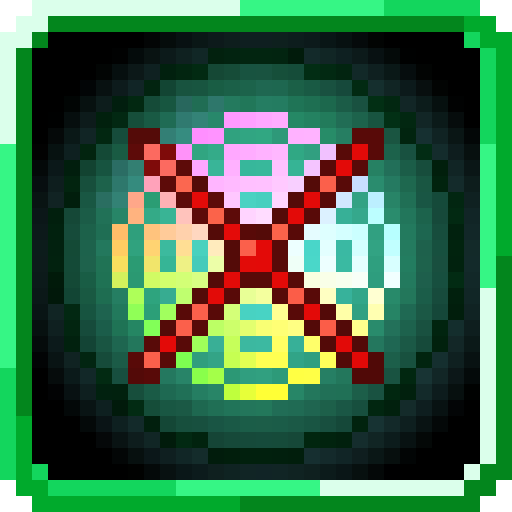
<figcaption>Source media</figcaption>
</figure>

<h2>Anti-Magic Area</h2>

Completely stop anyone inside the area to use aspectual or summoning magic, with the sole exception of Satoru Go- cough people with Law Manipulation

Open reference →

</a>
</article>
<article class="reference-card" data-letter="A" data-search="anti-magic mask to craft the anti-magic mask, one must have used a anti-magic mask schematic . to craft, you need a smithing bench .">
<a href="anti-magic-mask/" aria-label="Open Anti-Magic Mask">
<figure class="reference-card-media reference-card-media--source">

<figcaption>Source media</figcaption>
</figure>

<h2>Anti-Magic Mask</h2>

To craft the Anti-Magic Mask, one must have used a Anti-Magic Mask Schematic . To craft, you need a Smithing Bench .

Open reference →

</a>
</article>
<article class="reference-card" data-letter="A" data-search="anti-magic mask schematic obtained by defeating shizu">
<a href="items-schematics-anti-magic-mask-schematic/" aria-label="Open Anti-Magic Mask Schematic">
<figure class="reference-card-media reference-card-media--source">

<figcaption>Source media</figcaption>
</figure>

<h2>Anti-Magic Mask Schematic</h2>

Obtained by defeating Shizu

Open reference →

</a>
</article>
<article class="reference-card" data-letter="A" data-search="anti-shock area domain expansion: pillow fist arena">
<a href="anti-shock-area/" aria-label="Open Anti-Shock Area">
<figure class="reference-card-media reference-card-media--source">
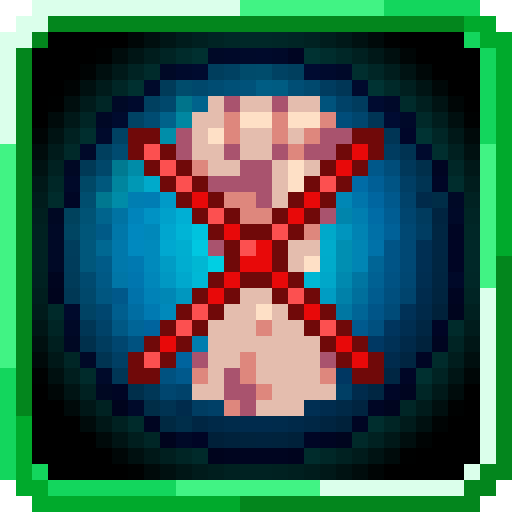
<figcaption>Source media</figcaption>
</figure>

<h2>Anti-Shock Area</h2>

Domain Expansion: Pillow Fist Arena

Open reference →

</a>
</article>
<article class="reference-card" data-letter="A" data-search="antidote heal the user from any weak abnormal effects that could be affecting it">
<a href="antidote/" aria-label="Open Antidote">
<figure class="reference-card-media reference-card-media--source">
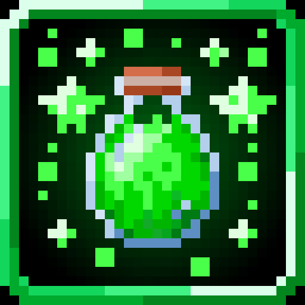
<figcaption>Source media</figcaption>
</figure>

<h2>Antidote</h2>

Heal the user from any weak abnormal effects that could be affecting it

Open reference →

</a>
</article>
<article class="reference-card" data-letter="B" data-search="barrier create a barrier over yourself protecting from physical attacks">
<a href="barrier/" aria-label="Open Barrier">
<figure class="reference-card-media reference-card-media--source">

<figcaption>Source media</figcaption>
</figure>

<h2>Barrier</h2>

Create a barrier over yourself protecting from physical attacks

Open reference →

</a>
</article>
<article class="reference-card" data-letter="B" data-search="blizzard creates a powerful storm of ice to slow your enemies and turn the tides of battle">
<a href="blizzard/" aria-label="Open Blizzard">
<figure class="reference-card-media reference-card-media--source">
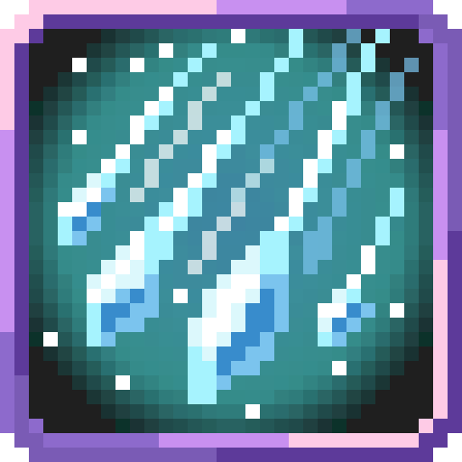
<figcaption>Source media</figcaption>
</figure>

<h2>Blizzard</h2>

Creates a powerful storm of ice to slow your enemies and turn the tides of battle

Open reference →

</a>
</article>
<article class="reference-card" data-letter="B" data-search="burden increases the weight of the objective (don&#x27;t use it on caseoh pls)">
<a href="burden/" aria-label="Open Burden">
<figure class="reference-card-media reference-card-media--source">
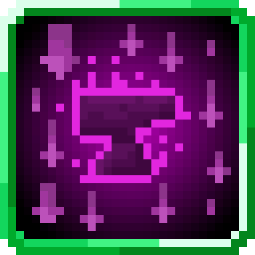
<figcaption>Source media</figcaption>
</figure>

<h2>Burden</h2>

Increases the weight of the objective (Don&#x27;t use it on Caseoh pls)

Open reference →

</a>
</article>
<article class="reference-card" data-letter="C" data-search="chain explosion prepare for trouble and make it double! wait no triple!?">
<a href="chain-explosion/" aria-label="Open Chain Explosion">
<figure class="reference-card-media reference-card-media--source">
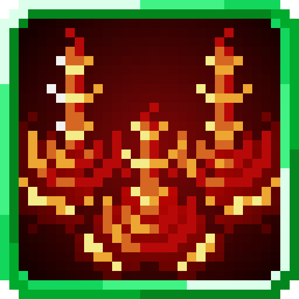
<figcaption>Source media</figcaption>
</figure>

<h2>Chain Explosion</h2>

Prepare for trouble and make it double! wait no triple!?

Open reference →

</a>
</article>
<article class="reference-card" data-letter="C" data-search="clairvoyance huh? clair obscur magic??? oh, its a better telescope, that&#x27;s cool too i guess...">
<a href="clairvoyance/" aria-label="Open Clairvoyance">
<figure class="reference-card-media reference-card-media--source">
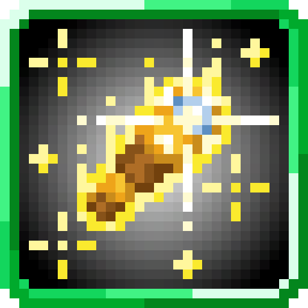
<figcaption>Source media</figcaption>
</figure>

<h2>Clairvoyance</h2>

Huh? Clair Obscur magic??? Oh, its a better telescope, that&#x27;s cool too i guess...

Open reference →

</a>
</article>
<article class="reference-card" data-letter="C" data-search="confusion confuse the target using magic illusions">
<a href="confusion/" aria-label="Open Confusion">
<figure class="reference-card-media reference-card-media--source">
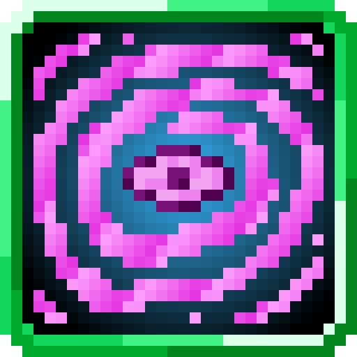
<figcaption>Source media</figcaption>
</figure>

<h2>Confusion</h2>

Confuse the target using magic illusions

Open reference →

</a>
</article>
<article class="reference-card" data-letter="C" data-search="create greater undead create a strong undead using the spirits of the dead">
<a href="create-greater-undead/" aria-label="Open Create Greater Undead">
<figure class="reference-card-media reference-card-media--source">
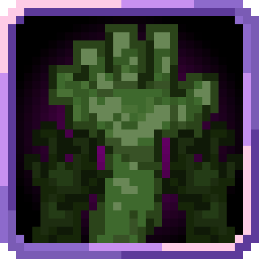
<figcaption>Source media</figcaption>
</figure>

<h2>Create Greater Undead</h2>

Create a strong undead using the spirits of the dead

Open reference →

</a>
</article>
<article class="reference-card" data-letter="C" data-search="create lesser undead create a weak undead using the spirits of the dead">
<a href="create-lesser-undead/" aria-label="Open Create Lesser Undead">
<figure class="reference-card-media reference-card-media--source">
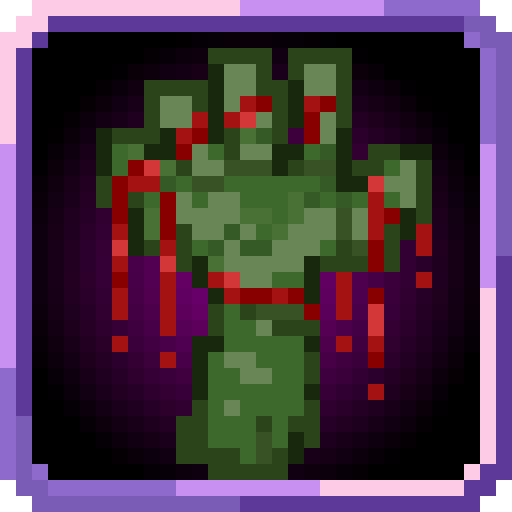
<figcaption>Source media</figcaption>
</figure>

<h2>Create Lesser Undead</h2>

Create a weak undead using the spirits of the dead

Open reference →

</a>
</article>
<article class="reference-card" data-letter="C" data-search="curse command the spirits of the dead to curse the target">
<a href="curse/" aria-label="Open Curse">
<figure class="reference-card-media reference-card-media--source">
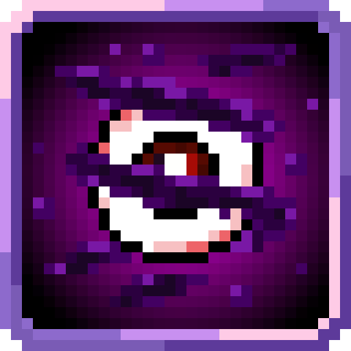
<figcaption>Source media</figcaption>
</figure>

<h2>Curse</h2>

Command the spirits of the dead to curse the target

Open reference →

</a>
</article>
<article class="reference-card" data-letter="C" data-search="curse bind bind the target using death spirits">
<a href="curse-bind/" aria-label="Open Curse Bind">
<figure class="reference-card-media reference-card-media--source">
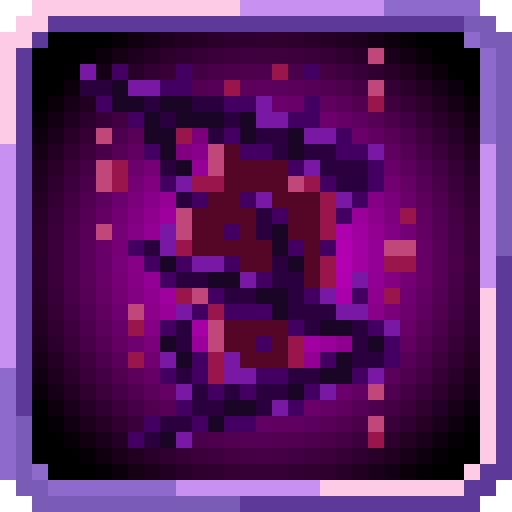
<figcaption>Source media</figcaption>
</figure>

<h2>Curse Bind</h2>

Bind the target using death spirits

Open reference →

</a>
</article>
<article class="reference-card" data-letter="D" data-search="dark cube create a cube of darkness that slows movement and deals constant damage">
<a href="dark-cube/" aria-label="Open Dark Cube">
<figure class="reference-card-media reference-card-media--source">
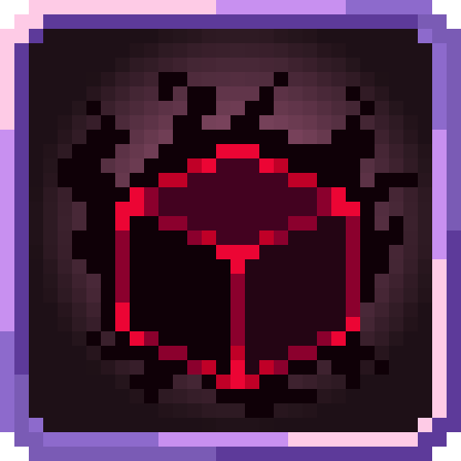
<figcaption>Source media</figcaption>
</figure>

<h2>Dark Cube</h2>

Create a cube of darkness that slows movement and deals constant damage

Open reference →

</a>
</article>
<article class="reference-card" data-letter="D" data-search="darkness call on your spirit to reduce the enemy&#x27;s vision in a wide area.">
<a href="darkness/" aria-label="Open Darkness">
<figure class="reference-card-media reference-card-media--source">
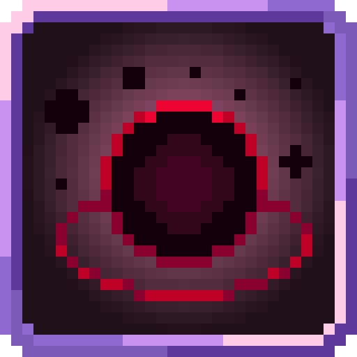
<figcaption>Source media</figcaption>
</figure>

<h2>Darkness</h2>

Call on your spirit to reduce the enemy&#x27;s vision in a wide area.

Open reference →

</a>
</article>
<article class="reference-card" data-letter="D" data-search="darkness cannon shoot a long beam which deals massive damage, destroys armor and debilitates enemies">
<a href="darkness-cannon/" aria-label="Open Darkness Cannon">
<figure class="reference-card-media reference-card-media--source">
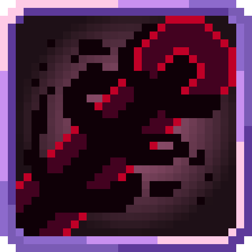
<figcaption>Source media</figcaption>
</figure>

<h2>Darkness Cannon</h2>

Shoot a long beam which deals massive damage, destroys Armor and debilitates enemies

Open reference →

</a>
</article>
<article class="reference-card" data-letter="D" data-search="demon dominate dominate strong targets using magic and put them under your control">
<a href="demon-dominate/" aria-label="Open Demon Dominate">
<figure class="reference-card-media reference-card-media--source">
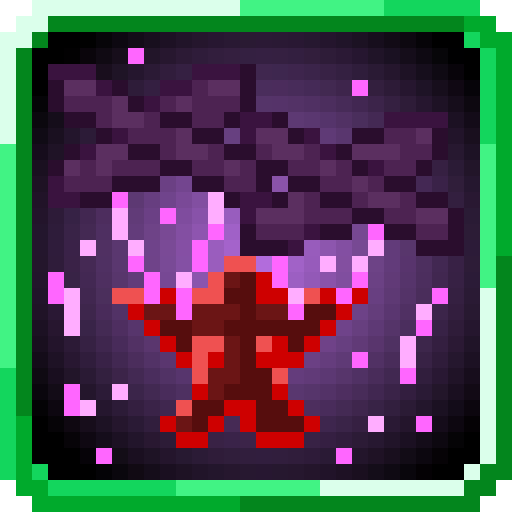
<figcaption>Source media</figcaption>
</figure>

<h2>Demon Dominate</h2>

Dominate strong targets using magic and put them under your control

Open reference →

</a>
</article>
<article class="reference-card" data-letter="D" data-search="demon marionette completely dominate foes strong enough to be considered demon lord seeds and put them under your control">
<a href="demon-marionette/" aria-label="Open Demon Marionette">
<figure class="reference-card-media reference-card-media--source">
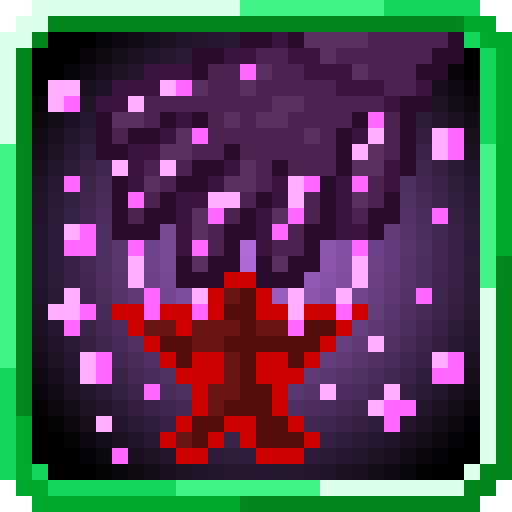
<figcaption>Source media</figcaption>
</figure>

<h2>Demon Marionette</h2>

Completely dominate foes strong enough to be considered demon lord seeds and put them under your control

Open reference →

</a>
</article>
<article class="reference-card" data-letter="D" data-search="dimensional cutter why does this make want to scream &quot;yamimatoi: jigengiri&quot;?">
<a href="dimensional-cutter/" aria-label="Open Dimensional Cutter">
<figure class="reference-card-media reference-card-media--source">
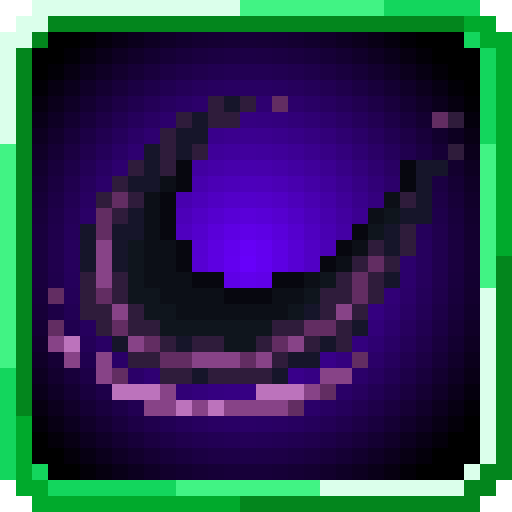
<figcaption>Source media</figcaption>
</figure>

<h2>Dimensional Cutter</h2>

Why does this make want to scream &quot;Yamimatoi: Jigengiri&quot;?

Open reference →

</a>
</article>
<article class="reference-card" data-letter="D" data-search="dominate put weak targets under your control">
<a href="dominate/" aria-label="Open Dominate">
<figure class="reference-card-media reference-card-media--source">
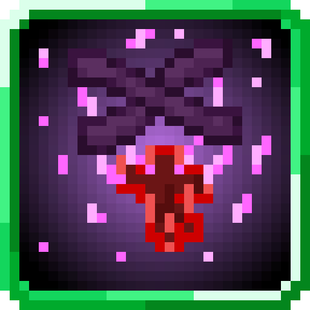
<figcaption>Source media</figcaption>
</figure>

<h2>Dominate</h2>

Put weak targets under your control

Open reference →

</a>
</article>
<article class="reference-card" data-letter="D" data-search="doppelganger everyone wants someone that can understand them, so why not two of yourself?">
<a href="doppelganger/" aria-label="Open Doppelganger">
<figure class="reference-card-media reference-card-media--source">
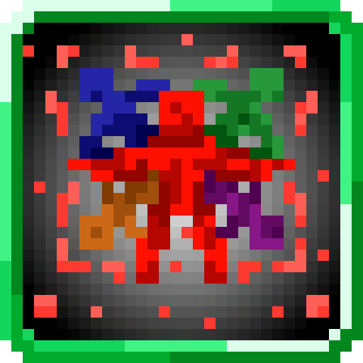
<figcaption>Source media</figcaption>
</figure>

<h2>Doppelganger</h2>

Everyone wants someone that can understand them, so why not two of yourself?

Open reference →

</a>
</article>
<article class="reference-card" data-letter="D" data-search="drainage drain water around you">
<a href="drainage/" aria-label="Open Drainage">
<figure class="reference-card-media reference-card-media--source">
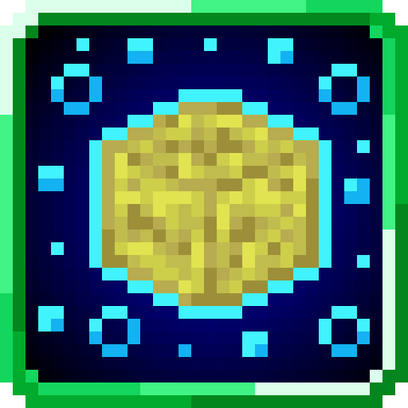
<figcaption>Source media</figcaption>
</figure>

<h2>Drainage</h2>

Drain water around you

Open reference →

</a>
</article>
<article class="reference-card" data-letter="E" data-search="earth place down blocks which mimic those from the surrounding environment">
<a href="earth/" aria-label="Open Earth">
<figure class="reference-card-media reference-card-media--source">
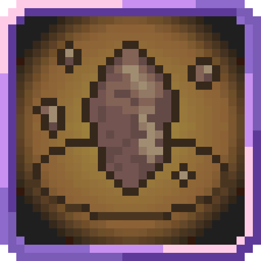
<figcaption>Source media</figcaption>
</figure>

<h2>Earth</h2>

Place down blocks which mimic those from the surrounding environment

Open reference →

</a>
</article>
<article class="reference-card" data-letter="E" data-search="earth jail restrict and weaken a single target, applying debuffs to allow you to finish them off">
<a href="earth-jail/" aria-label="Open Earth Jail">
<figure class="reference-card-media reference-card-media--source">
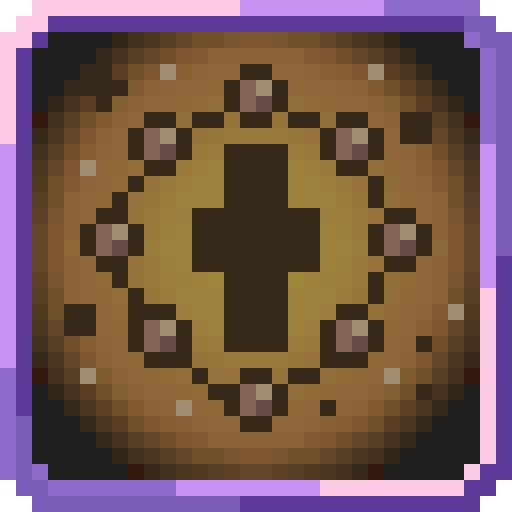
<figcaption>Source media</figcaption>
</figure>

<h2>Earth Jail</h2>

Restrict and weaken a single target, applying debuffs to allow you to finish them off

Open reference →

</a>
</article>
<article class="reference-card" data-letter="E" data-search="earth lock lock loose blocks turning them solid again">
<a href="earth-lock/" aria-label="Open Earth Lock">
<figure class="reference-card-media reference-card-media--source">
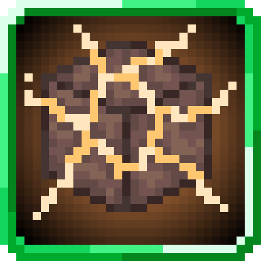
<figcaption>Source media</figcaption>
</figure>

<h2>Earth Lock</h2>

Lock loose blocks turning them solid again

Open reference →

</a>
</article>
<article class="reference-card" data-letter="E" data-search="earth spikes raises a spike under your opponent launching them into the air.">
<a href="earth-spikes/" aria-label="Open Earth Spikes">
<figure class="reference-card-media reference-card-media--source">
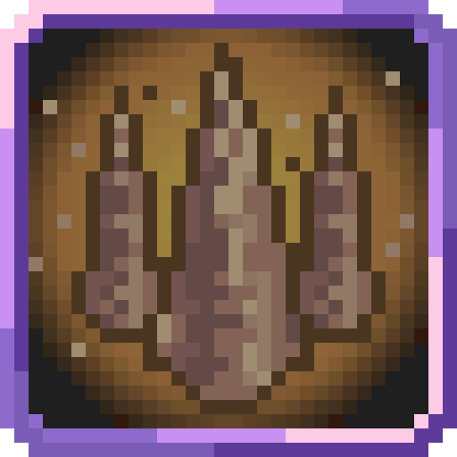
<figcaption>Source media</figcaption>
</figure>

<h2>Earth Spikes</h2>

Raises a spike under your opponent launching them into the air.

Open reference →

</a>
</article>
<article class="reference-card" data-letter="E" data-search="earth storm summons a viscous sandstorm and falling rocks around you">
<a href="earth-storm/" aria-label="Open Earth Storm">
<figure class="reference-card-media reference-card-media--source">
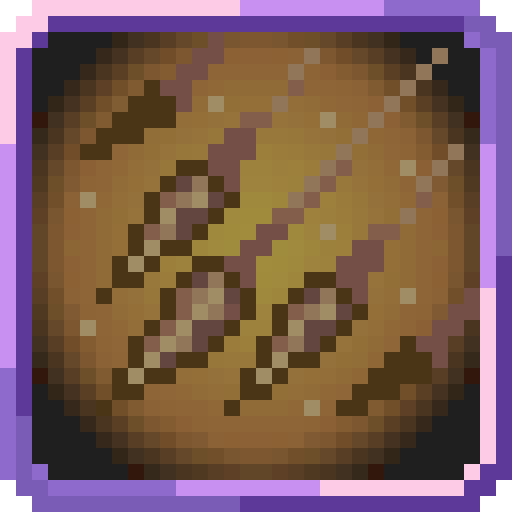
<figcaption>Source media</figcaption>
</figure>

<h2>Earth Storm</h2>

Summons a viscous sandstorm and falling rocks around you

Open reference →

</a>
</article>
<article class="reference-card" data-letter="E" data-search="earth wall rise a wall from the ground to protect the caster">
<a href="earth-wall/" aria-label="Open Earth Wall">
<figure class="reference-card-media reference-card-media--source">
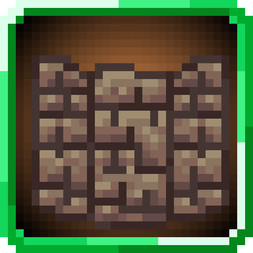
<figcaption>Source media</figcaption>
</figure>

<h2>Earth Wall</h2>

Rise a wall from the ground to protect the caster

Open reference →

</a>
</article>
<article class="reference-card" data-letter="E" data-search="electro blast fire a beam attack that pierces through enemies and deals devastating damage while paralyzing your enemies">
<a href="electro-blast/" aria-label="Open Electro Blast">
<figure class="reference-card-media reference-card-media--source">
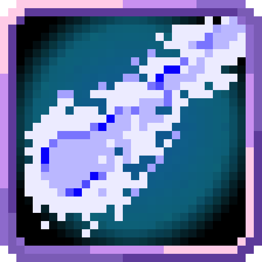
<figcaption>Source media</figcaption>
</figure>

<h2>Electro Blast</h2>

Fire a beam attack that pierces through enemies and deals devastating damage while paralyzing your enemies

Open reference →

</a>
</article>
<article class="reference-card" data-letter="E" data-search="escape allows you to create a kind of checkpoint to which you can return">
<a href="escape/" aria-label="Open Escape">
<figure class="reference-card-media reference-card-media--source">
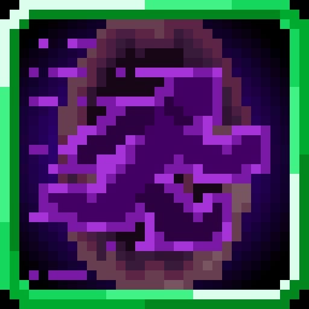
<figcaption>Source media</figcaption>
</figure>

<h2>Escape</h2>

Allows you to create a kind of checkpoint to which you can return

Open reference →

</a>
</article>
<article class="reference-card" data-letter="E" data-search="explosion darker than black, darker than darkness, combine with my intense crimson! the time of awakening has come... dance, dance, dance! desire for the surge of my magic, the…">
<a href="explosion/" aria-label="Open Explosion">
<figure class="reference-card-media reference-card-media--source">
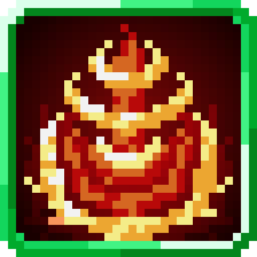
<figcaption>Source media</figcaption>
</figure>

<h2>Explosion</h2>

Darker than black, darker than darkness, combine with my intense crimson! The time of awakening has come... Dance, dance, dance! Desire for the surge of my magic, the…

Open reference →

</a>
</article>
<article class="reference-card" data-letter="F" data-search="fire (aspectual) throw a small fire bolt at the enemy">
<a href="fire-aspectual/" aria-label="Open Fire (Aspectual)">
<figure class="reference-card-media reference-card-media--source">
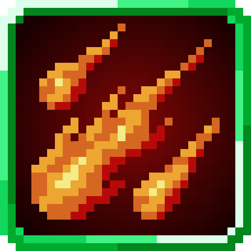
<figcaption>Source media</figcaption>
</figure>

<h2>Fire (Aspectual)</h2>

Throw a small fire bolt at the enemy

Open reference →

</a>
</article>
<article class="reference-card" data-letter="F" data-search="fire (spiritual) use your spirit to start a small fire">
<a href="fire-spiritual/" aria-label="Open Fire (Spiritual)">
<figure class="reference-card-media reference-card-media--source">
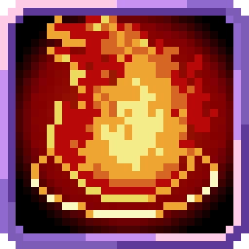
<figcaption>Source media</figcaption>
</figure>

<h2>Fire (Spiritual)</h2>

Use your spirit to start a small fire

Open reference →

</a>
</article>
<article class="reference-card" data-letter="F" data-search="fire ball did i ask for the size of the room? fire ball!!!!!!!">
<a href="fire-ball/" aria-label="Open Fire Ball">
<figure class="reference-card-media reference-card-media--source">
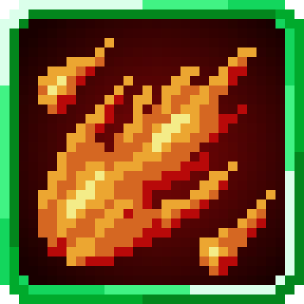
<figcaption>Source media</figcaption>
</figure>

<h2>Fire Ball</h2>

Did I ask for the size of the room? FIRE BALL!!!!!!!

Open reference →

</a>
</article>
<article class="reference-card" data-letter="F" data-search="fire bolt shoots a flaming bolt">
<a href="abilities-magics-fire-bolt/" aria-label="Open Fire Bolt">
<figure class="reference-card-media reference-card-media--source">
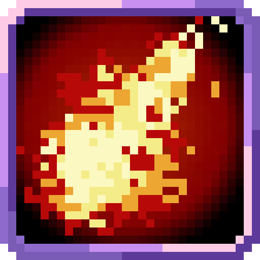
<figcaption>Source media</figcaption>
</figure>

<h2>Fire Bolt</h2>

Shoots a flaming bolt

Open reference →

</a>
</article>
<article class="reference-card" data-letter="F" data-search="fire breath breathe flames and incinerate your enemies">
<a href="fire-breath/" aria-label="Open Fire Breath">
<figure class="reference-card-media reference-card-media--source">
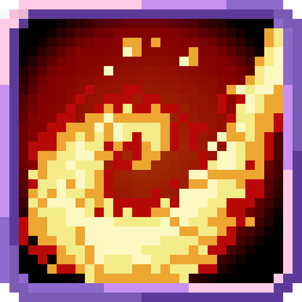
<figcaption>Source media</figcaption>
</figure>

<h2>Fire Breath</h2>

Breathe flames and incinerate your enemies

Open reference →

</a>
</article>
<article class="reference-card" data-letter="F" data-search="fire lance throw a lance made of flames at your enemy">
<a href="fire-lance/" aria-label="Open Fire Lance">
<figure class="reference-card-media reference-card-media--source">
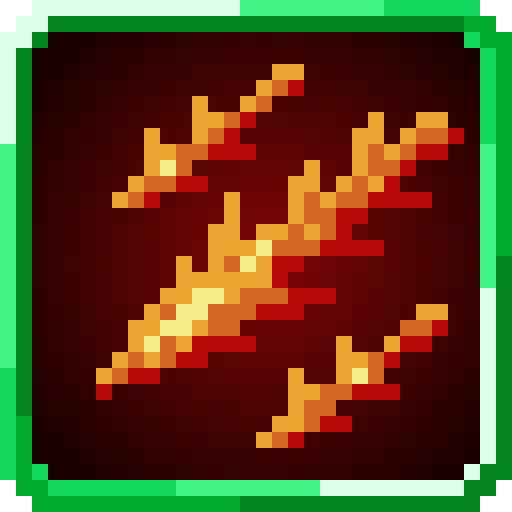
<figcaption>Source media</figcaption>
</figure>

<h2>Fire Lance</h2>

Throw a lance made of flames at your enemy

Open reference →

</a>
</article>
<article class="reference-card" data-letter="F" data-search="fire storm the storm...? is it approaching...?">
<a href="fire-storm/" aria-label="Open Fire Storm">
<figure class="reference-card-media reference-card-media--source">
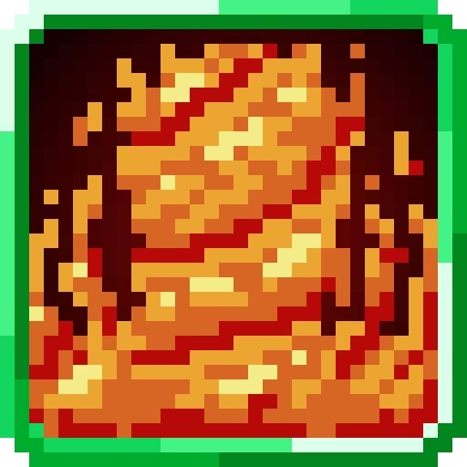
<figcaption>Source media</figcaption>
</figure>

<h2>Fire Storm</h2>

The storm...? is it approaching...?

Open reference →

</a>
</article>
<article class="reference-card" data-letter="F" data-search="fire wall creates a wall that burns whoever goes through">
<a href="fire-wall/" aria-label="Open Fire Wall">
<figure class="reference-card-media reference-card-media--source">
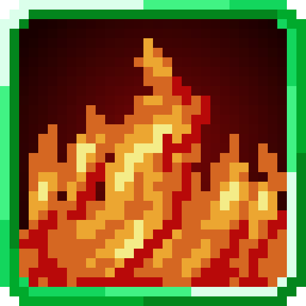
<figcaption>Source media</figcaption>
</figure>

<h2>Fire Wall</h2>

Creates a wall that burns whoever goes through

Open reference →

</a>
</article>
<article class="reference-card" data-letter="F" data-search="flame wall use illusions to cast a wall of blue flames">
<a href="flame-wall/" aria-label="Open Flame Wall">
<figure class="reference-card-media reference-card-media--source">
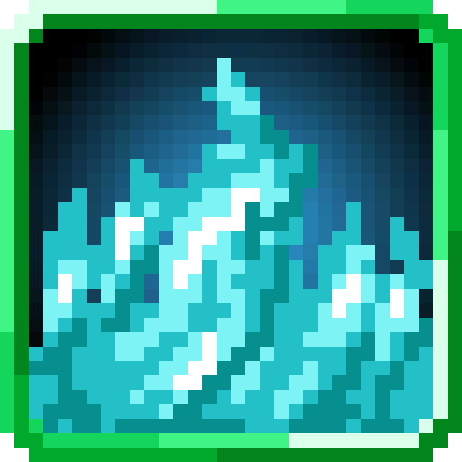
<figcaption>Source media</figcaption>
</figure>

<h2>Flame Wall</h2>

Use illusions to cast a wall of blue flames

Open reference →

</a>
</article>
<article class="reference-card" data-letter="F" data-search="flare circle opens a gate to hell from which wicked flames erupt to turn your enemies to ash">
<a href="abilities-magics-flare-circle/" aria-label="Open Flare Circle">
<figure class="reference-card-media reference-card-media--source">
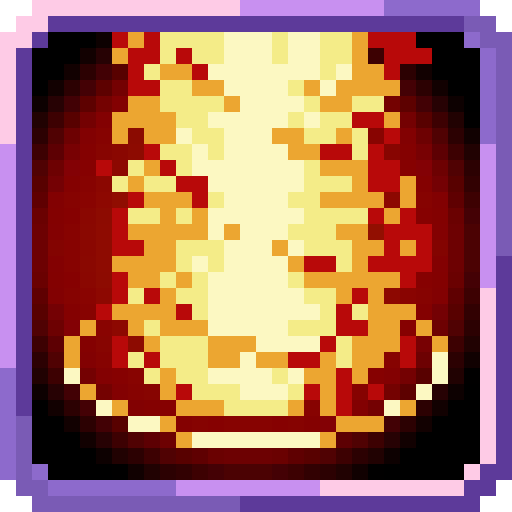
<figcaption>Source media</figcaption>
</figure>

<h2>Flare Circle</h2>

Opens a Gate to Hell from which wicked flames erupt to turn your enemies to ash

Open reference →

</a>
</article>
<article class="reference-card" data-letter="F" data-search="flight why do birds fly? because they have this magic duhhh!">
<a href="flight/" aria-label="Open Flight">
<figure class="reference-card-media reference-card-media--source">
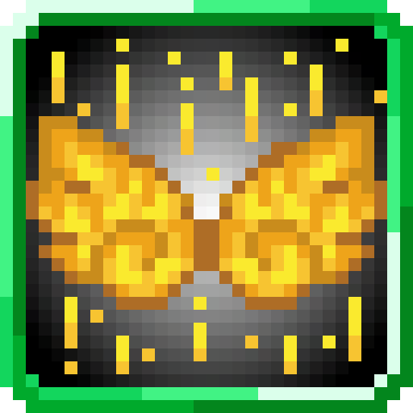
<figcaption>Source media</figcaption>
</figure>

<h2>Flight</h2>

Why do birds fly? Because they have this magic duhhh!

Open reference →

</a>
</article>
<article class="reference-card" data-letter="F" data-search="float gee i wonder what could this possibly do...?">
<a href="float/" aria-label="Open Float">
<figure class="reference-card-media reference-card-media--source">
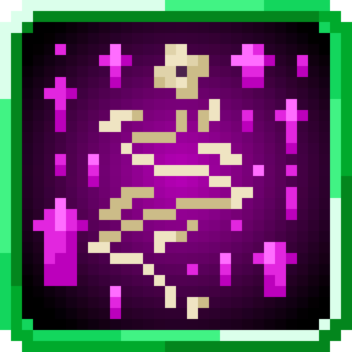
<figcaption>Source media</figcaption>
</figure>

<h2>Float</h2>

Gee I wonder what could this possibly do...?

Open reference →

</a>
</article>
<article class="reference-card" data-letter="F" data-search="freeze freeze all liquid around you">
<a href="freeze/" aria-label="Open Freeze">
<figure class="reference-card-media reference-card-media--source">
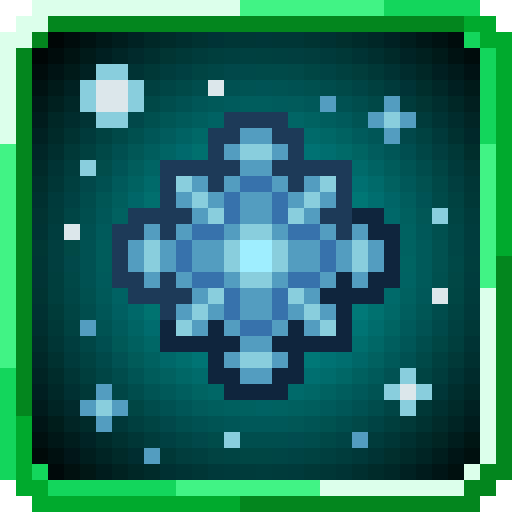
<figcaption>Source media</figcaption>
</figure>

<h2>Freeze</h2>

Freeze all liquid around you

Open reference →

</a>
</article>
<article class="reference-card" data-letter="F" data-search="full recovery just as new, could say you are fully recovered">
<a href="full-recovery/" aria-label="Open Full Recovery">
<figure class="reference-card-media reference-card-media--source">
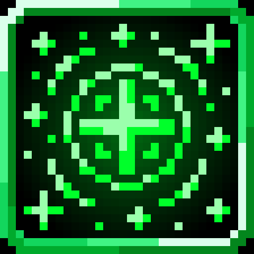
<figcaption>Source media</figcaption>
</figure>

<h2>Full Recovery</h2>

Just as new, could say you are fully recovered

Open reference →

</a>
</article>
<article class="reference-card" data-letter="G" data-search="gate tear space asunder connecting two points in space">
<a href="gate/" aria-label="Open Gate">
<figure class="reference-card-media reference-card-media--source">
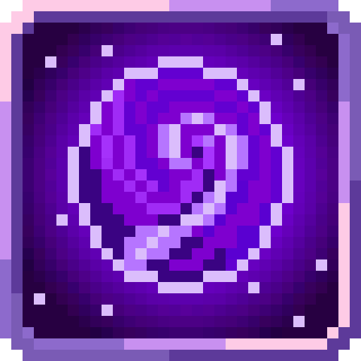
<figcaption>Source media</figcaption>
</figure>

<h2>Gate</h2>

Tear space asunder connecting two points in space

Open reference →

</a>
</article>
<article class="reference-card" data-letter="H" data-search="healing i had to redo the page about healing so many times, but anyways free healing :d">
<a href="healing/" aria-label="Open Healing">
<figure class="reference-card-media reference-card-media--source">
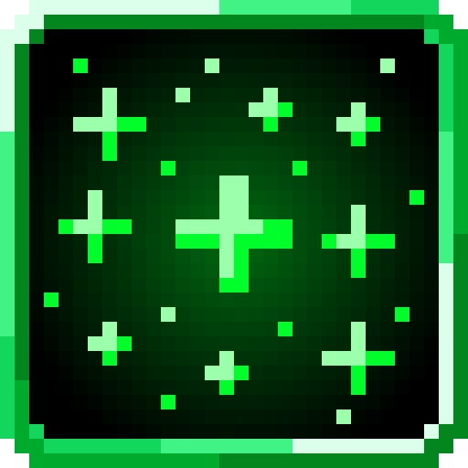
<figcaption>Source media</figcaption>
</figure>

<h2>Healing</h2>

I had to redo the page about healing so many times, but anyways free healing :D

Open reference →

</a>
</article>
<article class="reference-card" data-letter="H" data-search="healing rain heal everyone in the battlefield by making healing droplets rain">
<a href="healing-rain/" aria-label="Open Healing Rain">
<figure class="reference-card-media reference-card-media--source">
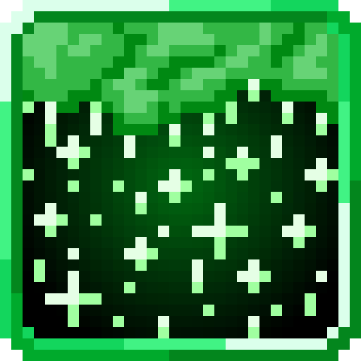
<figcaption>Source media</figcaption>
</figure>

<h2>Healing Rain</h2>

Heal everyone in the battlefield by making healing droplets rain

Open reference →

</a>
</article>
<article class="reference-card" data-letter="H" data-search="healthcare take care of yourself, you non bathing wiki goer!">
<a href="healthcare/" aria-label="Open Healthcare">
<figure class="reference-card-media reference-card-media--source">
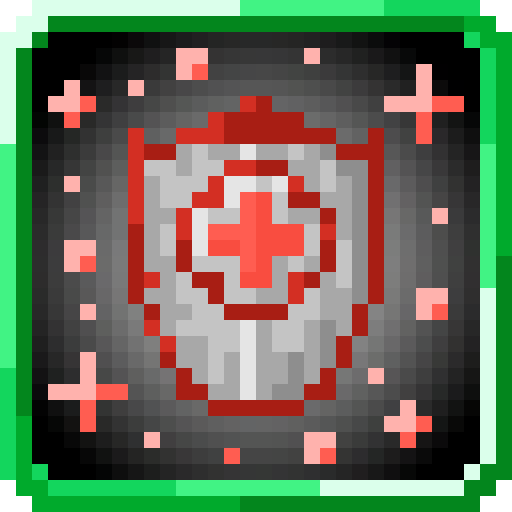
<figcaption>Source media</figcaption>
</figure>

<h2>Healthcare</h2>

Take care of yourself, you non bathing wiki goer!

Open reference →

</a>
</article>
<article class="reference-card" data-letter="H" data-search="hellfire summon a sphere of hellfire to deal massive damage in a small area">
<a href="abilities-magics-hellfire/" aria-label="Open Hellfire">
<figure class="reference-card-media reference-card-media--source">
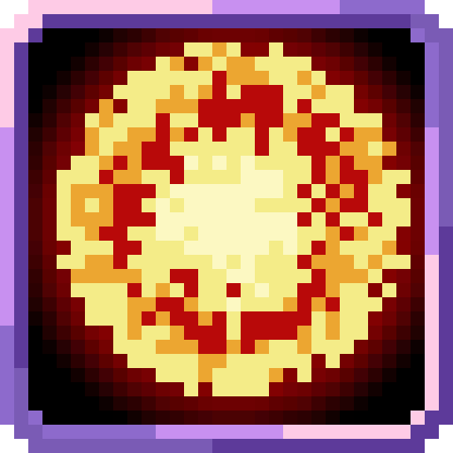
<figcaption>Source media</figcaption>
</figure>

<h2>Hellfire</h2>

Summon a sphere of hellfire to deal massive damage in a small area

Open reference →

</a>
</article>
<article class="reference-card" data-letter="H" data-search="high quality magic crystal a high quality magic crystal">
<a href="high-quality-magic-crystal/" aria-label="Open High Quality Magic Crystal">
<figure class="reference-card-media reference-card-media--source">
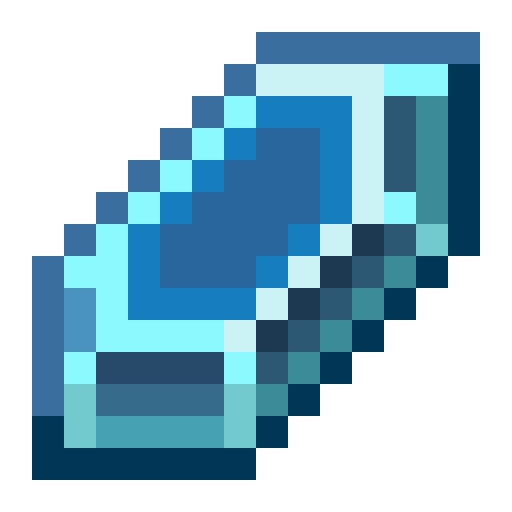
<figcaption>Source media</figcaption>
</figure>

<h2>High Quality Magic Crystal</h2>

A High Quality Magic Crystal

Open reference →

</a>
</article>
<article class="reference-card" data-letter="H" data-search="hypnos puts the target into a deep slumber">
<a href="hypnos/" aria-label="Open Hypnos">
<figure class="reference-card-media reference-card-media--source">
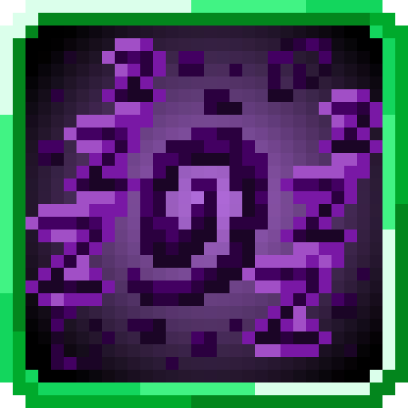
<figcaption>Source media</figcaption>
</figure>

<h2>Hypnos</h2>

Puts the target into a deep slumber

Open reference →

</a>
</article>
<article class="reference-card" data-letter="I" data-search="ice blizzard using magic to create a blizzard around the user">
<a href="ice-blizzard/" aria-label="Open Ice Blizzard">
<figure class="reference-card-media reference-card-media--source">
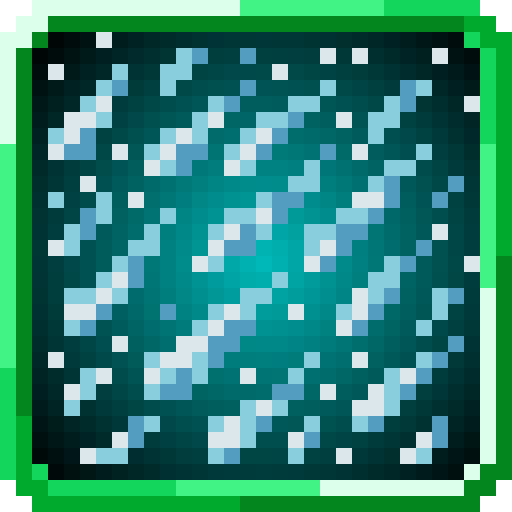
<figcaption>Source media</figcaption>
</figure>

<h2>Ice Blizzard</h2>

Using magic to create a blizzard around the user

Open reference →

</a>
</article>
<article class="reference-card" data-letter="I" data-search="ice breaker create a giant spear of ice and throw it at the target">
<a href="ice-breaker/" aria-label="Open Ice Breaker">
<figure class="reference-card-media reference-card-media--source">
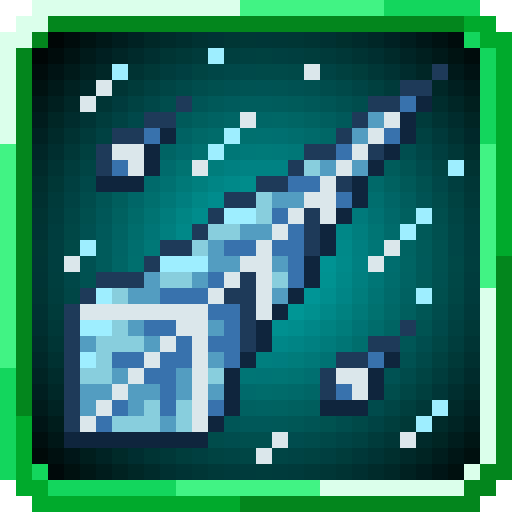
<figcaption>Source media</figcaption>
</figure>

<h2>Ice Breaker</h2>

Create a giant spear of ice and throw it at the target

Open reference →

</a>
</article>
<article class="reference-card" data-letter="I" data-search="ice wall creates a wall of ice to protect the user">
<a href="ice-wall/" aria-label="Open Ice Wall">
<figure class="reference-card-media reference-card-media--source">
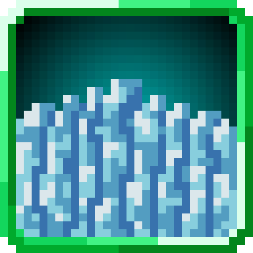
<figcaption>Source media</figcaption>
</figure>

<h2>Ice Wall</h2>

Creates a wall of ice to protect the user

Open reference →

</a>
</article>
<article class="reference-card" data-letter="I" data-search="icicle lance create a lance out of ice and throw it at the target">
<a href="icicle-lance/" aria-label="Open Icicle Lance">
<figure class="reference-card-media reference-card-media--source">
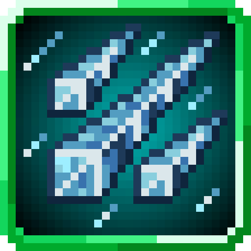
<figcaption>Source media</figcaption>
</figure>

<h2>Icicle Lance</h2>

Create a lance out of ice and throw it at the target

Open reference →

</a>
</article>
<article class="reference-card" data-letter="I" data-search="icicle rain creates multiple icicle lances in the sky and throw them at the target">
<a href="icicle-rain/" aria-label="Open Icicle Rain">
<figure class="reference-card-media reference-card-media--source">
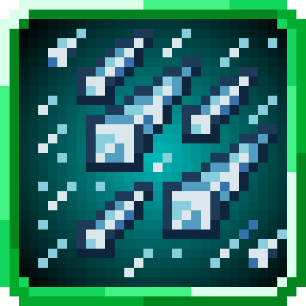
<figcaption>Source media</figcaption>
</figure>

<h2>Icicle Rain</h2>

Creates multiple icicle lances in the sky and throw them at the target

Open reference →

</a>
</article>
<article class="reference-card" data-letter="I" data-search="icicle spear create an icicle spear from the ground">
<a href="icicle-spear/" aria-label="Open Icicle Spear">
<figure class="reference-card-media reference-card-media--source">
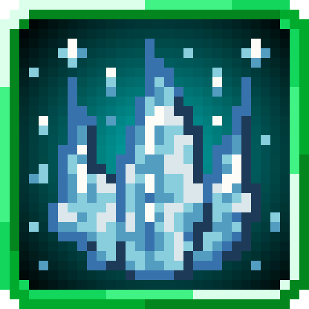
<figcaption>Source media</figcaption>
</figure>

<h2>Icicle Spear</h2>

Create an icicle spear from the ground

Open reference →

</a>
</article>
<article class="reference-card" data-letter="I" data-search="invisible make yourself transparent, being undetectable for the naked eye">
<a href="invisible/" aria-label="Open Invisible">
<figure class="reference-card-media reference-card-media--source">
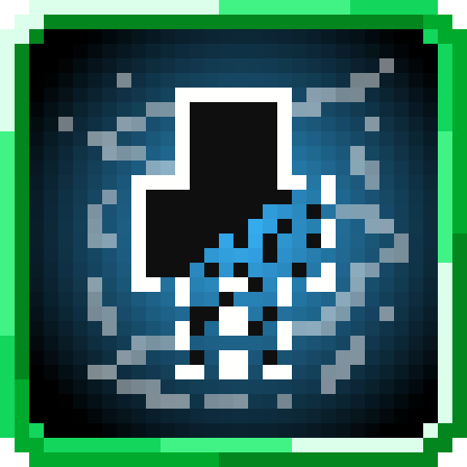
<figcaption>Source media</figcaption>
</figure>

<h2>Invisible</h2>

Make yourself transparent, being undetectable for the naked eye

Open reference →

</a>
</article>
<article class="reference-card" data-letter="L" data-search="light summons a temporary light to block out the darkness">
<a href="light/" aria-label="Open Light">
<figure class="reference-card-media reference-card-media--source">
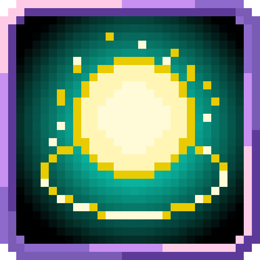
<figcaption>Source media</figcaption>
</figure>

<h2>Light</h2>

Summons a temporary light to block out the darkness

Open reference →

</a>
</article>
<article class="reference-card" data-letter="L" data-search="lighten makes the caster lighter granting jump and speed boost">
<a href="lighten/" aria-label="Open Lighten">
<figure class="reference-card-media reference-card-media--source">
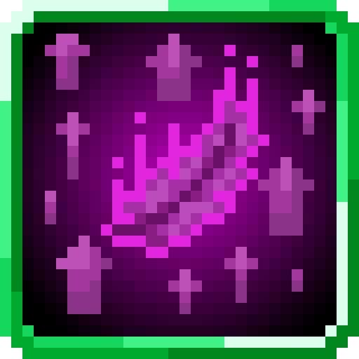
<figcaption>Source media</figcaption>
</figure>

<h2>Lighten</h2>

Makes the caster lighter granting jump and speed boost

Open reference →

</a>
</article>
<article class="reference-card" data-letter="L" data-search="lightning lance launch a lightning projectile which will electrify your enemies">
<a href="lightning-lance/" aria-label="Open Lightning Lance">
<figure class="reference-card-media reference-card-media--source">
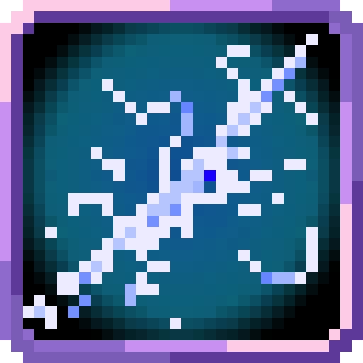
<figcaption>Source media</figcaption>
</figure>

<h2>Lightning Lance</h2>

Launch a lightning projectile which will electrify your enemies

Open reference →

</a>
</article>
<article class="reference-card" data-letter="L" data-search="liquidize turn soft solid blocks into loose versions">
<a href="liquidize/" aria-label="Open Liquidize">
<figure class="reference-card-media reference-card-media--source">
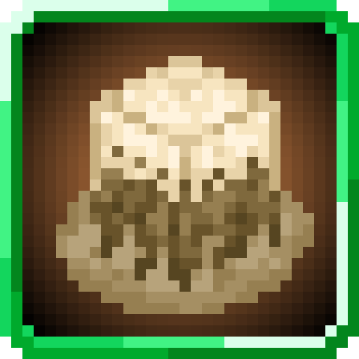
<figcaption>Source media</figcaption>
</figure>

<h2>Liquidize</h2>

Turn soft solid blocks into loose versions

Open reference →

</a>
</article>
<article class="reference-card" data-letter="L" data-search="low magic staff a low magic staff for casting magic.">
<a href="low-magic-staff/" aria-label="Open Low Magic Staff">
<figure class="reference-card-media reference-card-media--source">
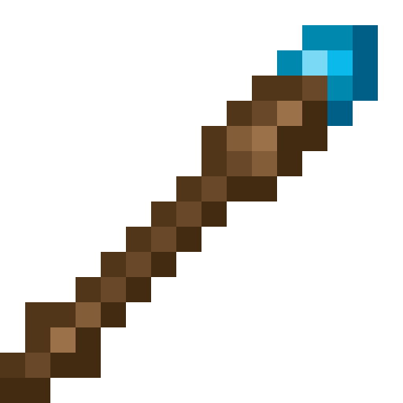
<figcaption>Source media</figcaption>
</figure>

<h2>Low Magic Staff</h2>

A low magic staff for casting magic.

Open reference →

</a>
</article>
<article class="reference-card" data-letter="L" data-search="low quality magic crystal a low quality magic crystal">
<a href="low-quality-magic-crystal/" aria-label="Open Low Quality Magic Crystal">
<figure class="reference-card-media reference-card-media--source">
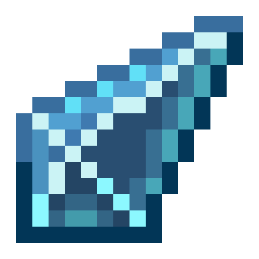
<figcaption>Source media</figcaption>
</figure>

<h2>Low Quality Magic Crystal</h2>

A Low Quality Magic Crystal

Open reference →

</a>
</article>
<article class="reference-card" data-letter="M" data-search="magic aura empower your attacks with different elemental aura">
<a href="magic-aura/" aria-label="Open Magic Aura">
<figure class="reference-card-media reference-card-media--source">
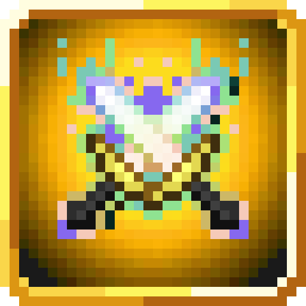
<figcaption>Source media</figcaption>
</figure>

<h2>Magic Aura</h2>

Empower your attacks with different elemental aura

Open reference →

</a>
</article>
<article class="reference-card" data-letter="M" data-search="magic barrier create a barrier over yourself protecting from magical attacks">
<a href="magic-barrier/" aria-label="Open Magic Barrier">
<figure class="reference-card-media reference-card-media--source">

<figcaption>Source media</figcaption>
</figure>

<h2>Magic Barrier</h2>

Create a barrier over yourself protecting from magical attacks

Open reference →

</a>
</article>
<article class="reference-card" data-letter="M" data-search="magic bottle right clicking on water turns the magic bottle in a magic bottle of water which in turn can be used to brew potions with hipokute (example: low potion )">
<a href="magic-bottle/" aria-label="Open Magic Bottle">
<figure class="reference-card-media reference-card-media--source">
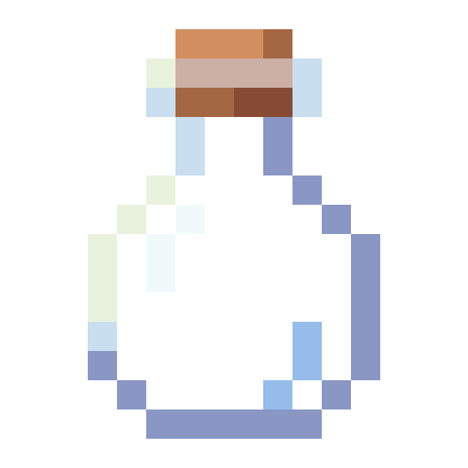
<figcaption>Source media</figcaption>
</figure>

<h2>Magic Bottle</h2>

Right clicking on water turns the Magic Bottle in a Magic Bottle of Water which in turn can be used to brew potions with hipokute (example: Low Potion )

Open reference →

</a>
</article>
<article class="reference-card" data-letter="M" data-search="magic bottle of water right clicking water with an empty magic bottle">
<a href="magic-bottle-of-water/" aria-label="Open Magic Bottle of Water">
<figure class="reference-card-media reference-card-media--source">
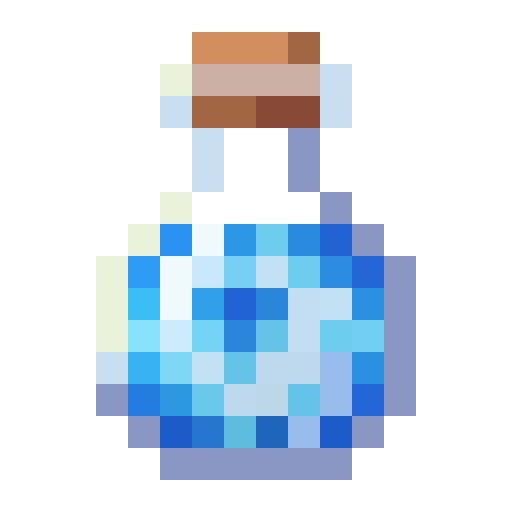
<figcaption>Source media</figcaption>
</figure>

<h2>Magic Bottle of Water</h2>

Right clicking water with an empty Magic Bottle

Open reference →

</a>
</article>
<article class="reference-card" data-letter="M" data-search="magic darkness transform gain access to the intermediate darkness spirit magic and boost your darkness attacks while buffing yourself and debuffing enemies.">
<a href="magic-darkness-transform/" aria-label="Open Magic Darkness Transform">
<figure class="reference-card-media reference-card-media--source">

<figcaption>Source media</figcaption>
</figure>

<h2>Magic Darkness Transform</h2>

Gain access to the intermediate Darkness Spirit Magic and boost your darkness attacks while buffing yourself and debuffing enemies.

Open reference →

</a>
</article>
<article class="reference-card" data-letter="M" data-search="magic earth transform gain access to the intermediate earth spirit magic and boost your earth attacks while buffing yourself and debuffing enemies.">
<a href="magic-earth-transform/" aria-label="Open Magic Earth Transform">
<figure class="reference-card-media reference-card-media--source">
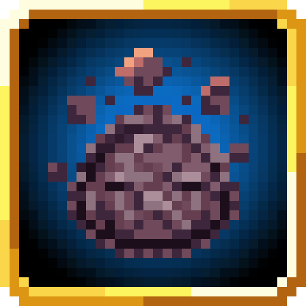
<figcaption>Source media</figcaption>
</figure>

<h2>Magic Earth Transform</h2>

Gain access to the intermediate Earth Spirit Magic and boost your earth attacks while buffing yourself and debuffing enemies.

Open reference →

</a>
</article>
<article class="reference-card" data-letter="M" data-search="magic flame transform gain access to greater flame spirit magic and boost your fire attacks while buffing yourself and debuffing enemies.">
<a href="magic-flame-transform/" aria-label="Open Magic Flame Transform">
<figure class="reference-card-media reference-card-media--source">
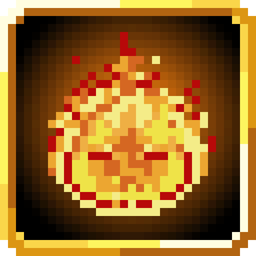
<figcaption>Source media</figcaption>
</figure>

<h2>Magic Flame Transform</h2>

Gain access to Greater Flame Spirit Magic and boost your fire attacks while buffing yourself and debuffing enemies.

Open reference →

</a>
</article>
<article class="reference-card" data-letter="M" data-search="magic jamming interferes with skills, magics, flight and transformations (with mastery)">
<a href="magic-jamming/" aria-label="Open Magic Jamming">
<figure class="reference-card-media reference-card-media--source">
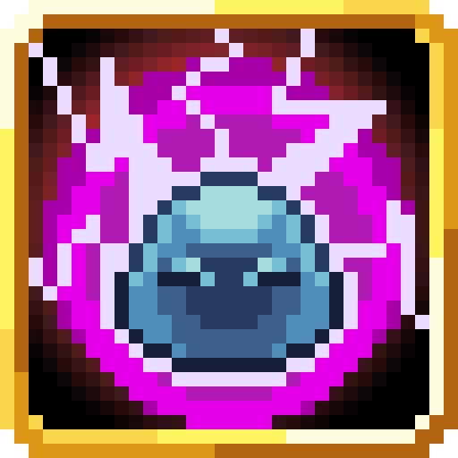
<figcaption>Source media</figcaption>
</figure>

<h2>Magic Jamming</h2>

Interferes with Skills, Magics, Flight and Transformations (with Mastery)

Open reference →

</a>
</article>
<article class="reference-card" data-letter="M" data-search="magic light transform gain access to greater light spirit magic and boost your light attacks while buffing yourself and debuffing enemies.">
<a href="magic-light-transform/" aria-label="Open Magic Light Transform">
<figure class="reference-card-media reference-card-media--source">
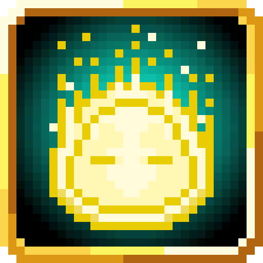
<figcaption>Source media</figcaption>
</figure>

<h2>Magic Light Transform</h2>

Gain access to Greater Light Spirit Magic and boost your light attacks while buffing yourself and debuffing enemies.

Open reference →

</a>
</article>
<article class="reference-card" data-letter="M" data-search="magic nullification !!! unobtainable without cheats !!!">
<a href="magic-nullification/" aria-label="Open Magic Nullification">
<figure class="reference-card-media reference-card-media--source">
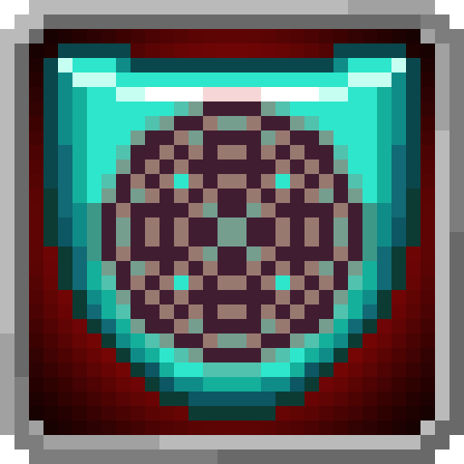
<figcaption>Source media</figcaption>
</figure>

<h2>Magic Nullification</h2>

!!! Unobtainable without cheats !!!

Open reference →

</a>
</article>
<article class="reference-card" data-letter="M" data-search="magic ore shard obtained by mining magic ore (or deepslate magic ore ) with a netherite pickaxe or by slaying a metal slime">
<a href="magic-ore-shard/" aria-label="Open Magic Ore Shard">
<figure class="reference-card-media reference-card-media--source">

<figcaption>Source media</figcaption>
</figure>

<h2>Magic Ore Shard</h2>

Obtained by mining Magic Ore (or Deepslate Magic Ore ) with a Netherite Pickaxe Or by slaying a Metal Slime

Open reference →

</a>
</article>
<article class="reference-card" data-letter="M" data-search="magic resistance magic resistance is a resistance skill in tensura: reincarnated.">
<a href="magic-resistance/" aria-label="Open Magic Resistance">
<figure class="reference-card-media reference-card-media--source">
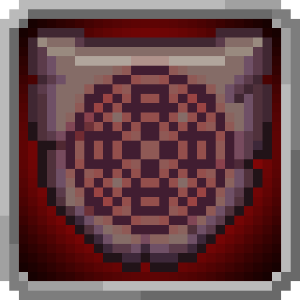
<figcaption>Source media</figcaption>
</figure>

<h2>Magic Resistance</h2>

Magic Resistance is a Resistance Skill in Tensura: Reincarnated.

Open reference →

</a>
</article>
<article class="reference-card" data-letter="M" data-search="magic sense use magicules to sense entities around you.">
<a href="magic-sense/" aria-label="Open Magic Sense">
<figure class="reference-card-media reference-card-media--source">
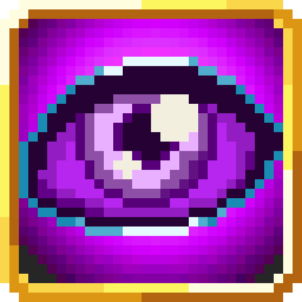
<figcaption>Source media</figcaption>
</figure>

<h2>Magic Sense</h2>

Use magicules to sense entities around you.

Open reference →

</a>
</article>
<article class="reference-card" data-letter="M" data-search="magic space transform gain access to greater space spirit magic and boost your spatial attacks while buffing yourself and debuffing enemies">
<a href="magic-space-transform/" aria-label="Open Magic Space Transform">
<figure class="reference-card-media reference-card-media--source">
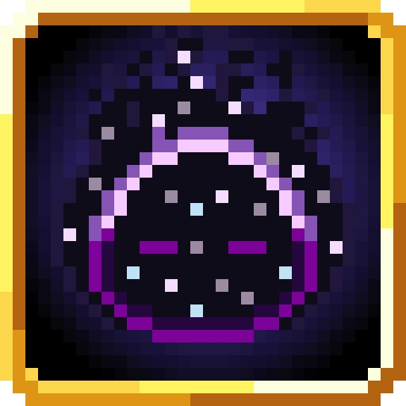
<figcaption>Source media</figcaption>
</figure>

<h2>Magic Space Transform</h2>

Gain access to Greater Space Spirit Magic and boost your spatial attacks while buffing yourself and debuffing enemies

Open reference →

</a>
</article>
<article class="reference-card" data-letter="M" data-search="magic staff schematic can be acquired from master magic trainer dwarves for 10 gold coins.">
<a href="magic-staff-schematic/" aria-label="Open Magic Staff Schematic">
<figure class="reference-card-media reference-card-media--source">
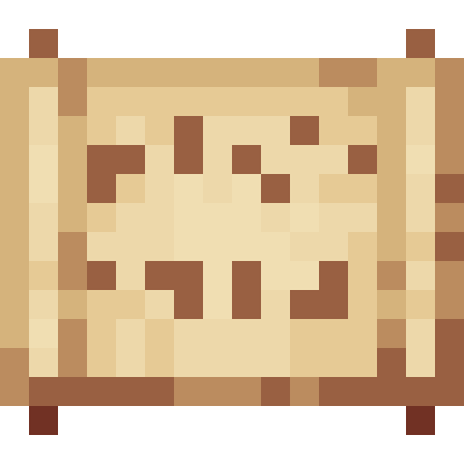
<figcaption>Source media</figcaption>
</figure>

<h2>Magic Staff Schematic</h2>

Can be acquired from master magic trainer dwarves for 10 gold coins.

Open reference →

</a>
</article>
<article class="reference-card" data-letter="M" data-search="magic stone can be obtained by crafting at a smithing bench">
<a href="magic-stone/" aria-label="Open Magic Stone">
<figure class="reference-card-media reference-card-media--source">
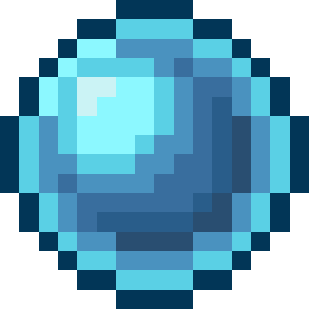
<figcaption>Source media</figcaption>
</figure>

<h2>Magic Stone</h2>

Can be obtained by crafting at a Smithing Bench

Open reference →

</a>
</article>
<article class="reference-card" data-letter="M" data-search="magic tome found in: wizard tower">
<a href="magic-tome/" aria-label="Open Magic Tome">
<figure class="reference-card-media reference-card-media--source">

<figcaption>Source media</figcaption>
</figure>

<h2>Magic Tome</h2>

Found in: Wizard Tower

Open reference →

</a>
</article>
<article class="reference-card" data-letter="M" data-search="magic wall use pure magic to create a wall in front of you">
<a href="magic-wall/" aria-label="Open Magic Wall">
<figure class="reference-card-media reference-card-media--source">
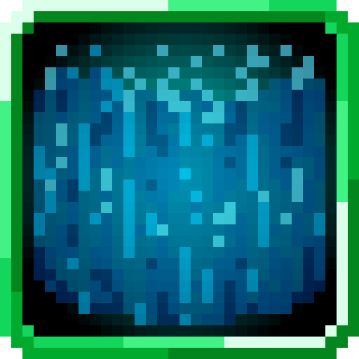
<figcaption>Source media</figcaption>
</figure>

<h2>Magic Wall</h2>

Use pure magic to create a wall in front of you

Open reference →

</a>
</article>
<article class="reference-card" data-letter="M" data-search="magic water transform gain access to greater water spirit magic and boost your water attacks while buffing yourself and debuffing enemies">
<a href="magic-water-transform/" aria-label="Open Magic Water Transform">
<figure class="reference-card-media reference-card-media--source">
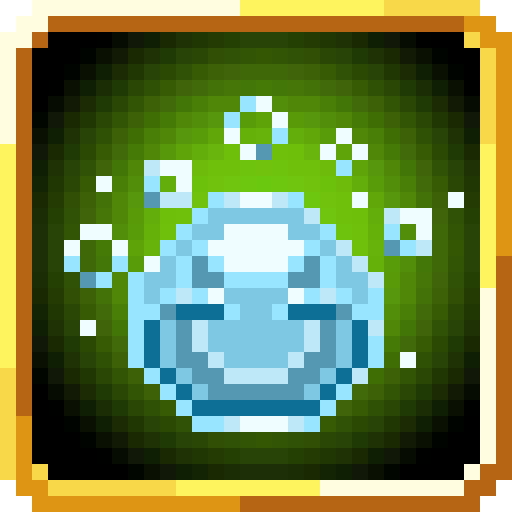
<figcaption>Source media</figcaption>
</figure>

<h2>Magic Water Transform</h2>

Gain access to Greater Water Spirit Magic and boost your water attacks while buffing yourself and debuffing enemies

Open reference →

</a>
</article>
<article class="reference-card" data-letter="M" data-search="magic wind transform gain access to greater wind spirit magic and boost your wind attacks while buffing yourself and debuffing enemies.">
<a href="magic-wind-transform/" aria-label="Open Magic Wind Transform">
<figure class="reference-card-media reference-card-media--source">
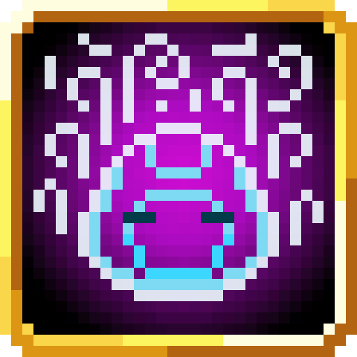
<figcaption>Source media</figcaption>
</figure>

<h2>Magic Wind Transform</h2>

Gain access to Greater Wind Spirit Magic and boost your wind attacks while buffing yourself and debuffing enemies.

Open reference →

</a>
</article>
<article class="reference-card" data-letter="M" data-search="magics magic the gathering aspectual magic spiritual magic summoning magic">
<a href="abilities-magics/" aria-label="Open Magics">
<figure class="reference-card-media reference-card-media--source">
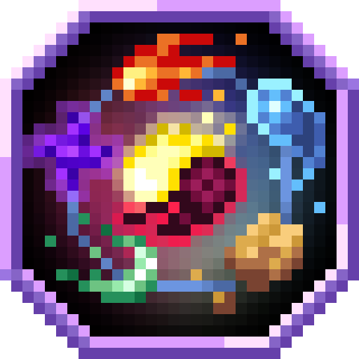
<figcaption>Source media</figcaption>
</figure>

<h2>Magics</h2>

Magic The Gathering Aspectual Magic Spiritual Magic Summoning Magic

Open reference →

</a>
</article>
<article class="reference-card" data-letter="M" data-search="magma surge fire a spread of lava that burns and melts anything for a limited time">
<a href="magma-surge/" aria-label="Open Magma Surge">
<figure class="reference-card-media reference-card-media--source">
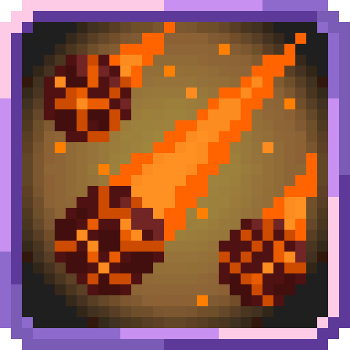
<figcaption>Source media</figcaption>
</figure>

<h2>Magma Surge</h2>

Fire a spread of lava that burns and melts anything for a limited time

Open reference →

</a>
</article>
<article class="reference-card" data-letter="M" data-search="medium quality magic crystal a medium quality magic crystal">
<a href="medium-quality-magic-crystal/" aria-label="Open Medium Quality Magic Crystal">
<figure class="reference-card-media reference-card-media--source">
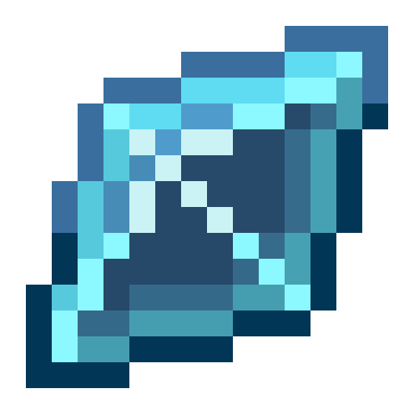
<figcaption>Source media</figcaption>
</figure>

<h2>Medium Quality Magic Crystal</h2>

A Medium Quality Magic Crystal

Open reference →

</a>
</article>
<article class="reference-card" data-letter="M" data-search="megiddo unleash powerful sun blasts using water to kill any nearby foes. it can also be used manually to concentrate fire for any stronger foes">
<a href="megiddo/" aria-label="Open Megiddo">
<figure class="reference-card-media reference-card-media--source">
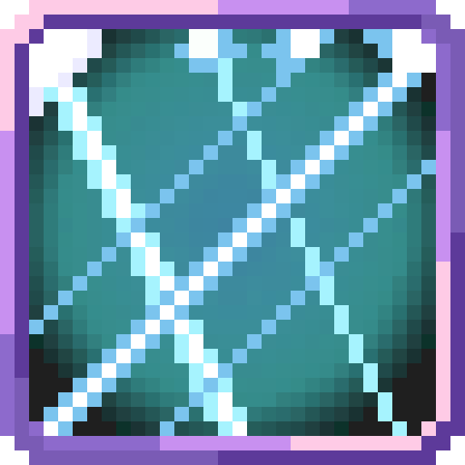
<figcaption>Source media</figcaption>
</figure>

<h2>Megiddo</h2>

Unleash powerful sun blasts using water to kill any nearby foes. It can also be used manually to concentrate fire for any stronger foes

Open reference →

</a>
</article>
<article class="reference-card" data-letter="M" data-search="mental crush crushes the targets spirit using magic">
<a href="mental-crush/" aria-label="Open Mental Crush">
<figure class="reference-card-media reference-card-media--source">
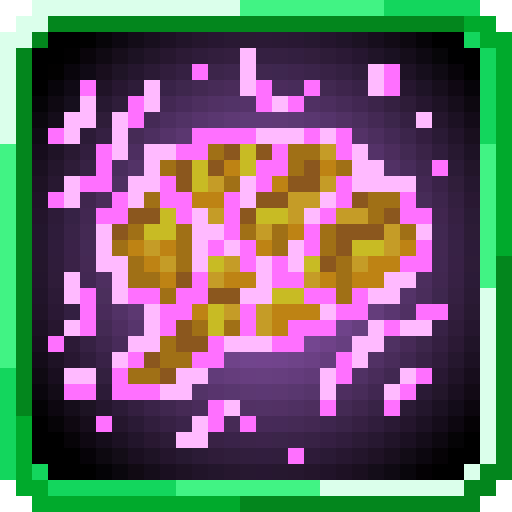
<figcaption>Source media</figcaption>
</figure>

<h2>Mental Crush</h2>

Crushes the targets spirit using magic

Open reference →

</a>
</article>
<article class="reference-card" data-letter="M" data-search="mirage walmart version of body double for broke people">
<a href="mirage/" aria-label="Open Mirage">
<figure class="reference-card-media reference-card-media--source">
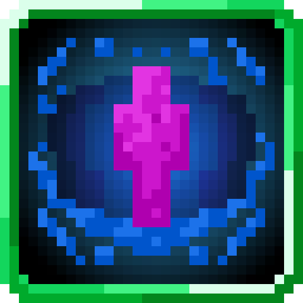
<figcaption>Source media</figcaption>
</figure>

<h2>Mirage</h2>

Walmart version of Body Double for broke people

Open reference →

</a>
</article>
<article class="reference-card" data-letter="M" data-search="mud hand creates hands using mud tying down the target">
<a href="mud-hand/" aria-label="Open Mud Hand">
<figure class="reference-card-media reference-card-media--source">
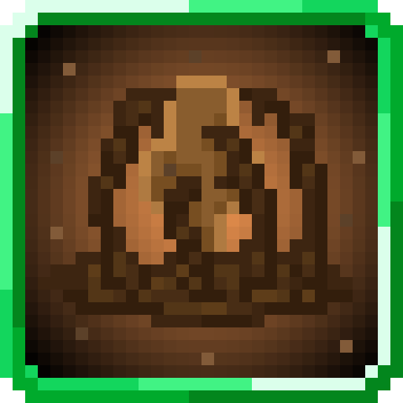
<figcaption>Source media</figcaption>
</figure>

<h2>Mud Hand</h2>

Creates hands using mud tying down the target

Open reference →

</a>
</article>
<article class="reference-card" data-letter="M" data-search="mud spears rise spikes from the ground to pierce the target">
<a href="mud-spears/" aria-label="Open Mud Spears">
<figure class="reference-card-media reference-card-media--source">
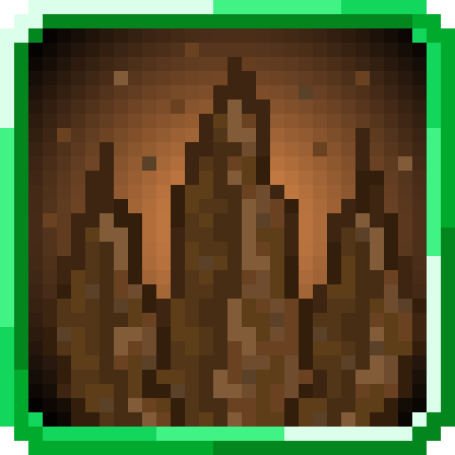
<figcaption>Source media</figcaption>
</figure>

<h2>Mud Spears</h2>

Rise spikes from the ground to pierce the target

Open reference →

</a>
</article>
<article class="reference-card" data-letter="N" data-search="necromancy spells defy the natural order with the power of death! rule the world as its overlord!">
<a href="necromancy-spells/" aria-label="Open Necromancy Spells">
<figure class="reference-card-media reference-card-media--theme">

<figcaption>TSR artwork</figcaption>
</figure>

<h2>Necromancy Spells</h2>

Defy the natural order with the power of death! Rule the world as its overlord!

Open reference →

</a>
</article>
<article class="reference-card" data-letter="P" data-search="possession when you want to be a daemon but don&#x27;t like the race:">
<a href="aspectual-possession/" aria-label="Open Possession">
<figure class="reference-card-media reference-card-media--source">

<figcaption>Source media</figcaption>
</figure>

<h2>Possession</h2>

When you want to be a daemon but don&#x27;t like the race:

Open reference →

</a>
</article>
<article class="reference-card" data-letter="P" data-search="protection protect your body from damage using magic">
<a href="protection/" aria-label="Open Protection">
<figure class="reference-card-media reference-card-media--source">
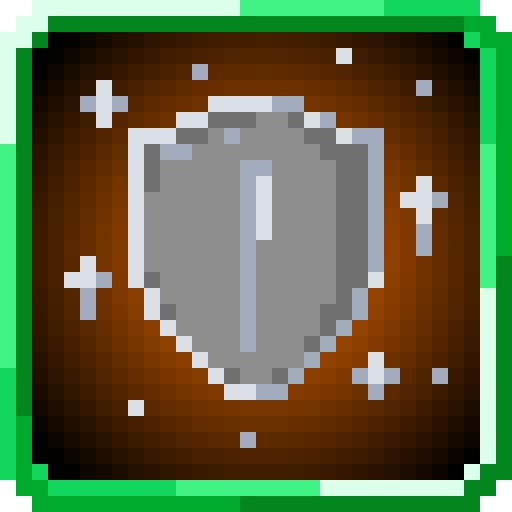
<figcaption>Source media</figcaption>
</figure>

<h2>Protection</h2>

Protect your body from damage using magic

Open reference →

</a>
</article>
<article class="reference-card" data-letter="R" data-search="recovery uses magic to greatly recover the casters vitality">
<a href="recovery/" aria-label="Open Recovery">
<figure class="reference-card-media reference-card-media--source">
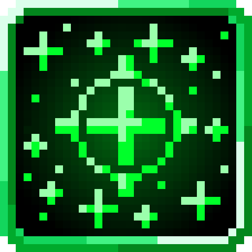
<figcaption>Source media</figcaption>
</figure>

<h2>Recovery</h2>

Uses magic to greatly recover the casters vitality

Open reference →

</a>
</article>
<article class="reference-card" data-letter="R" data-search="reinforced barrier cast barrier and magic barrier at the same time protecting from both magical and physical attacks">
<a href="reinforced-barrier/" aria-label="Open Reinforced Barrier">
<figure class="reference-card-media reference-card-media--source">
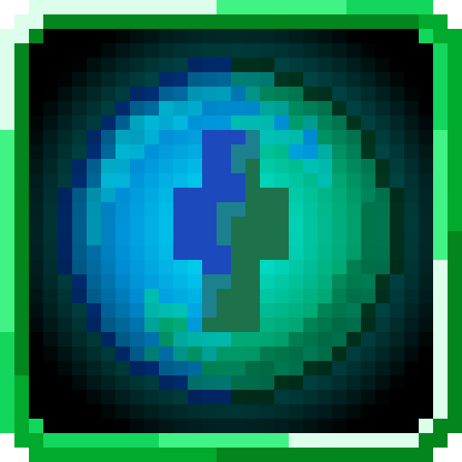
<figcaption>Source media</figcaption>
</figure>

<h2>Reinforced Barrier</h2>

Cast Barrier and Magic Barrier at the same time protecting from both magical and physical attacks

Open reference →

</a>
</article>
<article class="reference-card" data-letter="R" data-search="reinforcement reinforce your body using magic">
<a href="reinforcement/" aria-label="Open Reinforcement">
<figure class="reference-card-media reference-card-media--source">
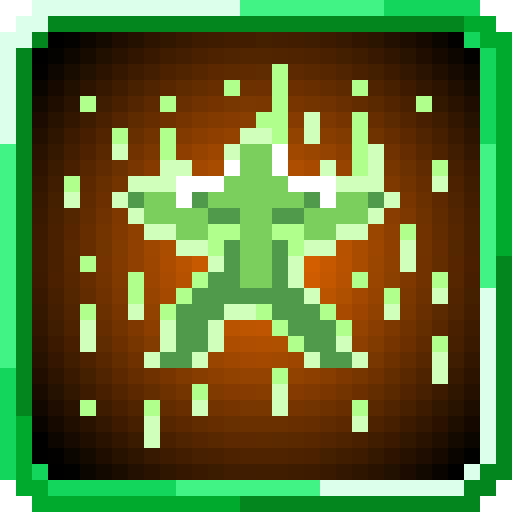
<figcaption>Source media</figcaption>
</figure>

<h2>Reinforcement</h2>

Reinforce your body using magic

Open reference →

</a>
</article>
<article class="reference-card" data-letter="S" data-search="search enemy you have no enemies, or do you?">
<a href="search-enemy/" aria-label="Open Search Enemy">
<figure class="reference-card-media reference-card-media--source">
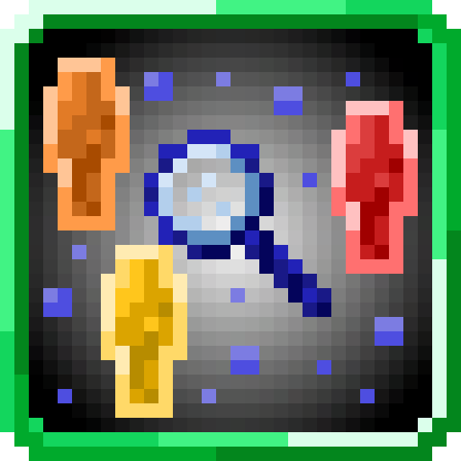
<figcaption>Source media</figcaption>
</figure>

<h2>Search Enemy</h2>

You have no enemies, or do you?

Open reference →

</a>
</article>
<article class="reference-card" data-letter="S" data-search="shadow bind if the target is standing in shadows, bind them and deal spiritual damage">
<a href="shadow-bind/" aria-label="Open Shadow Bind">
<figure class="reference-card-media reference-card-media--source">
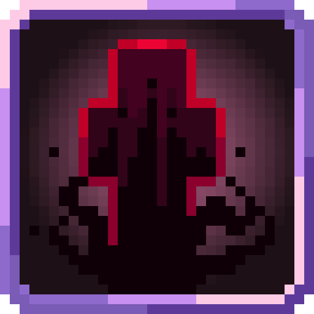
<figcaption>Source media</figcaption>
</figure>

<h2>Shadow Bind</h2>

If the target is standing in shadows, bind them and deal spiritual damage

Open reference →

</a>
</article>
<article class="reference-card" data-letter="S" data-search="shrink reduce your size to enchance your evasion but increase your vulnerability">
<a href="shrink/" aria-label="Open Shrink">
<figure class="reference-card-media reference-card-media--source">

<figcaption>Source media</figcaption>
</figure>

<h2>Shrink</h2>

Reduce your size to enchance your evasion but increase your vulnerability

Open reference →

</a>
</article>
<article class="reference-card" data-letter="S" data-search="sleep mist is your baby crying? i&#x27;ll make them sleep. go to sleep, go to sleep~">
<a href="sleep-mist/" aria-label="Open Sleep Mist">
<figure class="reference-card-media reference-card-media--source">
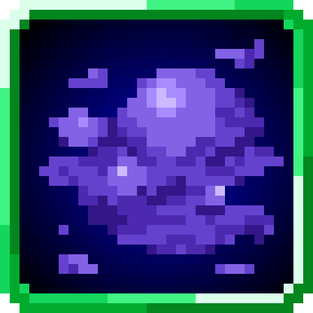
<figcaption>Source media</figcaption>
</figure>

<h2>Sleep Mist</h2>

Is your baby crying? I&#x27;ll make them sleep. Go to sleep, go to sleep~

Open reference →

</a>
</article>
<article class="reference-card" data-letter="S" data-search="solar beam fire a light beam that deals massive damage to undead entities and burns blocks.">
<a href="solar-beam/" aria-label="Open Solar Beam">
<figure class="reference-card-media reference-card-media--source">
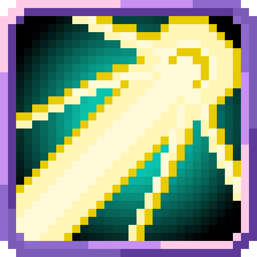
<figcaption>Source media</figcaption>
</figure>

<h2>Solar Beam</h2>

Fire a light beam that deals massive damage to undead entities and burns blocks.

Open reference →

</a>
</article>
<article class="reference-card" data-letter="S" data-search="solar flare shoot a shockwave of light energy to give nausea, blindness and slowness to all targets in a wide aoe">
<a href="solar-flare/" aria-label="Open Solar Flare">
<figure class="reference-card-media reference-card-media--source">
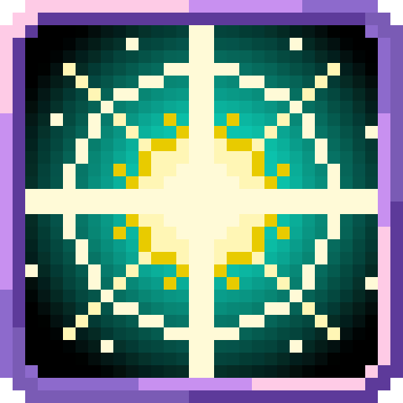
<figcaption>Source media</figcaption>
</figure>

<h2>Solar Flare</h2>

Shoot a shockwave of light energy to give nausea, blindness and slowness to all targets in a wide AOE

Open reference →

</a>
</article>
<article class="reference-card" data-letter="S" data-search="solar rain shoot many light projectiles that deal massive damage to undead creatures">
<a href="solar-rain/" aria-label="Open Solar Rain">
<figure class="reference-card-media reference-card-media--source">
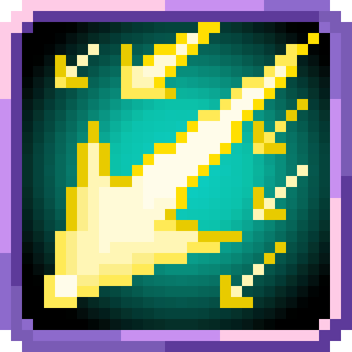
<figcaption>Source media</figcaption>
</figure>

<h2>Solar Rain</h2>

Shoot many light projectiles that deal massive damage to undead creatures

Open reference →

</a>
</article>
<article class="reference-card" data-letter="S" data-search="solar wave shoot a wave of light energy that blinds and slows hit enemies">
<a href="solar-wave/" aria-label="Open Solar Wave">
<figure class="reference-card-media reference-card-media--source">
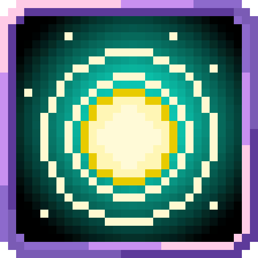
<figcaption>Source media</figcaption>
</figure>

<h2>Solar Wave</h2>

Shoot a wave of light energy that blinds and slows hit enemies

Open reference →

</a>
</article>
<article class="reference-card" data-letter="S" data-search="space form invisible platforms to create footholds mid-air">
<a href="space/" aria-label="Open Space">
<figure class="reference-card-media reference-card-media--source">
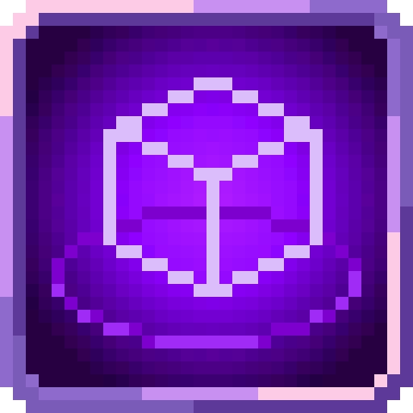
<figcaption>Source media</figcaption>
</figure>

<h2>Space</h2>

Form invisible platforms to create footholds mid-air

Open reference →

</a>
</article>
<article class="reference-card" data-letter="S" data-search="spatial storage put the fries *cough* i mean the items in the bag">
<a href="spatial-storage/" aria-label="Open Spatial Storage">
<figure class="reference-card-media reference-card-media--source">
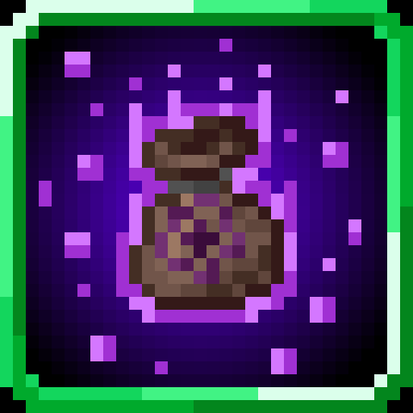
<figcaption>Source media</figcaption>
</figure>

<h2>Spatial Storage</h2>

Put the fries *cough* I mean the items in the bag

Open reference →

</a>
</article>
<article class="reference-card" data-letter="S" data-search="stone shot shape stones into projectiles and throw it at high speeds">
<a href="stone-shot/" aria-label="Open Stone Shot">
<figure class="reference-card-media reference-card-media--source">
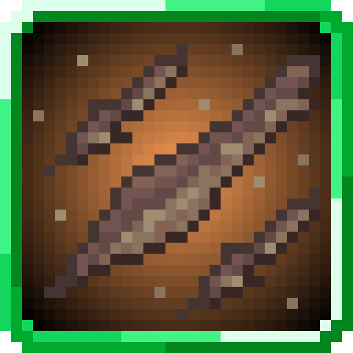
<figcaption>Source media</figcaption>
</figure>

<h2>Stone Shot</h2>

Shape stones into projectiles and throw it at high speeds

Open reference →

</a>
</article>
<article class="reference-card" data-letter="S" data-search="strength strengthen your muscles using magic">
<a href="aspectual-strength/" aria-label="Open Strength">
<figure class="reference-card-media reference-card-media--source">
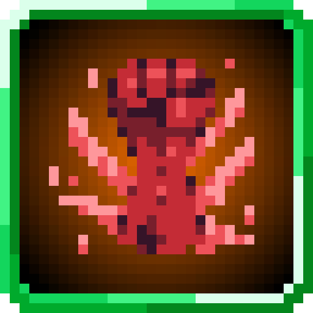
<figcaption>Source media</figcaption>
</figure>

<h2>Strength</h2>

Strengthen your muscles using magic

Open reference →

</a>
</article>
<article class="reference-card" data-letter="S" data-search="summon basilisk summons a basilisk to fight for you.">
<a href="summon-basilisk/" aria-label="Open Summon Basilisk">
<figure class="reference-card-media reference-card-media--source">
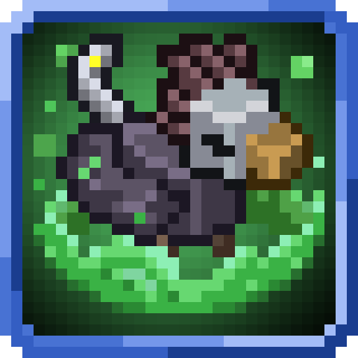
<figcaption>Source media</figcaption>
</figure>

<h2>Summon Basilisk</h2>

Summons a Basilisk to fight for you.

Open reference →

</a>
</article>
<article class="reference-card" data-letter="S" data-search="summon daemon summons a daemon to fight for you.">
<a href="summon-daemon/" aria-label="Open Summon Daemon">
<figure class="reference-card-media reference-card-media--source">
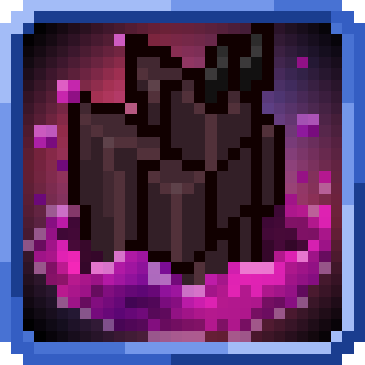
<figcaption>Source media</figcaption>
</figure>

<h2>Summon Daemon</h2>

Summons a Daemon to fight for you.

Open reference →

</a>
</article>
<article class="reference-card" data-letter="S" data-search="summon greater elemental summons a spirit which decided to dwell within the user. switching skill modes changes the elemental summoned.">
<a href="summon-greater-elemental/" aria-label="Open Summon Greater Elemental">
<figure class="reference-card-media reference-card-media--source">
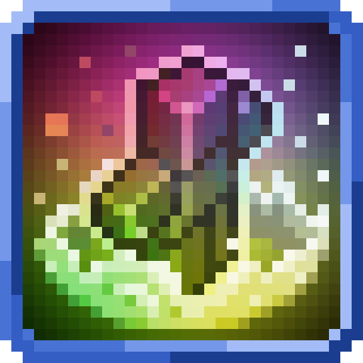
<figcaption>Source media</figcaption>
</figure>

<h2>Summon Greater Elemental</h2>

Summons a spirit which decided to dwell within the user. Switching skill modes changes the elemental summoned.

Open reference →

</a>
</article>
<article class="reference-card" data-letter="S" data-search="summon medium elemental summons a spirit which decided to dwell within the user. switching skill modes changes the spirit summoned.">
<a href="summon-medium-elemental/" aria-label="Open Summon Medium Elemental">
<figure class="reference-card-media reference-card-media--source">

<figcaption>Source media</figcaption>
</figure>

<h2>Summon Medium Elemental</h2>

Summons a spirit which decided to dwell within the user. Switching skill modes changes the spirit summoned.

Open reference →

</a>
</article>
<article class="reference-card" data-letter="S" data-search="summon otherworlder summons an otherworlder.">
<a href="summon-otherworlder/" aria-label="Open Summon Otherworlder">
<figure class="reference-card-media reference-card-media--source">
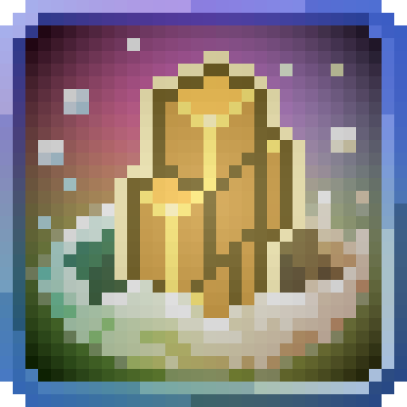
<figcaption>Source media</figcaption>
</figure>

<h2>Summon Otherworlder</h2>

Summons an Otherworlder.

Open reference →

</a>
</article>
<article class="reference-card" data-letter="S" data-search="swipe slashing through space in a straight line, displacing entities or teleporting the caster">
<a href="swipe/" aria-label="Open Swipe">
<figure class="reference-card-media reference-card-media--source">
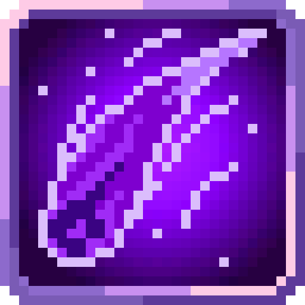
<figcaption>Source media</figcaption>
</figure>

<h2>Swipe</h2>

Slashing through space in a straight line, displacing entities or teleporting the caster

Open reference →

</a>
</article>
<article class="reference-card" data-letter="T" data-search="teleport quickly blind forward in space to a location within view">
<a href="teleport/" aria-label="Open Teleport">
<figure class="reference-card-media reference-card-media--source">
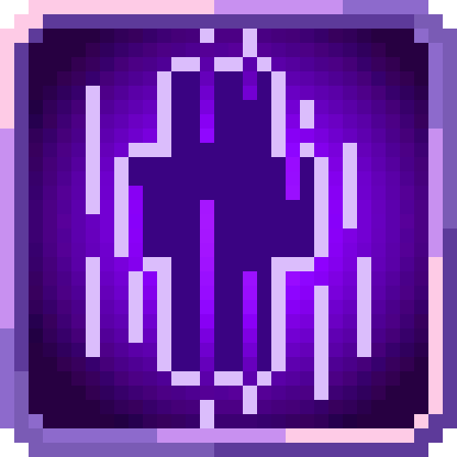
<figcaption>Source media</figcaption>
</figure>

<h2>Teleport</h2>

Quickly blind forward in space to a location within view

Open reference →

</a>
</article>
<article class="reference-card" data-letter="T" data-search="thunder thunder, bring her through the wringer show her i&#x27;m the judgment call the one who makes her kingdom fall lightning, wield her, use and yield her show her what she can&#x27;t…">
<a href="thunder/" aria-label="Open Thunder">
<figure class="reference-card-media reference-card-media--source">
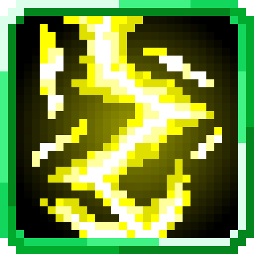
<figcaption>Source media</figcaption>
</figure>

<h2>Thunder</h2>

Thunder, bring her through the wringer Show her I&#x27;m the judgment call The one who makes her kingdom fall Lightning, wield her, use and yield her Show her what she can&#x27;t…

Open reference →

</a>
</article>
<article class="reference-card" data-letter="T" data-search="thunder lance creates a lance made of magic lighting">
<a href="thunder-lance/" aria-label="Open Thunder Lance">
<figure class="reference-card-media reference-card-media--source">
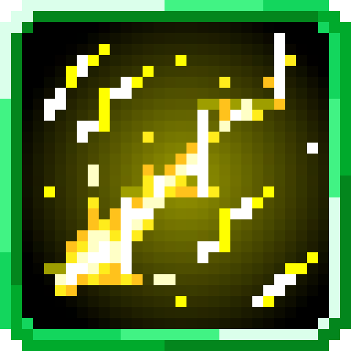
<figcaption>Source media</figcaption>
</figure>

<h2>Thunder Lance</h2>

Creates a lance made of magic lighting

Open reference →

</a>
</article>
<article class="reference-card" data-letter="T" data-search="thunder orb accumulates lighting inside a powerful orb attack">
<a href="thunder-orb/" aria-label="Open Thunder Orb">
<figure class="reference-card-media reference-card-media--source">
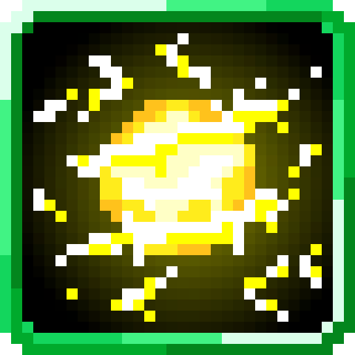
<figcaption>Source media</figcaption>
</figure>

<h2>Thunder Orb</h2>

Accumulates lighting inside a powerful orb attack

Open reference →

</a>
</article>
<article class="reference-card" data-letter="T" data-search="thunder rain create a small storm above the user striking everyone below it with lighting">
<a href="thunder-rain/" aria-label="Open Thunder Rain">
<figure class="reference-card-media reference-card-media--source">
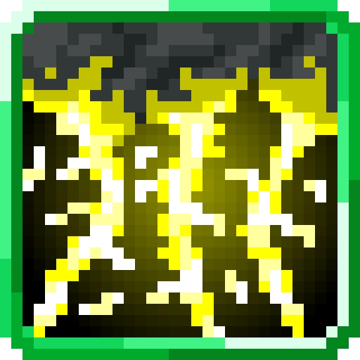
<figcaption>Source media</figcaption>
</figure>

<h2>Thunder Rain</h2>

Create a small storm above the user striking everyone below it with lighting

Open reference →

</a>
</article>
<article class="reference-card" data-letter="T" data-search="tornado blade cast a tiny tornado that explodes into multiple wind cutters">
<a href="tornado-blade/" aria-label="Open Tornado Blade">
<figure class="reference-card-media reference-card-media--source">
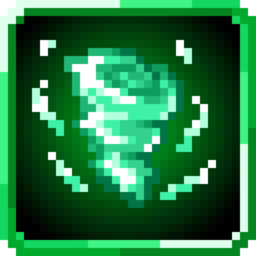
<figcaption>Source media</figcaption>
</figure>

<h2>Tornado Blade</h2>

Cast a tiny tornado that explodes into multiple wind cutters

Open reference →

</a>
</article>
<article class="reference-card" data-letter="T" data-search="true darkness inflict blindness on all entities and deal massive spiritual damage">
<a href="true-darkness/" aria-label="Open True Darkness">
<figure class="reference-card-media reference-card-media--source">
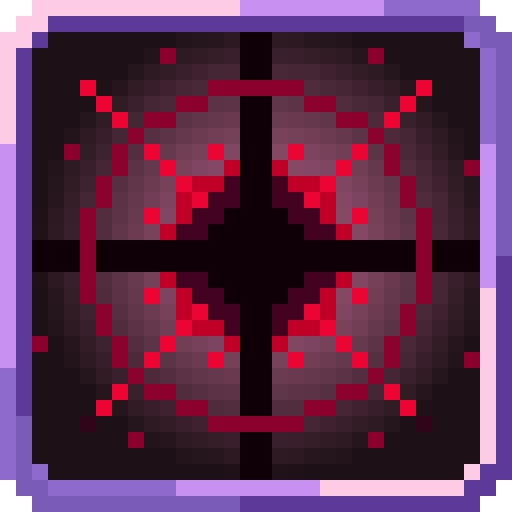
<figcaption>Source media</figcaption>
</figure>

<h2>True Darkness</h2>

Inflict Blindness on all entities and deal massive spiritual damage

Open reference →

</a>
</article>
<article class="reference-card" data-letter="V" data-search="vacuumed magic bottle of water cooking/&quot;boiling&quot; a magic bottle of water with a campfire, furnace, etc">
<a href="vacuumed-magic-bottle-of-water/" aria-label="Open Vacuumed Magic Bottle of Water">
<figure class="reference-card-media reference-card-media--source">
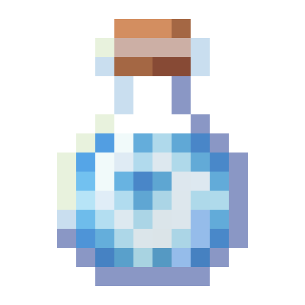
<figcaption>Source media</figcaption>
</figure>

<h2>Vacuumed Magic Bottle of Water</h2>

Cooking/&quot;Boiling&quot; a Magic Bottle of Water with a campfire, furnace, etc

Open reference →

</a>
</article>
<article class="reference-card" data-letter="W" data-search="warp portal creates a gate connecting 2 points in space">
<a href="warp-portal/" aria-label="Open Warp Portal">
<figure class="reference-card-media reference-card-media--source">
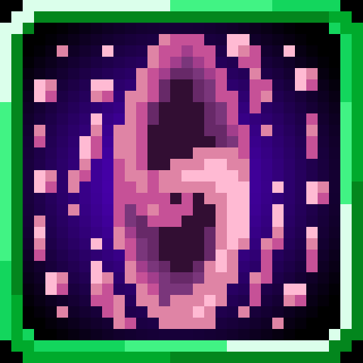
<figcaption>Source media</figcaption>
</figure>

<h2>Warp Portal</h2>

Creates a gate connecting 2 points in space

Open reference →

</a>
</article>
<article class="reference-card" data-letter="W" data-search="water (aspectual) create a water source using magic">
<a href="water-aspectual/" aria-label="Open Water (Aspectual)">
<figure class="reference-card-media reference-card-media--source">
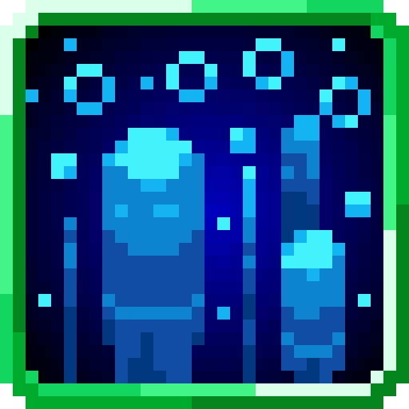
<figcaption>Source media</figcaption>
</figure>

<h2>Water (Aspectual)</h2>

Create a water source using magic

Open reference →

</a>
</article>
<article class="reference-card" data-letter="W" data-search="water (spiritual) call forth or manipulate small amounts of water">
<a href="water-spiritual/" aria-label="Open Water (Spiritual)">
<figure class="reference-card-media reference-card-media--source">
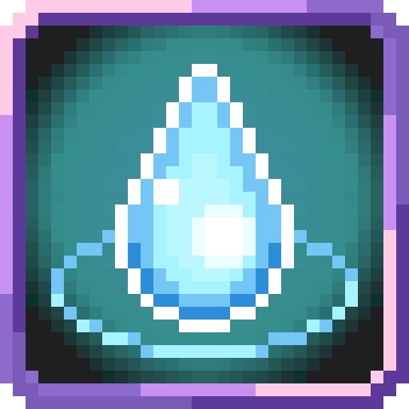
<figcaption>Source media</figcaption>
</figure>

<h2>Water (Spiritual)</h2>

Call forth or manipulate small amounts of water

Open reference →

</a>
</article>
<article class="reference-card" data-letter="W" data-search="water cutter fires a concentrated blade to cut your enemies with the power of water">
<a href="water-cutter-spiritual/" aria-label="Open Water Cutter">
<figure class="reference-card-media reference-card-media--source">
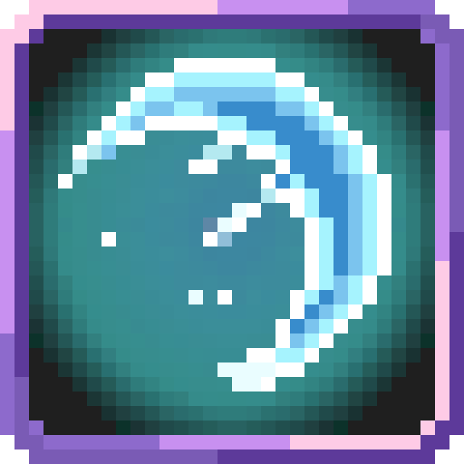
<figcaption>Source media</figcaption>
</figure>

<h2>Water Cutter</h2>

Fires a concentrated blade to cut your enemies with the power of water

Open reference →

</a>
</article>
<article class="reference-card" data-letter="W" data-search="water cutter (aspectual) a blade of water that flies through the air.">
<a href="water-cutter-aspectual/" aria-label="Open Water Cutter (Aspectual)">
<figure class="reference-card-media reference-card-media--source">
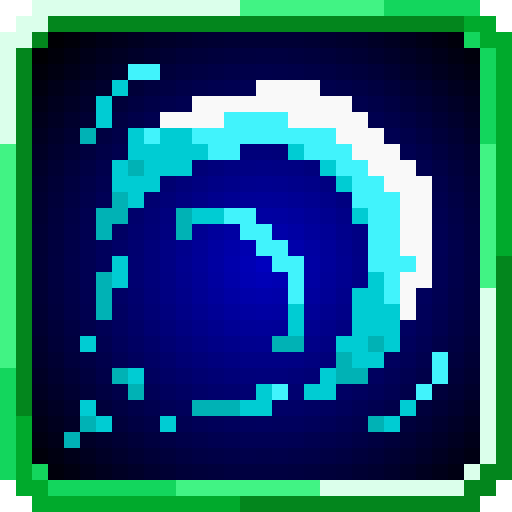
<figcaption>Source media</figcaption>
</figure>

<h2>Water Cutter (Aspectual)</h2>

A blade of water that flies through the air.

Open reference →

</a>
</article>
<article class="reference-card" data-letter="W" data-search="water jail traps your enemies inside a water bubble with spinning blades inside">
<a href="water-jail/" aria-label="Open Water Jail">
<figure class="reference-card-media reference-card-media--source">
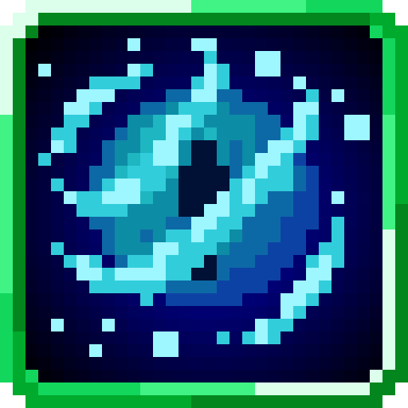
<figcaption>Source media</figcaption>
</figure>

<h2>Water Jail</h2>

Traps your enemies inside a water bubble with spinning blades inside

Open reference →

</a>
</article>
<article class="reference-card" data-letter="W" data-search="wind calls forth a small gust of wind which can push targets away or the player up.">
<a href="wind/" aria-label="Open Wind">
<figure class="reference-card-media reference-card-media--source">
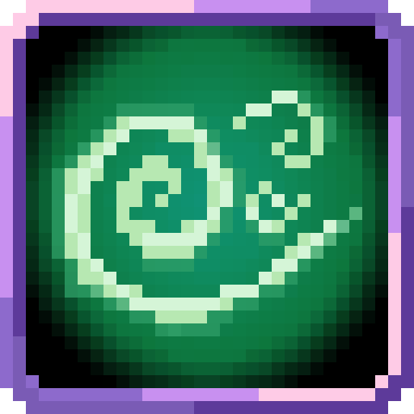
<figcaption>Source media</figcaption>
</figure>

<h2>Wind</h2>

Calls forth a small gust of wind which can push targets away or the player up.

Open reference →

</a>
</article>
<article class="reference-card" data-letter="W" data-search="wind blade fires a concentrated blade of wind which has heavy knockback">
<a href="wind-blade/" aria-label="Open Wind Blade">
<figure class="reference-card-media reference-card-media--source">
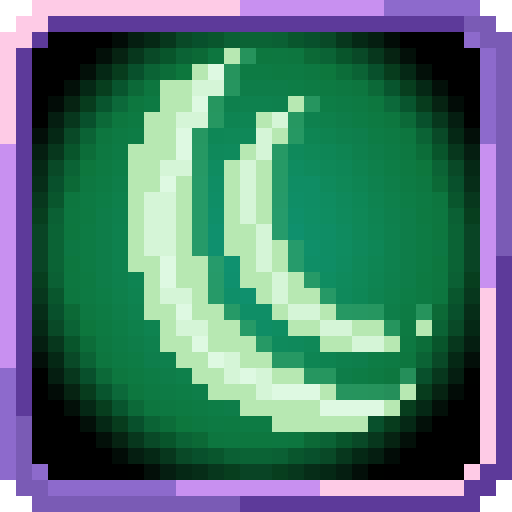
<figcaption>Source media</figcaption>
</figure>

<h2>Wind Blade</h2>

Fires a concentrated blade of wind which has heavy knockback

Open reference →

</a>
</article>
<article class="reference-card" data-letter="W" data-search="wind cutter cast wind scythes to cut the enemy down">
<a href="wind-cutter/" aria-label="Open Wind Cutter">
<figure class="reference-card-media reference-card-media--source">
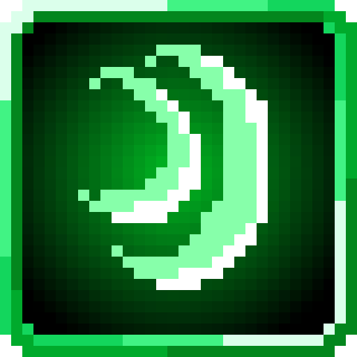
<figcaption>Source media</figcaption>
</figure>

<h2>Wind Cutter</h2>

Cast wind scythes to cut the enemy down

Open reference →

</a>
</article>
<article class="reference-card" data-letter="W" data-search="wind gust wind charge but magic">
<a href="wind-gust/" aria-label="Open Wind Gust">
<figure class="reference-card-media reference-card-media--source">
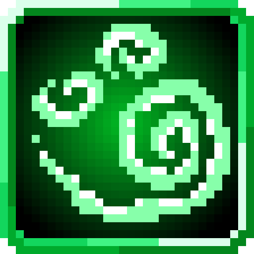
<figcaption>Source media</figcaption>
</figure>

<h2>Wind Gust</h2>

Wind charge but magic

Open reference →

</a>
</article>
<article class="reference-card" data-letter="W" data-search="wind protection use winds currents to protect yourself and cool down">
<a href="wind-protection/" aria-label="Open Wind Protection">
<figure class="reference-card-media reference-card-media--source">
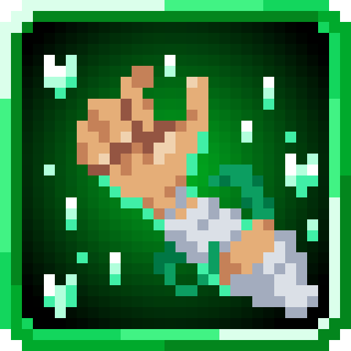
<figcaption>Source media</figcaption>
</figure>

<h2>Wind Protection</h2>

Use winds currents to protect yourself and cool down

Open reference →

</a>
</article>

No matching articles. Try a broader search.

</section>
