<section class="reference-directory" data-reference-directory="mobs">
<header class="reference-directory-hero reference-theme-bestiary">
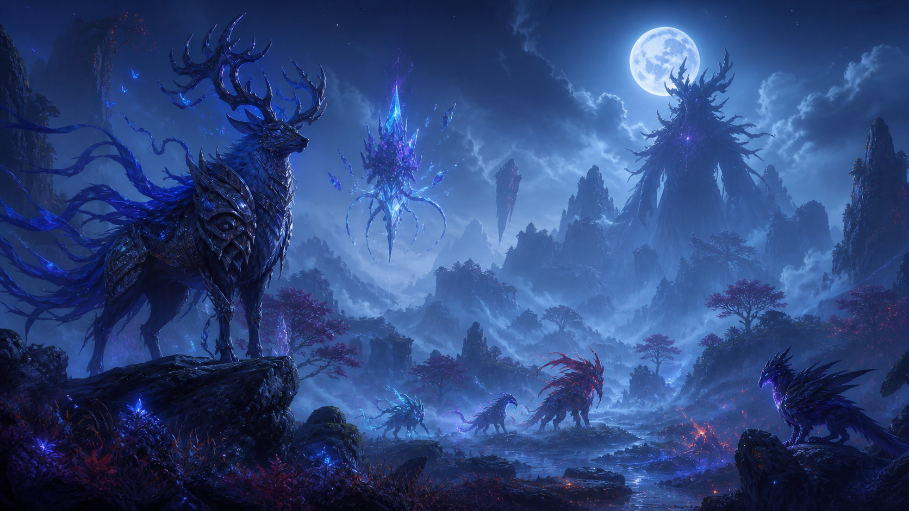

Tensura reference collection

<h1>Mobs</h1>

Documented entity catalog.

<strong>60</strong> articles

</header>

<label class="reference-filter-label">
Filter this collection
<input type="search" class="reference-filter-input" placeholder="Search titles and summaries…" autocomplete="off">
</label>

<button type="button" class="is-active" data-letter="all" aria-pressed="true">All</button>
<button type="button" data-letter="A" aria-pressed="false">A</button>
<button type="button" data-letter="B" aria-pressed="false">B</button>
<button type="button" data-letter="C" aria-pressed="false">C</button>
<button type="button" data-letter="D" aria-pressed="false">D</button>
<button type="button" data-letter="E" aria-pressed="false">E</button>
<button type="button" data-letter="F" aria-pressed="false">F</button>
<button type="button" data-letter="G" aria-pressed="false">G</button>
<button type="button" data-letter="H" aria-pressed="false">H</button>
<button type="button" data-letter="K" aria-pressed="false">K</button>
<button type="button" data-letter="L" aria-pressed="false">L</button>
<button type="button" data-letter="M" aria-pressed="false">M</button>
<button type="button" data-letter="O" aria-pressed="false">O</button>
<button type="button" data-letter="P" aria-pressed="false">P</button>
<button type="button" data-letter="S" aria-pressed="false">S</button>
<button type="button" data-letter="T" aria-pressed="false">T</button>
<button type="button" data-letter="U" aria-pressed="false">U</button>
<button type="button" data-letter="W" aria-pressed="false">W</button>

Showing 60 of 60 articles

<article class="reference-card" data-letter="A" data-search="ai hoshino whenever an otherworlder spawns, it has a 12.6% chance for it to be ai hoshino.">
<a href="../../mysticism-reference/mobs/mobs-ai-hoshino/" aria-label="Open Ai Hoshino">
<figure class="reference-card-media reference-card-media--source">
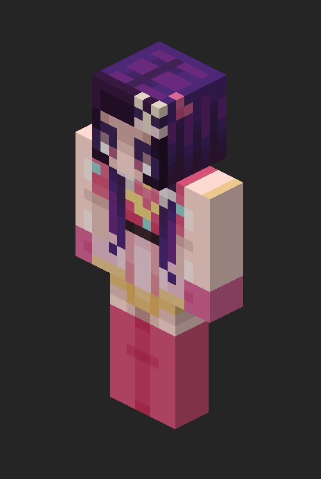
<figcaption>Source media</figcaption>
</figure>

<h2>Ai Hoshino</h2>

Whenever an Otherworlder spawns, it has a 12.6% chance for it to be Ai Hoshino.

Open reference →

</a>
</article>
<article class="reference-card" data-letter="A" data-search="aqua frog a medium spirit of water, can be summoned using summon medium elemental">
<a href="mobs-aqua-frog/" aria-label="Open Aqua Frog">
<figure class="reference-card-media reference-card-media--source">
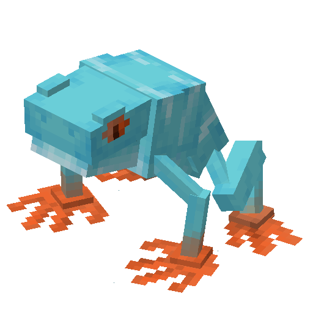
<figcaption>Source media</figcaption>
</figure>

<h2>Aqua Frog</h2>

A medium spirit of water, can be summoned using Summon Medium Elemental

Open reference →

</a>
</article>
<article class="reference-card" data-letter="A" data-search="arch daemon attacks any player and non-daemon mob on sight using magic">
<a href="mobs-arch-daemon/" aria-label="Open Arch Daemon">
<figure class="reference-card-media reference-card-media--source">
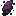
<figcaption>Source media</figcaption>
</figure>

<h2>Arch Daemon</h2>

Attacks any player and non-daemon mob on sight using magic

Open reference →

</a>
</article>
<article class="reference-card" data-letter="A" data-search="armorsaurus a heavily armored lizard">
<a href="mobs-armorsaurus/" aria-label="Open Armorsaurus">
<figure class="reference-card-media reference-card-media--source">
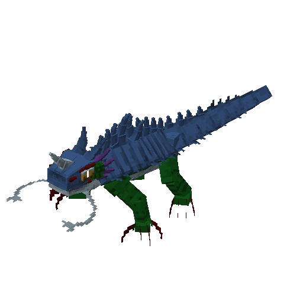
<figcaption>Source media</figcaption>
</figure>

<h2>Armorsaurus</h2>

A heavily armored lizard

Open reference →

</a>
</article>
<article class="reference-card" data-letter="A" data-search="army wasp deals lethal poison effect that stacks with every attack. (needs confirmation if its every attack or if its a chance that it gets applied)">
<a href="mobs-army-wasp/" aria-label="Open Army Wasp">
<figure class="reference-card-media reference-card-media--source">
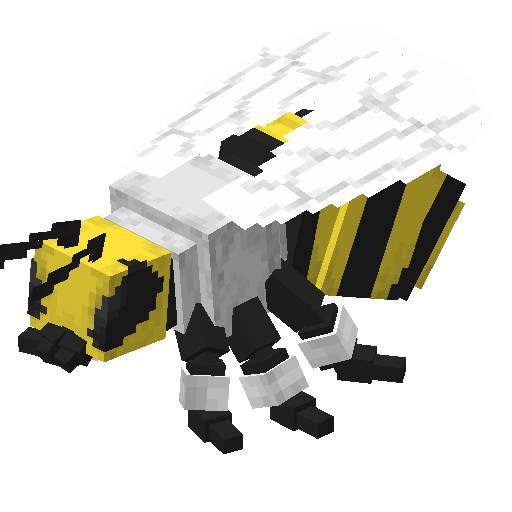
<figcaption>Source media</figcaption>
</figure>

<h2>Army Wasp</h2>

Deals lethal poison effect that stacks with every attack. (Needs confirmation if its every attack or if its a chance that it gets applied)

Open reference →

</a>
</article>
<article class="reference-card" data-letter="B" data-search="barghest 1 - 3 monster leather (c) 1 medium quality magic crystal">
<a href="mobs-barghest/" aria-label="Open Barghest">
<figure class="reference-card-media reference-card-media--source">
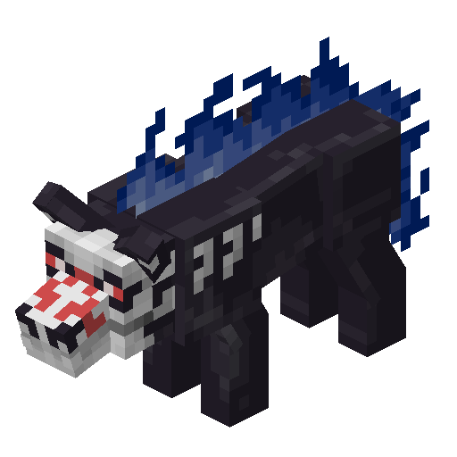
<figcaption>Source media</figcaption>
</figure>

<h2>Barghest</h2>

1 - 3 Monster Leather (C) 1 Medium Quality Magic Crystal

Open reference →

</a>
</article>
<article class="reference-card" data-letter="B" data-search="basilisk inflicts petrification with its tail attack.">
<a href="mobs-basilisk/" aria-label="Open Basilisk">
<figure class="reference-card-media reference-card-media--source">
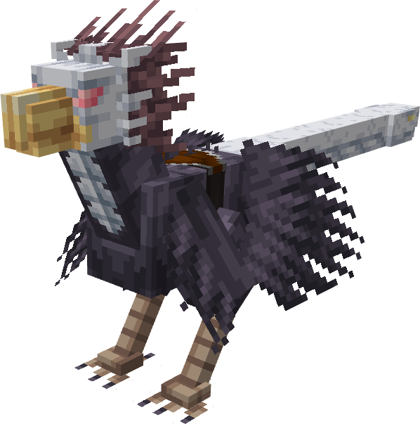
<figcaption>Source media</figcaption>
</figure>

<h2>Basilisk</h2>

Inflicts Petrification with its tail attack.

Open reference →

</a>
</article>
<article class="reference-card" data-letter="B" data-search="beast gnome a medium spirit of earth, can be summoned using summon medium elemental">
<a href="mobs-beast-gnome/" aria-label="Open Beast Gnome">
<figure class="reference-card-media reference-card-media--source">
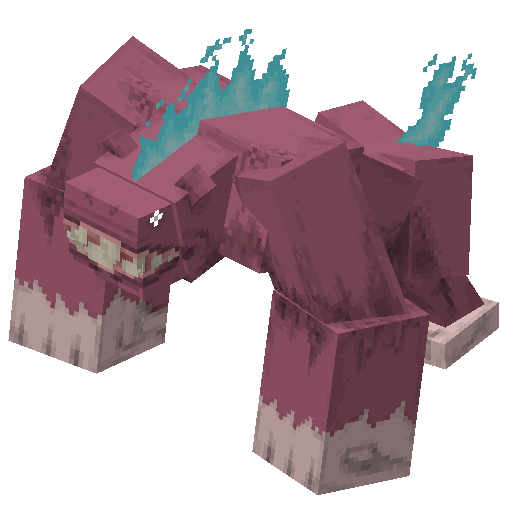
<figcaption>Source media</figcaption>
</figure>

<h2>Beast Gnome</h2>

A medium spirit of earth, can be summoned using Summon Medium Elemental

Open reference →

</a>
</article>
<article class="reference-card" data-letter="B" data-search="black spider a large spider type monster. it lurks underground or in caves. after being named, it can be equipped with a monster saddle and ridden. using the race/mount ability key…">
<a href="mobs-black-spider/" aria-label="Open Black Spider">
<figure class="reference-card-media reference-card-media--source">
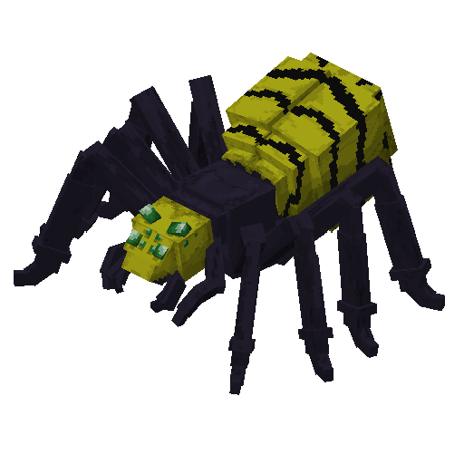
<figcaption>Source media</figcaption>
</figure>

<h2>Black Spider</h2>

A large spider type monster. It lurks underground or in caves. After being named, it can be equipped with a monster saddle and ridden. Using the Race/Mount Ability key…

Open reference →

</a>
</article>
<article class="reference-card" data-letter="B" data-search="blade tiger a nameable tiger that uses it&#x27;s skill voice cannon">
<a href="mobs-blade-tiger/" aria-label="Open Blade Tiger">
<figure class="reference-card-media reference-card-media--source">
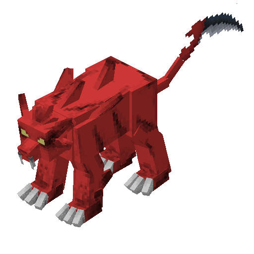
<figcaption>Source media</figcaption>
</figure>

<h2>Blade Tiger</h2>

A Nameable Tiger that uses it&#x27;s skill voice cannon

Open reference →

</a>
</article>
<article class="reference-card" data-letter="C" data-search="cattledeer can be bred using wheat">
<a href="mobs-cattledeer/" aria-label="Open Cattledeer">
<figure class="reference-card-media reference-card-media--source">
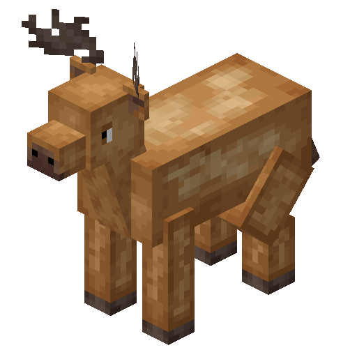
<figcaption>Source media</figcaption>
</figure>

<h2>Cattledeer</h2>

Can be bred using wheat

Open reference →

</a>
</article>
<article class="reference-card" data-letter="D" data-search="direwolf a pack predator capable of using shouts to damage opponents. can be ridden when tamed, allowing the use of the mount ability key (default r) to use its coercion skill…">
<a href="mobs-direwolf/" aria-label="Open Direwolf">
<figure class="reference-card-media reference-card-media--source">
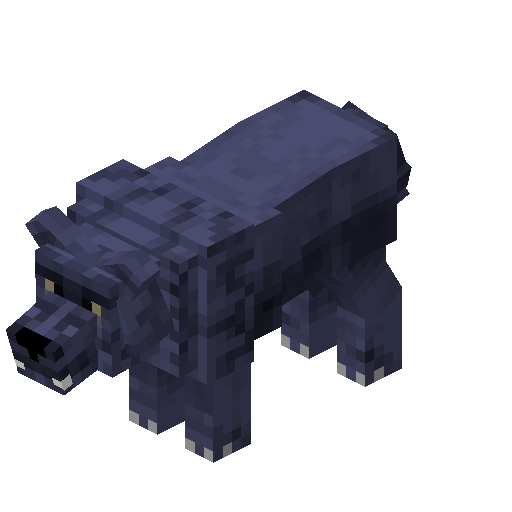
<figcaption>Source media</figcaption>
</figure>

<h2>Direwolf</h2>

A pack predator capable of using shouts to damage opponents. Can be ridden when tamed, allowing the use of the Mount Ability key (default R) to use its Coercion skill…

Open reference →

</a>
</article>
<article class="reference-card" data-letter="D" data-search="dragon peacock if wearing a monster leather helmet, a tamed dragon peacock can be right clicked to have it ride the player. pressing crouch will let it off of your head. holding…">
<a href="mobs-dragon-peacock/" aria-label="Open Dragon Peacock">
<figure class="reference-card-media reference-card-media--source">
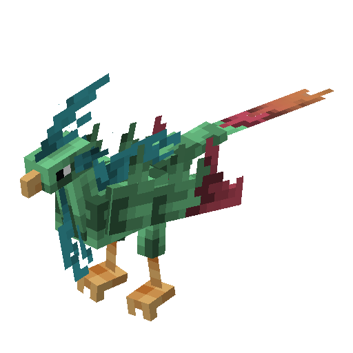
<figcaption>Source media</figcaption>
</figure>

<h2>Dragon Peacock</h2>

If wearing a Monster Leather helmet, a tamed Dragon Peacock can be right clicked to have it ride the player. Pressing crouch will let it off of your head. Holding…

Open reference →

</a>
</article>
<article class="reference-card" data-letter="D" data-search="dwarf dwarves can only spawn in dwarf village and cannot spawn outside of the village. upon taming they will lose the capacity to trade. dwarves can trade and will restock…">
<a href="mobs-dwarf/" aria-label="Open Dwarf">
<figure class="reference-card-media reference-card-media--theme">

<figcaption>TSR artwork</figcaption>
</figure>

<h2>Dwarf</h2>

Dwarves can only spawn in Dwarf Village and cannot spawn outside of the village. Upon taming they will lose the capacity to trade. Dwarves can trade and will restock…

Open reference →

</a>
</article>
<article class="reference-card" data-letter="E" data-search="evil centipede 0 - 2 centipede stinger 1 medium quality magic crystal">
<a href="mobs-evil-centipede/" aria-label="Open Evil Centipede">
<figure class="reference-card-media reference-card-media--source">
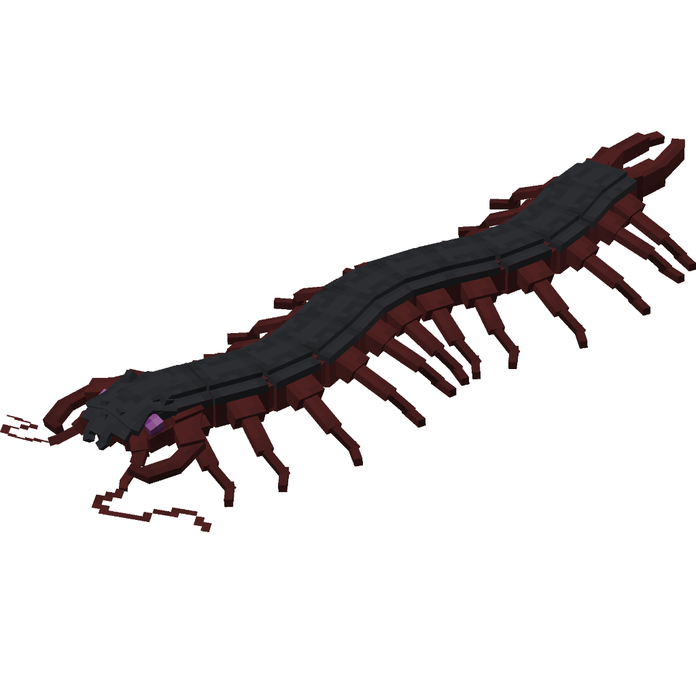
<figcaption>Source media</figcaption>
</figure>

<h2>Evil Centipede</h2>

0 - 2 Centipede Stinger 1 Medium Quality Magic Crystal

Open reference →

</a>
</article>
<article class="reference-card" data-letter="F" data-search="falmuth knight falmuth knights spawn around folgen">
<a href="mobs-falmuth-knight/" aria-label="Open Falmuth Knight">
<figure class="reference-card-media reference-card-media--source">
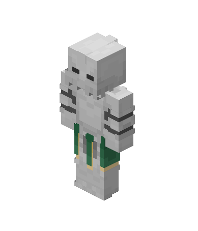
<figcaption>Source media</figcaption>
</figure>

<h2>Falmuth Knight</h2>

Falmuth Knights spawn around Folgen

Open reference →

</a>
</article>
<article class="reference-card" data-letter="F" data-search="feathered serpent a medium spirit of wind, can be summoned with summon medium elemental">
<a href="mobs-feathered-serpent/" aria-label="Open Feathered Serpent">
<figure class="reference-card-media reference-card-media--source">
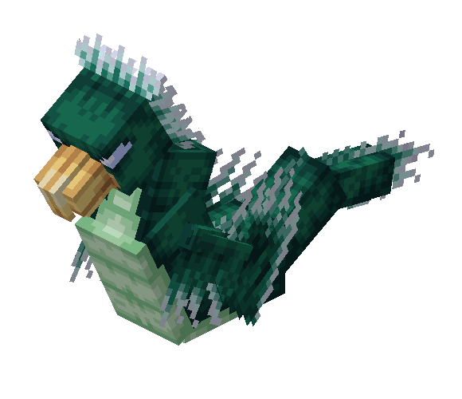
<figcaption>Source media</figcaption>
</figure>

<h2>Feathered Serpent</h2>

A medium spirit of wind, can be summoned with Summon Medium Elemental

Open reference →

</a>
</article>
<article class="reference-card" data-letter="F" data-search="folgen folgen will always spawn with 9 falmuth knights accompanying him">
<a href="mobs-folgen/" aria-label="Open Folgen">
<figure class="reference-card-media reference-card-media--source">
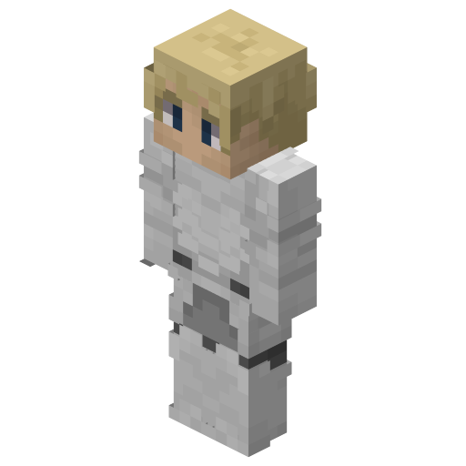
<figcaption>Source media</figcaption>
</figure>

<h2>Folgen</h2>

Folgen will always spawn with 9 Falmuth Knights accompanying him

Open reference →

</a>
</article>
<article class="reference-card" data-letter="G" data-search="giant cod a rather large fish that is commonly found in water.">
<a href="mobs-giant-cod/" aria-label="Open Giant Cod">
<figure class="reference-card-media reference-card-media--source">
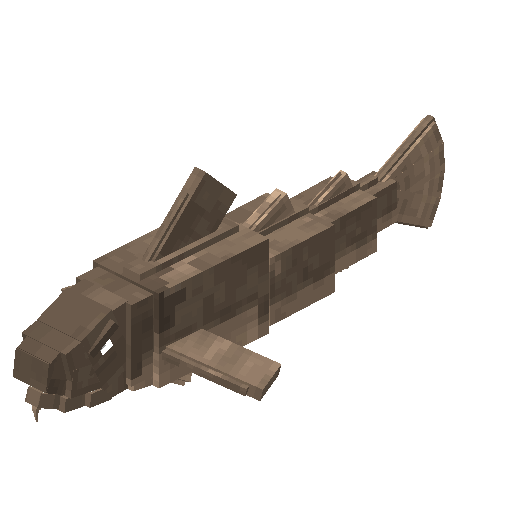
<figcaption>Source media</figcaption>
</figure>

<h2>Giant Cod</h2>

A rather large fish that is commonly found in water.

Open reference →

</a>
</article>
<article class="reference-card" data-letter="G" data-search="goblin have you heard about the mind goblin ? they say he lives here">
<a href="mobs-goblin/" aria-label="Open Goblin">
<figure class="reference-card-media reference-card-media--theme">

<figcaption>TSR artwork</figcaption>
</figure>

<h2>Goblin</h2>

Have you heard about the mind goblin ? They say he lives here

Open reference →

</a>
</article>
<article class="reference-card" data-letter="G" data-search="greater daemon &quot;oooo its a big one!&quot;">
<a href="mobs-greater-daemon/" aria-label="Open Greater Daemon">
<figure class="reference-card-media reference-card-media--source">
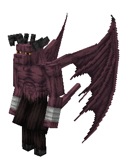
<figcaption>Source media</figcaption>
</figure>

<h2>Greater Daemon</h2>

&quot;Oooo its a big one!&quot;

Open reference →

</a>
</article>
<article class="reference-card" data-letter="H" data-search="hell caterpillar 2 - 4 hell-moth silk 1 medium quality magic crystal">
<a href="mobs-hell-caterpillar/" aria-label="Open Hell Caterpillar">
<figure class="reference-card-media reference-card-media--source">
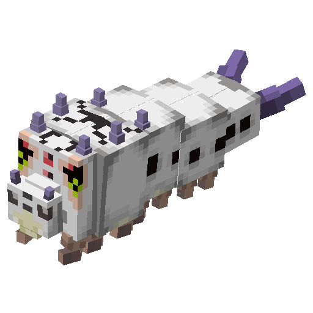
<figcaption>Source media</figcaption>
</figure>

<h2>Hell Caterpillar</h2>

2 - 4 Hell-Moth Silk 1 Medium Quality Magic Crystal

Open reference →

</a>
</article>
<article class="reference-card" data-letter="H" data-search="hell moth 2 - 8 hell-moth silk 1 medium quality magic crystal">
<a href="mobs-hell-moth/" aria-label="Open Hell Moth">
<figure class="reference-card-media reference-card-media--source">
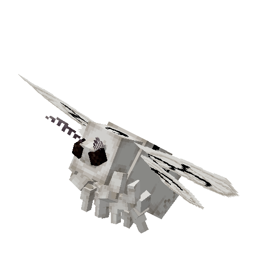
<figcaption>Source media</figcaption>
</figure>

<h2>Hell Moth</h2>

2 - 8 Hell-Moth Silk 1 Medium Quality Magic Crystal

Open reference →

</a>
</article>
<article class="reference-card" data-letter="H" data-search="holy cow the legendary and fabled holy cow is a reskin of a normal cow, resembling a normal one with its drops but having 2x the amount of health than a normal cow as well as 5x…">
<a href="mobs-holy-cow/" aria-label="Open Holy Cow">
<figure class="reference-card-media reference-card-media--theme">

<figcaption>TSR artwork</figcaption>
</figure>

<h2>Holy Cow</h2>

The legendary and fabled Holy Cow is a reskin of a normal cow, resembling a normal one with its drops but having 2x the amount of health than a normal cow as well as 5x…

Open reference →

</a>
</article>
<article class="reference-card" data-letter="H" data-search="horned bear 0 - 3 monster leather (c) 1 beast horn 1 medium quality magic crystal">
<a href="mobs-horned-bear/" aria-label="Open Horned Bear">
<figure class="reference-card-media reference-card-media--source">
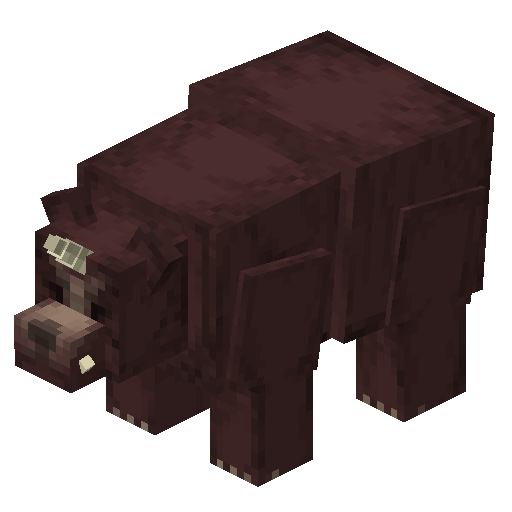
<figcaption>Source media</figcaption>
</figure>

<h2>Horned Bear</h2>

0 - 3 Monster Leather (C) 1 Beast Horn 1 Medium Quality Magic Crystal

Open reference →

</a>
</article>
<article class="reference-card" data-letter="H" data-search="horned rabbit 1 beast horn 1 - 2 monster leather (c) 1 medium quality magic crystal">
<a href="mobs-horned-rabbit/" aria-label="Open Horned Rabbit">
<figure class="reference-card-media reference-card-media--source">

<figcaption>Source media</figcaption>
</figure>

<h2>Horned Rabbit</h2>

1 Beast Horn 1 - 2 Monster Leather (C) 1 Medium Quality Magic Crystal

Open reference →

</a>
</article>
<article class="reference-card" data-letter="H" data-search="hound dog if a snake tailed variant is named, the summon hound dog skill is granted, allowing the user to summon it.">
<a href="mobs-hound-dog/" aria-label="Open Hound Dog">
<figure class="reference-card-media reference-card-media--source">
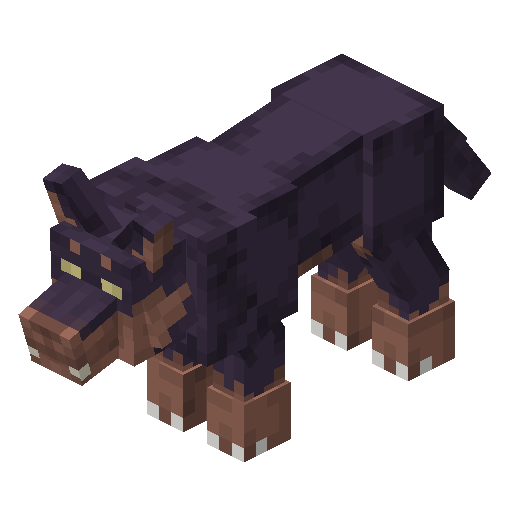
<figcaption>Source media</figcaption>
</figure>

<h2>Hound Dog</h2>

If a snake tailed variant is named, the Summon Hound Dog skill is granted, allowing the user to summon it.

Open reference →

</a>
</article>
<article class="reference-card" data-letter="H" data-search="hover lizard 1 - 2 monster leather (c) 1 medium quality magic crystal">
<a href="mobs-hover-lizard/" aria-label="Open Hover Lizard">
<figure class="reference-card-media reference-card-media--source">
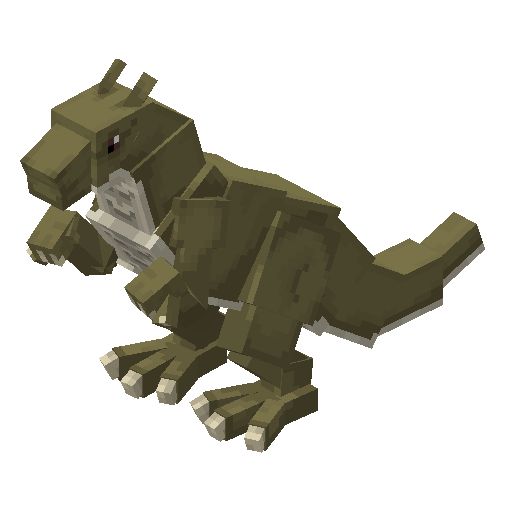
<figcaption>Source media</figcaption>
</figure>

<h2>Hover Lizard</h2>

1 - 2 Monster Leather (C) 1 Medium Quality Magic Crystal

Open reference →

</a>
</article>
<article class="reference-card" data-letter="K" data-search="kirara mizutani whenever an otherworlder spawns, it has a 12.6% chance for it to be kirara mizutani. (there is a 1/30 chance that an otherworlder spawns)">
<a href="mobs-kirara-mizutani/" aria-label="Open Kirara Mizutani">
<figure class="reference-card-media reference-card-media--source">
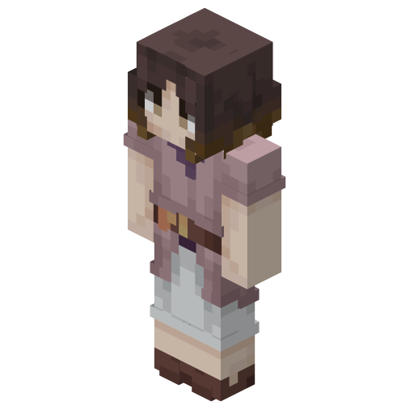
<figcaption>Source media</figcaption>
</figure>

<h2>Kirara Mizutani</h2>

Whenever an Otherworlder spawns, it has a 12.6% chance for it to be Kirara Mizutani. (There is a 1/30 chance that an otherworlder spawns)

Open reference →

</a>
</article>
<article class="reference-card" data-letter="K" data-search="knight spider 2 - 3 knight spider carapace 2 - 8 knight spider leg 1 high quality magic crystal">
<a href="mobs-knight-spider/" aria-label="Open Knight Spider">
<figure class="reference-card-media reference-card-media--source">
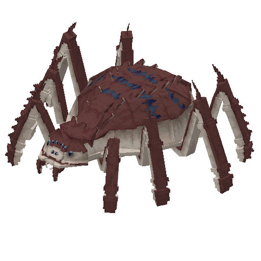
<figcaption>Source media</figcaption>
</figure>

<h2>Knight Spider</h2>

2 - 3 Knight Spider Carapace 2 - 8 Knight Spider Leg 1 High Quality Magic Crystal

Open reference →

</a>
</article>
<article class="reference-card" data-letter="K" data-search="kyoya tachibana whenever an otherworlder spawns, it has a 12.6% chance for it to be kyoya tachibana. (there is a 1/30 chance that an otherworlder spawns)">
<a href="mobs-kyoya-tachibana/" aria-label="Open Kyoya Tachibana">
<figure class="reference-card-media reference-card-media--source">
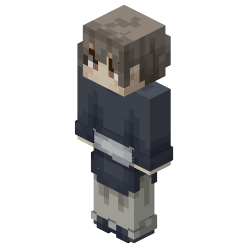
<figcaption>Source media</figcaption>
</figure>

<h2>Kyoya Tachibana</h2>

Whenever an Otherworlder spawns, it has a 12.6% chance for it to be Kyoya Tachibana. (There is a 1/30 chance that an otherworlder spawns)

Open reference →

</a>
</article>
<article class="reference-card" data-letter="L" data-search="leech lizard 1 - 2 monster leather (c) 1 medium quality magic crystal">
<a href="mobs-leech-lizard/" aria-label="Open Leech Lizard">
<figure class="reference-card-media reference-card-media--source">
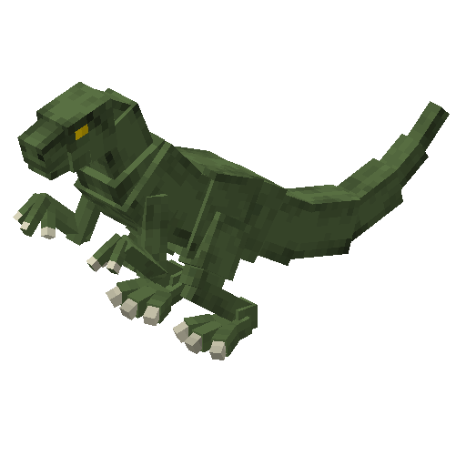
<figcaption>Source media</figcaption>
</figure>

<h2>Leech Lizard</h2>

1 - 2 Monster Leather (C) 1 Medium Quality Magic Crystal

Open reference →

</a>
</article>
<article class="reference-card" data-letter="L" data-search="lesser daemon awww its a small adorable goat...">
<a href="mobs-lesser-daemon/" aria-label="Open Lesser Daemon">
<figure class="reference-card-media reference-card-media--source">
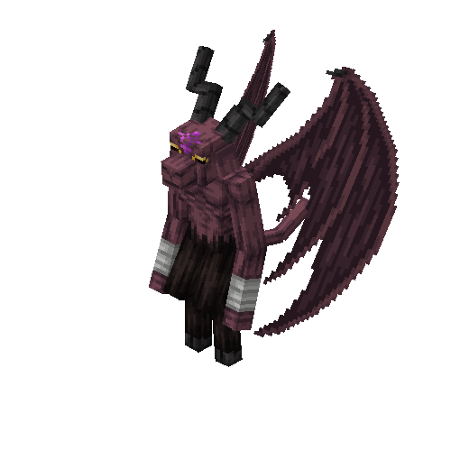
<figcaption>Source media</figcaption>
</figure>

<h2>Lesser Daemon</h2>

Awww its a small adorable goat...

Open reference →

</a>
</article>
<article class="reference-card" data-letter="L" data-search="lizardman lizardmen can only spawn in a lizardman village and cannot spawn outside a village. upon naming, it will evolve into dragonewt and gain the ability to fly. lizardmen…">
<a href="mobs-lizardman/" aria-label="Open Lizardman">
<figure class="reference-card-media reference-card-media--source">
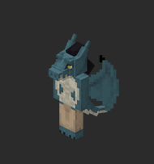
<figcaption>Source media</figcaption>
</figure>

<h2>Lizardman</h2>

Lizardmen can only spawn in a Lizardman Village and cannot spawn outside a village. Upon naming, it will evolve into Dragonewt and gain the ability to fly. Lizardmen…

Open reference →

</a>
</article>
<article class="reference-card" data-letter="M" data-search="mai furuki whenever an otherworlder spawns, it has a 12.3% chance for it to be mai furuki. (there is a 1/30 chance that an otherworlder spawns)">
<a href="mobs-mai-furuki/" aria-label="Open Mai Furuki">
<figure class="reference-card-media reference-card-media--source">
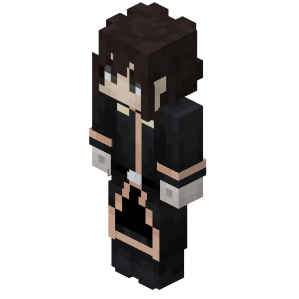
<figcaption>Source media</figcaption>
</figure>

<h2>Mai Furuki</h2>

Whenever an Otherworlder spawns, it has a 12.3% chance for it to be Mai Furuki. (There is a 1/30 chance that an otherworlder spawns)

Open reference →

</a>
</article>
<article class="reference-card" data-letter="M" data-search="mark lauren whenever an otherworlder spawns, it has a 12.5% chance for it to be mark lauren. (there is a 1/30 chance that an otherworlder spawns)">
<a href="mobs-mark-lauren/" aria-label="Open Mark Lauren">
<figure class="reference-card-media reference-card-media--source">
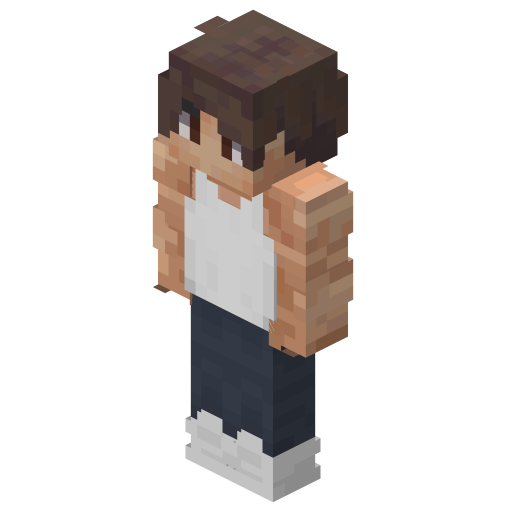
<figcaption>Source media</figcaption>
</figure>

<h2>Mark Lauren</h2>

Whenever an Otherworlder spawns, it has a 12.5% chance for it to be Mark Lauren. (There is a 1/30 chance that an otherworlder spawns)

Open reference →

</a>
</article>
<article class="reference-card" data-letter="M" data-search="megalodon a large flying shark like creature native to hell, they also appear as part of the charybdis fight.">
<a href="mobs-megalodon/" aria-label="Open Megalodon">
<figure class="reference-card-media reference-card-media--source">
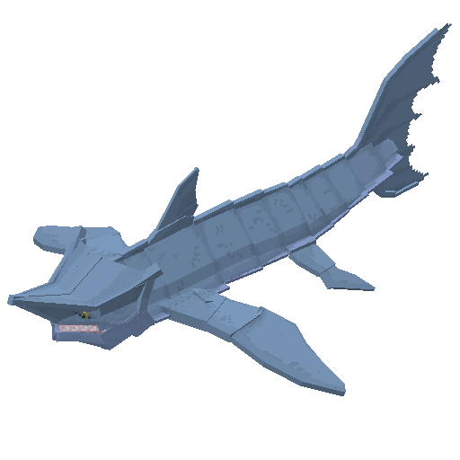
<figcaption>Source media</figcaption>
</figure>

<h2>Megalodon</h2>

A large flying shark like creature native to Hell, they also appear as part of the Charybdis fight.

Open reference →

</a>
</article>
<article class="reference-card" data-letter="M" data-search="memoires 0.1% chance to spawn in the elemental realm">
<a href="../../mysticism-reference/mobs/mobs-memoires/" aria-label="Open Memoires">
<figure class="reference-card-media reference-card-media--source">
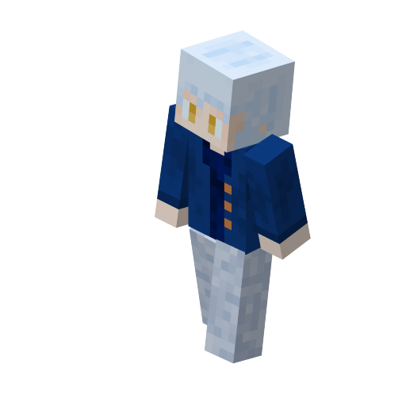
<figcaption>Source media</figcaption>
</figure>

<h2>Memoires</h2>

0.1% Chance to spawn in the Elemental Realm

Open reference →

</a>
</article>
<article class="reference-card" data-letter="M" data-search="metal slime 5 - 8 magic ore shard (affected by looting) 1 high quality magic crystal can be tamed with magic ore or pure magisteel nugget slime mobs takes 50% of the input physical…">
<a href="mobs-metal-slime/" aria-label="Open Metal Slime">
<figure class="reference-card-media reference-card-media--source">
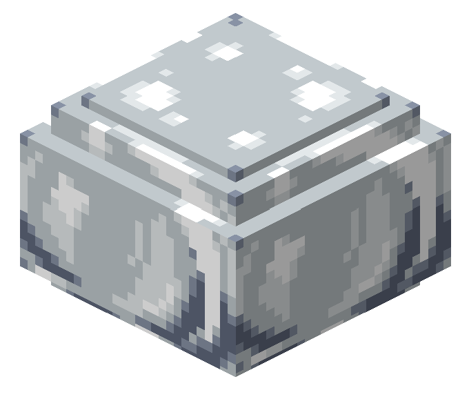
<figcaption>Source media</figcaption>
</figure>

<h2>Metal Slime</h2>

5 - 8 Magic Ore Shard (affected by looting) 1 High Quality Magic Crystal Can be tamed with Magic Ore or Pure Magisteel Nugget Slime mobs takes 50% of the input Physical…

Open reference →

</a>
</article>
<article class="reference-card" data-letter="M" data-search="mobs/giant ant this mob will destroy trees in pursuit of its enemy. if the player remains out of reach, it will spit poison, creating a lingering cloud of deadly poison where it hits.">
<a href="mobs-giant-ant/" aria-label="Open Mobs/Giant Ant">
<figure class="reference-card-media reference-card-media--source">
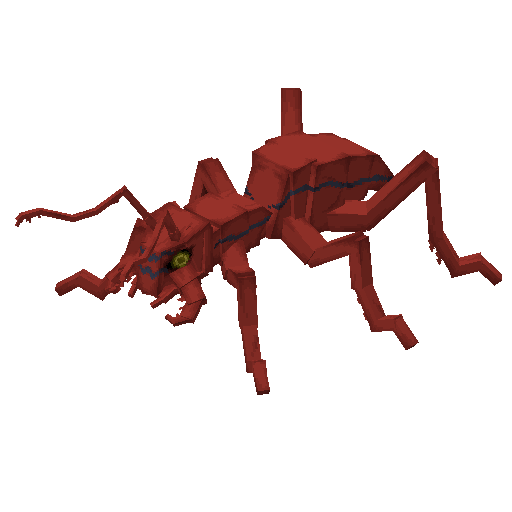
<figcaption>Source media</figcaption>
</figure>

<h2>Mobs/Giant Ant</h2>

This mob will destroy trees in pursuit of its enemy. If the player remains out of reach, it will spit poison, creating a lingering cloud of deadly poison where it hits.

Open reference →

</a>
</article>
<article class="reference-card" data-letter="M" data-search="mobs/giant bat 1 - 2 giant bat wing 1 - 4 raw giant bat meat 1 medium quality magic crystal">
<a href="mobs-giant-bat/" aria-label="Open Mobs/Giant Bat">
<figure class="reference-card-media reference-card-media--source">
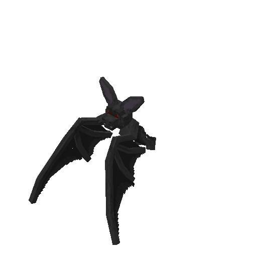
<figcaption>Source media</figcaption>
</figure>

<h2>Mobs/Giant Bat</h2>

1 - 2 Giant Bat Wing 1 - 4 Raw Giant Bat Meat 1 Medium Quality Magic Crystal

Open reference →

</a>
</article>
<article class="reference-card" data-letter="M" data-search="mobs/giant bear 1 - 3 monster leather (c) 1 medium quality magic crystal">
<a href="mobs-giant-bear/" aria-label="Open Mobs/Giant Bear">
<figure class="reference-card-media reference-card-media--source">
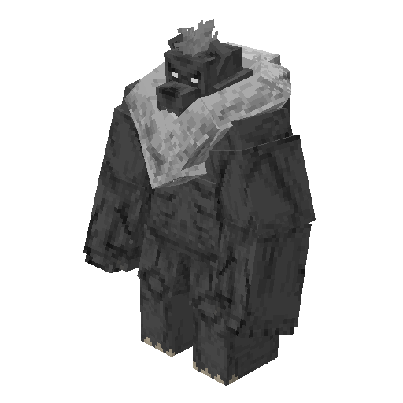
<figcaption>Source media</figcaption>
</figure>

<h2>Mobs/Giant Bear</h2>

1 - 3 Monster Leather (C) 1 Medium Quality Magic Crystal

Open reference →

</a>
</article>
<article class="reference-card" data-letter="M" data-search="mobs/giant salmon looting increases the amount of raw salmon and bones dropped by 0-3 per level.">
<a href="mobs-giant-salmon/" aria-label="Open Mobs/Giant Salmon">
<figure class="reference-card-media reference-card-media--source">
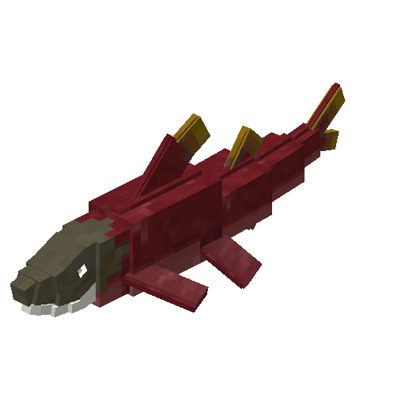
<figcaption>Source media</figcaption>
</figure>

<h2>Mobs/Giant Salmon</h2>

Looting increases the amount of Raw Salmon and Bones dropped by 0-3 per level.

Open reference →

</a>
</article>
<article class="reference-card" data-letter="M" data-search="mobs/landfish feed any type of fish">
<a href="mobs-landfish/" aria-label="Open Mobs/Landfish">
<figure class="reference-card-media reference-card-media--source">
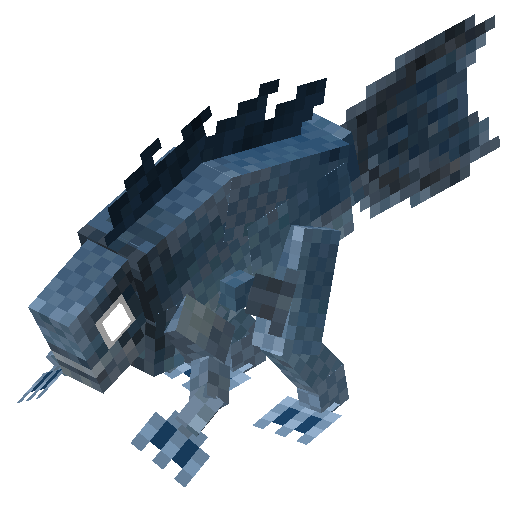
<figcaption>Source media</figcaption>
</figure>

<h2>Mobs/Landfish</h2>

Feed any type of Fish

Open reference →

</a>
</article>
<article class="reference-card" data-letter="O" data-search="okami a mob useful if player wants to be a tengu race.">
<a href="../../mysticism-reference/mobs/mobs-okami/" aria-label="Open Okami">
<figure class="reference-card-media reference-card-media--source">
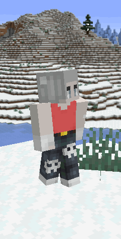
<figcaption>Source media</figcaption>
</figure>

<h2>Okami</h2>

A mob useful if player wants to be a Tengu race.

Open reference →

</a>
</article>
<article class="reference-card" data-letter="O" data-search="one eyed owl 1 eye of ender 0 - 1 invisible feather 1 low quality magic crystal">
<a href="mobs-one-eyed-owl/" aria-label="Open One Eyed Owl">
<figure class="reference-card-media reference-card-media--source">
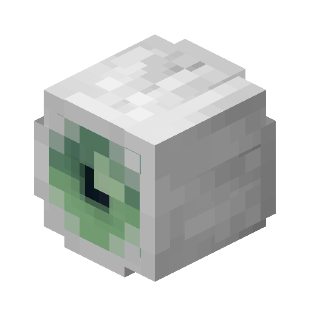
<figcaption>Source media</figcaption>
</figure>

<h2>One Eyed Owl</h2>

1 Eye of Ender 0 - 1 Invisible Feather 1 Low Quality Magic Crystal

Open reference →

</a>
</article>
<article class="reference-card" data-letter="O" data-search="orc when spawning, there is a 1/100 (1%) chance for an orc to spawn as a royal orc, and a 1/900 (0.11%) chance to spawn as the orc lord">
<a href="mobs-orc/" aria-label="Open Orc">
<figure class="reference-card-media reference-card-media--source">
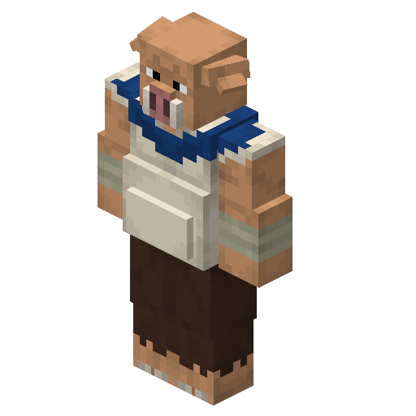
<figcaption>Source media</figcaption>
</figure>

<h2>Orc</h2>

When spawning, there is a 1/100 (1%) chance for an Orc to spawn as a Royal Orc, and a 1/900 (0.11%) chance to spawn as the Orc Lord

Open reference →

</a>
</article>
<article class="reference-card" data-letter="P" data-search="pegasus 0 - 2 feather (regular ones) (+1 to max with looting) 0 - 3 monster leather (c) (+1 to max with looting)">
<a href="mobs-pegasus/" aria-label="Open Pegasus">
<figure class="reference-card-media reference-card-media--source">
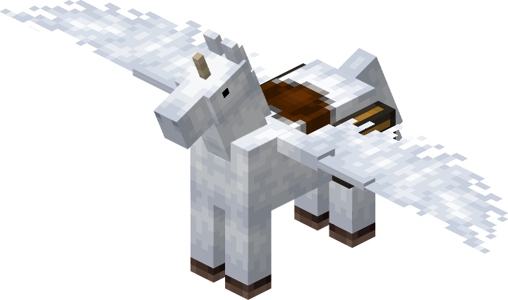
<figcaption>Source media</figcaption>
</figure>

<h2>Pegasus</h2>

0 - 2 Feather (regular ones) (+1 to max with looting) 0 - 3 Monster Leather (C) (+1 to max with looting)

Open reference →

</a>
</article>
<article class="reference-card" data-letter="S" data-search="salamander a medium spirit of fire, can be summoned with summon medium elemental">
<a href="mobs-salamander/" aria-label="Open Salamander">
<figure class="reference-card-media reference-card-media--source">
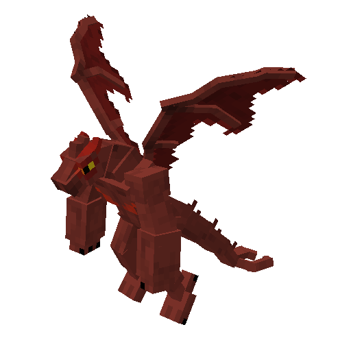
<figcaption>Source media</figcaption>
</figure>

<h2>Salamander</h2>

A medium spirit of fire, can be summoned with Summon Medium Elemental

Open reference →

</a>
</article>
<article class="reference-card" data-letter="S" data-search="shadow imp a medium spirit of darkness.">
<a href="../../mysticism-reference/mobs/mobs-shadow-imp/" aria-label="Open Shadow Imp">
<figure class="reference-card-media reference-card-media--source">
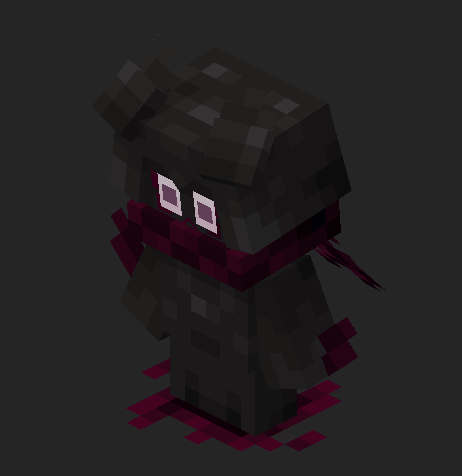
<figcaption>Source media</figcaption>
</figure>

<h2>Shadow Imp</h2>

A Medium Spirit of Darkness.

Open reference →

</a>
</article>
<article class="reference-card" data-letter="S" data-search="shin ryusei whenever an otherworlder spawns, it has a 12.5% chance for it to be shin ryusei. (there is a 1/30 chance that an otherworlder spawns)">
<a href="mobs-shin-ryusei/" aria-label="Open Shin Ryusei">
<figure class="reference-card-media reference-card-media--source">
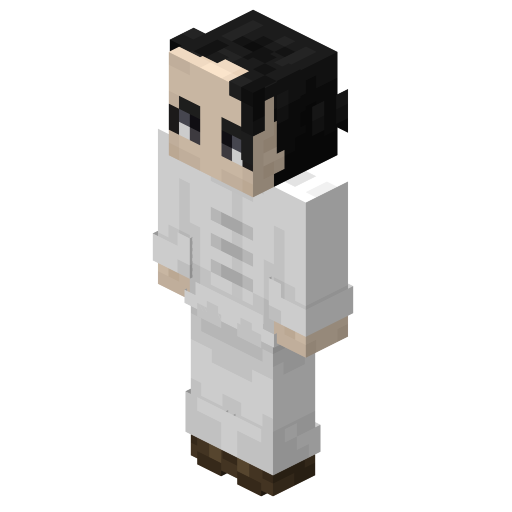
<figcaption>Source media</figcaption>
</figure>

<h2>Shin Ryusei</h2>

Whenever an Otherworlder spawns, it has a 12.5% chance for it to be Shin Ryusei. (There is a 1/30 chance that an otherworlder spawns)

Open reference →

</a>
</article>
<article class="reference-card" data-letter="S" data-search="shinji tanimura whenever an otherworlder spawns, it has a 12.4% chance for it to be shinji tanimura. (there is a 1/30 chance that an otherworlder spawns)">
<a href="mobs-shinji-tanimura/" aria-label="Open Shinji Tanimura">
<figure class="reference-card-media reference-card-media--source">
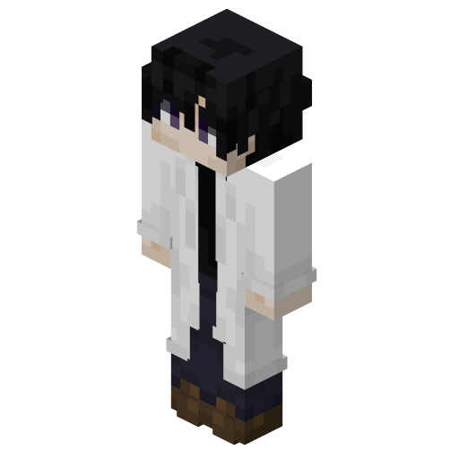
<figcaption>Source media</figcaption>
</figure>

<h2>Shinji Tanimura</h2>

Whenever an Otherworlder spawns, it has a 12.4% chance for it to be Shinji Tanimura. (There is a 1/30 chance that an otherworlder spawns)

Open reference →

</a>
</article>
<article class="reference-card" data-letter="S" data-search="shogo taguchi whenever an otherworlder spawns, it has a 12.6% chance for it to be shogo taguchi. (there is a 1/30 chance that an otherworlder spawns)">
<a href="mobs-shogo-taguchi/" aria-label="Open Shogo Taguchi">
<figure class="reference-card-media reference-card-media--source">
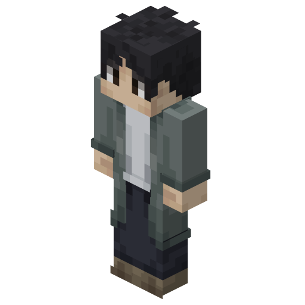
<figcaption>Source media</figcaption>
</figure>

<h2>Shogo Taguchi</h2>

Whenever an Otherworlder spawns, it has a 12.6% chance for it to be Shogo Taguchi. (There is a 1/30 chance that an otherworlder spawns)

Open reference →

</a>
</article>
<article class="reference-card" data-letter="S" data-search="sissie 0 - 1 sissie tooth 0 - 2 sissie fin 2 - 8 raw sissie meat 0 - 3 bones 1 high quality magic crystal">
<a href="mobs-sissie/" aria-label="Open Sissie">
<figure class="reference-card-media reference-card-media--source">
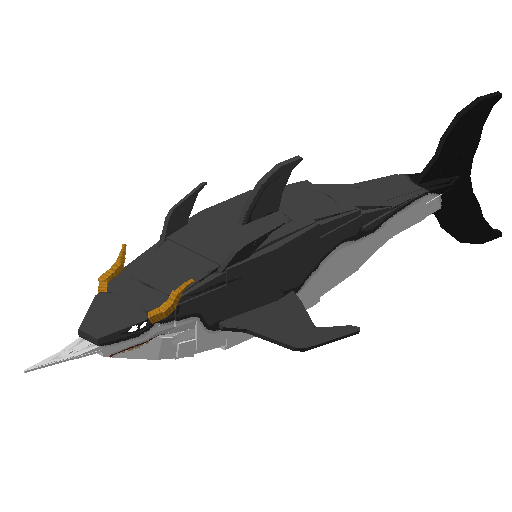
<figcaption>Source media</figcaption>
</figure>

<h2>Sissie</h2>

0 - 1 Sissie Tooth 0 - 2 Sissie Fin 2 - 8 Raw Sissie Meat 0 - 3 Bones 1 High Quality Magic Crystal

Open reference →

</a>
</article>
<article class="reference-card" data-letter="S" data-search="slime deals corrosion damage (but not corrosion effect) , so if you have corrosion resistance or nullification you can be immune to slime damage.">
<a href="mobs-slime/" aria-label="Open Slime">
<figure class="reference-card-media reference-card-media--source">
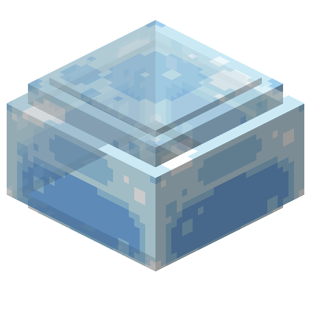
<figcaption>Source media</figcaption>
</figure>

<h2>Slime</h2>

Deals Corrosion damage (BUT NOT CORROSION EFFECT) , so if you have Corrosion Resistance or Nullification you can be immune to slime damage.

Open reference →

</a>
</article>
<article class="reference-card" data-letter="S" data-search="spear toro 0 - 2 spear toro fin 2 - 8 raw spear toro meat 0 - 2 bones 1 high quality magic crystal">
<a href="mobs-spear-toro/" aria-label="Open Spear Toro">
<figure class="reference-card-media reference-card-media--source">
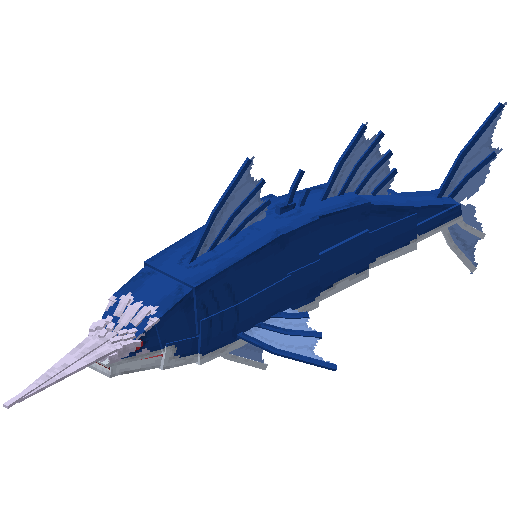
<figcaption>Source media</figcaption>
</figure>

<h2>Spear Toro</h2>

0 - 2 Spear Toro Fin 2 - 8 Raw Spear Toro Meat 0 - 2 Bones 1 High Quality Magic Crystal

Open reference →

</a>
</article>
<article class="reference-card" data-letter="T" data-search="tempest serpent 1 - 6 serpent scale 1 - 4 raw serpent meat 1 high quality magic crystal">
<a href="mobs-tempest-serpent/" aria-label="Open Tempest Serpent">
<figure class="reference-card-media reference-card-media--source">
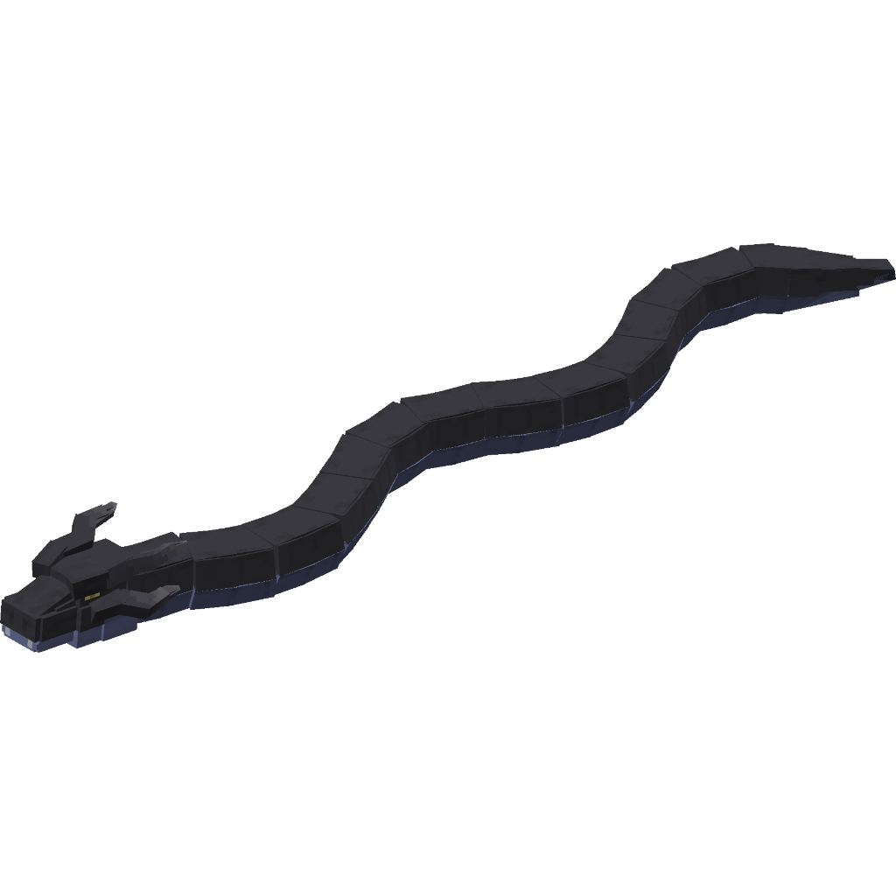
<figcaption>Source media</figcaption>
</figure>

<h2>Tempest Serpent</h2>

1 - 6 Serpent Scale 1 - 4 Raw Serpent Meat 1 High Quality Magic Crystal

Open reference →

</a>
</article>
<article class="reference-card" data-letter="U" data-search="unicorn 0 - 2 monster leather (b) 1 unicorn horn 1 medium quality magic crystal">
<a href="mobs-unicorn/" aria-label="Open Unicorn">
<figure class="reference-card-media reference-card-media--source">
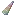
<figcaption>Source media</figcaption>
</figure>

<h2>Unicorn</h2>

0 - 2 Monster Leather (B) 1 Unicorn Horn 1 Medium Quality Magic Crystal

Open reference →

</a>
</article>
<article class="reference-card" data-letter="W" data-search="winged cat a medium spirit of space, can be summoned with summon medium elemental">
<a href="mobs-winged-cat/" aria-label="Open Winged Cat">
<figure class="reference-card-media reference-card-media--source">
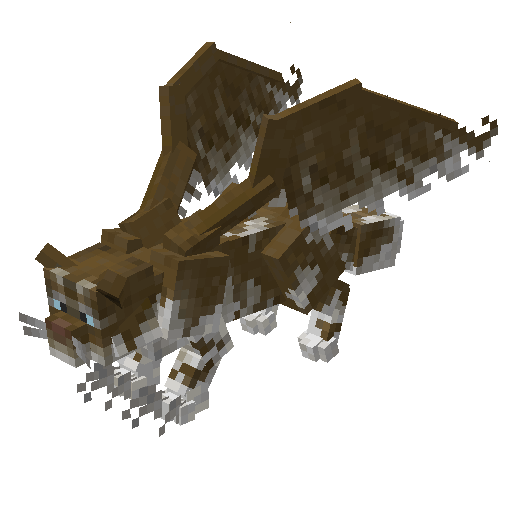
<figcaption>Source media</figcaption>
</figure>

<h2>Winged Cat</h2>

A medium spirit of space, can be summoned with Summon Medium Elemental

Open reference →

</a>
</article>
<article class="reference-card" data-letter="W" data-search="winged lion a medium spirit of light.">
<a href="../../mysticism-reference/mobs/mobs-winged-lion/" aria-label="Open Winged Lion">
<figure class="reference-card-media reference-card-media--source">
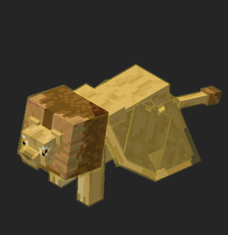
<figcaption>Source media</figcaption>
</figure>

<h2>Winged Lion</h2>

A Medium Spirit of Light.

Open reference →

</a>
</article>

No matching articles. Try a broader search.

</section>
