# Race Families

Choose a race family to see its connected evolution path and compare stage cards. Divine forms are advanced stages within these families, not a separate list of starting races.

<section class="reference-directory" data-reference-directory="races" data-reference-unit="race families">
<label class="reference-filter-label">Find a family or any evolution stage<input type="search" class="reference-filter-input" placeholder="Search Monkey, Divine Human, Wolf…" autocomplete="off"></label>

<article class="reference-card" data-search="angel angel archangel seraphim divine angel fallen angel cosmic deity chaotic deity" data-letter="A"><a href="angel/" aria-label="Open Angel evolution"><figure class="reference-card-media">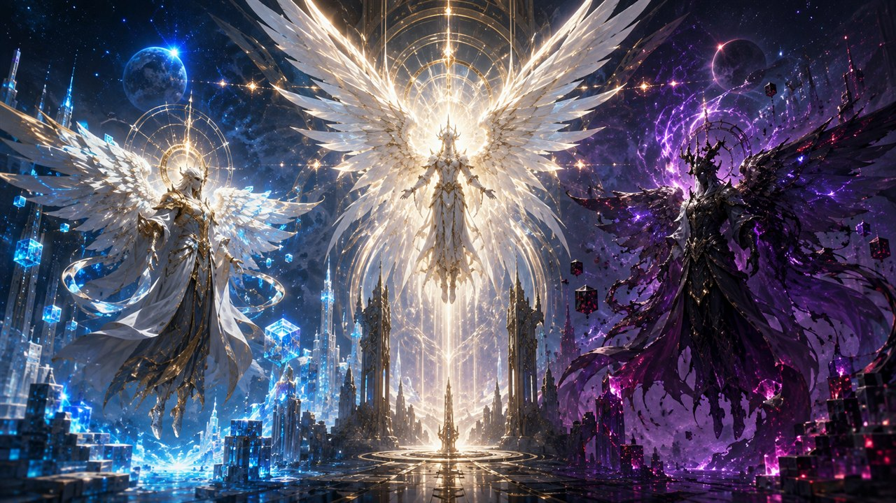</figure>
<h2>Angel</h2>
7 documented forms · Evolution map and stat cards

</a></article>
<article class="reference-card" data-search="ant ant divine fire ant fire ant hardshell ant fire ant insectar hardshell ant insectar earth soul insect hardshell ant savant divine hardshell ant" data-letter="A"><a href="families/ant/" aria-label="Open Ant evolution"><figure class="reference-card-media"></figure>
<h2>Ant</h2>
9 documented forms · Evolution map and stat cards

</a></article>
<article class="reference-card" data-search="attuned wyrm attuned wyrm lesser glacier wyrm lesser pyre wyrm greater glacier wyrm greater pyre wyrm frostcoil sea serpent rimefang drake scorchtail salamander sunfire lindwurm frostwrought leviathan rimeblight hydra scorchtalon wyvern" data-letter="A"><a href="families/attuned-wyrm/" aria-label="Open Attuned Wyrm evolution"><figure class="reference-card-media"></figure>
<h2>Attuned Wyrm</h2>
12 documented forms · Evolution map and stat cards

</a></article>
<article class="reference-card" data-search="beastfolk beastfolk beast lord spirit beast divine beast" data-letter="B"><a href="families/beastfolk/" aria-label="Open Beastfolk evolution"><figure class="reference-card-media">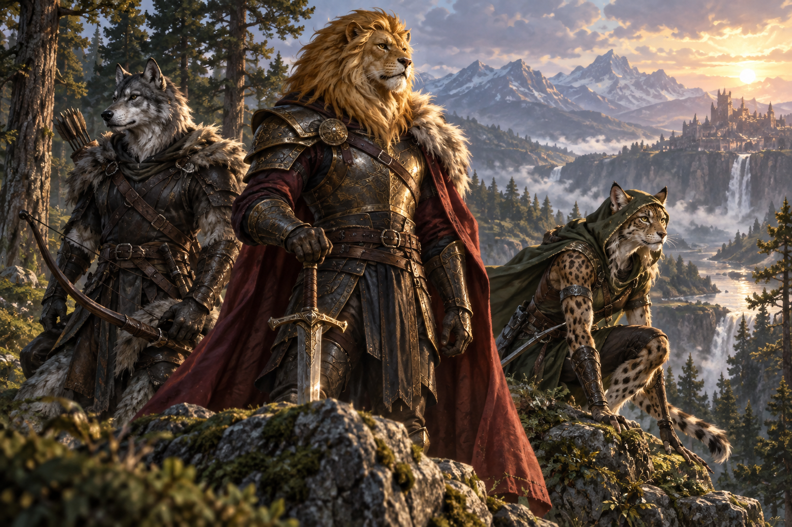</figure>
<h2>Beastfolk</h2>
4 documented forms · Evolution map and stat cards

</a></article>
<article class="reference-card" data-search="beetle beetle drone beetle stag beetle drone beetle insectar stag beetle insectar fantasy soul insect lightning soul insect stag beetle savant divine drone beetle divine stag beetle" data-letter="B"><a href="families/beetle/" aria-label="Open Beetle evolution"><figure class="reference-card-media"></figure>
<h2>Beetle</h2>
10 documented forms · Evolution map and stat cards

</a></article>
<article class="reference-card" data-search="centipede centipede blue centipede purple centipede yellow centipede blue centipede insectar purple centipede insectar yellow centipede insectar paralysis soul insect spatial soul insect water soul insect divine blue centipede divine purple centipede divine yellow centipede" data-letter="C"><a href="families/centipede/" aria-label="Open Centipede evolution"><figure class="reference-card-media"></figure>
<h2>Centipede</h2>
13 documented forms · Evolution map and stat cards

</a></article>
<article class="reference-card" data-search="direwolf direwolf black fang blue fang brown fang green fang guitar wolf light fang purple fang red fang scorch wolf blazing scorch wolf mystical black fang molten spirit wolf divine wolf" data-letter="D"><a href="families/direwolf/" aria-label="Open Direwolf evolution"><figure class="reference-card-media"></figure>
<h2>Direwolf</h2>
14 documented forms · Evolution map and stat cards

</a></article>
<article class="reference-card" data-search="djinn whisper djinn trickster djinn phantom djinn royal djinn wishbound djinn primordial djinn ascended djinn sovereign djinn infinite djinn omniversal djinn" data-letter="D"><a href="djinn/" aria-label="Open Djinn evolution"><figure class="reference-card-media">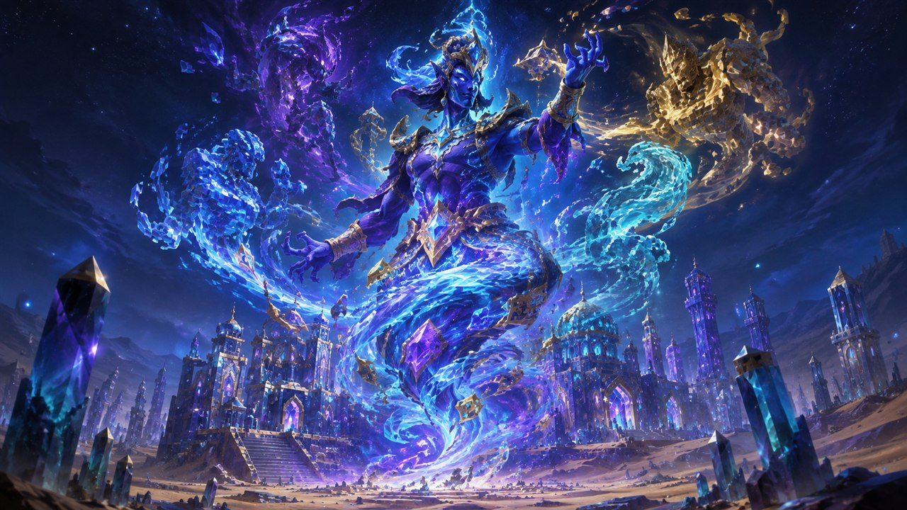</figure>
<h2>Djinn</h2>
10 documented forms · Evolution map and stat cards

</a></article>
<article class="reference-card" data-search="dragonoid dragonoid true dragonoid" data-letter="D"><a href="families/dragonoid/" aria-label="Open Dragonoid evolution"><figure class="reference-card-media"></figure>
<h2>Dragonoid</h2>
2 documented forms · Evolution map and stat cards

</a></article>
<article class="reference-card" data-search="dwarf dwarf enlightened dwarf dwarf saint divine dwarf" data-letter="D"><a href="families/dwarf/" aria-label="Open Dwarf evolution"><figure class="reference-card-media"></figure>
<h2>Dwarf</h2>
4 documented forms · Evolution map and stat cards

</a></article>
<article class="reference-card" data-search="elf elf enlightened elf elf saint divine elf" data-letter="E"><a href="families/elf/" aria-label="Open Elf evolution"><figure class="reference-card-media reference-card-media--portrait">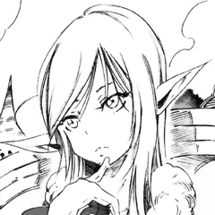</figure>
<h2>Elf</h2>
4 documented forms · Evolution map and stat cards

</a></article>
<article class="reference-card" data-search="forgotten forgotten remnant empty whole ascended revenant divine excelsius divine inferius" data-letter="F"><a href="families/forgotten/" aria-label="Open Forgotten evolution"><figure class="reference-card-media"></figure>
<h2>Forgotten</h2>
8 documented forms · Evolution map and stat cards

</a></article>
<article class="reference-card" data-search="frog frog giant frog poison toad swamp sovereign venom lord bog ancient frog monarch" data-letter="F"><a href="frog/" aria-label="Open Frog evolution"><figure class="reference-card-media">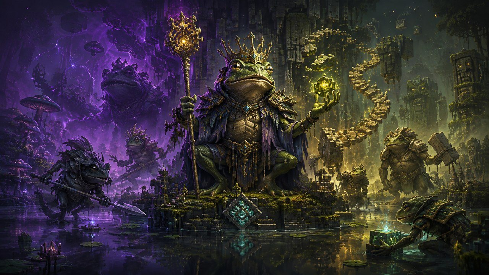</figure>
<h2>Frog</h2>
7 documented forms · Evolution map and stat cards

</a></article>
<article class="reference-card" data-search="gazer gazer spectator gazer mindwitness gauth beholder death tyrant" data-letter="G"><a href="gazer/" aria-label="Open Gazer evolution"><figure class="reference-card-media">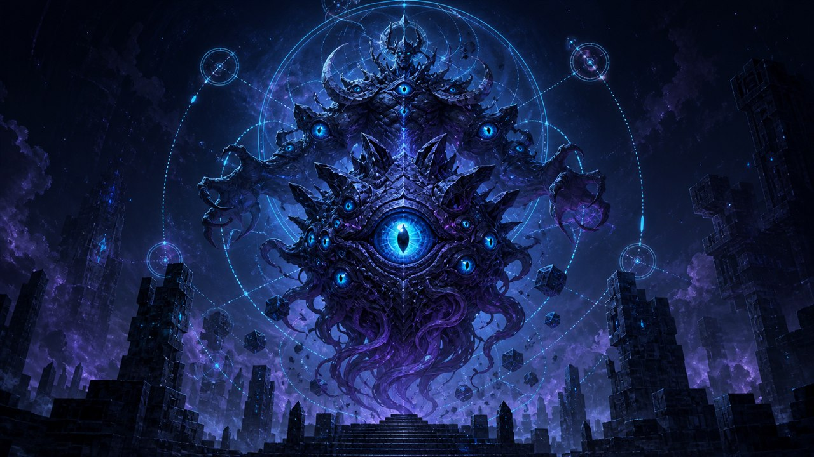</figure>
<h2>Gazer</h2>
6 documented forms · Evolution map and stat cards

</a></article>
<article class="reference-card" data-search="ghoul ghoul vampire vampire overcomer vampire lord divine vampire" data-letter="G"><a href="families/ghoul/" aria-label="Open Ghoul evolution"><figure class="reference-card-media">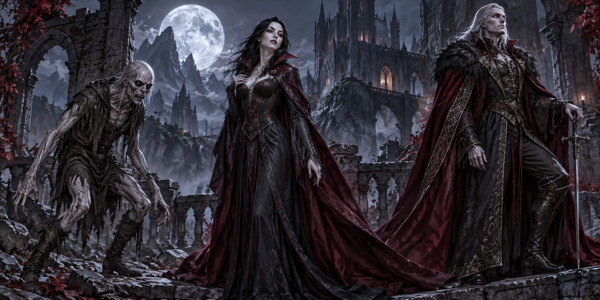</figure>
<h2>Ghoul</h2>
5 documented forms · Evolution map and stat cards

</a></article>
<article class="reference-card" data-search="giant giant ancient giant divine giant" data-letter="G"><a href="families/giant/" aria-label="Open Giant evolution"><figure class="reference-card-media">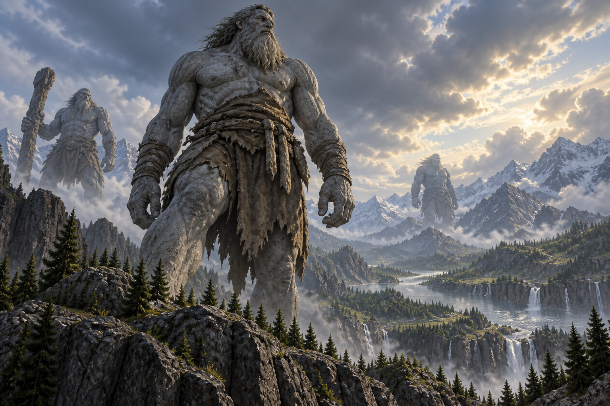</figure>
<h2>Giant</h2>
3 documented forms · Evolution map and stat cards

</a></article>
<article class="reference-card" data-search="goblin goblin hobgoblin enlightened hobgoblin hobgoblin saint" data-letter="G"><a href="families/goblin/" aria-label="Open Goblin evolution"><figure class="reference-card-media">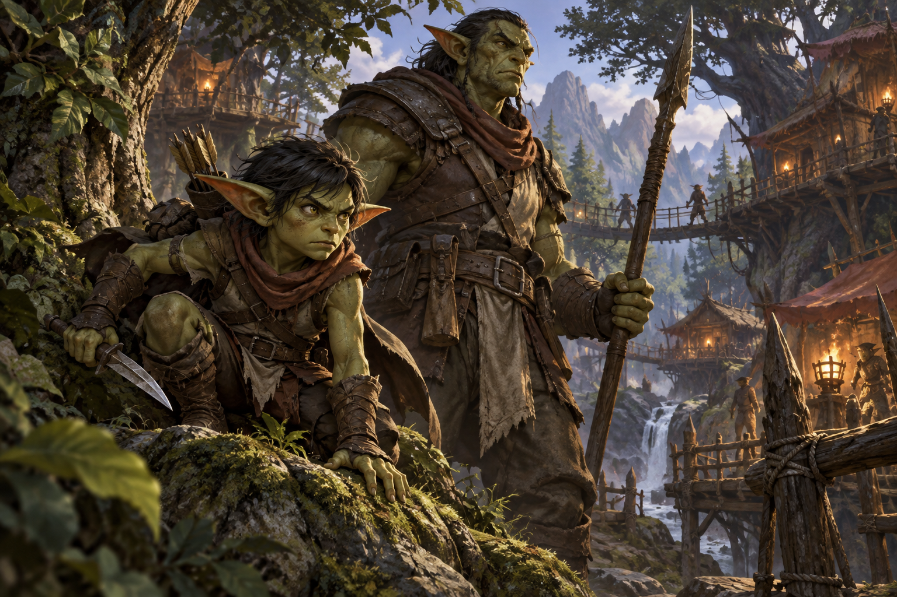</figure>
<h2>Goblin</h2>
4 documented forms · Evolution map and stat cards

</a></article>
<article class="reference-card" data-search="greater doll greater doll archdoll chaos doll daemon doll chaos metalloid devil doll" data-letter="G"><a href="families/greater-doll/" aria-label="Open Greater Doll evolution"><figure class="reference-card-media"></figure>
<h2>Greater Doll</h2>
6 documented forms · Evolution map and stat cards

</a></article>
<article class="reference-card" data-search="harpy harpy harpy queen spirit bird divine  bird" data-letter="H"><a href="families/harpy/" aria-label="Open Harpy evolution"><figure class="reference-card-media">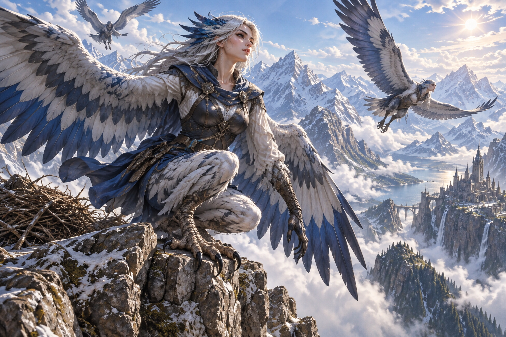</figure>
<h2>Harpy</h2>
4 documented forms · Evolution map and stat cards

</a></article>
<article class="reference-card" data-search="human human enlightened human human saint divine human" data-letter="H"><a href="families/human/" aria-label="Open Human evolution"><figure class="reference-card-media reference-card-media--portrait"></figure>
<h2>Human</h2>
4 documented forms · Evolution map and stat cards

</a></article>
<article class="reference-card" data-search="kitsune kitsune three tail fox six tail fox nine tail fox" data-letter="K"><a href="kitsune/" aria-label="Open Kitsune evolution"><figure class="reference-card-media">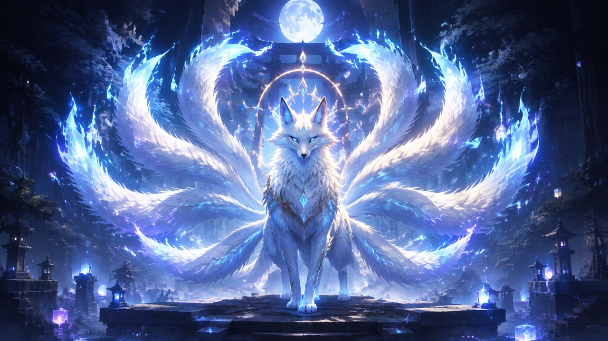</figure>
<h2>Kitsune</h2>
4 documented forms · Evolution map and stat cards

</a></article>
<article class="reference-card" data-search="lesser angel lesser angel fallen lesser angel greater angel arch angel fallen greater angel lesser fallen cherub fallen arch angel greater fallen arch fallen fallen cherub seraph fallen lord fallen" data-letter="L"><a href="families/lesser-angel/" aria-label="Open Lesser Angel evolution"><figure class="reference-card-media"></figure>
<h2>Lesser Angel</h2>
14 documented forms · Evolution map and stat cards

</a></article>
<article class="reference-card" data-search="lesser daemon lesser daemon greater daemon arch daemon daemon lord devil lord" data-letter="L"><a href="families/lesser-daemon/" aria-label="Open Lesser Daemon evolution"><figure class="reference-card-media"></figure>
<h2>Lesser Daemon</h2>
5 documented forms · Evolution map and stat cards

</a></article>
<article class="reference-card" data-search="lesser elemental lesser elemental medium elemental greater elemental elemental lord divine elemental" data-letter="L"><a href="families/lesser-elemental/" aria-label="Open Lesser Elemental evolution"><figure class="reference-card-media"></figure>
<h2>Lesser Elemental</h2>
5 documented forms · Evolution map and stat cards

</a></article>
<article class="reference-card" data-search="lizardman lizardman dragonewt true dragonewt divine dragon" data-letter="L"><a href="families/lizardman/" aria-label="Open Lizardman evolution"><figure class="reference-card-media reference-card-media--portrait">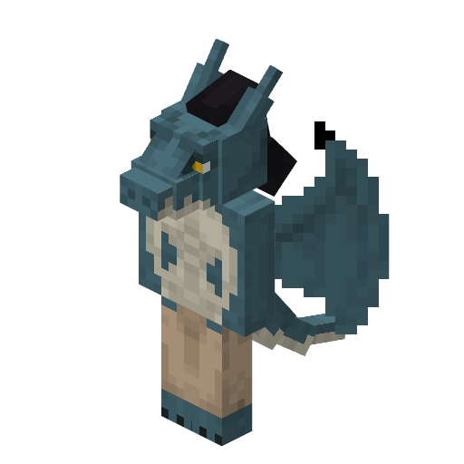</figure>
<h2>Lizardman</h2>
4 documented forms · Evolution map and stat cards

</a></article>
<article class="reference-card" data-search="mantis mantis lixivant mantis preying mantis lixivant mantis insectar preying mantis insectar corrosion soul insect lixivant mantis savant preying mantis savant steel soul insect divine lixivant mantis divine preying mantis" data-letter="M"><a href="families/mantis/" aria-label="Open Mantis evolution"><figure class="reference-card-media"></figure>
<h2>Mantis</h2>
11 documented forms · Evolution map and stat cards

</a></article>
<article class="reference-card" data-search="merfolk merfolk enlightened merfolk merfolk saint divine fish" data-letter="M"><a href="families/merfolk/" aria-label="Open Merfolk evolution"><figure class="reference-card-media reference-card-media--portrait"></figure>
<h2>Merfolk</h2>
4 documented forms · Evolution map and stat cards

</a></article>
<article class="reference-card" data-search="monkey monkey monkey warrior monkey martial artist monkey king divine king sun wukong" data-letter="M"><a href="monkey/" aria-label="Open Monkey evolution"><figure class="reference-card-media">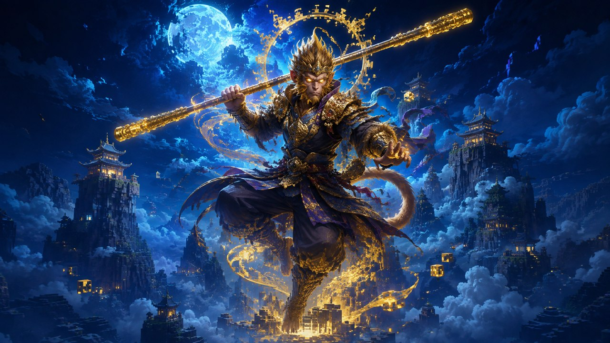</figure>
<h2>Monkey</h2>
6 documented forms · Evolution map and stat cards

</a></article>
<article class="reference-card" data-search="ogre ogre enlightened ogre kijin mystic oni wicked oni death oni spirit oni divine fighter divine oni" data-letter="O"><a href="families/ogre/" aria-label="Open Ogre evolution"><figure class="reference-card-media">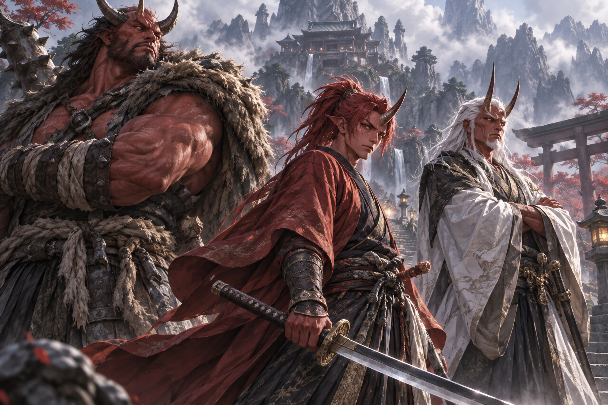</figure>
<h2>Ogre</h2>
9 documented forms · Evolution map and stat cards

</a></article>
<article class="reference-card" data-search="orc orc high orc orc lord orc disaster spirit boar divine boar" data-letter="O"><a href="families/orc/" aria-label="Open Orc evolution"><figure class="reference-card-media reference-card-media--portrait"></figure>
<h2>Orc</h2>
6 documented forms · Evolution map and stat cards

</a></article>
<article class="reference-card" data-search="phantom phantom field officer general staff officer mystic angel" data-letter="P"><a href="families/phantom/" aria-label="Open Phantom evolution"><figure class="reference-card-media"></figure>
<h2>Phantom</h2>
5 documented forms · Evolution map and stat cards

</a></article>
<article class="reference-card" data-search="restricted human restricted human restricted saint bound enlightenment heavenly restriction" data-letter="R"><a href="families/restricted-human/" aria-label="Open Restricted Human evolution"><figure class="reference-card-media"></figure>
<h2>Restricted Human</h2>
4 documented forms · Evolution map and stat cards

</a></article>
<article class="reference-card" data-search="scorpion poison soul insect scorpion loxodrome scorpion singularity scorpion loxodrome scorpion insectar singularity scorpion insectar gravity soul insect loxodrome scorpion savant singularity scorpion savant divine loxodrome scorpion divine singularity scorpion" data-letter="S"><a href="families/scorpion/" aria-label="Open Scorpion evolution"><figure class="reference-card-media"></figure>
<h2>Scorpion</h2>
11 documented forms · Evolution map and stat cards

</a></article>
<article class="reference-card" data-search="sculk worm sculk worm charged perforator molten perforator soul shrieker magma worm overloading worm warden enflamed aberration lightning aberration soul aberration dissonance deity reaper aberration violence deity" data-letter="S"><a href="families/sculk-worm/" aria-label="Open Sculk Worm evolution"><figure class="reference-card-media"></figure>
<h2>Sculk Worm</h2>
13 documented forms · Evolution map and stat cards

</a></article>
<article class="reference-card" data-search="slime slime metal slime demon slime god slime" data-letter="S"><a href="families/slime/" aria-label="Open Slime evolution"><figure class="reference-card-media reference-card-media--portrait">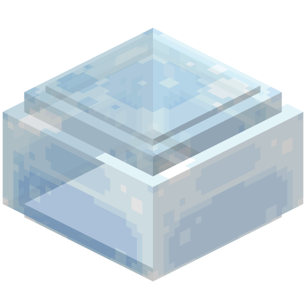</figure>
<h2>Slime</h2>
4 documented forms · Evolution map and stat cards

</a></article>
<article class="reference-card" data-search="tengu tengu race tengu saint divine tengu" data-letter="T"><a href="families/tengu/" aria-label="Open Tengu evolution"><figure class="reference-card-media"></figure>
<h2>Tengu</h2>
3 documented forms · Evolution map and stat cards

</a></article>
<article class="reference-card" data-search="wasp wasp army wasp queen wasp army wasp insectar queen wasp insectar star soul insect wind soul insect divine army wasp" data-letter="W"><a href="families/wasp/" aria-label="Open Wasp evolution"><figure class="reference-card-media"></figure>
<h2>Wasp</h2>
8 documented forms · Evolution map and stat cards

</a></article>
<article class="reference-card" data-search="wight wight wight king spirit skeleton divine skeleton" data-letter="W"><a href="families/wight/" aria-label="Open Wight evolution"><figure class="reference-card-media">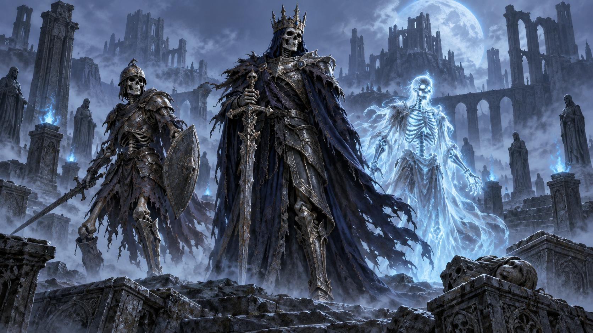</figure>
<h2>Wight</h2>
4 documented forms · Evolution map and stat cards

</a></article>

No race families match this search.
</section>

[Complete evolution relationship index](evolution-trees.md)
