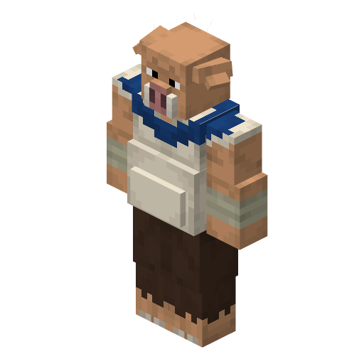
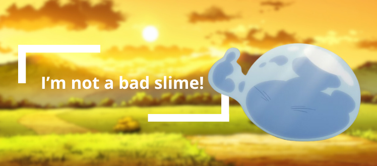

<section class="reference-directory" data-reference-directory="races">
<header class="reference-directory-hero reference-theme-evolution">

Tensura reference collection

<h1>Races</h1>

Playable and documented race forms and their evolution data.

<strong>266</strong> articles

</header>

<label class="reference-filter-label">
Filter this collection
<input type="search" class="reference-filter-input" placeholder="Search titles and summaries…" autocomplete="off">
</label>

<button type="button" class="is-active" data-letter="all" aria-pressed="true">All</button>
<button type="button" data-letter="A" aria-pressed="false">A</button>
<button type="button" data-letter="B" aria-pressed="false">B</button>
<button type="button" data-letter="C" aria-pressed="false">C</button>
<button type="button" data-letter="D" aria-pressed="false">D</button>
<button type="button" data-letter="E" aria-pressed="false">E</button>
<button type="button" data-letter="F" aria-pressed="false">F</button>
<button type="button" data-letter="G" aria-pressed="false">G</button>
<button type="button" data-letter="H" aria-pressed="false">H</button>
<button type="button" data-letter="I" aria-pressed="false">I</button>
<button type="button" data-letter="K" aria-pressed="false">K</button>
<button type="button" data-letter="L" aria-pressed="false">L</button>
<button type="button" data-letter="M" aria-pressed="false">M</button>
<button type="button" data-letter="O" aria-pressed="false">O</button>
<button type="button" data-letter="P" aria-pressed="false">P</button>
<button type="button" data-letter="Q" aria-pressed="false">Q</button>
<button type="button" data-letter="R" aria-pressed="false">R</button>
<button type="button" data-letter="S" aria-pressed="false">S</button>
<button type="button" data-letter="T" aria-pressed="false">T</button>
<button type="button" data-letter="V" aria-pressed="false">V</button>
<button type="button" data-letter="W" aria-pressed="false">W</button>
<button type="button" data-letter="Y" aria-pressed="false">Y</button>

Showing 266 of 266 articles

<article class="reference-card" data-letter="A" data-search="ancient giant &quot; back in my days people were taller&#x27;&quot;">
<a href="races-ancient-giant/" aria-label="Open Ancient Giant">
<figure class="reference-card-media reference-card-media--theme">

<figcaption>TSR artwork</figcaption>
</figure>

<h2>Ancient Giant</h2>

&quot; Back in my days people were taller&#x27;&quot;

Open reference →

</a>
</article>
<article class="reference-card" data-letter="A" data-search="angel angel fallen angel phantom">
<a href="../../mysticism-reference/races/angel/" aria-label="Open Angel">
<figure class="reference-card-media reference-card-media--source">

<figcaption>Source media</figcaption>
</figure>

<h2>Angel</h2>

Angel Fallen Angel Phantom

Open reference →

</a>
</article>
<article class="reference-card" data-letter="A" data-search="ant has 5 armor points. (if possible, move this to the specific stats section.)">
<a href="../../mysticism-reference/races/ant/" aria-label="Open Ant">
<figure class="reference-card-media reference-card-media--source">

<figcaption>Source media</figcaption>
</figure>

<h2>Ant</h2>

Has 5 armor points. (if possible, move this to the specific stats section.)

Open reference →

</a>
</article>
<article class="reference-card" data-letter="A" data-search="arch angel angelic flight - members of the angel race can enable or disable flight at will, depending if they are neither crouching or sprinting. toggling flight triggers a…">
<a href="../../mysticism-reference/races/arch-angel/" aria-label="Open Arch Angel">
<figure class="reference-card-media reference-card-media--source">

<figcaption>Source media</figcaption>
</figure>

<h2>Arch Angel</h2>

Angelic Flight - Members of the angel race can enable or disable flight at will, depending if they are neither crouching or sprinting. Toggling flight triggers a…

Open reference →

</a>
</article>
<article class="reference-card" data-letter="A" data-search="arch daemon &quot; i hear you like to arch it huh...? &quot;">
<a href="races-arch-daemon/" aria-label="Open Arch Daemon">
<figure class="reference-card-media reference-card-media--theme">

<figcaption>TSR artwork</figcaption>
</figure>

<h2>Arch Daemon</h2>

&quot; I hear you like to Arch it huh...? &quot;

Open reference →

</a>
</article>
<article class="reference-card" data-letter="A" data-search="arch fallen (remove this once finalized)">
<a href="../../mysticism-reference/races/arch-fallen/" aria-label="Open Arch Fallen">
<figure class="reference-card-media reference-card-media--source">

<figcaption>Source media</figcaption>
</figure>

<h2>Arch Fallen</h2>

(Remove this once finalized)

Open reference →

</a>
</article>
<article class="reference-card" data-letter="A" data-search="archdoll (remove this once finalized)">
<a href="../../mysticism-reference/races/archdoll/" aria-label="Open Archdoll">
<figure class="reference-card-media reference-card-media--source">

<figcaption>Source media</figcaption>
</figure>

<h2>Archdoll</h2>

(Remove this once finalized)

Open reference →

</a>
</article>
<article class="reference-card" data-letter="A" data-search="army wasp army wasp insectar - 100k ep">
<a href="../../mysticism-reference/races/army-wasp/" aria-label="Open Army Wasp">
<figure class="reference-card-media reference-card-media--source">

<figcaption>Source media</figcaption>
</figure>

<h2>Army Wasp</h2>

Army Wasp Insectar - 100K EP

Open reference →

</a>
</article>
<article class="reference-card" data-letter="A" data-search="army wasp insectar army wasp saint - 500k ep + defeat 4 bosses">
<a href="../../mysticism-reference/races/army-wasp-insectar/" aria-label="Open Army Wasp Insectar">
<figure class="reference-card-media reference-card-media--source">

<figcaption>Source media</figcaption>
</figure>

<h2>Army Wasp Insectar</h2>

Army Wasp Saint - 500K EP + Defeat 4 Bosses

Open reference →

</a>
</article>
<article class="reference-card" data-letter="A" data-search="army wasp saint (remove this once finalized)">
<a href="../../mysticism-reference/races/army-wasp-saint/" aria-label="Open Army Wasp Saint">
<figure class="reference-card-media reference-card-media--source">

<figcaption>Source media</figcaption>
</figure>

<h2>Army Wasp Saint</h2>

(Remove this once finalized)

Open reference →

</a>
</article>
<article class="reference-card" data-letter="A" data-search="ascended (remove this once finalized)">
<a href="../../mysticism-reference/races/ascended/" aria-label="Open Ascended">
<figure class="reference-card-media reference-card-media--source">

<figcaption>Source media</figcaption>
</figure>

<h2>Ascended</h2>

(Remove this once finalized)

Open reference →

</a>
</article>
<article class="reference-card" data-letter="A" data-search="attuned wyrm lesser glacier wyrm : consume 1 ice essence">
<a href="../../mysticism-reference/races/attuned-wyrm/" aria-label="Open Attuned Wyrm">
<figure class="reference-card-media reference-card-media--source">

<figcaption>Source media</figcaption>
</figure>

<h2>Attuned Wyrm</h2>

Lesser Glacier Wyrm : Consume 1 Ice Essence

Open reference →

</a>
</article>
<article class="reference-card" data-letter="B" data-search="beast lord spirit beast - 400,000 ep + defeat 4 bosses">
<a href="races-beast-lord/" aria-label="Open Beast Lord">
<figure class="reference-card-media reference-card-media--theme">

<figcaption>TSR artwork</figcaption>
</figure>

<h2>Beast Lord</h2>

Spirit Beast - 400,000 EP + Defeat 4 Bosses

Open reference →

</a>
</article>
<article class="reference-card" data-letter="B" data-search="beastfolk a race that can freely change bewteen their true animal form and a more human form. they possess immense physical prowess and regenerative capabilities that let them…">
<a href="races-beastfolk/" aria-label="Open Beastfolk">
<figure class="reference-card-media reference-card-media--theme">

<figcaption>TSR artwork</figcaption>
</figure>

<h2>Beastfolk</h2>

A race that can freely change bewteen their true animal form and a more human form. They possess immense physical prowess and regenerative capabilities that let them…

Open reference →

</a>
</article>
<article class="reference-card" data-letter="B" data-search="beetle only 1 block tall. stag beetle = 10,000 ep drone beetle = 10,000 ep 1.21.1 – ??? 1.19.2 – added to the game.">
<a href="../../mysticism-reference/races/beetle/" aria-label="Open Beetle">
<figure class="reference-card-media reference-card-media--source">

<figcaption>Source media</figcaption>
</figure>

<h2>Beetle</h2>

Only 1 block tall. Stag Beetle = 10,000 Ep Drone Beetle = 10,000 Ep 1.21.1 – ??? 1.19.2 – Added to the game.

Open reference →

</a>
</article>
<article class="reference-card" data-letter="B" data-search="black fang (remove this once finalized)">
<a href="../../mysticism-reference/races/black-fang/" aria-label="Open Black Fang">
<figure class="reference-card-media reference-card-media--source">

<figcaption>Source media</figcaption>
</figure>

<h2>Black Fang</h2>

(Remove this once finalized)

Open reference →

</a>
</article>
<article class="reference-card" data-letter="B" data-search="black spider black spider insectar - acquire 100k ep.">
<a href="../../mysticism-reference/races/black-spider/" aria-label="Open Black Spider">
<figure class="reference-card-media reference-card-media--source">

<figcaption>Source media</figcaption>
</figure>

<h2>Black Spider</h2>

Black Spider Insectar - Acquire 100K EP.

Open reference →

</a>
</article>
<article class="reference-card" data-letter="B" data-search="black spider insectar black spider saint - acquire 400k ep + defeat 4 bosses">
<a href="../../mysticism-reference/races/black-spider-insectar/" aria-label="Open Black Spider Insectar">
<figure class="reference-card-media reference-card-media--source">

<figcaption>Source media</figcaption>
</figure>

<h2>Black Spider Insectar</h2>

Black Spider Saint - Acquire 400K EP + Defeat 4 Bosses

Open reference →

</a>
</article>
<article class="reference-card" data-letter="B" data-search="black spider saint divine black spider - acquire 2m ep.">
<a href="../../mysticism-reference/races/black-spider-saint/" aria-label="Open Black Spider Saint">
<figure class="reference-card-media reference-card-media--source">

<figcaption>Source media</figcaption>
</figure>

<h2>Black Spider Saint</h2>

Divine Black Spider - Acquire 2m EP.

Open reference →

</a>
</article>
<article class="reference-card" data-letter="B" data-search="blaze wolf (remove this once finalized)">
<a href="../../mysticism-reference/races/blaze-wolf/" aria-label="Open Blaze Wolf">
<figure class="reference-card-media reference-card-media--source">

<figcaption>Source media</figcaption>
</figure>

<h2>Blaze Wolf</h2>

(Remove this once finalized)

Open reference →

</a>
</article>
<article class="reference-card" data-letter="B" data-search="blazing scorch wolf (remove this once finalized)">
<a href="../../mysticism-reference/races/blazing-scorch-wolf/" aria-label="Open Blazing Scorch Wolf">
<figure class="reference-card-media reference-card-media--source">

<figcaption>Source media</figcaption>
</figure>

<h2>Blazing Scorch Wolf</h2>

(Remove this once finalized)

Open reference →

</a>
</article>
<article class="reference-card" data-letter="B" data-search="blue centipede blue centipede insectar - 100k ep.">
<a href="../../mysticism-reference/races/blue-centipede/" aria-label="Open Blue Centipede">
<figure class="reference-card-media reference-card-media--source">

<figcaption>Source media</figcaption>
</figure>

<h2>Blue Centipede</h2>

Blue Centipede Insectar - 100K EP.

Open reference →

</a>
</article>
<article class="reference-card" data-letter="B" data-search="blue centipede insectar blue centipede saint - 400k ep + defeat 4 bosses">
<a href="../../mysticism-reference/races/blue-centipede-insectar/" aria-label="Open Blue Centipede Insectar">
<figure class="reference-card-media reference-card-media--source">

<figcaption>Source media</figcaption>
</figure>

<h2>Blue Centipede Insectar</h2>

Blue Centipede Saint - 400K EP + Defeat 4 Bosses

Open reference →

</a>
</article>
<article class="reference-card" data-letter="B" data-search="blue centipede saint divine blue centipede - 2m ep.">
<a href="../../mysticism-reference/races/blue-centipede-saint/" aria-label="Open Blue Centipede Saint">
<figure class="reference-card-media reference-card-media--source">

<figcaption>Source media</figcaption>
</figure>

<h2>Blue Centipede Saint</h2>

Divine Blue Centipede - 2M EP.

Open reference →

</a>
</article>
<article class="reference-card" data-letter="B" data-search="blue fang (remove this once finalized)">
<a href="../../mysticism-reference/races/blue-fang/" aria-label="Open Blue Fang">
<figure class="reference-card-media reference-card-media--source">

<figcaption>Source media</figcaption>
</figure>

<h2>Blue Fang</h2>

(Remove this once finalized)

Open reference →

</a>
</article>
<article class="reference-card" data-letter="B" data-search="bound enlightenment (remove this once finalized)">
<a href="../../mysticism-reference/races/bound-enlightenment/" aria-label="Open Bound Enlightenment">
<figure class="reference-card-media reference-card-media--source">

<figcaption>Source media</figcaption>
</figure>

<h2>Bound Enlightenment</h2>

(Remove this once finalized)

Open reference →

</a>
</article>
<article class="reference-card" data-letter="B" data-search="brown fang (remove this once finalized)">
<a href="../../mysticism-reference/races/brown-fang/" aria-label="Open Brown Fang">
<figure class="reference-card-media reference-card-media--source">

<figcaption>Source media</figcaption>
</figure>

<h2>Brown Fang</h2>

(Remove this once finalized)

Open reference →

</a>
</article>
<article class="reference-card" data-letter="C" data-search="centipede blue centipede - 10k ep.">
<a href="../../mysticism-reference/races/centipede/" aria-label="Open Centipede">
<figure class="reference-card-media reference-card-media--source">

<figcaption>Source media</figcaption>
</figure>

<h2>Centipede</h2>

Blue Centipede - 10K EP.

Open reference →

</a>
</article>
<article class="reference-card" data-letter="C" data-search="chaos doll (remove this once finalized)">
<a href="../../mysticism-reference/races/chaos-doll/" aria-label="Open Chaos Doll">
<figure class="reference-card-media reference-card-media--source">

<figcaption>Source media</figcaption>
</figure>

<h2>Chaos Doll</h2>

(Remove this once finalized)

Open reference →

</a>
</article>
<article class="reference-card" data-letter="C" data-search="chaos metalloid (remove this once finalized)">
<a href="../../mysticism-reference/races/chaos-metalloid/" aria-label="Open Chaos Metalloid">
<figure class="reference-card-media reference-card-media--source">

<figcaption>Source media</figcaption>
</figure>

<h2>Chaos Metalloid</h2>

(Remove this once finalized)

Open reference →

</a>
</article>
<article class="reference-card" data-letter="C" data-search="charged perforator no longer blind. overloading worm - 100k ep as a charged perforator. 1.21.1 – ported 1.19.2 – added to the game.">
<a href="../../mysticism-reference/races/charged-perforator/" aria-label="Open Charged Perforator">
<figure class="reference-card-media reference-card-media--source">

<figcaption>Source media</figcaption>
</figure>

<h2>Charged Perforator</h2>

No longer blind. Overloading Worm - 100K EP as a Charged Perforator. 1.21.1 – Ported 1.19.2 – Added to the game.

Open reference →

</a>
</article>
<article class="reference-card" data-letter="C" data-search="cherub angelic flight - members of the angel race can enable or disable flight at will, depending if they are neither crouching or sprinting. toggling flight triggers a…">
<a href="../../mysticism-reference/races/cherub/" aria-label="Open Cherub">
<figure class="reference-card-media reference-card-media--source">

<figcaption>Source media</figcaption>
</figure>

<h2>Cherub</h2>

Angelic Flight - Members of the angel race can enable or disable flight at will, depending if they are neither crouching or sprinting. Toggling flight triggers a…

Open reference →

</a>
</article>
<article class="reference-card" data-letter="C" data-search="corrosion soul insect divine lixivant mantis - acquire 2m ep.">
<a href="../../mysticism-reference/races/corrosion-soul-insect/" aria-label="Open Corrosion Soul Insect">
<figure class="reference-card-media reference-card-media--source">

<figcaption>Source media</figcaption>
</figure>

<h2>Corrosion Soul Insect</h2>

Divine Lixivant Mantis - Acquire 2M EP.

Open reference →

</a>
</article>
<article class="reference-card" data-letter="D" data-search="daemon doll (remove this once finalized)">
<a href="../../mysticism-reference/races/daemon-doll/" aria-label="Open Daemon Doll">
<figure class="reference-card-media reference-card-media--source">

<figcaption>Source media</figcaption>
</figure>

<h2>Daemon Doll</h2>

(Remove this once finalized)

Open reference →

</a>
</article>
<article class="reference-card" data-letter="D" data-search="daemon lord &quot; lord of the matt daemons &quot;">
<a href="races-daemon-lord/" aria-label="Open Daemon Lord">
<figure class="reference-card-media reference-card-media--theme">

<figcaption>TSR artwork</figcaption>
</figure>

<h2>Daemon Lord</h2>

&quot; Lord of the Matt Daemons &quot;

Open reference →

</a>
</article>
<article class="reference-card" data-letter="D" data-search="dark fang (remove this once finalized)">
<a href="../../mysticism-reference/races/dark-fang/" aria-label="Open Dark Fang">
<figure class="reference-card-media reference-card-media--source">

<figcaption>Source media</figcaption>
</figure>

<h2>Dark Fang</h2>

(Remove this once finalized)

Open reference →

</a>
</article>
<article class="reference-card" data-letter="D" data-search="death oni &quot; become deaf itself. what? what??? &quot;">
<a href="races-death-oni/" aria-label="Open Death Oni">
<figure class="reference-card-media reference-card-media--theme">

<figcaption>TSR artwork</figcaption>
</figure>

<h2>Death Oni</h2>

&quot; Become Deaf itself. What? WHAT??? &quot;

Open reference →

</a>
</article>
<article class="reference-card" data-letter="D" data-search="deathstalker scorpion deathstalker scorpion insectar - acquire 100k ep.">
<a href="../../mysticism-reference/races/deathstalker-scorpion/" aria-label="Open Deathstalker Scorpion">
<figure class="reference-card-media reference-card-media--source">

<figcaption>Source media</figcaption>
</figure>

<h2>Deathstalker Scorpion</h2>

Deathstalker Scorpion Insectar - Acquire 100K EP.

Open reference →

</a>
</article>
<article class="reference-card" data-letter="D" data-search="deathstalker scorpion insectar deathstalker scorpion saint - acquire 400k ep + defeat 4 bosses">
<a href="../../mysticism-reference/races/deathstalker-scorpion-insectar/" aria-label="Open Deathstalker Scorpion Insectar">
<figure class="reference-card-media reference-card-media--source">

<figcaption>Source media</figcaption>
</figure>

<h2>Deathstalker Scorpion Insectar</h2>

Deathstalker Scorpion Saint - Acquire 400K EP + Defeat 4 Bosses

Open reference →

</a>
</article>
<article class="reference-card" data-letter="D" data-search="deathstalker scorpion saint divine deathstalker scorpion - acquire 2m ep.">
<a href="../../mysticism-reference/races/deathstalker-scorpion-saint/" aria-label="Open Deathstalker Scorpion Saint">
<figure class="reference-card-media reference-card-media--source">

<figcaption>Source media</figcaption>
</figure>

<h2>Deathstalker Scorpion Saint</h2>

Divine Deathstalker Scorpion - Acquire 2M EP.

Open reference →

</a>
</article>
<article class="reference-card" data-letter="D" data-search="demon slime &quot; insert funny quip here &quot;">
<a href="races-demon-slime/" aria-label="Open Demon Slime">
<figure class="reference-card-media reference-card-media--theme">

<figcaption>TSR artwork</figcaption>
</figure>

<h2>Demon Slime</h2>

&quot; Insert Funny quip here &quot;

Open reference →

</a>
</article>
<article class="reference-card" data-letter="D" data-search="devil doll (remove this once finalized)">
<a href="../../mysticism-reference/races/devil-doll/" aria-label="Open Devil Doll">
<figure class="reference-card-media reference-card-media--source">

<figcaption>Source media</figcaption>
</figure>

<h2>Devil Doll</h2>

(Remove this once finalized)

Open reference →

</a>
</article>
<article class="reference-card" data-letter="D" data-search="devil lord creative flight (unaffected by magic jamming )">
<a href="races-devil-lord/" aria-label="Open Devil Lord">
<figure class="reference-card-media reference-card-media--theme">

<figcaption>TSR artwork</figcaption>
</figure>

<h2>Devil Lord</h2>

Creative flight (unaffected by Magic Jamming )

Open reference →

</a>
</article>
<article class="reference-card" data-letter="D" data-search="direwolf (remove this once finalized)">
<a href="../../mysticism-reference/races/direwolf/" aria-label="Open Direwolf">
<figure class="reference-card-media reference-card-media--source">

<figcaption>Source media</figcaption>
</figure>

<h2>Direwolf</h2>

(Remove this once finalized)

Open reference →

</a>
</article>
<article class="reference-card" data-letter="D" data-search="dissonance deity no longer blind. 1.21.1 – ported 1.19.2 – added to the game.">
<a href="../../mysticism-reference/races/dissonance-deity/" aria-label="Open Dissonance Deity">
<figure class="reference-card-media reference-card-media--source">

<figcaption>Source media</figcaption>
</figure>

<h2>Dissonance Deity</h2>

No longer blind. 1.21.1 – Ported 1.19.2 – Added to the game.

Open reference →

</a>
</article>
<article class="reference-card" data-letter="D" data-search="divine  bird i asked for some strong kfc but didn&#x27;t expect this the ultimate evolution of a harpy">
<a href="races-divine-bird/" aria-label="Open Divine  Bird">
<figure class="reference-card-media reference-card-media--theme">

<figcaption>TSR artwork</figcaption>
</figure>

<h2>Divine  Bird</h2>

I asked for some strong KFC but didn&#x27;t expect this The ultimate evolution of a harpy

Open reference →

</a>
</article>
<article class="reference-card" data-letter="D" data-search="divine army wasp (remove this once finalized)">
<a href="../../mysticism-reference/races/divine-army-wasp/" aria-label="Open Divine Army Wasp">
<figure class="reference-card-media reference-card-media--source">

<figcaption>Source media</figcaption>
</figure>

<h2>Divine Army Wasp</h2>

(Remove this once finalized)

Open reference →

</a>
</article>
<article class="reference-card" data-letter="D" data-search="divine beast &quot; this is one divine beast... ha &quot;">
<a href="races-divine-beast/" aria-label="Open Divine Beast">
<figure class="reference-card-media reference-card-media--theme">

<figcaption>TSR artwork</figcaption>
</figure>

<h2>Divine Beast</h2>

&quot; This is one Divine Beast... ha &quot;

Open reference →

</a>
</article>
<article class="reference-card" data-letter="D" data-search="divine black spider 1.21.1 – ??? 1.19.2 – added to the game.">
<a href="../../mysticism-reference/races/divine-black-spider/" aria-label="Open Divine Black Spider">
<figure class="reference-card-media reference-card-media--source">

<figcaption>Source media</figcaption>
</figure>

<h2>Divine Black Spider</h2>

1.21.1 – ??? 1.19.2 – Added to the game.

Open reference →

</a>
</article>
<article class="reference-card" data-letter="D" data-search="divine blue centipede 1.21.1 – ??? 1.19.2 – added to the game.">
<a href="../../mysticism-reference/races/divine-blue-centipede/" aria-label="Open Divine Blue Centipede">
<figure class="reference-card-media reference-card-media--source">

<figcaption>Source media</figcaption>
</figure>

<h2>Divine Blue Centipede</h2>

1.21.1 – ??? 1.19.2 – Added to the game.

Open reference →

</a>
</article>
<article class="reference-card" data-letter="D" data-search="divine boar &quot; sounds like one tasty boar... how divine &quot;">
<a href="races-divine-boar/" aria-label="Open Divine Boar">
<figure class="reference-card-media reference-card-media--theme">

<figcaption>TSR artwork</figcaption>
</figure>

<h2>Divine Boar</h2>

&quot; Sounds like one tasty boar... how divine &quot;

Open reference →

</a>
</article>
<article class="reference-card" data-letter="D" data-search="divine deathstalker scorpion 1.21.1 – ??? 1.19.2 – added to the game.">
<a href="../../mysticism-reference/races/divine-deathstalker-scorpion/" aria-label="Open Divine Deathstalker Scorpion">
<figure class="reference-card-media reference-card-media--source">

<figcaption>Source media</figcaption>
</figure>

<h2>Divine Deathstalker Scorpion</h2>

1.21.1 – ??? 1.19.2 – Added to the game.

Open reference →

</a>
</article>
<article class="reference-card" data-letter="D" data-search="divine dragon &quot; what? you want a cookie or something? &quot;">
<a href="races-divine-dragon/" aria-label="Open Divine Dragon">
<figure class="reference-card-media reference-card-media--theme">

<figcaption>TSR artwork</figcaption>
</figure>

<h2>Divine Dragon</h2>

&quot; what? you want a cookie or something? &quot;

Open reference →

</a>
</article>
<article class="reference-card" data-letter="D" data-search="divine drone beetle press [r] to activate flight. 1.21.1 – ??? 1.19.2 – added to the game.">
<a href="../../mysticism-reference/races/divine-drone-beetle/" aria-label="Open Divine Drone Beetle">
<figure class="reference-card-media reference-card-media--source">

<figcaption>Source media</figcaption>
</figure>

<h2>Divine Drone Beetle</h2>

Press [R] to activate flight. 1.21.1 – ??? 1.19.2 – Added to the game.

Open reference →

</a>
</article>
<article class="reference-card" data-letter="D" data-search="divine dwarf &quot; i&#x27;ve dug myself into a hole with these... oh well &quot;">
<a href="races-divine-dwarf/" aria-label="Open Divine Dwarf">
<figure class="reference-card-media reference-card-media--theme">

<figcaption>TSR artwork</figcaption>
</figure>

<h2>Divine Dwarf</h2>

&quot; I&#x27;ve dug myself into a hole with these... Oh well &quot;

Open reference →

</a>
</article>
<article class="reference-card" data-letter="D" data-search="divine elemental (remove this once finalized)">
<a href="../../mysticism-reference/races/divine-elemental/" aria-label="Open Divine Elemental">
<figure class="reference-card-media reference-card-media--source">

<figcaption>Source media</figcaption>
</figure>

<h2>Divine Elemental</h2>

(Remove this once finalized)

Open reference →

</a>
</article>
<article class="reference-card" data-letter="D" data-search="divine elf &quot; the upmost divinest elf &quot;">
<a href="races-divine-elf/" aria-label="Open Divine Elf">
<figure class="reference-card-media reference-card-media--theme">

<figcaption>TSR artwork</figcaption>
</figure>

<h2>Divine Elf</h2>

&quot; The Upmost Divinest Elf &quot;

Open reference →

</a>
</article>
<article class="reference-card" data-letter="D" data-search="divine empress wasp 1.21.1 – ??? 1.19.2 – added to the game.">
<a href="../../mysticism-reference/races/divine-empress-wasp/" aria-label="Open Divine Empress Wasp">
<figure class="reference-card-media reference-card-media--source">

<figcaption>Source media</figcaption>
</figure>

<h2>Divine Empress Wasp</h2>

1.21.1 – ??? 1.19.2 – Added to the game.

Open reference →

</a>
</article>
<article class="reference-card" data-letter="D" data-search="divine excelsius (remove this once finalized)">
<a href="../../mysticism-reference/races/divine-excelsius/" aria-label="Open Divine Excelsius">
<figure class="reference-card-media reference-card-media--source">

<figcaption>Source media</figcaption>
</figure>

<h2>Divine Excelsius</h2>

(Remove this once finalized)

Open reference →

</a>
</article>
<article class="reference-card" data-letter="D" data-search="divine fighter &quot; i am a fighter!!! &quot;">
<a href="races-divine-fighter/" aria-label="Open Divine Fighter">
<figure class="reference-card-media reference-card-media--theme">

<figcaption>TSR artwork</figcaption>
</figure>

<h2>Divine Fighter</h2>

&quot; I AM A FIGHTER!!! &quot;

Open reference →

</a>
</article>
<article class="reference-card" data-letter="D" data-search="divine fire ant 1.21.1 – ??? 1.19.2 – added to the game.">
<a href="../../mysticism-reference/races/divine-fire-ant/" aria-label="Open Divine Fire Ant">
<figure class="reference-card-media reference-card-media--source">

<figcaption>Source media</figcaption>
</figure>

<h2>Divine Fire Ant</h2>

1.21.1 – ??? 1.19.2 – Added to the game.

Open reference →

</a>
</article>
<article class="reference-card" data-letter="D" data-search="divine fish &quot; fish of the divine style &quot;">
<a href="races-divine-fish/" aria-label="Open Divine Fish">
<figure class="reference-card-media reference-card-media--theme">

<figcaption>TSR artwork</figcaption>
</figure>

<h2>Divine Fish</h2>

&quot; Fish of the Divine Style &quot;

Open reference →

</a>
</article>
<article class="reference-card" data-letter="D" data-search="divine foliaris (remove this once finalized)">
<a href="../../mysticism-reference/races/divine-foliaris/" aria-label="Open Divine Foliaris">
<figure class="reference-card-media reference-card-media--source">

<figcaption>Source media</figcaption>
</figure>

<h2>Divine Foliaris</h2>

(Remove this once finalized)

Open reference →

</a>
</article>
<article class="reference-card" data-letter="D" data-search="divine giant &quot; that one 6&#x27;4 nonchalant friend&#x27;&quot;">
<a href="races-divine-giant/" aria-label="Open Divine Giant">
<figure class="reference-card-media reference-card-media--theme">

<figcaption>TSR artwork</figcaption>
</figure>

<h2>Divine Giant</h2>

&quot; That one 6&#x27;4 nonchalant friend&#x27;&quot;

Open reference →

</a>
</article>
<article class="reference-card" data-letter="D" data-search="divine hardshell ant has 25 armor points. (if possible, move this to the specific stats section.)">
<a href="../../mysticism-reference/races/divine-hardshell-ant/" aria-label="Open Divine Hardshell Ant">
<figure class="reference-card-media reference-card-media--source">

<figcaption>Source media</figcaption>
</figure>

<h2>Divine Hardshell Ant</h2>

Has 25 armor points. (if possible, move this to the specific stats section.)

Open reference →

</a>
</article>
<article class="reference-card" data-letter="D" data-search="divine human &quot; i truly have reached divinity.. &quot;">
<a href="races-divine-human/" aria-label="Open Divine Human">
<figure class="reference-card-media reference-card-media--theme">

<figcaption>TSR artwork</figcaption>
</figure>

<h2>Divine Human</h2>

&quot; I truly have reached Divinity.. &quot;

Open reference →

</a>
</article>
<article class="reference-card" data-letter="D" data-search="divine inferius (remove this once finalized)">
<a href="../../mysticism-reference/races/divine-inferius/" aria-label="Open Divine Inferius">
<figure class="reference-card-media reference-card-media--source">

<figcaption>Source media</figcaption>
</figure>

<h2>Divine Inferius</h2>

(Remove this once finalized)

Open reference →

</a>
</article>
<article class="reference-card" data-letter="D" data-search="divine knight spider 1.21.1 – ??? 1.19.2 – added to the game.">
<a href="../../mysticism-reference/races/divine-knight-spider/" aria-label="Open Divine Knight Spider">
<figure class="reference-card-media reference-card-media--source">

<figcaption>Source media</figcaption>
</figure>

<h2>Divine Knight Spider</h2>

1.21.1 – ??? 1.19.2 – Added to the game.

Open reference →

</a>
</article>
<article class="reference-card" data-letter="D" data-search="divine lixivant mantis 1.21.1 – added to the game 1.19.2 – ???">
<a href="../../mysticism-reference/races/divine-lixivant-mantis/" aria-label="Open Divine Lixivant Mantis">
<figure class="reference-card-media reference-card-media--source">

<figcaption>Source media</figcaption>
</figure>

<h2>Divine Lixivant Mantis</h2>

1.21.1 – Added to the game 1.19.2 – ???

Open reference →

</a>
</article>
<article class="reference-card" data-letter="D" data-search="divine loxodrome scorpion 1.21.1 – ??? 1.19.2 – added to the game.">
<a href="../../mysticism-reference/races/divine-loxodrome-scorpion/" aria-label="Open Divine Loxodrome Scorpion">
<figure class="reference-card-media reference-card-media--source">

<figcaption>Source media</figcaption>
</figure>

<h2>Divine Loxodrome Scorpion</h2>

1.21.1 – ??? 1.19.2 – Added to the game.

Open reference →

</a>
</article>
<article class="reference-card" data-letter="D" data-search="divine oni hobgoblin saint gains strength , steel strength , self regeneration upon evolution">
<a href="races-divine-oni/" aria-label="Open Divine Oni">
<figure class="reference-card-media reference-card-media--theme">

<figcaption>TSR artwork</figcaption>
</figure>

<h2>Divine Oni</h2>

Hobgoblin Saint Gains Strength , Steel Strength , Self Regeneration upon Evolution

Open reference →

</a>
</article>
<article class="reference-card" data-letter="D" data-search="divine preying mantis 1.21.1 – added to the game 1.19.2 – ???">
<a href="../../mysticism-reference/races/divine-preying-mantis/" aria-label="Open Divine Preying Mantis">
<figure class="reference-card-media reference-card-media--source">

<figcaption>Source media</figcaption>
</figure>

<h2>Divine Preying Mantis</h2>

1.21.1 – Added to the game 1.19.2 – ???

Open reference →

</a>
</article>
<article class="reference-card" data-letter="D" data-search="divine purple centipede 1.21.1 – ??? 1.19.2 – added to the game.">
<a href="../../mysticism-reference/races/divine-purple-centipede/" aria-label="Open Divine Purple Centipede">
<figure class="reference-card-media reference-card-media--source">

<figcaption>Source media</figcaption>
</figure>

<h2>Divine Purple Centipede</h2>

1.21.1 – ??? 1.19.2 – Added to the game.

Open reference →

</a>
</article>
<article class="reference-card" data-letter="D" data-search="divine singularity scorpion 1.21.1 – ??? 1.19.2 – added to the game.">
<a href="../../mysticism-reference/races/divine-singularity-scorpion/" aria-label="Open Divine Singularity Scorpion">
<figure class="reference-card-media reference-card-media--source">

<figcaption>Source media</figcaption>
</figure>

<h2>Divine Singularity Scorpion</h2>

1.21.1 – ??? 1.19.2 – Added to the game.

Open reference →

</a>
</article>
<article class="reference-card" data-letter="D" data-search="divine skeleton &quot; even divinity won&#x27;t save your bony ahh &quot;">
<a href="races-divine-skeleton/" aria-label="Open Divine Skeleton">
<figure class="reference-card-media reference-card-media--theme">

<figcaption>TSR artwork</figcaption>
</figure>

<h2>Divine Skeleton</h2>

&quot; Even Divinity won&#x27;t save your bony ahh &quot;

Open reference →

</a>
</article>
<article class="reference-card" data-letter="D" data-search="divine stag beetle 1.21.1 – ??? 1.19.2 – added to the game.">
<a href="../../mysticism-reference/races/divine-stag-beetle/" aria-label="Open Divine Stag Beetle">
<figure class="reference-card-media reference-card-media--source">

<figcaption>Source media</figcaption>
</figure>

<h2>Divine Stag Beetle</h2>

1.21.1 – ??? 1.19.2 – Added to the game.

Open reference →

</a>
</article>
<article class="reference-card" data-letter="D" data-search="divine tengu the tengu race grants the ability to toggle flight when not crouching or sprinting. activating or deactivating flight plays a level-up sound effect.">
<a href="../../mysticism-reference/races/divine-tengu/" aria-label="Open Divine Tengu">
<figure class="reference-card-media reference-card-media--source">

<figcaption>Source media</figcaption>
</figure>

<h2>Divine Tengu</h2>

The Tengu Race grants the ability to toggle flight when not crouching or sprinting. Activating or deactivating flight plays a level-up sound effect.

Open reference →

</a>
</article>
<article class="reference-card" data-letter="D" data-search="divine vampire &quot; is it lonely at the top..? &quot;">
<a href="races-divine-vampire/" aria-label="Open Divine Vampire">
<figure class="reference-card-media reference-card-media--theme">

<figcaption>TSR artwork</figcaption>
</figure>

<h2>Divine Vampire</h2>

&quot; Is it Lonely at the Top..? &quot;

Open reference →

</a>
</article>
<article class="reference-card" data-letter="D" data-search="divine wolf (remove this once finalized)">
<a href="../../mysticism-reference/races/divine-wolf/" aria-label="Open Divine Wolf">
<figure class="reference-card-media reference-card-media--source">

<figcaption>Source media</figcaption>
</figure>

<h2>Divine Wolf</h2>

(Remove this once finalized)

Open reference →

</a>
</article>
<article class="reference-card" data-letter="D" data-search="divine yellow centipede 1.21.1 – ??? 1.19.2 – added to the game.">
<a href="../../mysticism-reference/races/divine-yellow-centipede/" aria-label="Open Divine Yellow Centipede">
<figure class="reference-card-media reference-card-media--source">

<figcaption>Source media</figcaption>
</figure>

<h2>Divine Yellow Centipede</h2>

1.21.1 – ??? 1.19.2 – Added to the game.

Open reference →

</a>
</article>
<article class="reference-card" data-letter="D" data-search="dragonewt &quot; ur not a dragon bro... &quot;">
<a href="races-dragonewt/" aria-label="Open Dragonewt">
<figure class="reference-card-media reference-card-media--theme">

<figcaption>TSR artwork</figcaption>
</figure>

<h2>Dragonewt</h2>

&quot; ur not a dragon bro... &quot;

Open reference →

</a>
</article>
<article class="reference-card" data-letter="D" data-search="dragonoid &quot; wannabe true dragon &quot;">
<a href="../../mysticism-reference/races/dragonoid/" aria-label="Open Dragonoid">
<figure class="reference-card-media reference-card-media--theme">

<figcaption>TSR artwork</figcaption>
</figure>

<h2>Dragonoid</h2>

&quot; Wannabe True Dragon &quot;

Open reference →

</a>
</article>
<article class="reference-card" data-letter="D" data-search="drone beetle creative flight drone beetle insectar = 100,000 ep 1.21.1 – ??? 1.19.2 – added to the game.">
<a href="../../mysticism-reference/races/drone-beetle/" aria-label="Open Drone Beetle">
<figure class="reference-card-media reference-card-media--source">

<figcaption>Source media</figcaption>
</figure>

<h2>Drone Beetle</h2>

Creative Flight Drone Beetle Insectar = 100,000 Ep 1.21.1 – ??? 1.19.2 – Added to the game.

Open reference →

</a>
</article>
<article class="reference-card" data-letter="D" data-search="drone beetle insectar creative flight drone beetle saint = 400,000 ep + 4 boss kills lightning soul insect = 400,000 ep + lightning manipulation 1.21.1 – ??? 1.19.2 – added to the game.">
<a href="../../mysticism-reference/races/drone-beetle-insectar/" aria-label="Open Drone Beetle Insectar">
<figure class="reference-card-media reference-card-media--source">

<figcaption>Source media</figcaption>
</figure>

<h2>Drone Beetle Insectar</h2>

Creative Flight Drone Beetle Saint = 400,000 Ep + 4 boss Kills Lightning Soul Insect = 400,000 Ep + Lightning Manipulation 1.21.1 – ??? 1.19.2 – Added to the game.

Open reference →

</a>
</article>
<article class="reference-card" data-letter="D" data-search="drone beetle saint creative flight divine drone beetle = 2,000,000 ep 1.21.1 – ??? 1.19.2 – added to the game.">
<a href="../../mysticism-reference/races/drone-beetle-saint/" aria-label="Open Drone Beetle Saint">
<figure class="reference-card-media reference-card-media--source">

<figcaption>Source media</figcaption>
</figure>

<h2>Drone Beetle Saint</h2>

Creative flight Divine Drone Beetle = 2,000,000 EP 1.21.1 – ??? 1.19.2 – Added to the game.

Open reference →

</a>
</article>
<article class="reference-card" data-letter="D" data-search="dryad (remove this once finalized)">
<a href="../../mysticism-reference/races/dryad/" aria-label="Open Dryad">
<figure class="reference-card-media reference-card-media--source">

<figcaption>Source media</figcaption>
</figure>

<h2>Dryad</h2>

(Remove this once finalized)

Open reference →

</a>
</article>
<article class="reference-card" data-letter="D" data-search="dwarf &quot; i am a dwarf and i&#x27;m digging a hole... diggy diggy hole. i&#x27;m digging a hole &quot; a sprite race descended from earth elementals. they possess an immense will and make for…">
<a href="races-dwarf/" aria-label="Open Dwarf">
<figure class="reference-card-media reference-card-media--theme">

<figcaption>TSR artwork</figcaption>
</figure>

<h2>Dwarf</h2>

&quot; I am a Dwarf and I&#x27;m digging a hole... Diggy Diggy hole. I&#x27;m digging a hole &quot; A sprite race descended from earth elementals. They possess an immense will and make for…

Open reference →

</a>
</article>
<article class="reference-card" data-letter="D" data-search="dwarf saint &quot; he&#x27;s beginning to belie... dig some more? what?! &quot;">
<a href="races-dwarf-saint/" aria-label="Open Dwarf Saint">
<figure class="reference-card-media reference-card-media--theme">

<figcaption>TSR artwork</figcaption>
</figure>

<h2>Dwarf Saint</h2>

&quot; He&#x27;s beginning to belie... dig some more? what?! &quot;

Open reference →

</a>
</article>
<article class="reference-card" data-letter="E" data-search="earth soul insect has 17 armor points. (if possible, move this to the specific stats section.)">
<a href="../../mysticism-reference/races/earth-soul-insect/" aria-label="Open Earth Soul Insect">
<figure class="reference-card-media reference-card-media--source">

<figcaption>Source media</figcaption>
</figure>

<h2>Earth Soul Insect</h2>

Has 17 armor points. (if possible, move this to the specific stats section.)

Open reference →

</a>
</article>
<article class="reference-card" data-letter="E" data-search="elemental lord spirits race are able to fly at all times. upon receiving this race, members are randomly assigned one of seven elemental affinities: darkness, earth, flame, light…">
<a href="../../mysticism-reference/races/elemental-lord/" aria-label="Open Elemental Lord">
<figure class="reference-card-media reference-card-media--source">

<figcaption>Source media</figcaption>
</figure>

<h2>Elemental Lord</h2>

Spirits Race are able to fly at all times. Upon receiving this race, members are randomly assigned one of seven elemental affinities: Darkness, Earth, Flame, Light…

Open reference →

</a>
</article>
<article class="reference-card" data-letter="E" data-search="elf &quot; we know why you went this race... &quot; a sprite race descended from wind elementals. they possess a fierce talent for elemental magic and are more in tune with nature…">
<a href="races-elf/" aria-label="Open Elf">
<figure class="reference-card-media reference-card-media--theme">

<figcaption>TSR artwork</figcaption>
</figure>

<h2>Elf</h2>

&quot; We know why you went this race... &quot; A Sprite race descended from wind elementals. They possess a fierce talent for elemental magic and are more in tune with nature…

Open reference →

</a>
</article>
<article class="reference-card" data-letter="E" data-search="elf saint &quot; i name you, the saintiest of elevens &quot;">
<a href="races-elf-saint/" aria-label="Open Elf Saint">
<figure class="reference-card-media reference-card-media--theme">

<figcaption>TSR artwork</figcaption>
</figure>

<h2>Elf Saint</h2>

&quot; I name you, The saintiest of elevens &quot;

Open reference →

</a>
</article>
<article class="reference-card" data-letter="E" data-search="empress wasp (remove this once finalized)">
<a href="../../mysticism-reference/races/empress-wasp/" aria-label="Open Empress Wasp">
<figure class="reference-card-media reference-card-media--source">

<figcaption>Source media</figcaption>
</figure>

<h2>Empress Wasp</h2>

(Remove this once finalized)

Open reference →

</a>
</article>
<article class="reference-card" data-letter="E" data-search="empty (remove this once finalized)">
<a href="../../mysticism-reference/races/empty/" aria-label="Open Empty">
<figure class="reference-card-media reference-card-media--source">

<figcaption>Source media</figcaption>
</figure>

<h2>Empty</h2>

(Remove this once finalized)

Open reference →

</a>
</article>
<article class="reference-card" data-letter="E" data-search="enflamed aberration is blind. violence deity - eat 30 blaze essence + 2m ep as enflamed aberration. 1.21.1 – ported 1.19.2 – added to the game.">
<a href="../../mysticism-reference/races/enflamed-aberration/" aria-label="Open Enflamed Aberration">
<figure class="reference-card-media reference-card-media--source">

<figcaption>Source media</figcaption>
</figure>

<h2>Enflamed Aberration</h2>

Is blind. Violence Deity - Eat 30 Blaze Essence + 2M EP as Enflamed Aberration. 1.21.1 – Ported 1.19.2 – Added to the game.

Open reference →

</a>
</article>
<article class="reference-card" data-letter="E" data-search="enlightened dwarf &quot; dwarf no longer dig hole, dwarf dig you. &quot;">
<a href="races-enlightened-dwarf/" aria-label="Open Enlightened Dwarf">
<figure class="reference-card-media reference-card-media--theme">

<figcaption>TSR artwork</figcaption>
</figure>

<h2>Enlightened Dwarf</h2>

&quot; Dwarf no longer dig hole, Dwarf Dig you. &quot;

Open reference →

</a>
</article>
<article class="reference-card" data-letter="E" data-search="enlightened elf &quot; blah blah honoured elf blah blah &quot;">
<a href="races-enlightened-elf/" aria-label="Open Enlightened Elf">
<figure class="reference-card-media reference-card-media--theme">

<figcaption>TSR artwork</figcaption>
</figure>

<h2>Enlightened Elf</h2>

&quot; Blah Blah Honoured Elf Blah Blah &quot;

Open reference →

</a>
</article>
<article class="reference-card" data-letter="E" data-search="enlightened hobgoblin hobgoblin saint - 400,000 ep + defeat 4 bosses">
<a href="races-enlightened-hobgoblin/" aria-label="Open Enlightened Hobgoblin">
<figure class="reference-card-media reference-card-media--theme">

<figcaption>TSR artwork</figcaption>
</figure>

<h2>Enlightened Hobgoblin</h2>

Hobgoblin Saint - 400,000 EP + Defeat 4 Bosses

Open reference →

</a>
</article>
<article class="reference-card" data-letter="E" data-search="enlightened human &quot; i alone am the honored one... &quot;">
<a href="races-enlightened-human/" aria-label="Open Enlightened Human">
<figure class="reference-card-media reference-card-media--theme">

<figcaption>TSR artwork</figcaption>
</figure>

<h2>Enlightened Human</h2>

&quot; I alone am the honored one... &quot;

Open reference →

</a>
</article>
<article class="reference-card" data-letter="E" data-search="enlightened merfolk &quot; the honoured... fish? &quot;">
<a href="races-enlightened-merfolk/" aria-label="Open Enlightened Merfolk">
<figure class="reference-card-media reference-card-media--theme">

<figcaption>TSR artwork</figcaption>
</figure>

<h2>Enlightened Merfolk</h2>

&quot; The honoured... fish? &quot;

Open reference →

</a>
</article>
<article class="reference-card" data-letter="E" data-search="enlightened ogre &quot; this race has way too many evolutions... &quot;">
<a href="races-enlightened-ogre/" aria-label="Open Enlightened Ogre">
<figure class="reference-card-media reference-card-media--source">

<figcaption>Source media</figcaption>
</figure>

<h2>Enlightened Ogre</h2>

&quot; This race has way too many evolutions... &quot;

Open reference →

</a>
</article>
<article class="reference-card" data-letter="F" data-search="fallen (remove this once finalized)">
<a href="../../mysticism-reference/races/fallen/" aria-label="Open Fallen">
<figure class="reference-card-media reference-card-media--source">

<figcaption>Source media</figcaption>
</figure>

<h2>Fallen</h2>

(Remove this once finalized)

Open reference →

</a>
</article>
<article class="reference-card" data-letter="F" data-search="fallen arch angel (remove this once finalized)">
<a href="../../mysticism-reference/races/fallen-arch-angel/" aria-label="Open Fallen Arch Angel">
<figure class="reference-card-media reference-card-media--source">

<figcaption>Source media</figcaption>
</figure>

<h2>Fallen Arch Angel</h2>

(Remove this once finalized)

Open reference →

</a>
</article>
<article class="reference-card" data-letter="F" data-search="fallen cherub (remove this once finalized)">
<a href="../../mysticism-reference/races/fallen-cherub/" aria-label="Open Fallen Cherub">
<figure class="reference-card-media reference-card-media--source">

<figcaption>Source media</figcaption>
</figure>

<h2>Fallen Cherub</h2>

(Remove this once finalized)

Open reference →

</a>
</article>
<article class="reference-card" data-letter="F" data-search="fallen greater angel creative flight no longer requires a body. cannot pray to light spirits. fallen arch angel - 140kep as a fallen greater angel. greater fallen - using a darkness core as…">
<a href="../../mysticism-reference/races/fallen-greater-angel/" aria-label="Open Fallen Greater Angel">
<figure class="reference-card-media reference-card-media--source">

<figcaption>Source media</figcaption>
</figure>

<h2>Fallen Greater Angel</h2>

Creative Flight No longer requires a body. Cannot pray to Light Spirits. Fallen Arch Angel - 140KEP as a Fallen Greater Angel. Greater Fallen - Using a Darkness Core as…

Open reference →

</a>
</article>
<article class="reference-card" data-letter="F" data-search="fallen lesser angel (remove this once finalized)">
<a href="../../mysticism-reference/races/fallen-lesser-angel/" aria-label="Open Fallen Lesser Angel">
<figure class="reference-card-media reference-card-media--source">

<figcaption>Source media</figcaption>
</figure>

<h2>Fallen Lesser Angel</h2>

(Remove this once finalized)

Open reference →

</a>
</article>
<article class="reference-card" data-letter="F" data-search="fallen lord (remove this once finalized)">
<a href="../../mysticism-reference/races/fallen-lord/" aria-label="Open Fallen Lord">
<figure class="reference-card-media reference-card-media--source">

<figcaption>Source media</figcaption>
</figure>

<h2>Fallen Lord</h2>

(Remove this once finalized)

Open reference →

</a>
</article>
<article class="reference-card" data-letter="F" data-search="fallen seraphim (remove this once finalized)">
<a href="../../mysticism-reference/races/fallen-seraphim/" aria-label="Open Fallen Seraphim">
<figure class="reference-card-media reference-card-media--source">

<figcaption>Source media</figcaption>
</figure>

<h2>Fallen Seraphim</h2>

(Remove this once finalized)

Open reference →

</a>
</article>
<article class="reference-card" data-letter="F" data-search="fantasy soul insect divine stag beetle = 2,000,000 ep 1.21.1 – ??? 1.19.2 – added to the game.">
<a href="../../mysticism-reference/races/fantasy-soul-insect/" aria-label="Open Fantasy Soul Insect">
<figure class="reference-card-media reference-card-media--source">

<figcaption>Source media</figcaption>
</figure>

<h2>Fantasy Soul Insect</h2>

Divine Stag Beetle = 2,000,000 Ep 1.21.1 – ??? 1.19.2 – Added to the game.

Open reference →

</a>
</article>
<article class="reference-card" data-letter="F" data-search="field officer (remove this once finalized)">
<a href="../../mysticism-reference/races/field-officer/" aria-label="Open Field Officer">
<figure class="reference-card-media reference-card-media--source">

<figcaption>Source media</figcaption>
</figure>

<h2>Field Officer</h2>

(Remove this once finalized)

Open reference →

</a>
</article>
<article class="reference-card" data-letter="F" data-search="fire ant has 7 armor points. (if possible, move this to the specific stats section.)">
<a href="../../mysticism-reference/races/fire-ant/" aria-label="Open Fire Ant">
<figure class="reference-card-media reference-card-media--source">

<figcaption>Source media</figcaption>
</figure>

<h2>Fire Ant</h2>

Has 7 armor points. (if possible, move this to the specific stats section.)

Open reference →

</a>
</article>
<article class="reference-card" data-letter="F" data-search="fire ant insectar fire ant saint - 400k ep + defeat 4 bosses">
<a href="../../mysticism-reference/races/fire-ant-insectar/" aria-label="Open Fire Ant Insectar">
<figure class="reference-card-media reference-card-media--source">

<figcaption>Source media</figcaption>
</figure>

<h2>Fire Ant Insectar</h2>

Fire Ant Saint - 400K EP + Defeat 4 Bosses

Open reference →

</a>
</article>
<article class="reference-card" data-letter="F" data-search="fire ant saint divine fire ant - 2 million ep">
<a href="../../mysticism-reference/races/fire-ant-saint/" aria-label="Open Fire Ant Saint">
<figure class="reference-card-media reference-card-media--source">

<figcaption>Source media</figcaption>
</figure>

<h2>Fire Ant Saint</h2>

Divine Fire Ant - 2 Million EP

Open reference →

</a>
</article>
<article class="reference-card" data-letter="F" data-search="flame soul ant divine fire ant - 2 million ep">
<a href="../../mysticism-reference/races/flame-soul-ant/" aria-label="Open Flame Soul Ant">
<figure class="reference-card-media reference-card-media--source">

<figcaption>Source media</figcaption>
</figure>

<h2>Flame Soul Ant</h2>

Divine Fire Ant - 2 Million EP

Open reference →

</a>
</article>
<article class="reference-card" data-letter="F" data-search="forgotten (remove this once finalized)">
<a href="../../mysticism-reference/races/forgotten/" aria-label="Open Forgotten">
<figure class="reference-card-media reference-card-media--source">

<figcaption>Source media</figcaption>
</figure>

<h2>Forgotten</h2>

(Remove this once finalized)

Open reference →

</a>
</article>
<article class="reference-card" data-letter="F" data-search="frostcoil sea serpent frostwrought leviathan - have 2m ep, mastered water domination and dragon ear. 1.21.1 – ??? 1.19.2 – added to the game.">
<a href="../../mysticism-reference/races/frostcoil-sea-serpent/" aria-label="Open Frostcoil Sea Serpent">
<figure class="reference-card-media reference-card-media--source">

<figcaption>Source media</figcaption>
</figure>

<h2>Frostcoil Sea Serpent</h2>

Frostwrought Leviathan - Have 2M EP, Mastered Water Domination and Dragon Ear. 1.21.1 – ??? 1.19.2 – Added to the game.

Open reference →

</a>
</article>
<article class="reference-card" data-letter="F" data-search="frostfang wolf (remove this once finalized)">
<a href="../../mysticism-reference/races/frostfang-wolf/" aria-label="Open Frostfang Wolf">
<figure class="reference-card-media reference-card-media--source">

<figcaption>Source media</figcaption>
</figure>

<h2>Frostfang Wolf</h2>

(Remove this once finalized)

Open reference →

</a>
</article>
<article class="reference-card" data-letter="F" data-search="frostwrought leviathan gains flight ability when not crouching or sprinting. 1.21.1 – ??? 1.19.2 – added to the game.">
<a href="../../mysticism-reference/races/frostwrought-leviathan/" aria-label="Open Frostwrought Leviathan">
<figure class="reference-card-media reference-card-media--source">

<figcaption>Source media</figcaption>
</figure>

<h2>Frostwrought Leviathan</h2>

Gains flight ability when not crouching or sprinting. 1.21.1 – ??? 1.19.2 – Added to the game.

Open reference →

</a>
</article>
<article class="reference-card" data-letter="G" data-search="general spiritual being. 235k minimum ep if evolved from field officer requires a body. respawn in hell. staff officer - 800k ep as a general. 1.21.1 – ported 1.19.2 – added to…">
<a href="../../mysticism-reference/races/general/" aria-label="Open General">
<figure class="reference-card-media reference-card-media--source">

<figcaption>Source media</figcaption>
</figure>

<h2>General</h2>

Spiritual being. 235K minimum EP if evolved from Field Officer Requires a body. Respawn in hell. Staff Officer - 800k EP as a General. 1.21.1 – Ported 1.19.2 – Added to…

Open reference →

</a>
</article>
<article class="reference-card" data-letter="G" data-search="ghoul &quot; brains~~ lookin ahh... &quot;">
<a href="races-ghoul/" aria-label="Open Ghoul">
<figure class="reference-card-media reference-card-media--source">

<figcaption>Source media</figcaption>
</figure>

<h2>Ghoul</h2>

&quot; Brains~~ Lookin ahh... &quot;

Open reference →

</a>
</article>
<article class="reference-card" data-letter="G" data-search="giant a race that can freely change their size becoming massive and increasing their physical strength">
<a href="races-giant/" aria-label="Open Giant">
<figure class="reference-card-media reference-card-media--theme">

<figcaption>TSR artwork</figcaption>
</figure>

<h2>Giant</h2>

A race that can freely change their size becoming massive and increasing their physical strength

Open reference →

</a>
</article>
<article class="reference-card" data-letter="G" data-search="goblin a race of sprite demi-humans. they seem to be descended from the offspring of dwarves and oni.">
<a href="races-goblin/" aria-label="Open Goblin">
<figure class="reference-card-media reference-card-media--theme">

<figcaption>TSR artwork</figcaption>
</figure>

<h2>Goblin</h2>

A race of Sprite Demi-Humans. They seem to be descended from the offspring of Dwarves and Oni.

Open reference →

</a>
</article>
<article class="reference-card" data-letter="G" data-search="god slime &quot; the fattest boi around &quot;">
<a href="races-god-slime/" aria-label="Open God Slime">
<figure class="reference-card-media reference-card-media--theme">

<figcaption>TSR artwork</figcaption>
</figure>

<h2>God Slime</h2>

&quot; The Fattest Boi Around &quot;

Open reference →

</a>
</article>
<article class="reference-card" data-letter="G" data-search="gravity soul insect divine singularity scorpion - 2m ep">
<a href="../../mysticism-reference/races/gravity-soul-insect/" aria-label="Open Gravity Soul Insect">
<figure class="reference-card-media reference-card-media--source">

<figcaption>Source media</figcaption>
</figure>

<h2>Gravity Soul Insect</h2>

Divine Singularity Scorpion - 2M EP

Open reference →

</a>
</article>
<article class="reference-card" data-letter="G" data-search="greater angel &quot; you still dont got a personality &quot;">
<a href="../../mysticism-reference/races/greater-angel/" aria-label="Open Greater Angel">
<figure class="reference-card-media reference-card-media--source">

<figcaption>Source media</figcaption>
</figure>

<h2>Greater Angel</h2>

&quot; You still dont got a personality &quot;

Open reference →

</a>
</article>
<article class="reference-card" data-letter="G" data-search="greater daemon &quot; huh? you think you&#x27;re something now? get out my sight... &quot;">
<a href="races-greater-daemon/" aria-label="Open Greater Daemon">
<figure class="reference-card-media reference-card-media--theme">

<figcaption>TSR artwork</figcaption>
</figure>

<h2>Greater Daemon</h2>

&quot; Huh? You think you&#x27;re something now? Get out my sight... &quot;

Open reference →

</a>
</article>
<article class="reference-card" data-letter="G" data-search="greater doll (remove this once finalized)">
<a href="../../mysticism-reference/races/greater-doll/" aria-label="Open Greater Doll">
<figure class="reference-card-media reference-card-media--source">

<figcaption>Source media</figcaption>
</figure>

<h2>Greater Doll</h2>

(Remove this once finalized)

Open reference →

</a>
</article>
<article class="reference-card" data-letter="G" data-search="greater elemental spirits race are able to fly at all times. upon receiving this race, members are randomly assigned one of seven elemental affinities: darkness, earth, flame, light…">
<a href="../../mysticism-reference/races/greater-elemental/" aria-label="Open Greater Elemental">
<figure class="reference-card-media reference-card-media--source">

<figcaption>Source media</figcaption>
</figure>

<h2>Greater Elemental</h2>

Spirits Race are able to fly at all times. Upon receiving this race, members are randomly assigned one of seven elemental affinities: Darkness, Earth, Flame, Light…

Open reference →

</a>
</article>
<article class="reference-card" data-letter="G" data-search="greater fallen (remove this once finalized)">
<a href="../../mysticism-reference/races/greater-fallen/" aria-label="Open Greater Fallen">
<figure class="reference-card-media reference-card-media--source">

<figcaption>Source media</figcaption>
</figure>

<h2>Greater Fallen</h2>

(Remove this once finalized)

Open reference →

</a>
</article>
<article class="reference-card" data-letter="G" data-search="greater glacier wyrm frostcoil sea serpent - have 200k ep, mastered water manipulation and cryogenic cessation. rimefang drake - have 200k ep, mastered ice manipulation and cryogenic…">
<a href="../../mysticism-reference/races/greater-glacier-wyrm/" aria-label="Open Greater Glacier Wyrm">
<figure class="reference-card-media reference-card-media--source">

<figcaption>Source media</figcaption>
</figure>

<h2>Greater Glacier Wyrm</h2>

Frostcoil Sea Serpent - Have 200K EP, Mastered Water Manipulation and Cryogenic Cessation. Rimefang Drake - Have 200K EP, Mastered Ice Manipulation and Cryogenic…

Open reference →

</a>
</article>
<article class="reference-card" data-letter="G" data-search="greater pyre wyrm scorchtail salamander - have 180k ep, mastered flame manipulation and profaned prominence. sunfire lindwurm - have 180k ep, mastered light manipulation and profaned…">
<a href="../../mysticism-reference/races/greater-pyre-wyrm/" aria-label="Open Greater Pyre Wyrm">
<figure class="reference-card-media reference-card-media--source">

<figcaption>Source media</figcaption>
</figure>

<h2>Greater Pyre Wyrm</h2>

Scorchtail Salamander - Have 180K EP, Mastered Flame Manipulation and Profaned Prominence. Sunfire Lindwurm - Have 180K EP, Mastered Light Manipulation and Profaned…

Open reference →

</a>
</article>
<article class="reference-card" data-letter="G" data-search="green fang (remove this once finalized)">
<a href="../../mysticism-reference/races/green-fang/" aria-label="Open Green Fang">
<figure class="reference-card-media reference-card-media--source">

<figcaption>Source media</figcaption>
</figure>

<h2>Green Fang</h2>

(Remove this once finalized)

Open reference →

</a>
</article>
<article class="reference-card" data-letter="G" data-search="guitar wolf (remove this once finalized)">
<a href="../../mysticism-reference/races/guitar-wolf/" aria-label="Open Guitar Wolf">
<figure class="reference-card-media reference-card-media--source">

<figcaption>Source media</figcaption>
</figure>

<h2>Guitar Wolf</h2>

(Remove this once finalized)

Open reference →

</a>
</article>
<article class="reference-card" data-letter="H" data-search="hardshell ant has 10 armor points. (if possible, move this to the specific stats section.)">
<a href="../../mysticism-reference/races/hardshell-ant/" aria-label="Open Hardshell Ant">
<figure class="reference-card-media reference-card-media--source">

<figcaption>Source media</figcaption>
</figure>

<h2>Hardshell Ant</h2>

Has 10 armor points. (if possible, move this to the specific stats section.)

Open reference →

</a>
</article>
<article class="reference-card" data-letter="H" data-search="hardshell ant insectar has 15 armor points. (if possible, move this to the specific stats section.)">
<a href="../../mysticism-reference/races/hardshell-ant-insectar/" aria-label="Open Hardshell Ant Insectar">
<figure class="reference-card-media reference-card-media--source">

<figcaption>Source media</figcaption>
</figure>

<h2>Hardshell Ant Insectar</h2>

Has 15 armor points. (if possible, move this to the specific stats section.)

Open reference →

</a>
</article>
<article class="reference-card" data-letter="H" data-search="hardshell ant saint divine hardshell ant = 2 million ep">
<a href="../../mysticism-reference/races/hardshell-insectar-saint/" aria-label="Open Hardshell Ant Saint">
<figure class="reference-card-media reference-card-media--source">

<figcaption>Source media</figcaption>
</figure>

<h2>Hardshell Ant Saint</h2>

Divine Hardshell Ant = 2 Million EP

Open reference →

</a>
</article>
<article class="reference-card" data-letter="H" data-search="hardshell ant savant has 20 armor points. (if possible, move this to the specific stats section.)">
<a href="../../mysticism-reference/races/hardshell-ant-savant/" aria-label="Open Hardshell Ant Savant">
<figure class="reference-card-media reference-card-media--source">

<figcaption>Source media</figcaption>
</figure>

<h2>Hardshell Ant Savant</h2>

Has 20 armor points. (if possible, move this to the specific stats section.)

Open reference →

</a>
</article>
<article class="reference-card" data-letter="H" data-search="harpy harpy? no i can&#x27;t play on of those a being similar to beastfolks specialized in air combat">
<a href="races-harpy/" aria-label="Open Harpy">
<figure class="reference-card-media reference-card-media--theme">

<figcaption>TSR artwork</figcaption>
</figure>

<h2>Harpy</h2>

Harpy? No I can&#x27;t play on of those A being similar to beastfolks specialized in air combat

Open reference →

</a>
</article>
<article class="reference-card" data-letter="H" data-search="harpy queen yas queen slay! rare kind of harpy that usually commands them all and governs over them">
<a href="races-harpy-queen/" aria-label="Open Harpy Queen">
<figure class="reference-card-media reference-card-media--theme">

<figcaption>TSR artwork</figcaption>
</figure>

<h2>Harpy Queen</h2>

Yas queen slay! Rare kind of harpy that usually commands them all and governs over them

Open reference →

</a>
</article>
<article class="reference-card" data-letter="H" data-search="heavenly restriction (remove this once finalized)">
<a href="../../mysticism-reference/races/heavenly-restriction/" aria-label="Open Heavenly Restriction">
<figure class="reference-card-media reference-card-media--source">

<figcaption>Source media</figcaption>
</figure>

<h2>Heavenly Restriction</h2>

(Remove this once finalized)

Open reference →

</a>
</article>
<article class="reference-card" data-letter="H" data-search="high orc &quot; i&#x27;m the highest in the room &quot;">
<a href="races-high-orc/" aria-label="Open High Orc">
<figure class="reference-card-media reference-card-media--theme">

<figcaption>TSR artwork</figcaption>
</figure>

<h2>High Orc</h2>

&quot; I&#x27;m the Highest in the room &quot;

Open reference →

</a>
</article>
<article class="reference-card" data-letter="H" data-search="hobgoblin enlightened hobgoblin - 100,000 ep or harvest festival ogre - defeat/&quot;die&quot; to elemental colossus">
<a href="races-hobgoblin/" aria-label="Open Hobgoblin">
<figure class="reference-card-media reference-card-media--theme">

<figcaption>TSR artwork</figcaption>
</figure>

<h2>Hobgoblin</h2>

Enlightened Hobgoblin - 100,000 EP or Harvest Festival Ogre - Defeat/&quot;Die&quot; to Elemental Colossus

Open reference →

</a>
</article>
<article class="reference-card" data-letter="H" data-search="hobgoblin saint &quot; why would you go this..? &quot;">
<a href="races-hobgoblin-saint/" aria-label="Open Hobgoblin Saint">
<figure class="reference-card-media reference-card-media--theme">

<figcaption>TSR artwork</figcaption>
</figure>

<h2>Hobgoblin Saint</h2>

&quot; Why would you go this..? &quot;

Open reference →

</a>
</article>
<article class="reference-card" data-letter="H" data-search="human &quot; i... am steve.. &quot; a weak but populous race that relies more on technology and numbers than brute force. their low magicule count makes skills and magic users a rarity…">
<a href="races-human/" aria-label="Open Human">
<figure class="reference-card-media reference-card-media--source">

<figcaption>Source media</figcaption>
</figure>

<h2>Human</h2>

&quot; I... Am Steve.. &quot; A weak but populous race that relies more on technology and numbers than brute force. Their low magicule count makes skills and magic users a rarity…

Open reference →

</a>
</article>
<article class="reference-card" data-letter="H" data-search="human saint &quot; saint nicholas died for this &quot;">
<a href="races-human-saint/" aria-label="Open Human Saint">
<figure class="reference-card-media reference-card-media--theme">

<figcaption>TSR artwork</figcaption>
</figure>

<h2>Human Saint</h2>

&quot; Saint Nicholas died for this &quot;

Open reference →

</a>
</article>
<article class="reference-card" data-letter="I" data-search="insect ant beetle centipede scorpion spider mantis wasp">
<a href="../../mysticism-reference/races/insect/" aria-label="Open Insect">
<figure class="reference-card-media reference-card-media--source">

<figcaption>Source media</figcaption>
</figure>

<h2>Insect</h2>

Ant Beetle Centipede Scorpion Spider Mantis Wasp

Open reference →

</a>
</article>
<article class="reference-card" data-letter="K" data-search="kijin &quot; ahahahahaha... you&#x27;re kijin me! &quot;">
<a href="races-kijin/" aria-label="Open Kijin">
<figure class="reference-card-media reference-card-media--source">

<figcaption>Source media</figcaption>
</figure>

<h2>Kijin</h2>

&quot; Ahahahahaha... You&#x27;re Kijin me! &quot;

Open reference →

</a>
</article>
<article class="reference-card" data-letter="K" data-search="knight spider knight spider insectar - acquire 100k ep.">
<a href="../../mysticism-reference/races/knight-spider/" aria-label="Open Knight Spider">
<figure class="reference-card-media reference-card-media--source">

<figcaption>Source media</figcaption>
</figure>

<h2>Knight Spider</h2>

Knight Spider Insectar - Acquire 100K EP.

Open reference →

</a>
</article>
<article class="reference-card" data-letter="K" data-search="knight spider insectar knight spider saint - acquire 400k ep + defeat 4 bosses.">
<a href="../../mysticism-reference/races/knight-spider-insectar/" aria-label="Open Knight Spider Insectar">
<figure class="reference-card-media reference-card-media--source">

<figcaption>Source media</figcaption>
</figure>

<h2>Knight Spider Insectar</h2>

Knight Spider Saint - Acquire 400K EP + Defeat 4 Bosses.

Open reference →

</a>
</article>
<article class="reference-card" data-letter="K" data-search="knight spider saint divine knight spider - acquire 2m ep.">
<a href="../../mysticism-reference/races/knight-spider-saint/" aria-label="Open Knight Spider Saint">
<figure class="reference-card-media reference-card-media--source">

<figcaption>Source media</figcaption>
</figure>

<h2>Knight Spider Saint</h2>

Divine Knight Spider - Acquire 2M EP.

Open reference →

</a>
</article>
<article class="reference-card" data-letter="L" data-search="lesser angel &quot; come back when you get a personality bro &quot;">
<a href="../../mysticism-reference/races/lesser-angel/" aria-label="Open Lesser Angel">
<figure class="reference-card-media reference-card-media--source">

<figcaption>Source media</figcaption>
</figure>

<h2>Lesser Angel</h2>

&quot; Come back when you get a personality bro &quot;

Open reference →

</a>
</article>
<article class="reference-card" data-letter="L" data-search="lesser daemon &quot; lowly daemon scum &quot;">
<a href="races-lesser-daemon/" aria-label="Open Lesser Daemon">
<figure class="reference-card-media reference-card-media--theme">

<figcaption>TSR artwork</figcaption>
</figure>

<h2>Lesser Daemon</h2>

&quot; Lowly Daemon Scum &quot;

Open reference →

</a>
</article>
<article class="reference-card" data-letter="L" data-search="lesser elemental lesser spirits are able to fly at all times. upon receiving this race, members are randomly assigned one of seven elemental affinities: darkness, earth, flame, light…">
<a href="../../mysticism-reference/races/lesser-elemental/" aria-label="Open Lesser Elemental">
<figure class="reference-card-media reference-card-media--source">

<figcaption>Source media</figcaption>
</figure>

<h2>Lesser Elemental</h2>

Lesser Spirits are able to fly at all times. Upon receiving this race, members are randomly assigned one of seven elemental affinities: Darkness, Earth, Flame, Light…

Open reference →

</a>
</article>
<article class="reference-card" data-letter="L" data-search="lesser fallen (remove this once finalized)">
<a href="../../mysticism-reference/races/lesser-fallen/" aria-label="Open Lesser Fallen">
<figure class="reference-card-media reference-card-media--source">

<figcaption>Source media</figcaption>
</figure>

<h2>Lesser Fallen</h2>

(Remove this once finalized)

Open reference →

</a>
</article>
<article class="reference-card" data-letter="L" data-search="lesser glacier wyrm greater glacier wyrm - consume 10 ice essence and have 30k ep. 1.21.1 – ??? 1.19.2 – added to the game.">
<a href="../../mysticism-reference/races/lesser-glacier-wyrm/" aria-label="Open Lesser Glacier Wyrm">
<figure class="reference-card-media reference-card-media--source">

<figcaption>Source media</figcaption>
</figure>

<h2>Lesser Glacier Wyrm</h2>

Greater Glacier Wyrm - Consume 10 Ice Essence and have 30K EP. 1.21.1 – ??? 1.19.2 – Added to the game.

Open reference →

</a>
</article>
<article class="reference-card" data-letter="L" data-search="lesser pyre wyrm greater pyre wyrm - consume 20 blaze essence and have 30k ep. 1.21.1 – ??? 1.19.2 – added to the game.">
<a href="../../mysticism-reference/races/lesser-pyre-wyrm/" aria-label="Open Lesser Pyre Wyrm">
<figure class="reference-card-media reference-card-media--source">

<figcaption>Source media</figcaption>
</figure>

<h2>Lesser Pyre Wyrm</h2>

Greater Pyre Wyrm - Consume 20 Blaze Essence and have 30K EP. 1.21.1 – ??? 1.19.2 – Added to the game.

Open reference →

</a>
</article>
<article class="reference-card" data-letter="L" data-search="light fang (remove this once finalized)">
<a href="../../mysticism-reference/races/light-fang/" aria-label="Open Light Fang">
<figure class="reference-card-media reference-card-media--source">

<figcaption>Source media</figcaption>
</figure>

<h2>Light Fang</h2>

(Remove this once finalized)

Open reference →

</a>
</article>
<article class="reference-card" data-letter="L" data-search="lightning aberration no longer blind. dissonance deity - 2m ep as a lightning aberration. 1.21.1 – ported 1.19.2 – added to the game.">
<a href="../../mysticism-reference/races/lightning-aberration/" aria-label="Open Lightning Aberration">
<figure class="reference-card-media reference-card-media--source">

<figcaption>Source media</figcaption>
</figure>

<h2>Lightning Aberration</h2>

No longer blind. Dissonance Deity - 2M EP as a Lightning Aberration. 1.21.1 – Ported 1.19.2 – Added to the game.

Open reference →

</a>
</article>
<article class="reference-card" data-letter="L" data-search="lightning soul insect creative flight. divine drone beetle = 2m ep">
<a href="../../mysticism-reference/races/lightning-soul-insect/" aria-label="Open Lightning Soul Insect">
<figure class="reference-card-media reference-card-media--source">

<figcaption>Source media</figcaption>
</figure>

<h2>Lightning Soul Insect</h2>

Creative Flight. Divine Drone Beetle = 2M EP

Open reference →

</a>
</article>
<article class="reference-card" data-letter="L" data-search="lixivant mantis lixivant mantis insectar - 100k">
<a href="../../mysticism-reference/races/lixivant-mantis/" aria-label="Open Lixivant Mantis">
<figure class="reference-card-media reference-card-media--source">

<figcaption>Source media</figcaption>
</figure>

<h2>Lixivant Mantis</h2>

Lixivant Mantis Insectar - 100K

Open reference →

</a>
</article>
<article class="reference-card" data-letter="L" data-search="lixivant mantis insectar lixivant mantis savant - acquire 400k ep, kill 4 bosses">
<a href="../../mysticism-reference/races/lixivant-mantis-insectar/" aria-label="Open Lixivant Mantis Insectar">
<figure class="reference-card-media reference-card-media--source">

<figcaption>Source media</figcaption>
</figure>

<h2>Lixivant Mantis Insectar</h2>

Lixivant Mantis Savant - Acquire 400K EP, Kill 4 Bosses

Open reference →

</a>
</article>
<article class="reference-card" data-letter="L" data-search="lixivant mantis savant divine lixivant mantis - 2m ep">
<a href="../../mysticism-reference/races/lixivant-mantis-savant/" aria-label="Open Lixivant Mantis Savant">
<figure class="reference-card-media reference-card-media--source">

<figcaption>Source media</figcaption>
</figure>

<h2>Lixivant Mantis Savant</h2>

Divine Lixivant Mantis - 2M EP

Open reference →

</a>
</article>
<article class="reference-card" data-letter="L" data-search="lizardman &quot; leezard..? lizurd..? lizzy..! &quot;">
<a href="races-lizardman/" aria-label="Open Lizardman">
<figure class="reference-card-media reference-card-media--source">

<figcaption>Source media</figcaption>
</figure>

<h2>Lizardman</h2>

&quot; Leezard..? Lizurd..? Lizzy..! &quot;

Open reference →

</a>
</article>
<article class="reference-card" data-letter="L" data-search="loxodrome scorpion loxodrome scorpion insectar - acquire 100k ep.">
<a href="../../mysticism-reference/races/loxodrome-scorpion/" aria-label="Open Loxodrome Scorpion">
<figure class="reference-card-media reference-card-media--source">

<figcaption>Source media</figcaption>
</figure>

<h2>Loxodrome Scorpion</h2>

Loxodrome Scorpion Insectar - Acquire 100K EP.

Open reference →

</a>
</article>
<article class="reference-card" data-letter="L" data-search="loxodrome scorpion insectar loxodrome scorpion savant - acquire 400k ep. defeat 4 bosses">
<a href="../../mysticism-reference/races/loxodrome-scorpion-insectar/" aria-label="Open Loxodrome Scorpion Insectar">
<figure class="reference-card-media reference-card-media--source">

<figcaption>Source media</figcaption>
</figure>

<h2>Loxodrome Scorpion Insectar</h2>

Loxodrome Scorpion Savant - Acquire 400K EP. Defeat 4 Bosses

Open reference →

</a>
</article>
<article class="reference-card" data-letter="L" data-search="loxodrome scorpion savant divine loxodrome scorpion - acquire 2m ep.">
<a href="../../mysticism-reference/races/loxodrome-scorpion-savant/" aria-label="Open Loxodrome Scorpion Savant">
<figure class="reference-card-media reference-card-media--source">

<figcaption>Source media</figcaption>
</figure>

<h2>Loxodrome Scorpion Savant</h2>

Divine Loxodrome Scorpion - Acquire 2M EP.

Open reference →

</a>
</article>
<article class="reference-card" data-letter="M" data-search="magic fang (remove this once finalized)">
<a href="../../mysticism-reference/races/magic-fang/" aria-label="Open Magic Fang">
<figure class="reference-card-media reference-card-media--source">

<figcaption>Source media</figcaption>
</figure>

<h2>Magic Fang</h2>

(Remove this once finalized)

Open reference →

</a>
</article>
<article class="reference-card" data-letter="M" data-search="magic spirit fang (remove this once finalized)">
<a href="../../mysticism-reference/races/magic-sprit-wolf/" aria-label="Open Magic Spirit Fang">
<figure class="reference-card-media reference-card-media--source">

<figcaption>Source media</figcaption>
</figure>

<h2>Magic Spirit Fang</h2>

(Remove this once finalized)

Open reference →

</a>
</article>
<article class="reference-card" data-letter="M" data-search="magma worm is blind. enflamed aberration - eat 20 blaze essence + 400k ep as a magma worm. 1.21.1 – ported 1.19.2 – added to the game.">
<a href="../../mysticism-reference/races/magma-worm/" aria-label="Open Magma Worm">
<figure class="reference-card-media reference-card-media--source">

<figcaption>Source media</figcaption>
</figure>

<h2>Magma Worm</h2>

Is blind. Enflamed Aberration - Eat 20 Blaze Essence + 400K EP as a Magma Worm. 1.21.1 – Ported 1.19.2 – Added to the game.

Open reference →

</a>
</article>
<article class="reference-card" data-letter="M" data-search="mantis lixivant mantis - acquire 10k ep">
<a href="../../mysticism-reference/races/mantis/" aria-label="Open Mantis">
<figure class="reference-card-media reference-card-media--source">

<figcaption>Source media</figcaption>
</figure>

<h2>Mantis</h2>

Lixivant Mantis - Acquire 10K EP

Open reference →

</a>
</article>
<article class="reference-card" data-letter="M" data-search="medium elemental spirits race are able to fly at all times. upon receiving this race, members are randomly assigned one of seven elemental affinities: darkness, earth, flame, light…">
<a href="../../mysticism-reference/races/medium-elemental/" aria-label="Open Medium Elemental">
<figure class="reference-card-media reference-card-media--source">

<figcaption>Source media</figcaption>
</figure>

<h2>Medium Elemental</h2>

Spirits race are able to fly at all times. Upon receiving this race, members are randomly assigned one of seven elemental affinities: Darkness, Earth, Flame, Light…

Open reference →

</a>
</article>
<article class="reference-card" data-letter="M" data-search="merfolk &quot; i&#x27;m under da water... blub &quot;">
<a href="races-merfolk/" aria-label="Open Merfolk">
<figure class="reference-card-media reference-card-media--theme">

<figcaption>TSR artwork</figcaption>
</figure>

<h2>Merfolk</h2>

&quot; I&#x27;m under da water... blub &quot;

Open reference →

</a>
</article>
<article class="reference-card" data-letter="M" data-search="merfolk saint &quot; they&#x27;re just making random names now &quot;">
<a href="races-merfolk-saint/" aria-label="Open Merfolk Saint">
<figure class="reference-card-media reference-card-media--theme">

<figcaption>TSR artwork</figcaption>
</figure>

<h2>Merfolk Saint</h2>

&quot; They&#x27;re just making random names now &quot;

Open reference →

</a>
</article>
<article class="reference-card" data-letter="M" data-search="metal slime &quot; the hardest slime around &quot;">
<a href="races-metal-slime/" aria-label="Open Metal Slime">
<figure class="reference-card-media reference-card-media--theme">

<figcaption>TSR artwork</figcaption>
</figure>

<h2>Metal Slime</h2>

&quot; The Hardest Slime around &quot;

Open reference →

</a>
</article>
<article class="reference-card" data-letter="M" data-search="molten perforator is blind. magma worm - eat 10 blaze essence + 100k ep as a molten perforator 1.21.1 – ported 1.19.2 – added to the game.">
<a href="../../mysticism-reference/races/molten-perforator/" aria-label="Open Molten Perforator">
<figure class="reference-card-media reference-card-media--source">

<figcaption>Source media</figcaption>
</figure>

<h2>Molten Perforator</h2>

Is blind. Magma Worm - Eat 10 Blaze Essence + 100K EP as a Molten Perforator 1.21.1 – Ported 1.19.2 – Added to the game.

Open reference →

</a>
</article>
<article class="reference-card" data-letter="M" data-search="molten spirit wolf (remove this once finalized)">
<a href="../../mysticism-reference/races/molten-spirit-wolf/" aria-label="Open Molten Spirit Wolf">
<figure class="reference-card-media reference-card-media--source">

<figcaption>Source media</figcaption>
</figure>

<h2>Molten Spirit Wolf</h2>

(Remove this once finalized)

Open reference →

</a>
</article>
<article class="reference-card" data-letter="M" data-search="mystic angel creative flight. spiritual being. 2.3m minimum ep if evolved from staff officer. 1.21.1 – ported 1.19.2 – added to the game.">
<a href="../../mysticism-reference/races/mystic-angel/" aria-label="Open Mystic Angel">
<figure class="reference-card-media reference-card-media--source">

<figcaption>Source media</figcaption>
</figure>

<h2>Mystic Angel</h2>

Creative Flight. Spiritual being. 2.3M Minimum EP if evolved from Staff Officer. 1.21.1 – Ported 1.19.2 – Added to the game.

Open reference →

</a>
</article>
<article class="reference-card" data-letter="M" data-search="mystic blue fang (remove this once finalized)">
<a href="../../mysticism-reference/races/mystic-blue-fang/" aria-label="Open Mystic Blue Fang">
<figure class="reference-card-media reference-card-media--source">

<figcaption>Source media</figcaption>
</figure>

<h2>Mystic Blue Fang</h2>

(Remove this once finalized)

Open reference →

</a>
</article>
<article class="reference-card" data-letter="M" data-search="mystic brown fang (remove this once finalized)">
<a href="../../mysticism-reference/races/mystic-brown-fang/" aria-label="Open Mystic Brown Fang">
<figure class="reference-card-media reference-card-media--source">

<figcaption>Source media</figcaption>
</figure>

<h2>Mystic Brown Fang</h2>

(Remove this once finalized)

Open reference →

</a>
</article>
<article class="reference-card" data-letter="M" data-search="mystic dark fang (remove this once finalized)">
<a href="../../mysticism-reference/races/mystic-dark-fang/" aria-label="Open Mystic Dark Fang">
<figure class="reference-card-media reference-card-media--source">

<figcaption>Source media</figcaption>
</figure>

<h2>Mystic Dark Fang</h2>

(Remove this once finalized)

Open reference →

</a>
</article>
<article class="reference-card" data-letter="M" data-search="mystic green fang (remove this once finalized)">
<a href="../../mysticism-reference/races/mystic-green-fang/" aria-label="Open Mystic Green Fang">
<figure class="reference-card-media reference-card-media--source">

<figcaption>Source media</figcaption>
</figure>

<h2>Mystic Green Fang</h2>

(Remove this once finalized)

Open reference →

</a>
</article>
<article class="reference-card" data-letter="M" data-search="mystic light fang (remove this once finalized)">
<a href="../../mysticism-reference/races/mystic-light-fang/" aria-label="Open Mystic Light Fang">
<figure class="reference-card-media reference-card-media--source">

<figcaption>Source media</figcaption>
</figure>

<h2>Mystic Light Fang</h2>

(Remove this once finalized)

Open reference →

</a>
</article>
<article class="reference-card" data-letter="M" data-search="mystic magic fang (remove this once finalized)">
<a href="../../mysticism-reference/races/mystic-magic-fang/" aria-label="Open Mystic Magic Fang">
<figure class="reference-card-media reference-card-media--source">

<figcaption>Source media</figcaption>
</figure>

<h2>Mystic Magic Fang</h2>

(Remove this once finalized)

Open reference →

</a>
</article>
<article class="reference-card" data-letter="M" data-search="mystic oni &quot; mmhmm. i&#x27;m feeling... whimsical... mystical... supercalifragilisticexpialidocious-cal &quot;">
<a href="races-mystic-oni/" aria-label="Open Mystic Oni">
<figure class="reference-card-media reference-card-media--theme">

<figcaption>TSR artwork</figcaption>
</figure>

<h2>Mystic Oni</h2>

&quot; Mmhmm. I&#x27;m feeling... Whimsical... Mystical... supercalifragilisticexpialidocious-cal &quot;

Open reference →

</a>
</article>
<article class="reference-card" data-letter="M" data-search="mystic purple fang (remove this once finalized)">
<a href="../../mysticism-reference/races/mystic-purple-fang/" aria-label="Open Mystic Purple Fang">
<figure class="reference-card-media reference-card-media--source">

<figcaption>Source media</figcaption>
</figure>

<h2>Mystic Purple Fang</h2>

(Remove this once finalized)

Open reference →

</a>
</article>
<article class="reference-card" data-letter="M" data-search="mystic red fang (remove this once finalized)">
<a href="../../mysticism-reference/races/mystic-red-fang/" aria-label="Open Mystic Red Fang">
<figure class="reference-card-media reference-card-media--source">

<figcaption>Source media</figcaption>
</figure>

<h2>Mystic Red Fang</h2>

(Remove this once finalized)

Open reference →

</a>
</article>
<article class="reference-card" data-letter="M" data-search="mystical black fang (remove this once finalized)">
<a href="../../mysticism-reference/races/mystical-black-fang/" aria-label="Open Mystical Black Fang">
<figure class="reference-card-media reference-card-media--source">

<figcaption>Source media</figcaption>
</figure>

<h2>Mystical Black Fang</h2>

(Remove this once finalized)

Open reference →

</a>
</article>
<article class="reference-card" data-letter="O" data-search="ogre &quot; what&#x27;re doin in ma swamp?! huh? what do you mean wrong ogre? &quot;">
<a href="races-ogre/" aria-label="Open Ogre">
<figure class="reference-card-media reference-card-media--source">

<figcaption>Source media</figcaption>
</figure>

<h2>Ogre</h2>

&quot; WHAT&#x27;RE DOIN IN MA SWAMP?! Huh? What do you mean wrong Ogre? &quot;

Open reference →

</a>
</article>
<article class="reference-card" data-letter="O" data-search="orc &quot; i wish you luck on this journey &quot;">
<a href="races-orc/" aria-label="Open Orc">
<figure class="reference-card-media reference-card-media--source">

<figcaption>Source media</figcaption>
</figure>

<h2>Orc</h2>

&quot; I wish you luck on this journey &quot;

Open reference →

</a>
</article>
<article class="reference-card" data-letter="O" data-search="orc disaster &quot; wow... that&#x27;s a... disaster! i&#x27;m here all night!!! &quot;">
<a href="races-orc-disaster/" aria-label="Open Orc Disaster">
<figure class="reference-card-media reference-card-media--theme">

<figcaption>TSR artwork</figcaption>
</figure>

<h2>Orc Disaster</h2>

&quot; Wow... That&#x27;s a... Disaster! I&#x27;m here all night!!! &quot;

Open reference →

</a>
</article>
<article class="reference-card" data-letter="O" data-search="orc lord &quot; i hunger... *opens ubereats* (sponsor us) &quot;">
<a href="races-orc-lord/" aria-label="Open Orc Lord">
<figure class="reference-card-media reference-card-media--theme">

<figcaption>TSR artwork</figcaption>
</figure>

<h2>Orc Lord</h2>

&quot; I hunger... *Opens UberEats* (Sponsor us) &quot;

Open reference →

</a>
</article>
<article class="reference-card" data-letter="O" data-search="overloading worm no longer blind lightning aberration - 400k ep as a overloading worm. 1.21.1 – ported 1.19.2 – added to the game.">
<a href="../../mysticism-reference/races/overloading-worm/" aria-label="Open Overloading Worm">
<figure class="reference-card-media reference-card-media--source">

<figcaption>Source media</figcaption>
</figure>

<h2>Overloading Worm</h2>

No longer blind Lightning Aberration - 400K EP as a Overloading Worm. 1.21.1 – Ported 1.19.2 – Added to the game.

Open reference →

</a>
</article>
<article class="reference-card" data-letter="P" data-search="paralysis soul insect divine yellow centipede - 2m ep.">
<a href="../../mysticism-reference/races/paralysis-soul-insect/" aria-label="Open Paralysis Soul Insect">
<figure class="reference-card-media reference-card-media--source">

<figcaption>Source media</figcaption>
</figure>

<h2>Paralysis Soul Insect</h2>

Divine Yellow Centipede - 2M EP.

Open reference →

</a>
</article>
<article class="reference-card" data-letter="P" data-search="phantom (remove this once finalized)">
<a href="../../mysticism-reference/races/phantom/" aria-label="Open Phantom">
<figure class="reference-card-media reference-card-media--source">

<figcaption>Source media</figcaption>
</figure>

<h2>Phantom</h2>

(Remove this once finalized)

Open reference →

</a>
</article>
<article class="reference-card" data-letter="P" data-search="pixie (remove this once finalized)">
<a href="../../mysticism-reference/races/pixie/" aria-label="Open Pixie">
<figure class="reference-card-media reference-card-media--source">

<figcaption>Source media</figcaption>
</figure>

<h2>Pixie</h2>

(Remove this once finalized)

Open reference →

</a>
</article>
<article class="reference-card" data-letter="P" data-search="poison soul insect divine emperor scorpion - acquire 2m ep.">
<a href="../../mysticism-reference/races/poison-soul-insect/" aria-label="Open Poison Soul Insect">
<figure class="reference-card-media reference-card-media--source">

<figcaption>Source media</figcaption>
</figure>

<h2>Poison Soul Insect</h2>

Divine Emperor Scorpion - Acquire 2M EP.

Open reference →

</a>
</article>
<article class="reference-card" data-letter="P" data-search="preying mantis preying mantis insectar - 100k">
<a href="../../mysticism-reference/races/preying-mantis/" aria-label="Open Preying Mantis">
<figure class="reference-card-media reference-card-media--source">

<figcaption>Source media</figcaption>
</figure>

<h2>Preying Mantis</h2>

Preying Mantis Insectar - 100K

Open reference →

</a>
</article>
<article class="reference-card" data-letter="P" data-search="preying mantis insectar preying mantis savant - acquire 400k ep, kill 4 bosses. steel soul insect - acquire ranged barrier and 400k ep. 1.21.1 – added to the game 1.19.2 – ???">
<a href="../../mysticism-reference/races/preying-mantis-insectar/" aria-label="Open Preying Mantis Insectar">
<figure class="reference-card-media reference-card-media--source">

<figcaption>Source media</figcaption>
</figure>

<h2>Preying Mantis Insectar</h2>

Preying Mantis Savant - Acquire 400K EP, Kill 4 Bosses. Steel Soul Insect - Acquire Ranged Barrier and 400K EP. 1.21.1 – Added to the game 1.19.2 – ???

Open reference →

</a>
</article>
<article class="reference-card" data-letter="P" data-search="preying mantis savant divine preying mantis - 2m ep">
<a href="../../mysticism-reference/races/preying-mantis-savant/" aria-label="Open Preying Mantis Savant">
<figure class="reference-card-media reference-card-media--source">

<figcaption>Source media</figcaption>
</figure>

<h2>Preying Mantis Savant</h2>

Divine Preying Mantis - 2M EP

Open reference →

</a>
</article>
<article class="reference-card" data-letter="P" data-search="purple centipede purple centipede insectar - 100k ep.">
<a href="../../mysticism-reference/races/purple-centipede/" aria-label="Open Purple Centipede">
<figure class="reference-card-media reference-card-media--source">

<figcaption>Source media</figcaption>
</figure>

<h2>Purple Centipede</h2>

Purple Centipede Insectar - 100K EP.

Open reference →

</a>
</article>
<article class="reference-card" data-letter="P" data-search="purple centipede insectar purple centipede saint - 400k ep + defeat 4 bosses">
<a href="../../mysticism-reference/races/purple-centipede-insectar/" aria-label="Open Purple Centipede Insectar">
<figure class="reference-card-media reference-card-media--source">

<figcaption>Source media</figcaption>
</figure>

<h2>Purple Centipede Insectar</h2>

Purple Centipede Saint - 400K EP + Defeat 4 Bosses

Open reference →

</a>
</article>
<article class="reference-card" data-letter="P" data-search="purple centipede saint divine purple centipede - 2m ep.">
<a href="../../mysticism-reference/races/purple-centipede-saint/" aria-label="Open Purple Centipede Saint">
<figure class="reference-card-media reference-card-media--source">

<figcaption>Source media</figcaption>
</figure>

<h2>Purple Centipede Saint</h2>

Divine Purple Centipede - 2M EP.

Open reference →

</a>
</article>
<article class="reference-card" data-letter="P" data-search="purple fang (remove this once finalized)">
<a href="../../mysticism-reference/races/purple-fang/" aria-label="Open Purple Fang">
<figure class="reference-card-media reference-card-media--source">

<figcaption>Source media</figcaption>
</figure>

<h2>Purple Fang</h2>

(Remove this once finalized)

Open reference →

</a>
</article>
<article class="reference-card" data-letter="Q" data-search="queen wasp (remove this once finalized)">
<a href="../../mysticism-reference/races/queen-wasp/" aria-label="Open Queen Wasp">
<figure class="reference-card-media reference-card-media--source">

<figcaption>Source media</figcaption>
</figure>

<h2>Queen Wasp</h2>

(Remove this once finalized)

Open reference →

</a>
</article>
<article class="reference-card" data-letter="Q" data-search="queen wasp insectar (remove this once finalized)">
<a href="../../mysticism-reference/races/queen-wasp-insectar/" aria-label="Open Queen Wasp Insectar">
<figure class="reference-card-media reference-card-media--source">

<figcaption>Source media</figcaption>
</figure>

<h2>Queen Wasp Insectar</h2>

(Remove this once finalized)

Open reference →

</a>
</article>
<article class="reference-card" data-letter="R" data-search="reaper aberration is blind. 1.21.1 – ported 1.19.2 – added to the game.">
<a href="../../mysticism-reference/races/reaper-aberration/" aria-label="Open Reaper Aberration">
<figure class="reference-card-media reference-card-media--source">

<figcaption>Source media</figcaption>
</figure>

<h2>Reaper Aberration</h2>

Is blind. 1.21.1 – Ported 1.19.2 – Added to the game.

Open reference →

</a>
</article>
<article class="reference-card" data-letter="R" data-search="red fang (remove this once finalized)">
<a href="../../mysticism-reference/races/red-fang/" aria-label="Open Red Fang">
<figure class="reference-card-media reference-card-media--source">

<figcaption>Source media</figcaption>
</figure>

<h2>Red Fang</h2>

(Remove this once finalized)

Open reference →

</a>
</article>
<article class="reference-card" data-letter="R" data-search="remnant (remove this once finalized)">
<a href="../../mysticism-reference/races/remnant/" aria-label="Open Remnant">
<figure class="reference-card-media reference-card-media--source">

<figcaption>Source media</figcaption>
</figure>

<h2>Remnant</h2>

(Remove this once finalized)

Open reference →

</a>
</article>
<article class="reference-card" data-letter="R" data-search="restricted human (remove this once finalized)">
<a href="../../mysticism-reference/races/restricted-human/" aria-label="Open Restricted Human">
<figure class="reference-card-media reference-card-media--source">

<figcaption>Source media</figcaption>
</figure>

<h2>Restricted Human</h2>

(Remove this once finalized)

Open reference →

</a>
</article>
<article class="reference-card" data-letter="R" data-search="restricted saint (remove this once finalized)">
<a href="../../mysticism-reference/races/restricted-saint/" aria-label="Open Restricted Saint">
<figure class="reference-card-media reference-card-media--source">

<figcaption>Source media</figcaption>
</figure>

<h2>Restricted Saint</h2>

(Remove this once finalized)

Open reference →

</a>
</article>
<article class="reference-card" data-letter="R" data-search="revenant (remove this once finalized)">
<a href="../../mysticism-reference/races/revenant/" aria-label="Open Revenant">
<figure class="reference-card-media reference-card-media--source">

<figcaption>Source media</figcaption>
</figure>

<h2>Revenant</h2>

(Remove this once finalized)

Open reference →

</a>
</article>
<article class="reference-card" data-letter="R" data-search="rimeblight hydra gains flight ability when not crouching or sprinting. 1.21.1 – ??? 1.19.2 – added to the game.">
<a href="../../mysticism-reference/races/rimeblight-hydra/" aria-label="Open Rimeblight Hydra">
<figure class="reference-card-media reference-card-media--source">

<figcaption>Source media</figcaption>
</figure>

<h2>Rimeblight Hydra</h2>

Gains flight ability when not crouching or sprinting. 1.21.1 – ??? 1.19.2 – Added to the game.

Open reference →

</a>
</article>
<article class="reference-card" data-letter="R" data-search="rimefang drake rimeblight hydra - have 1.5m ep, mastered dragon eye and ice domination. 1.21.1 – ??? 1.19.2 – added to the game.">
<a href="../../mysticism-reference/races/rimefang-drake/" aria-label="Open Rimefang Drake">
<figure class="reference-card-media reference-card-media--source">

<figcaption>Source media</figcaption>
</figure>

<h2>Rimefang Drake</h2>

Rimeblight Hydra - Have 1.5M EP, Mastered Dragon Eye and Ice Domination. 1.21.1 – ??? 1.19.2 – Added to the game.

Open reference →

</a>
</article>
<article class="reference-card" data-letter="S" data-search="scorch wolf (remove this once finalized)">
<a href="../../mysticism-reference/races/scorch-wolf/" aria-label="Open Scorch Wolf">
<figure class="reference-card-media reference-card-media--source">

<figcaption>Source media</figcaption>
</figure>

<h2>Scorch Wolf</h2>

(Remove this once finalized)

Open reference →

</a>
</article>
<article class="reference-card" data-letter="S" data-search="scorchtail salamander scorchtalon wyvern - have 1.5m ep, mastered flame domination and dragon skin. 1.21.1 – ??? 1.19.2 – added to the game.">
<a href="../../mysticism-reference/races/scorchtail-salamander/" aria-label="Open Scorchtail Salamander">
<figure class="reference-card-media reference-card-media--source">

<figcaption>Source media</figcaption>
</figure>

<h2>Scorchtail Salamander</h2>

Scorchtalon Wyvern - Have 1.5M EP, Mastered Flame Domination and Dragon Skin. 1.21.1 – ??? 1.19.2 – Added to the game.

Open reference →

</a>
</article>
<article class="reference-card" data-letter="S" data-search="scorchtalon wyvern use your wings to take flight + boost yourself during flight, costs hunger">
<a href="../../mysticism-reference/races/scorchtalon-wyvern/" aria-label="Open Scorchtalon Wyvern">
<figure class="reference-card-media reference-card-media--source">

<figcaption>Source media</figcaption>
</figure>

<h2>Scorchtalon Wyvern</h2>

Use your wings to take flight + Boost yourself during Flight, Costs Hunger

Open reference →

</a>
</article>
<article class="reference-card" data-letter="S" data-search="scorpion loxodrome scorpion - acquire 10k ep.">
<a href="../../mysticism-reference/races/scorpion/" aria-label="Open Scorpion">
<figure class="reference-card-media reference-card-media--theme">

<figcaption>TSR artwork</figcaption>
</figure>

<h2>Scorpion</h2>

Loxodrome Scorpion - Acquire 10K EP.

Open reference →

</a>
</article>
<article class="reference-card" data-letter="S" data-search="sculk worm is blind. soul shrieker - 4k ep as a sculk worm. molten perforator - eat 3 blaze essence + 4k ep as a sculk worm. charged perforator - eat 10 lightning essence + 4k ep…">
<a href="../../mysticism-reference/races/sculk-worm/" aria-label="Open Sculk Worm">
<figure class="reference-card-media reference-card-media--source">

<figcaption>Source media</figcaption>
</figure>

<h2>Sculk Worm</h2>

Is blind. Soul Shrieker - 4K EP as a Sculk Worm. Molten Perforator - Eat 3 Blaze Essence + 4K EP as a Sculk Worm. Charged Perforator - Eat 10 Lightning Essence + 4K EP…

Open reference →

</a>
</article>
<article class="reference-card" data-letter="S" data-search="seraph angelic flight - members of the angel race can enable or disable flight at will, depending if they are neither crouching or sprinting. toggling flight triggers a…">
<a href="../../mysticism-reference/races/seraphim/" aria-label="Open Seraph">
<figure class="reference-card-media reference-card-media--source">

<figcaption>Source media</figcaption>
</figure>

<h2>Seraph</h2>

Angelic Flight - Members of the angel race can enable or disable flight at will, depending if they are neither crouching or sprinting. Toggling flight triggers a…

Open reference →

</a>
</article>
<article class="reference-card" data-letter="S" data-search="silk soul insect divine black spider - acquire 2m ep.">
<a href="../../mysticism-reference/races/silk-soul-insect/" aria-label="Open Silk Soul Insect">
<figure class="reference-card-media reference-card-media--source">

<figcaption>Source media</figcaption>
</figure>

<h2>Silk Soul Insect</h2>

Divine Black Spider - Acquire 2M EP.

Open reference →

</a>
</article>
<article class="reference-card" data-letter="S" data-search="singularity scorpion singularity scorpion insectar - 100k ep.">
<a href="../../mysticism-reference/races/singularity-scorpion/" aria-label="Open Singularity Scorpion">
<figure class="reference-card-media reference-card-media--source">

<figcaption>Source media</figcaption>
</figure>

<h2>Singularity Scorpion</h2>

Singularity Scorpion Insectar - 100K EP.

Open reference →

</a>
</article>
<article class="reference-card" data-letter="S" data-search="singularity scorpion insectar singularity scorpion savant - 100k ep kill 4 bosses.">
<a href="../../mysticism-reference/races/singularity-scorpion-insectar/" aria-label="Open Singularity Scorpion Insectar">
<figure class="reference-card-media reference-card-media--source">

<figcaption>Source media</figcaption>
</figure>

<h2>Singularity Scorpion Insectar</h2>

Singularity Scorpion Savant - 100K EP Kill 4 Bosses.

Open reference →

</a>
</article>
<article class="reference-card" data-letter="S" data-search="singularity scorpion savant divine singularity scorpion - 2m ep">
<a href="../../mysticism-reference/races/singularity-scorpion-savant/" aria-label="Open Singularity Scorpion Savant">
<figure class="reference-card-media reference-card-media--source">

<figcaption>Source media</figcaption>
</figure>

<h2>Singularity Scorpion Savant</h2>

Divine Singularity Scorpion - 2M EP

Open reference →

</a>
</article>
<article class="reference-card" data-letter="S" data-search="slime charge up a super slime jump">
<a href="races-slime/" aria-label="Open Slime">
<figure class="reference-card-media reference-card-media--source">

<figcaption>Source media</figcaption>
</figure>

<h2>Slime</h2>

Charge up a super slime jump

Open reference →

</a>
</article>
<article class="reference-card" data-letter="S" data-search="soul aberration is blind. reaper aberration - 2m ep as a soul aberration. 1.21.1 – ported 1.19.2 – added to the game.">
<a href="../../mysticism-reference/races/soul-aberration/" aria-label="Open Soul Aberration">
<figure class="reference-card-media reference-card-media--source">

<figcaption>Source media</figcaption>
</figure>

<h2>Soul Aberration</h2>

Is blind. Reaper Aberration - 2M EP as a Soul Aberration. 1.21.1 – Ported 1.19.2 – Added to the game.

Open reference →

</a>
</article>
<article class="reference-card" data-letter="S" data-search="soul shrieker is blind. warden - 50k ep as a soul shrieker. 1.21.1 – ported. 1.19.2 – added to the game.">
<a href="../../mysticism-reference/races/soul-shrieker/" aria-label="Open Soul Shrieker">
<figure class="reference-card-media reference-card-media--source">

<figcaption>Source media</figcaption>
</figure>

<h2>Soul Shrieker</h2>

Is blind. Warden - 50K EP as a Soul Shrieker. 1.21.1 – Ported. 1.19.2 – Added to the game.

Open reference →

</a>
</article>
<article class="reference-card" data-letter="S" data-search="spatial soul insect divine purple centipede - 2m ep.">
<a href="../../mysticism-reference/races/spatial-soul-insect/" aria-label="Open Spatial Soul Insect">
<figure class="reference-card-media reference-card-media--source">

<figcaption>Source media</figcaption>
</figure>

<h2>Spatial Soul Insect</h2>

Divine Purple Centipede - 2M EP.

Open reference →

</a>
</article>
<article class="reference-card" data-letter="S" data-search="spider black spider - acquire 10k ep.">
<a href="../../mysticism-reference/races/spider/" aria-label="Open Spider">
<figure class="reference-card-media reference-card-media--source">

<figcaption>Source media</figcaption>
</figure>

<h2>Spider</h2>

Black Spider - Acquire 10K EP.

Open reference →

</a>
</article>
<article class="reference-card" data-letter="S" data-search="spirit beast divine beast - 2,000,000 ep">
<a href="races-spirit-beast/" aria-label="Open Spirit Beast">
<figure class="reference-card-media reference-card-media--theme">

<figcaption>TSR artwork</figcaption>
</figure>

<h2>Spirit Beast</h2>

Divine Beast - 2,000,000 EP

Open reference →

</a>
</article>
<article class="reference-card" data-letter="S" data-search="spirit bird birb the evolution a harpy queen can achieve after becoming a spiritual being">
<a href="races-spirit-bird/" aria-label="Open Spirit Bird">
<figure class="reference-card-media reference-card-media--theme">

<figcaption>TSR artwork</figcaption>
</figure>

<h2>Spirit Bird</h2>

Birb The evolution a harpy queen can achieve after becoming a spiritual being

Open reference →

</a>
</article>
<article class="reference-card" data-letter="S" data-search="spirit boar &quot; spooky bear... how boaring... &quot;">
<a href="races-spirit-boar/" aria-label="Open Spirit Boar">
<figure class="reference-card-media reference-card-media--theme">

<figcaption>TSR artwork</figcaption>
</figure>

<h2>Spirit Boar</h2>

&quot; Spooky Bear... how boaring... &quot;

Open reference →

</a>
</article>
<article class="reference-card" data-letter="S" data-search="spirit oni &quot; ooooooooo spooky demog &quot;">
<a href="races-spirit-oni/" aria-label="Open Spirit Oni">
<figure class="reference-card-media reference-card-media--theme">

<figcaption>TSR artwork</figcaption>
</figure>

<h2>Spirit Oni</h2>

&quot; OoOOooOoo Spooky Demog &quot;

Open reference →

</a>
</article>
<article class="reference-card" data-letter="S" data-search="spirit skeleton &quot; spooky scary... sometimes the jokes write themselves. &quot;">
<a href="races-spirit-skeleton/" aria-label="Open Spirit Skeleton">
<figure class="reference-card-media reference-card-media--theme">

<figcaption>TSR artwork</figcaption>
</figure>

<h2>Spirit Skeleton</h2>

&quot; Spooky Scary... Sometimes the jokes write themselves. &quot;

Open reference →

</a>
</article>
<article class="reference-card" data-letter="S" data-search="staff officer creative flight. spiritual being. 960k minimum ep if evolved from general re-spawn in hell. mystic angel - awakening as a staff officer. awakening 1.21.1 – ported…">
<a href="../../mysticism-reference/races/staff-officer/" aria-label="Open Staff Officer">
<figure class="reference-card-media reference-card-media--source">

<figcaption>Source media</figcaption>
</figure>

<h2>Staff Officer</h2>

Creative Flight. Spiritual being. 960K Minimum EP if evolved from General Re-spawn in hell. Mystic Angel - Awakening as a Staff Officer. Awakening 1.21.1 – Ported…

Open reference →

</a>
</article>
<article class="reference-card" data-letter="S" data-search="stag beetle stag beetle insectar = 10,000 ep 1.21.1 – ??? 1.19.2 – added to the game.">
<a href="../../mysticism-reference/races/stag-beetle/" aria-label="Open Stag Beetle">
<figure class="reference-card-media reference-card-media--source">

<figcaption>Source media</figcaption>
</figure>

<h2>Stag Beetle</h2>

Stag Beetle Insectar = 10,000 Ep 1.21.1 – ??? 1.19.2 – Added to the game.

Open reference →

</a>
</article>
<article class="reference-card" data-letter="S" data-search="stag beetle insectar fantasy soul insect = 400,000 ep + [magic jamming] stag beetle savant = 400,000 ep + 4 boss kills 1.21.1 – ??? 1.19.2 – added to the game.">
<a href="../../mysticism-reference/races/stag-beetle-insectar/" aria-label="Open Stag Beetle Insectar">
<figure class="reference-card-media reference-card-media--source">

<figcaption>Source media</figcaption>
</figure>

<h2>Stag Beetle Insectar</h2>

Fantasy Soul Insect = 400,000 Ep + [Magic Jamming] Stag Beetle Savant = 400,000 Ep + 4 Boss Kills 1.21.1 – ??? 1.19.2 – Added to the game.

Open reference →

</a>
</article>
<article class="reference-card" data-letter="S" data-search="stag beetle savant divine stag beetle = 2m ep 1.21.1 – ??? 1.19.2 – added to the game.">
<a href="../../mysticism-reference/races/stag-beetle-saint/" aria-label="Open Stag Beetle Savant">
<figure class="reference-card-media reference-card-media--source">

<figcaption>Source media</figcaption>
</figure>

<h2>Stag Beetle Savant</h2>

Divine Stag Beetle = 2M EP 1.21.1 – ??? 1.19.2 – Added to the game.

Open reference →

</a>
</article>
<article class="reference-card" data-letter="S" data-search="star blaze wolf (remove this once finalized)">
<a href="../../mysticism-reference/races/star-blaze-wolf/" aria-label="Open Star Blaze Wolf">
<figure class="reference-card-media reference-card-media--source">

<figcaption>Source media</figcaption>
</figure>

<h2>Star Blaze Wolf</h2>

(Remove this once finalized)

Open reference →

</a>
</article>
<article class="reference-card" data-letter="S" data-search="star frostfang wolf (remove this once finalized)">
<a href="../../mysticism-reference/races/star-frostfang-wolf/" aria-label="Open Star Frostfang Wolf">
<figure class="reference-card-media reference-card-media--source">

<figcaption>Source media</figcaption>
</figure>

<h2>Star Frostfang Wolf</h2>

(Remove this once finalized)

Open reference →

</a>
</article>
<article class="reference-card" data-letter="S" data-search="star guitar wolf (remove this once finalized)">
<a href="../../mysticism-reference/races/star-guitar-wolf/" aria-label="Open Star Guitar Wolf">
<figure class="reference-card-media reference-card-media--source">

<figcaption>Source media</figcaption>
</figure>

<h2>Star Guitar Wolf</h2>

(Remove this once finalized)

Open reference →

</a>
</article>
<article class="reference-card" data-letter="S" data-search="star soul insect (remove this once finalized)">
<a href="../../mysticism-reference/races/star-soul-insect/" aria-label="Open Star Soul Insect">
<figure class="reference-card-media reference-card-media--source">

<figcaption>Source media</figcaption>
</figure>

<h2>Star Soul Insect</h2>

(Remove this once finalized)

Open reference →

</a>
</article>
<article class="reference-card" data-letter="S" data-search="star tempest wolf (remove this once finalized)">
<a href="../../mysticism-reference/races/star-tempest-wolf/" aria-label="Open Star Tempest Wolf">
<figure class="reference-card-media reference-card-media--source">

<figcaption>Source media</figcaption>
</figure>

<h2>Star Tempest Wolf</h2>

(Remove this once finalized)

Open reference →

</a>
</article>
<article class="reference-card" data-letter="S" data-search="steel soul insect divine preying mantis - acquire 2m ep.">
<a href="../../mysticism-reference/races/steel-soul-insect/" aria-label="Open Steel Soul Insect">
<figure class="reference-card-media reference-card-media--source">

<figcaption>Source media</figcaption>
</figure>

<h2>Steel Soul Insect</h2>

Divine Preying Mantis - Acquire 2M EP.

Open reference →

</a>
</article>
<article class="reference-card" data-letter="S" data-search="sundiety loong gains flight ability when not crouching or sprinting. 1.21.1 – ??? 1.19.2 – added to the game.">
<a href="../../mysticism-reference/races/sundiety-loong/" aria-label="Open Sundiety Loong">
<figure class="reference-card-media reference-card-media--source">

<figcaption>Source media</figcaption>
</figure>

<h2>Sundiety Loong</h2>

Gains flight ability when not crouching or sprinting. 1.21.1 – ??? 1.19.2 – Added to the game.

Open reference →

</a>
</article>
<article class="reference-card" data-letter="S" data-search="sunfire lindwurm sundiety loong - have 1.5m ep, mastered light domination and dragon skin. 1.21.1 – ??? 1.19.2 – added to the game.">
<a href="../../mysticism-reference/races/sunfire-lindwurm/" aria-label="Open Sunfire Lindwurm">
<figure class="reference-card-media reference-card-media--source">

<figcaption>Source media</figcaption>
</figure>

<h2>Sunfire Lindwurm</h2>

Sundiety Loong - Have 1.5M EP, Mastered Light Domination and Dragon Skin. 1.21.1 – ??? 1.19.2 – Added to the game.

Open reference →

</a>
</article>
<article class="reference-card" data-letter="T" data-search="tempest wolf (remove this once finalized)">
<a href="../../mysticism-reference/races/tempest-wolf/" aria-label="Open Tempest Wolf">
<figure class="reference-card-media reference-card-media--source">

<figcaption>Source media</figcaption>
</figure>

<h2>Tempest Wolf</h2>

(Remove this once finalized)

Open reference →

</a>
</article>
<article class="reference-card" data-letter="T" data-search="tengu race the tengu race grants the ability to toggle flight when not crouching or sprinting. activating or deactivating flight plays a level-up sound effect.">
<a href="../../mysticism-reference/races/tengu/" aria-label="Open Tengu Race">
<figure class="reference-card-media reference-card-media--source">

<figcaption>Source media</figcaption>
</figure>

<h2>Tengu Race</h2>

The Tengu Race grants the ability to toggle flight when not crouching or sprinting. Activating or deactivating flight plays a level-up sound effect.

Open reference →

</a>
</article>
<article class="reference-card" data-letter="T" data-search="tengu saint (remove this once finalized)">
<a href="../../mysticism-reference/races/tengu-saint/" aria-label="Open Tengu Saint">
<figure class="reference-card-media reference-card-media--source">

<figcaption>Source media</figcaption>
</figure>

<h2>Tengu Saint</h2>

(Remove this once finalized)

Open reference →

</a>
</article>
<article class="reference-card" data-letter="T" data-search="true dragonewt &quot; still not a dragon... stay mad &quot;">
<a href="races-true-dragonewt/" aria-label="Open True Dragonewt">
<figure class="reference-card-media reference-card-media--theme">

<figcaption>TSR artwork</figcaption>
</figure>

<h2>True Dragonewt</h2>

&quot; still not a dragon... stay mad &quot;

Open reference →

</a>
</article>
<article class="reference-card" data-letter="T" data-search="true dragonoid &quot;the true dragon&quot; creative flight. 1.21.1 – added to the game.">
<a href="../../mysticism-reference/races/true-dragonoid/" aria-label="Open True Dragonoid">
<figure class="reference-card-media reference-card-media--theme">

<figcaption>TSR artwork</figcaption>
</figure>

<h2>True Dragonoid</h2>

&quot;The True Dragon&quot; Creative flight. 1.21.1 – Added to the game.

Open reference →

</a>
</article>
<article class="reference-card" data-letter="V" data-search="vampire &quot; i vant to suck your blood &quot;">
<a href="races-vampire/" aria-label="Open Vampire">
<figure class="reference-card-media reference-card-media--theme">

<figcaption>TSR artwork</figcaption>
</figure>

<h2>Vampire</h2>

&quot; I vant to suck your blood &quot;

Open reference →

</a>
</article>
<article class="reference-card" data-letter="V" data-search="vampire lord &quot; lord of the suckers &quot;">
<a href="races-vampire-lord/" aria-label="Open Vampire Lord">
<figure class="reference-card-media reference-card-media--theme">

<figcaption>TSR artwork</figcaption>
</figure>

<h2>Vampire Lord</h2>

&quot; Lord of the Suckers &quot;

Open reference →

</a>
</article>
<article class="reference-card" data-letter="V" data-search="vampire overcomer &quot; fools! do you not wish to conquer the sun?! do you not wish to rule over all? do you not wish to be afraid of nothing?! &quot;">
<a href="races-vampire-overcomer/" aria-label="Open Vampire Overcomer">
<figure class="reference-card-media reference-card-media--theme">

<figcaption>TSR artwork</figcaption>
</figure>

<h2>Vampire Overcomer</h2>

&quot; Fools! Do you not wish to conquer the sun?! Do you not wish to rule over all? Do you not wish to be afraid of nothing?! &quot;

Open reference →

</a>
</article>
<article class="reference-card" data-letter="V" data-search="verdant lord (remove this once finalized)">
<a href="../../mysticism-reference/races/verdant-lord/" aria-label="Open Verdant Lord">
<figure class="reference-card-media reference-card-media--source">

<figcaption>Source media</figcaption>
</figure>

<h2>Verdant Lord</h2>

(Remove this once finalized)

Open reference →

</a>
</article>
<article class="reference-card" data-letter="V" data-search="violence deity gets permanent blindness effect - negated by having any kind of detection skill 1.21.1 – ported 1.19.2 – added to the game.">
<a href="../../mysticism-reference/races/violence-deity/" aria-label="Open Violence Deity">
<figure class="reference-card-media reference-card-media--source">

<figcaption>Source media</figcaption>
</figure>

<h2>Violence Deity</h2>

Gets permanent blindness effect - negated by having any kind of detection skill 1.21.1 – Ported 1.19.2 – Added to the game.

Open reference →

</a>
</article>
<article class="reference-card" data-letter="W" data-search="warden gets permanent blindness effect - negated by having any kind of detection skill soul aberration - 400k ep 1.21.1 – ported 1.19.2 – added to the game.">
<a href="../../mysticism-reference/races/warden/" aria-label="Open Warden">
<figure class="reference-card-media reference-card-media--source">

<figcaption>Source media</figcaption>
</figure>

<h2>Warden</h2>

Gets permanent blindness effect - negated by having any kind of detection skill Soul Aberration - 400K EP 1.21.1 – Ported 1.19.2 – Added to the game.

Open reference →

</a>
</article>
<article class="reference-card" data-letter="W" data-search="wasp can fly army wasp - 10k ep queen wasp - 10k ep 1.21.1 – ??? 1.19.2 – added to the game.">
<a href="../../mysticism-reference/races/wasp/" aria-label="Open Wasp">
<figure class="reference-card-media reference-card-media--source">

<figcaption>Source media</figcaption>
</figure>

<h2>Wasp</h2>

Can fly Army Wasp - 10K EP Queen Wasp - 10K EP 1.21.1 – ??? 1.19.2 – Added to the game.

Open reference →

</a>
</article>
<article class="reference-card" data-letter="W" data-search="water soul insect divine blue centipede - 2m ep.">
<a href="../../mysticism-reference/races/water-soul-insect/" aria-label="Open Water Soul Insect">
<figure class="reference-card-media reference-card-media--source">

<figcaption>Source media</figcaption>
</figure>

<h2>Water Soul Insect</h2>

Divine Blue Centipede - 2M EP.

Open reference →

</a>
</article>
<article class="reference-card" data-letter="W" data-search="whole (remove this once finalized)">
<a href="../../mysticism-reference/races/whole/" aria-label="Open Whole">
<figure class="reference-card-media reference-card-media--source">

<figcaption>Source media</figcaption>
</figure>

<h2>Whole</h2>

(Remove this once finalized)

Open reference →

</a>
</article>
<article class="reference-card" data-letter="W" data-search="wicked oni death oni - 400,000 ep">
<a href="races-wicked-oni/" aria-label="Open Wicked Oni">
<figure class="reference-card-media reference-card-media--theme">

<figcaption>TSR artwork</figcaption>
</figure>

<h2>Wicked Oni</h2>

Death Oni - 400,000 EP

Open reference →

</a>
</article>
<article class="reference-card" data-letter="W" data-search="wight &quot;wight so serious?&quot; a demi-spiritual skeletal undead monster race that is highly weakened by sunlight.">
<a href="races-wight/" aria-label="Open Wight">
<figure class="reference-card-media reference-card-media--theme">

<figcaption>TSR artwork</figcaption>
</figure>

<h2>Wight</h2>

&quot;Wight So Serious?&quot; A Demi-Spiritual skeletal undead Monster Race that is highly weakened by sunlight.

Open reference →

</a>
</article>
<article class="reference-card" data-letter="W" data-search="wight king &quot; king of the...i didn&#x27;t think about this one... &quot;">
<a href="races-wight-king/" aria-label="Open Wight King">
<figure class="reference-card-media reference-card-media--theme">

<figcaption>TSR artwork</figcaption>
</figure>

<h2>Wight King</h2>

&quot; King of the...I didn&#x27;t think about this one... &quot;

Open reference →

</a>
</article>
<article class="reference-card" data-letter="W" data-search="wind soul insect divine army wasp - 1m ep">
<a href="../../mysticism-reference/races/wind-soul-insect/" aria-label="Open Wind Soul Insect">
<figure class="reference-card-media reference-card-media--source">

<figcaption>Source media</figcaption>
</figure>

<h2>Wind Soul Insect</h2>

Divine Army Wasp - 1M EP

Open reference →

</a>
</article>
<article class="reference-card" data-letter="Y" data-search="yellow centipede yellow centipede insectar - 100k ep.">
<a href="../../mysticism-reference/races/yellow-centipede/" aria-label="Open Yellow Centipede">
<figure class="reference-card-media reference-card-media--source">

<figcaption>Source media</figcaption>
</figure>

<h2>Yellow Centipede</h2>

Yellow Centipede Insectar - 100K EP.

Open reference →

</a>
</article>
<article class="reference-card" data-letter="Y" data-search="yellow centipede insectar yellow centipede saint - 400k ep + defeat 4 bosses">
<a href="../../mysticism-reference/races/yellow-centipede-insectar/" aria-label="Open Yellow Centipede Insectar">
<figure class="reference-card-media reference-card-media--source">

<figcaption>Source media</figcaption>
</figure>

<h2>Yellow Centipede Insectar</h2>

Yellow Centipede Saint - 400K EP + Defeat 4 Bosses

Open reference →

</a>
</article>
<article class="reference-card" data-letter="Y" data-search="yellow centipede saint divine yellow centipede - 2m ep.">
<a href="../../mysticism-reference/races/yellow-centipede-saint/" aria-label="Open Yellow Centipede Saint">
<figure class="reference-card-media reference-card-media--source">

<figcaption>Source media</figcaption>
</figure>

<h2>Yellow Centipede Saint</h2>

Divine Yellow Centipede - 2M EP.

Open reference →

</a>
</article>

No matching articles. Try a broader search.

</section>
