<section class="reference-directory" data-reference-directory="resistances">
<header class="reference-directory-hero reference-theme-abilities">

Tensura reference collection

<h1>Resistances</h1>

Resistance, immunity, nullification, and cancellation abilities.

<strong>43</strong> articles

</header>

<label class="reference-filter-label">
Filter this collection
<input type="search" class="reference-filter-input" placeholder="Search titles and summaries…" autocomplete="off">
</label>

<button type="button" class="is-active" data-letter="all" aria-pressed="true">All</button>
<button type="button" data-letter="A" aria-pressed="false">A</button>
<button type="button" data-letter="C" aria-pressed="false">C</button>
<button type="button" data-letter="D" aria-pressed="false">D</button>
<button type="button" data-letter="E" aria-pressed="false">E</button>
<button type="button" data-letter="F" aria-pressed="false">F</button>
<button type="button" data-letter="G" aria-pressed="false">G</button>
<button type="button" data-letter="H" aria-pressed="false">H</button>
<button type="button" data-letter="L" aria-pressed="false">L</button>
<button type="button" data-letter="P" aria-pressed="false">P</button>
<button type="button" data-letter="S" aria-pressed="false">S</button>
<button type="button" data-letter="T" aria-pressed="false">T</button>
<button type="button" data-letter="W" aria-pressed="false">W</button>

Showing 43 of 43 articles

<article class="reference-card" data-letter="A" data-search="abnormal condition nullification abnormal condition nullification is a resistance skill in tensura: reincarnated.">
<a href="abnormal-condition-nullification/" aria-label="Open Abnormal Condition Nullification">
<figure class="reference-card-media reference-card-media--source">
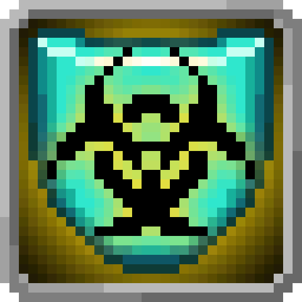
<figcaption>Source media</figcaption>
</figure>

<h2>Abnormal Condition Nullification</h2>

Abnormal Condition Nullification is a Resistance Skill in Tensura: Reincarnated.

Open reference →

</a>
</article>
<article class="reference-card" data-letter="A" data-search="abnormal condition resistance abnormal condition resistance is a resistance skill in tensura: reincarnated.">
<a href="abnormal-condition-resistance/" aria-label="Open Abnormal Condition Resistance">
<figure class="reference-card-media reference-card-media--source">

<figcaption>Source media</figcaption>
</figure>

<h2>Abnormal Condition Resistance</h2>

Abnormal Condition Resistance is a Resistance Skill in Tensura: Reincarnated.

Open reference →

</a>
</article>
<article class="reference-card" data-letter="C" data-search="cold nullification cold nullification is a resistance skill in tensura: reincarnated.">
<a href="cold-nullification/" aria-label="Open Cold Nullification">
<figure class="reference-card-media reference-card-media--source">

<figcaption>Source media</figcaption>
</figure>

<h2>Cold Nullification</h2>

Cold Nullification is a Resistance Skill in Tensura: Reincarnated.

Open reference →

</a>
</article>
<article class="reference-card" data-letter="C" data-search="cold resistance cold resistance is a resistance skill in tensura: reincarnated.">
<a href="cold-resistance/" aria-label="Open Cold Resistance">
<figure class="reference-card-media reference-card-media--source">

<figcaption>Source media</figcaption>
</figure>

<h2>Cold Resistance</h2>

Cold Resistance is a Resistance Skill in Tensura: Reincarnated.

Open reference →

</a>
</article>
<article class="reference-card" data-letter="C" data-search="corrosion nullification corrosion nullification is a resistance skill in tensura: reincarnated.">
<a href="corrosion-nullification/" aria-label="Open Corrosion Nullification">
<figure class="reference-card-media reference-card-media--source">

<figcaption>Source media</figcaption>
</figure>

<h2>Corrosion Nullification</h2>

Corrosion Nullification is a Resistance Skill in Tensura: Reincarnated.

Open reference →

</a>
</article>
<article class="reference-card" data-letter="C" data-search="corrosion resistance corrosion resistance is a resistance skill in tensura: reincarnated.">
<a href="corrosion-resistance/" aria-label="Open Corrosion Resistance">
<figure class="reference-card-media reference-card-media--source">

<figcaption>Source media</figcaption>
</figure>

<h2>Corrosion Resistance</h2>

Corrosion Resistance is a Resistance Skill in Tensura: Reincarnated.

Open reference →

</a>
</article>
<article class="reference-card" data-letter="D" data-search="darkness attack nullification darkness attack nullification is a resistance skill in tensura: reincarnated.">
<a href="darkness-attack-nullification/" aria-label="Open Darkness Attack Nullification">
<figure class="reference-card-media reference-card-media--source">
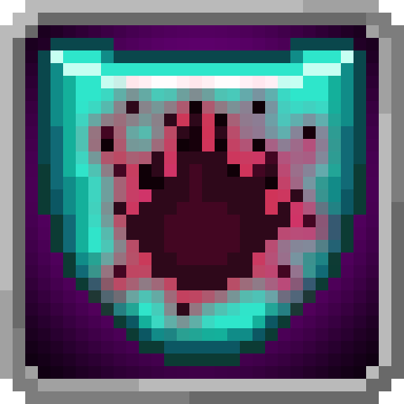
<figcaption>Source media</figcaption>
</figure>

<h2>Darkness Attack Nullification</h2>

Darkness Attack Nullification is a Resistance Skill in Tensura: Reincarnated.

Open reference →

</a>
</article>
<article class="reference-card" data-letter="D" data-search="darkness attack resistance darkness attack resistance is a resistance skill in tensura: reincarnated.">
<a href="darkness-attack-resistance/" aria-label="Open Darkness Attack Resistance">
<figure class="reference-card-media reference-card-media--source">
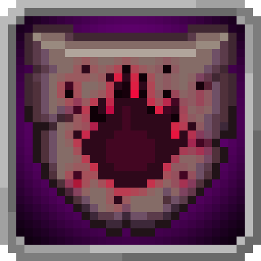
<figcaption>Source media</figcaption>
</figure>

<h2>Darkness Attack Resistance</h2>

Darkness Attack Resistance is a Resistance Skill in Tensura: Reincarnated.

Open reference →

</a>
</article>
<article class="reference-card" data-letter="E" data-search="earth attack nullification earth attack nullification is a resistance skill in tensura: reincarnated.">
<a href="earth-attack-nullification/" aria-label="Open Earth Attack Nullification">
<figure class="reference-card-media reference-card-media--source">
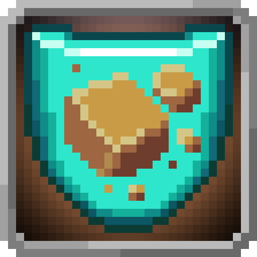
<figcaption>Source media</figcaption>
</figure>

<h2>Earth Attack Nullification</h2>

Earth Attack Nullification is a Resistance Skill in Tensura: Reincarnated.

Open reference →

</a>
</article>
<article class="reference-card" data-letter="E" data-search="earth attack resistance earth attack resistance is a resistance skill in tensura: reincarnated.">
<a href="earth-attack-resistance/" aria-label="Open Earth Attack Resistance">
<figure class="reference-card-media reference-card-media--source">

<figcaption>Source media</figcaption>
</figure>

<h2>Earth Attack Resistance</h2>

Earth Attack Resistance is a Resistance Skill in Tensura: Reincarnated.

Open reference →

</a>
</article>
<article class="reference-card" data-letter="E" data-search="electricity nullification electricity nullification is a resistance skill in tensura: reincarnated.">
<a href="electricity-nullification/" aria-label="Open Electricity Nullification">
<figure class="reference-card-media reference-card-media--source">

<figcaption>Source media</figcaption>
</figure>

<h2>Electricity Nullification</h2>

Electricity Nullification is a Resistance Skill in Tensura: Reincarnated.

Open reference →

</a>
</article>
<article class="reference-card" data-letter="E" data-search="electricity resistance electricity resistance is a resistance skill in tensura: reincarnated.">
<a href="electricity-resistance/" aria-label="Open Electricity Resistance">
<figure class="reference-card-media reference-card-media--source">

<figcaption>Source media</figcaption>
</figure>

<h2>Electricity Resistance</h2>

Electricity Resistance is a Resistance Skill in Tensura: Reincarnated.

Open reference →

</a>
</article>
<article class="reference-card" data-letter="F" data-search="flame attack nullification flame attack nullification is a resistance skill in tensura: reincarnated.">
<a href="flame-attack-nullification/" aria-label="Open Flame Attack Nullification">
<figure class="reference-card-media reference-card-media--source">
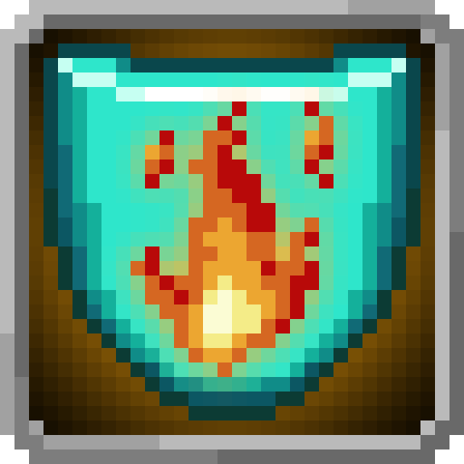
<figcaption>Source media</figcaption>
</figure>

<h2>Flame Attack Nullification</h2>

Flame Attack Nullification is a Resistance Skill in Tensura: Reincarnated.

Open reference →

</a>
</article>
<article class="reference-card" data-letter="F" data-search="flame attack resistance flame attack resistance is a resistance skill in tensura: reincarnated.">
<a href="flame-attack-resistance/" aria-label="Open Flame Attack Resistance">
<figure class="reference-card-media reference-card-media--source">
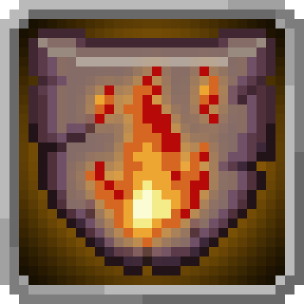
<figcaption>Source media</figcaption>
</figure>

<h2>Flame Attack Resistance</h2>

Flame Attack Resistance is a Resistance Skill in Tensura: Reincarnated.

Open reference →

</a>
</article>
<article class="reference-card" data-letter="G" data-search="gravity attack nullification gravity attack nullification is a resistance skill in tensura: reincarnated.">
<a href="gravity-attack-nullification/" aria-label="Open Gravity Attack Nullification">
<figure class="reference-card-media reference-card-media--source">
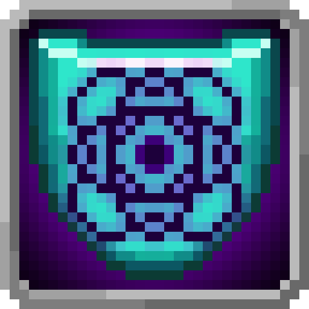
<figcaption>Source media</figcaption>
</figure>

<h2>Gravity Attack Nullification</h2>

Gravity Attack Nullification is a Resistance Skill in Tensura: Reincarnated.

Open reference →

</a>
</article>
<article class="reference-card" data-letter="G" data-search="gravity attack resistance gravity attack resistance is a resistance skill in tensura: reincarnated.">
<a href="gravity-attack-resistance/" aria-label="Open Gravity Attack Resistance">
<figure class="reference-card-media reference-card-media--source">
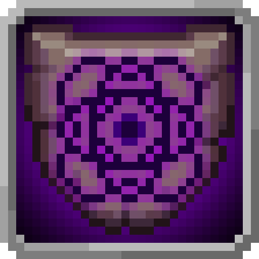
<figcaption>Source media</figcaption>
</figure>

<h2>Gravity Attack Resistance</h2>

Gravity Attack Resistance is a Resistance Skill in Tensura: Reincarnated.

Open reference →

</a>
</article>
<article class="reference-card" data-letter="H" data-search="heat nullification heat nullification is a resistance skill in tensura: reincarnated.">
<a href="heat-nullification/" aria-label="Open Heat Nullification">
<figure class="reference-card-media reference-card-media--source">

<figcaption>Source media</figcaption>
</figure>

<h2>Heat Nullification</h2>

Heat Nullification is a Resistance Skill in Tensura: Reincarnated.

Open reference →

</a>
</article>
<article class="reference-card" data-letter="H" data-search="heat resistance heat resistance is a resistance skill in tensura: reincarnated.">
<a href="heat-resistance/" aria-label="Open Heat Resistance">
<figure class="reference-card-media reference-card-media--source">

<figcaption>Source media</figcaption>
</figure>

<h2>Heat Resistance</h2>

Heat Resistance is a Resistance Skill in Tensura: Reincarnated.

Open reference →

</a>
</article>
<article class="reference-card" data-letter="H" data-search="holy attack nullification !!! unobtainable without commands !!!">
<a href="holy-attack-nullification/" aria-label="Open Holy Attack Nullification">
<figure class="reference-card-media reference-card-media--source">

<figcaption>Source media</figcaption>
</figure>

<h2>Holy Attack Nullification</h2>

!!! Unobtainable without commands !!!

Open reference →

</a>
</article>
<article class="reference-card" data-letter="H" data-search="holy attack resistance holy attack resistance is a resistance skill in tensura: reincarnated.">
<a href="holy-attack-resistance/" aria-label="Open Holy Attack Resistance">
<figure class="reference-card-media reference-card-media--source">

<figcaption>Source media</figcaption>
</figure>

<h2>Holy Attack Resistance</h2>

Holy Attack Resistance is a Resistance Skill in Tensura: Reincarnated.

Open reference →

</a>
</article>
<article class="reference-card" data-letter="L" data-search="light attack nullification light attack nullification is a resistance skill in tensura: reincarnated.">
<a href="light-attack-nullification/" aria-label="Open Light Attack Nullification">
<figure class="reference-card-media reference-card-media--source">

<figcaption>Source media</figcaption>
</figure>

<h2>Light Attack Nullification</h2>

Light Attack Nullification is a Resistance Skill in Tensura: Reincarnated.

Open reference →

</a>
</article>
<article class="reference-card" data-letter="L" data-search="light attack resistance light attack resistance is a resistance skill in tensura: reincarnated.">
<a href="light-attack-resistance/" aria-label="Open Light Attack Resistance">
<figure class="reference-card-media reference-card-media--source">

<figcaption>Source media</figcaption>
</figure>

<h2>Light Attack Resistance</h2>

Light Attack Resistance is a Resistance Skill in Tensura: Reincarnated.

Open reference →

</a>
</article>
<article class="reference-card" data-letter="P" data-search="pain nullification pain nullification is a resistance skill in tensura: reincarnated.">
<a href="pain-nullification/" aria-label="Open Pain Nullification">
<figure class="reference-card-media reference-card-media--source">

<figcaption>Source media</figcaption>
</figure>

<h2>Pain Nullification</h2>

Pain Nullification is a Resistance Skill in Tensura: Reincarnated.

Open reference →

</a>
</article>
<article class="reference-card" data-letter="P" data-search="pain resistance pain resistance is a resistance skill in tensura: reincarnated.">
<a href="pain-resistance/" aria-label="Open Pain Resistance">
<figure class="reference-card-media reference-card-media--source">

<figcaption>Source media</figcaption>
</figure>

<h2>Pain Resistance</h2>

Pain Resistance is a Resistance Skill in Tensura: Reincarnated.

Open reference →

</a>
</article>
<article class="reference-card" data-letter="P" data-search="paralysis nullification paralysis nullification is a resistance skill in tensura: reincarnated.">
<a href="paralysis-nullification/" aria-label="Open Paralysis Nullification">
<figure class="reference-card-media reference-card-media--source">

<figcaption>Source media</figcaption>
</figure>

<h2>Paralysis Nullification</h2>

Paralysis Nullification is a Resistance Skill in Tensura: Reincarnated.

Open reference →

</a>
</article>
<article class="reference-card" data-letter="P" data-search="paralysis resistance paralysis resistance is a resistance skill in tensura: reincarnated.">
<a href="paralysis-resistance/" aria-label="Open Paralysis Resistance">
<figure class="reference-card-media reference-card-media--source">

<figcaption>Source media</figcaption>
</figure>

<h2>Paralysis Resistance</h2>

Paralysis Resistance is a Resistance Skill in Tensura: Reincarnated.

Open reference →

</a>
</article>
<article class="reference-card" data-letter="P" data-search="physical attack resistance physical attack resistance is a resistance skill in tensura: reincarnated.">
<a href="physical-attack-resistance/" aria-label="Open Physical Attack Resistance">
<figure class="reference-card-media reference-card-media--source">

<figcaption>Source media</figcaption>
</figure>

<h2>Physical Attack Resistance</h2>

Physical Attack Resistance is a Resistance Skill in Tensura: Reincarnated.

Open reference →

</a>
</article>
<article class="reference-card" data-letter="P" data-search="physicial attack nullification physical attack nullification is a resistance skill in tensura: reincarnated.">
<a href="physical-attack-nullification/" aria-label="Open Physicial Attack Nullification">
<figure class="reference-card-media reference-card-media--source">

<figcaption>Source media</figcaption>
</figure>

<h2>Physicial Attack Nullification</h2>

Physical Attack Nullification is a Resistance Skill in Tensura: Reincarnated.

Open reference →

</a>
</article>
<article class="reference-card" data-letter="P" data-search="pierce nullification pierce nullification is a resistance skill in tensura: reincarnated.">
<a href="pierce-nullification/" aria-label="Open Pierce Nullification">
<figure class="reference-card-media reference-card-media--source">

<figcaption>Source media</figcaption>
</figure>

<h2>Pierce Nullification</h2>

Pierce Nullification is a Resistance Skill in Tensura: Reincarnated.

Open reference →

</a>
</article>
<article class="reference-card" data-letter="P" data-search="pierce resistance pierce resistance is a resistance skill in tensura: reincarnated.">
<a href="pierce-resistance/" aria-label="Open Pierce Resistance">
<figure class="reference-card-media reference-card-media--source">
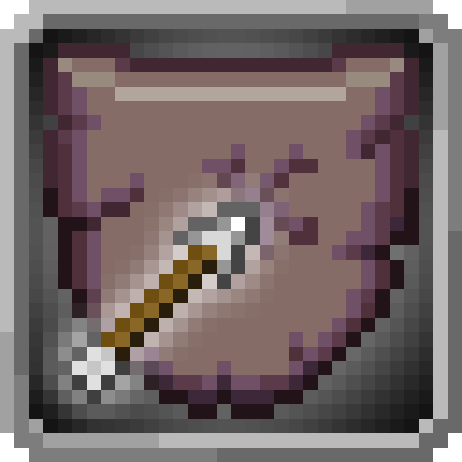
<figcaption>Source media</figcaption>
</figure>

<h2>Pierce Resistance</h2>

Pierce Resistance is a Resistance Skill in Tensura: Reincarnated.

Open reference →

</a>
</article>
<article class="reference-card" data-letter="P" data-search="poison nullification poison nullification is a resistance skill in tensura: reincarnated.">
<a href="poison-nullification/" aria-label="Open Poison Nullification">
<figure class="reference-card-media reference-card-media--source">
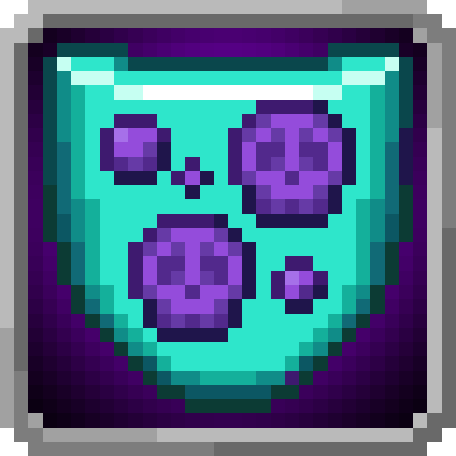
<figcaption>Source media</figcaption>
</figure>

<h2>Poison Nullification</h2>

Poison Nullification is a Resistance Skill in Tensura: Reincarnated.

Open reference →

</a>
</article>
<article class="reference-card" data-letter="P" data-search="poison resistance poison resistance is a resistance skill in tensura: reincarnated.">
<a href="poison-resistance/" aria-label="Open Poison Resistance">
<figure class="reference-card-media reference-card-media--source">
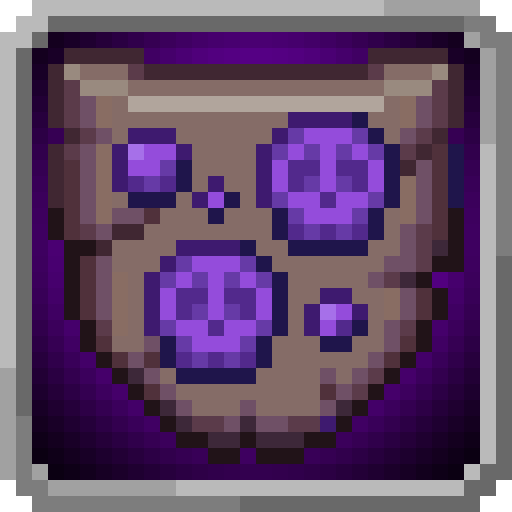
<figcaption>Source media</figcaption>
</figure>

<h2>Poison Resistance</h2>

Poison Resistance is a Resistance Skill in Tensura: Reincarnated.

Open reference →

</a>
</article>
<article class="reference-card" data-letter="S" data-search="spatial attack nullification spatial attack resistance is a resistance skill in tensura: reincarnated.">
<a href="spatial-attack-nullification/" aria-label="Open Spatial Attack Nullification">
<figure class="reference-card-media reference-card-media--source">
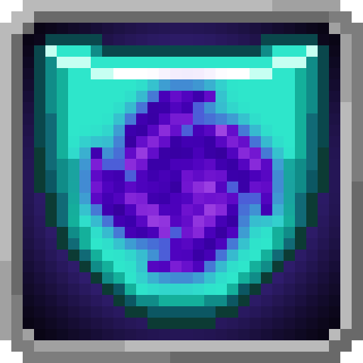
<figcaption>Source media</figcaption>
</figure>

<h2>Spatial Attack Nullification</h2>

Spatial Attack Resistance is a Resistance Skill in Tensura: Reincarnated.

Open reference →

</a>
</article>
<article class="reference-card" data-letter="S" data-search="spatial attack resistance spatial attack resistance is a resistance skill in tensura: reincarnated.">
<a href="spatial-attack-resistance/" aria-label="Open Spatial Attack Resistance">
<figure class="reference-card-media reference-card-media--source">
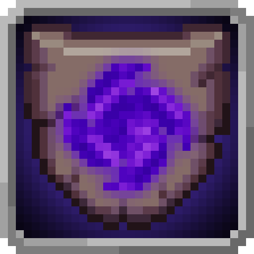
<figcaption>Source media</figcaption>
</figure>

<h2>Spatial Attack Resistance</h2>

Spatial Attack Resistance is a Resistance Skill in Tensura: Reincarnated.

Open reference →

</a>
</article>
<article class="reference-card" data-letter="S" data-search="spellbinding table a table for binding spells.">
<a href="spellbinding-table/" aria-label="Open Spellbinding Table">
<figure class="reference-card-media reference-card-media--source">

<figcaption>Source media</figcaption>
</figure>

<h2>Spellbinding Table</h2>

A table for binding spells.

Open reference →

</a>
</article>
<article class="reference-card" data-letter="S" data-search="spiritual attack nullification spiritual attack nullification is a resistance skill in tensura: reincarnated.">
<a href="spiritual-attack-nullification/" aria-label="Open Spiritual Attack Nullification">
<figure class="reference-card-media reference-card-media--source">

<figcaption>Source media</figcaption>
</figure>

<h2>Spiritual Attack Nullification</h2>

Spiritual Attack Nullification is a Resistance Skill in Tensura: Reincarnated.

Open reference →

</a>
</article>
<article class="reference-card" data-letter="S" data-search="spiritual attack resistance spiritual attack resistance is a resistance skill in tensura: reincarnated.">
<a href="spiritual-attack-resistance/" aria-label="Open Spiritual Attack Resistance">
<figure class="reference-card-media reference-card-media--source">
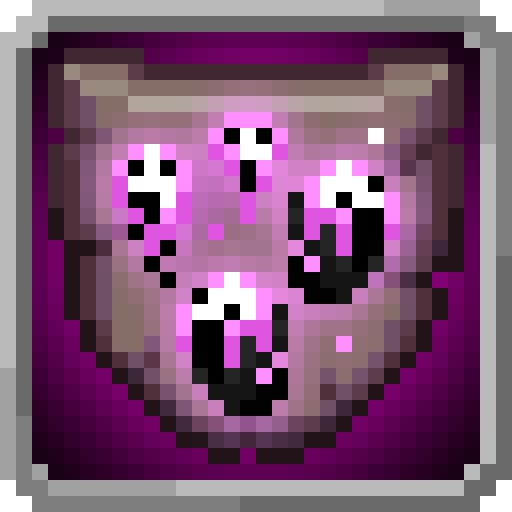
<figcaption>Source media</figcaption>
</figure>

<h2>Spiritual Attack Resistance</h2>

Spiritual Attack Resistance is a Resistance Skill in Tensura: Reincarnated.

Open reference →

</a>
</article>
<article class="reference-card" data-letter="T" data-search="thermal fluctuation nullification thermal fluctuation nullification is a resistance skill in tensura: reincarnated.">
<a href="thermal-fluctuation-nullification/" aria-label="Open Thermal Fluctuation Nullification">
<figure class="reference-card-media reference-card-media--source">

<figcaption>Source media</figcaption>
</figure>

<h2>Thermal Fluctuation Nullification</h2>

Thermal Fluctuation Nullification is a Resistance Skill in Tensura: Reincarnated.

Open reference →

</a>
</article>
<article class="reference-card" data-letter="T" data-search="thermal fluctuation resistance thermal fluctuation resistance is a resistance skill in tensura: reincarnated.">
<a href="thermal-fluctuation-resistance/" aria-label="Open Thermal Fluctuation Resistance">
<figure class="reference-card-media reference-card-media--source">

<figcaption>Source media</figcaption>
</figure>

<h2>Thermal Fluctuation Resistance</h2>

Thermal Fluctuation Resistance is a Resistance Skill in Tensura: Reincarnated.

Open reference →

</a>
</article>
<article class="reference-card" data-letter="W" data-search="water attack nullification water attack nullification is a resistance skill in tensura: reincarnated.">
<a href="water-attack-nullification/" aria-label="Open Water Attack Nullification">
<figure class="reference-card-media reference-card-media--source">

<figcaption>Source media</figcaption>
</figure>

<h2>Water Attack Nullification</h2>

Water Attack Nullification is a Resistance Skill in Tensura: Reincarnated.

Open reference →

</a>
</article>
<article class="reference-card" data-letter="W" data-search="water attack resistance water attack resistance is a resistance skill in tensura: reincarnated.">
<a href="water-attack-resistance/" aria-label="Open Water Attack Resistance">
<figure class="reference-card-media reference-card-media--source">

<figcaption>Source media</figcaption>
</figure>

<h2>Water Attack Resistance</h2>

Water Attack Resistance is a Resistance Skill in Tensura: Reincarnated.

Open reference →

</a>
</article>
<article class="reference-card" data-letter="W" data-search="wind attack nullification wind attack nullification is a resistance skill in tensura: reincarnated.">
<a href="wind-attack-nullification/" aria-label="Open Wind Attack Nullification">
<figure class="reference-card-media reference-card-media--source">

<figcaption>Source media</figcaption>
</figure>

<h2>Wind Attack Nullification</h2>

Wind Attack Nullification is a Resistance Skill in Tensura: Reincarnated.

Open reference →

</a>
</article>
<article class="reference-card" data-letter="W" data-search="wind attack resistance wind attack resistance is a resistance skill in tensura: reincarnated.">
<a href="wind-attack-resistance/" aria-label="Open Wind Attack Resistance">
<figure class="reference-card-media reference-card-media--source">
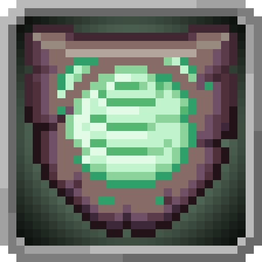
<figcaption>Source media</figcaption>
</figure>

<h2>Wind Attack Resistance</h2>

Wind Attack Resistance is a Resistance Skill in Tensura: Reincarnated.

Open reference →

</a>
</article>

No matching articles. Try a broader search.

</section>
