<section class="reference-directory" data-reference-directory="skills/common">
<header class="reference-directory-hero reference-theme-abilities">

Tensura reference collection

<h1>Common Skills</h1>

Common skills and broadly available abilities.

<strong>16</strong> articles

</header>

<label class="reference-filter-label">
Filter this collection
<input type="search" class="reference-filter-input" placeholder="Search titles and summaries…" autocomplete="off">
</label>

<button type="button" class="is-active" data-letter="all" aria-pressed="true">All</button>
<button type="button" data-letter="C" aria-pressed="false">C</button>
<button type="button" data-letter="F" aria-pressed="false">F</button>
<button type="button" data-letter="G" aria-pressed="false">G</button>
<button type="button" data-letter="H" aria-pressed="false">H</button>
<button type="button" data-letter="P" aria-pressed="false">P</button>
<button type="button" data-letter="R" aria-pressed="false">R</button>
<button type="button" data-letter="S" aria-pressed="false">S</button>
<button type="button" data-letter="T" aria-pressed="false">T</button>
<button type="button" data-letter="V" aria-pressed="false">V</button>
<button type="button" data-letter="W" aria-pressed="false">W</button>

Showing 16 of 16 articles

<article class="reference-card" data-letter="C" data-search="coercion unleash a deafening roar in front of you scaring any afflicted entities.">
<a href="coercion/" aria-label="Open Coercion">
<figure class="reference-card-media reference-card-media--source">
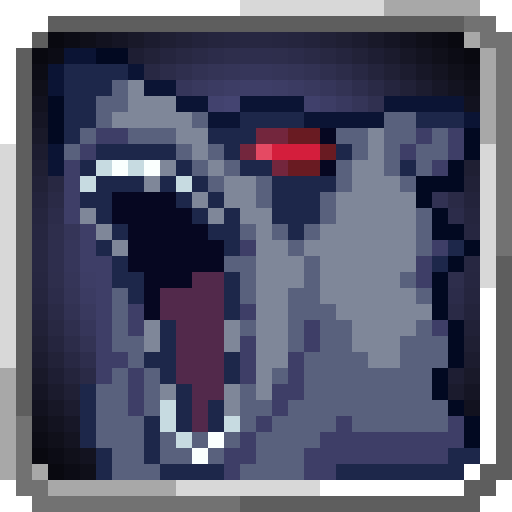
<figcaption>Source media</figcaption>
</figure>

<h2>Coercion</h2>

Unleash a deafening roar in front of you scaring any afflicted entities.

Open reference →

</a>
</article>
<article class="reference-card" data-letter="C" data-search="corrosion empower your attacks with the deadly effect of corrosion, with mastery you can do this automatically.">
<a href="corrosion/" aria-label="Open Corrosion">
<figure class="reference-card-media reference-card-media--source">
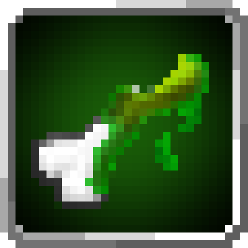
<figcaption>Source media</figcaption>
</figure>

<h2>Corrosion</h2>

Empower your attacks with the deadly effect of Corrosion, with mastery you can do this automatically.

Open reference →

</a>
</article>
<article class="reference-card" data-letter="F" data-search="farsight focus your eyes and become able to see things far away.">
<a href="farsight/" aria-label="Open Farsight">
<figure class="reference-card-media reference-card-media--source">
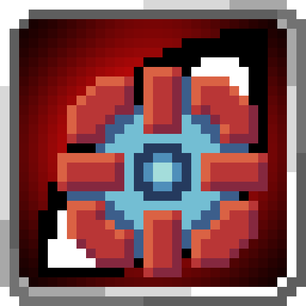
<figcaption>Source media</figcaption>
</figure>

<h2>Farsight</h2>

Focus your eyes and become able to see things far away.

Open reference →

</a>
</article>
<article class="reference-card" data-letter="G" data-search="gravity field weaken gravity around yourself to make movement easier or create a variously sized sphere granting previous effects while debuffing enemies.">
<a href="gravity-field/" aria-label="Open Gravity Field">
<figure class="reference-card-media reference-card-media--source">
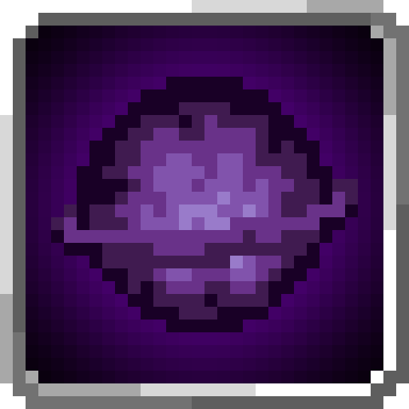
<figcaption>Source media</figcaption>
</figure>

<h2>Gravity Field</h2>

Weaken gravity around yourself to make movement easier or create a variously sized sphere granting previous effects while debuffing enemies.

Open reference →

</a>
</article>
<article class="reference-card" data-letter="G" data-search="gravity flight manipulate gravity to allow flight, your momentum from before will be continued.">
<a href="gravity-flight/" aria-label="Open Gravity Flight">
<figure class="reference-card-media reference-card-media--source">
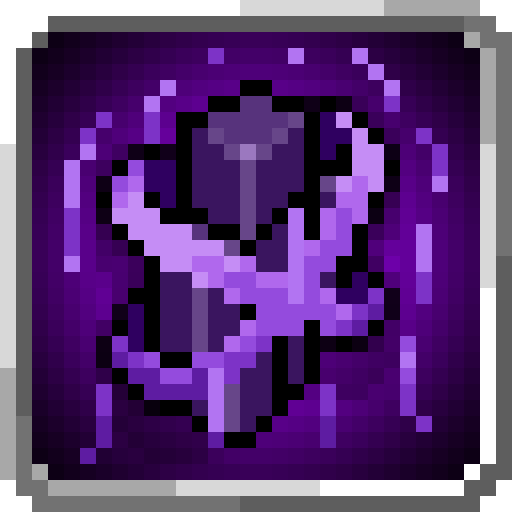
<figcaption>Source media</figcaption>
</figure>

<h2>Gravity Flight</h2>

Manipulate gravity to allow flight, your momentum from before will be continued.

Open reference →

</a>
</article>
<article class="reference-card" data-letter="H" data-search="hydraulic propulsion propel yourself at high speeds underwater.">
<a href="hydraulic-propulsion/" aria-label="Open Hydraulic Propulsion">
<figure class="reference-card-media reference-card-media--source">
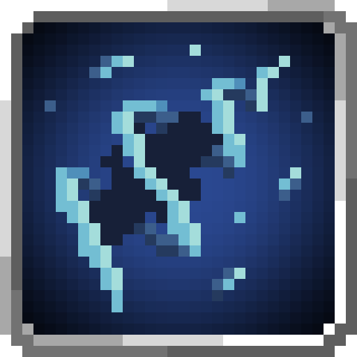
<figcaption>Source media</figcaption>
</figure>

<h2>Hydraulic Propulsion</h2>

Propel yourself at high speeds underwater.

Open reference →

</a>
</article>
<article class="reference-card" data-letter="P" data-search="paralysis empower your attacks with the effect of paralysis, with mastery you can do this automatically.">
<a href="paralysis/" aria-label="Open Paralysis">
<figure class="reference-card-media reference-card-media--source">
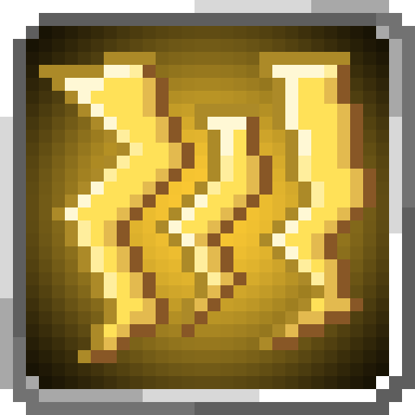
<figcaption>Source media</figcaption>
</figure>

<h2>Paralysis</h2>

Empower your attacks with the effect of Paralysis, with mastery you can do this automatically.

Open reference →

</a>
</article>
<article class="reference-card" data-letter="P" data-search="poison empower your attacks with the effect of poison, with mastery you can do this automatically.">
<a href="poison/" aria-label="Open Poison">
<figure class="reference-card-media reference-card-media--source">
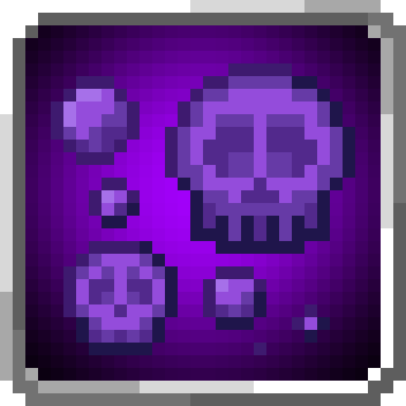
<figcaption>Source media</figcaption>
</figure>

<h2>Poison</h2>

Empower your attacks with the effect of Poison, with mastery you can do this automatically.

Open reference →

</a>
</article>
<article class="reference-card" data-letter="R" data-search="ranged barrier place down differently sized barriers which block enemies in or out. strong attacks or special effects can still destroy it.">
<a href="ranged-barrier/" aria-label="Open Ranged Barrier">
<figure class="reference-card-media reference-card-media--source">

<figcaption>Source media</figcaption>
</figure>

<h2>Ranged Barrier</h2>

Place down differently sized barriers which block enemies in or out. Strong attacks or special effects can still destroy it.

Open reference →

</a>
</article>
<article class="reference-card" data-letter="S" data-search="self regeneration speed up your body’s natural regeneration to increase your survivability.">
<a href="self-regeneration/" aria-label="Open Self Regeneration">
<figure class="reference-card-media reference-card-media--source">
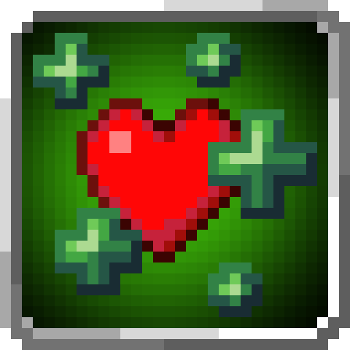
<figcaption>Source media</figcaption>
</figure>

<h2>Self Regeneration</h2>

Speed up your body’s natural regeneration to increase your survivability.

Open reference →

</a>
</article>
<article class="reference-card" data-letter="S" data-search="strength use magicules to strengthen your muscles.">
<a href="strength/" aria-label="Open Strength">
<figure class="reference-card-media reference-card-media--source">
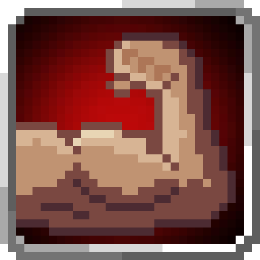
<figcaption>Source media</figcaption>
</figure>

<h2>Strength</h2>

Use magicules to strengthen your muscles.

Open reference →

</a>
</article>
<article class="reference-card" data-letter="T" data-search="telepathy give orders to tames when looking at them through commands.">
<a href="telepathy/" aria-label="Open Telepathy">
<figure class="reference-card-media reference-card-media--source">
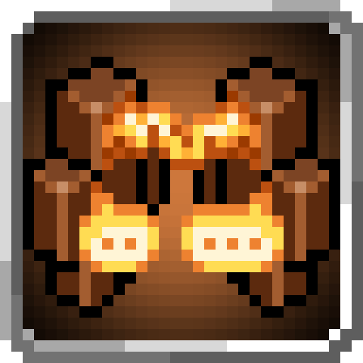
<figcaption>Source media</figcaption>
</figure>

<h2>Telepathy</h2>

Give orders to tames when looking at them through commands.

Open reference →

</a>
</article>
<article class="reference-card" data-letter="T" data-search="thought communication send commands to nearby allies and become able to have them attack players.">
<a href="thought-communication/" aria-label="Open Thought Communication">
<figure class="reference-card-media reference-card-media--source">
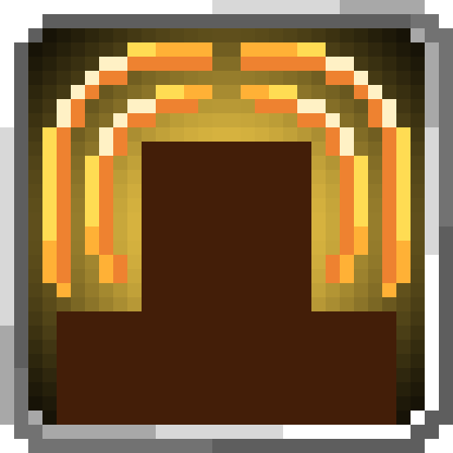
<figcaption>Source media</figcaption>
</figure>

<h2>Thought Communication</h2>

Send commands to nearby allies and become able to have them attack players.

Open reference →

</a>
</article>
<article class="reference-card" data-letter="V" data-search="voice cannon unleash a powerful roar decimating all weak enemies in the way.">
<a href="voice-cannon/" aria-label="Open Voice Cannon">
<figure class="reference-card-media reference-card-media--source">
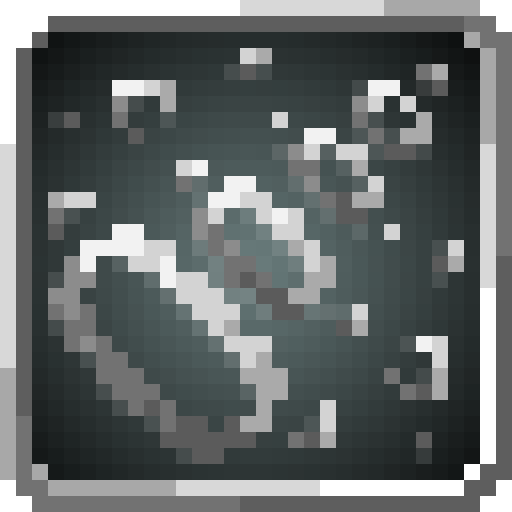
<figcaption>Source media</figcaption>
</figure>

<h2>Voice Cannon</h2>

Unleash a powerful roar decimating all weak enemies in the way.

Open reference →

</a>
</article>
<article class="reference-card" data-letter="W" data-search="water blade shoot out a blade of water which flies in a straight line.">
<a href="water-blade/" aria-label="Open Water Blade">
<figure class="reference-card-media reference-card-media--source">
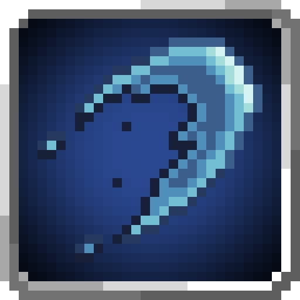
<figcaption>Source media</figcaption>
</figure>

<h2>Water Blade</h2>

Shoot out a blade of water which flies in a straight line.

Open reference →

</a>
</article>
<article class="reference-card" data-letter="W" data-search="water current control manipulate water around you to propel yourself in any direction.">
<a href="water-current-control/" aria-label="Open Water Current Control">
<figure class="reference-card-media reference-card-media--source">
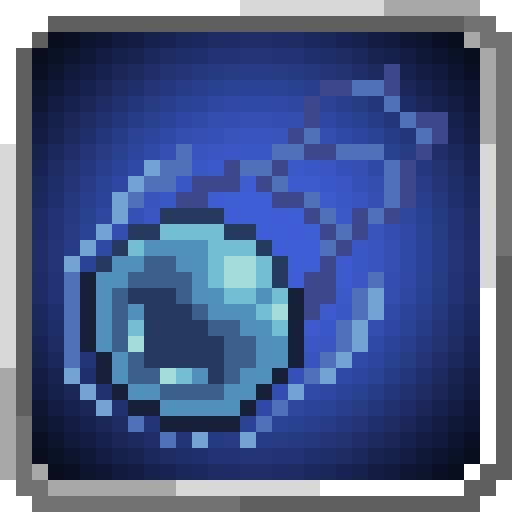
<figcaption>Source media</figcaption>
</figure>

<h2>Water Current Control</h2>

Manipulate water around you to propel yourself in any direction.

Open reference →

</a>
</article>

No matching articles. Try a broader search.

</section>
