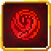
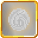
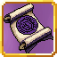
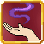

<section class="reference-directory" data-reference-directory="skills/extra">
<header class="reference-directory-hero reference-theme-abilities">

Tensura reference collection

<h1>Extra Skills</h1>

Extra-class skills and their documented progressions.

<strong>104</strong> articles

</header>

<label class="reference-filter-label">
Filter this collection
<input type="search" class="reference-filter-input" placeholder="Search titles and summaries…" autocomplete="off">
</label>

<button type="button" class="is-active" data-letter="all" aria-pressed="true">All</button>
<button type="button" data-letter="A" aria-pressed="false">A</button>
<button type="button" data-letter="B" aria-pressed="false">B</button>
<button type="button" data-letter="C" aria-pressed="false">C</button>
<button type="button" data-letter="D" aria-pressed="false">D</button>
<button type="button" data-letter="E" aria-pressed="false">E</button>
<button type="button" data-letter="F" aria-pressed="false">F</button>
<button type="button" data-letter="G" aria-pressed="false">G</button>
<button type="button" data-letter="H" aria-pressed="false">H</button>
<button type="button" data-letter="I" aria-pressed="false">I</button>
<button type="button" data-letter="L" aria-pressed="false">L</button>
<button type="button" data-letter="M" aria-pressed="false">M</button>
<button type="button" data-letter="P" aria-pressed="false">P</button>
<button type="button" data-letter="S" aria-pressed="false">S</button>
<button type="button" data-letter="T" aria-pressed="false">T</button>
<button type="button" data-letter="U" aria-pressed="false">U</button>
<button type="button" data-letter="W" aria-pressed="false">W</button>

Showing 104 of 104 articles

<article class="reference-card" data-letter="A" data-search="all seeing eye go into a 3rd person mode, which increases your pov and grants movement and action buffs as well as an upgrade to presence sense.">
<a href="all-seeing-eye/" aria-label="Open All Seeing Eye">
<figure class="reference-card-media reference-card-media--source">

<figcaption>Source media</figcaption>
</figure>

<h2>All Seeing Eye</h2>

Go into a 3rd person mode, which increases your POV and grants movement and action buffs as well as an upgrade to Presence Sense.

Open reference →

</a>
</article>
<article class="reference-card" data-letter="A" data-search="alteration alteration - open the skill alteration menu. the skill alteration menu allows you to select a skill and evolve it forcefully, however the requirements must be met…">
<a href="nightmares-alteration/" aria-label="Open Alteration">
<figure class="reference-card-media reference-card-media--source">

<figcaption>TSR skill emblem</figcaption>
</figure>

<h2>Alteration</h2>
<small class="skill-reference-status">1.21.1 reference · Server build match pending</small>

Alteration - Open the Skill Alteration Menu. The Skill Alteration Menu allows you to select a skill and evolve it forcefully, however the requirements must be met…

Open reference →

</a>
</article>
<article class="reference-card" data-letter="A" data-search="analytical appraisal assess the soul of your opponents to gain insight into their overall strength.">
<a href="analytical-appraisal/" aria-label="Open Analytical Appraisal">
<figure class="reference-card-media reference-card-media--source">

<figcaption>Source media</figcaption>
</figure>

<h2>Analytical Appraisal</h2>

Assess the soul of your opponents to gain insight into their overall strength.

Open reference →

</a>
</article>
<article class="reference-card" data-letter="A" data-search="angel wings sustained flight intrinsic to the angel race line.">
<a href="../intrinsic/angel-wings/" aria-label="Open Angel Wings">
<figure class="reference-card-media reference-card-media--source">

<figcaption>Source media</figcaption>
</figure>

<h2>Angel Wings</h2>

Sustained flight intrinsic to the Angel race line.

Open reference →

</a>
</article>
<article class="reference-card" data-letter="A" data-search="auto battle mode copilot - this is used to toggle on and off copilot mode. this means that wise ego will utilize skills to automatically protect you at times.">
<a href="nightmares-auto-battle-mode/" aria-label="Open Auto Battle Mode">
<figure class="reference-card-media reference-card-media--source">

<figcaption>TSR skill emblem</figcaption>
</figure>

<h2>Auto Battle Mode</h2>
<small class="skill-reference-status">1.21.1 reference · Server build match pending</small>

Copilot - This is used to toggle on and off Copilot mode. This means that Wise Ego will utilize skills to automatically protect you at times.

Open reference →

</a>
</article>
<article class="reference-card" data-letter="B" data-search="black flame command the tempest infused flames to spew out black flames at your enemies or even shoot deadly fireballs and hell flares.">
<a href="black-flame/" aria-label="Open Black Flame">
<figure class="reference-card-media reference-card-media--source">

<figcaption>Source media</figcaption>
</figure>

<h2>Black Flame</h2>

Command the tempest infused flames to spew out black flames at your enemies or even shoot deadly fireballs and hell flares.

Open reference →

</a>
</article>
<article class="reference-card" data-letter="B" data-search="black lightning shoot black lightning at varying strength, or summon a massive storm which attacks any non-allied mobs. a short range plasma blast can also be used to melt even the…">
<a href="black-lightning/" aria-label="Open Black Lightning">
<figure class="reference-card-media reference-card-media--source">

<figcaption>Source media</figcaption>
</figure>

<h2>Black Lightning</h2>

Shoot black lightning at varying strength, or summon a massive storm which attacks any non-allied mobs. A short range plasma blast can also be used to melt even the…

Open reference →

</a>
</article>
<article class="reference-card" data-letter="B" data-search="blockade suppress an enemy&#x27;s regeneration skills.">
<a href="blockade/" aria-label="Open Blockade">
<figure class="reference-card-media reference-card-media--source">

<figcaption>Source media</figcaption>
</figure>

<h2>Blockade</h2>

Suppress an enemy&#x27;s regeneration skills.

Open reference →

</a>
</article>
<article class="reference-card" data-letter="B" data-search="blood frenzy trade health for stronger, faster attacks.">
<a href="blood-frenzy/" aria-label="Open Blood Frenzy">
<figure class="reference-card-media reference-card-media--source">

<figcaption>Source media</figcaption>
</figure>

<h2>Blood Frenzy</h2>

Trade health for stronger, faster attacks.

Open reference →

</a>
</article>
<article class="reference-card" data-letter="B" data-search="body double use a tenth of your magical power to summon an identical clone which takes increased damage but will fight for you until the end. the user can exchange places with the…">
<a href="body-double/" aria-label="Open Body Double">
<figure class="reference-card-media reference-card-media--source">

<figcaption>Source media</figcaption>
</figure>

<h2>Body Double</h2>

Use a tenth of your magical power to summon an identical clone which takes increased damage but will fight for you until the end. The user can exchange places with the…

Open reference →

</a>
</article>
<article class="reference-card" data-letter="C" data-search="chant annulment become able to cast mastered magic instantly, in water or even under the effects of silence.">
<a href="chant-annulment/" aria-label="Open Chant Annulment">
<figure class="reference-card-media reference-card-media--source">

<figcaption>Source media</figcaption>
</figure>

<h2>Chant Annulment</h2>

Become able to cast mastered magic instantly, in water or even under the effects of silence.

Open reference →

</a>
</article>
<article class="reference-card" data-letter="C" data-search="concentrator mp regeneration - regenerates 0.5% mp every 5 seconds">
<a href="nightmares-concentrator/" aria-label="Open Concentrator">
<figure class="reference-card-media reference-card-media--source">

<figcaption>TSR skill emblem</figcaption>
</figure>

<h2>Concentrator</h2>
<small class="skill-reference-status">1.21.1 reference · Server build match pending</small>

MP Regeneration - Regenerates 0.5% MP every 5 seconds

Open reference →

</a>
</article>
<article class="reference-card" data-letter="C" data-search="cryogenic cessation command your absolute authority over deceleration, allowing you to freeze all enemies with ice and spew superchilled ice. additionally, freeze the surroundings into ice.">
<a href="../../../mysticism-reference/skills/extra/cryogenic-cessation/" aria-label="Open Cryogenic Cessation">
<figure class="reference-card-media reference-card-media--source">

<figcaption>TSR skill emblem</figcaption>
</figure>

<h2>Cryogenic Cessation</h2>

Command your absolute authority over Deceleration, allowing you to freeze all enemies with ice and spew superchilled ice. Additionally, freeze the surroundings into ice.

Open reference →

</a>
</article>
<article class="reference-card" data-letter="D" data-search="danger sense receive a mental warning when entities with hostile intent enter your proximity.">
<a href="danger-sense/" aria-label="Open Danger Sense">
<figure class="reference-card-media reference-card-media--source">

<figcaption>Source media</figcaption>
</figure>

<h2>Danger Sense</h2>

Receive a mental warning when entities with hostile intent enter your proximity.

Open reference →

</a>
</article>
<article class="reference-card" data-letter="D" data-search="darkness domination boosts the power of darkness abilities by a great amount.">
<a href="../../../mysticism-reference/skills/extra/darkness-domination/" aria-label="Open Darkness Domination">
<figure class="reference-card-media reference-card-media--source">

<figcaption>TSR skill emblem</figcaption>
</figure>

<h2>Darkness Domination</h2>

Boosts the power of Darkness abilities by a great amount.

Open reference →

</a>
</article>
<article class="reference-card" data-letter="D" data-search="darkness manipulation boosts the power of darkness abilities by a decent amount.">
<a href="../../../mysticism-reference/skills/extra/darkness-manipulation/" aria-label="Open Darkness Manipulation">
<figure class="reference-card-media reference-card-media--source">

<figcaption>TSR skill emblem</figcaption>
</figure>

<h2>Darkness Manipulation</h2>

Boosts the power of Darkness abilities by a decent amount.

Open reference →

</a>
</article>
<article class="reference-card" data-letter="D" data-search="demon lord haki unleash your demonic aura causing those around you to quake in fear.">
<a href="demon-lord-haki/" aria-label="Open Demon Lord Haki">
<figure class="reference-card-media reference-card-media--source">

<figcaption>Source media</figcaption>
</figure>

<h2>Demon Lord Haki</h2>

Unleash your Demonic aura causing those around you to quake in fear.

Open reference →

</a>
</article>
<article class="reference-card" data-letter="E" data-search="earth domination boosts the power of earth skills by a large amount.">
<a href="earth-domination/" aria-label="Open Earth Domination">
<figure class="reference-card-media reference-card-media--source">

<figcaption>Source media</figcaption>
</figure>

<h2>Earth Domination</h2>

Boosts the power of Earth skills by a large amount.

Open reference →

</a>
</article>
<article class="reference-card" data-letter="E" data-search="earth manipulation boosts the power of earth abilities by a decent amount.">
<a href="earth-manipulation/" aria-label="Open Earth Manipulation">
<figure class="reference-card-media reference-card-media--source">

<figcaption>Source media</figcaption>
</figure>

<h2>Earth Manipulation</h2>

Boosts the power of Earth abilities by a decent amount.

Open reference →

</a>
</article>
<article class="reference-card" data-letter="E" data-search="ego management open ego archive - shows the current egos you have and their stats.">
<a href="nightmares-ego-management/" aria-label="Open Ego Management">
<figure class="reference-card-media reference-card-media--source">

<figcaption>TSR skill emblem</figcaption>
</figure>

<h2>Ego Management</h2>
<small class="skill-reference-status">1.21.1 reference · Server build match pending</small>

Open Ego Archive - Shows the current egos you have and their stats.

Open reference →

</a>
</article>
<article class="reference-card" data-letter="F" data-search="flame domination boosts the power of fire skills by a large amount.">
<a href="flame-domination/" aria-label="Open Flame Domination">
<figure class="reference-card-media reference-card-media--source">

<figcaption>Source media</figcaption>
</figure>

<h2>Flame Domination</h2>

Boosts the power of fire skills by a large amount.

Open reference →

</a>
</article>
<article class="reference-card" data-letter="F" data-search="flame manipulation boosts the power of fire skills by a decent amount.">
<a href="flame-manipulation/" aria-label="Open Flame Manipulation">
<figure class="reference-card-media reference-card-media--source">

<figcaption>Source media</figcaption>
</figure>

<h2>Flame Manipulation</h2>

Boosts the power of fire skills by a decent amount.

Open reference →

</a>
</article>
<article class="reference-card" data-letter="F" data-search="food chain [active, press] food chain - when used normally, the skill menu opens allowing you to learn any skill from a subordinate. (you can enable this to allow the learning of…">
<a href="nightmares-food-chain/" aria-label="Open Food Chain">
<figure class="reference-card-media reference-card-media--source">

<figcaption>TSR skill emblem</figcaption>
</figure>

<h2>Food Chain</h2>
<small class="skill-reference-status">1.21.1 reference · Server build match pending</small>

[Active, Press] Food Chain - When used normally, the Skill Menu opens allowing you to learn any skill from a Subordinate. (You can enable this to allow the learning of…

Open reference →

</a>
</article>
<article class="reference-card" data-letter="F" data-search="forbidden knowledge forbidden knowledge - boost learning and mastery points by 8 points">
<a href="nightmares-forbidden-knowledge/" aria-label="Open Forbidden Knowledge">
<figure class="reference-card-media reference-card-media--source">

<figcaption>TSR skill emblem</figcaption>
</figure>

<h2>Forbidden Knowledge</h2>
<small class="skill-reference-status">1.21.1 reference · Server build match pending</small>

Forbidden Knowledge - Boost Learning and Mastery Points by 8 Points

Open reference →

</a>
</article>
<article class="reference-card" data-letter="F" data-search="friendship talk - a way to gain friendship/dislike/loyalty with certain mobs">
<a href="nightmares-friendship/" aria-label="Open Friendship">
<figure class="reference-card-media reference-card-media--source">

<figcaption>TSR skill emblem</figcaption>
</figure>

<h2>Friendship</h2>
<small class="skill-reference-status">1.21.1 reference · Server build match pending</small>

Talk - A way to gain Friendship/Dislike/Loyalty with certain mobs

Open reference →

</a>
</article>
<article class="reference-card" data-letter="F" data-search="future attack prediction future attack prediction - while this skill is in-slot, the user can see attacks before they are made. the user sees the attack almost before it happens, giving them a…">
<a href="nightmares-future-attack-prediction/" aria-label="Open Future Attack Prediction">
<figure class="reference-card-media reference-card-media--source">

<figcaption>TSR skill emblem</figcaption>
</figure>

<h2>Future Attack Prediction</h2>
<small class="skill-reference-status">1.21.1 reference · Server build match pending</small>

Future Attack Prediction - While this skill is in-slot, the user can see attacks before they are made. The user sees the attack almost before it happens, giving them a…

Open reference →

</a>
</article>
<article class="reference-card" data-letter="G" data-search="godspeed regeneration the player&#x27;s mp essentially becomes their hp. even if their hp reaches 0, as long as their regeneration isn&#x27;t impeded they&#x27;ll regen to max instantly - costs 80 mp (40…">
<a href="nightmares-godspeed-regeneration/" aria-label="Open Godspeed Regeneration">
<figure class="reference-card-media reference-card-media--source">

<figcaption>TSR skill emblem</figcaption>
</figure>

<h2>Godspeed Regeneration</h2>
<small class="skill-reference-status">1.21.1 reference · Server build match pending</small>

The player&#x27;s MP essentially becomes their HP. Even if their HP reaches 0, as long as their regeneration isn&#x27;t impeded they&#x27;ll regen to max instantly - Costs 80 MP (40…

Open reference →

</a>
</article>
<article class="reference-card" data-letter="G" data-search="godwolf sense improve your senses to be able to see in the dark or even spot invisible entities nearby.">
<a href="godwolf-sense/" aria-label="Open Godwolf Sense">
<figure class="reference-card-media reference-card-media--source">

<figcaption>Source media</figcaption>
</figure>

<h2>Godwolf Sense</h2>

Improve your senses to be able to see in the dark or even spot invisible entities nearby.

Open reference →

</a>
</article>
<article class="reference-card" data-letter="G" data-search="gravity domination boosts gravity skills by a large amount and allows you to fly without hindrance.">
<a href="gravity-domination/" aria-label="Open Gravity Domination">
<figure class="reference-card-media reference-card-media--source">

<figcaption>Source media</figcaption>
</figure>

<h2>Gravity Domination</h2>

Boosts Gravity skills by a large amount and allows you to fly without hindrance.

Open reference →

</a>
</article>
<article class="reference-card" data-letter="G" data-search="gravity flux disrupt a target with fluctuating gravity or burden.">
<a href="gravity-flux/" aria-label="Open Gravity Flux">
<figure class="reference-card-media reference-card-media--source">

<figcaption>TSR skill emblem</figcaption>
</figure>

<h2>Gravity Flux</h2>

Disrupt a target with fluctuating gravity or Burden.

Open reference →

</a>
</article>
<article class="reference-card" data-letter="G" data-search="gravity manipulation boosts gravity skills by a decent amount and allows you to fly without hindrance.">
<a href="gravity-manipulation/" aria-label="Open Gravity Manipulation">
<figure class="reference-card-media reference-card-media--source">

<figcaption>Source media</figcaption>
</figure>

<h2>Gravity Manipulation</h2>

Boosts Gravity skills by a decent amount and allows you to fly without hindrance.

Open reference →

</a>
</article>
<article class="reference-card" data-letter="H" data-search="haki project your aura to cow nearby foes into submission.">
<a href="haki/" aria-label="Open Haki">
<figure class="reference-card-media reference-card-media--source">

<figcaption>Source media</figcaption>
</figure>

<h2>Haki</h2>

Project your aura to cow nearby foes into submission.

Open reference →

</a>
</article>
<article class="reference-card" data-letter="H" data-search="hand of creation skill evolution - when pressed, the user opens up the skill designer gui which will contain the various skill evolution options. each evolution option has various mp…">
<a href="nightmares-hand-of-creation/" aria-label="Open Hand Of Creation">
<figure class="reference-card-media reference-card-media--source">

<figcaption>TSR skill emblem</figcaption>
</figure>

<h2>Hand Of Creation</h2>
<small class="skill-reference-status">1.21.1 reference · Server build match pending</small>

Skill Evolution - When Pressed, the user opens up the Skill Designer GUI which will contain the various Skill Evolution options. Each Evolution option has various MP…

Open reference →

</a>
</article>
<article class="reference-card" data-letter="H" data-search="hand of destruction divine darkness - this is the same as astarte&#x27;s divine darkness, but only the beam.">
<a href="nightmares-hand-of-destruction/" aria-label="Open Hand Of Destruction">
<figure class="reference-card-media reference-card-media--source">

<figcaption>TSR skill emblem</figcaption>
</figure>

<h2>Hand Of Destruction</h2>
<small class="skill-reference-status">1.21.1 reference · Server build match pending</small>

Divine Darkness - This is the same as Astarte&#x27;s Divine Darkness, but only the beam.

Open reference →

</a>
</article>
<article class="reference-card" data-letter="H" data-search="heat wave shoot a fiery projectile or summon a short-ranged fire storm which will damage all nearby entities">
<a href="heat-wave/" aria-label="Open Heat Wave">
<figure class="reference-card-media reference-card-media--source">

<figcaption>Source media</figcaption>
</figure>

<h2>Heat Wave</h2>

Shoot a fiery projectile or summon a short-ranged fire storm which will damage all nearby entities

Open reference →

</a>
</article>
<article class="reference-card" data-letter="H" data-search="heavenly eye project your otherworldly gaze to see all nearby entities and partially ignore dodging abilities.">
<a href="heavenly-eye/" aria-label="Open Heavenly Eye">
<figure class="reference-card-media reference-card-media--source">

<figcaption>Source media</figcaption>
</figure>

<h2>Heavenly Eye</h2>

Project your otherworldly gaze to see all nearby entities and partially ignore dodging abilities.

Open reference →

</a>
</article>
<article class="reference-card" data-letter="H" data-search="hell passage open a route to hell and back.">
<a href="hell-passage/" aria-label="Open Hell Passage">
<figure class="reference-card-media reference-card-media--source">

<figcaption>Source media</figcaption>
</figure>

<h2>Hell Passage</h2>

Open a route to Hell and back.

Open reference →

</a>
</article>
<article class="reference-card" data-letter="H" data-search="hero haki use your hero aura to inspire your allies and terrify your enemies.">
<a href="hero-haki/" aria-label="Open Hero Haki">
<figure class="reference-card-media reference-card-media--source">

<figcaption>Source media</figcaption>
</figure>

<h2>Hero Haki</h2>

Use your Hero Aura to inspire your allies and terrify your enemies.

Open reference →

</a>
</article>
<article class="reference-card" data-letter="H" data-search="holy demonic inversion alignment - if the user is chaos, turn the user into holy alignment">
<a href="nightmares-holy-demonic-inversion/" aria-label="Open Holy Demonic Inversion">
<figure class="reference-card-media reference-card-media--source">

<figcaption>TSR skill emblem</figcaption>
</figure>

<h2>Holy Demonic Inversion</h2>
<small class="skill-reference-status">1.21.1 reference · Server build match pending</small>

Alignment - If the user is Chaos, turn the user into holy Alignment

Open reference →

</a>
</article>
<article class="reference-card" data-letter="H" data-search="hyperbolic passage enter the 3× ep training dimension.">
<a href="hyperbolic-passage/" aria-label="Open Hyperbolic Passage">
<figure class="reference-card-media reference-card-media--source">

<figcaption>Source media</figcaption>
</figure>

<h2>Hyperbolic Passage</h2>

Enter the 3× EP training dimension.

Open reference →

</a>
</article>
<article class="reference-card" data-letter="I" data-search="ice domination boosts the power of ice abilities by a great amount.">
<a href="../../../mysticism-reference/skills/extra/ice-domination/" aria-label="Open Ice Domination">
<figure class="reference-card-media reference-card-media--source">

<figcaption>TSR skill emblem</figcaption>
</figure>

<h2>Ice Domination</h2>

Boosts the power of Ice abilities by a great amount.

Open reference →

</a>
</article>
<article class="reference-card" data-letter="I" data-search="ice manipulation boosts the power of ice abilities by a decent amount.">
<a href="../../../mysticism-reference/skills/extra/ice-manipulation/" aria-label="Open Ice Manipulation">
<figure class="reference-card-media reference-card-media--source">

<figcaption>TSR skill emblem</figcaption>
</figure>

<h2>Ice Manipulation</h2>

Boosts the power of Ice abilities by a decent amount.

Open reference →

</a>
</article>
<article class="reference-card" data-letter="I" data-search="infinite regeneration use your massive amount of magicules to instantly regenerate from all but the most grievous of injuries.">
<a href="infinite-regeneration/" aria-label="Open Infinite Regeneration">
<figure class="reference-card-media reference-card-media--source">

<figcaption>Source media</figcaption>
</figure>

<h2>Infinite Regeneration</h2>

Use your massive amount of magicules to instantly regenerate from all but the most grievous of injuries.

Open reference →

</a>
</article>
<article class="reference-card" data-letter="I" data-search="intimidating roar inflict fear and weakness in an 8-block area.">
<a href="intimidating-roar/" aria-label="Open Intimidating Roar">
<figure class="reference-card-media reference-card-media--source">

<figcaption>Source media</figcaption>
</figure>

<h2>Intimidating Roar</h2>

Inflict Fear and Weakness in an 8-block area.

Open reference →

</a>
</article>
<article class="reference-card" data-letter="L" data-search="law manipulation manipulate the laws and aspects of the world itself using your vast knowledge of multiple aspects">
<a href="law-manipulation/" aria-label="Open Law Manipulation">
<figure class="reference-card-media reference-card-media--source">

<figcaption>Source media</figcaption>
</figure>

<h2>Law Manipulation</h2>

Manipulate the laws and aspects of the world itself using your vast knowledge of multiple aspects

Open reference →

</a>
</article>
<article class="reference-card" data-letter="L" data-search="light domination boost the power of light abilities by a great amount.">
<a href="../../../mysticism-reference/skills/extra/light-domination/" aria-label="Open Light Domination">
<figure class="reference-card-media reference-card-media--source">

<figcaption>TSR skill emblem</figcaption>
</figure>

<h2>Light Domination</h2>

Boost the power of Light abilities by a great amount.

Open reference →

</a>
</article>
<article class="reference-card" data-letter="L" data-search="light manipulation boosts the power of light abilities by a decent amount">
<a href="../../../mysticism-reference/skills/extra/light-manipulation/" aria-label="Open Light Manipulation">
<figure class="reference-card-media reference-card-media--source">

<figcaption>TSR skill emblem</figcaption>
</figure>

<h2>Light Manipulation</h2>

Boosts the power of Light abilities by a decent amount

Open reference →

</a>
</article>
<article class="reference-card" data-letter="L" data-search="lightning domination boosts lightning skills by a large amount">
<a href="lightning-domination/" aria-label="Open Lightning Domination">
<figure class="reference-card-media reference-card-media--source">

<figcaption>Source media</figcaption>
</figure>

<h2>Lightning Domination</h2>

Boosts Lightning skills by a large amount

Open reference →

</a>
</article>
<article class="reference-card" data-letter="L" data-search="lightning manipulation boosts lightning skills by a decent amount">
<a href="lightning-manipulation/" aria-label="Open Lightning Manipulation">
<figure class="reference-card-media reference-card-media--source">

<figcaption>Source media</figcaption>
</figure>

<h2>Lightning Manipulation</h2>

Boosts Lightning skills by a decent amount

Open reference →

</a>
</article>
<article class="reference-card" data-letter="M" data-search="magic aura empower your attacks with different elemental aura">
<a href="../../magic/magic-aura/" aria-label="Open Magic Aura">
<figure class="reference-card-media reference-card-media--source">

<figcaption>Source media</figcaption>
</figure>

<h2>Magic Aura</h2>

Empower your attacks with different elemental aura

Open reference →

</a>
</article>
<article class="reference-card" data-letter="M" data-search="magic darkness transform gain access to the intermediate darkness spirit magic and boost your darkness attacks while buffing yourself and debuffing enemies.">
<a href="../../magic/magic-darkness-transform/" aria-label="Open Magic Darkness Transform">
<figure class="reference-card-media reference-card-media--source">

<figcaption>Source media</figcaption>
</figure>

<h2>Magic Darkness Transform</h2>

Gain access to the intermediate Darkness Spirit Magic and boost your darkness attacks while buffing yourself and debuffing enemies.

Open reference →

</a>
</article>
<article class="reference-card" data-letter="M" data-search="magic earth transform gain access to the intermediate earth spirit magic and boost your earth attacks while buffing yourself and debuffing enemies.">
<a href="../../magic/magic-earth-transform/" aria-label="Open Magic Earth Transform">
<figure class="reference-card-media reference-card-media--source">

<figcaption>Source media</figcaption>
</figure>

<h2>Magic Earth Transform</h2>

Gain access to the intermediate Earth Spirit Magic and boost your earth attacks while buffing yourself and debuffing enemies.

Open reference →

</a>
</article>
<article class="reference-card" data-letter="M" data-search="magic flame transform gain access to greater flame spirit magic and boost your fire attacks while buffing yourself and debuffing enemies.">
<a href="../../magic/magic-flame-transform/" aria-label="Open Magic Flame Transform">
<figure class="reference-card-media reference-card-media--source">

<figcaption>Source media</figcaption>
</figure>

<h2>Magic Flame Transform</h2>

Gain access to Greater Flame Spirit Magic and boost your fire attacks while buffing yourself and debuffing enemies.

Open reference →

</a>
</article>
<article class="reference-card" data-letter="M" data-search="magic jamming interferes with skills, magics, flight and transformations (with mastery)">
<a href="../../magic/magic-jamming/" aria-label="Open Magic Jamming">
<figure class="reference-card-media reference-card-media--source">

<figcaption>Source media</figcaption>
</figure>

<h2>Magic Jamming</h2>

Interferes with Skills, Magics, Flight and Transformations (with Mastery)

Open reference →

</a>
</article>
<article class="reference-card" data-letter="M" data-search="magic light transform gain access to greater light spirit magic and boost your light attacks while buffing yourself and debuffing enemies.">
<a href="../../magic/magic-light-transform/" aria-label="Open Magic Light Transform">
<figure class="reference-card-media reference-card-media--source">

<figcaption>Source media</figcaption>
</figure>

<h2>Magic Light Transform</h2>

Gain access to Greater Light Spirit Magic and boost your light attacks while buffing yourself and debuffing enemies.

Open reference →

</a>
</article>
<article class="reference-card" data-letter="M" data-search="magic scribe create compatible iron&#x27;s spells scrolls.">
<a href="magic-scribe/" aria-label="Open Magic Scribe">
<figure class="reference-card-media reference-card-media--source">

<figcaption>Source media</figcaption>
</figure>

<h2>Magic Scribe</h2>

Create compatible Iron&#x27;s Spells scrolls.

Open reference →

</a>
</article>
<article class="reference-card" data-letter="M" data-search="magic sense use magicules to sense entities around you.">
<a href="../../magic/magic-sense/" aria-label="Open Magic Sense">
<figure class="reference-card-media reference-card-media--source">

<figcaption>Source media</figcaption>
</figure>

<h2>Magic Sense</h2>

Use magicules to sense entities around you.

Open reference →

</a>
</article>
<article class="reference-card" data-letter="M" data-search="magic space transform gain access to greater space spirit magic and boost your spatial attacks while buffing yourself and debuffing enemies">
<a href="../../magic/magic-space-transform/" aria-label="Open Magic Space Transform">
<figure class="reference-card-media reference-card-media--source">

<figcaption>Source media</figcaption>
</figure>

<h2>Magic Space Transform</h2>

Gain access to Greater Space Spirit Magic and boost your spatial attacks while buffing yourself and debuffing enemies

Open reference →

</a>
</article>
<article class="reference-card" data-letter="M" data-search="magic water transform gain access to greater water spirit magic and boost your water attacks while buffing yourself and debuffing enemies">
<a href="../../magic/magic-water-transform/" aria-label="Open Magic Water Transform">
<figure class="reference-card-media reference-card-media--source">

<figcaption>Source media</figcaption>
</figure>

<h2>Magic Water Transform</h2>

Gain access to Greater Water Spirit Magic and boost your water attacks while buffing yourself and debuffing enemies

Open reference →

</a>
</article>
<article class="reference-card" data-letter="M" data-search="magic wind transform gain access to greater wind spirit magic and boost your wind attacks while buffing yourself and debuffing enemies.">
<a href="../../magic/magic-wind-transform/" aria-label="Open Magic Wind Transform">
<figure class="reference-card-media reference-card-media--source">

<figcaption>Source media</figcaption>
</figure>

<h2>Magic Wind Transform</h2>

Gain access to Greater Wind Spirit Magic and boost your wind attacks while buffing yourself and debuffing enemies.

Open reference →

</a>
</article>
<article class="reference-card" data-letter="M" data-search="magicule attunement first step in the linked magicule regeneration chain.">
<a href="magicule-attunement/" aria-label="Open Magicule Attunement">
<figure class="reference-card-media reference-card-media--source">

<figcaption>Source media</figcaption>
</figure>

<h2>Magicule Attunement</h2>

First step in the linked Magicule regeneration chain.

Open reference →

</a>
</article>
<article class="reference-card" data-letter="M" data-search="magicule dominion final documented magicule regeneration upgrade.">
<a href="magicule-dominion/" aria-label="Open Magicule Dominion">
<figure class="reference-card-media reference-card-media--source">

<figcaption>Source media</figcaption>
</figure>

<h2>Magicule Dominion</h2>

Final documented Magicule regeneration upgrade.

Open reference →

</a>
</article>
<article class="reference-card" data-letter="M" data-search="magicule resonance master attunement to reach the middle upgrade.">
<a href="magicule-resonance/" aria-label="Open Magicule Resonance">
<figure class="reference-card-media reference-card-media--source">

<figcaption>Source media</figcaption>
</figure>

<h2>Magicule Resonance</h2>

Master Attunement to reach the middle upgrade.

Open reference →

</a>
</article>
<article class="reference-card" data-letter="M" data-search="majesty by boosting your reputation with the villagers, gain a permanent hero of the village effect">
<a href="majesty/" aria-label="Open Majesty">
<figure class="reference-card-media reference-card-media--source">

<figcaption>Source media</figcaption>
</figure>

<h2>Majesty</h2>

By boosting your reputation with the villagers, gain a permanent Hero of the Village effect

Open reference →

</a>
</article>
<article class="reference-card" data-letter="M" data-search="mana manipulation use your refined knowledge and perception of mana to manipulate it easily">
<a href="mana-manipulation/" aria-label="Open Mana Manipulation">
<figure class="reference-card-media reference-card-media--source">

<figcaption>Source media</figcaption>
</figure>

<h2>Mana Manipulation</h2>

Use your refined knowledge and perception of mana to manipulate it easily

Open reference →

</a>
</article>
<article class="reference-card" data-letter="M" data-search="mimicry mimicry - when used while looking at a entity it will begin to analyze them. when used with shift a menu will pop up with all the analyzed entities which you can mimic.">
<a href="nightmares-mimicry/" aria-label="Open Mimicry">
<figure class="reference-card-media reference-card-media--source">

<figcaption>TSR skill emblem</figcaption>
</figure>

<h2>Mimicry</h2>
<small class="skill-reference-status">1.21.1 reference · Server build match pending</small>

Mimicry - When used while looking at a entity it will begin to analyze them. When used with shift a menu will pop up with all the analyzed entities which you can mimic.

Open reference →

</a>
</article>
<article class="reference-card" data-letter="M" data-search="mithril strength turn your muscles as hard as mithril and gain an increase in damage, toggleable when mastered.">
<a href="../../../mysticism-reference/skills/intrinsic/mithril-strength/" aria-label="Open Mithril Strength">
<figure class="reference-card-media reference-card-media--source">

<figcaption>TSR skill emblem</figcaption>
</figure>

<h2>Mithril Strength</h2>

Turn your muscles as hard as Mithril and gain an increase in damage, toggleable when mastered.

Open reference →

</a>
</article>
<article class="reference-card" data-letter="M" data-search="molecular manipulation use your intricate knowledge and power over the building blocks of the world to obtain blocks and move entities">
<a href="molecular-manipulation/" aria-label="Open Molecular Manipulation">
<figure class="reference-card-media reference-card-media--source">

<figcaption>Source media</figcaption>
</figure>

<h2>Molecular Manipulation</h2>

Use your intricate knowledge and power over the building blocks of the world to obtain blocks and move entities

Open reference →

</a>
</article>
<article class="reference-card" data-letter="M" data-search="mortal fear inspire a gripping fear of death in weaker enemies while empowering your allies in a short range.">
<a href="mortal-fear/" aria-label="Open Mortal Fear">
<figure class="reference-card-media reference-card-media--source">

<figcaption>Source media</figcaption>
</figure>

<h2>Mortal Fear</h2>

Inspire a gripping fear of death in weaker enemies while empowering your allies in a short range.

Open reference →

</a>
</article>
<article class="reference-card" data-letter="M" data-search="multilayer barrier protect yourself with a multitude of powerful defensive barriers">
<a href="multilayer-barrier/" aria-label="Open Multilayer Barrier">
<figure class="reference-card-media reference-card-media--source">

<figcaption>Source media</figcaption>
</figure>

<h2>Multilayer Barrier</h2>

Protect yourself with a multitude of powerful defensive barriers

Open reference →

</a>
</article>
<article class="reference-card" data-letter="M" data-search="mystic aura the mystic aura effect lets the user deal mystic damage, which bypasses antiskill and deals a combination of magic/battlewill damage">
<a href="nightmares-mystic-aura/" aria-label="Open Mystic Aura">
<figure class="reference-card-media reference-card-media--source">

<figcaption>TSR skill emblem</figcaption>
</figure>

<h2>Mystic Aura</h2>
<small class="skill-reference-status">1.21.1 reference · Server build match pending</small>

The Mystic Aura effect lets the user deal mystic damage, which bypasses Antiskill and deals a combination of Magic/Battlewill damage

Open reference →

</a>
</article>
<article class="reference-card" data-letter="P" data-search="prayer pray - when subordinates are near while this skill is held, generate spiritrons. the amount of spiritrons is dependant on the amount of subordinates near">
<a href="nightmares-prayer/" aria-label="Open Prayer">
<figure class="reference-card-media reference-card-media--source">

<figcaption>TSR skill emblem</figcaption>
</figure>

<h2>Prayer</h2>
<small class="skill-reference-status">1.21.1 reference · Server build match pending</small>

Pray - When Subordinates are near while this skill is held, generate Spiritrons. The amount of Spiritrons is dependant on the amount of Subordinates near

Open reference →

</a>
</article>
<article class="reference-card" data-letter="P" data-search="profaned prominence command your absolute authority over acceleration, allowing you to inflict all enemies with fire and spew superheated flames. additionally, melt the surroundings into…">
<a href="../../../mysticism-reference/skills/extra/profaned-prominence/" aria-label="Open Profaned Prominence">
<figure class="reference-card-media reference-card-media--source">

<figcaption>TSR skill emblem</figcaption>
</figure>

<h2>Profaned Prominence</h2>

Command your absolute authority over Acceleration, allowing you to inflict all enemies with fire and spew superheated flames. Additionally, melt the surroundings into…

Open reference →

</a>
</article>
<article class="reference-card" data-letter="S" data-search="sacred haki strike fear into the hearts of evil and give strength to your allies">
<a href="sacred-haki/" aria-label="Open Sacred Haki">
<figure class="reference-card-media reference-card-media--source">

<figcaption>Source media</figcaption>
</figure>

<h2>Sacred Haki</h2>

Strike fear into the hearts of evil and give strength to your allies

Open reference →

</a>
</article>
<article class="reference-card" data-letter="S" data-search="sage increase the speed at which you learn and master skills, magic and arts.">
<a href="sage/" aria-label="Open Sage">
<figure class="reference-card-media reference-card-media--source">

<figcaption>Source media</figcaption>
</figure>

<h2>Sage</h2>

Increase the speed at which you learn and master skills, magic and arts.

Open reference →

</a>
</article>
<article class="reference-card" data-letter="S" data-search="secret of faith [true passive] faithful - the user&#x27;s owner is always their god, even if they were killed by their god, as long as they possess this skill and have their faith, their…">
<a href="nightmares-secret-of-faith/" aria-label="Open Secret Of Faith">
<figure class="reference-card-media reference-card-media--source">

<figcaption>TSR skill emblem</figcaption>
</figure>

<h2>Secret Of Faith</h2>
<small class="skill-reference-status">1.21.1 reference · Server build match pending</small>

[True Passive] Faithful - The user&#x27;s owner is always their God, even if they were killed by their God, as long as they possess this skill and have their Faith, their…

Open reference →

</a>
</article>
<article class="reference-card" data-letter="S" data-search="secret of grace while this skill is in slot, the user increases their subordinates prayer skill&#x27;s spiritron generation. (certain skills made this a passive skill, such as; raphael …">
<a href="nightmares-secret-of-grace/" aria-label="Open Secret Of Grace">
<figure class="reference-card-media reference-card-media--source">

<figcaption>TSR skill emblem</figcaption>
</figure>

<h2>Secret Of Grace</h2>
<small class="skill-reference-status">1.21.1 reference · Server build match pending</small>

While this skill is in slot, the user increases their Subordinates Prayer skill&#x27;s spiritron generation. (Certain skills made this a passive skill, such as; Raphael …

Open reference →

</a>
</article>
<article class="reference-card" data-letter="S" data-search="sense heat source highlights entities that generate heat nearby">
<a href="sense-heat-source/" aria-label="Open Sense Heat Source">
<figure class="reference-card-media reference-card-media--source">

<figcaption>Source media</figcaption>
</figure>

<h2>Sense Heat Source</h2>

Highlights entities that generate heat nearby

Open reference →

</a>
</article>
<article class="reference-card" data-letter="S" data-search="sense soundwave empower your ears to precisely locate any nearby entities">
<a href="sense-soundwave/" aria-label="Open Sense Soundwave">
<figure class="reference-card-media reference-card-media--source">

<figcaption>Source media</figcaption>
</figure>

<h2>Sense Soundwave</h2>

Empower your ears to precisely locate any nearby entities

Open reference →

</a>
</article>
<article class="reference-card" data-letter="S" data-search="shadow motion melt into the shadows and move unseen by all but the most keen observers">
<a href="shadow-motion/" aria-label="Open Shadow Motion">
<figure class="reference-card-media reference-card-media--source">

<figcaption>Source media</figcaption>
</figure>

<h2>Shadow Motion</h2>

Melt into the shadows and move unseen by all but the most keen observers

Open reference →

</a>
</article>
<article class="reference-card" data-letter="S" data-search="skill storage [active, press] skill storage when used, it will open up a menu containing all the skills you&#x27;ve owned at least one (permanently) after obtaining shub-niggurath. this…">
<a href="nightmares-skill-storage/" aria-label="Open Skill Storage">
<figure class="reference-card-media reference-card-media--source">

<figcaption>TSR skill emblem</figcaption>
</figure>

<h2>Skill Storage</h2>
<small class="skill-reference-status">1.21.1 reference · Server build match pending</small>

[Active, Press] Skill Storage When used, it will open up a menu containing all the skills you&#x27;ve owned at least one (permanently) after obtaining Shub-Niggurath. This…

Open reference →

</a>
</article>
<article class="reference-card" data-letter="S" data-search="snake eye apply various debuffs on targets on sight.">
<a href="snake-eye/" aria-label="Open Snake Eye">
<figure class="reference-card-media reference-card-media--source">

<figcaption>Source media</figcaption>
</figure>

<h2>Snake Eye</h2>

Apply various debuffs on targets on sight.

Open reference →

</a>
</article>
<article class="reference-card" data-letter="S" data-search="sound domination boosts sound skills by a large amount">
<a href="sound-domination/" aria-label="Open Sound Domination">
<figure class="reference-card-media reference-card-media--source">

<figcaption>Source media</figcaption>
</figure>

<h2>Sound Domination</h2>

Boosts sound skills by a large amount

Open reference →

</a>
</article>
<article class="reference-card" data-letter="S" data-search="sound manipulation boosts sound skills by a decent amount">
<a href="sound-manipulation/" aria-label="Open Sound Manipulation">
<figure class="reference-card-media reference-card-media--source">

<figcaption>Source media</figcaption>
</figure>

<h2>Sound Manipulation</h2>

Boosts sound skills by a decent amount

Open reference →

</a>
</article>
<article class="reference-card" data-letter="S" data-search="spacetime domination time stop (requires learning) - when used, it will stop time in the local area, rendering all things still. time will be stopped for 9 seconds. (11 when mastered) some…">
<a href="nightmares-spacetime-domination/" aria-label="Open Spacetime Domination">
<figure class="reference-card-media reference-card-media--source">

<figcaption>TSR skill emblem</figcaption>
</figure>

<h2>Spacetime Domination</h2>
<small class="skill-reference-status">1.21.1 reference · Server build match pending</small>

Time Stop (Requires Learning) - When used, it will stop time in the local area, rendering all things still. Time will be stopped for 9 Seconds. (11 when mastered) Some…

Open reference →

</a>
</article>
<article class="reference-card" data-letter="S" data-search="spacetime manipulation spacetime infliction - increases spatial damage by 4x.">
<a href="nightmares-spacetime-manipulation/" aria-label="Open Spacetime Manipulation">
<figure class="reference-card-media reference-card-media--source">

<figcaption>TSR skill emblem</figcaption>
</figure>

<h2>Spacetime Manipulation</h2>
<small class="skill-reference-status">1.21.1 reference · Server build match pending</small>

Spacetime Infliction - Increases Spatial Damage by 4x.

Open reference →

</a>
</article>
<article class="reference-card" data-letter="S" data-search="spatial domination boosts space skills by a large amount and deals massive damage by splitting a target with dimensional attacks">
<a href="spatial-domination/" aria-label="Open Spatial Domination">
<figure class="reference-card-media reference-card-media--source">

<figcaption>Source media</figcaption>
</figure>

<h2>Spatial Domination</h2>

Boosts Space skills by a large amount and deals massive damage by splitting a target with dimensional attacks

Open reference →

</a>
</article>
<article class="reference-card" data-letter="S" data-search="spatial manipulation boosts space skills by a decent amount and manipulate space to empower your ranged attacks.">
<a href="spatial-manipulation/" aria-label="Open Spatial Manipulation">
<figure class="reference-card-media reference-card-media--source">

<figcaption>Source media</figcaption>
</figure>

<h2>Spatial Manipulation</h2>

Boosts Space skills by a decent amount and manipulate space to empower your ranged attacks.

Open reference →

</a>
</article>
<article class="reference-card" data-letter="S" data-search="spatial motion tear space asunder granting yourself and your allies safe passage">
<a href="spatial-motion/" aria-label="Open Spatial Motion">
<figure class="reference-card-media reference-card-media--source">

<figcaption>Source media</figcaption>
</figure>

<h2>Spatial Motion</h2>

Tear space asunder granting yourself and your allies safe passage

Open reference →

</a>
</article>
<article class="reference-card" data-letter="S" data-search="steel strength strengthen your muscles and gain an increase in damage, with mastery you can do this automatically.">
<a href="steel-strength/" aria-label="Open Steel Strength">
<figure class="reference-card-media reference-card-media--source">

<figcaption>Source media</figcaption>
</figure>

<h2>Steel Strength</h2>

Strengthen your muscles and gain an increase in damage, with mastery you can do this automatically.

Open reference →

</a>
</article>
<article class="reference-card" data-letter="S" data-search="sticky steel thread manipulate threads in various forms.">
<a href="sticky-steel-thread/" aria-label="Open Sticky Steel Thread">
<figure class="reference-card-media reference-card-media--source">

<figcaption>Source media</figcaption>
</figure>

<h2>Sticky Steel Thread</h2>

Manipulate threads in various forms.

Open reference →

</a>
</article>
<article class="reference-card" data-letter="S" data-search="strengthen body strengthen your body to better protect yourself against attacks.">
<a href="strengthen-body/" aria-label="Open Strengthen Body">
<figure class="reference-card-media reference-card-media--source">

<figcaption>Source media</figcaption>
</figure>

<h2>Strengthen Body</h2>

Strengthen your body to better protect yourself against attacks.

Open reference →

</a>
</article>
<article class="reference-card" data-letter="T" data-search="thought acceleration increase the speed at which you think to cast magic more quickly as well as to increase your reaction speed">
<a href="thought-acceleration/" aria-label="Open Thought Acceleration">
<figure class="reference-card-media reference-card-media--source">

<figcaption>Source media</figcaption>
</figure>

<h2>Thought Acceleration</h2>

Increase the speed at which you think to cast magic more quickly as well as to increase your reaction speed

Open reference →

</a>
</article>
<article class="reference-card" data-letter="T" data-search="title manager title manager - open a menu from where you can activate titles you own. shift use will deactivate the current title you have active.">
<a href="nightmares-title-manager/" aria-label="Open Title Manager">
<figure class="reference-card-media reference-card-media--source">

<figcaption>TSR skill emblem</figcaption>
</figure>

<h2>Title Manager</h2>
<small class="skill-reference-status">1.21.1 reference · Server build match pending</small>

Title Manager - Open a menu from where you can activate titles you own. Shift use will deactivate the current title you have active.

Open reference →

</a>
</article>
<article class="reference-card" data-letter="T" data-search="toxic skin poison enemies that strike you in melee.">
<a href="toxic-skin/" aria-label="Open Toxic Skin">
<figure class="reference-card-media reference-card-media--source">

<figcaption>Source media</figcaption>
</figure>

<h2>Toxic Skin</h2>

Poison enemies that strike you in melee.

Open reference →

</a>
</article>
<article class="reference-card" data-letter="U" data-search="ultra-instinct enhance your senses to dodge physical impacts.">
<a href="ultra-instinct/" aria-label="Open Ultra-Instinct">
<figure class="reference-card-media reference-card-media--source">

<figcaption>Source media</figcaption>
</figure>

<h2>Ultra-Instinct</h2>

Enhance your senses to dodge physical impacts.

Open reference →

</a>
</article>
<article class="reference-card" data-letter="U" data-search="ultraspeed regeneration use your massive amount of magicules to instantly regenerate from all but the most grievous of injuries.">
<a href="ultraspeed-regeneration/" aria-label="Open Ultraspeed Regeneration">
<figure class="reference-card-media reference-card-media--source">

<figcaption>Source media</figcaption>
</figure>

<h2>Ultraspeed Regeneration</h2>

Use your massive amount of magicules to instantly regenerate from all but the most grievous of injuries.

Open reference →

</a>
</article>
<article class="reference-card" data-letter="U" data-search="universal perception combine all magic, sound and heat senses to detect entities around.">
<a href="universal-perception/" aria-label="Open Universal Perception">
<figure class="reference-card-media reference-card-media--source">

<figcaption>Source media</figcaption>
</figure>

<h2>Universal Perception</h2>

Combine all magic, sound and heat senses to detect entities around.

Open reference →

</a>
</article>
<article class="reference-card" data-letter="W" data-search="water domination boosts water skills by a large amount">
<a href="water-domination/" aria-label="Open Water Domination">
<figure class="reference-card-media reference-card-media--source">

<figcaption>Source media</figcaption>
</figure>

<h2>Water Domination</h2>

Boosts Water skills by a large amount

Open reference →

</a>
</article>
<article class="reference-card" data-letter="W" data-search="water manipulation boosts water skills by a decent amount">
<a href="water-manipulation/" aria-label="Open Water Manipulation">
<figure class="reference-card-media reference-card-media--source">

<figcaption>Source media</figcaption>
</figure>

<h2>Water Manipulation</h2>

Boosts Water skills by a decent amount

Open reference →

</a>
</article>
<article class="reference-card" data-letter="W" data-search="weather domination use magicules to manipulate the weather with a higher efficiency.">
<a href="weather-domination/" aria-label="Open Weather Domination">
<figure class="reference-card-media reference-card-media--source">

<figcaption>Source media</figcaption>
</figure>

<h2>Weather Domination</h2>

Use Magicules to manipulate the weather with a higher efficiency.

Open reference →

</a>
</article>
<article class="reference-card" data-letter="W" data-search="weather manipulation use magicules to manipulate the weather.">
<a href="weather-manipulation/" aria-label="Open Weather Manipulation">
<figure class="reference-card-media reference-card-media--source">

<figcaption>Source media</figcaption>
</figure>

<h2>Weather Manipulation</h2>

Use magicules to manipulate the weather.

Open reference →

</a>
</article>
<article class="reference-card" data-letter="W" data-search="wind domination boosts wind skills by a large amount">
<a href="wind-domination/" aria-label="Open Wind Domination">
<figure class="reference-card-media reference-card-media--source">

<figcaption>Source media</figcaption>
</figure>

<h2>Wind Domination</h2>

Boosts wind skills by a large amount

Open reference →

</a>
</article>
<article class="reference-card" data-letter="W" data-search="wind manipulation boosts wind abilities by a decent amount.">
<a href="wind-manipulation/" aria-label="Open Wind Manipulation">
<figure class="reference-card-media reference-card-media--source">

<figcaption>Source media</figcaption>
</figure>

<h2>Wind Manipulation</h2>

Boosts Wind abilities by a decent amount.

Open reference →

</a>
</article>

No matching articles. Try a broader search.

</section>
