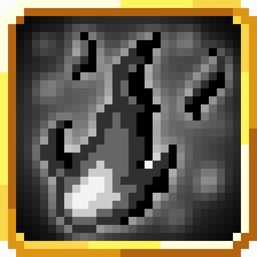
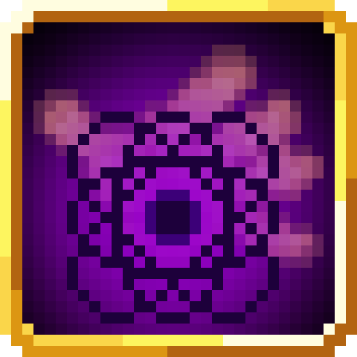
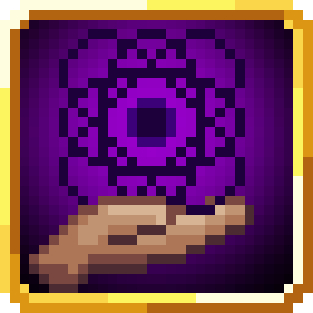
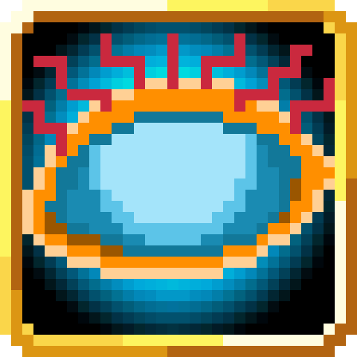
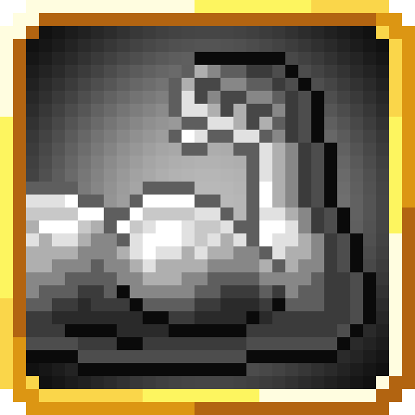
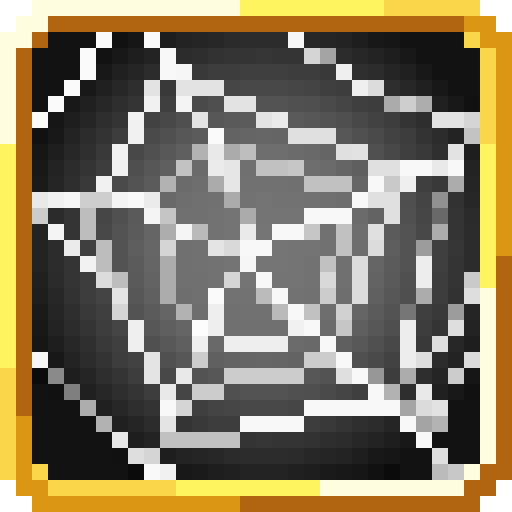
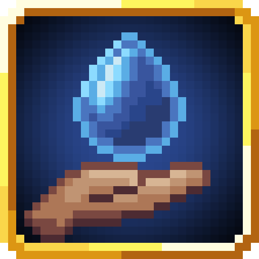
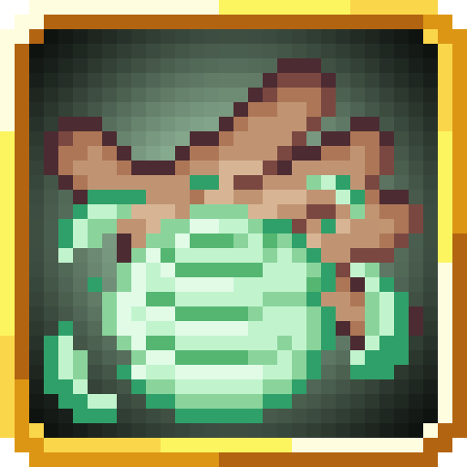

<section class="reference-directory" data-reference-directory="skills/extra">
<header class="reference-directory-hero reference-theme-abilities">

Tensura reference collection

<h1>Extra Skills</h1>

Extra-class skills and their documented progressions.

<strong>52</strong> articles

</header>

<label class="reference-filter-label">
Filter this collection
<input type="search" class="reference-filter-input" placeholder="Search titles and summaries…" autocomplete="off">
</label>

<button type="button" class="is-active" data-letter="all" aria-pressed="true">All</button>
<button type="button" data-letter="A" aria-pressed="false">A</button>
<button type="button" data-letter="B" aria-pressed="false">B</button>
<button type="button" data-letter="C" aria-pressed="false">C</button>
<button type="button" data-letter="D" aria-pressed="false">D</button>
<button type="button" data-letter="E" aria-pressed="false">E</button>
<button type="button" data-letter="F" aria-pressed="false">F</button>
<button type="button" data-letter="G" aria-pressed="false">G</button>
<button type="button" data-letter="H" aria-pressed="false">H</button>
<button type="button" data-letter="I" aria-pressed="false">I</button>
<button type="button" data-letter="L" aria-pressed="false">L</button>
<button type="button" data-letter="M" aria-pressed="false">M</button>
<button type="button" data-letter="S" aria-pressed="false">S</button>
<button type="button" data-letter="T" aria-pressed="false">T</button>
<button type="button" data-letter="U" aria-pressed="false">U</button>
<button type="button" data-letter="W" aria-pressed="false">W</button>

Showing 52 of 52 articles

<article class="reference-card" data-letter="A" data-search="all seeing eye go into a 3rd person mode, which increases your pov and grants movement and action buffs as well as an upgrade to presence sense.">
<a href="all-seeing-eye/" aria-label="Open All Seeing Eye">
<figure class="reference-card-media reference-card-media--source">

<figcaption>Source media</figcaption>
</figure>

<h2>All Seeing Eye</h2>

Go into a 3rd person mode, which increases your POV and grants movement and action buffs as well as an upgrade to Presence Sense.

Open reference →

</a>
</article>
<article class="reference-card" data-letter="A" data-search="analytical appraisal assess the soul of your opponents to gain insight into their overall strength.">
<a href="analytical-appraisal/" aria-label="Open Analytical Appraisal">
<figure class="reference-card-media reference-card-media--source">

<figcaption>Source media</figcaption>
</figure>

<h2>Analytical Appraisal</h2>

Assess the soul of your opponents to gain insight into their overall strength.

Open reference →

</a>
</article>
<article class="reference-card" data-letter="B" data-search="black flame command the tempest infused flames to spew out black flames at your enemies or even shoot deadly fireballs and hell flares.">
<a href="black-flame/" aria-label="Open Black Flame">
<figure class="reference-card-media reference-card-media--source">

<figcaption>Source media</figcaption>
</figure>

<h2>Black Flame</h2>

Command the tempest infused flames to spew out black flames at your enemies or even shoot deadly fireballs and hell flares.

Open reference →

</a>
</article>
<article class="reference-card" data-letter="B" data-search="black lightning shoot black lightning at varying strength, or summon a massive storm which attacks any non-allied mobs. a short range plasma blast can also be used to melt even the…">
<a href="black-lightning/" aria-label="Open Black Lightning">
<figure class="reference-card-media reference-card-media--source">

<figcaption>Source media</figcaption>
</figure>

<h2>Black Lightning</h2>

Shoot black lightning at varying strength, or summon a massive storm which attacks any non-allied mobs. A short range plasma blast can also be used to melt even the…

Open reference →

</a>
</article>
<article class="reference-card" data-letter="B" data-search="body double use a tenth of your magical power to summon an identical clone which takes increased damage but will fight for you until the end. the user can exchange places with the…">
<a href="body-double/" aria-label="Open Body Double">
<figure class="reference-card-media reference-card-media--source">

<figcaption>Source media</figcaption>
</figure>

<h2>Body Double</h2>

Use a tenth of your magical power to summon an identical clone which takes increased damage but will fight for you until the end. The user can exchange places with the…

Open reference →

</a>
</article>
<article class="reference-card" data-letter="C" data-search="chant annulment become able to cast mastered magic instantly, in water or even under the effects of silence.">
<a href="chant-annulment/" aria-label="Open Chant Annulment">
<figure class="reference-card-media reference-card-media--source">

<figcaption>Source media</figcaption>
</figure>

<h2>Chant Annulment</h2>

Become able to cast mastered magic instantly, in water or even under the effects of silence.

Open reference →

</a>
</article>
<article class="reference-card" data-letter="D" data-search="danger sense receive a mental warning when entities with hostile intent enter your proximity.">
<a href="danger-sense/" aria-label="Open Danger Sense">
<figure class="reference-card-media reference-card-media--source">

<figcaption>Source media</figcaption>
</figure>

<h2>Danger Sense</h2>

Receive a mental warning when entities with hostile intent enter your proximity.

Open reference →

</a>
</article>
<article class="reference-card" data-letter="D" data-search="demon lord haki unleash your demonic aura causing those around you to quake in fear.">
<a href="demon-lord-haki/" aria-label="Open Demon Lord Haki">
<figure class="reference-card-media reference-card-media--source">

<figcaption>Source media</figcaption>
</figure>

<h2>Demon Lord Haki</h2>

Unleash your Demonic aura causing those around you to quake in fear.

Open reference →

</a>
</article>
<article class="reference-card" data-letter="E" data-search="earth domination boosts the power of earth skills by a large amount.">
<a href="earth-domination/" aria-label="Open Earth Domination">
<figure class="reference-card-media reference-card-media--source">

<figcaption>Source media</figcaption>
</figure>

<h2>Earth Domination</h2>

Boosts the power of Earth skills by a large amount.

Open reference →

</a>
</article>
<article class="reference-card" data-letter="E" data-search="earth manipulation boosts the power of earth abilities by a decent amount.">
<a href="earth-manipulation/" aria-label="Open Earth Manipulation">
<figure class="reference-card-media reference-card-media--source">

<figcaption>Source media</figcaption>
</figure>

<h2>Earth Manipulation</h2>

Boosts the power of Earth abilities by a decent amount.

Open reference →

</a>
</article>
<article class="reference-card" data-letter="F" data-search="flame domination boosts the power of fire skills by a large amount.">
<a href="flame-domination/" aria-label="Open Flame Domination">
<figure class="reference-card-media reference-card-media--source">

<figcaption>Source media</figcaption>
</figure>

<h2>Flame Domination</h2>

Boosts the power of fire skills by a large amount.

Open reference →

</a>
</article>
<article class="reference-card" data-letter="F" data-search="flame manipulation boosts the power of fire skills by a decent amount.">
<a href="flame-manipulation/" aria-label="Open Flame Manipulation">
<figure class="reference-card-media reference-card-media--source">

<figcaption>Source media</figcaption>
</figure>

<h2>Flame Manipulation</h2>

Boosts the power of fire skills by a decent amount.

Open reference →

</a>
</article>
<article class="reference-card" data-letter="G" data-search="godwolf sense improve your senses to be able to see in the dark or even spot invisible entities nearby.">
<a href="godwolf-sense/" aria-label="Open Godwolf Sense">
<figure class="reference-card-media reference-card-media--source">

<figcaption>Source media</figcaption>
</figure>

<h2>Godwolf Sense</h2>

Improve your senses to be able to see in the dark or even spot invisible entities nearby.

Open reference →

</a>
</article>
<article class="reference-card" data-letter="G" data-search="gravity domination boosts gravity skills by a large amount and allows you to fly without hindrance.">
<a href="gravity-domination/" aria-label="Open Gravity Domination">
<figure class="reference-card-media reference-card-media--source">

<figcaption>Source media</figcaption>
</figure>

<h2>Gravity Domination</h2>

Boosts Gravity skills by a large amount and allows you to fly without hindrance.

Open reference →

</a>
</article>
<article class="reference-card" data-letter="G" data-search="gravity manipulation boosts gravity skills by a decent amount and allows you to fly without hindrance.">
<a href="gravity-manipulation/" aria-label="Open Gravity Manipulation">
<figure class="reference-card-media reference-card-media--source">

<figcaption>Source media</figcaption>
</figure>

<h2>Gravity Manipulation</h2>

Boosts Gravity skills by a decent amount and allows you to fly without hindrance.

Open reference →

</a>
</article>
<article class="reference-card" data-letter="H" data-search="haki project your aura to cow nearby foes into submission.">
<a href="haki/" aria-label="Open Haki">
<figure class="reference-card-media reference-card-media--source">

<figcaption>Source media</figcaption>
</figure>

<h2>Haki</h2>

Project your aura to cow nearby foes into submission.

Open reference →

</a>
</article>
<article class="reference-card" data-letter="H" data-search="heat wave shoot a fiery projectile or summon a short-ranged fire storm which will damage all nearby entities">
<a href="heat-wave/" aria-label="Open Heat Wave">
<figure class="reference-card-media reference-card-media--source">

<figcaption>Source media</figcaption>
</figure>

<h2>Heat Wave</h2>

Shoot a fiery projectile or summon a short-ranged fire storm which will damage all nearby entities

Open reference →

</a>
</article>
<article class="reference-card" data-letter="H" data-search="heavenly eye project your otherworldly gaze to see all nearby entities and partially ignore dodging abilities.">
<a href="heavenly-eye/" aria-label="Open Heavenly Eye">
<figure class="reference-card-media reference-card-media--source">

<figcaption>Source media</figcaption>
</figure>

<h2>Heavenly Eye</h2>

Project your otherworldly gaze to see all nearby entities and partially ignore dodging abilities.

Open reference →

</a>
</article>
<article class="reference-card" data-letter="H" data-search="hero haki use your hero aura to inspire your allies and terrify your enemies.">
<a href="hero-haki/" aria-label="Open Hero Haki">
<figure class="reference-card-media reference-card-media--source">

<figcaption>Source media</figcaption>
</figure>

<h2>Hero Haki</h2>

Use your Hero Aura to inspire your allies and terrify your enemies.

Open reference →

</a>
</article>
<article class="reference-card" data-letter="I" data-search="infinite regeneration use your massive amount of magicules to instantly regenerate from all but the most grievous of injuries.">
<a href="infinite-regeneration/" aria-label="Open Infinite Regeneration">
<figure class="reference-card-media reference-card-media--source">

<figcaption>Source media</figcaption>
</figure>

<h2>Infinite Regeneration</h2>

Use your massive amount of magicules to instantly regenerate from all but the most grievous of injuries.

Open reference →

</a>
</article>
<article class="reference-card" data-letter="L" data-search="law manipulation manipulate the laws and aspects of the world itself using your vast knowledge of multiple aspects">
<a href="law-manipulation/" aria-label="Open Law Manipulation">
<figure class="reference-card-media reference-card-media--source">

<figcaption>Source media</figcaption>
</figure>

<h2>Law Manipulation</h2>

Manipulate the laws and aspects of the world itself using your vast knowledge of multiple aspects

Open reference →

</a>
</article>
<article class="reference-card" data-letter="L" data-search="lightning domination boosts lightning skills by a large amount">
<a href="lightning-domination/" aria-label="Open Lightning Domination">
<figure class="reference-card-media reference-card-media--source">

<figcaption>Source media</figcaption>
</figure>

<h2>Lightning Domination</h2>

Boosts Lightning skills by a large amount

Open reference →

</a>
</article>
<article class="reference-card" data-letter="L" data-search="lightning manipulation boosts lightning skills by a decent amount">
<a href="lightning-manipulation/" aria-label="Open Lightning Manipulation">
<figure class="reference-card-media reference-card-media--source">

<figcaption>Source media</figcaption>
</figure>

<h2>Lightning Manipulation</h2>

Boosts Lightning skills by a decent amount

Open reference →

</a>
</article>
<article class="reference-card" data-letter="M" data-search="majesty by boosting your reputation with the villagers, gain a permanent hero of the village effect">
<a href="majesty/" aria-label="Open Majesty">
<figure class="reference-card-media reference-card-media--source">

<figcaption>Source media</figcaption>
</figure>

<h2>Majesty</h2>

By boosting your reputation with the villagers, gain a permanent Hero of the Village effect

Open reference →

</a>
</article>
<article class="reference-card" data-letter="M" data-search="mana manipulation use your refined knowledge and perception of mana to manipulate it easily">
<a href="mana-manipulation/" aria-label="Open Mana Manipulation">
<figure class="reference-card-media reference-card-media--source">

<figcaption>Source media</figcaption>
</figure>

<h2>Mana Manipulation</h2>

Use your refined knowledge and perception of mana to manipulate it easily

Open reference →

</a>
</article>
<article class="reference-card" data-letter="M" data-search="molecular manipulation use your intricate knowledge and power over the building blocks of the world to obtain blocks and move entities">
<a href="molecular-manipulation/" aria-label="Open Molecular Manipulation">
<figure class="reference-card-media reference-card-media--source">

<figcaption>Source media</figcaption>
</figure>

<h2>Molecular Manipulation</h2>

Use your intricate knowledge and power over the building blocks of the world to obtain blocks and move entities

Open reference →

</a>
</article>
<article class="reference-card" data-letter="M" data-search="mortal fear inspire a gripping fear of death in weaker enemies while empowering your allies in a short range.">
<a href="mortal-fear/" aria-label="Open Mortal Fear">
<figure class="reference-card-media reference-card-media--source">

<figcaption>Source media</figcaption>
</figure>

<h2>Mortal Fear</h2>

Inspire a gripping fear of death in weaker enemies while empowering your allies in a short range.

Open reference →

</a>
</article>
<article class="reference-card" data-letter="M" data-search="multilayer barrier protect yourself with a multitude of powerful defensive barriers">
<a href="multilayer-barrier/" aria-label="Open Multilayer Barrier">
<figure class="reference-card-media reference-card-media--source">

<figcaption>Source media</figcaption>
</figure>

<h2>Multilayer Barrier</h2>

Protect yourself with a multitude of powerful defensive barriers

Open reference →

</a>
</article>
<article class="reference-card" data-letter="S" data-search="sacred haki strike fear into the hearts of evil and give strength to your allies">
<a href="sacred-haki/" aria-label="Open Sacred Haki">
<figure class="reference-card-media reference-card-media--source">

<figcaption>Source media</figcaption>
</figure>

<h2>Sacred Haki</h2>

Strike fear into the hearts of evil and give strength to your allies

Open reference →

</a>
</article>
<article class="reference-card" data-letter="S" data-search="sage increase the speed at which you learn and master skills, magic and arts.">
<a href="sage/" aria-label="Open Sage">
<figure class="reference-card-media reference-card-media--source">

<figcaption>Source media</figcaption>
</figure>

<h2>Sage</h2>

Increase the speed at which you learn and master skills, magic and arts.

Open reference →

</a>
</article>
<article class="reference-card" data-letter="S" data-search="sense heat source highlights entities that generate heat nearby">
<a href="sense-heat-source/" aria-label="Open Sense Heat Source">
<figure class="reference-card-media reference-card-media--source">

<figcaption>Source media</figcaption>
</figure>

<h2>Sense Heat Source</h2>

Highlights entities that generate heat nearby

Open reference →

</a>
</article>
<article class="reference-card" data-letter="S" data-search="sense soundwave empower your ears to precisely locate any nearby entities">
<a href="sense-soundwave/" aria-label="Open Sense Soundwave">
<figure class="reference-card-media reference-card-media--source">

<figcaption>Source media</figcaption>
</figure>

<h2>Sense Soundwave</h2>

Empower your ears to precisely locate any nearby entities

Open reference →

</a>
</article>
<article class="reference-card" data-letter="S" data-search="shadow motion melt into the shadows and move unseen by all but the most keen observers">
<a href="shadow-motion/" aria-label="Open Shadow Motion">
<figure class="reference-card-media reference-card-media--source">

<figcaption>Source media</figcaption>
</figure>

<h2>Shadow Motion</h2>

Melt into the shadows and move unseen by all but the most keen observers

Open reference →

</a>
</article>
<article class="reference-card" data-letter="S" data-search="snake eye apply various debuffs on targets on sight.">
<a href="snake-eye/" aria-label="Open Snake Eye">
<figure class="reference-card-media reference-card-media--source">

<figcaption>Source media</figcaption>
</figure>

<h2>Snake Eye</h2>

Apply various debuffs on targets on sight.

Open reference →

</a>
</article>
<article class="reference-card" data-letter="S" data-search="sound domination boosts sound skills by a large amount">
<a href="sound-domination/" aria-label="Open Sound Domination">
<figure class="reference-card-media reference-card-media--source">

<figcaption>Source media</figcaption>
</figure>

<h2>Sound Domination</h2>

Boosts sound skills by a large amount

Open reference →

</a>
</article>
<article class="reference-card" data-letter="S" data-search="sound manipulation boosts sound skills by a decent amount">
<a href="sound-manipulation/" aria-label="Open Sound Manipulation">
<figure class="reference-card-media reference-card-media--source">

<figcaption>Source media</figcaption>
</figure>

<h2>Sound Manipulation</h2>

Boosts sound skills by a decent amount

Open reference →

</a>
</article>
<article class="reference-card" data-letter="S" data-search="spatial domination boosts space skills by a large amount and deals massive damage by splitting a target with dimensional attacks">
<a href="spatial-domination/" aria-label="Open Spatial Domination">
<figure class="reference-card-media reference-card-media--source">

<figcaption>Source media</figcaption>
</figure>

<h2>Spatial Domination</h2>

Boosts Space skills by a large amount and deals massive damage by splitting a target with dimensional attacks

Open reference →

</a>
</article>
<article class="reference-card" data-letter="S" data-search="spatial manipulation boosts space skills by a decent amount and manipulate space to empower your ranged attacks.">
<a href="spatial-manipulation/" aria-label="Open Spatial Manipulation">
<figure class="reference-card-media reference-card-media--source">

<figcaption>Source media</figcaption>
</figure>

<h2>Spatial Manipulation</h2>

Boosts Space skills by a decent amount and manipulate space to empower your ranged attacks.

Open reference →

</a>
</article>
<article class="reference-card" data-letter="S" data-search="spatial motion tear space asunder granting yourself and your allies safe passage">
<a href="spatial-motion/" aria-label="Open Spatial Motion">
<figure class="reference-card-media reference-card-media--source">

<figcaption>Source media</figcaption>
</figure>

<h2>Spatial Motion</h2>

Tear space asunder granting yourself and your allies safe passage

Open reference →

</a>
</article>
<article class="reference-card" data-letter="S" data-search="steel strength strengthen your muscles and gain an increase in damage, with mastery you can do this automatically.">
<a href="steel-strength/" aria-label="Open Steel Strength">
<figure class="reference-card-media reference-card-media--source">

<figcaption>Source media</figcaption>
</figure>

<h2>Steel Strength</h2>

Strengthen your muscles and gain an increase in damage, with mastery you can do this automatically.

Open reference →

</a>
</article>
<article class="reference-card" data-letter="S" data-search="sticky steel thread manipulate threads in various forms.">
<a href="sticky-steel-thread/" aria-label="Open Sticky Steel Thread">
<figure class="reference-card-media reference-card-media--source">

<figcaption>Source media</figcaption>
</figure>

<h2>Sticky Steel Thread</h2>

Manipulate threads in various forms.

Open reference →

</a>
</article>
<article class="reference-card" data-letter="S" data-search="strengthen body strengthen your body to better protect yourself against attacks.">
<a href="strengthen-body/" aria-label="Open Strengthen Body">
<figure class="reference-card-media reference-card-media--source">

<figcaption>Source media</figcaption>
</figure>

<h2>Strengthen Body</h2>

Strengthen your body to better protect yourself against attacks.

Open reference →

</a>
</article>
<article class="reference-card" data-letter="T" data-search="thought acceleration increase the speed at which you think to cast magic more quickly as well as to increase your reaction speed">
<a href="thought-acceleration/" aria-label="Open Thought Acceleration">
<figure class="reference-card-media reference-card-media--source">

<figcaption>Source media</figcaption>
</figure>

<h2>Thought Acceleration</h2>

Increase the speed at which you think to cast magic more quickly as well as to increase your reaction speed

Open reference →

</a>
</article>
<article class="reference-card" data-letter="U" data-search="ultra-instinct enhance your senses to dodge physical impacts.">
<a href="ultra-instinct/" aria-label="Open Ultra-Instinct">
<figure class="reference-card-media reference-card-media--source">

<figcaption>Source media</figcaption>
</figure>

<h2>Ultra-Instinct</h2>

Enhance your senses to dodge physical impacts.

Open reference →

</a>
</article>
<article class="reference-card" data-letter="U" data-search="ultraspeed regeneration use your massive amount of magicules to instantly regenerate from all but the most grievous of injuries.">
<a href="ultraspeed-regeneration/" aria-label="Open Ultraspeed Regeneration">
<figure class="reference-card-media reference-card-media--source">

<figcaption>Source media</figcaption>
</figure>

<h2>Ultraspeed Regeneration</h2>

Use your massive amount of magicules to instantly regenerate from all but the most grievous of injuries.

Open reference →

</a>
</article>
<article class="reference-card" data-letter="U" data-search="universal perception combine all magic, sound and heat senses to detect entities around.">
<a href="universal-perception/" aria-label="Open Universal Perception">
<figure class="reference-card-media reference-card-media--source">

<figcaption>Source media</figcaption>
</figure>

<h2>Universal Perception</h2>

Combine all magic, sound and heat senses to detect entities around.

Open reference →

</a>
</article>
<article class="reference-card" data-letter="W" data-search="water domination boosts water skills by a large amount">
<a href="water-domination/" aria-label="Open Water Domination">
<figure class="reference-card-media reference-card-media--source">

<figcaption>Source media</figcaption>
</figure>

<h2>Water Domination</h2>

Boosts Water skills by a large amount

Open reference →

</a>
</article>
<article class="reference-card" data-letter="W" data-search="water manipulation boosts water skills by a decent amount">
<a href="water-manipulation/" aria-label="Open Water Manipulation">
<figure class="reference-card-media reference-card-media--source">

<figcaption>Source media</figcaption>
</figure>

<h2>Water Manipulation</h2>

Boosts Water skills by a decent amount

Open reference →

</a>
</article>
<article class="reference-card" data-letter="W" data-search="weather domination use magicules to manipulate the weather with a higher efficiency.">
<a href="weather-domination/" aria-label="Open Weather Domination">
<figure class="reference-card-media reference-card-media--source">

<figcaption>Source media</figcaption>
</figure>

<h2>Weather Domination</h2>

Use Magicules to manipulate the weather with a higher efficiency.

Open reference →

</a>
</article>
<article class="reference-card" data-letter="W" data-search="weather manipulation use magicules to manipulate the weather.">
<a href="weather-manipulation/" aria-label="Open Weather Manipulation">
<figure class="reference-card-media reference-card-media--source">

<figcaption>Source media</figcaption>
</figure>

<h2>Weather Manipulation</h2>

Use magicules to manipulate the weather.

Open reference →

</a>
</article>
<article class="reference-card" data-letter="W" data-search="wind domination boosts wind skills by a large amount">
<a href="wind-domination/" aria-label="Open Wind Domination">
<figure class="reference-card-media reference-card-media--source">

<figcaption>Source media</figcaption>
</figure>

<h2>Wind Domination</h2>

Boosts wind skills by a large amount

Open reference →

</a>
</article>
<article class="reference-card" data-letter="W" data-search="wind manipulation boosts wind abilities by a decent amount.">
<a href="wind-manipulation/" aria-label="Open Wind Manipulation">
<figure class="reference-card-media reference-card-media--source">

<figcaption>Source media</figcaption>
</figure>

<h2>Wind Manipulation</h2>

Boosts Wind abilities by a decent amount.

Open reference →

</a>
</article>

No matching articles. Try a broader search.

</section>
