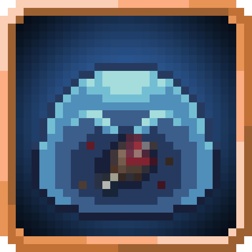

<section class="skill-hub-hero">

The ability index
<h1>Skills &amp; abilities.</h1>
Find your next skill. Learn how to obtain it. See what it unlocks.
<a class="skill-hub-guide" href="../../skills-ep-and-magicules/">Understand EP, mastery &amp; Magicules ↗</a>

<aside class="skill-feature">
Follow a mastery path

<a href="../../mysticism-reference/skills/extra/ice-manipulation/"><strong>Ice Manipulation</strong></a>→<a href="../../mysticism-reference/skills/extra/ice-domination/"><strong>Ice Domination</strong></a>

Mastery is one step. Open the next skill to check every acquisition requirement.
</aside></section>
<section class="skill-finder" aria-labelledby="skill-finder-title"><h2 id="skill-finder-title">Find an ability</h2><label for="skill-hub-search">Search across all skill types</label>
<input id="skill-hub-search" type="search" autocomplete="off" placeholder="Try Great Sage, Ice Domination, Energy Charge…"><button type="button" data-clear-skill-search>Clear</button>

Search skills and Battlewill from the unified catalogue. Browse Magic and Resistances below.

<noscript>
Use the category links below to browse without JavaScript.
</noscript></section>

<h2>Browse by type</h2>
One catalogue. Every source kept in context.

<a class="skill-category-tile" href="intrinsic/">55 entries<h3>Intrinsic</h3>
Talents inherent to a race or evolution.
Browse intrinsic ↗</a>
<a class="skill-category-tile" href="common/">20 entries<h3>Common</h3>
Foundational combat, movement and utility.
Browse common ↗</a>
<a class="skill-category-tile" href="extra/">104 entries<h3>Extra</h3>
Specialized techniques and mastery upgrades.
Browse extra ↗</a>
<a class="skill-category-tile" href="unique/">141 entries<h3>Unique</h3>
Build-defining powers, modes and passives.
Browse unique ↗</a>
<a class="skill-category-tile" href="ultimate/">66 entries<h3>Ultimate</h3>
Advanced powers and awakening requirements.
Browse ultimate ↗</a>
<a class="skill-category-tile" href="../battlewill/">26 entries<h3>Battlewill</h3>
Aura techniques, training and resource control.
Browse battlewill ↗</a>
<a class="skill-category-tile" href="../magic/">138 entries<h3>Magic</h3>
Spells, schools and their casting mechanics.
Browse magic ↗</a>
<a class="skill-category-tile" href="../resistances/">45 entries<h3>Resistances</h3>
Defensive effects and nullifications.
Browse resistances ↗</a>

<section class="skill-reading-guide">
01<h3>Check how to obtain it</h3>
A cost is not an unlock method. Look for the route, prerequisites, and build-specific conditions.

02<h3>Read the active modes</h3>
Separate passives, toggles and active effects before planning how to use a skill.

03<h3>Follow the next unlock</h3>
Use the progression cards to explore mastery, combination and awakening connections.

</section>

Build coverage &amp; source notes

The directories combine recorded pack entries with Nightmares’ 1.21.1 reference build. Nightmares entries retain <strong>Server build match pending</strong> until the installed release and configuration are confirmed. Historical and explicitly non-gameplay entries are excluded from current skill directories. A race-granted skill can still be Extra-class: obtainment does not change its type.

Source-described obtainment is distinguished from pinned-build checks, partial prerequisites and unknown methods. A registry entry does not prove a normal gameplay unlock. <a href="../../project/sources-and-attribution/">Browse the source directory</a>.

Ability index image credits
<ul>
<li><a href="https://tensura.wiki.gg/wiki/File:Absorb_and_dissolve.png">Absorb and dissolve.png</a> · CC BY-SA 4.0</li>
<li><a href="https://tensura.wiki.gg/wiki/File:Self_regeneration.png">Self regeneration.png</a> · CC BY-SA 4.0</li>
<li><a href="https://tensura.wiki.gg/wiki/File:Analytical_appraisal.png">Analytical appraisal.png</a> · CC BY-SA 4.0</li>
<li><a href="https://tensura.wiki.gg/wiki/File:Great_sage.png">Great sage.png</a> · CC BY-SA 4.0</li>
<li><a href="https://tensura.wiki.gg/wiki/File:Gate.png">Gate.png</a> · CC BY-SA 4.0</li>
<li><a href="https://tensura.wiki.gg/wiki/File:Pain_nullification.png">Pain nullification.png</a> · CC BY-SA 4.0</li>
<li><a href="https://trmysticism.wiki.gg/wiki/File:Ice_Manipulation.png">Ice Manipulation.png</a> · CC BY-SA 4.0</li>
<li><a href="https://trmysticism.wiki.gg/wiki/File:Ice_Domination.png">Ice Domination.png</a> · CC BY-SA 4.0</li>
<li>Energy Charge and The Timeless Mage: <a href="https://www.curseforge.com/minecraft/mc-mods/tensura-ascensions">Tensura: Ascension</a>.</li></ul>

