<section class="reference-directory" data-reference-directory="skills/intrinsic">
<header class="reference-directory-hero reference-theme-abilities">

Tensura reference collection

<h1>Intrinsic Skills</h1>

Intrinsic racial and species-linked skills.

<strong>31</strong> articles

</header>

<label class="reference-filter-label">
Filter this collection
<input type="search" class="reference-filter-input" placeholder="Search titles and summaries…" autocomplete="off">
</label>

<button type="button" class="is-active" data-letter="all" aria-pressed="true">All</button>
<button type="button" data-letter="A" aria-pressed="false">A</button>
<button type="button" data-letter="B" aria-pressed="false">B</button>
<button type="button" data-letter="C" aria-pressed="false">C</button>
<button type="button" data-letter="D" aria-pressed="false">D</button>
<button type="button" data-letter="E" aria-pressed="false">E</button>
<button type="button" data-letter="F" aria-pressed="false">F</button>
<button type="button" data-letter="G" aria-pressed="false">G</button>
<button type="button" data-letter="L" aria-pressed="false">L</button>
<button type="button" data-letter="O" aria-pressed="false">O</button>
<button type="button" data-letter="P" aria-pressed="false">P</button>
<button type="button" data-letter="S" aria-pressed="false">S</button>
<button type="button" data-letter="T" aria-pressed="false">T</button>
<button type="button" data-letter="U" aria-pressed="false">U</button>
<button type="button" data-letter="W" aria-pressed="false">W</button>

Showing 31 of 31 articles

<article class="reference-card" data-letter="A" data-search="absorb &amp; dissolve dissolve specific items to instantly consume them.">
<a href="absorb-dissolve/" aria-label="Open Absorb &amp; Dissolve">
<figure class="reference-card-media reference-card-media--source">
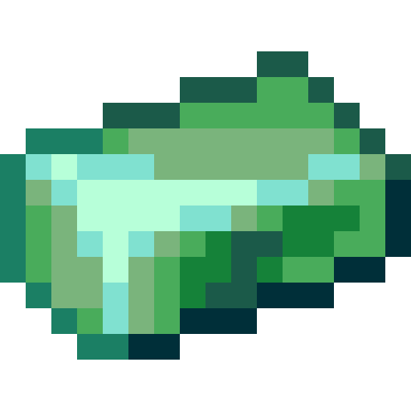
<figcaption>Source media</figcaption>
</figure>

<h2>Absorb &amp; Dissolve</h2>

Dissolve specific items to instantly consume them.

Open reference →

</a>
</article>
<article class="reference-card" data-letter="B" data-search="beast transformation transform into a beast to restore your vitality and boost your physical body. the transformation will grant great physical prowess but leave a toll on your body.">
<a href="beast-transformation/" aria-label="Open Beast Transformation">
<figure class="reference-card-media reference-card-media--source">
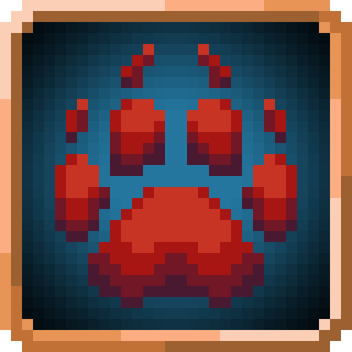
<figcaption>Source media</figcaption>
</figure>

<h2>Beast Transformation</h2>

Transform into a beast to restore your vitality and boost your physical body. The transformation will grant great physical prowess but leave a toll on your body.

Open reference →

</a>
</article>
<article class="reference-card" data-letter="B" data-search="blood mist spill your own blood to summon a mist which steals the vitality of your enemies and can be blown up to harm any nearby entities or shoot a powerful blood beam.">
<a href="blood-mist/" aria-label="Open Blood Mist">
<figure class="reference-card-media reference-card-media--source">
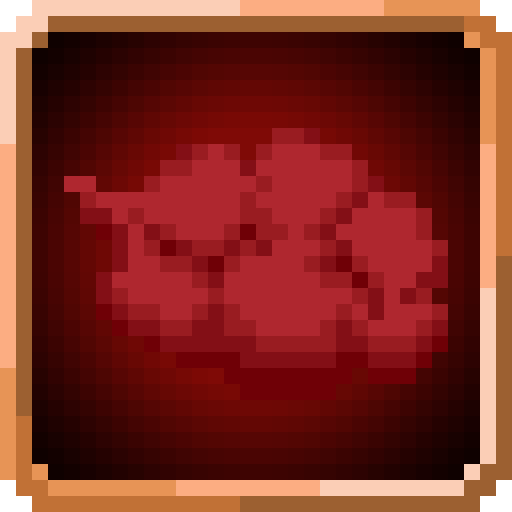
<figcaption>Source media</figcaption>
</figure>

<h2>Blood Mist</h2>

Spill your own blood to summon a mist which steals the vitality of your enemies and can be blown up to harm any nearby entities or shoot a powerful blood beam.

Open reference →

</a>
</article>
<article class="reference-card" data-letter="B" data-search="body armor protect yourself from harm by summoning armoursaurus scales around your body.">
<a href="body-armor/" aria-label="Open Body Armor">
<figure class="reference-card-media reference-card-media--source">
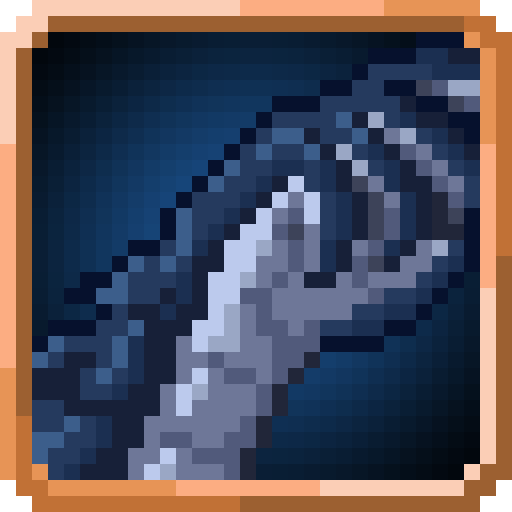
<figcaption>Source media</figcaption>
</figure>

<h2>Body Armor</h2>

Protect yourself from harm by summoning armoursaurus scales around your body.

Open reference →

</a>
</article>
<article class="reference-card" data-letter="C" data-search="charm use your inherent power to turn your opponents neutral or to temporarily dominate weak opponents.">
<a href="charm/" aria-label="Open Charm">
<figure class="reference-card-media reference-card-media--source">
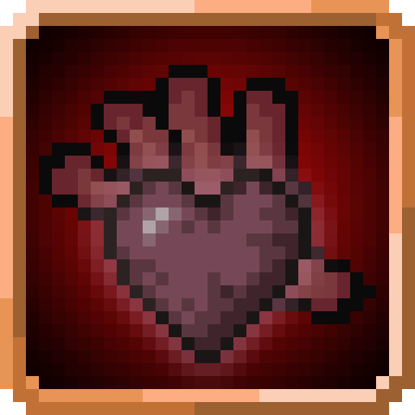
<figcaption>Source media</figcaption>
</figure>

<h2>Charm</h2>

Use your inherent power to turn your opponents neutral or to temporarily dominate weak opponents.

Open reference →

</a>
</article>
<article class="reference-card" data-letter="D" data-search="darkness transform channel your inner darkness to burn and blind nearby opponents.">
<a href="darkness-transform/" aria-label="Open Darkness Transform">
<figure class="reference-card-media reference-card-media--source">
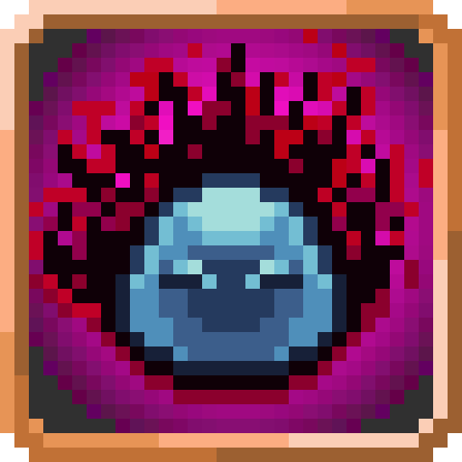
<figcaption>Source media</figcaption>
</figure>

<h2>Darkness Transform</h2>

Channel your inner darkness to burn and blind nearby opponents.

Open reference →

</a>
</article>
<article class="reference-card" data-letter="D" data-search="divine ki release use your divine ki to amplify your battlewill to deal more damage and destroy weaker equipment.">
<a href="divine-ki-release/" aria-label="Open Divine Ki Release">
<figure class="reference-card-media reference-card-media--source">

<figcaption>Source media</figcaption>
</figure>

<h2>Divine Ki Release</h2>

Use your Divine Ki to amplify your battlewill to deal more damage and destroy weaker equipment.

Open reference →

</a>
</article>
<article class="reference-card" data-letter="D" data-search="dragon ear use your sensitive hearing to precisely pin the location of any nearby mobs which make sound.">
<a href="dragon-ear/" aria-label="Open Dragon Ear">
<figure class="reference-card-media reference-card-media--source">
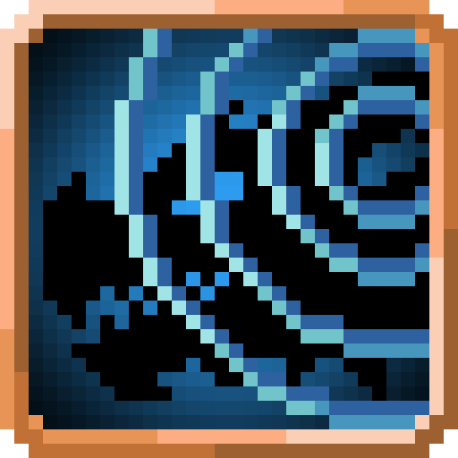
<figcaption>Source media</figcaption>
</figure>

<h2>Dragon Ear</h2>

Use your sensitive hearing to precisely pin the location of any nearby mobs which make sound.

Open reference →

</a>
</article>
<article class="reference-card" data-letter="D" data-search="dragon eye use your powerful sight to access the power of any entities and see in the far distance.">
<a href="dragon-eye/" aria-label="Open Dragon Eye">
<figure class="reference-card-media reference-card-media--source">

<figcaption>Source media</figcaption>
</figure>

<h2>Dragon Eye</h2>

Use your powerful sight to access the power of any entities and see in the far distance.

Open reference →

</a>
</article>
<article class="reference-card" data-letter="D" data-search="dragon mode once a day, draw out your monstrous potential to double your ep and to boost your physical prowess. doing this will leave a temporary toll on your body.">
<a href="dragon-mode/" aria-label="Open Dragon Mode">
<figure class="reference-card-media reference-card-media--source">

<figcaption>Source media</figcaption>
</figure>

<h2>Dragon Mode</h2>

Once a day, draw out your monstrous potential to double your EP and to boost your physical prowess. Doing this will leave a temporary toll on your body.

Open reference →

</a>
</article>
<article class="reference-card" data-letter="D" data-search="dragon skin transform your skin into scales which become tougher as you gain more ep">
<a href="dragon-skin/" aria-label="Open Dragon Skin">
<figure class="reference-card-media reference-card-media--source">
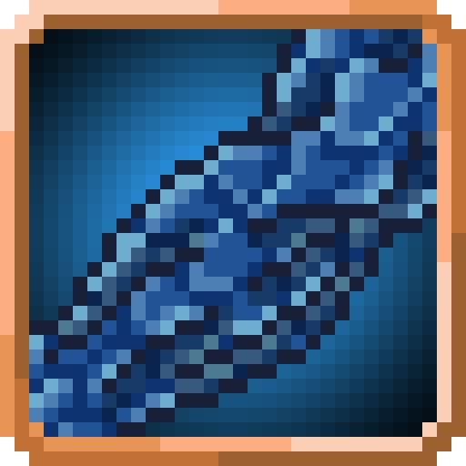
<figcaption>Source media</figcaption>
</figure>

<h2>Dragon Skin</h2>

Transform your skin into scales which become tougher as you gain more EP

Open reference →

</a>
</article>
<article class="reference-card" data-letter="D" data-search="drain steal the vitality of your opponent and temporarily transform this skill into one of theirs to potentially turn the tables.">
<a href="drain/" aria-label="Open Drain">
<figure class="reference-card-media reference-card-media--source">
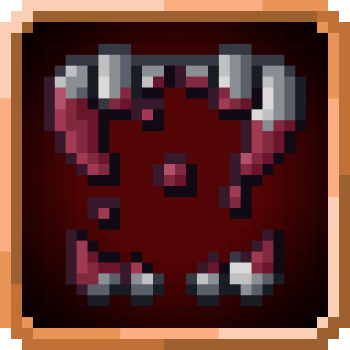
<figcaption>Source media</figcaption>
</figure>

<h2>Drain</h2>

Steal the vitality of your opponent and temporarily transform this skill into one of theirs to potentially turn the tables.

Open reference →

</a>
</article>
<article class="reference-card" data-letter="E" data-search="earth transform channel the powers of the earth to deal increased damage and increase local gravity around you.">
<a href="earth-transform/" aria-label="Open Earth Transform">
<figure class="reference-card-media reference-card-media--source">
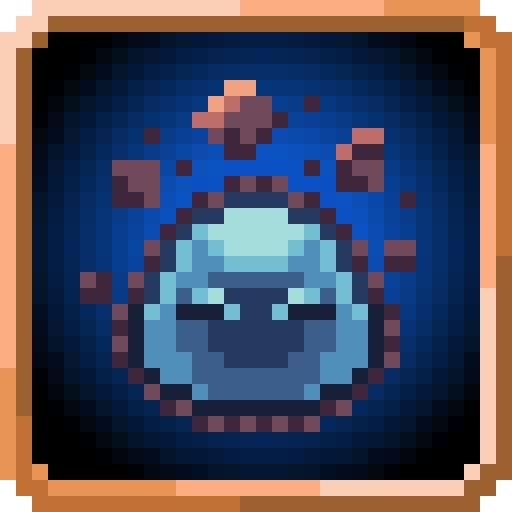
<figcaption>Source media</figcaption>
</figure>

<h2>Earth Transform</h2>

Channel the powers of the earth to deal increased damage and increase local gravity around you.

Open reference →

</a>
</article>
<article class="reference-card" data-letter="E" data-search="eye of truth by obtaining the mythical hero egg, the veil of deception is torn apart. no illusion or concealment can deceive your sight, and your vision becomes perfect.">
<a href="eye-of-truth/" aria-label="Open Eye Of Truth">
<figure class="reference-card-media reference-card-media--source">
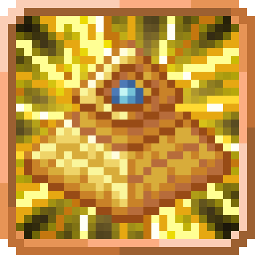
<figcaption>Source media</figcaption>
</figure>

<h2>Eye Of Truth</h2>

By obtaining the mythical Hero Egg, the veil of deception is torn apart. No illusion or concealment can deceive your sight, and your vision becomes perfect.

Open reference →

</a>
</article>
<article class="reference-card" data-letter="F" data-search="flame breath spew fire to burn away enemies and set fire to the land.">
<a href="flame-breath/" aria-label="Open Flame Breath">
<figure class="reference-card-media reference-card-media--source">
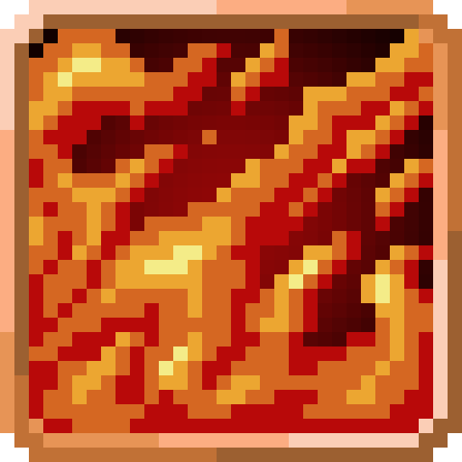
<figcaption>Source media</figcaption>
</figure>

<h2>Flame Breath</h2>

Spew fire to burn away enemies and set fire to the land.

Open reference →

</a>
</article>
<article class="reference-card" data-letter="F" data-search="flame transform channel the powers of fire to burn all nearby foes.">
<a href="flame-transform/" aria-label="Open Flame Transform">
<figure class="reference-card-media reference-card-media--source">
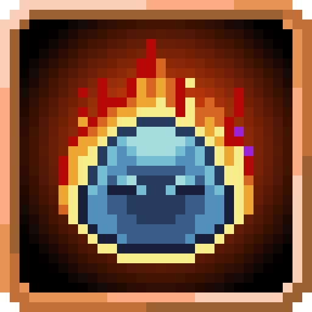
<figcaption>Source media</figcaption>
</figure>

<h2>Flame Transform</h2>

Channel the powers of fire to burn all nearby foes.

Open reference →

</a>
</article>
<article class="reference-card" data-letter="G" data-search="giantification cut back on the cookies.">
<a href="giantification/" aria-label="Open Giantification">
<figure class="reference-card-media reference-card-media--source">
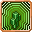
<figcaption>Source media</figcaption>
</figure>

<h2>Giantification</h2>

Cut back on the cookies.

Open reference →

</a>
</article>
<article class="reference-card" data-letter="L" data-search="light transform channel your inner light to deal holy damage and nauseate all nearby entities.">
<a href="light-transform/" aria-label="Open Light Transform">
<figure class="reference-card-media reference-card-media--source">
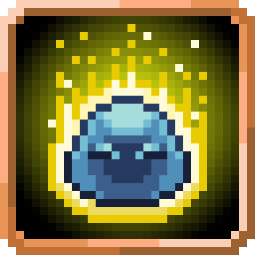
<figcaption>Source media</figcaption>
</figure>

<h2>Light Transform</h2>

Channel your inner light to deal holy damage and nauseate all nearby entities.

Open reference →

</a>
</article>
<article class="reference-card" data-letter="O" data-search="ogre berserker allow rage to consume you to massively improve your physical powers for a time before the aftereffects set in.">
<a href="ogre-berserker/" aria-label="Open Ogre Berserker">
<figure class="reference-card-media reference-card-media--source">
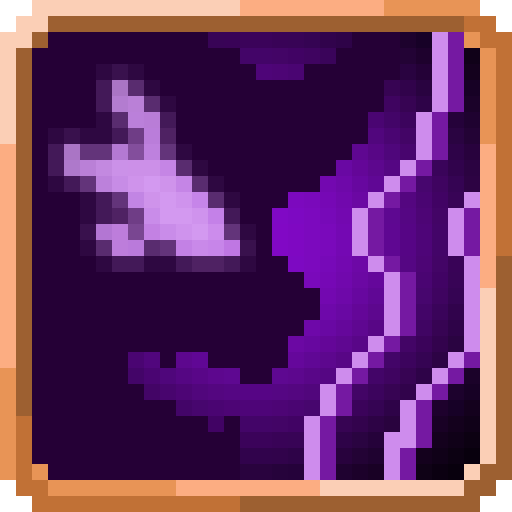
<figcaption>Source media</figcaption>
</figure>

<h2>Ogre Berserker</h2>

Allow rage to consume you to massively improve your physical powers for a time before the aftereffects set in.

Open reference →

</a>
</article>
<article class="reference-card" data-letter="P" data-search="paralysing breath spew a horrifying breath to paralyze your prey.">
<a href="paralysing-breath/" aria-label="Open Paralysing Breath">
<figure class="reference-card-media reference-card-media--source">
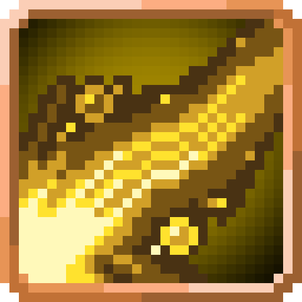
<figcaption>Source media</figcaption>
</figure>

<h2>Paralysing Breath</h2>

Spew a horrifying breath to paralyze your prey.

Open reference →

</a>
</article>
<article class="reference-card" data-letter="P" data-search="poisonous breath use your disgusting breath to corrode and nauseate your targets.">
<a href="poisonous-breath/" aria-label="Open Poisonous Breath">
<figure class="reference-card-media reference-card-media--source">
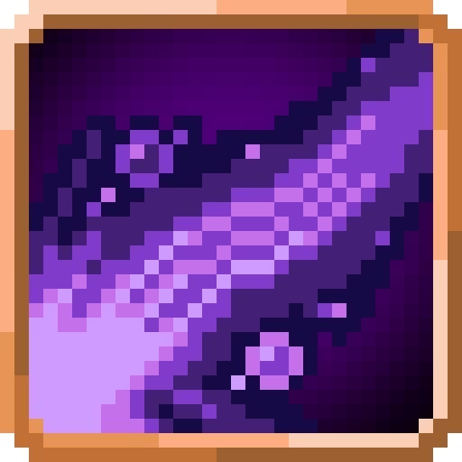
<figcaption>Source media</figcaption>
</figure>

<h2>Poisonous Breath</h2>

Use your disgusting breath to corrode and nauseate your targets.

Open reference →

</a>
</article>
<article class="reference-card" data-letter="P" data-search="possession possess a weakened material body to gain access to a whole new world.">
<a href="possession/" aria-label="Open Possession">
<figure class="reference-card-media reference-card-media--source">

<figcaption>Source media</figcaption>
</figure>

<h2>Possession</h2>

Possess a weakened material body to gain access to a whole new world.

Open reference →

</a>
</article>
<article class="reference-card" data-letter="S" data-search="scale armor like the lizardmen, move through water and mud with no penalties while receiving a slight defense buff.">
<a href="scale-armor/" aria-label="Open Scale Armor">
<figure class="reference-card-media reference-card-media--source">
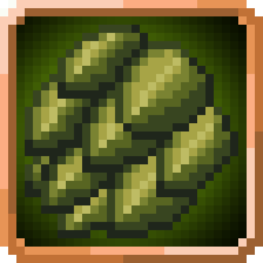
<figcaption>Source media</figcaption>
</figure>

<h2>Scale Armor</h2>

Like the lizardmen, move through water and mud with no penalties while receiving a slight defense buff.

Open reference →

</a>
</article>
<article class="reference-card" data-letter="S" data-search="space transform channel the powers of space to weaken and damage all nearby entities.">
<a href="space-transform/" aria-label="Open Space Transform">
<figure class="reference-card-media reference-card-media--source">
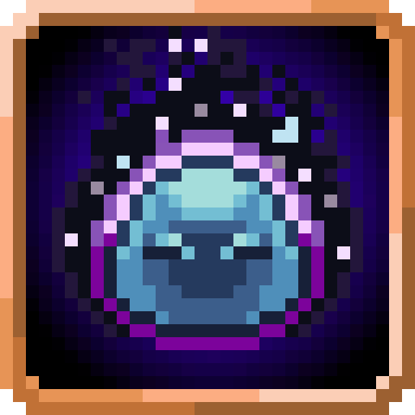
<figcaption>Source media</figcaption>
</figure>

<h2>Space Transform</h2>

Channel the powers of space to weaken and damage all nearby entities.

Open reference →

</a>
</article>
<article class="reference-card" data-letter="T" data-search="thunder breath release thunder from your mouth to damage foes in front of you.">
<a href="thunder-breath/" aria-label="Open Thunder Breath">
<figure class="reference-card-media reference-card-media--source">
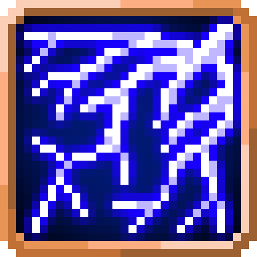
<figcaption>Source media</figcaption>
</figure>

<h2>Thunder Breath</h2>

Release thunder from your mouth to damage foes in front of you.

Open reference →

</a>
</article>
<article class="reference-card" data-letter="T" data-search="titanification you should have listened when we said to cut back.">
<a href="titanification/" aria-label="Open Titanification">
<figure class="reference-card-media reference-card-media--source">
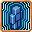
<figcaption>Source media</figcaption>
</figure>

<h2>Titanification</h2>

You should have listened when we said to cut back.

Open reference →

</a>
</article>
<article class="reference-card" data-letter="U" data-search="ultrasonic waves shoot out a screech of sound which damages physical bodies or use echolocation to highlight nearby entities.">
<a href="ultrasonic-waves/" aria-label="Open Ultrasonic Waves">
<figure class="reference-card-media reference-card-media--source">
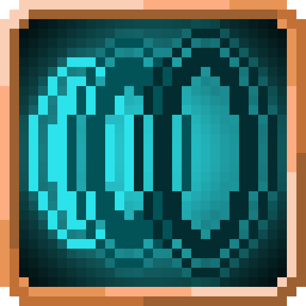
<figcaption>Source media</figcaption>
</figure>

<h2>Ultrasonic Waves</h2>

Shoot out a screech of sound which damages physical bodies or use echolocation to highlight nearby entities.

Open reference →

</a>
</article>
<article class="reference-card" data-letter="U" data-search="unpredictability in the hands of a true hero, unpredictability reigns supreme. the hero sees all, becoming able to ignore dodge and even read the movements of their opponent to disable…">
<a href="unpredictability/" aria-label="Open Unpredictability">
<figure class="reference-card-media reference-card-media--source">
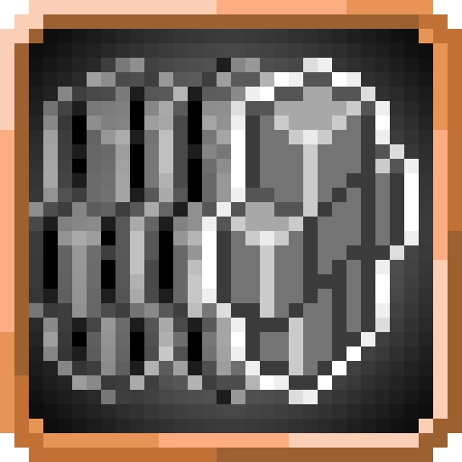
<figcaption>Source media</figcaption>
</figure>

<h2>Unpredictability</h2>

In the hands of a True Hero, unpredictability reigns supreme. The Hero sees all, becoming able to ignore dodge and even read the movements of their opponent to disable…

Open reference →

</a>
</article>
<article class="reference-card" data-letter="W" data-search="water breathing remove the requirement of air underwater.">
<a href="water-breathing/" aria-label="Open Water Breathing">
<figure class="reference-card-media reference-card-media--source">
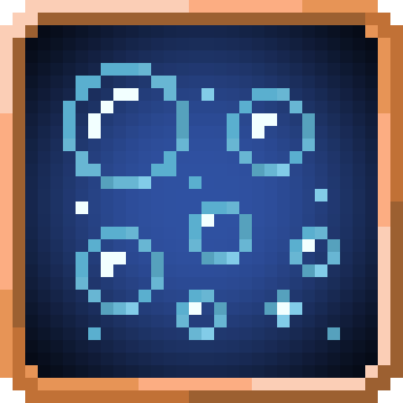
<figcaption>Source media</figcaption>
</figure>

<h2>Water Breathing</h2>

Remove the requirement of air underwater.

Open reference →

</a>
</article>
<article class="reference-card" data-letter="W" data-search="water transform channel the powers of water to damage and poison all nearby foes.">
<a href="water-transform/" aria-label="Open Water Transform">
<figure class="reference-card-media reference-card-media--source">
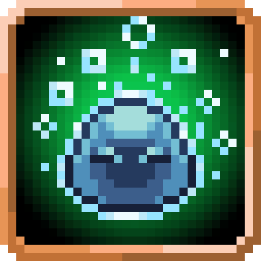
<figcaption>Source media</figcaption>
</figure>

<h2>Water Transform</h2>

Channel the powers of water to damage and poison all nearby foes.

Open reference →

</a>
</article>
<article class="reference-card" data-letter="W" data-search="wind transform channel the powers of wind to paralyze and damage all nearby entities.">
<a href="wind-transform/" aria-label="Open Wind Transform">
<figure class="reference-card-media reference-card-media--source">
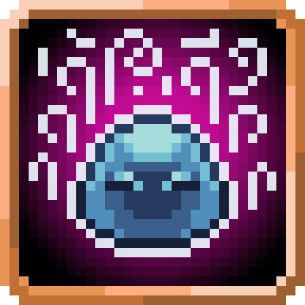
<figcaption>Source media</figcaption>
</figure>

<h2>Wind Transform</h2>

Channel the powers of wind to paralyze and damage all nearby entities.

Open reference →

</a>
</article>

No matching articles. Try a broader search.

</section>
