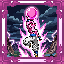
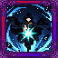
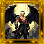
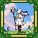
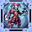

<section class="reference-directory" data-reference-directory="skills/ultimate">
<header class="reference-directory-hero reference-theme-abilities">

Tensura reference collection

<h1>Ultimate Skills</h1>

Ultimate-class skills and related evolutions.

<strong>66</strong> articles

</header>

<label class="reference-filter-label">
Filter this collection
<input type="search" class="reference-filter-input" placeholder="Search titles and summaries…" autocomplete="off">
</label>

<button type="button" class="is-active" data-letter="all" aria-pressed="true">All</button>
<button type="button" data-letter="A" aria-pressed="false">A</button>
<button type="button" data-letter="B" aria-pressed="false">B</button>
<button type="button" data-letter="C" aria-pressed="false">C</button>
<button type="button" data-letter="F" aria-pressed="false">F</button>
<button type="button" data-letter="G" aria-pressed="false">G</button>
<button type="button" data-letter="H" aria-pressed="false">H</button>
<button type="button" data-letter="L" aria-pressed="false">L</button>
<button type="button" data-letter="M" aria-pressed="false">M</button>
<button type="button" data-letter="N" aria-pressed="false">N</button>
<button type="button" data-letter="R" aria-pressed="false">R</button>
<button type="button" data-letter="S" aria-pressed="false">S</button>
<button type="button" data-letter="T" aria-pressed="false">T</button>
<button type="button" data-letter="U" aria-pressed="false">U</button>
<button type="button" data-letter="V" aria-pressed="false">V</button>
<button type="button" data-letter="Y" aria-pressed="false">Y</button>
<button type="button" data-letter="Z" aria-pressed="false">Z</button>

Showing 66 of 66 articles

<article class="reference-card" data-letter="A" data-search="abaddon, king of destruction &quot;the judge has spoken. your verdict stands&quot;">
<a href="nightmares-abaddon/" aria-label="Open Abaddon, King of Destruction">
<figure class="reference-card-media reference-card-media--source">

<figcaption>TSR skill emblem</figcaption>
</figure>

<h2>Abaddon, King of Destruction</h2>
<small class="skill-reference-status">1.21.1 reference · Server build match pending</small>

&quot;The judge has spoken. Your verdict stands&quot;

Open reference →

</a>
</article>
<article class="reference-card" data-letter="A" data-search="acnologia, lord of ancient times authority over spacetime - when the user of acnologia is able to locate the six between time grimoires(found in ancient cities or rare drop from wardens), by collecting…">
<a href="nightmares-acnologia-lord-of-ancient-times/" aria-label="Open Acnologia, Lord of Ancient Times">
<figure class="reference-card-media reference-card-media--source">

<figcaption>TSR skill emblem</figcaption>
</figure>

<h2>Acnologia, Lord of Ancient Times</h2>
<small class="skill-reference-status">1.21.1 reference · Server build match pending</small>

Authority over Spacetime - When the user of Acnologia is able to locate the six Between Time Grimoires(found in ancient cities or rare drop from wardens), by collecting…

Open reference →

</a>
</article>
<article class="reference-card" data-letter="A" data-search="agni, lord of blaze flame authority - when this skill is toggled on, it increases flame damage to x6. (doesn&#x27;t stack with flame manipulation or domination. ). and bypassess flame attack…">
<a href="nightmares-agni/" aria-label="Open Agni, Lord of Blaze">
<figure class="reference-card-media reference-card-media--source">

<figcaption>TSR skill emblem</figcaption>
</figure>

<h2>Agni, Lord of Blaze</h2>
<small class="skill-reference-status">1.21.1 reference · Server build match pending</small>

Flame Authority - When this skill is toggled on, it increases Flame Damage to x6. (Doesn&#x27;t stack with Flame Manipulation or Domination. ). And bypassess Flame Attack…

Open reference →

</a>
</article>
<article class="reference-card" data-letter="A" data-search="akashic records, god of information wip for all the speks that cant read, right now its bugged, that means u cant get it without cheating because u need to evolve the ego to manas which you can&#x27;t do…">
<a href="nightmares-akashic-records/" aria-label="Open Akashic Records, God of Information">
<figure class="reference-card-media reference-card-media--source">

<figcaption>TSR skill emblem</figcaption>
</figure>

<h2>Akashic Records, God of Information</h2>
<small class="skill-reference-status">1.21.1 reference · Server build match pending</small>

WIP FOR ALL THE SPEKS THAT CANT READ, RIGHT NOW ITS BUGGED, THAT MEANS U CANT GET IT WITHOUT CHEATING BECAUSE U NEED TO EVOLVE THE EGO TO MANAS WHICH YOU CAN&#x27;T DO…

Open reference →

</a>
</article>
<article class="reference-card" data-letter="A" data-search="alternative, proxy rights when this is bestowed to you, u get one of the seven different abilities">
<a href="nightmares-alternative/" aria-label="Open Alternative, Proxy Rights">
<figure class="reference-card-media reference-card-media--source">

<figcaption>TSR skill emblem</figcaption>
</figure>

<h2>Alternative, Proxy Rights</h2>
<small class="skill-reference-status">1.21.1 reference · Server build match pending</small>

When this is Bestowed to you, u get one of the seven different abilities

Open reference →

</a>
</article>
<article class="reference-card" data-letter="A" data-search="amaterasu, lord of shimmering flames &quot;i command thee kneel&quot;">
<a href="nightmares-amaterasu/" aria-label="Open Amaterasu, Lord of Shimmering Flames">
<figure class="reference-card-media reference-card-media--source">

<figcaption>TSR skill emblem</figcaption>
</figure>

<h2>Amaterasu, Lord of Shimmering Flames</h2>
<small class="skill-reference-status">1.21.1 reference · Server build match pending</small>

&quot;I command thee KNEEL&quot;

Open reference →

</a>
</article>
<article class="reference-card" data-letter="A" data-search="amatsumara, lord of crafts precision miner - the user gains the effects of fortune 2 and luck 5.">
<a href="nightmares-amatsumara/" aria-label="Open Amatsumara, Lord of Crafts">
<figure class="reference-card-media reference-card-media--source">

<figcaption>TSR skill emblem</figcaption>
</figure>

<h2>Amatsumara, Lord of Crafts</h2>
<small class="skill-reference-status">1.21.1 reference · Server build match pending</small>

Precision Miner - The user gains the effects of Fortune 2 and Luck 5.

Open reference →

</a>
</article>
<article class="reference-card" data-letter="A" data-search="artist, authentic writer actor - the user can use this on a player to begin learning them. this is based of learn speed. when at 100%, you can shift use actor and select the name of the player…">
<a href="nightmares-artist/" aria-label="Open Artist, Authentic Writer">
<figure class="reference-card-media reference-card-media--source">

<figcaption>TSR skill emblem</figcaption>
</figure>

<h2>Artist, Authentic Writer</h2>
<small class="skill-reference-status">1.21.1 reference · Server build match pending</small>

Actor - The user can use this on a player to begin learning them. This is based of Learn Speed. When at 100%, you can shift use Actor and select the name of the player…

Open reference →

</a>
</article>
<article class="reference-card" data-letter="A" data-search="asmodeus, lord of lust &quot;asmodeus is in truth, the ability to subdue and enslave life itself&quot;">
<a href="nightmares-asmodeus/" aria-label="Open Asmodeus, Lord of Lust">
<figure class="reference-card-media reference-card-media--source">

<figcaption>TSR skill emblem</figcaption>
</figure>

<h2>Asmodeus, Lord of Lust</h2>
<small class="skill-reference-status">1.21.1 reference · Server build match pending</small>

&quot;Asmodeus is in truth, the ability to subdue and enslave life itself&quot;

Open reference →

</a>
</article>
<article class="reference-card" data-letter="A" data-search="astaroth, king of fallen fallen lord - the user becomes a majin alignment, however they take 15% less damage from holy and spiritual. the user gains the extra skill hand of creation and hand of…">
<a href="nightmares-astaroth/" aria-label="Open Astaroth, King of Fallen">
<figure class="reference-card-media reference-card-media--source">

<figcaption>TSR skill emblem</figcaption>
</figure>

<h2>Astaroth, King of Fallen</h2>
<small class="skill-reference-status">1.21.1 reference · Server build match pending</small>

Fallen Lord - The user becomes a Majin Alignment, however they take 15% less damage from Holy and Spiritual. The user gains the Extra Skill Hand of Creation and Hand Of…

Open reference →

</a>
</article>
<article class="reference-card" data-letter="A" data-search="astarte, lord of heaven heavenly lord - the user becomes a holy alignment. the user is considered divine.">
<a href="nightmares-astarte/" aria-label="Open Astarte, Lord of Heaven">
<figure class="reference-card-media reference-card-media--source">

<figcaption>TSR skill emblem</figcaption>
</figure>

<h2>Astarte, Lord of Heaven</h2>
<small class="skill-reference-status">1.21.1 reference · Server build match pending</small>

Heavenly Lord - The user becomes a Holy alignment. The user is considered Divine.

Open reference →

</a>
</article>
<article class="reference-card" data-letter="A" data-search="astraea, lord of gifts &quot;insert rheinhardt quote here&quot;">
<a href="nightmares-astraea/" aria-label="Open Astraea, Lord of Gifts">
<figure class="reference-card-media reference-card-media--source">

<figcaption>TSR skill emblem</figcaption>
</figure>

<h2>Astraea, Lord of Gifts</h2>
<small class="skill-reference-status">1.21.1 reference · Server build match pending</small>

&quot;Insert Rheinhardt quote here&quot;

Open reference →

</a>
</article>
<article class="reference-card" data-letter="A" data-search="astral light, lord of creation &quot;your skills will have no effect against me&quot;">
<a href="nightmares-astral-light/" aria-label="Open Astral Light, Lord of Creation">
<figure class="reference-card-media reference-card-media--source">

<figcaption>TSR skill emblem</figcaption>
</figure>

<h2>Astral Light, Lord of Creation</h2>
<small class="skill-reference-status">1.21.1 reference · Server build match pending</small>

&quot;Your Skills will have no effect against me&quot;

Open reference →

</a>
</article>
<article class="reference-card" data-letter="A" data-search="azathoth, god of the void &quot;this is it. the peak over power&quot;">
<a href="nightmares-azathoth/" aria-label="Open Azathoth, God of The Void">
<figure class="reference-card-media reference-card-media--source">

<figcaption>TSR skill emblem</figcaption>
</figure>

<h2>Azathoth, God of The Void</h2>
<small class="skill-reference-status">1.21.1 reference · Server build match pending</small>

&quot;This is it. The Peak over Power&quot;

Open reference →

</a>
</article>
<article class="reference-card" data-letter="A" data-search="azazel, lord of temptation tempter can obtain seeker by mastering 50 aspectual magics">
<a href="nightmares-azazel/" aria-label="Open Azazel, Lord of Temptation">
<figure class="reference-card-media reference-card-media--source">

<figcaption>TSR skill emblem</figcaption>
</figure>

<h2>Azazel, Lord of Temptation</h2>
<small class="skill-reference-status">1.21.1 reference · Server build match pending</small>

Tempter can obtain Seeker by mastering 50 Aspectual Magics

Open reference →

</a>
</article>
<article class="reference-card" data-letter="B" data-search="beelzebub, lord of gourmet guardian gets gourmet after eatting 10 royal blood">
<a href="nightmares-beelzebub/" aria-label="Open Beelzebub, Lord of Gourmet">
<figure class="reference-card-media reference-card-media--source">

<figcaption>TSR skill emblem</figcaption>
</figure>

<h2>Beelzebub, Lord of Gourmet</h2>
<small class="skill-reference-status">1.21.1 reference · Server build match pending</small>

Guardian Gets Gourmet After eatting 10 royal blood

Open reference →

</a>
</article>
<article class="reference-card" data-letter="B" data-search="beelzebuth, lord of gluttony gluttony obtains merciless at 11k soul">
<a href="nightmares-beelzebuth/" aria-label="Open Beelzebuth, Lord of Gluttony">
<figure class="reference-card-media reference-card-media--source">

<figcaption>TSR skill emblem</figcaption>
</figure>

<h2>Beelzebuth, Lord of Gluttony</h2>
<small class="skill-reference-status">1.21.1 reference · Server build match pending</small>

Gluttony obtains merciless at 11k soul

Open reference →

</a>
</article>
<article class="reference-card" data-letter="B" data-search="belial, lord of the dead &quot;&#x27;what do you have there?&#x27; &#x27;nothing&#x27; the suspiciously nihility based skill of mass destruction being wielded:&quot;">
<a href="nightmares-belial/" aria-label="Open Belial, Lord of The Dead">
<figure class="reference-card-media reference-card-media--source">

<figcaption>TSR skill emblem</figcaption>
</figure>

<h2>Belial, Lord of The Dead</h2>
<small class="skill-reference-status">1.21.1 reference · Server build match pending</small>

&quot;&#x27;What do you have there?&#x27; &#x27;Nothing&#x27; The suspiciously Nihility based skill of Mass destruction being wielded:&quot;

Open reference →

</a>
</article>
<article class="reference-card" data-letter="B" data-search="belphegor, lord of sloth lord of lethargy: whenever the user sleeps in a bed, they fully restore a large sum of magicules, and any amount that would bring them above 100% is stored as temp mp.">
<a href="nightmares-belphegor/" aria-label="Open Belphegor, Lord of Sloth">
<figure class="reference-card-media reference-card-media--source">

<figcaption>TSR skill emblem</figcaption>
</figure>

<h2>Belphegor, Lord of Sloth</h2>
<small class="skill-reference-status">1.21.1 reference · Server build match pending</small>

Lord of Lethargy: Whenever the user sleeps in a bed, they fully restore a large sum of magicules, and any amount that would bring them above 100% is stored as temp MP.

Open reference →

</a>
</article>
<article class="reference-card" data-letter="C" data-search="cthugha, king of divine flame when used normally, the user accelerators forward at high speeds dealing a massive amount of damage in a straight line. 350 (500 flame damage when mastered) + attack…">
<a href="nightmares-cthugha/" aria-label="Open Cthugha, King of Divine Flame">
<figure class="reference-card-media reference-card-media--source">

<figcaption>TSR skill emblem</figcaption>
</figure>

<h2>Cthugha, King of Divine Flame</h2>
<small class="skill-reference-status">1.21.1 reference · Server build match pending</small>

When used normally, the user accelerators forward at high speeds dealing a massive amount of damage in a straight line. 350 (500 Flame Damage when mastered) + Attack…

Open reference →

</a>
</article>
<article class="reference-card" data-letter="C" data-search="cthulhu, king of divine ice &quot;eversleeping he stays, as his awakening is the end of humanity&quot;">
<a href="nightmares-cthulhu/" aria-label="Open Cthulhu, King of Divine Ice">
<figure class="reference-card-media reference-card-media--source">

<figcaption>TSR skill emblem</figcaption>
</figure>

<h2>Cthulhu, King of Divine Ice</h2>
<small class="skill-reference-status">1.21.1 reference · Server build match pending</small>

&quot;Eversleeping he stays, as his awakening is the end of humanity&quot;

Open reference →

</a>
</article>
<article class="reference-card" data-letter="F" data-search="faust, lord of investigation &quot;da steh ich nun, ich armer tor. und bin so klug als wie zuvor&quot;">
<a href="nightmares-faust/" aria-label="Open Faust, Lord of Investigation">
<figure class="reference-card-media reference-card-media--source">

<figcaption>TSR skill emblem</figcaption>
</figure>

<h2>Faust, Lord of Investigation</h2>
<small class="skill-reference-status">1.21.1 reference · Server build match pending</small>

&quot;Da steh ich nun, ich armer Tor. Und bin so klug als wie zuvor&quot;

Open reference →

</a>
</article>
<article class="reference-card" data-letter="G" data-search="gabriel, lord of patience &quot;zaa warudooo. what do you mean &#x27;not the right one&#x27;?&quot;">
<a href="nightmares-gabriel/" aria-label="Open Gabriel, Lord of Patience">
<figure class="reference-card-media reference-card-media--source">

<figcaption>TSR skill emblem</figcaption>
</figure>

<h2>Gabriel, Lord of Patience</h2>
<small class="skill-reference-status">1.21.1 reference · Server build match pending</small>

&quot;ZAA WARUDOOO. What do you mean &#x27;not the right one&#x27;?&quot;

Open reference →

</a>
</article>
<article class="reference-card" data-letter="G" data-search="gilgamesh, king of uruk clairvoyance - this gives the user an additional presence sense 20, presence sense raidus 20 and 10 levels of analytical.">
<a href="nightmares-gilgamesh-king-of-uruk/" aria-label="Open Gilgamesh, King of Uruk">
<figure class="reference-card-media reference-card-media--source">

<figcaption>TSR skill emblem</figcaption>
</figure>

<h2>Gilgamesh, King of Uruk</h2>
<small class="skill-reference-status">1.21.1 reference · Server build match pending</small>

Clairvoyance - This gives the user an additional Presence Sense 20, Presence Sense Raidus 20 and 10 Levels of Analytical.

Open reference →

</a>
</article>
<article class="reference-card" data-letter="G" data-search="gilgamesh, lord of treasure true golden rule - grants a permanent luck 10 effects">
<a href="nightmares-gilgamesh-lord-of-treasures/" aria-label="Open Gilgamesh, Lord of Treasure">
<figure class="reference-card-media reference-card-media--source">

<figcaption>TSR skill emblem</figcaption>
</figure>

<h2>Gilgamesh, Lord of Treasure</h2>
<small class="skill-reference-status">1.21.1 reference · Server build match pending</small>

True Golden Rule - Grants a permanent Luck 10 effects

Open reference →

</a>
</article>
<article class="reference-card" data-letter="G" data-search="grimoire, book of magic parallel processing - increases the amount of learned points and mastery points gained when learning/using skills, magic, battlewill, and arts by 14 (15 total). the…">
<a href="nightmares-grimoire/" aria-label="Open Grimoire, Book of Magic">
<figure class="reference-card-media reference-card-media--source">

<figcaption>TSR skill emblem</figcaption>
</figure>

<h2>Grimoire, Book of Magic</h2>
<small class="skill-reference-status">1.21.1 reference · Server build match pending</small>

Parallel Processing - Increases the amount of Learned Points and Mastery Points gained when learning/using Skills, Magic, Battlewill, and Arts by 14 (15 Total). The…

Open reference →

</a>
</article>
<article class="reference-card" data-letter="H" data-search="hamiel, king of splendour &quot;above all else, i will regenerate, no matter the injury&quot;">
<a href="nightmares-hamiel/" aria-label="Open Hamiel, King of Splendour">
<figure class="reference-card-media reference-card-media--source">

<figcaption>TSR skill emblem</figcaption>
</figure>

<h2>Hamiel, King of Splendour</h2>
<small class="skill-reference-status">1.21.1 reference · Server build match pending</small>

&quot;Above all else, i will regenerate, no matter the Injury&quot;

Open reference →

</a>
</article>
<article class="reference-card" data-letter="H" data-search="haniel, lord of glory &quot;thou attempts are pityfull, as my glory shalt outshine thy being forevermore&quot;">
<a href="nightmares-haniel/" aria-label="Open Haniel, Lord of Glory">
<figure class="reference-card-media reference-card-media--source">

<figcaption>TSR skill emblem</figcaption>
</figure>

<h2>Haniel, Lord of Glory</h2>
<small class="skill-reference-status">1.21.1 reference · Server build match pending</small>

&quot;Thou attempts are pityfull, as my Glory shalt outshine thy being forevermore&quot;

Open reference →

</a>
</article>
<article class="reference-card" data-letter="H" data-search="hastur, lord of starwind &quot;woof. king in yellow not included&quot;">
<a href="nightmares-hastur/" aria-label="Open Hastur, Lord of Starwind">
<figure class="reference-card-media reference-card-media--source">

<figcaption>TSR skill emblem</figcaption>
</figure>

<h2>Hastur, Lord of Starwind</h2>
<small class="skill-reference-status">1.21.1 reference · Server build match pending</small>

&quot;Woof. King in Yellow not included&quot;

Open reference →

</a>
</article>
<article class="reference-card" data-letter="L" data-search="leviathan, lord of envy envious hero: if you are a true hero, and awaken leviathan, lord of envy, you will obtain the unique skill - stasis">
<a href="nightmares-leviathan/" aria-label="Open Leviathan, Lord of Envy">
<figure class="reference-card-media reference-card-media--source">

<figcaption>TSR skill emblem</figcaption>
</figure>

<h2>Leviathan, Lord of Envy</h2>
<small class="skill-reference-status">1.21.1 reference · Server build match pending</small>

Envious hero: If you are a True Hero, and awaken Leviathan, Lord of Envy, you will obtain the Unique Skill - Stasis

Open reference →

</a>
</article>
<article class="reference-card" data-letter="L" data-search="lucifer, lord of pride this is the ultimate skill of pride. this is obtained when the user has mastered the unique skill pride and endures a hit a target with an ultimate skill.">
<a href="nightmares-lucifer/" aria-label="Open Lucifer, Lord of Pride">
<figure class="reference-card-media reference-card-media--source">

<figcaption>TSR skill emblem</figcaption>
</figure>

<h2>Lucifer, Lord of Pride</h2>
<small class="skill-reference-status">1.21.1 reference · Server build match pending</small>

This is the Ultimate Skill of Pride. This is obtained when the user has Mastered the Unique Skill Pride and endures a hit a target with an Ultimate Skill.

Open reference →

</a>
</article>
<article class="reference-card" data-letter="M" data-search="mammon, lord of greed absorb life: while mammon is in slot, the user&#x27;s attacks will steal a small amount of mp, ap or barrier points.">
<a href="nightmares-mammon/" aria-label="Open Mammon, Lord of Greed">
<figure class="reference-card-media reference-card-media--source">

<figcaption>TSR skill emblem</figcaption>
</figure>

<h2>Mammon, Lord of Greed</h2>
<small class="skill-reference-status">1.21.1 reference · Server build match pending</small>

Absorb Life: While Mammon is in slot, the user&#x27;s attacks will steal a small amount of MP, AP or Barrier Points.

Open reference →

</a>
</article>
<article class="reference-card" data-letter="M" data-search="metatron, lord of purity &quot;the power to sort out all mixed laws, prevent interference, and select pure energy&quot;">
<a href="nightmares-metatron/" aria-label="Open Metatron, Lord of Purity">
<figure class="reference-card-media reference-card-media--source">

<figcaption>TSR skill emblem</figcaption>
</figure>

<h2>Metatron, Lord of Purity</h2>
<small class="skill-reference-status">1.21.1 reference · Server build match pending</small>

&quot;The power to sort out all mixed laws, prevent interference, and select pure energy&quot;

Open reference →

</a>
</article>
<article class="reference-card" data-letter="M" data-search="michael, lord of justice (the castle guard can be bypassed by nova break.)">
<a href="nightmares-michael/" aria-label="Open Michael, Lord of Justice">
<figure class="reference-card-media reference-card-media--source">

<figcaption>TSR skill emblem</figcaption>
</figure>

<h2>Michael, Lord of Justice</h2>
<small class="skill-reference-status">1.21.1 reference · Server build match pending</small>

(The castle guard can be bypassed by Nova Break.)

Open reference →

</a>
</article>
<article class="reference-card" data-letter="M" data-search="mood maker, lord of psychology &quot;honestly, not in the mood to make a funny text rn&quot;">
<a href="nightmares-mood-maker/" aria-label="Open Mood Maker, Lord of Psychology">
<figure class="reference-card-media reference-card-media--source">

<figcaption>TSR skill emblem</figcaption>
</figure>

<h2>Mood Maker, Lord of Psychology</h2>
<small class="skill-reference-status">1.21.1 reference · Server build match pending</small>

&quot;Honestly, not in the mood to make a Funny text rn&quot;

Open reference →

</a>
</article>
<article class="reference-card" data-letter="N" data-search="necronomicon, book of magic controlled order - the user cannot become a chaos being. this skill cannot be copied.">
<a href="nightmares-necronomicon/" aria-label="Open Necronomicon, Book of Magic">
<figure class="reference-card-media reference-card-media--source">

<figcaption>TSR skill emblem</figcaption>
</figure>

<h2>Necronomicon, Book of Magic</h2>
<small class="skill-reference-status">1.21.1 reference · Server build match pending</small>

Controlled Order - The user cannot become a Chaos Being. This skill cannot be copied.

Open reference →

</a>
</article>
<article class="reference-card" data-letter="N" data-search="nodens, god of abyss &quot;this is absurd, one of the strongest abilities concieved!&quot;">
<a href="nightmares-nodens/" aria-label="Open Nodens, God of Abyss">
<figure class="reference-card-media reference-card-media--source">

<figcaption>TSR skill emblem</figcaption>
</figure>

<h2>Nodens, God of Abyss</h2>
<small class="skill-reference-status">1.21.1 reference · Server build match pending</small>

&quot;This is absurd, one of the strongest abilities concieved!&quot;

Open reference →

</a>
</article>
<article class="reference-card" data-letter="N" data-search="nyarlathotep, king of chaos all of creation - learn all schematics and aspcetual magics">
<a href="nightmares-nyarlathotep/" aria-label="Open Nyarlathotep, King of Chaos">
<figure class="reference-card-media reference-card-media--source">

<figcaption>TSR skill emblem</figcaption>
</figure>

<h2>Nyarlathotep, King of Chaos</h2>
<small class="skill-reference-status">1.21.1 reference · Server build match pending</small>

All of Creation - Learn all schematics and aspcetual Magics

Open reference →

</a>
</article>
<article class="reference-card" data-letter="R" data-search="raguel, lord of charity amplification and thought acceleration - the user regenerates magicules x2 as fast (4x as fast on mastery). the user gains +2 learning and mastery points. increase…">
<a href="nightmares-raguel/" aria-label="Open Raguel, Lord of Charity">
<figure class="reference-card-media reference-card-media--source">

<figcaption>TSR skill emblem</figcaption>
</figure>

<h2>Raguel, Lord of Charity</h2>
<small class="skill-reference-status">1.21.1 reference · Server build match pending</small>

Amplification and Thought Acceleration - The user regenerates Magicules x2 as fast (4x as fast on mastery). The user gains +2 Learning and Mastery Points. Increase…

Open reference →

</a>
</article>
<article class="reference-card" data-letter="R" data-search="raphael, lord of knowledge thought acceleration: increase magic casting speed multiplier by 4, increase movement speed by 0.01 (0.02 with mastery), increase attack speed by 0.2 (0.4 with mastery)">
<a href="nightmares-raphael-knowledge/" aria-label="Open Raphael, Lord of Knowledge">
<figure class="reference-card-media reference-card-media--source">

<figcaption>TSR skill emblem</figcaption>
</figure>

<h2>Raphael, Lord of Knowledge</h2>
<small class="skill-reference-status">1.21.1 reference · Server build match pending</small>

Thought Acceleration: Increase magic casting speed multiplier by 4, increase movement speed by 0.01 (0.02 with Mastery), increase attack speed by 0.2 (0.4 with Mastery)

Open reference →

</a>
</article>
<article class="reference-card" data-letter="R" data-search="raphael, lord of wisdom thought acceleration: increase magic casting speed multiplier by 4, increase movement speed by 0.01 (0.02 with mastery), increase attack speed by 0.2 (0.4 with mastery)">
<a href="nightmares-raphael-wisdom/" aria-label="Open Raphael, Lord of Wisdom">
<figure class="reference-card-media reference-card-media--source">

<figcaption>TSR skill emblem</figcaption>
</figure>

<h2>Raphael, Lord of Wisdom</h2>
<small class="skill-reference-status">1.21.1 reference · Server build match pending</small>

Thought Acceleration: Increase magic casting speed multiplier by 4, increase movement speed by 0.01 (0.02 with Mastery), increase attack speed by 0.2 (0.4 with Mastery)

Open reference →

</a>
</article>
<article class="reference-card" data-letter="S" data-search="samael, lord of deadly poison &quot;oi mate, this is spider central hq; your gonna get poisoned no matter what you do&quot;">
<a href="nightmares-samael/" aria-label="Open Samael, Lord of Deadly Poison">
<figure class="reference-card-media reference-card-media--source">

<figcaption>TSR skill emblem</figcaption>
</figure>

<h2>Samael, Lord of Deadly Poison</h2>
<small class="skill-reference-status">1.21.1 reference · Server build match pending</small>

&quot;Oi mate, this is spider Central HQ; your gonna get poisoned no matter what you do&quot;

Open reference →

</a>
</article>
<article class="reference-card" data-letter="S" data-search="sandalphon, lord of judgement &quot;the judge has spoken. your verdict stands&quot;">
<a href="nightmares-sandalphon-judgment/" aria-label="Open Sandalphon, Lord of Judgement">
<figure class="reference-card-media reference-card-media--source">

<figcaption>TSR skill emblem</figcaption>
</figure>

<h2>Sandalphon, Lord of Judgement</h2>
<small class="skill-reference-status">1.21.1 reference · Server build match pending</small>

&quot;The judge has spoken. Your verdict stands&quot;

Open reference →

</a>
</article>
<article class="reference-card" data-letter="S" data-search="sariel, lord of hope unyield: once a mob is named by the user, it will gain 1 (2 with mastery) unyielding point each 5s that it’s 30 blocks around the player, this will decrease if the mob…">
<a href="nightmares-sariel/" aria-label="Open Sariel, Lord of Hope">
<figure class="reference-card-media reference-card-media--source">

<figcaption>TSR skill emblem</figcaption>
</figure>

<h2>Sariel, Lord of Hope</h2>
<small class="skill-reference-status">1.21.1 reference · Server build match pending</small>

Unyield: Once a mob is named by the user, it will gain 1 (2 with Mastery) Unyielding Point each 5s that it’s 30 blocks around the player, this will decrease if the mob…

Open reference →

</a>
</article>
<article class="reference-card" data-letter="S" data-search="satanael, lord of wrath breaking point - while you have the rampage effect, the durability damage you cause from attacking armor will increase based off the rampage level.">
<a href="nightmares-satanael/" aria-label="Open Satanael, Lord of Wrath">
<figure class="reference-card-media reference-card-media--source">

<figcaption>TSR skill emblem</figcaption>
</figure>

<h2>Satanael, Lord of Wrath</h2>
<small class="skill-reference-status">1.21.1 reference · Server build match pending</small>

Breaking Point - While you have the Rampage Effect, the durability damage you cause from attacking armor will increase based off the Rampage Level.

Open reference →

</a>
</article>
<article class="reference-card" data-letter="S" data-search="shub-niggurath, king of harvest note: this will store your version of uriel inside of shub-niggurath&#x27;s [ skill storage ]">
<a href="nightmares-shub-niggurath/" aria-label="Open Shub-Niggurath, King of Harvest">
<figure class="reference-card-media reference-card-media--source">

<figcaption>TSR skill emblem</figcaption>
</figure>

<h2>Shub-Niggurath, King of Harvest</h2>
<small class="skill-reference-status">1.21.1 reference · Server build match pending</small>

Note: This will store your version of Uriel inside of Shub-Niggurath&#x27;s [ Skill Storage ]

Open reference →

</a>
</article>
<article class="reference-card" data-letter="S" data-search="surya, king of brillance &quot;the power to sort out all mixed laws, prevent interference, and select pure energy. refined enough to not harm others unintentionally&quot;">
<a href="nightmares-surya/" aria-label="Open Surya, King of Brillance">
<figure class="reference-card-media reference-card-media--source">

<figcaption>TSR skill emblem</figcaption>
</figure>

<h2>Surya, King of Brillance</h2>
<small class="skill-reference-status">1.21.1 reference · Server build match pending</small>

&quot;The power to sort out all mixed laws, prevent interference, and select pure energy. Refined enough to not harm others unintentionally&quot;

Open reference →

</a>
</article>
<article class="reference-card" data-letter="S" data-search="susano&#x27;o, lord of tyranny &quot;oh cool you got infinite regeneration. how about i just ignore that&quot;">
<a href="nightmares-susanoo/" aria-label="Open Susano&#x27;o, Lord of Tyranny">
<figure class="reference-card-media reference-card-media--source">

<figcaption>TSR skill emblem</figcaption>
</figure>

<h2>Susano&#x27;o, Lord of Tyranny</h2>
<small class="skill-reference-status">1.21.1 reference · Server build match pending</small>

&quot;Oh cool you got Infinite Regeneration. how about I just Ignore that&quot;

Open reference →

</a>
</article>
<article class="reference-card" data-letter="T" data-search="tantalous, king of evil daemonic heart - the user and all of their subordinates become majins.">
<a href="nightmares-tantalus/" aria-label="Open Tantalous, King of Evil">
<figure class="reference-card-media reference-card-media--source">

<figcaption>TSR skill emblem</figcaption>
</figure>

<h2>Tantalous, King of Evil</h2>
<small class="skill-reference-status">1.21.1 reference · Server build match pending</small>

Daemonic Heart - The user and all of their Subordinates become Majins.

Open reference →

</a>
</article>
<article class="reference-card" data-letter="T" data-search="tenebrosum, god of souls soul collection - the user deals bonus spiritual damage equal to 5% of their souls on their physical attacks.">
<a href="nightmares-tenebrosum/" aria-label="Open Tenebrosum, God of Souls">
<figure class="reference-card-media reference-card-media--source">

<figcaption>TSR skill emblem</figcaption>
</figure>

<h2>Tenebrosum, God of Souls</h2>
<small class="skill-reference-status">1.21.1 reference · Server build match pending</small>

Soul Collection - The user deals bonus Spiritual Damage equal to 5% of their Souls on their Physical Attacks.

Open reference →

</a>
</article>
<article class="reference-card" data-letter="T" data-search="the evil majin bubble majin&#x27;s ultimate evolution.">
<a href="the-evil-majin/" aria-label="Open The Evil Majin">
<figure class="reference-card-media reference-card-media--source">

<figcaption>Source media</figcaption>
</figure>

<h2>The Evil Majin</h2>

Bubble Majin&#x27;s Ultimate evolution.

Open reference →

</a>
</article>
<article class="reference-card" data-letter="T" data-search="the one who seals sealer&#x27;s ultimate evolution.">
<a href="the-one-who-seals/" aria-label="Open The One Who Seals">
<figure class="reference-card-media reference-card-media--source">

<figcaption>Source media</figcaption>
</figure>

<h2>The One Who Seals</h2>

Sealer&#x27;s Ultimate evolution.

Open reference →

</a>
</article>
<article class="reference-card" data-letter="T" data-search="the slayer of dragons dragon slayer&#x27;s ultimate evolution.">
<a href="the-slayer-of-dragons/" aria-label="Open The Slayer of Dragons">
<figure class="reference-card-media reference-card-media--source">

<figcaption>Source media</figcaption>
</figure>

<h2>The Slayer of Dragons</h2>

Dragon Slayer&#x27;s Ultimate evolution.

Open reference →

</a>
</article>
<article class="reference-card" data-letter="T" data-search="the timeless mage great mage&#x27;s ultimate evolution.">
<a href="the-timeless-mage/" aria-label="Open The Timeless Mage">
<figure class="reference-card-media reference-card-media--source">

<figcaption>Source media</figcaption>
</figure>

<h2>The Timeless Mage</h2>

Great Mage&#x27;s Ultimate evolution.

Open reference →

</a>
</article>
<article class="reference-card" data-letter="T" data-search="the unbound jester imprisoned jester&#x27;s ultimate evolution.">
<a href="the-unbound-jester/" aria-label="Open The Unbound Jester">
<figure class="reference-card-media reference-card-media--source">

<figcaption>Source media</figcaption>
</figure>

<h2>The Unbound Jester</h2>

Imprisoned Jester&#x27;s Ultimate evolution.

Open reference →

</a>
</article>
<article class="reference-card" data-letter="T" data-search="true hero, king of champions banner of the supreme king -the user&#x27;s slain subordinates become a memory. the user loses max ep equal to the subordinates ep. the memory is automatically stored in […">
<a href="nightmares-true-hero/" aria-label="Open True Hero, King of Champions">
<figure class="reference-card-media reference-card-media--source">

<figcaption>TSR skill emblem</figcaption>
</figure>

<h2>True Hero, King of Champions</h2>
<small class="skill-reference-status">1.21.1 reference · Server build match pending</small>

Banner of the Supreme King -The user&#x27;s slain subordinates become a Memory. The user loses max EP equal to the subordinates EP. The Memory is automatically stored in […

Open reference →

</a>
</article>
<article class="reference-card" data-letter="T" data-search="tsukiyomi, lord of moonshadow &quot;you merely adopted the dark. i was born in it, molded by it&quot;">
<a href="nightmares-tsukiyomi/" aria-label="Open Tsukiyomi, Lord of Moonshadow">
<figure class="reference-card-media reference-card-media--source">

<figcaption>TSR skill emblem</figcaption>
</figure>

<h2>Tsukiyomi, Lord of Moonshadow</h2>
<small class="skill-reference-status">1.21.1 reference · Server build match pending</small>

&quot;You merely adopted the Dark. i was born in it, molded by it&quot;

Open reference →

</a>
</article>
<article class="reference-card" data-letter="U" data-search="uriel, lord of oaths magic alteration: when toggled, the user can cast any magic that&#x27;s mastered within an anti-magic area. if the player&#x27;s ep is above 1.000.000, their mastered magic and…">
<a href="nightmares-uriel-lord-of-oath/" aria-label="Open Uriel, Lord of Oaths">
<figure class="reference-card-media reference-card-media--source">

<figcaption>TSR skill emblem</figcaption>
</figure>

<h2>Uriel, Lord of Oaths</h2>
<small class="skill-reference-status">1.21.1 reference · Server build match pending</small>

Magic Alteration: When toggled, the user can cast any Magic that&#x27;s mastered within an Anti-Magic Area. If the player&#x27;s EP is above 1.000.000, their mastered magic and…

Open reference →

</a>
</article>
<article class="reference-card" data-letter="U" data-search="uriel, lord of vows believer system: the user gains +1 mastery and +1 learning for every subordinate they have.">
<a href="nightmares-uriel-lord-of-vow/" aria-label="Open Uriel, Lord of Vows">
<figure class="reference-card-media reference-card-media--source">

<figcaption>TSR skill emblem</figcaption>
</figure>

<h2>Uriel, Lord of Vows</h2>
<small class="skill-reference-status">1.21.1 reference · Server build match pending</small>

Believer System: The user gains +1 Mastery and +1 Learning for every subordinate they have.

Open reference →

</a>
</article>
<article class="reference-card" data-letter="V" data-search="veldora, lord of storms storm-type magic - the user gains the storm magics. their lightning, wind and water damage gets increased by 50%.">
<a href="nightmares-veldora-lord-of-storms/" aria-label="Open Veldora, Lord of Storms">
<figure class="reference-card-media reference-card-media--source">

<figcaption>TSR skill emblem</figcaption>
</figure>

<h2>Veldora, Lord of Storms</h2>
<small class="skill-reference-status">1.21.1 reference · Server build match pending</small>

Storm-Type Magic - The user gains the Storm Magics. Their Lightning, Wind and Water Damage gets increased by 50%.

Open reference →

</a>
</article>
<article class="reference-card" data-letter="V" data-search="velgaia, lord of earth-star unobtainable due to no model for boss">
<a href="nightmares-velgaia-lord-of-earth/" aria-label="Open Velgaia, Lord of Earth-Star">
<figure class="reference-card-media reference-card-media--source">

<figcaption>TSR skill emblem</figcaption>
</figure>

<h2>Velgaia, Lord of Earth-Star</h2>
<small class="skill-reference-status">1.21.1 reference · Server build match pending</small>

Unobtainable due to no model for boss

Open reference →

</a>
</article>
<article class="reference-card" data-letter="V" data-search="velgrynd, lord of scorch scorch-type magic - the user gains the scorch magics. also boosts their fire, heat and light damage by 50%.">
<a href="nightmares-velgrynd-lord-of-scorch/" aria-label="Open Velgrynd, Lord of Scorch">
<figure class="reference-card-media reference-card-media--source">

<figcaption>TSR skill emblem</figcaption>
</figure>

<h2>Velgrynd, Lord of Scorch</h2>
<small class="skill-reference-status">1.21.1 reference · Server build match pending</small>

Scorch-Type Magic - The user gains the Scorch Magics. Also boosts their Fire, Heat and Light Damage by 50%.

Open reference →

</a>
</article>
<article class="reference-card" data-letter="V" data-search="velzard, lord of frost frost-type magic - the user gains the frost magics. also boosts their cold damage by 50%.">
<a href="nightmares-velzard-lord-of-frost/" aria-label="Open Velzard, Lord of Frost">
<figure class="reference-card-media reference-card-media--source">

<figcaption>TSR skill emblem</figcaption>
</figure>

<h2>Velzard, Lord of Frost</h2>
<small class="skill-reference-status">1.21.1 reference · Server build match pending</small>

Frost-Type Magic - The user gains the Frost Magics. Also boosts their Cold Damage by 50%.

Open reference →

</a>
</article>
<article class="reference-card" data-letter="Y" data-search="yog-sothoth, lord of space-time this also costs 250k mp to use">
<a href="nightmares-yog-sothoth/" aria-label="Open Yog-Sothoth, Lord of Space-Time">
<figure class="reference-card-media reference-card-media--source">

<figcaption>TSR skill emblem</figcaption>
</figure>

<h2>Yog-Sothoth, Lord of Space-Time</h2>
<small class="skill-reference-status">1.21.1 reference · Server build match pending</small>

This Also costs 250k MP to use

Open reference →

</a>
</article>
<article class="reference-card" data-letter="Y" data-search="yog-sotohort, god of space-time &quot;time; thou shall follow my command!!!&quot;">
<a href="nightmares-yog-sotohort/" aria-label="Open Yog-Sotohort, God of Space-Time">
<figure class="reference-card-media reference-card-media--source">

<figcaption>TSR skill emblem</figcaption>
</figure>

<h2>Yog-Sotohort, God of Space-Time</h2>
<small class="skill-reference-status">1.21.1 reference · Server build match pending</small>

&quot;TIME; THOU SHALL FOLLOW MY COMMAND!!!&quot;

Open reference →

</a>
</article>
<article class="reference-card" data-letter="Z" data-search="zehirete, god of faith divine blessing of faith - the user&#x27;s max spritirons is 1,500. you passively generate 15 spiritrons a second.">
<a href="nightmares-zehirete/" aria-label="Open Zehirete, God of Faith">
<figure class="reference-card-media reference-card-media--source">

<figcaption>TSR skill emblem</figcaption>
</figure>

<h2>Zehirete, God of Faith</h2>
<small class="skill-reference-status">1.21.1 reference · Server build match pending</small>

Divine Blessing of Faith - The user&#x27;s max Spritirons is 1,500. You passively generate 15 Spiritrons a second.

Open reference →

</a>
</article>

No matching articles. Try a broader search.

</section>
