<section class="reference-directory skill-directory" data-reference-directory="skills/ultimate">
<header class="skill-directory-heading">
Ability directory
<h1>Ultimate Skills</h1>
Ultimate-class skills and related evolutions.
65 entries</header>
<nav class="skill-type-nav" aria-label="Ability categories"><a href="../">All abilities</a><a href="../intrinsic/">Intrinsic</a><a href="../common/">Common</a><a href="../extra/">Extra</a><a href="../unique/">Unique</a><a href="./" aria-current="page">Ultimate</a><a href="../../battlewill/">Battlewill</a><a href="../../magic/">Magic</a><a href="../../resistances/">Resistances</a></nav>

<label class="reference-filter-label">
Filter this collection
<input type="search" class="reference-filter-input" placeholder="Search titles and summaries…" autocomplete="off">
</label>

<button type="button" class="is-active" data-letter="all" aria-pressed="true">All</button>
<button type="button" data-letter="A" aria-pressed="false">A</button>
<button type="button" data-letter="B" aria-pressed="false">B</button>
<button type="button" data-letter="C" aria-pressed="false">C</button>
<button type="button" data-letter="F" aria-pressed="false">F</button>
<button type="button" data-letter="G" aria-pressed="false">G</button>
<button type="button" data-letter="H" aria-pressed="false">H</button>
<button type="button" data-letter="L" aria-pressed="false">L</button>
<button type="button" data-letter="M" aria-pressed="false">M</button>
<button type="button" data-letter="N" aria-pressed="false">N</button>
<button type="button" data-letter="R" aria-pressed="false">R</button>
<button type="button" data-letter="S" aria-pressed="false">S</button>
<button type="button" data-letter="T" aria-pressed="false">T</button>
<button type="button" data-letter="U" aria-pressed="false">U</button>
<button type="button" data-letter="V" aria-pressed="false">V</button>
<button type="button" data-letter="Y" aria-pressed="false">Y</button>
<button type="button" data-letter="Z" aria-pressed="false">Z</button>

Showing 65 of 65 articles

<article class="reference-card" data-letter="A" data-search="abaddon, king of destruction break spatial defenses, exceed power limits, and fire spatial magic bullets.">
<a href="nightmares-abaddon/" aria-label="Open Abaddon, King of Destruction">
<figure class="reference-card-media reference-card-media--theme">
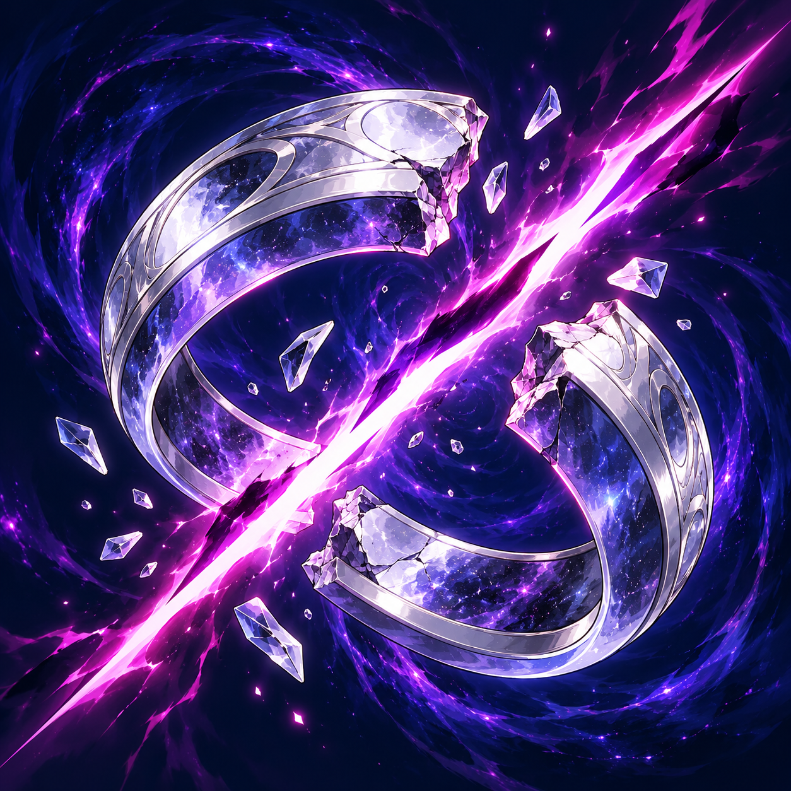
<figcaption>TSR artwork</figcaption>
</figure>

<h2>Abaddon, King of Destruction</h2>
<small class="skill-reference-status">1.21.1 reference · Server build match pending</small>

Break spatial defenses, exceed power limits, and fire spatial magic bullets.

View ability →

</a>
</article>
<article class="reference-card" data-letter="A" data-search="acnologia, lord of ancient times authority over spacetime - when the user of acnologia is able to locate the six between time grimoires(found in ancient cities or rare drop from wardens), by collecting…">
<a href="nightmares-acnologia-lord-of-ancient-times/" aria-label="Open Acnologia, Lord of Ancient Times">
<figure class="reference-card-media reference-card-media--source">

<figcaption>TSR skill emblem</figcaption>
</figure>

<h2>Acnologia, Lord of Ancient Times</h2>
<small class="skill-reference-status">1.21.1 reference · Server build match pending</small>

Authority over Spacetime - When the user of Acnologia is able to locate the six Between Time Grimoires(found in ancient cities or rare drop from wardens), by collecting…

View ability →

</a>
</article>
<article class="reference-card" data-letter="A" data-search="agni, lord of blaze amplify flame attacks and wield blazeball, blaze wave, and flame-coated strikes.">
<a href="nightmares-agni/" aria-label="Open Agni, Lord of Blaze">
<figure class="reference-card-media reference-card-media--theme">
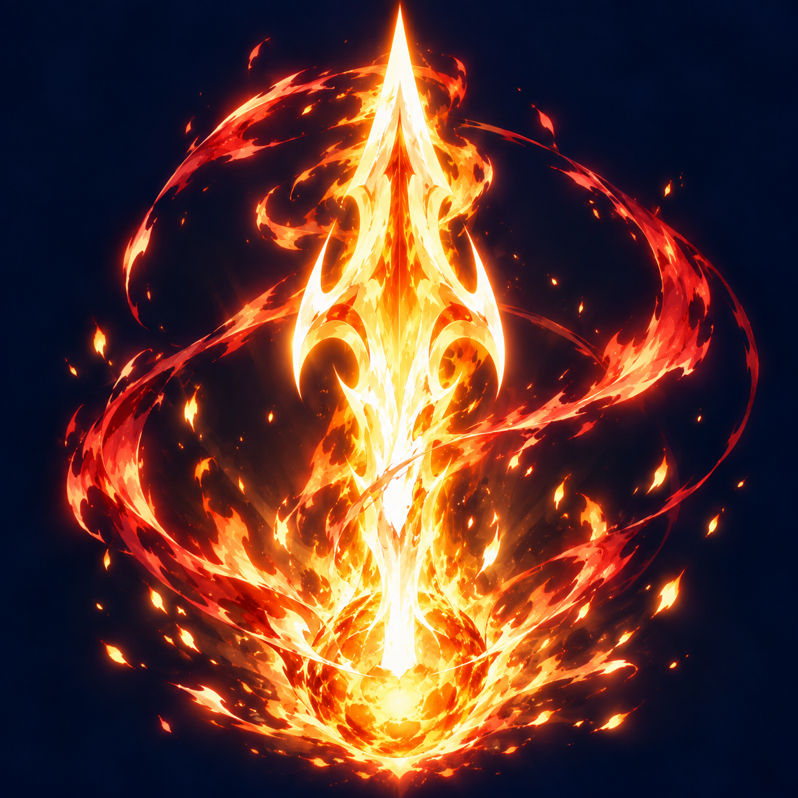
<figcaption>TSR artwork</figcaption>
</figure>

<h2>Agni, Lord of Blaze</h2>
<small class="skill-reference-status">1.21.1 reference · Server build match pending</small>

Amplify flame attacks and wield Blazeball, Blaze Wave, and flame-coated strikes.

View ability →

</a>
</article>
<article class="reference-card" data-letter="A" data-search="akashic records, god of information the reference build marks this skill as unavailable through normal progression because its ego-to-manas requirement is blocked.">
<a href="nightmares-akashic-records/" aria-label="Open Akashic Records, God of Information">
<figure class="reference-card-media reference-card-media--source">

<figcaption>TSR skill emblem</figcaption>
</figure>

<h2>Akashic Records, God of Information</h2>
<small class="skill-reference-status">1.21.1 reference · Server build match pending</small>

The reference build marks this skill as unavailable through normal progression because its Ego-to-Manas requirement is blocked.

View ability →

</a>
</article>
<article class="reference-card" data-letter="A" data-search="alternative, proxy rights receive one of seven bestowed abilities through michael’s player manas.">
<a href="nightmares-alternative/" aria-label="Open Alternative, Proxy Rights">
<figure class="reference-card-media reference-card-media--theme">
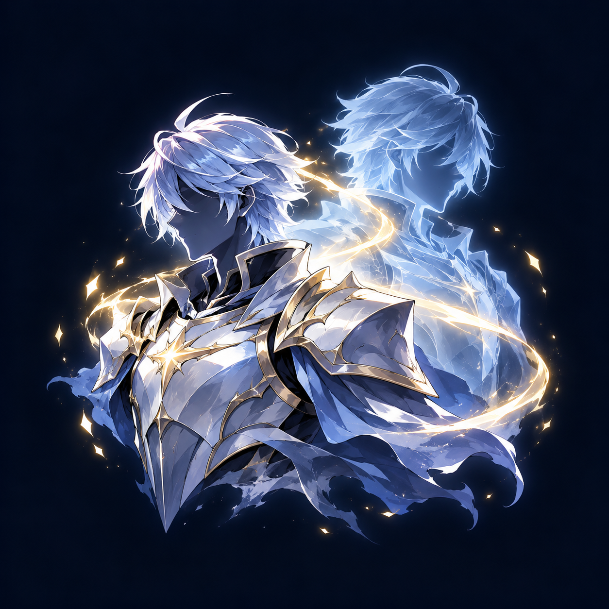
<figcaption>TSR artwork</figcaption>
</figure>

<h2>Alternative, Proxy Rights</h2>
<small class="skill-reference-status">1.21.1 reference · Server build match pending</small>

Receive one of seven bestowed abilities through Michael’s player Manas.

View ability →

</a>
</article>
<article class="reference-card" data-letter="A" data-search="amaterasu, lord of shimmering flames command subordinates and amplify light, heat, flame, and spatial attacks.">
<a href="nightmares-amaterasu/" aria-label="Open Amaterasu, Lord of Shimmering Flames">
<figure class="reference-card-media reference-card-media--source">
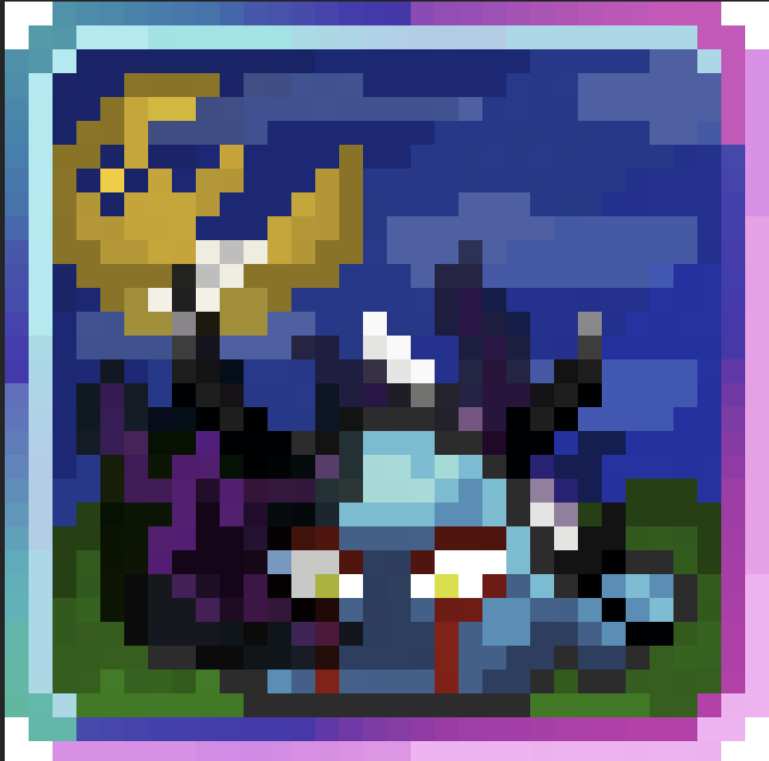
<figcaption>Source media</figcaption>
</figure>

<h2>Amaterasu, Lord of Shimmering Flames</h2>
<small class="skill-reference-status">1.21.1 reference · Server build match pending</small>

Command subordinates and amplify light, heat, flame, and spatial attacks.

View ability →

</a>
</article>
<article class="reference-card" data-letter="A" data-search="amatsumara, lord of crafts forge and refine equipment, use a portable kiln, and engrave skills onto items.">
<a href="nightmares-amatsumara/" aria-label="Open Amatsumara, Lord of Crafts">
<figure class="reference-card-media reference-card-media--theme">
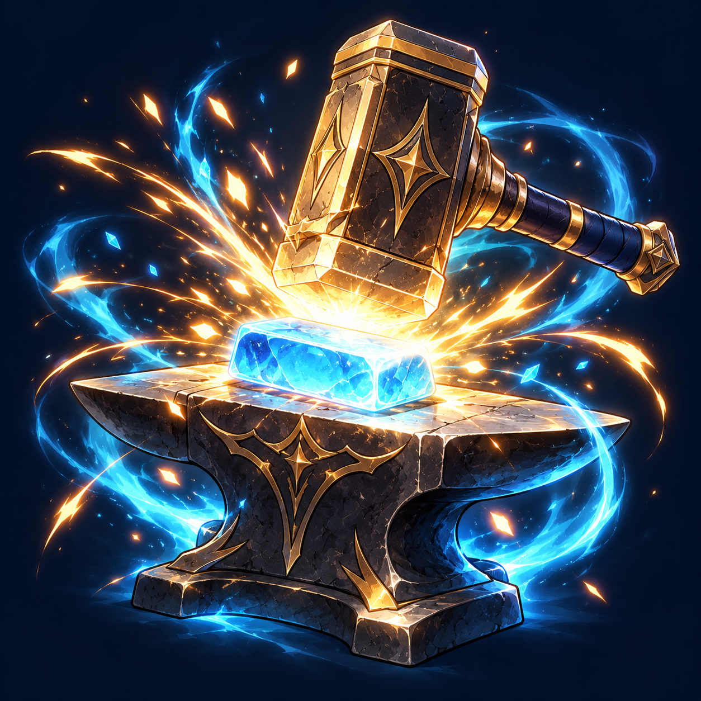
<figcaption>TSR artwork</figcaption>
</figure>

<h2>Amatsumara, Lord of Crafts</h2>
<small class="skill-reference-status">1.21.1 reference · Server build match pending</small>

Forge and refine equipment, use a portable kiln, and engrave skills onto items.

View ability →

</a>
</article>
<article class="reference-card" data-letter="A" data-search="artist, authentic writer imitate known entities, create stage doubles, and reuse recorded abilities.">
<a href="nightmares-artist/" aria-label="Open Artist, Authentic Writer">
<figure class="reference-card-media reference-card-media--theme">
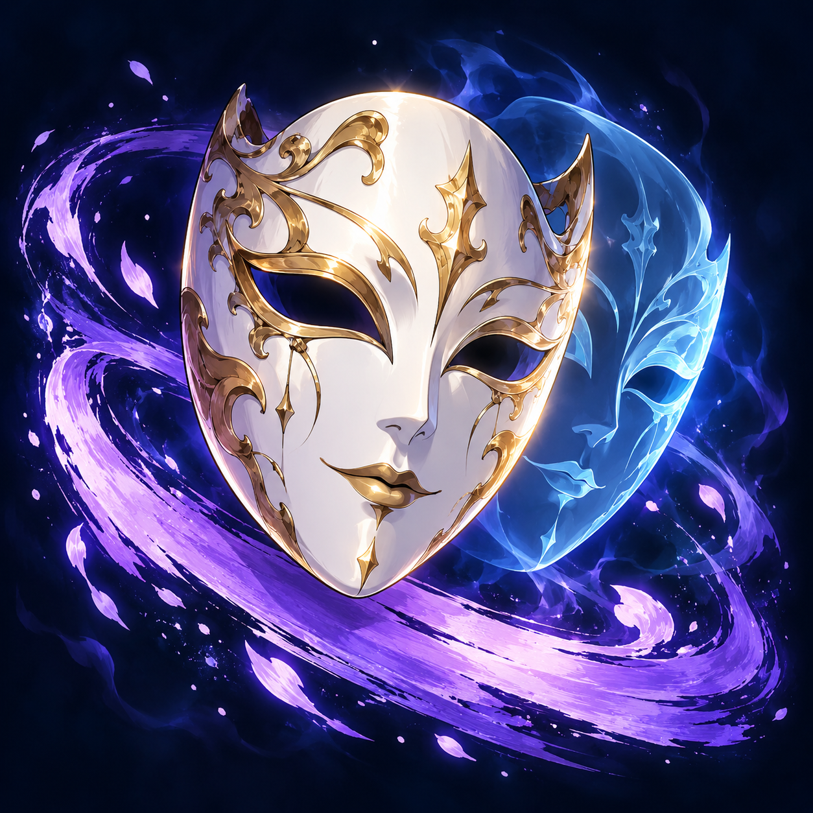
<figcaption>TSR artwork</figcaption>
</figure>

<h2>Artist, Authentic Writer</h2>
<small class="skill-reference-status">1.21.1 reference · Server build match pending</small>

Imitate known entities, create stage doubles, and reuse recorded abilities.

View ability →

</a>
</article>
<article class="reference-card" data-letter="A" data-search="asmodeus, lord of lust dominate life force, heal allies, drain enemies, and revive fallen subordinates.">
<a href="nightmares-asmodeus/" aria-label="Open Asmodeus, Lord of Lust">
<figure class="reference-card-media reference-card-media--source">
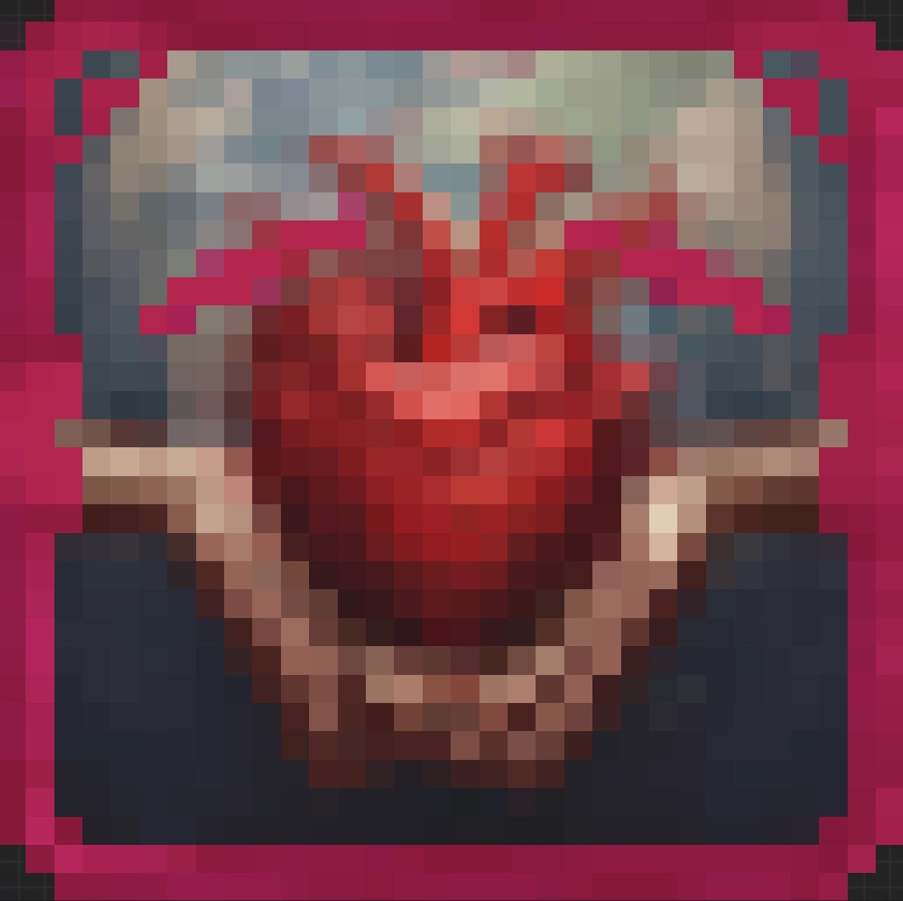
<figcaption>Source media</figcaption>
</figure>

<h2>Asmodeus, Lord of Lust</h2>
<small class="skill-reference-status">1.21.1 reference · Server build match pending</small>

Dominate life force, heal allies, drain enemies, and revive fallen subordinates.

View ability →

</a>
</article>
<article class="reference-card" data-letter="A" data-search="astaroth, king of fallen control fallen dream worlds, create illusions, and draw on stored magicules.">
<a href="nightmares-astaroth/" aria-label="Open Astaroth, King of Fallen">
<figure class="reference-card-media reference-card-media--theme">
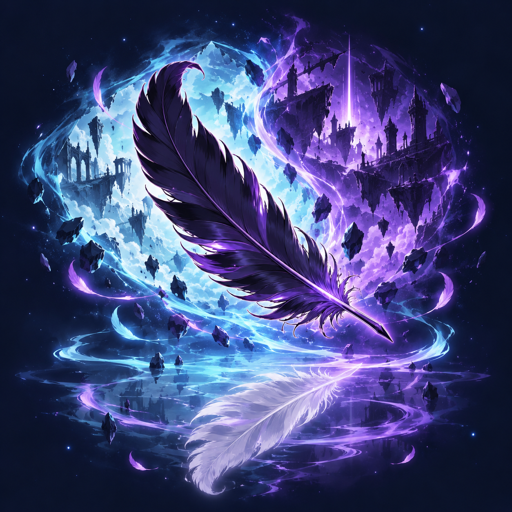
<figcaption>TSR artwork</figcaption>
</figure>

<h2>Astaroth, King of Fallen</h2>
<small class="skill-reference-status">1.21.1 reference · Server build match pending</small>

Control fallen dream worlds, create illusions, and draw on stored Magicules.

View ability →

</a>
</article>
<article class="reference-card" data-letter="A" data-search="astarte, lord of heaven evolve and recycle skills while generating magicules through a magic furnace.">
<a href="nightmares-astarte/" aria-label="Open Astarte, Lord of Heaven">
<figure class="reference-card-media reference-card-media--theme">
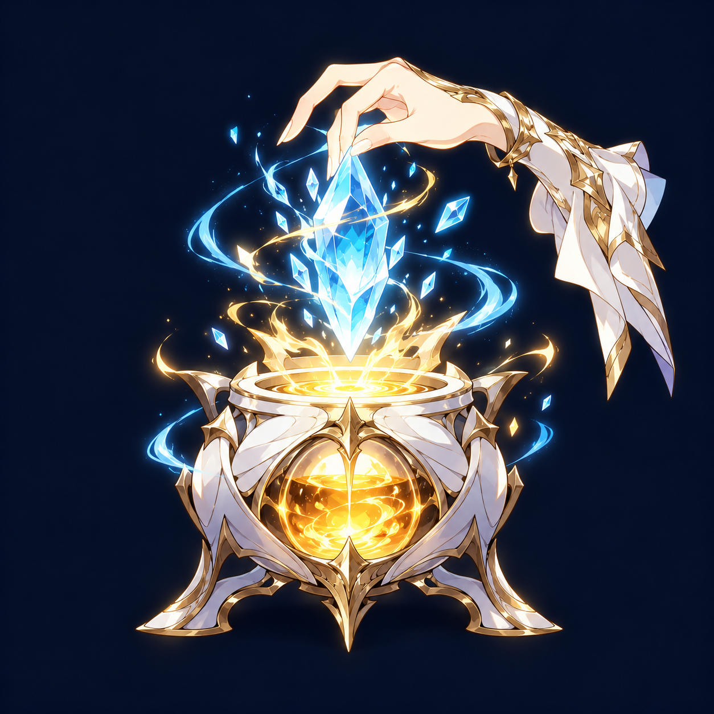
<figcaption>TSR artwork</figcaption>
</figure>

<h2>Astarte, Lord of Heaven</h2>
<small class="skill-reference-status">1.21.1 reference · Server build match pending</small>

Evolve and recycle skills while generating Magicules through a magic furnace.

View ability →

</a>
</article>
<article class="reference-card" data-letter="A" data-search="astraea, lord of gifts create and bestow blessings, enhance holy weapons, and gain sword saint effects.">
<a href="nightmares-astraea/" aria-label="Open Astraea, Lord of Gifts">
<figure class="reference-card-media reference-card-media--theme">
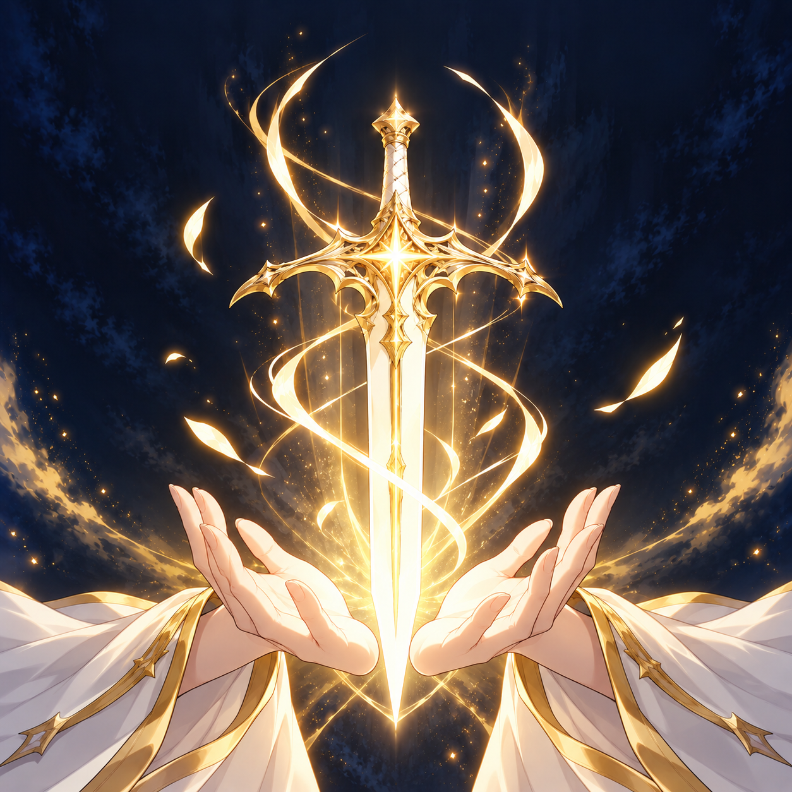
<figcaption>TSR artwork</figcaption>
</figure>

<h2>Astraea, Lord of Gifts</h2>
<small class="skill-reference-status">1.21.1 reference · Server build match pending</small>

Create and bestow blessings, enhance holy weapons, and gain Sword Saint effects.

View ability →

</a>
</article>
<article class="reference-card" data-letter="A" data-search="astral light, lord of creation create skills and materials, protect stored abilities, and imprint a skill ego.">
<a href="nightmares-astral-light/" aria-label="Open Astral Light, Lord of Creation">
<figure class="reference-card-media reference-card-media--theme">
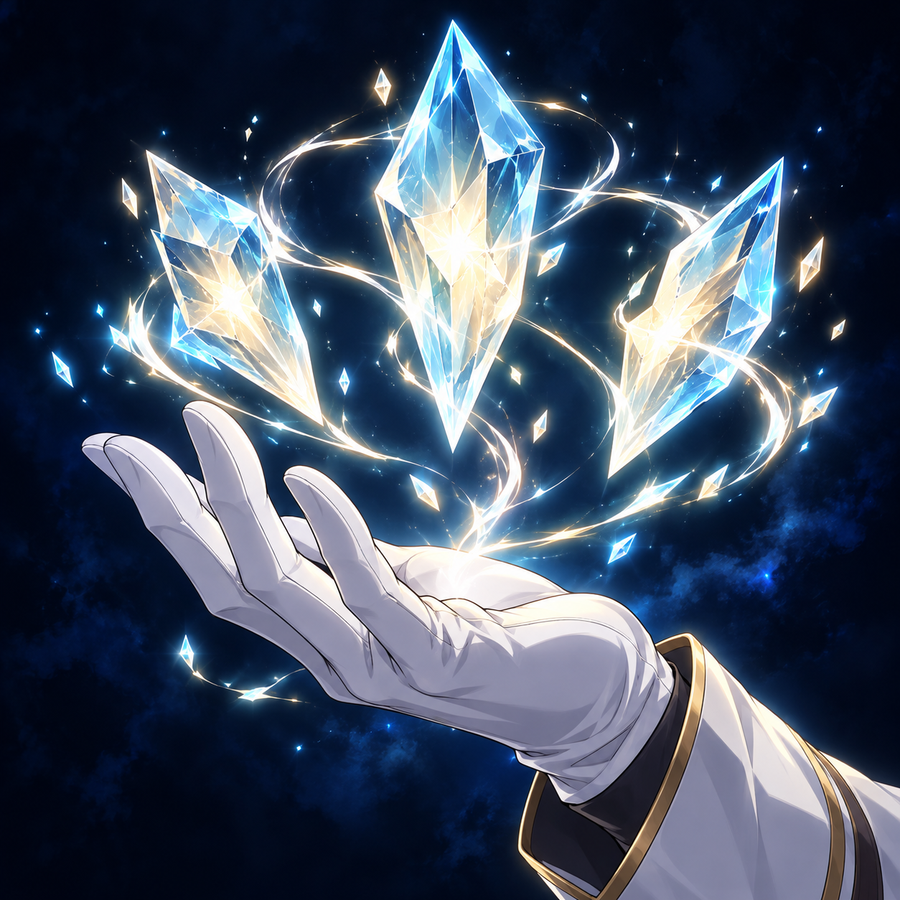
<figcaption>TSR artwork</figcaption>
</figure>

<h2>Astral Light, Lord of Creation</h2>
<small class="skill-reference-status">1.21.1 reference · Server build match pending</small>

Create skills and materials, protect stored abilities, and imprint a skill Ego.

View ability →

</a>
</article>
<article class="reference-card" data-letter="A" data-search="azathoth, god of the void combine soul predation, imaginary-space storage, dragon cores, and nihility.">
<a href="nightmares-azathoth/" aria-label="Open Azathoth, God of The Void">
<figure class="reference-card-media reference-card-media--theme">
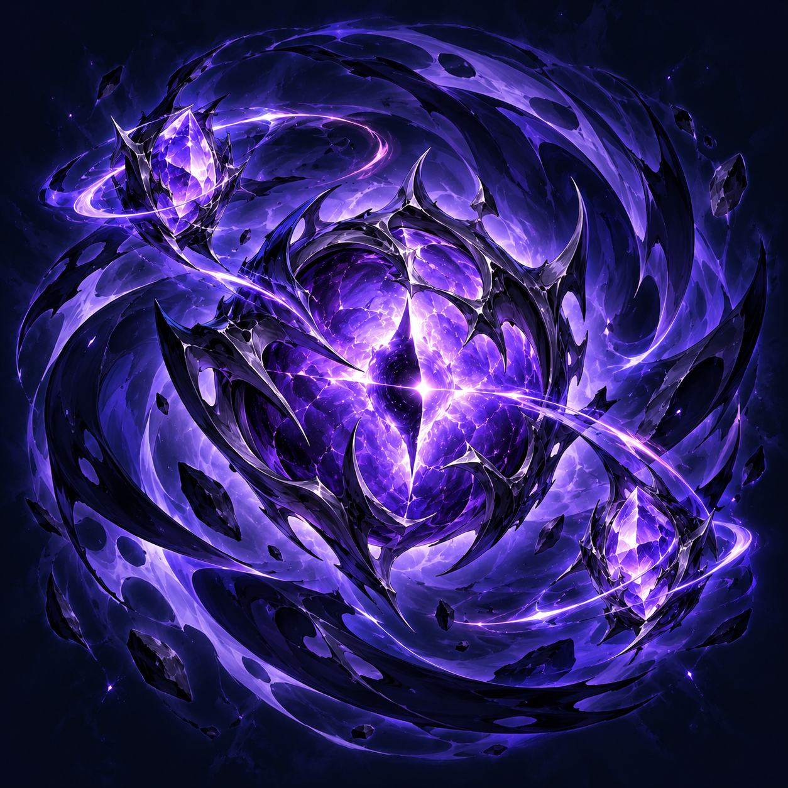
<figcaption>TSR artwork</figcaption>
</figure>

<h2>Azathoth, God of The Void</h2>
<small class="skill-reference-status">1.21.1 reference · Server build match pending</small>

Combine soul predation, imaginary-space storage, dragon cores, and nihility.

View ability →

</a>
</article>
<article class="reference-card" data-letter="A" data-search="azazel, lord of temptation control mental influence, copy ability modes, and create a spatial world.">
<a href="nightmares-azazel/" aria-label="Open Azazel, Lord of Temptation">
<figure class="reference-card-media reference-card-media--theme">
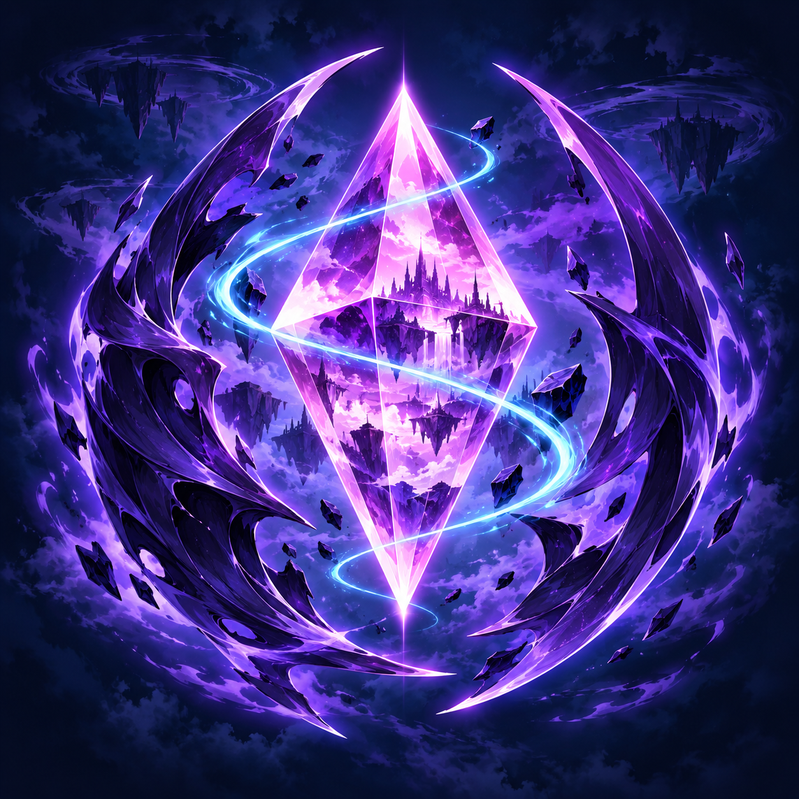
<figcaption>TSR artwork</figcaption>
</figure>

<h2>Azazel, Lord of Temptation</h2>
<small class="skill-reference-status">1.21.1 reference · Server build match pending</small>

Control mental influence, copy ability modes, and create a spatial world.

View ability →

</a>
</article>
<article class="reference-card" data-letter="B" data-search="beelzebub, lord of gourmet guardian gets gourmet after eatting 10 royal blood">
<a href="nightmares-beelzebub/" aria-label="Open Beelzebub, Lord of Gourmet">
<figure class="reference-card-media reference-card-media--source">

<figcaption>TSR skill emblem</figcaption>
</figure>

<h2>Beelzebub, Lord of Gourmet</h2>
<small class="skill-reference-status">1.21.1 reference · Server build match pending</small>

Guardian Gets Gourmet After eatting 10 royal blood

View ability →

</a>
</article>
<article class="reference-card" data-letter="B" data-search="beelzebuth, lord of gluttony gluttony obtains merciless at 11k soul">
<a href="nightmares-beelzebuth/" aria-label="Open Beelzebuth, Lord of Gluttony">
<figure class="reference-card-media reference-card-media--source">

<figcaption>TSR skill emblem</figcaption>
</figure>

<h2>Beelzebuth, Lord of Gluttony</h2>
<small class="skill-reference-status">1.21.1 reference · Server build match pending</small>

Gluttony obtains merciless at 11k soul

View ability →

</a>
</article>
<article class="reference-card" data-letter="B" data-search="belial, lord of the dead combine white freezing flames, soul collection, and nihility-based attacks.">
<a href="nightmares-belial/" aria-label="Open Belial, Lord of The Dead">
<figure class="reference-card-media reference-card-media--theme">
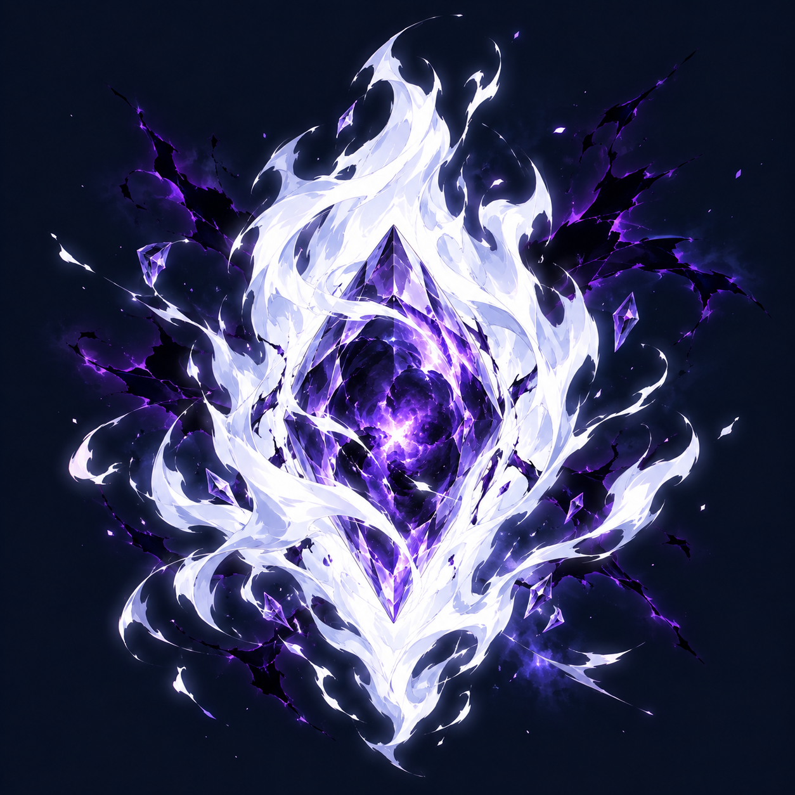
<figcaption>TSR artwork</figcaption>
</figure>

<h2>Belial, Lord of The Dead</h2>
<small class="skill-reference-status">1.21.1 reference · Server build match pending</small>

Combine white freezing flames, soul collection, and nihility-based attacks.

View ability →

</a>
</article>
<article class="reference-card" data-letter="B" data-search="belphegor, lord of sloth store surplus magicules through rest and weaken enemies with drowsiness.">
<a href="nightmares-belphegor/" aria-label="Open Belphegor, Lord of Sloth">
<figure class="reference-card-media reference-card-media--theme">
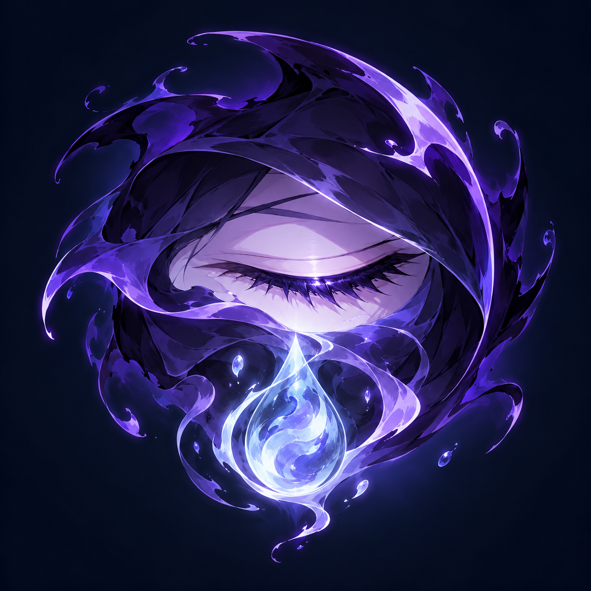
<figcaption>TSR artwork</figcaption>
</figure>

<h2>Belphegor, Lord of Sloth</h2>
<small class="skill-reference-status">1.21.1 reference · Server build match pending</small>

Store surplus Magicules through rest and weaken enemies with drowsiness.

View ability →

</a>
</article>
<article class="reference-card" data-letter="C" data-search="cthugha, king of divine flame amplify magical power, accelerate through enemies, and strengthen allies and barriers.">
<a href="nightmares-cthugha/" aria-label="Open Cthugha, King of Divine Flame">
<figure class="reference-card-media reference-card-media--theme">
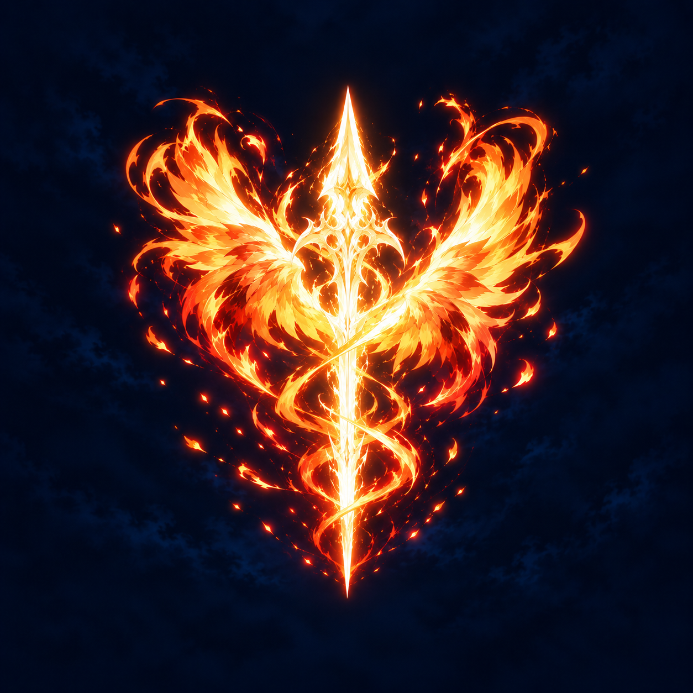
<figcaption>TSR artwork</figcaption>
</figure>

<h2>Cthugha, King of Divine Flame</h2>
<small class="skill-reference-status">1.21.1 reference · Server build match pending</small>

Amplify magical power, accelerate through enemies, and strengthen allies and barriers.

View ability →

</a>
</article>
<article class="reference-card" data-letter="C" data-search="cthulhu, king of divine ice combine energy siphoning, time control, freezing attacks, and a protective snow shell.">
<a href="nightmares-cthulhu/" aria-label="Open Cthulhu, King of Divine Ice">
<figure class="reference-card-media reference-card-media--source">
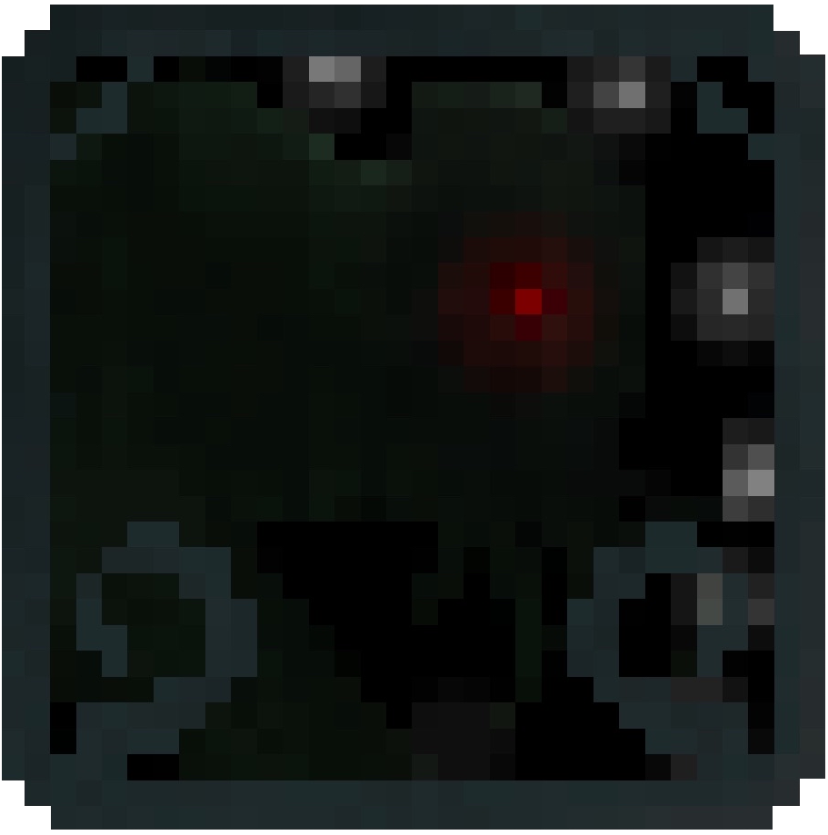
<figcaption>Source media</figcaption>
</figure>

<h2>Cthulhu, King of Divine Ice</h2>
<small class="skill-reference-status">1.21.1 reference · Server build match pending</small>

Combine energy siphoning, time control, freezing attacks, and a protective Snow Shell.

View ability →

</a>
</article>
<article class="reference-card" data-letter="F" data-search="faust, lord of investigation investigate entities, reveal hazards and treasure, and teach learned abilities.">
<a href="nightmares-faust/" aria-label="Open Faust, Lord of Investigation">
<figure class="reference-card-media reference-card-media--theme">
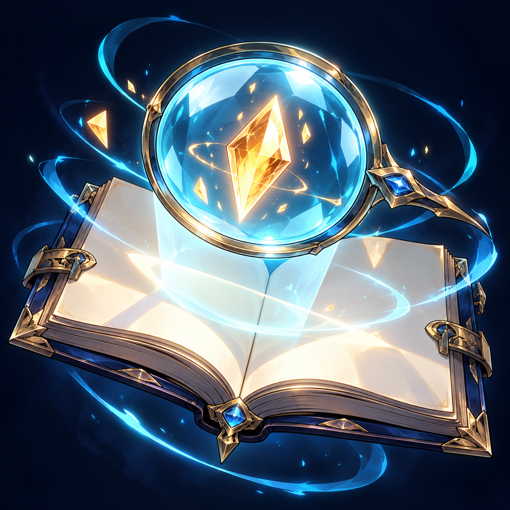
<figcaption>TSR artwork</figcaption>
</figure>

<h2>Faust, Lord of Investigation</h2>
<small class="skill-reference-status">1.21.1 reference · Server build match pending</small>

Investigate entities, reveal hazards and treasure, and teach learned abilities.

View ability →

</a>
</article>
<article class="reference-card" data-letter="G" data-search="gabriel, lord of patience freeze time and temperature, protect against heat, and wield ice-based control.">
<a href="nightmares-gabriel/" aria-label="Open Gabriel, Lord of Patience">
<figure class="reference-card-media reference-card-media--source">
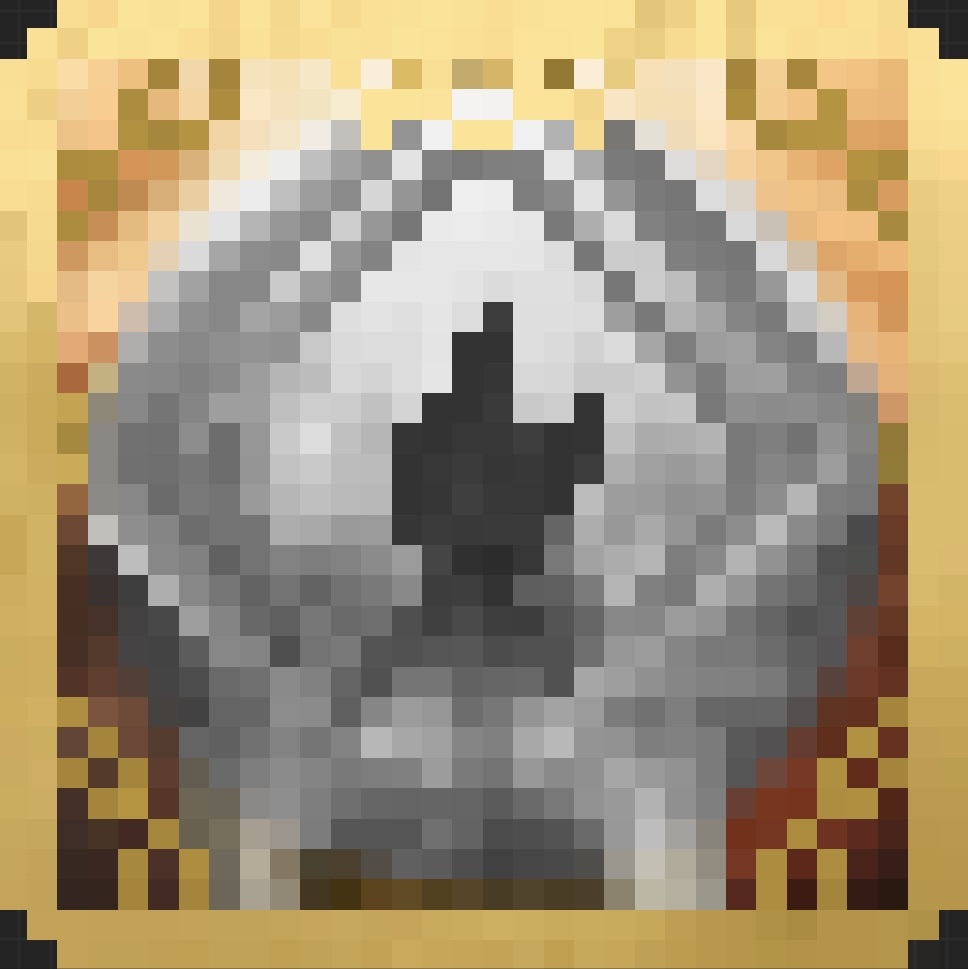
<figcaption>Source media</figcaption>
</figure>

<h2>Gabriel, Lord of Patience</h2>
<small class="skill-reference-status">1.21.1 reference · Server build match pending</small>

Freeze time and temperature, protect against heat, and wield ice-based control.

View ability →

</a>
</article>
<article class="reference-card" data-letter="G" data-search="gilgamesh, king of uruk clairvoyance - this gives the user an additional presence sense 20, presence sense raidus 20 and 10 levels of analytical.">
<a href="nightmares-gilgamesh-king-of-uruk/" aria-label="Open Gilgamesh, King of Uruk">
<figure class="reference-card-media reference-card-media--source">

<figcaption>TSR skill emblem</figcaption>
</figure>

<h2>Gilgamesh, King of Uruk</h2>
<small class="skill-reference-status">1.21.1 reference · Server build match pending</small>

Clairvoyance - This gives the user an additional Presence Sense 20, Presence Sense Raidus 20 and 10 Levels of Analytical.

View ability →

</a>
</article>
<article class="reference-card" data-letter="G" data-search="gilgamesh, lord of treasure true golden rule - grants a permanent luck 10 effects">
<a href="nightmares-gilgamesh-lord-of-treasures/" aria-label="Open Gilgamesh, Lord of Treasure">
<figure class="reference-card-media reference-card-media--source">

<figcaption>TSR skill emblem</figcaption>
</figure>

<h2>Gilgamesh, Lord of Treasure</h2>
<small class="skill-reference-status">1.21.1 reference · Server build match pending</small>

True Golden Rule - Grants a permanent Luck 10 effects

View ability →

</a>
</article>
<article class="reference-card" data-letter="G" data-search="grimoire, book of magic parallel processing - increases the amount of learned points and mastery points gained when learning/using skills, magic, battlewill, and arts by 14 (15 total). the…">
<a href="nightmares-grimoire/" aria-label="Open Grimoire, Book of Magic">
<figure class="reference-card-media reference-card-media--source">

<figcaption>TSR skill emblem</figcaption>
</figure>

<h2>Grimoire, Book of Magic</h2>
<small class="skill-reference-status">1.21.1 reference · Server build match pending</small>

Parallel Processing - Increases the amount of Learned Points and Mastery Points gained when learning/using Skills, Magic, Battlewill, and Arts by 14 (15 Total). The…

View ability →

</a>
</article>
<article class="reference-card" data-letter="H" data-search="hamiel, king of splendour restore defenses, absorb damage, and retaliate with reflected force.">
<a href="nightmares-hamiel/" aria-label="Open Hamiel, King of Splendour">
<figure class="reference-card-media reference-card-media--theme">
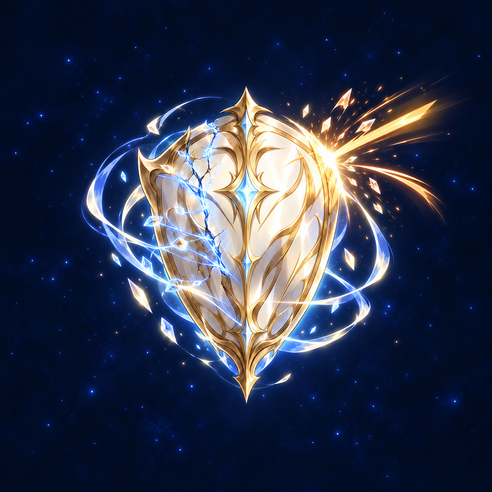
<figcaption>TSR artwork</figcaption>
</figure>

<h2>Hamiel, King of Splendour</h2>
<small class="skill-reference-status">1.21.1 reference · Server build match pending</small>

Restore defenses, absorb damage, and retaliate with reflected force.

View ability →

</a>
</article>
<article class="reference-card" data-letter="H" data-search="haniel, lord of glory regenerate behind reinforced defenses and reflect incoming damage.">
<a href="nightmares-haniel/" aria-label="Open Haniel, Lord of Glory">
<figure class="reference-card-media reference-card-media--theme">
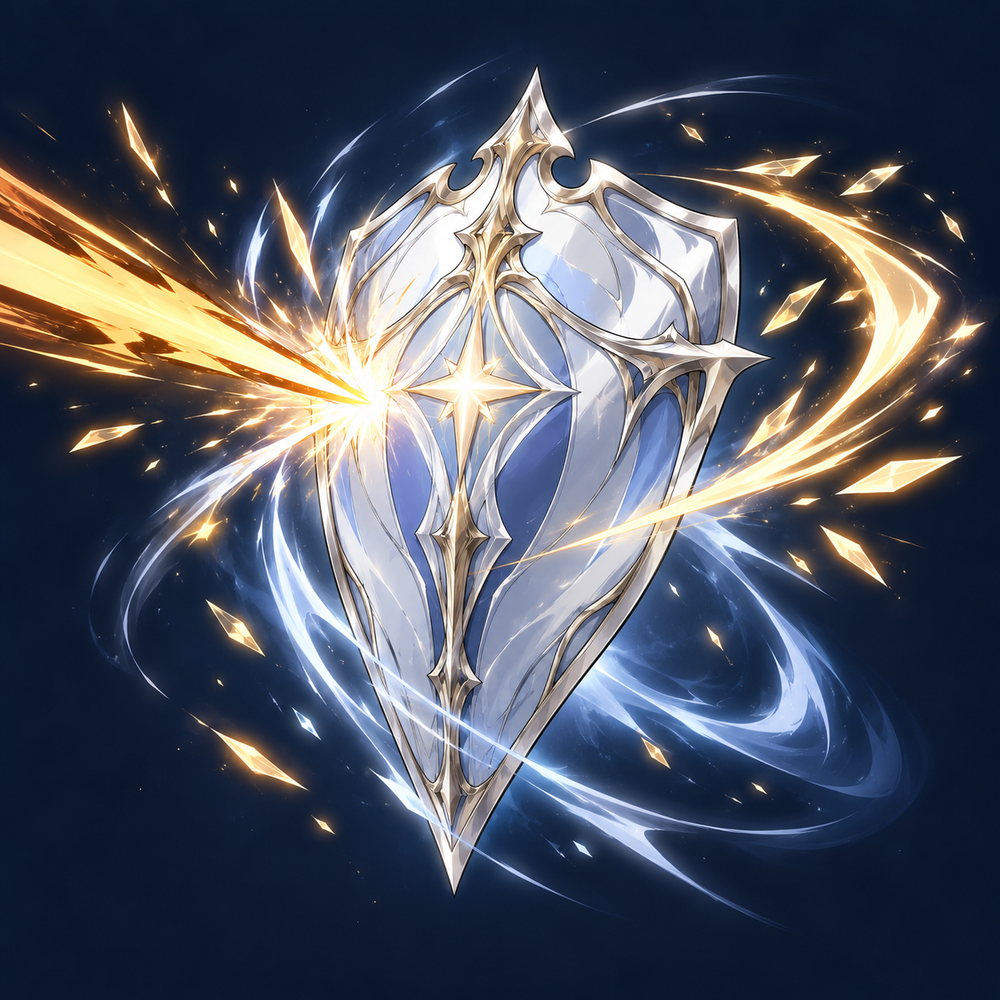
<figcaption>TSR artwork</figcaption>
</figure>

<h2>Haniel, Lord of Glory</h2>
<small class="skill-reference-status">1.21.1 reference · Server build match pending</small>

Regenerate behind reinforced defenses and reflect incoming damage.

View ability →

</a>
</article>
<article class="reference-card" data-letter="H" data-search="hastur, lord of starwind accelerate into black wind, shield allies, and unleash a lightning-laced storm.">
<a href="nightmares-hastur/" aria-label="Open Hastur, Lord of Starwind">
<figure class="reference-card-media reference-card-media--theme">
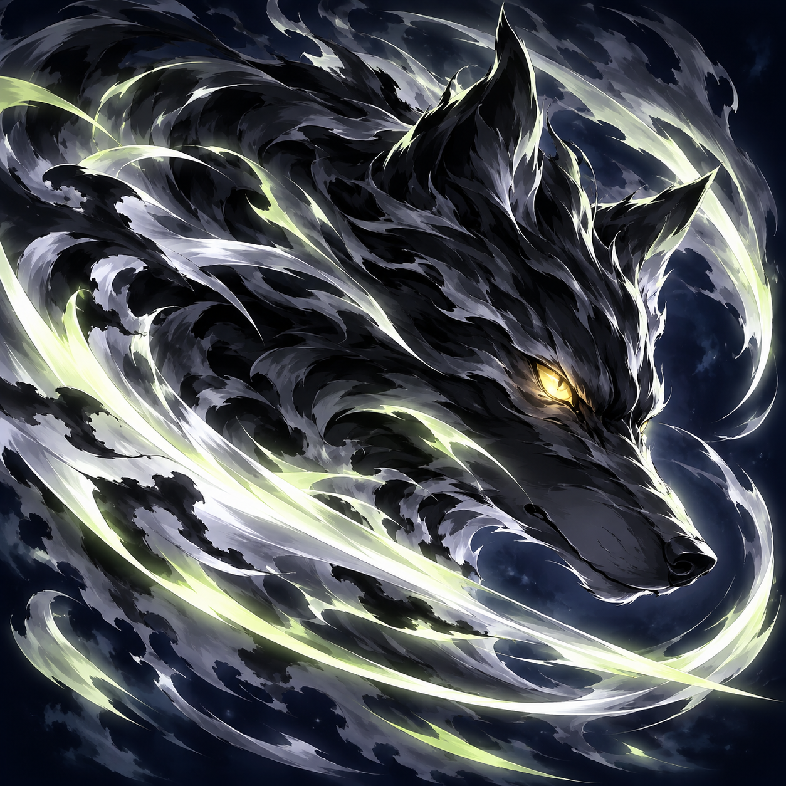
<figcaption>TSR artwork</figcaption>
</figure>

<h2>Hastur, Lord of Starwind</h2>
<small class="skill-reference-status">1.21.1 reference · Server build match pending</small>

Accelerate into black wind, shield allies, and unleash a lightning-laced storm.

View ability →

</a>
</article>
<article class="reference-card" data-letter="L" data-search="leviathan, lord of envy envious hero: if you are a true hero, and awaken leviathan, lord of envy, you will obtain the unique skill - stasis">
<a href="nightmares-leviathan/" aria-label="Open Leviathan, Lord of Envy">
<figure class="reference-card-media reference-card-media--source">

<figcaption>TSR skill emblem</figcaption>
</figure>

<h2>Leviathan, Lord of Envy</h2>
<small class="skill-reference-status">1.21.1 reference · Server build match pending</small>

Envious hero: If you are a True Hero, and awaken Leviathan, Lord of Envy, you will obtain the Unique Skill - Stasis

View ability →

</a>
</article>
<article class="reference-card" data-letter="L" data-search="lucifer, lord of pride copy individual ability modes and develop countermeasures through mastery.">
<a href="nightmares-lucifer/" aria-label="Open Lucifer, Lord of Pride">
<figure class="reference-card-media reference-card-media--source">

<figcaption>Source media</figcaption>
</figure>

<h2>Lucifer, Lord of Pride</h2>
<small class="skill-reference-status">1.21.1 reference · Server build match pending</small>

Copy individual ability modes and develop countermeasures through mastery.

View ability →

</a>
</article>
<article class="reference-card" data-letter="M" data-search="mammon, lord of greed absorb life: while mammon is in slot, the user&#x27;s attacks will steal a small amount of mp, ap or barrier points.">
<a href="nightmares-mammon/" aria-label="Open Mammon, Lord of Greed">
<figure class="reference-card-media reference-card-media--source">

<figcaption>TSR skill emblem</figcaption>
</figure>

<h2>Mammon, Lord of Greed</h2>
<small class="skill-reference-status">1.21.1 reference · Server build match pending</small>

Absorb Life: While Mammon is in slot, the user&#x27;s attacks will steal a small amount of MP, AP or Barrier Points.

View ability →

</a>
</article>
<article class="reference-card" data-letter="M" data-search="metatron, lord of purity collect spiritrons and channel purified holy attacks, disintegration, and melt cut.">
<a href="nightmares-metatron/" aria-label="Open Metatron, Lord of Purity">
<figure class="reference-card-media reference-card-media--theme">
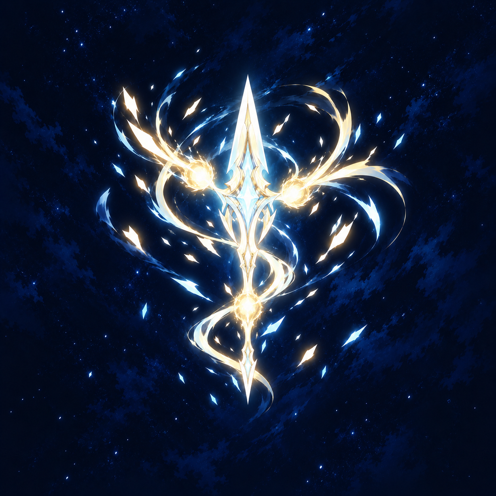
<figcaption>TSR artwork</figcaption>
</figure>

<h2>Metatron, Lord of Purity</h2>
<small class="skill-reference-status">1.21.1 reference · Server build match pending</small>

Collect Spiritrons and channel purified holy attacks, Disintegration, and Melt Cut.

View ability →

</a>
</article>
<article class="reference-card" data-letter="M" data-search="michael, lord of justice protect yourself with castle guard and command subordinates through dominion.">
<a href="nightmares-michael/" aria-label="Open Michael, Lord of Justice">
<figure class="reference-card-media reference-card-media--source">
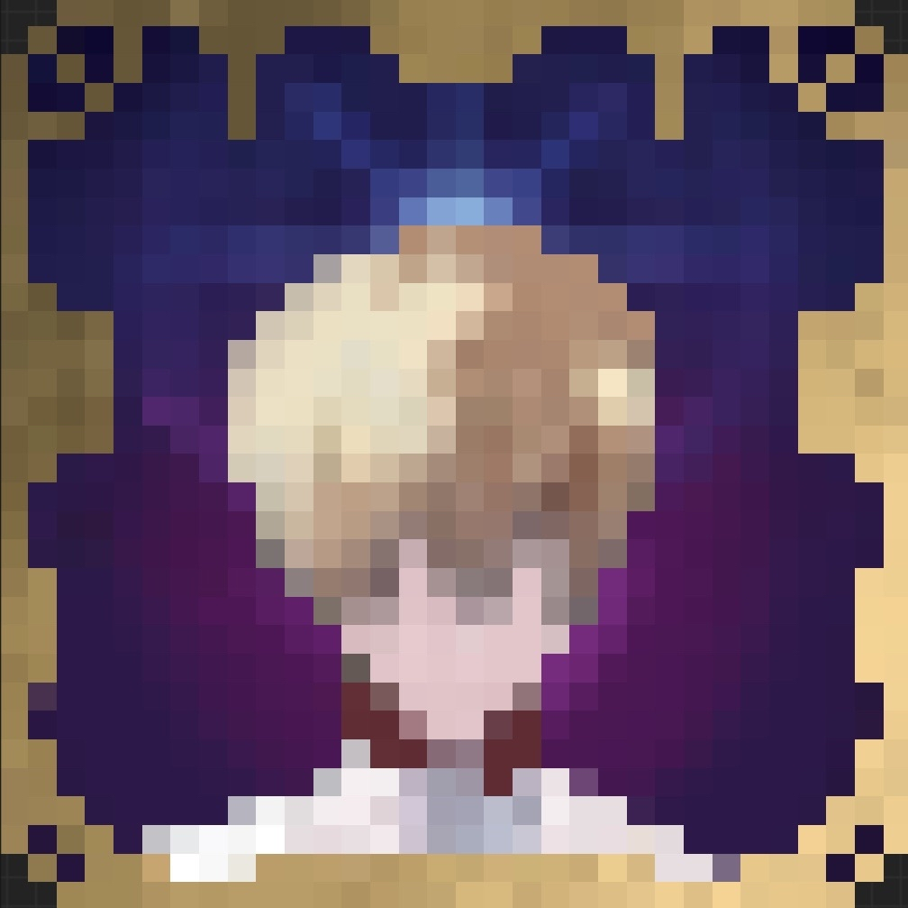
<figcaption>Source media</figcaption>
</figure>

<h2>Michael, Lord of Justice</h2>
<small class="skill-reference-status">1.21.1 reference · Server build match pending</small>

Protect yourself with Castle Guard and command subordinates through Dominion.

View ability →

</a>
</article>
<article class="reference-card" data-letter="M" data-search="mood maker, lord of psychology manipulate destiny, restore resources, and gain health-dependent combat effects.">
<a href="nightmares-mood-maker/" aria-label="Open Mood Maker, Lord of Psychology">
<figure class="reference-card-media reference-card-media--theme">

<figcaption>TSR artwork</figcaption>
</figure>

<h2>Mood Maker, Lord of Psychology</h2>
<small class="skill-reference-status">1.21.1 reference · Server build match pending</small>

Manipulate destiny, restore resources, and gain health-dependent combat effects.

View ability →

</a>
</article>
<article class="reference-card" data-letter="N" data-search="necronomicon, book of magic controlled order - the user cannot become a chaos being. this skill cannot be copied.">
<a href="nightmares-necronomicon/" aria-label="Open Necronomicon, Book of Magic">
<figure class="reference-card-media reference-card-media--source">

<figcaption>TSR skill emblem</figcaption>
</figure>

<h2>Necronomicon, Book of Magic</h2>
<small class="skill-reference-status">1.21.1 reference · Server build match pending</small>

Controlled Order - The user cannot become a Chaos Being. This skill cannot be copied.

View ability →

</a>
</article>
<article class="reference-card" data-letter="N" data-search="nodens, god of abyss analyze and store copied ability modes, control spacetime, and wield abyssal energy.">
<a href="nightmares-nodens/" aria-label="Open Nodens, God of Abyss">
<figure class="reference-card-media reference-card-media--theme">
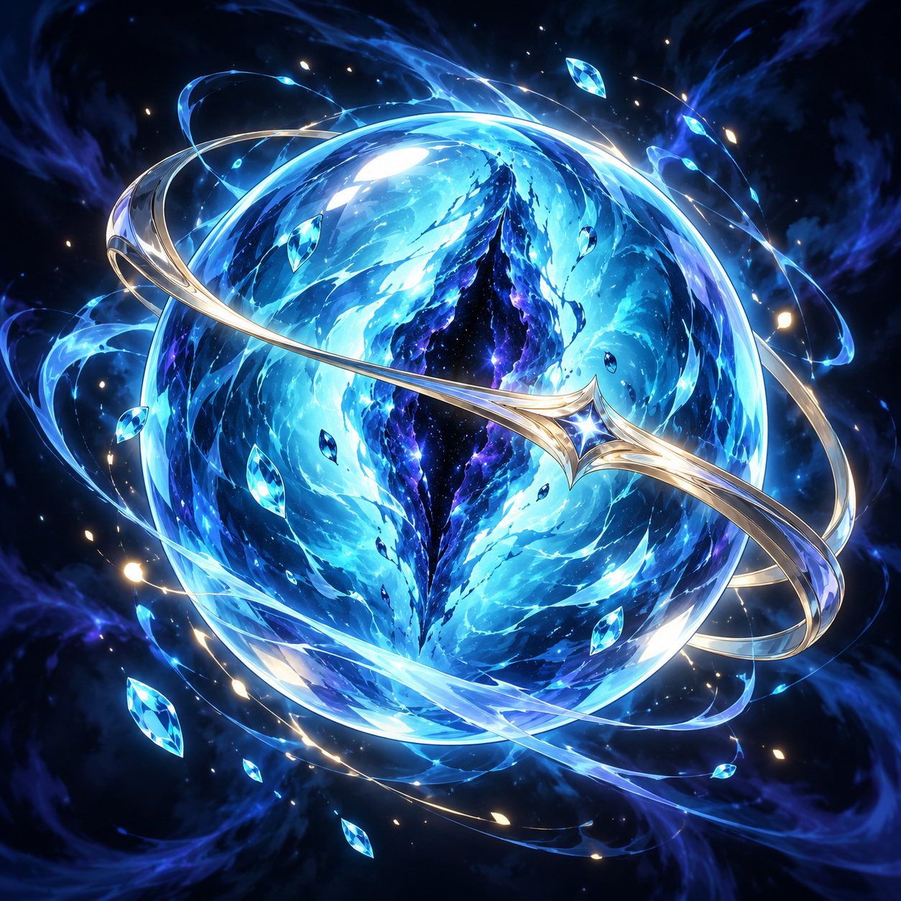
<figcaption>TSR artwork</figcaption>
</figure>

<h2>Nodens, God of Abyss</h2>
<small class="skill-reference-status">1.21.1 reference · Server build match pending</small>

Analyze and store copied ability modes, control spacetime, and wield abyssal energy.

View ability →

</a>
</article>
<article class="reference-card" data-letter="N" data-search="nyarlathotep, king of chaos all of creation - learn all schematics and aspcetual magics">
<a href="nightmares-nyarlathotep/" aria-label="Open Nyarlathotep, King of Chaos">
<figure class="reference-card-media reference-card-media--source">

<figcaption>TSR skill emblem</figcaption>
</figure>

<h2>Nyarlathotep, King of Chaos</h2>
<small class="skill-reference-status">1.21.1 reference · Server build match pending</small>

All of Creation - Learn all schematics and aspcetual Magics

View ability →

</a>
</article>
<article class="reference-card" data-letter="R" data-search="raguel, lord of charity amplify magic, accelerate thought, store energy, and support regeneration.">
<a href="nightmares-raguel/" aria-label="Open Raguel, Lord of Charity">
<figure class="reference-card-media reference-card-media--theme">
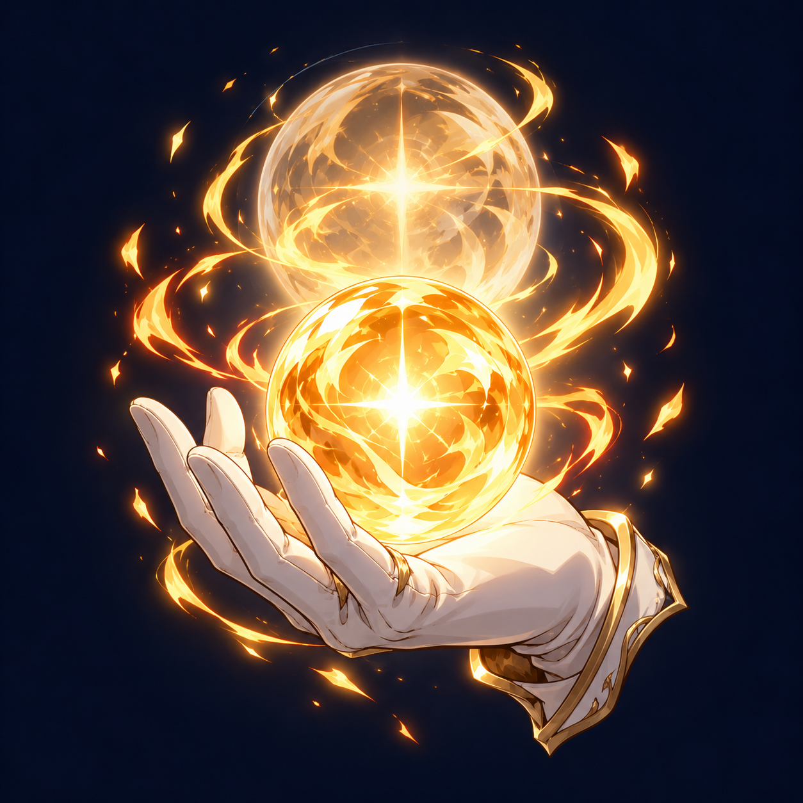
<figcaption>TSR artwork</figcaption>
</figure>

<h2>Raguel, Lord of Charity</h2>
<small class="skill-reference-status">1.21.1 reference · Server build match pending</small>

Amplify magic, accelerate thought, store energy, and support regeneration.

View ability →

</a>
</article>
<article class="reference-card" data-letter="R" data-search="raphael, lord of knowledge thought acceleration: increase magic casting speed multiplier by 4, increase movement speed by 0.01 (0.02 with mastery), increase attack speed by 0.2 (0.4 with mastery)">
<a href="nightmares-raphael-knowledge/" aria-label="Open Raphael, Lord of Knowledge">
<figure class="reference-card-media reference-card-media--source">

<figcaption>TSR skill emblem</figcaption>
</figure>

<h2>Raphael, Lord of Knowledge</h2>
<small class="skill-reference-status">1.21.1 reference · Server build match pending</small>

Thought Acceleration: Increase magic casting speed multiplier by 4, increase movement speed by 0.01 (0.02 with Mastery), increase attack speed by 0.2 (0.4 with Mastery)

View ability →

</a>
</article>
<article class="reference-card" data-letter="R" data-search="raphael, lord of wisdom thought acceleration: increase magic casting speed multiplier by 4, increase movement speed by 0.01 (0.02 with mastery), increase attack speed by 0.2 (0.4 with mastery)">
<a href="nightmares-raphael-wisdom/" aria-label="Open Raphael, Lord of Wisdom">
<figure class="reference-card-media reference-card-media--source">

<figcaption>TSR skill emblem</figcaption>
</figure>

<h2>Raphael, Lord of Wisdom</h2>
<small class="skill-reference-status">1.21.1 reference · Server build match pending</small>

Thought Acceleration: Increase magic casting speed multiplier by 4, increase movement speed by 0.01 (0.02 with Mastery), increase attack speed by 0.2 (0.4 with Mastery)

View ability →

</a>
</article>
<article class="reference-card" data-letter="S" data-search="samael, lord of deadly poison refine lethal poisons, inject cursed attacks, and draw targets into death world.">
<a href="nightmares-samael/" aria-label="Open Samael, Lord of Deadly Poison">
<figure class="reference-card-media reference-card-media--theme">
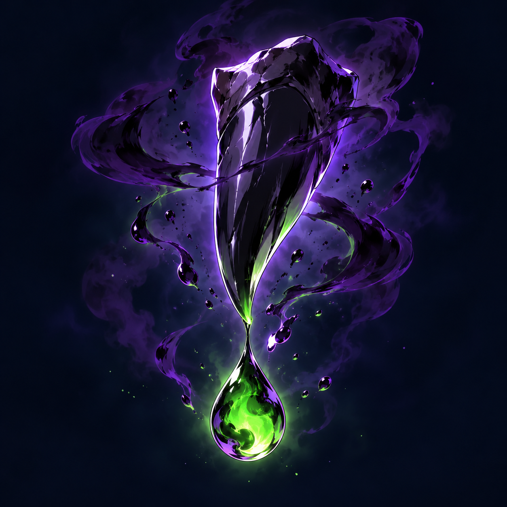
<figcaption>TSR artwork</figcaption>
</figure>

<h2>Samael, Lord of Deadly Poison</h2>
<small class="skill-reference-status">1.21.1 reference · Server build match pending</small>

Refine lethal poisons, inject cursed attacks, and draw targets into Death World.

View ability →

</a>
</article>
<article class="reference-card" data-letter="S" data-search="sandalphon, lord of judgement &quot;the judge has spoken. your verdict stands&quot;">
<a href="nightmares-sandalphon-judgment/" aria-label="Open Sandalphon, Lord of Judgement">
<figure class="reference-card-media reference-card-media--source">

<figcaption>TSR skill emblem</figcaption>
</figure>

<h2>Sandalphon, Lord of Judgement</h2>
<small class="skill-reference-status">1.21.1 reference · Server build match pending</small>

&quot;The judge has spoken. Your verdict stands&quot;

View ability →

</a>
</article>
<article class="reference-card" data-letter="S" data-search="sariel, lord of hope preserve subordinate strength, restore life, and create a protective backup body.">
<a href="nightmares-sariel/" aria-label="Open Sariel, Lord of Hope">
<figure class="reference-card-media reference-card-media--theme">
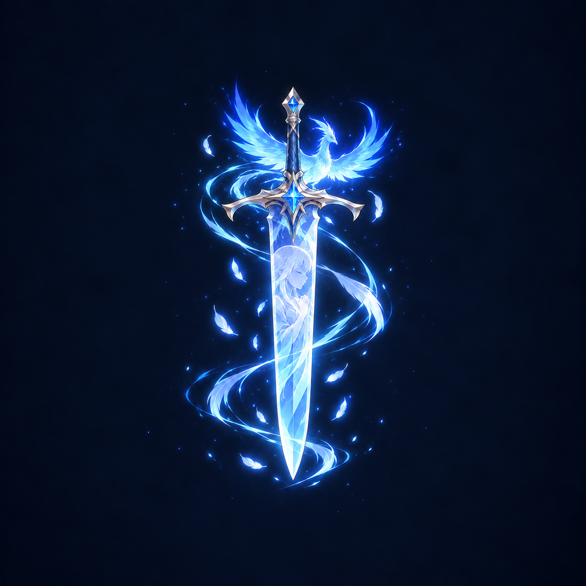
<figcaption>TSR artwork</figcaption>
</figure>

<h2>Sariel, Lord of Hope</h2>
<small class="skill-reference-status">1.21.1 reference · Server build match pending</small>

Preserve subordinate strength, restore life, and create a protective backup body.

View ability →

</a>
</article>
<article class="reference-card" data-letter="S" data-search="satanael, lord of wrath generate magicules, build rampage, and regulate a powerful energy reactor.">
<a href="nightmares-satanael/" aria-label="Open Satanael, Lord of Wrath">
<figure class="reference-card-media reference-card-media--source">
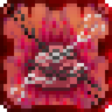
<figcaption>Source media</figcaption>
</figure>

<h2>Satanael, Lord of Wrath</h2>
<small class="skill-reference-status">1.21.1 reference · Server build match pending</small>

Generate Magicules, build Rampage, and regulate a powerful energy reactor.

View ability →

</a>
</article>
<article class="reference-card" data-letter="S" data-search="shub-niggurath, king of harvest store, recreate, duplicate, and bestow skills through a shared skill archive.">
<a href="nightmares-shub-niggurath/" aria-label="Open Shub-Niggurath, King of Harvest">
<figure class="reference-card-media reference-card-media--theme">
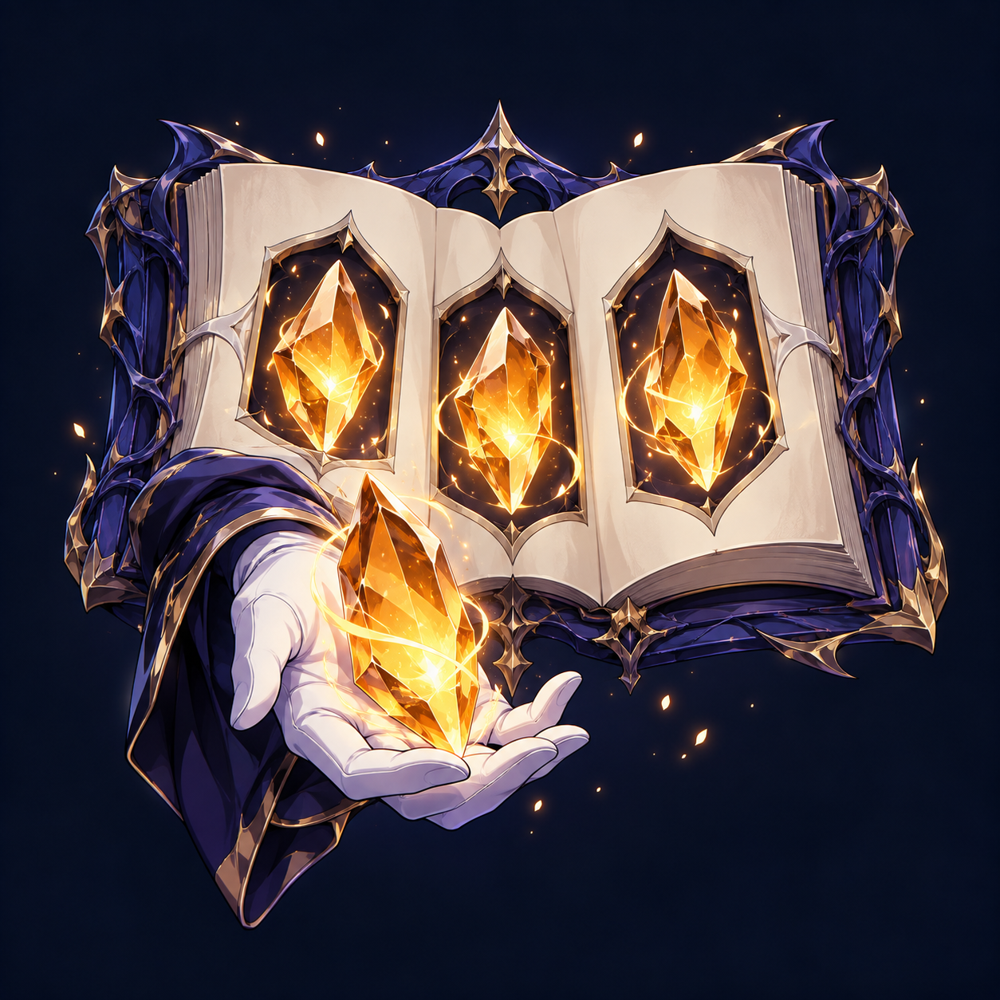
<figcaption>TSR artwork</figcaption>
</figure>

<h2>Shub-Niggurath, King of Harvest</h2>
<small class="skill-reference-status">1.21.1 reference · Server build match pending</small>

Store, recreate, duplicate, and bestow skills through a shared skill archive.

View ability →

</a>
</article>
<article class="reference-card" data-letter="S" data-search="surya, king of brillance channel spiritrons into refined holy attacks, protective barriers, and disintegration.">
<a href="nightmares-surya/" aria-label="Open Surya, King of Brillance">
<figure class="reference-card-media reference-card-media--theme">
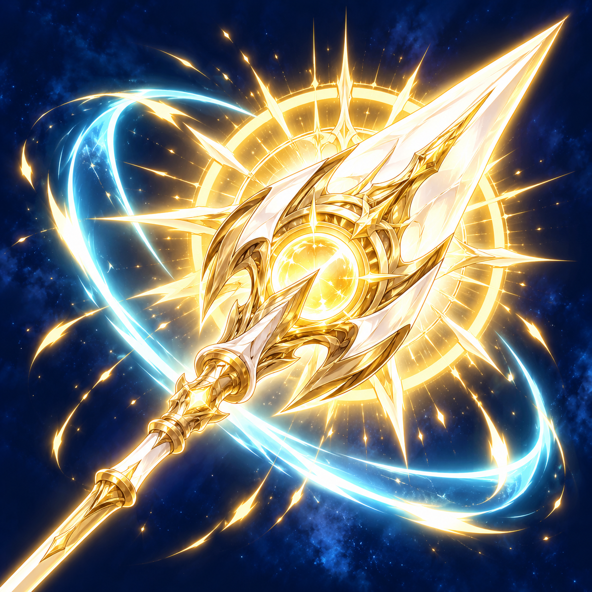
<figcaption>TSR artwork</figcaption>
</figure>

<h2>Surya, King of Brillance</h2>
<small class="skill-reference-status">1.21.1 reference · Server build match pending</small>

Channel Spiritrons into refined holy attacks, protective barriers, and Disintegration.

View ability →

</a>
</article>
<article class="reference-card" data-letter="S" data-search="susano&#x27;o, lord of tyranny bypass defenses, force critical hits, and inflict lasting maximum-health damage.">
<a href="nightmares-susanoo/" aria-label="Open Susano&#x27;o, Lord of Tyranny">
<figure class="reference-card-media reference-card-media--source">

<figcaption>Source media</figcaption>
</figure>

<h2>Susano&#x27;o, Lord of Tyranny</h2>
<small class="skill-reference-status">1.21.1 reference · Server build match pending</small>

Bypass defenses, force critical hits, and inflict lasting maximum-health damage.

View ability →

</a>
</article>
<article class="reference-card" data-letter="T" data-search="tantalous, king of evil daemonic heart - the user and all of their subordinates become majins.">
<a href="nightmares-tantalus/" aria-label="Open Tantalous, King of Evil">
<figure class="reference-card-media reference-card-media--source">

<figcaption>TSR skill emblem</figcaption>
</figure>

<h2>Tantalous, King of Evil</h2>
<small class="skill-reference-status">1.21.1 reference · Server build match pending</small>

Daemonic Heart - The user and all of their Subordinates become Majins.

View ability →

</a>
</article>
<article class="reference-card" data-letter="T" data-search="tenebrosum, god of souls soul collection - the user deals bonus spiritual damage equal to 5% of their souls on their physical attacks.">
<a href="nightmares-tenebrosum/" aria-label="Open Tenebrosum, God of Souls">
<figure class="reference-card-media reference-card-media--source">

<figcaption>TSR skill emblem</figcaption>
</figure>

<h2>Tenebrosum, God of Souls</h2>
<small class="skill-reference-status">1.21.1 reference · Server build match pending</small>

Soul Collection - The user deals bonus Spiritual Damage equal to 5% of their Souls on their Physical Attacks.

View ability →

</a>
</article>
<article class="reference-card" data-letter="T" data-search="the evil majin bubble majin&#x27;s ultimate evolution.">
<a href="the-evil-majin/" aria-label="Open The Evil Majin">
<figure class="reference-card-media reference-card-media--source">
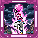
<figcaption>Source media</figcaption>
</figure>

<h2>The Evil Majin</h2>

Bubble Majin&#x27;s Ultimate evolution.

View ability →

</a>
</article>
<article class="reference-card" data-letter="T" data-search="the one who seals sealer&#x27;s ultimate evolution.">
<a href="the-one-who-seals/" aria-label="Open The One Who Seals">
<figure class="reference-card-media reference-card-media--source">
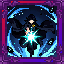
<figcaption>Source media</figcaption>
</figure>

<h2>The One Who Seals</h2>

Sealer&#x27;s Ultimate evolution.

View ability →

</a>
</article>
<article class="reference-card" data-letter="T" data-search="the slayer of dragons dragon slayer&#x27;s ultimate evolution.">
<a href="the-slayer-of-dragons/" aria-label="Open The Slayer of Dragons">
<figure class="reference-card-media reference-card-media--source">
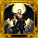
<figcaption>Source media</figcaption>
</figure>

<h2>The Slayer of Dragons</h2>

Dragon Slayer&#x27;s Ultimate evolution.

View ability →

</a>
</article>
<article class="reference-card" data-letter="T" data-search="the timeless mage great mage&#x27;s ultimate evolution.">
<a href="the-timeless-mage/" aria-label="Open The Timeless Mage">
<figure class="reference-card-media reference-card-media--source">

<figcaption>Source media</figcaption>
</figure>

<h2>The Timeless Mage</h2>

Great Mage&#x27;s Ultimate evolution.

View ability →

</a>
</article>
<article class="reference-card" data-letter="T" data-search="the unbound jester imprisoned jester&#x27;s ultimate evolution.">
<a href="the-unbound-jester/" aria-label="Open The Unbound Jester">
<figure class="reference-card-media reference-card-media--source">
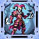
<figcaption>Source media</figcaption>
</figure>

<h2>The Unbound Jester</h2>

Imprisoned Jester&#x27;s Ultimate evolution.

View ability →

</a>
</article>
<article class="reference-card" data-letter="T" data-search="true hero, king of champions banner of the supreme king -the user&#x27;s slain subordinates become a memory. the user loses max ep equal to the subordinates ep. the memory is automatically stored in […">
<a href="nightmares-true-hero/" aria-label="Open True Hero, King of Champions">
<figure class="reference-card-media reference-card-media--source">

<figcaption>TSR skill emblem</figcaption>
</figure>

<h2>True Hero, King of Champions</h2>
<small class="skill-reference-status">1.21.1 reference · Server build match pending</small>

Banner of the Supreme King -The user&#x27;s slain subordinates become a Memory. The user loses max EP equal to the subordinates EP. The Memory is automatically stored in […

View ability →

</a>
</article>
<article class="reference-card" data-letter="T" data-search="tsukiyomi, lord of moonshadow move through shadows, evade attacks, and strike at spiritual health.">
<a href="nightmares-tsukiyomi/" aria-label="Open Tsukiyomi, Lord of Moonshadow">
<figure class="reference-card-media reference-card-media--theme">
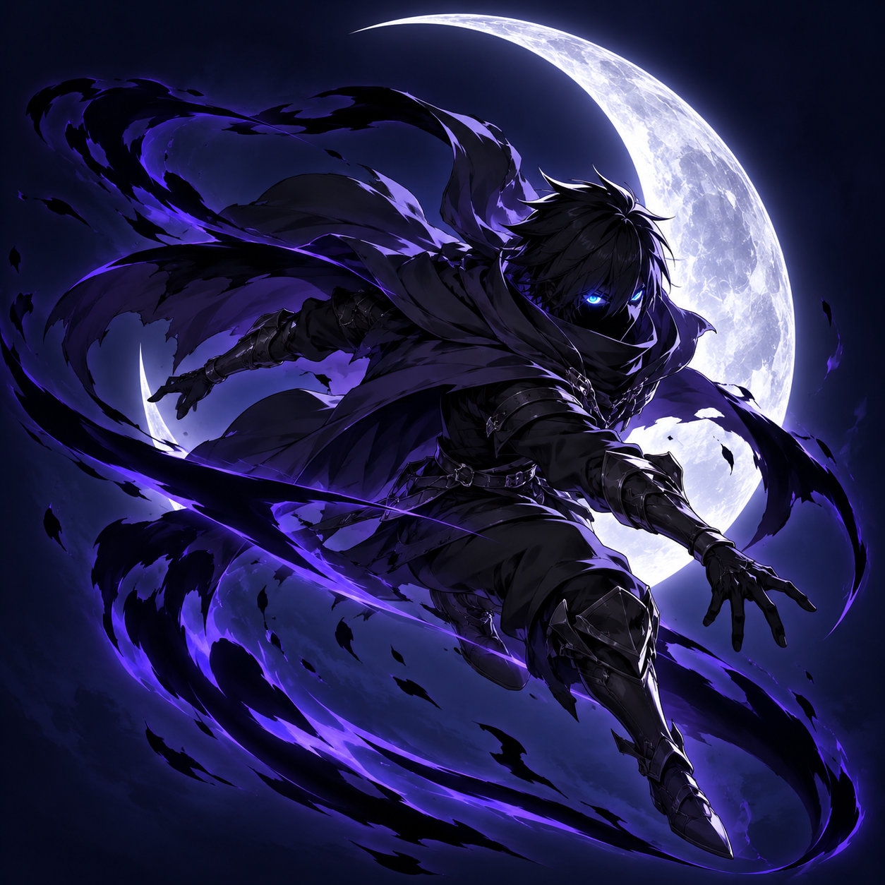
<figcaption>TSR artwork</figcaption>
</figure>

<h2>Tsukiyomi, Lord of Moonshadow</h2>
<small class="skill-reference-status">1.21.1 reference · Server build match pending</small>

Move through shadows, evade attacks, and strike at spiritual health.

View ability →

</a>
</article>
<article class="reference-card" data-letter="U" data-search="uriel, lord of oaths magic alteration: when toggled, the user can cast any magic that&#x27;s mastered within an anti-magic area. if the player&#x27;s ep is above 1.000.000, their mastered magic and…">
<a href="nightmares-uriel-lord-of-oath/" aria-label="Open Uriel, Lord of Oaths">
<figure class="reference-card-media reference-card-media--source">

<figcaption>TSR skill emblem</figcaption>
</figure>

<h2>Uriel, Lord of Oaths</h2>
<small class="skill-reference-status">1.21.1 reference · Server build match pending</small>

Magic Alteration: When toggled, the user can cast any Magic that&#x27;s mastered within an Anti-Magic Area. If the player&#x27;s EP is above 1.000.000, their mastered magic and…

View ability →

</a>
</article>
<article class="reference-card" data-letter="U" data-search="uriel, lord of vows believer system: the user gains +1 mastery and +1 learning for every subordinate they have.">
<a href="nightmares-uriel-lord-of-vow/" aria-label="Open Uriel, Lord of Vows">
<figure class="reference-card-media reference-card-media--source">

<figcaption>TSR skill emblem</figcaption>
</figure>

<h2>Uriel, Lord of Vows</h2>
<small class="skill-reference-status">1.21.1 reference · Server build match pending</small>

Believer System: The user gains +1 Mastery and +1 Learning for every subordinate they have.

View ability →

</a>
</article>
<article class="reference-card" data-letter="V" data-search="veldora, lord of storms channel storm-type magic and summon veldora’s human-form body.">
<a href="nightmares-veldora-lord-of-storms/" aria-label="Open Veldora, Lord of Storms">
<figure class="reference-card-media reference-card-media--theme">
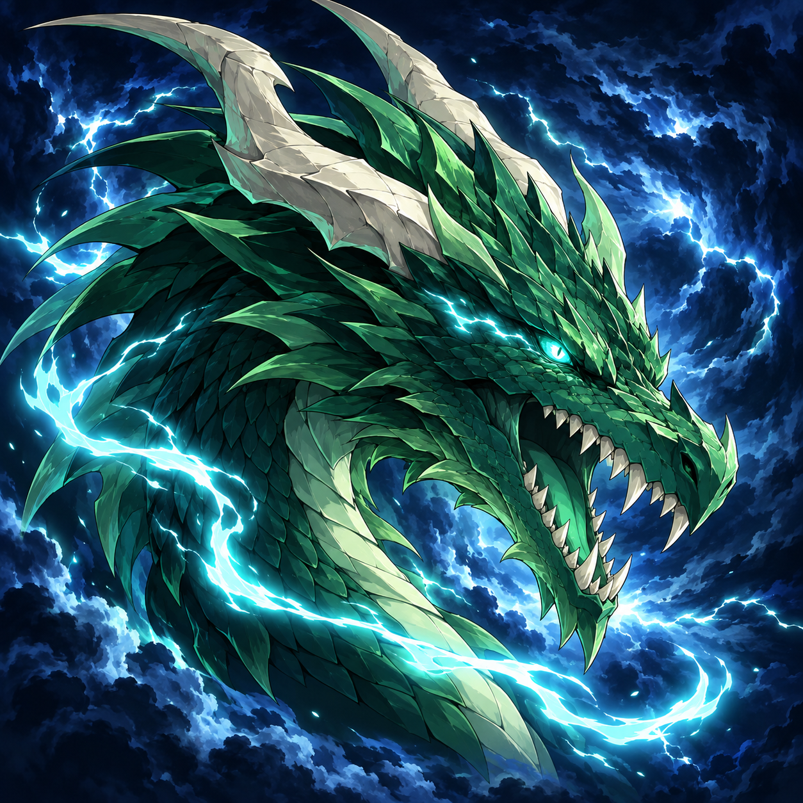
<figcaption>TSR artwork</figcaption>
</figure>

<h2>Veldora, Lord of Storms</h2>
<small class="skill-reference-status">1.21.1 reference · Server build match pending</small>

Channel storm-type magic and summon Veldora’s human-form body.

View ability →

</a>
</article>
<article class="reference-card" data-letter="V" data-search="velgrynd, lord of scorch channel scorch-type magic and summon velgrynd’s human-form body.">
<a href="nightmares-velgrynd-lord-of-scorch/" aria-label="Open Velgrynd, Lord of Scorch">
<figure class="reference-card-media reference-card-media--theme">
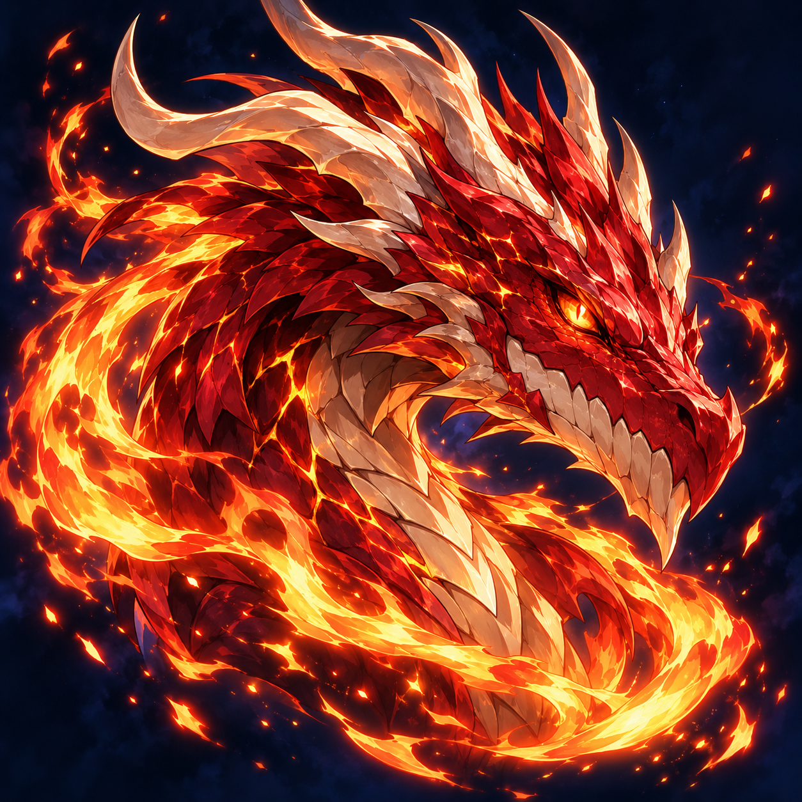
<figcaption>TSR artwork</figcaption>
</figure>

<h2>Velgrynd, Lord of Scorch</h2>
<small class="skill-reference-status">1.21.1 reference · Server build match pending</small>

Channel scorch-type magic and summon Velgrynd’s human-form body.

View ability →

</a>
</article>
<article class="reference-card" data-letter="V" data-search="velzard, lord of frost channel frost-type magic and summon velzard’s human-form body.">
<a href="nightmares-velzard-lord-of-frost/" aria-label="Open Velzard, Lord of Frost">
<figure class="reference-card-media reference-card-media--theme">
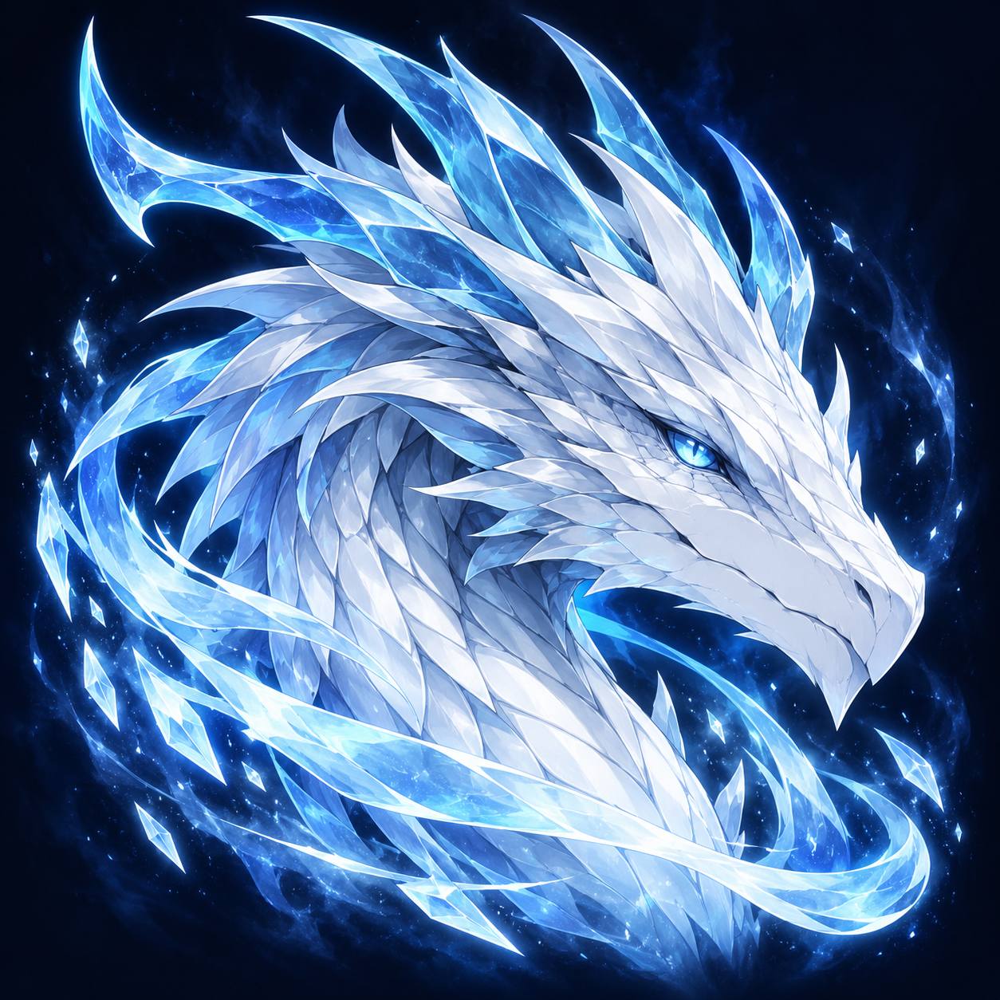
<figcaption>TSR artwork</figcaption>
</figure>

<h2>Velzard, Lord of Frost</h2>
<small class="skill-reference-status">1.21.1 reference · Server build match pending</small>

Channel frost-type magic and summon Velzard’s human-form body.

View ability →

</a>
</article>
<article class="reference-card" data-letter="Y" data-search="yog-sothoth, lord of space-time combine spatial severance, imprisonment, skill theft, and time manipulation.">
<a href="nightmares-yog-sothoth/" aria-label="Open Yog-Sothoth, Lord of Space-Time">
<figure class="reference-card-media reference-card-media--theme">
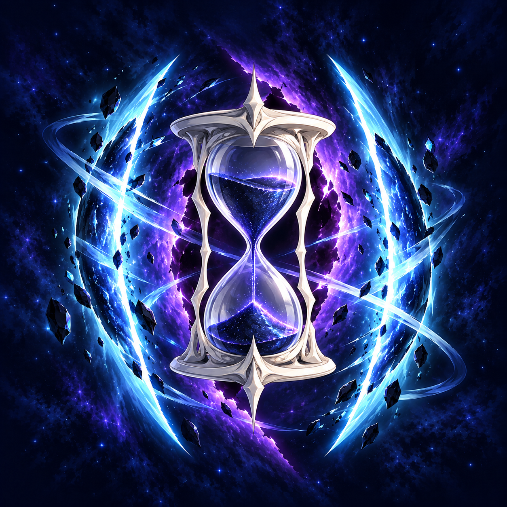
<figcaption>TSR artwork</figcaption>
</figure>

<h2>Yog-Sothoth, Lord of Space-Time</h2>
<small class="skill-reference-status">1.21.1 reference · Server build match pending</small>

Combine spatial severance, imprisonment, skill theft, and time manipulation.

View ability →

</a>
</article>
<article class="reference-card" data-letter="Y" data-search="yog-sotohort, god of space-time combine courage, hope, and justice data with advanced spacetime abilities.">
<a href="nightmares-yog-sotohort/" aria-label="Open Yog-Sotohort, God of Space-Time">
<figure class="reference-card-media reference-card-media--theme">
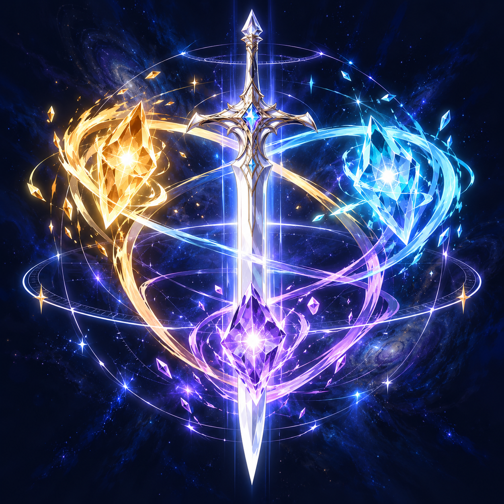
<figcaption>TSR artwork</figcaption>
</figure>

<h2>Yog-Sotohort, God of Space-Time</h2>
<small class="skill-reference-status">1.21.1 reference · Server build match pending</small>

Combine Courage, Hope, and Justice data with advanced spacetime abilities.

View ability →

</a>
</article>
<article class="reference-card" data-letter="Z" data-search="zehirete, god of faith divine blessing of faith - the user&#x27;s max spritirons is 1,500. you passively generate 15 spiritrons a second.">
<a href="nightmares-zehirete/" aria-label="Open Zehirete, God of Faith">
<figure class="reference-card-media reference-card-media--source">

<figcaption>TSR skill emblem</figcaption>
</figure>

<h2>Zehirete, God of Faith</h2>
<small class="skill-reference-status">1.21.1 reference · Server build match pending</small>

Divine Blessing of Faith - The user&#x27;s max Spritirons is 1,500. You passively generate 15 Spiritrons a second.

View ability →

</a>
</article>

No matching articles. Try a broader search.

</section>
