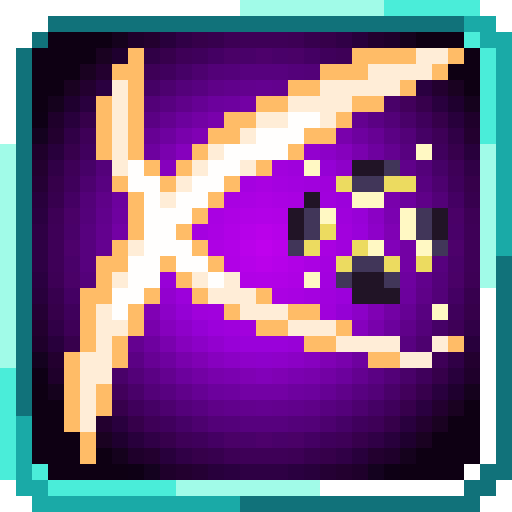
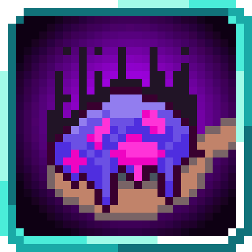
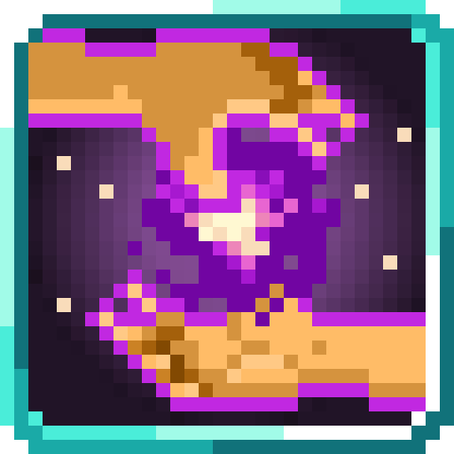
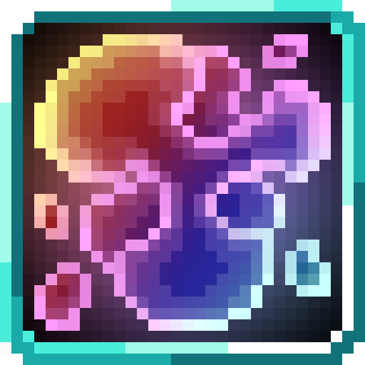
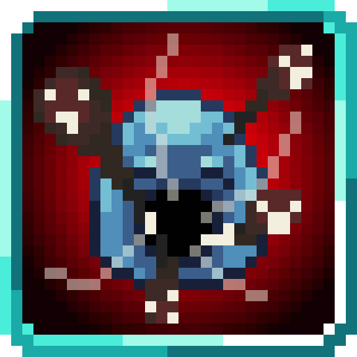
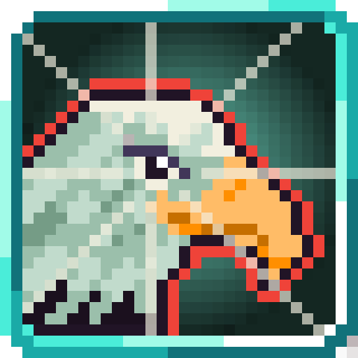
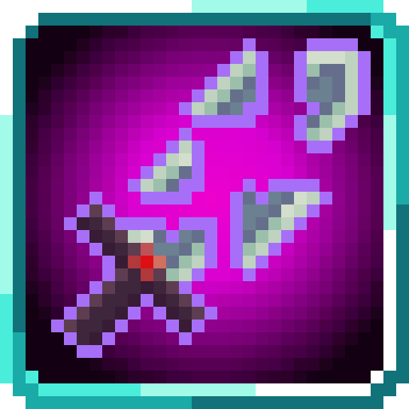
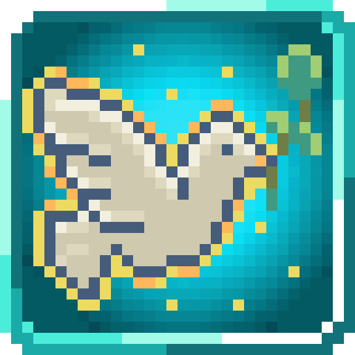
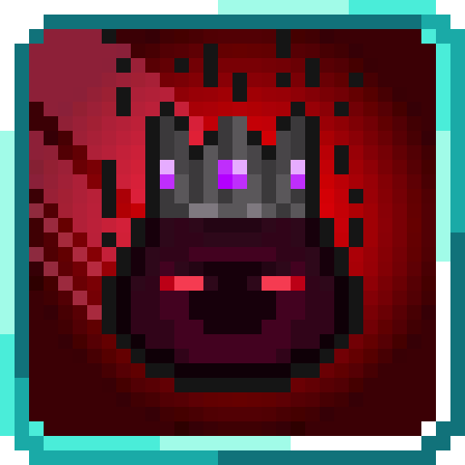
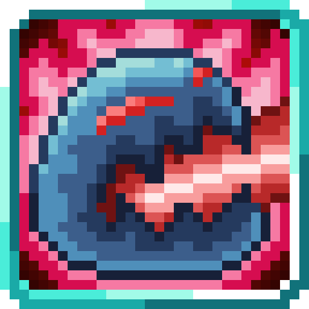

<section class="reference-directory" data-reference-directory="skills/unique">
<header class="reference-directory-hero reference-theme-abilities">

Tensura reference collection

<h1>Unique Skills</h1>

Unique-class skills and their documented mechanics.

<strong>91</strong> articles

</header>

<label class="reference-filter-label">
Filter this collection
<input type="search" class="reference-filter-input" placeholder="Search titles and summaries…" autocomplete="off">
</label>

<button type="button" class="is-active" data-letter="all" aria-pressed="true">All</button>
<button type="button" data-letter="A" aria-pressed="false">A</button>
<button type="button" data-letter="B" aria-pressed="false">B</button>
<button type="button" data-letter="C" aria-pressed="false">C</button>
<button type="button" data-letter="D" aria-pressed="false">D</button>
<button type="button" data-letter="E" aria-pressed="false">E</button>
<button type="button" data-letter="F" aria-pressed="false">F</button>
<button type="button" data-letter="G" aria-pressed="false">G</button>
<button type="button" data-letter="H" aria-pressed="false">H</button>
<button type="button" data-letter="I" aria-pressed="false">I</button>
<button type="button" data-letter="K" aria-pressed="false">K</button>
<button type="button" data-letter="L" aria-pressed="false">L</button>
<button type="button" data-letter="M" aria-pressed="false">M</button>
<button type="button" data-letter="O" aria-pressed="false">O</button>
<button type="button" data-letter="P" aria-pressed="false">P</button>
<button type="button" data-letter="R" aria-pressed="false">R</button>
<button type="button" data-letter="S" aria-pressed="false">S</button>
<button type="button" data-letter="T" aria-pressed="false">T</button>
<button type="button" data-letter="U" aria-pressed="false">U</button>
<button type="button" data-letter="V" aria-pressed="false">V</button>
<button type="button" data-letter="W" aria-pressed="false">W</button>
<button type="button" data-letter="Z" aria-pressed="false">Z</button>

Showing 91 of 91 articles

<article class="reference-card" data-letter="A" data-search="absolute severance wield the power to cut through any who stand in your path, whether by coating your strikes or launching slashing projectiles that sever all in their path.">
<a href="absolute-severance/" aria-label="Open Absolute Severance">
<figure class="reference-card-media reference-card-media--source">

<figcaption>Source media</figcaption>
</figure>

<h2>Absolute Severance</h2>

Wield the power to cut through any who stand in your path, whether by coating your strikes or launching slashing projectiles that sever all in their path.

Open reference →

</a>
</article>
<article class="reference-card" data-letter="A" data-search="analyst analyze the magic of the world and learn it yourself expanding your knowledge in the arcane">
<a href="analyst/" aria-label="Open Analyst">
<figure class="reference-card-media reference-card-media--source">

<figcaption>Source media</figcaption>
</figure>

<h2>Analyst</h2>

Analyze the magic of the world and learn it yourself expanding your knowledge in the arcane

Open reference →

</a>
</article>
<article class="reference-card" data-letter="B" data-search="berserk massively empower your body and infuse it with a flame aura. allows you to go into a risky but overwhelmingly powerful berserker mode.">
<a href="berserk/" aria-label="Open Berserk">
<figure class="reference-card-media reference-card-media--source">

<figcaption>Source media</figcaption>
</figure>

<h2>Berserk</h2>

Massively empower your body and infuse it with a flame aura. Allows you to go into a risky but overwhelmingly powerful berserker mode.

Open reference →

</a>
</article>
<article class="reference-card" data-letter="B" data-search="berserker feed on your enemies&#x27; defeat. gain ep from kills, destroy equipment faster, and boost your physical stats based on your power level.">
<a href="berserker/" aria-label="Open Berserker">
<figure class="reference-card-media reference-card-media--source">

<figcaption>Source media</figcaption>
</figure>

<h2>Berserker</h2>

Feed on your enemies&#x27; defeat. Gain EP from kills, destroy equipment faster, and boost your physical stats based on your power level.

Open reference →

</a>
</article>
<article class="reference-card" data-letter="B" data-search="bewilder use this skill to manipulate friends and foes,compelling them to act according to your will.">
<a href="bewilder/" aria-label="Open Bewilder">
<figure class="reference-card-media reference-card-media--source">

<figcaption>Source media</figcaption>
</figure>

<h2>Bewilder</h2>

Use this skill to manipulate friends and foes,compelling them to act according to your will.

Open reference →

</a>
</article>
<article class="reference-card" data-letter="B" data-search="butcher oh, your heart, aortic work of art, my love, my knife">
<a href="../../../mysticism-reference/skills/unique/butcher/" aria-label="Open Butcher">
<figure class="reference-card-media reference-card-media--source">

<figcaption>Source media</figcaption>
</figure>

<h2>Butcher</h2>

Oh, your heart, Aortic work of art, My love, my knife

Open reference →

</a>
</article>
<article class="reference-card" data-letter="C" data-search="captivator your previous life, you were the brightest, shining star. your ability to turn lies into truths… perhaps it’s the other way around? whatever it may be, your eyes shine…">
<a href="../../../mysticism-reference/skills/unique/captivator/" aria-label="Open Captivator">
<figure class="reference-card-media reference-card-media--source">

<figcaption>Source media</figcaption>
</figure>

<h2>Captivator</h2>

Your previous life, you were the brightest, shining star. Your ability to turn lies into truths… Perhaps it’s the other way around? Whatever it may be, your eyes shine…

Open reference →

</a>
</article>
<article class="reference-card" data-letter="C" data-search="chef purify and renew. remove all negative effects and restore vitality to those under your care.">
<a href="chef/" aria-label="Open Chef">
<figure class="reference-card-media reference-card-media--source">

<figcaption>Source media</figcaption>
</figure>

<h2>Chef</h2>

Purify and renew. Remove all negative effects and restore vitality to those under your care.

Open reference →

</a>
</article>
<article class="reference-card" data-letter="C" data-search="chosen one radiate authority and charisma to force fear into the hearts of your enemies and to make them follow you instead, while empowering yourself and your allies.">
<a href="chosen-one/" aria-label="Open Chosen One">
<figure class="reference-card-media reference-card-media--source">

<figcaption>Source media</figcaption>
</figure>

<h2>Chosen One</h2>

Radiate authority and charisma to force fear into the hearts of your enemies and to make them follow you instead, while empowering yourself and your allies.

Open reference →

</a>
</article>
<article class="reference-card" data-letter="C" data-search="coalescence za warudo!!! wait, wrong one? oh well, we got time, itll be fixed later">
<a href="../../../mysticism-reference/skills/unique/coalescence/" aria-label="Open Coalescence">
<figure class="reference-card-media reference-card-media--source">

<figcaption>Source media</figcaption>
</figure>

<h2>Coalescence</h2>

ZA WARUDO!!! Wait, wrong one? Oh well, we got time, itll be fixed later

Open reference →

</a>
</article>
<article class="reference-card" data-letter="C" data-search="commander lead the charge with your allies. empower yourself and your allies to give yourself an overwhelming advantage.">
<a href="commander/" aria-label="Open Commander">
<figure class="reference-card-media reference-card-media--source">

<figcaption>Source media</figcaption>
</figure>

<h2>Commander</h2>

Lead the charge with your allies. Empower yourself and your allies to give yourself an overwhelming advantage.

Open reference →

</a>
</article>
<article class="reference-card" data-letter="C" data-search="compulsor wip">
<a href="../../../mysticism-reference/skills/unique/compulsor/" aria-label="Open Compulsor">
<figure class="reference-card-media reference-card-media--source">

<figcaption>Source media</figcaption>
</figure>

<h2>Compulsor</h2>

WIP

Open reference →

</a>
</article>
<article class="reference-card" data-letter="C" data-search="constant after 15 seconds of holding this ability down, this mode automatically turns off with a longer cooldown of 15 seconds.">
<a href="../../../mysticism-reference/skills/unique/constant/" aria-label="Open Constant">
<figure class="reference-card-media reference-card-media--source">

<figcaption>Source media</figcaption>
</figure>

<h2>Constant</h2>

After 15 seconds of holding this ability down, this mode automatically turns off with a longer cooldown of 15 seconds.

Open reference →

</a>
</article>
<article class="reference-card" data-letter="C" data-search="cook bend reality to ensure your enemies meet their demise by ignoring their dodge and barriers.">
<a href="cook/" aria-label="Open Cook">
<figure class="reference-card-media reference-card-media--source">

<figcaption>Source media</figcaption>
</figure>

<h2>Cook</h2>

Bend reality to ensure your enemies meet their demise by ignoring their dodge and barriers.

Open reference →

</a>
</article>
<article class="reference-card" data-letter="C" data-search="corroder corroder? more toxic than my ex somehow">
<a href="../../../mysticism-reference/skills/unique/corroder/" aria-label="Open Corroder">
<figure class="reference-card-media reference-card-media--source">

<figcaption>Source media</figcaption>
</figure>

<h2>Corroder</h2>

Corroder? More toxic than my ex somehow

Open reference →

</a>
</article>
<article class="reference-card" data-letter="C" data-search="crasher the essence of &quot;deletion&quot;. completely and utterly erase your foes from the plane of existence with the power of your sheer will alone.">
<a href="../../../mysticism-reference/skills/unique/crasher/" aria-label="Open Crasher">
<figure class="reference-card-media reference-card-media--source">

<figcaption>Source media</figcaption>
</figure>

<h2>Crasher</h2>

The essence of &quot;deletion&quot;. Completely and utterly erase your foes from the plane of existence with the power of your sheer will alone.

Open reference →

</a>
</article>
<article class="reference-card" data-letter="C" data-search="creator create unique skills and use them for a limited amount of time.">
<a href="creator/" aria-label="Open Creator">
<figure class="reference-card-media reference-card-media--source">

<figcaption>Source media</figcaption>
</figure>

<h2>Creator</h2>

Create Unique Skills and use them for a limited amount of time.

Open reference →

</a>
</article>
<article class="reference-card" data-letter="C" data-search="cultivator embody the relentless pursuit of ascension, gathering and refining energy to reach unparalleled heights. a cultivator walks the path of self-perfection and dominion…">
<a href="../../../mysticism-reference/skills/unique/cultivator/" aria-label="Open Cultivator">
<figure class="reference-card-media reference-card-media--source">

<figcaption>Source media</figcaption>
</figure>

<h2>Cultivator</h2>

Embody the relentless pursuit of ascension, gathering and refining energy to reach unparalleled heights. A Cultivator walks the path of self-perfection and dominion…

Open reference →

</a>
</article>
<article class="reference-card" data-letter="D" data-search="degenerate craft, decraft, customize items and absorb strength from weakened enemies.">
<a href="degenerate/" aria-label="Open Degenerate">
<figure class="reference-card-media reference-card-media--source">

<figcaption>Source media</figcaption>
</figure>

<h2>Degenerate</h2>

Craft, decraft, customize items and absorb strength from weakened enemies.

Open reference →

</a>
</article>
<article class="reference-card" data-letter="D" data-search="divine berserker empower your body by a massive amount but beware the aftereffects.">
<a href="divine-berserker/" aria-label="Open Divine Berserker">
<figure class="reference-card-media reference-card-media--source">

<figcaption>Source media</figcaption>
</figure>

<h2>Divine Berserker</h2>

Empower your body by a massive amount but beware the aftereffects.

Open reference →

</a>
</article>
<article class="reference-card" data-letter="D" data-search="dreamer save your current health, shp, magicules, aura, and location. reactivating dream will restore your stats back to the saved values and instantly teleport you to the…">
<a href="../../../mysticism-reference/skills/unique/dreamer/" aria-label="Open Dreamer">
<figure class="reference-card-media reference-card-media--source">

<figcaption>Source media</figcaption>
</figure>

<h2>Dreamer</h2>

Save your current health, SHP, magicules, aura, and location. Reactivating Dream will restore your stats back to the saved values and instantly teleport you to the…

Open reference →

</a>
</article>
<article class="reference-card" data-letter="E" data-search="engineer tinkering and tinkering. no one understood the machines as much as you did. in fact, no one understood you either. perhaps it was always meant to be.">
<a href="../../../mysticism-reference/skills/unique/engineer/" aria-label="Open Engineer">
<figure class="reference-card-media reference-card-media--source">

<figcaption>Source media</figcaption>
</figure>

<h2>Engineer</h2>

Tinkering and tinkering. No one understood the machines as much as you did. In fact, no one understood you either. Perhaps it was always meant to be.

Open reference →

</a>
</article>
<article class="reference-card" data-letter="E" data-search="engorger increase your size and boost your physical stats.">
<a href="engorger/" aria-label="Open Engorger">
<figure class="reference-card-media reference-card-media--source">

<figcaption>Source media</figcaption>
</figure>

<h2>Engorger</h2>

Increase your size and boost your physical stats.

Open reference →

</a>
</article>
<article class="reference-card" data-letter="E" data-search="envy absorb strength from enemies, buff yourself and debilitate your enemies.">
<a href="envy/" aria-label="Open Envy">
<figure class="reference-card-media reference-card-media--source">

<figcaption>Source media</figcaption>
</figure>

<h2>Envy</h2>

Absorb strength from enemies, buff yourself and debilitate your enemies.

Open reference →

</a>
</article>
<article class="reference-card" data-letter="F" data-search="falsifier see through falsehoods and invisibility, conceal your presence from prying eyes and create illusions.">
<a href="falsifier/" aria-label="Open Falsifier">
<figure class="reference-card-media reference-card-media--source">

<figcaption>Source media</figcaption>
</figure>

<h2>Falsifier</h2>

See through falsehoods and invisibility, conceal your presence from prying eyes and create illusions.

Open reference →

</a>
</article>
<article class="reference-card" data-letter="F" data-search="fighter achieve mastery through discipline. learn combat and magic abilities instantly, gain more mastery points, and hit much harder.">
<a href="fighter/" aria-label="Open Fighter">
<figure class="reference-card-media reference-card-media--source">

<figcaption>Source media</figcaption>
</figure>

<h2>Fighter</h2>

Achieve mastery through discipline. Learn combat and magic abilities instantly, gain more mastery points, and hit much harder.

Open reference →

</a>
</article>
<article class="reference-card" data-letter="F" data-search="fusionist turn the world into a weapon, absorb the environment to create powerful mines and grenades.">
<a href="fusionist/" aria-label="Open Fusionist">
<figure class="reference-card-media reference-card-media--source">

<figcaption>Source media</figcaption>
</figure>

<h2>Fusionist</h2>

Turn the world into a weapon, absorb the environment to create powerful mines and grenades.

Open reference →

</a>
</article>
<article class="reference-card" data-letter="G" data-search="gardener the crops, the wild, everything was there for you. you sow the seeds and wish only for a bountiful harvest. and in turn, the crops bless you.">
<a href="../../../mysticism-reference/skills/unique/gardener/" aria-label="Open Gardener">
<figure class="reference-card-media reference-card-media--source">

<figcaption>Source media</figcaption>
</figure>

<h2>Gardener</h2>

The crops, the wild, everything was there for you. You sow the seeds and wish only for a bountiful harvest. And in turn, the crops bless you.

Open reference →

</a>
</article>
<article class="reference-card" data-letter="G" data-search="gatekeeper wield the authority of kings and command treasures beyond mortal reach. summon divine armaments from the vault, binding foes in chains of judgment while asserting…">
<a href="../../../mysticism-reference/skills/unique/gatekeeper/" aria-label="Open Gatekeeper">
<figure class="reference-card-media reference-card-media--source">

<figcaption>Source media</figcaption>
</figure>

<h2>Gatekeeper</h2>

Wield the authority of kings and command treasures beyond mortal reach. Summon divine armaments from the vault, binding foes in chains of judgment while asserting…

Open reference →

</a>
</article>
<article class="reference-card" data-letter="G" data-search="gluttony absorb all in your path. none can win. receive and provide skills, gain access to a spatial storage and mimic entities.">
<a href="gluttony/" aria-label="Open Gluttony">
<figure class="reference-card-media reference-card-media--source">

<figcaption>Source media</figcaption>
</figure>

<h2>Gluttony</h2>

Absorb all in your path. None can win. Receive and provide skills, gain access to a spatial storage and mimic entities.

Open reference →

</a>
</article>
<article class="reference-card" data-letter="G" data-search="godly craftsman utilize your years of experience to create masterpieces with ease and engrave your weapons for terrifying efficiency.">
<a href="godly-craftsman/" aria-label="Open Godly Craftsman">
<figure class="reference-card-media reference-card-media--source">

<figcaption>Source media</figcaption>
</figure>

<h2>Godly Craftsman</h2>

Utilize your years of experience to create masterpieces with ease and engrave your weapons for terrifying efficiency.

Open reference →

</a>
</article>
<article class="reference-card" data-letter="G" data-search="gourmand feast upon the energy of your opponents. steal magicules with your attacks and grow stronger by devouring the power of fallen enemies.">
<a href="gourmand/" aria-label="Open Gourmand">
<figure class="reference-card-media reference-card-media--source">

<figcaption>Source media</figcaption>
</figure>

<h2>Gourmand</h2>

Feast upon the energy of your opponents. Steal Magicules with your attacks and grow stronger by devouring the power of fallen enemies.

Open reference →

</a>
</article>
<article class="reference-card" data-letter="G" data-search="gourmet absorb your enemies, gain new powers, and break down anything that stands in your way.">
<a href="gourmet/" aria-label="Open Gourmet">
<figure class="reference-card-media reference-card-media--source">

<figcaption>Source media</figcaption>
</figure>

<h2>Gourmet</h2>

Absorb your enemies, gain new powers, and break down anything that stands in your way.

Open reference →

</a>
</article>
<article class="reference-card" data-letter="G" data-search="great sage improve your cognitive skills to learn and cast faster, become able to appraise targets and use analysis to copy skills and process materials to craft or replicate…">
<a href="great-sage/" aria-label="Open Great Sage">
<figure class="reference-card-media reference-card-media--source">

<figcaption>Source media</figcaption>
</figure>

<h2>Great Sage</h2>

Improve your cognitive skills to learn and cast faster, become able to appraise targets and use analysis to copy skills and process materials to craft or replicate…

Open reference →

</a>
</article>
<article class="reference-card" data-letter="G" data-search="greed take everything. conquer the world and your enemies with it. kill anyone who stands in your path while strengthening yourself or your allies.">
<a href="greed/" aria-label="Open Greed">
<figure class="reference-card-media reference-card-media--source">

<figcaption>Source media</figcaption>
</figure>

<h2>Greed</h2>

Take everything. Conquer the world and your enemies with it. Kill anyone who stands in your path while strengthening yourself or your allies.

Open reference →

</a>
</article>
<article class="reference-card" data-letter="G" data-search="guardian stand as a bastion against the force of your enemies. absorb the damage from your allies and fortify their defenses.">
<a href="guardian/" aria-label="Open Guardian">
<figure class="reference-card-media reference-card-media--source">

<figcaption>Source media</figcaption>
</figure>

<h2>Guardian</h2>

Stand as a bastion against the force of your enemies. Absorb the damage from your allies and fortify their defenses.

Open reference →

</a>
</article>
<article class="reference-card" data-letter="H" data-search="healer mend wounds with a touch or unleash devastating afflictions, capable of both salvation and suffering.">
<a href="healer/" aria-label="Open Healer">
<figure class="reference-card-media reference-card-media--source">

<figcaption>Source media</figcaption>
</figure>

<h2>Healer</h2>

Mend wounds with a touch or unleash devastating afflictions, capable of both salvation and suffering.

Open reference →

</a>
</article>
<article class="reference-card" data-letter="H" data-search="hidden ruler the one who lurks in the shadows... just waiting for things to happen. the one who answers your questions at every call...">
<a href="../../../mysticism-reference/skills/unique/hidden-ruler/" aria-label="Open Hidden Ruler">
<figure class="reference-card-media reference-card-media--source">

<figcaption>Source media</figcaption>
</figure>

<h2>Hidden Ruler</h2>

The one who lurks in the shadows... Just waiting for things to happen. The one who answers your questions at every call...

Open reference →

</a>
</article>
<article class="reference-card" data-letter="I" data-search="infinity prison trap enemies in an unbreakable dimensional cage or shield yourself from any threat with your dimensional barrier. gain access to spatial storage.">
<a href="infinity-prison/" aria-label="Open Infinity Prison">
<figure class="reference-card-media reference-card-media--source">

<figcaption>Source media</figcaption>
</figure>

<h2>Infinity Prison</h2>

Trap enemies in an unbreakable dimensional cage or shield yourself from any threat with your dimensional barrier. Gain access to spatial storage.

Open reference →

</a>
</article>
<article class="reference-card" data-letter="I" data-search="inverse w.i.p">
<a href="../../../mysticism-reference/skills/unique/inverse/" aria-label="Open Inverse">
<figure class="reference-card-media reference-card-media--source">

<figcaption>Source media</figcaption>
</figure>

<h2>Inverse</h2>

W.I.P

Open reference →

</a>
</article>
<article class="reference-card" data-letter="K" data-search="kyurem &quot;a husk of what you formally were. the leftovers, discarded without a second thought when the split happened. coldness seeps through your skin as you freeze everything…">
<a href="../../../mysticism-reference/skills/unique/kyurem/" aria-label="Open Kyurem">
<figure class="reference-card-media reference-card-media--source">

<figcaption>Source media</figcaption>
</figure>

<h2>Kyurem</h2>

&quot;A husk of what you formally were. The leftovers, discarded without a second thought when the split happened. Coldness seeps through your skin as you freeze everything…

Open reference →

</a>
</article>
<article class="reference-card" data-letter="L" data-search="lust assert your control over life and death. drain your enemies of their strength or invigorate those under your wing.">
<a href="lust/" aria-label="Open Lust">
<figure class="reference-card-media reference-card-media--source">

<figcaption>Source media</figcaption>
</figure>

<h2>Lust</h2>

Assert your control over life and death. Drain your enemies of their strength or invigorate those under your wing.

Open reference →

</a>
</article>
<article class="reference-card" data-letter="M" data-search="malleable [sub-skill] cold clay - the user will learn flame attack resistance when malleable is acquired.">
<a href="../../../mysticism-reference/skills/unique/malleable/" aria-label="Open Malleable">
<figure class="reference-card-media reference-card-media--source">

<figcaption>Source media</figcaption>
</figure>

<h2>Malleable</h2>

[Sub-Skill] Cold Clay - The user will learn Flame Attack Resistance when Malleable is acquired.

Open reference →

</a>
</article>
<article class="reference-card" data-letter="M" data-search="martial master empower your physical attacks, accelerate your thought process to react and dodge better while beating your enemies to submission.">
<a href="martial-master/" aria-label="Open Martial Master">
<figure class="reference-card-media reference-card-media--source">

<figcaption>Source media</figcaption>
</figure>

<h2>Martial Master</h2>

Empower your physical attacks, accelerate your thought process to react and dodge better while beating your enemies to submission.

Open reference →

</a>
</article>
<article class="reference-card" data-letter="M" data-search="mathematician use mathematics to improve your combat abilities, become able to use analytical appraisal to assess all.">
<a href="mathematician/" aria-label="Open Mathematician">
<figure class="reference-card-media reference-card-media--source">

<figcaption>Source media</figcaption>
</figure>

<h2>Mathematician</h2>

Use mathematics to improve your combat abilities, become able to use analytical appraisal to assess all.

Open reference →

</a>
</article>
<article class="reference-card" data-letter="M" data-search="melancholy summon an aura of sorrow that slows and weakens nearby enemies, filling them with despair. the skill also throws objects or air, amplifying the feeling of hopelessness…">
<a href="../../../mysticism-reference/skills/unique/melancholy/" aria-label="Open Melancholy">
<figure class="reference-card-media reference-card-media--source">

<figcaption>Source media</figcaption>
</figure>

<h2>Melancholy</h2>

Summon an aura of sorrow that slows and weakens nearby enemies, filling them with despair. The skill also throws objects or air, amplifying the feeling of hopelessness…

Open reference →

</a>
</article>
<article class="reference-card" data-letter="M" data-search="merciless instantly kill weakened enemies or drain the life force of those who lack the will to fight or of those much weaker than you.">
<a href="merciless/" aria-label="Open Merciless">
<figure class="reference-card-media reference-card-media--source">

<figcaption>Source media</figcaption>
</figure>

<h2>Merciless</h2>

Instantly kill weakened enemies or drain the life force of those who lack the will to fight or of those much weaker than you.

Open reference →

</a>
</article>
<article class="reference-card" data-letter="M" data-search="murderer disappear into the shadows and deal massive damage, also become undetectable by sound.">
<a href="murderer/" aria-label="Open Murderer">
<figure class="reference-card-media reference-card-media--source">

<figcaption>Source media</figcaption>
</figure>

<h2>Murderer</h2>

Disappear into the shadows and deal massive damage, also become undetectable by sound.

Open reference →

</a>
</article>
<article class="reference-card" data-letter="M" data-search="musician turn beautiful music into an instrument of destruction. use sound to create powerful blasts which ignore armor.">
<a href="musician/" aria-label="Open Musician">
<figure class="reference-card-media reference-card-media--source">

<figcaption>Source media</figcaption>
</figure>

<h2>Musician</h2>

Turn beautiful music into an instrument of destruction. Use sound to create powerful blasts which ignore armor.

Open reference →

</a>
</article>
<article class="reference-card" data-letter="O" data-search="observer see all, evade all. instinctively avoid attacks, detect concealed dangers, and identify hidden entities. nothing escapes your watchful gaze.">
<a href="observer/" aria-label="Open Observer">
<figure class="reference-card-media reference-card-media--source">

<figcaption>Source media</figcaption>
</figure>

<h2>Observer</h2>

See all, evade all. Instinctively avoid attacks, detect concealed dangers, and identify hidden entities. Nothing escapes your watchful gaze.

Open reference →

</a>
</article>
<article class="reference-card" data-letter="O" data-search="oppressor dominate gravity yourself, control attractive and repulsive forces or unleash devastating ranged attacks which will crush anyone unfortunate enough to be in your path.">
<a href="oppressor/" aria-label="Open Oppressor">
<figure class="reference-card-media reference-card-media--source">

<figcaption>Source media</figcaption>
</figure>

<h2>Oppressor</h2>

Dominate gravity yourself, control attractive and repulsive forces or unleash devastating ranged attacks which will crush anyone unfortunate enough to be in your path.

Open reference →

</a>
</article>
<article class="reference-card" data-letter="P" data-search="phaser &quot;when a man learns to love, he must also bear the risk of carrying hate&quot;">
<a href="../../../mysticism-reference/skills/unique/phaser/" aria-label="Open Phaser">
<figure class="reference-card-media reference-card-media--source">

<figcaption>Source media</figcaption>
</figure>

<h2>Phaser</h2>

&quot;When a man learns to love, he must also bear the risk of carrying hate&quot;

Open reference →

</a>
</article>
<article class="reference-card" data-letter="P" data-search="plunderer blend the shadows together for a perfect mix of discord and harmony. rule over them and destroy all who dare to disrupt the shadow monarch&#x27;s reign.">
<a href="../../../mysticism-reference/skills/unique/plunderer/" aria-label="Open Plunderer">
<figure class="reference-card-media reference-card-media--source">

<figcaption>Source media</figcaption>
</figure>

<h2>Plunderer</h2>

Blend the shadows together for a perfect mix of discord and harmony. Rule over them and destroy all who dare to disrupt the Shadow Monarch&#x27;s reign.

Open reference →

</a>
</article>
<article class="reference-card" data-letter="P" data-search="predator become the monster you were meant to be. eat all. analyze, craft and refine items, gain access to a spatial storage and mimic entities.">
<a href="predator/" aria-label="Open Predator">
<figure class="reference-card-media reference-card-media--source">

<figcaption>Source media</figcaption>
</figure>

<h2>Predator</h2>

Become the monster you were meant to be. Eat all. Analyze, craft and refine items, gain access to a spatial storage and mimic entities.

Open reference →

</a>
</article>
<article class="reference-card" data-letter="P" data-search="pride turn the strength of your opponents into your own and turn the tides of battle. copy abilities when you are struck by them, provided you meet the necessary conditions.">
<a href="pride/" aria-label="Open Pride">
<figure class="reference-card-media reference-card-media--source">

<figcaption>Source media</figcaption>
</figure>

<h2>Pride</h2>

Turn the strength of your opponents into your own and turn the tides of battle. Copy abilities when you are struck by them, provided you meet the necessary conditions.

Open reference →

</a>
</article>
<article class="reference-card" data-letter="P" data-search="provider here, take my glorious stuff! (i like these texts)">
<a href="../../../mysticism-reference/skills/unique/provider/" aria-label="Open Provider">
<figure class="reference-card-media reference-card-media--source">

<figcaption>Source media</figcaption>
</figure>

<h2>Provider</h2>

HERE, TAKE MY GLORIOUS STUFF! (I like these texts)

Open reference →

</a>
</article>
<article class="reference-card" data-letter="R" data-search="reaper &quot; they call me... the visage of death. &quot; &quot; who, who calls you that? &quot;">
<a href="reaper/" aria-label="Open Reaper">
<figure class="reference-card-media reference-card-media--source">

<figcaption>Source media</figcaption>
</figure>

<h2>Reaper</h2>

&quot; They call me... the Visage of Death. &quot; &quot; Who, who calls you that? &quot;

Open reference →

</a>
</article>
<article class="reference-card" data-letter="R" data-search="reducer damn bro, no magicules?">
<a href="../../../mysticism-reference/skills/unique/reducer/" aria-label="Open Reducer">
<figure class="reference-card-media reference-card-media--source">

<figcaption>Source media</figcaption>
</figure>

<h2>Reducer</h2>

Damn bro, no magicules?

Open reference →

</a>
</article>
<article class="reference-card" data-letter="R" data-search="reflector turn back the tides of battle by reflecting all of the received damage. unleash a devastating projectile attack or counter an attack directly.">
<a href="reflector/" aria-label="Open Reflector">
<figure class="reference-card-media reference-card-media--source">

<figcaption>Source media</figcaption>
</figure>

<h2>Reflector</h2>

Turn back the tides of battle by reflecting all of the received damage. Unleash a devastating projectile attack or counter an attack directly.

Open reference →

</a>
</article>
<article class="reference-card" data-letter="R" data-search="repeater any physical damage you perform will be repeated a second time.">
<a href="../../../mysticism-reference/skills/unique/repeater/" aria-label="Open Repeater">
<figure class="reference-card-media reference-card-media--source">

<figcaption>Source media</figcaption>
</figure>

<h2>Repeater</h2>

Any physical damage you perform will be repeated a second time.

Open reference →

</a>
</article>
<article class="reference-card" data-letter="R" data-search="researcher study ancient magic tomes, reverse engineer them, and create wonders beyond imagination.">
<a href="researcher/" aria-label="Open Researcher">
<figure class="reference-card-media reference-card-media--source">

<figcaption>Source media</figcaption>
</figure>

<h2>Researcher</h2>

Study ancient magic tomes, reverse engineer them, and create wonders beyond imagination.

Open reference →

</a>
</article>
<article class="reference-card" data-letter="R" data-search="reshiram &quot;you seek to build a world of truths. are you prepared to scorch and burn everything in your path to make the truthful world you seek so badly?&quot;">
<a href="../../../mysticism-reference/skills/unique/reshiram/" aria-label="Open Reshiram">
<figure class="reference-card-media reference-card-media--source">

<figcaption>Source media</figcaption>
</figure>

<h2>Reshiram</h2>

&quot;You seek to build a world of Truths. Are you prepared to scorch and burn everything in your path to make the truthful world you seek so badly?&quot;

Open reference →

</a>
</article>
<article class="reference-card" data-letter="R" data-search="restricted the user of this skill can no longer gain any magicules, nor gain any more skills (except for the ones provided to them on reincarnation by their race, or if a skill…">
<a href="../../../mysticism-reference/skills/unique/restricted/" aria-label="Open Restricted">
<figure class="reference-card-media reference-card-media--source">

<figcaption>Source media</figcaption>
</figure>

<h2>Restricted</h2>

The user of this skill can no longer gain any magicules, nor gain any more skills (except for the ones provided to them on reincarnation by their race, OR if a skill…

Open reference →

</a>
</article>
<article class="reference-card" data-letter="R" data-search="reverser flip the rules. change alignments, invert buffs and debuffs while shifting strengths and weaknesses to your benefit.">
<a href="reverser/" aria-label="Open Reverser">
<figure class="reference-card-media reference-card-media--source">

<figcaption>Source media</figcaption>
</figure>

<h2>Reverser</h2>

Flip the rules. Change alignments, invert buffs and debuffs while shifting strengths and weaknesses to your benefit.

Open reference →

</a>
</article>
<article class="reference-card" data-letter="R" data-search="royal beast unleash a primal fury and gain a massive physical boost to crush your enemies.">
<a href="royal-beast/" aria-label="Open Royal Beast">
<figure class="reference-card-media reference-card-media--source">

<figcaption>Source media</figcaption>
</figure>

<h2>Royal Beast</h2>

Unleash a primal fury and gain a massive physical boost to crush your enemies.

Open reference →

</a>
</article>
<article class="reference-card" data-letter="S" data-search="scholar have you heard about the scholar of 53?">
<a href="../../../mysticism-reference/skills/unique/scholar/" aria-label="Open Scholar">
<figure class="reference-card-media reference-card-media--source">

<figcaption>Source media</figcaption>
</figure>

<h2>Scholar</h2>

Have you heard about the Scholar of 53?

Open reference →

</a>
</article>
<article class="reference-card" data-letter="S" data-search="schrodinger schrodinger? like the cat?">
<a href="../../../mysticism-reference/skills/unique/schrodinger/" aria-label="Open Schrodinger">
<figure class="reference-card-media reference-card-media--source">

<figcaption>Source media</figcaption>
</figure>

<h2>Schrodinger</h2>

Schrodinger? Like the cat?

Open reference →

</a>
</article>
<article class="reference-card" data-letter="S" data-search="seeker your curiosity drives you to seek the truths of this world and learn as much as possible about it">
<a href="seeker/" aria-label="Open Seeker">
<figure class="reference-card-media reference-card-media--source">

<figcaption>Source media</figcaption>
</figure>

<h2>Seeker</h2>

Your curiosity drives you to seek the truths of this world and learn as much as possible about it

Open reference →

</a>
</article>
<article class="reference-card" data-letter="S" data-search="seer see everything. foresee your opponent’s moves. dodge or mitigate their attacks and predict their movement to score critical strikes.">
<a href="seer/" aria-label="Open Seer">
<figure class="reference-card-media reference-card-media--source">

<figcaption>Source media</figcaption>
</figure>

<h2>Seer</h2>

See everything. Foresee your opponent’s moves. Dodge or mitigate their attacks and predict their movement to score critical strikes.

Open reference →

</a>
</article>
<article class="reference-card" data-letter="S" data-search="severer slice through reality and manifest spatial blades which cut through armor and unleash devastating blade storms.">
<a href="severer/" aria-label="Open Severer">
<figure class="reference-card-media reference-card-media--source">

<figcaption>Source media</figcaption>
</figure>

<h2>Severer</h2>

Slice through reality and manifest spatial blades which cut through armor and unleash devastating blade storms.

Open reference →

</a>
</article>
<article class="reference-card" data-letter="S" data-search="shadow striker become one with the shadows and deal massive spiritual damage and become immune to lesser presence detection.">
<a href="shadow-striker/" aria-label="Open Shadow Striker">
<figure class="reference-card-media reference-card-media--source">

<figcaption>Source media</figcaption>
</figure>

<h2>Shadow Striker</h2>

Become one with the shadows and deal massive spiritual damage and become immune to lesser presence detection.

Open reference →

</a>
</article>
<article class="reference-card" data-letter="S" data-search="sloth grind the world to a halt. put your enemies into a deadly sleep, drain their power and rest to regain any lost vitality. may lethargy take over.">
<a href="sloth/" aria-label="Open Sloth">
<figure class="reference-card-media reference-card-media--source">

<figcaption>Source media</figcaption>
</figure>

<h2>Sloth</h2>

Grind the world to a halt. Put your enemies into a deadly sleep, drain their power and rest to regain any lost vitality. May lethargy take over.

Open reference →

</a>
</article>
<article class="reference-card" data-letter="S" data-search="sniper deal damage from afar while using different bullets to get past resistances and ensure a quick kill.">
<a href="sniper/" aria-label="Open Sniper">
<figure class="reference-card-media reference-card-media--source">

<figcaption>Source media</figcaption>
</figure>

<h2>Sniper</h2>

Deal damage from afar while using different bullets to get past resistances and ensure a quick kill.

Open reference →

</a>
</article>
<article class="reference-card" data-letter="S" data-search="spearhead empower and command your allies, and then collect their abilities once they pass on.">
<a href="spearhead/" aria-label="Open Spearhead">
<figure class="reference-card-media reference-card-media--source">

<figcaption>Source media</figcaption>
</figure>

<h2>Spearhead</h2>

Empower and command your allies, and then collect their abilities once they pass on.

Open reference →

</a>
</article>
<article class="reference-card" data-letter="S" data-search="spiritualist the soul formula is as follows: (mainhand weapon damage + base atk dmg) x critical multiplier (typically 1.5) / 5">
<a href="../../../mysticism-reference/skills/unique/spiritualist/" aria-label="Open Spiritualist">
<figure class="reference-card-media reference-card-media--source">

<figcaption>Source media</figcaption>
</figure>

<h2>Spiritualist</h2>

The Soul formula is as follows: (Mainhand Weapon Damage + Base Atk Dmg) x Critical Multiplier (typically 1.5) / 5

Open reference →

</a>
</article>
<article class="reference-card" data-letter="S" data-search="stagnator stagnate the world around you, could this be a jojo reference...?">
<a href="../../../mysticism-reference/skills/unique/stagnator/" aria-label="Open Stagnator">
<figure class="reference-card-media reference-card-media--source">

<figcaption>Source media</figcaption>
</figure>

<h2>Stagnator</h2>

Stagnate the world around you, could this be a jojo reference...?

Open reference →

</a>
</article>
<article class="reference-card" data-letter="S" data-search="starved consume all in your path or have your rampaging subordinates do it. corrode your enemies, devour their strength, and add their abilities to your own.">
<a href="starved/" aria-label="Open Starved">
<figure class="reference-card-media reference-card-media--source">

<figcaption>Source media</figcaption>
</figure>

<h2>Starved</h2>

Consume all in your path or have your rampaging subordinates do it. Corrode your enemies, devour their strength, and add their abilities to your own.

Open reference →

</a>
</article>
<article class="reference-card" data-letter="S" data-search="subjugator empower your allies to fight with you and benefit from their fait, start subjugating it!">
<a href="../../../mysticism-reference/skills/unique/subjugator/" aria-label="Open Subjugator">
<figure class="reference-card-media reference-card-media--source">

<figcaption>Source media</figcaption>
</figure>

<h2>Subjugator</h2>

Empower your allies to fight with you and benefit from their fait, start subjugating it!

Open reference →

</a>
</article>
<article class="reference-card" data-letter="S" data-search="suppressor restrict teleportation, confuse enemies by swapping places, and use your blink as well as the spatial gate to cross large distances.">
<a href="suppressor/" aria-label="Open Suppressor">
<figure class="reference-card-media reference-card-media--source">

<figcaption>Source media</figcaption>
</figure>

<h2>Suppressor</h2>

Restrict teleportation, confuse enemies by swapping places, and use your blink as well as the spatial gate to cross large distances.

Open reference →

</a>
</article>
<article class="reference-card" data-letter="S" data-search="survivor endure and outheal anything, nullify physical damage and withstand overwhelming odds.">
<a href="survivor/" aria-label="Open Survivor">
<figure class="reference-card-media reference-card-media--source">

<figcaption>Source media</figcaption>
</figure>

<h2>Survivor</h2>

Endure and outheal anything, nullify physical damage and withstand overwhelming odds.

Open reference →

</a>
</article>
<article class="reference-card" data-letter="T" data-search="the balance upstream reference information for the balance.">
<a href="../../../mysticism-reference/skills/unique/the-balance/" aria-label="Open The Balance">
<figure class="reference-card-media reference-card-media--source">

<figcaption>Source media</figcaption>
</figure>

<h2>The Balance</h2>

Upstream reference information for The Balance.

Open reference →

</a>
</article>
<article class="reference-card" data-letter="T" data-search="thrower use your skill and your precision to throw anything and deal massive damage. you can even shove air or push back your foes.">
<a href="thrower/" aria-label="Open Thrower">
<figure class="reference-card-media reference-card-media--source">

<figcaption>Source media</figcaption>
</figure>

<h2>Thrower</h2>

Use your skill and your precision to throw anything and deal massive damage. You can even shove air or push back your foes.

Open reference →

</a>
</article>
<article class="reference-card" data-letter="T" data-search="traveler move freely through space, teleport large distances or create spatial gates. manipulate stardust to immense damage.">
<a href="traveler/" aria-label="Open Traveler">
<figure class="reference-card-media reference-card-media--source">

<figcaption>Source media</figcaption>
</figure>

<h2>Traveler</h2>

Move freely through space, teleport large distances or create spatial gates. Manipulate stardust to immense damage.

Open reference →

</a>
</article>
<article class="reference-card" data-letter="T" data-search="tuner change your fate to survive fatal blows, regenerate instantly and manipulate probability.">
<a href="tuner/" aria-label="Open Tuner">
<figure class="reference-card-media reference-card-media--source">

<figcaption>Source media</figcaption>
</figure>

<h2>Tuner</h2>

Change your fate to survive fatal blows, regenerate instantly and manipulate probability.

Open reference →

</a>
</article>
<article class="reference-card" data-letter="U" data-search="unyielding draw power from loyal allies. fortify subordinates and seamlessly switch to a backup body to stay in the fight.">
<a href="unyielding/" aria-label="Open Unyielding">
<figure class="reference-card-media reference-card-media--source">

<figcaption>Source media</figcaption>
</figure>

<h2>Unyielding</h2>

Draw power from loyal allies. Fortify subordinates and seamlessly switch to a backup body to stay in the fight.

Open reference →

</a>
</article>
<article class="reference-card" data-letter="U" data-search="usurper seize your enemies&#x27; power or their summons. steal their abilities and take control of their skills, draining their strength for your own.">
<a href="usurper/" aria-label="Open Usurper">
<figure class="reference-card-media reference-card-media--source">

<figcaption>Source media</figcaption>
</figure>

<h2>Usurper</h2>

Seize your enemies&#x27; power or their summons. Steal their abilities and take control of their skills, draining their strength for your own.

Open reference →

</a>
</article>
<article class="reference-card" data-letter="V" data-search="vainglory you, the one who conquers this sacred land, in control over both shadow and light. may all your enemies bow before the might of your shadow army.">
<a href="../../../mysticism-reference/skills/unique/vainglory/" aria-label="Open Vainglory">
<figure class="reference-card-media reference-card-media--source">

<figcaption>Source media</figcaption>
</figure>

<h2>Vainglory</h2>

You, the one who conquers this sacred land, in control over both Shadow and Light. May all your enemies bow before the might of your Shadow Army.

Open reference →

</a>
</article>
<article class="reference-card" data-letter="V" data-search="victorious harbinger you are the forerunner of victory, your presence declares near fated victory, both demon and angel of all battles.">
<a href="../../../mysticism-reference/skills/unique/victorious-harbinger/" aria-label="Open Victorious Harbinger">
<figure class="reference-card-media reference-card-media--source">

<figcaption>Source media</figcaption>
</figure>

<h2>Victorious Harbinger</h2>

You are the forerunner of victory, your presence declares near fated victory, both demon and angel of all battles.

Open reference →

</a>
</article>
<article class="reference-card" data-letter="V" data-search="villain embody malice and fight on the side of evil. gain increased power from killing your foes, manipulate your enemies into joining your and empower your allies.">
<a href="villain/" aria-label="Open Villain">
<figure class="reference-card-media reference-card-media--source">

<figcaption>Source media</figcaption>
</figure>

<h2>Villain</h2>

Embody malice and fight on the side of evil. Gain increased power from killing your foes, manipulate your enemies into joining your and empower your allies.

Open reference →

</a>
</article>
<article class="reference-card" data-letter="W" data-search="wrath unleash pure rage and use it to get infinitely stronger the longer your anger persists. beware of the devastating drawbacks.">
<a href="wrath/" aria-label="Open Wrath">
<figure class="reference-card-media reference-card-media--source">

<figcaption>Source media</figcaption>
</figure>

<h2>Wrath</h2>

Unleash pure rage and use it to get infinitely stronger the longer your anger persists. Beware of the devastating drawbacks.

Open reference →

</a>
</article>
<article class="reference-card" data-letter="Z" data-search="zekrom &quot;you seek to build a world of ideals. be warned as not everyone shares the same ideals. raze anything in your path with a clap of lightning.&quot;)">
<a href="../../../mysticism-reference/skills/unique/zekrom/" aria-label="Open Zekrom">
<figure class="reference-card-media reference-card-media--source">

<figcaption>Source media</figcaption>
</figure>

<h2>Zekrom</h2>

&quot;You seek to build a world of ideals. Be warned as not everyone shares the same ideals. Raze anything in your path with a clap of lightning.&quot;)

Open reference →

</a>
</article>

No matching articles. Try a broader search.

</section>
