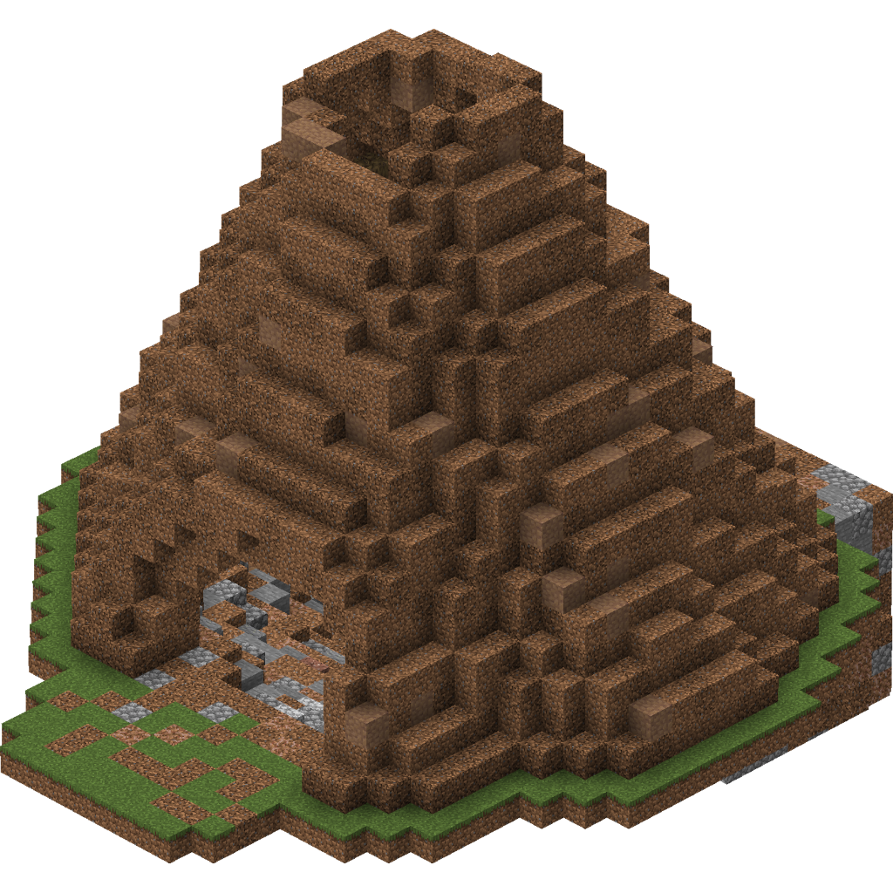
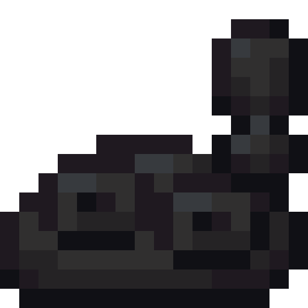
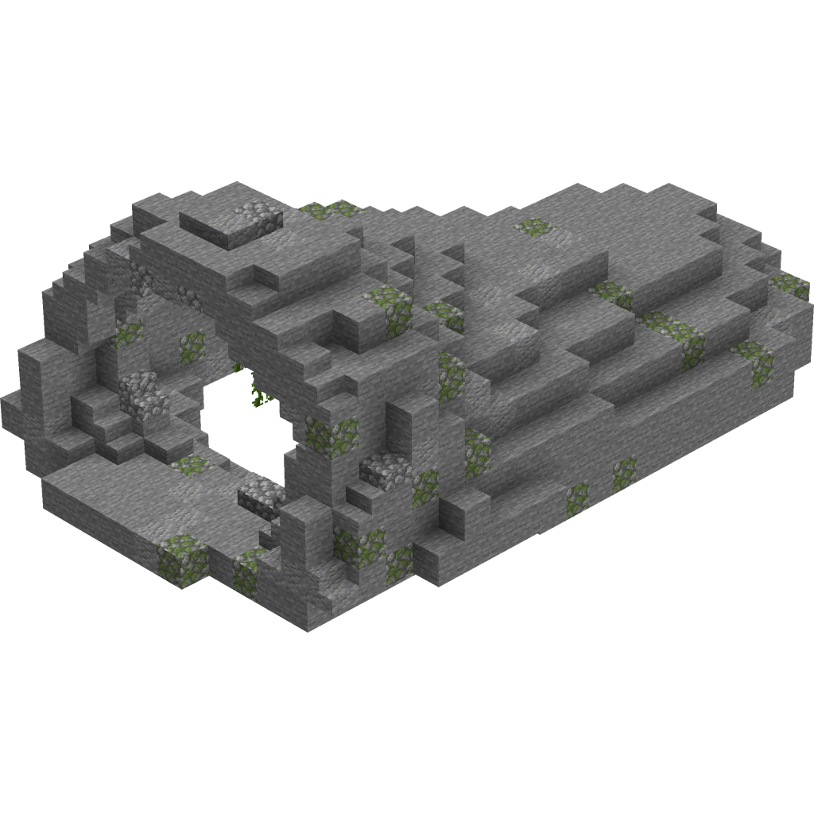
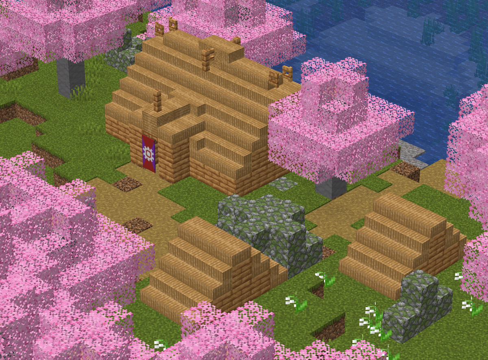
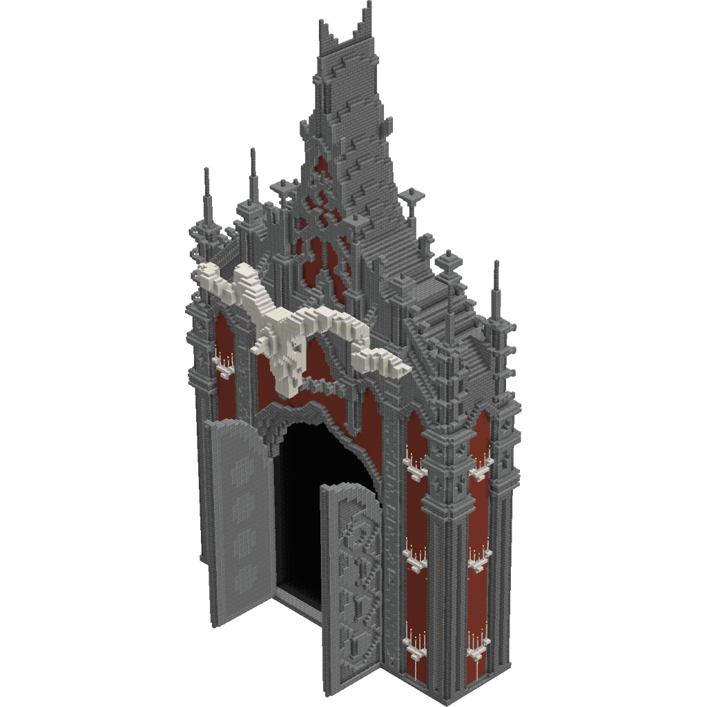
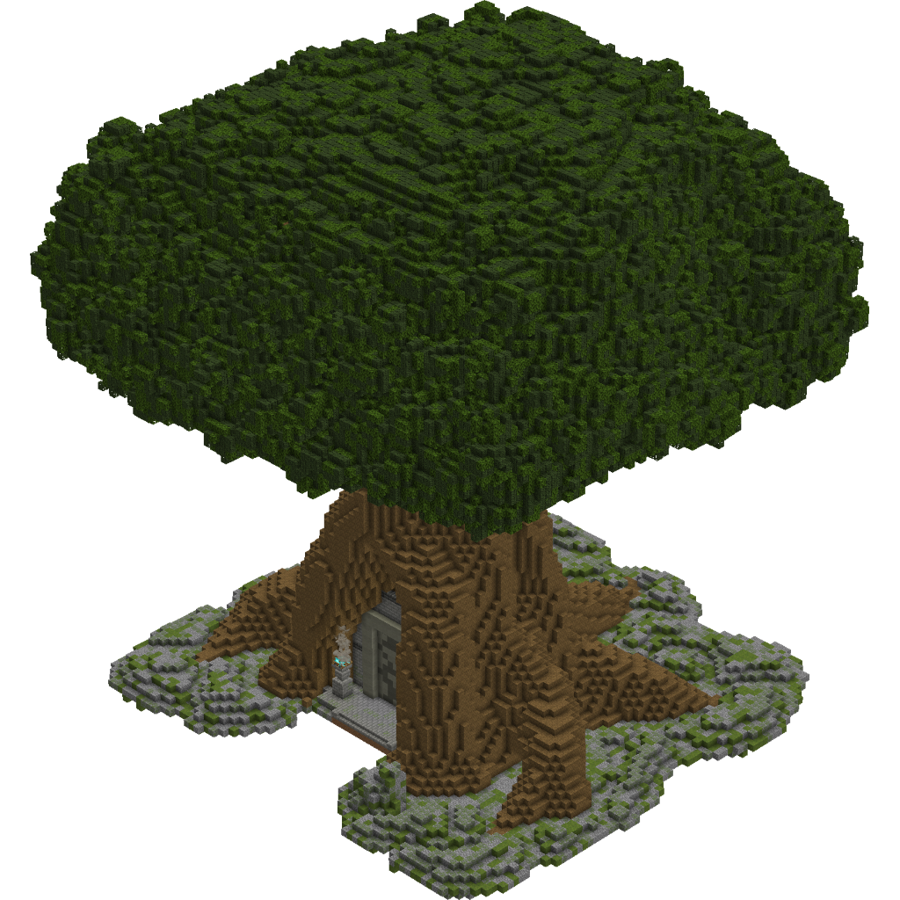
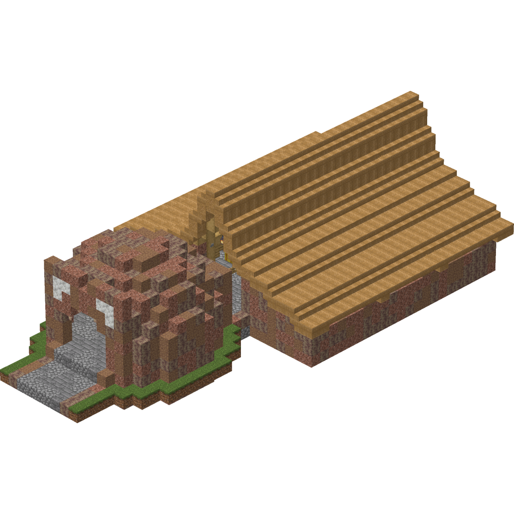
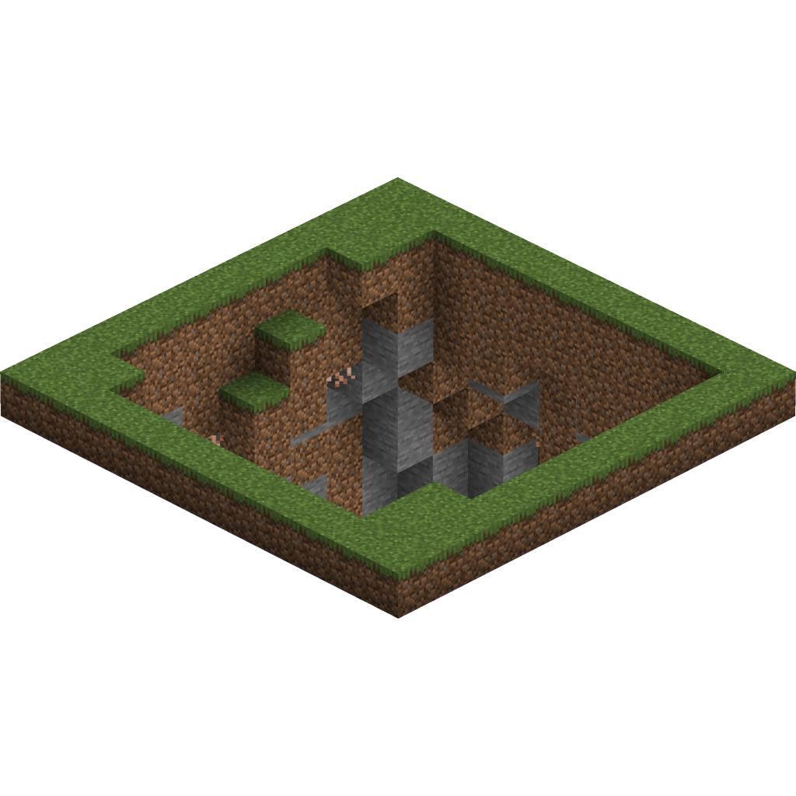

<section class="reference-directory" data-reference-directory="structures">
<header class="reference-directory-hero reference-theme-world">

Tensura reference collection

<h1>Structures</h1>

Documented structures and generation information.

<strong>12</strong> articles
<a class="reference-directory-overview-link" href="structures/">Read collection overview →</a>

</header>

<label class="reference-filter-label">
Filter this collection
<input type="search" class="reference-filter-input" placeholder="Search titles and summaries…" autocomplete="off">
</label>

<button type="button" class="is-active" data-letter="all" aria-pressed="true">All</button>
<button type="button" data-letter="A" aria-pressed="false">A</button>
<button type="button" data-letter="B" aria-pressed="false">B</button>
<button type="button" data-letter="C" aria-pressed="false">C</button>
<button type="button" data-letter="D" aria-pressed="false">D</button>
<button type="button" data-letter="G" aria-pressed="false">G</button>
<button type="button" data-letter="H" aria-pressed="false">H</button>
<button type="button" data-letter="L" aria-pressed="false">L</button>
<button type="button" data-letter="R" aria-pressed="false">R</button>
<button type="button" data-letter="S" aria-pressed="false">S</button>
<button type="button" data-letter="W" aria-pressed="false">W</button>

Showing 12 of 12 articles

<article class="reference-card" data-letter="A" data-search="ant nest upstream reference information for ant nest.">
<a href="structures-ant-nest/" aria-label="Open Ant Nest">
<figure class="reference-card-media reference-card-media--source">

<figcaption>Source media</figcaption>
</figure>

<h2>Ant Nest</h2>

Upstream reference information for Ant Nest.

Open reference →

</a>
</article>
<article class="reference-card" data-letter="B" data-search="big ruins common structure that spawns in the hell dimension, can have buried treasures and | suspicious sand nearby">
<a href="structures-big-ruins/" aria-label="Open Big Ruins">
<figure class="reference-card-media reference-card-media--source">

<figcaption>Source media</figcaption>
</figure>

<h2>Big Ruins</h2>

Common structure that spawns in the hell dimension, can have buried treasures and | Suspicious Sand nearby

Open reference →

</a>
</article>
<article class="reference-card" data-letter="C" data-search="charybdis cave a rare structure able to spawn in many biomes across the overworld.">
<a href="structures-charybdis-cave/" aria-label="Open Charybdis Cave">
<figure class="reference-card-media reference-card-media--source">

<figcaption>Source media</figcaption>
</figure>

<h2>Charybdis Cave</h2>

A rare structure able to spawn in many biomes across the overworld.

Open reference →

</a>
</article>
<article class="reference-card" data-letter="D" data-search="dwarf village training ground = battlewill master">
<a href="structures-dwarf-village/" aria-label="Open Dwarf Village">
<figure class="reference-card-media reference-card-media--source">

<figcaption>Source media</figcaption>
</figure>

<h2>Dwarf Village</h2>

Training Ground = Battlewill Master

Open reference →

</a>
</article>
<article class="reference-card" data-letter="G" data-search="goblin village inside the chief house there is a chest, in which the short sword schematic can be found with a 25% chance.">
<a href="structures-goblin-village/" aria-label="Open Goblin Village">
<figure class="reference-card-media reference-card-media--source">

<figcaption>Source media</figcaption>
</figure>

<h2>Goblin Village</h2>

Inside the chief house there is a chest, in which the Short Sword Schematic can be found with a 25% chance.

Open reference →

</a>
</article>
<article class="reference-card" data-letter="H" data-search="hell gate a rare structure able to spawn in many biomes across the overworld as well as in the hell dimension.">
<a href="structures-hell-gate/" aria-label="Open Hell Gate">
<figure class="reference-card-media reference-card-media--source">

<figcaption>Source media</figcaption>
</figure>

<h2>Hell Gate</h2>

A rare structure able to spawn in many biomes across the overworld as well as in the hell dimension.

Open reference →

</a>
</article>
<article class="reference-card" data-letter="L" data-search="labyrinth tree the labyrinth tree is used to enter the labyrinth">
<a href="structures-labyrinth-tree/" aria-label="Open Labyrinth Tree">
<figure class="reference-card-media reference-card-media--source">

<figcaption>Source media</figcaption>
</figure>

<h2>Labyrinth Tree</h2>

The labyrinth tree is used to enter the Labyrinth

Open reference →

</a>
</article>
<article class="reference-card" data-letter="L" data-search="lizardman village sometimes these structures have a blacksmith, whose barrel has a 50% for the spear schematic .">
<a href="structures-lizardman-village/" aria-label="Open Lizardman Village">
<figure class="reference-card-media reference-card-media--source">

<figcaption>Source media</figcaption>
</figure>

<h2>Lizardman Village</h2>

Sometimes these structures have a blacksmith, whose barrel has a 50% for the Spear Schematic .

Open reference →

</a>
</article>
<article class="reference-card" data-letter="R" data-search="ruins common structure that spawns in the hell dimension, can have | suspicious sand or | suspicious gravel nearby">
<a href="ruins/" aria-label="Open Ruins">
<figure class="reference-card-media reference-card-media--source">

<figcaption>Source media</figcaption>
</figure>

<h2>Ruins</h2>

Common structure that spawns in the hell dimension, can have | Suspicious Sand or | Suspicious Gravel nearby

Open reference →

</a>
</article>
<article class="reference-card" data-letter="S" data-search="spider nest inside are chests which can contain sticky cobweb , steel cobweb all spider bow variants, web gun schematic , and spider egg , among other loot.">
<a href="structures-spider-nest/" aria-label="Open Spider Nest">
<figure class="reference-card-media reference-card-media--source">

<figcaption>Source media</figcaption>
</figure>

<h2>Spider Nest</h2>

Inside are chests which can contain Sticky Cobweb , Steel Cobweb all Spider Bow variants, Web Gun Schematic , and Spider Egg , among other loot.

Open reference →

</a>
</article>
<article class="reference-card" data-letter="S" data-search="structures/ruins common structure that spawns in the hell dimension, can have | suspicious sand or | suspicious gravel nearby">
<a href="structures-ruins/" aria-label="Open Structures/Ruins">
<figure class="reference-card-media reference-card-media--source">

<figcaption>Source media</figcaption>
</figure>

<h2>Structures/Ruins</h2>

Common structure that spawns in the hell dimension, can have | Suspicious Sand or | Suspicious Gravel nearby

Open reference →

</a>
</article>
<article class="reference-card" data-letter="W" data-search="wizard tower a rare structure able to spawn in many biomes across the overworld, contains magic tomes of different elements depending on the biome.">
<a href="structures-wizard-tower/" aria-label="Open Wizard Tower">
<figure class="reference-card-media reference-card-media--theme">

<figcaption>TSR artwork</figcaption>
</figure>

<h2>Wizard Tower</h2>

A rare structure able to spawn in many biomes across the overworld, contains magic tomes of different elements depending on the biome.

Open reference →

</a>
</article>

No matching articles. Try a broader search.

</section>
