<section class="reference-directory" data-reference-directory="structures">
<header class="reference-directory-hero reference-theme-world">

Tensura reference collection

<h1>Structures</h1>

Documented structures and generation information.

<strong>22</strong> articles

</header>

<label class="reference-filter-label">
Filter this collection
<input type="search" class="reference-filter-input" placeholder="Search titles and summaries…" autocomplete="off">
</label>

<button type="button" class="is-active" data-letter="all" aria-pressed="true">All</button>
<button type="button" data-letter="A" aria-pressed="false">A</button>
<button type="button" data-letter="B" aria-pressed="false">B</button>
<button type="button" data-letter="C" aria-pressed="false">C</button>
<button type="button" data-letter="D" aria-pressed="false">D</button>
<button type="button" data-letter="E" aria-pressed="false">E</button>
<button type="button" data-letter="G" aria-pressed="false">G</button>
<button type="button" data-letter="H" aria-pressed="false">H</button>
<button type="button" data-letter="L" aria-pressed="false">L</button>
<button type="button" data-letter="N" aria-pressed="false">N</button>
<button type="button" data-letter="O" aria-pressed="false">O</button>
<button type="button" data-letter="R" aria-pressed="false">R</button>
<button type="button" data-letter="S" aria-pressed="false">S</button>
<button type="button" data-letter="W" aria-pressed="false">W</button>

Showing 22 of 22 articles

<article class="reference-card" data-letter="A" data-search="ant nest a savanna and forest nest populated by giant ants, with branching chambers beneath the surface.">
<a href="structures-ant-nest/" aria-label="Open Ant Nest">
<figure class="reference-card-media reference-card-media--source">

<figcaption>Source media</figcaption>
</figure>

<h2>Ant Nest</h2>

A savanna and forest nest populated by Giant Ants, with branching chambers beneath the surface.

<dl class="reference-card-stats"><dt>Biomes</dt><dd>SavannahForestBirch Forest</dd><dt>Mobs</dt><dd>Giant Ant</dd></dl><small class="reference-card-source-note">Upstream reference values; server settings may differ.</small>
Open reference →

</a>
</article>
<article class="reference-card" data-letter="B" data-search="beast kingdom of eurazania a large boss structure landmark registered for deserts and the three vanilla badlands biomes.">
<a href="beast-kingdom-of-eurazania/" aria-label="Open Beast Kingdom of Eurazania">
<figure class="reference-card-media reference-card-media--theme">
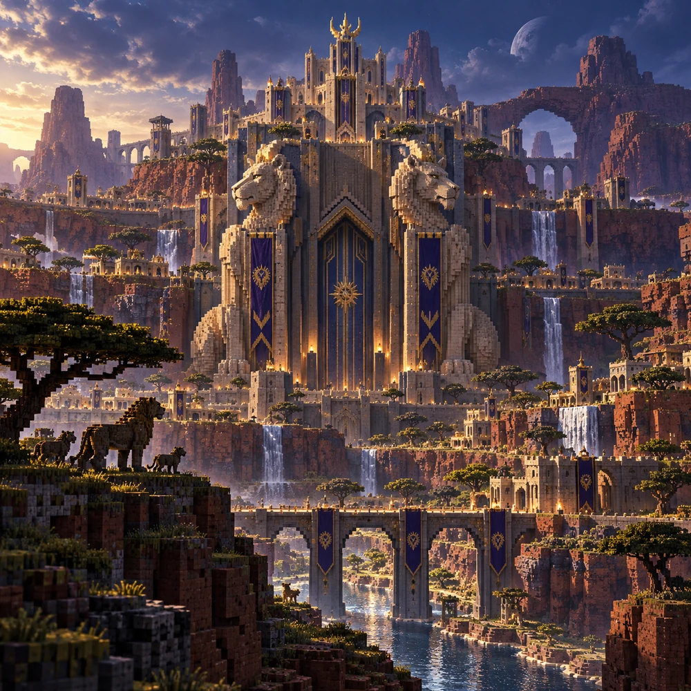
<figcaption>TSR artwork</figcaption>
</figure>

<h2>Beast Kingdom of Eurazania</h2>

A large Boss Structure landmark registered for deserts and the three vanilla badlands biomes.

<dl class="reference-card-stats"><dt>Source</dt><dd>Tensura Boss Structure 1.0.3.3</dd><dt>Spacing</dt><dd>200 chunks</dd><dt>Biomes</dt><dd>Desertbadlandseroded badlandswooded badlands</dd></dl><small class="reference-card-source-note">Tensura Boss Structure 1.0.3.3 artifact; server terrain may differ.</small>
Open reference →

</a>
</article>
<article class="reference-card" data-letter="B" data-search="big ruins a red-sand underworld ruin with buried treasure pockets, suspicious sand, and hostile hound dog and megalodon spawns.">
<a href="structures-big-ruins/" aria-label="Open Big Ruins">
<figure class="reference-card-media reference-card-media--theme">
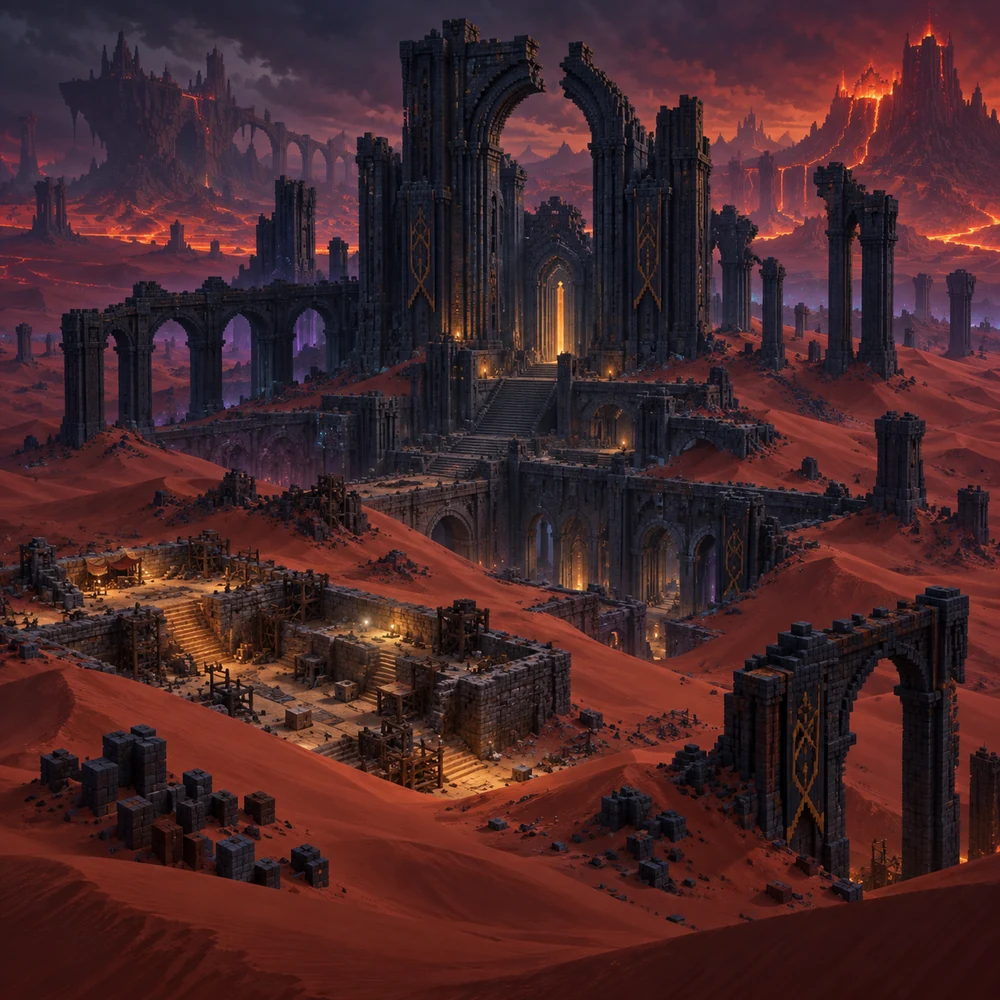
<figcaption>TSR artwork</figcaption>
</figure>

<h2>Big Ruins</h2>

A red-sand Underworld ruin with buried treasure pockets, suspicious sand, and hostile Hound Dog and Megalodon spawns.

<dl class="reference-card-stats"><dt>Biomes</dt><dd>Underworld Red SandsUnderworld Sands</dd><dt>Mobs</dt><dd>Hound DogMegalodon</dd></dl><small class="reference-card-source-note">Upstream reference values; server settings may differ.</small>
Open reference →

</a>
</article>
<article class="reference-card" data-letter="C" data-search="charybdis cave a rare overworld cave where a charybdis encounter can be summoned through its core.">
<a href="structures-charybdis-cave/" aria-label="Open Charybdis Cave">
<figure class="reference-card-media reference-card-media--source">

<figcaption>Source media</figcaption>
</figure>

<h2>Charybdis Cave</h2>

A rare Overworld cave where a Charybdis encounter can be summoned through its core.

<dl class="reference-card-stats"><dt>Biomes</dt><dd>PlainsSnowy PlainsSunflower PlainsMeadowDesertBadlandsForestsJunglesTaigasSavannahs</dd><dt>Mobs</dt><dd>Charybdis * Summoned through core</dd></dl><small class="reference-card-source-note">Upstream reference values; server settings may differ.</small>
Open reference →

</a>
</article>
<article class="reference-card" data-letter="D" data-search="dark elemental portal mysticism&#x27;s registered large dark portal structure for biomes tagged with the dark element.">
<a href="dark-elemental-portal/" aria-label="Open Dark Elemental Portal">
<figure class="reference-card-media reference-card-media--theme">
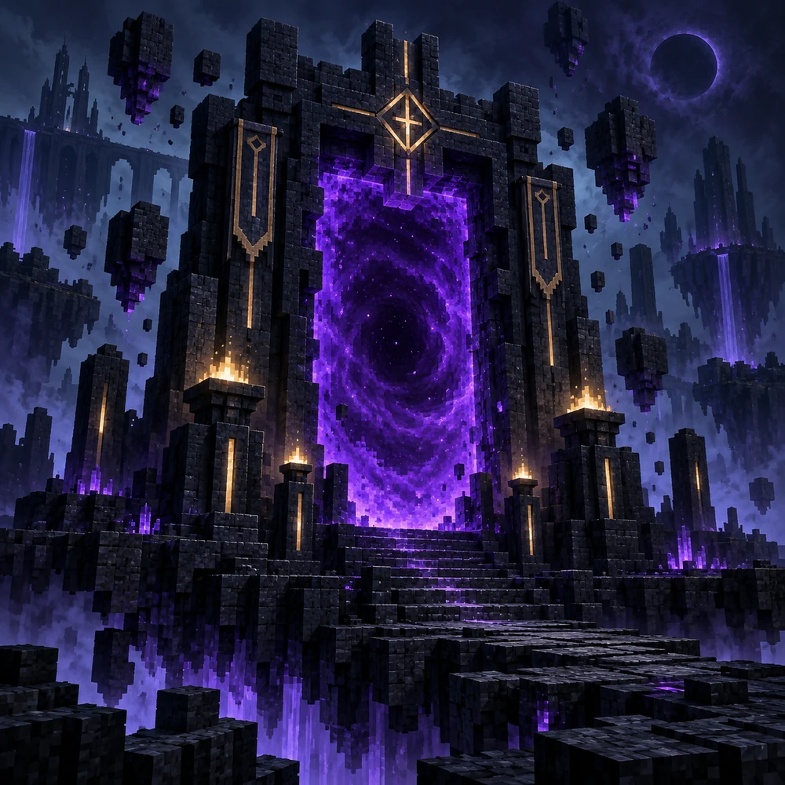
<figcaption>TSR artwork</figcaption>
</figure>

<h2>Dark Elemental Portal</h2>

Mysticism&#x27;s registered large dark portal structure for biomes tagged with the dark element.

<dl class="reference-card-stats"><dt>Source</dt><dd>TR Mysticism 2.1.2</dd><dt>Spacing</dt><dd>200 chunks</dd><dt>Biomes</dt><dd>Mysticism dark-element biomes</dd></dl><small class="reference-card-source-note">TR Mysticism 2.1.2 artifact; server terrain may differ.</small>
Open reference →

</a>
</article>
<article class="reference-card" data-letter="D" data-search="dwarf village a mountain settlement where dwarves live and the training ground houses a battlewill master.">
<a href="structures-dwarf-village/" aria-label="Open Dwarf Village">
<figure class="reference-card-media reference-card-media--theme">
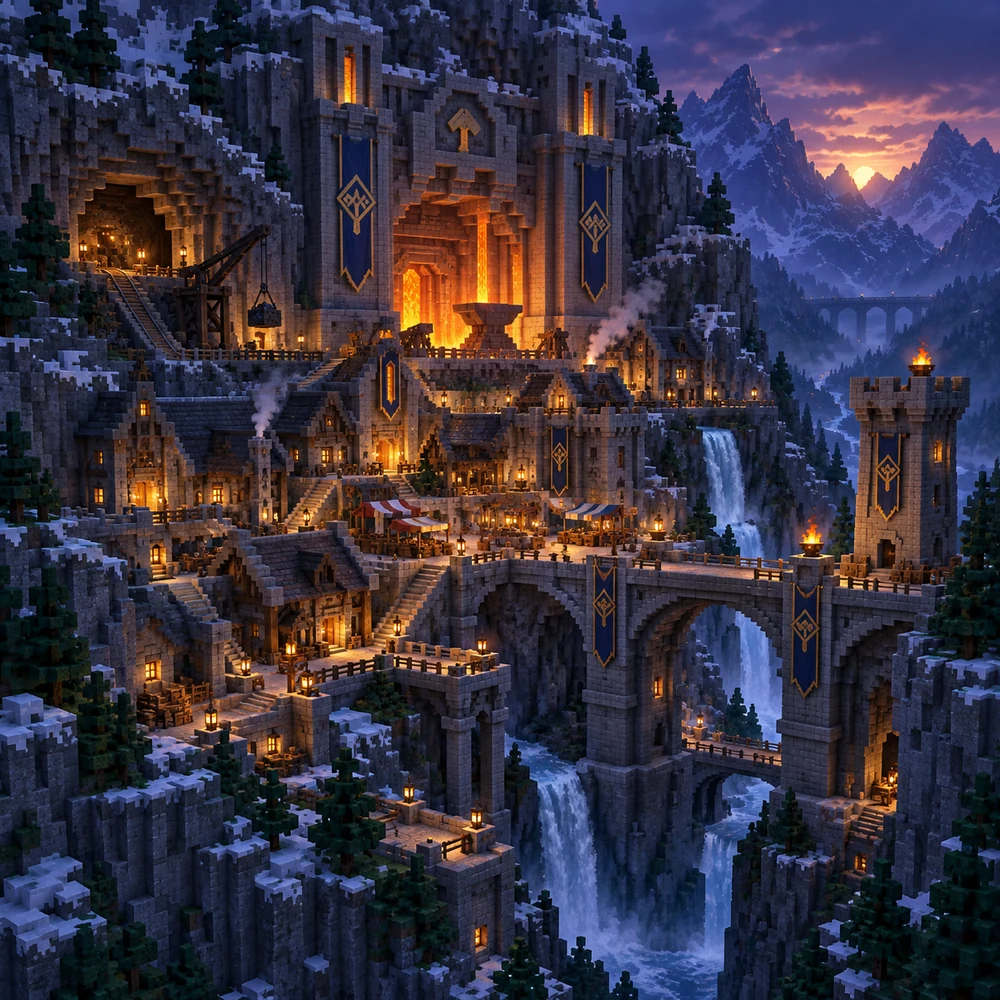
<figcaption>TSR artwork</figcaption>
</figure>

<h2>Dwarf Village</h2>

A mountain settlement where Dwarves live and the Training Ground houses a Battlewill Master.

<dl class="reference-card-stats"><dt>Biomes</dt><dd>Mountain biomes likeMeadowsGrovesPlateausetc</dd><dt>Mobs</dt><dd>Dwarf</dd></dl><small class="reference-card-source-note">Upstream reference values; server settings may differ.</small>
Open reference →

</a>
</article>
<article class="reference-card" data-letter="E" data-search="earth elemental portal mysticism&#x27;s registered earth portal structure for biomes tagged with the earth element.">
<a href="earth-elemental-portal/" aria-label="Open Earth Elemental Portal">
<figure class="reference-card-media reference-card-media--theme">
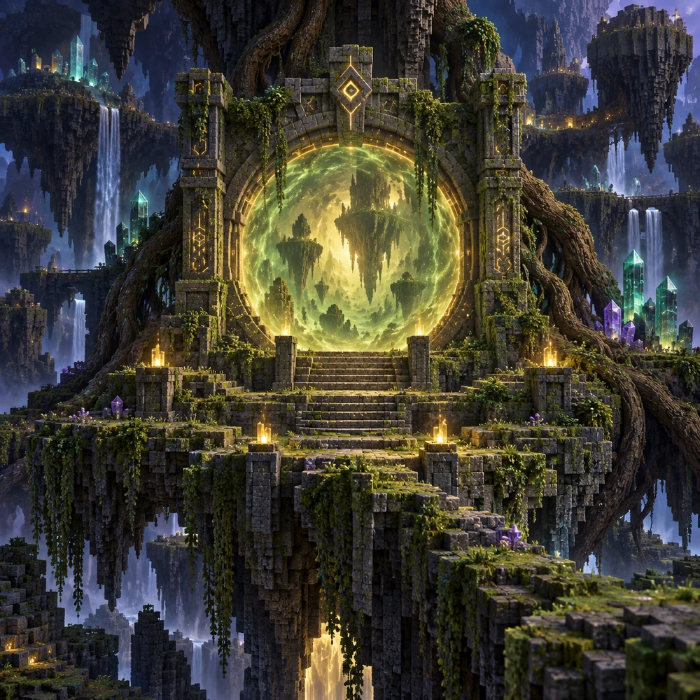
<figcaption>TSR artwork</figcaption>
</figure>

<h2>Earth Elemental Portal</h2>

Mysticism&#x27;s registered earth portal structure for biomes tagged with the earth element.

<dl class="reference-card-stats"><dt>Source</dt><dd>TR Mysticism 2.1.2</dd><dt>Spacing</dt><dd>200 chunks</dd><dt>Biomes</dt><dd>Mysticism earth-element biomes</dd></dl><small class="reference-card-source-note">TR Mysticism 2.1.2 artifact; server terrain may differ.</small>
Open reference →

</a>
</article>
<article class="reference-card" data-letter="G" data-search="goblin village a forest settlement populated by goblins, with a chief house that can contain the short sword schematic.">
<a href="structures-goblin-village/" aria-label="Open Goblin Village">
<figure class="reference-card-media reference-card-media--source">

<figcaption>Source media</figcaption>
</figure>

<h2>Goblin Village</h2>

A forest settlement populated by Goblins, with a chief house that can contain the Short Sword Schematic.

<dl class="reference-card-stats"><dt>Biomes</dt><dd>Sakura ForestTaigaForestBirch Forest</dd><dt>Mobs</dt><dd>Goblin</dd></dl><small class="reference-card-source-note">Upstream reference values; server settings may differ.</small>
Open reference →

</a>
</article>
<article class="reference-card" data-letter="H" data-search="hell gate a rare gate that can appear in several overworld biomes and the underworld, guarded by hostile local creatures.">
<a href="structures-hell-gate/" aria-label="Open Hell Gate">
<figure class="reference-card-media reference-card-media--source">

<figcaption>Source media</figcaption>
</figure>

<h2>Hell Gate</h2>

A rare gate that can appear in several Overworld biomes and the Underworld, guarded by hostile local creatures.

<dl class="reference-card-stats"><dt>Biomes</dt><dd>PlainsSnowy PlainsSunflower PlainsMeadowDesertBadlandsSavannahHell</dd><dt>Mobs</dt><dd>Hound DogMegalodon</dd></dl><small class="reference-card-source-note">Upstream reference values; server settings may differ.</small>
Open reference →

</a>
</article>
<article class="reference-card" data-letter="H" data-search="hinata church a fortified church landmark registered across temperate plains, forests, taiga, and meadow terrain.">
<a href="hinata-church/" aria-label="Open Hinata Church">
<figure class="reference-card-media reference-card-media--theme">
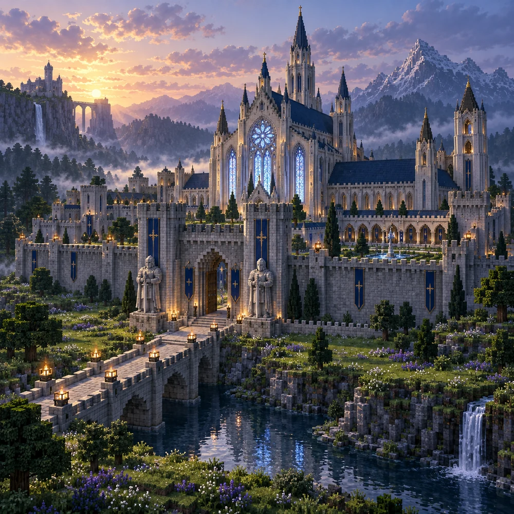
<figcaption>TSR artwork</figcaption>
</figure>

<h2>Hinata Church</h2>

A fortified church landmark registered across temperate plains, forests, taiga, and meadow terrain.

<dl class="reference-card-stats"><dt>Source</dt><dd>Tensura Boss Structure 1.0.3.3</dd><dt>Spacing</dt><dd>200 chunks</dd><dt>Biomes</dt><dd>Plainsforeststaigameadow</dd></dl><small class="reference-card-source-note">Tensura Boss Structure 1.0.3.3 artifact; server terrain may differ.</small>
Open reference →

</a>
</article>
<article class="reference-card" data-letter="L" data-search="labyrinth tree an ancient forest landmark that serves as the entrance to the labyrinth and houses an elemental colossus.">
<a href="structures-labyrinth-tree/" aria-label="Open Labyrinth Tree">
<figure class="reference-card-media reference-card-media--source">

<figcaption>Source media</figcaption>
</figure>

<h2>Labyrinth Tree</h2>

An Ancient Forest landmark that serves as the entrance to the Labyrinth and houses an Elemental Colossus.

<dl class="reference-card-stats"><dt>Biomes</dt><dd>Ancient Forest</dd><dt>Mobs</dt><dd>Elemental Colossus</dd></dl><small class="reference-card-source-note">Upstream reference values; server settings may differ.</small>
Open reference →

</a>
</article>
<article class="reference-card" data-letter="L" data-search="lizardman village a swamp settlement populated by lizardmen and hover lizards, with a blacksmith that can hold a spear schematic.">
<a href="structures-lizardman-village/" aria-label="Open Lizardman Village">
<figure class="reference-card-media reference-card-media--source">

<figcaption>Source media</figcaption>
</figure>

<h2>Lizardman Village</h2>

A swamp settlement populated by Lizardmen and Hover Lizards, with a blacksmith that can hold a Spear Schematic.

<dl class="reference-card-stats"><dt>Biomes</dt><dd>SwampMangrove Swamp</dd><dt>Mobs</dt><dd>LizardmanHover Lizard</dd></dl><small class="reference-card-source-note">Upstream reference values; server settings may differ.</small>
Open reference →

</a>
</article>
<article class="reference-card" data-letter="N" data-search="night rose a moonlit manor landmark registered across broad temperate, savanna, and windswept terrain.">
<a href="night-rose/" aria-label="Open Night Rose">
<figure class="reference-card-media reference-card-media--theme">
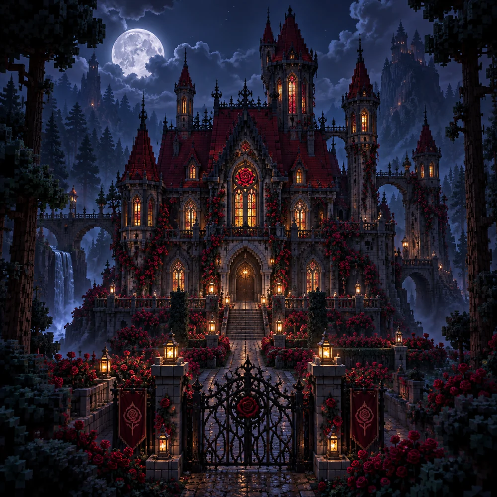
<figcaption>TSR artwork</figcaption>
</figure>

<h2>Night Rose</h2>

A moonlit manor landmark registered across broad temperate, savanna, and windswept terrain.

<dl class="reference-card-stats"><dt>Source</dt><dd>Tensura Boss Structure 1.0.3.3</dd><dt>Spacing</dt><dd>200 chunks</dd><dt>Biomes</dt><dd>Plainsforeststaigameadowsavannawindswept hills</dd></dl><small class="reference-card-source-note">Tensura Boss Structure 1.0.3.3 artifact; server terrain may differ.</small>
Open reference →

</a>
</article>
<article class="reference-card" data-letter="O" data-search="orc disaster temple a desert temple landmark registered by the pinned tensura boss structure add-on.">
<a href="orc-disaster-temple/" aria-label="Open Orc Disaster Temple">
<figure class="reference-card-media reference-card-media--theme">
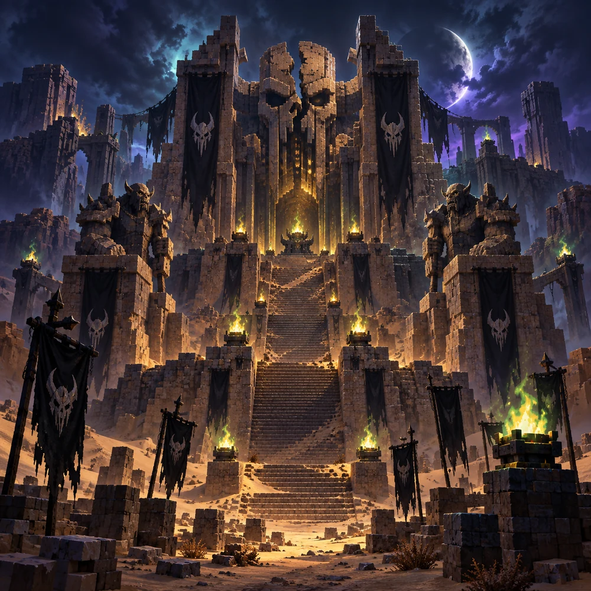
<figcaption>TSR artwork</figcaption>
</figure>

<h2>Orc Disaster Temple</h2>

A desert temple landmark registered by the pinned Tensura Boss Structure add-on.

<dl class="reference-card-stats"><dt>Source</dt><dd>Tensura Boss Structure 1.0.3.3</dd><dt>Spacing</dt><dd>200 chunks</dd><dt>Biomes</dt><dd>Desert</dd></dl><small class="reference-card-source-note">Tensura Boss Structure 1.0.3.3 artifact; server terrain may differ.</small>
Open reference →

</a>
</article>
<article class="reference-card" data-letter="O" data-search="orc village a fortified desert settlement registered by the pinned tensura build, with its own random-spread placement set.">
<a href="orc-village/" aria-label="Open Orc Village">
<figure class="reference-card-media reference-card-media--theme">
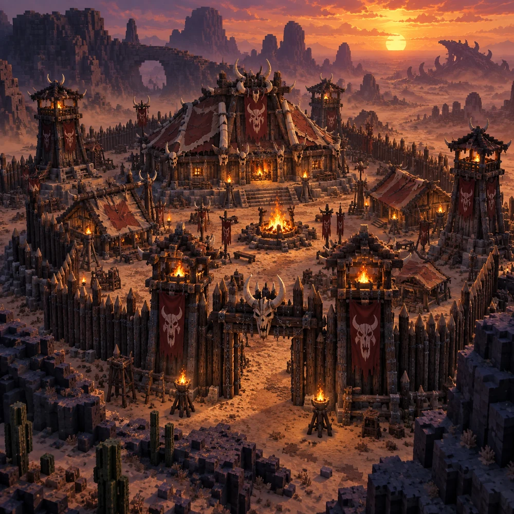
<figcaption>TSR artwork</figcaption>
</figure>

<h2>Orc Village</h2>

A fortified desert settlement registered by the pinned Tensura build, with its own random-spread placement set.

<dl class="reference-card-stats"><dt>Source</dt><dd>Tensura: Reincarnated 2.0.1.2</dd><dt>Spacing</dt><dd>40 chunks</dd><dt>Biomes</dt><dd>Desertsdesert villages</dd></dl><small class="reference-card-source-note">Tensura: Reincarnated 2.0.1.2 artifact; server terrain may differ.</small>
Open reference →

</a>
</article>
<article class="reference-card" data-letter="R" data-search="rimuru ogre fight a forest arena landmark registered across plains, forests, taiga, meadow, cherry, and light-jungle terrain.">
<a href="rimuru-ogre-fight/" aria-label="Open Rimuru Ogre Fight">
<figure class="reference-card-media reference-card-media--theme">
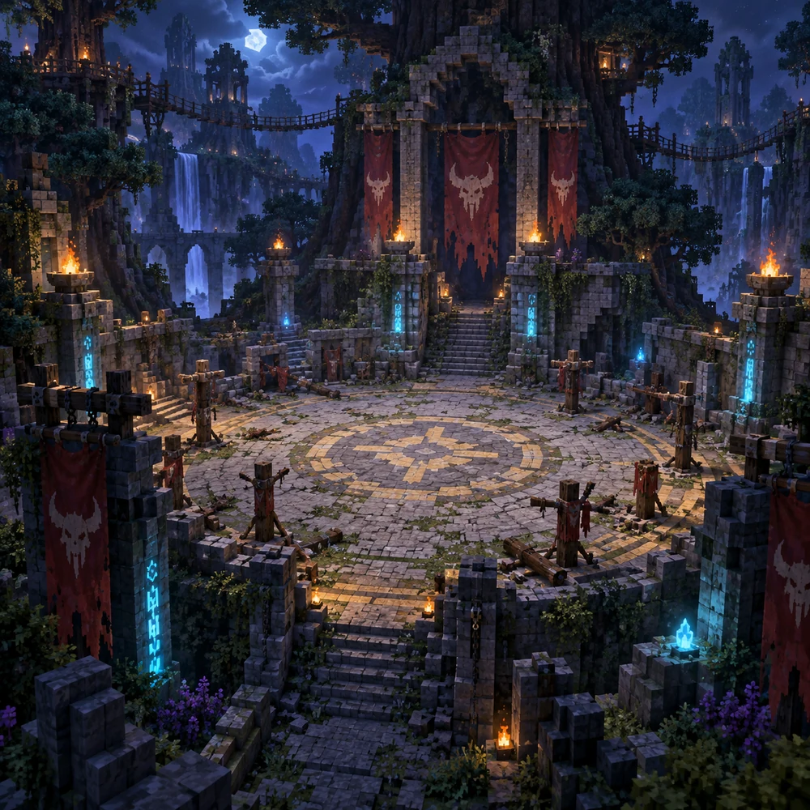
<figcaption>TSR artwork</figcaption>
</figure>

<h2>Rimuru Ogre Fight</h2>

A forest arena landmark registered across plains, forests, taiga, meadow, cherry, and light-jungle terrain.

<dl class="reference-card-stats"><dt>Source</dt><dd>Tensura Boss Structure 1.0.3.3</dd><dt>Spacing</dt><dd>200 chunks</dd><dt>Biomes</dt><dd>Plainsforeststaigameadowcherry grovebamboo jungle</dd></dl><small class="reference-card-source-note">Tensura Boss Structure 1.0.3.3 artifact; server terrain may differ.</small>
Open reference →

</a>
</article>
<article class="reference-card" data-letter="R" data-search="ruins a compact underworld sands ruin with suspicious sand or gravel, explorer-map loot, and hostile local spawns.">
<a href="structures-ruins/" aria-label="Open Ruins">
<figure class="reference-card-media reference-card-media--theme">
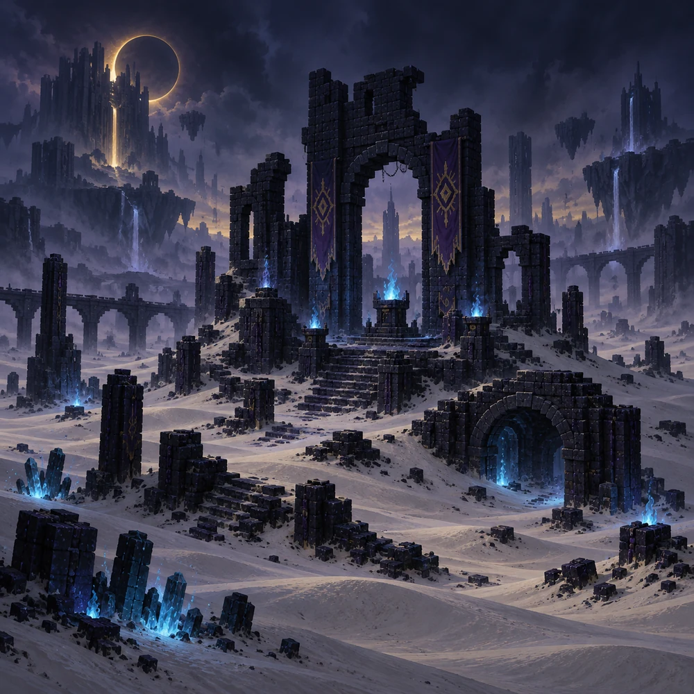
<figcaption>TSR artwork</figcaption>
</figure>

<h2>Ruins</h2>

A compact Underworld Sands ruin with suspicious sand or gravel, explorer-map loot, and hostile local spawns.

<dl class="reference-card-stats"><dt>Biomes</dt><dd>Underworld Sands</dd><dt>Mobs</dt><dd>Hound DogMegalodon</dd></dl><small class="reference-card-source-note">Upstream reference values; server settings may differ.</small>
Open reference →

</a>
</article>
<article class="reference-card" data-letter="S" data-search="shizu&#x27;s school a school landmark registered for plains and forest terrain in the pinned boss structure build.">
<a href="shizu-school/" aria-label="Open Shizu&#x27;s School">
<figure class="reference-card-media reference-card-media--theme">
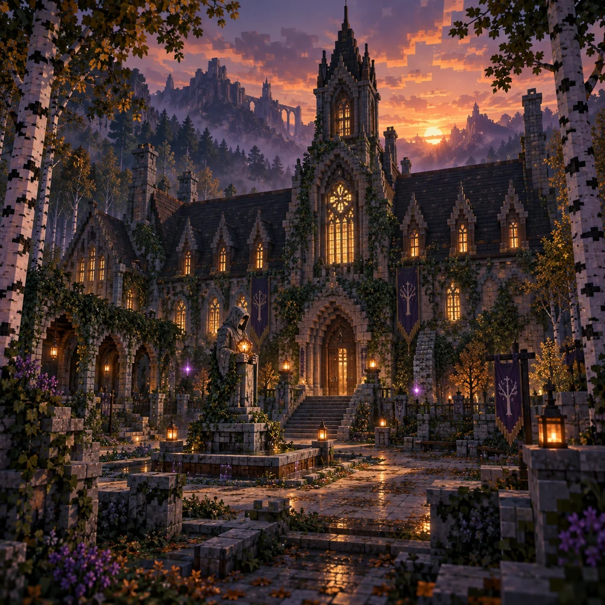
<figcaption>TSR artwork</figcaption>
</figure>

<h2>Shizu&#x27;s School</h2>

A school landmark registered for plains and forest terrain in the pinned Boss Structure build.

<dl class="reference-card-stats"><dt>Source</dt><dd>Tensura Boss Structure 1.0.3.3</dd><dt>Spacing</dt><dd>200 chunks</dd><dt>Biomes</dt><dd>Plainssunflower plainsforests</dd></dl><small class="reference-card-source-note">Tensura Boss Structure 1.0.3.3 artifact; server terrain may differ.</small>
Open reference →

</a>
</article>
<article class="reference-card" data-letter="S" data-search="spider nest a web-filled nest populated by black spiders, with chests containing web gear, bows, eggs, and other loot.">
<a href="structures-spider-nest/" aria-label="Open Spider Nest">
<figure class="reference-card-media reference-card-media--source">

<figcaption>Source media</figcaption>
</figure>

<h2>Spider Nest</h2>

A web-filled nest populated by Black Spiders, with chests containing web gear, bows, eggs, and other loot.

<dl class="reference-card-stats"><dt>Biomes</dt><dd>PlainsDark Forest</dd><dt>Mobs</dt><dd>Black Spider</dd></dl><small class="reference-card-source-note">Upstream reference values; server settings may differ.</small>
Open reference →

</a>
</article>
<article class="reference-card" data-letter="W" data-search="warp pads five equally weighted travel-pad ruins registered for plains, cold, desert, badlands, and swamp terrain.">
<a href="warp-pads/" aria-label="Open Warp Pads">
<figure class="reference-card-media reference-card-media--theme">
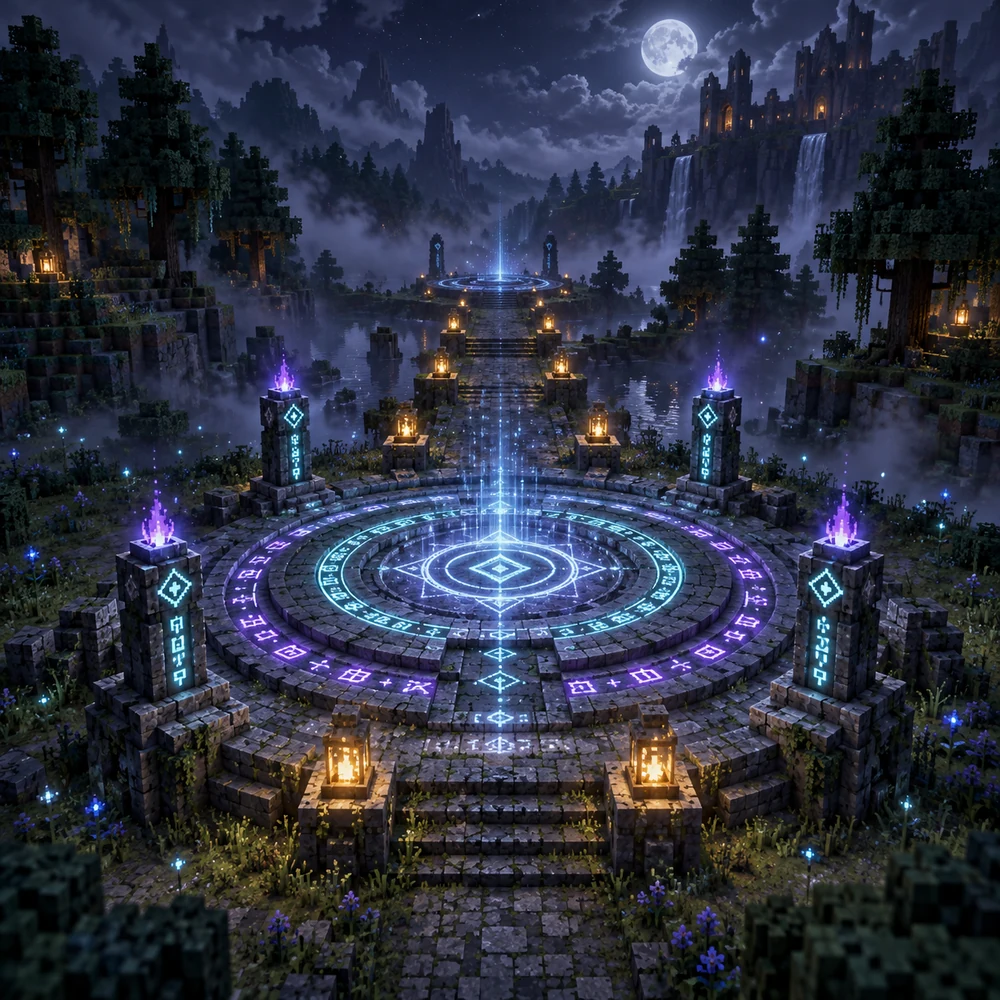
<figcaption>TSR artwork</figcaption>
</figure>

<h2>Warp Pads</h2>

Five equally weighted travel-pad ruins registered for plains, cold, desert, badlands, and swamp terrain.

<dl class="reference-card-stats"><dt>Source</dt><dd>Tensura: Reincarnated 2.0.1.2</dd><dt>Spacing</dt><dd>50 chunks</dd><dt>Biomes</dt><dd>Plainsforestscolddesertbadlandsswamps</dd><dt>Variants</dt><dd>Plains, cold, desert, mesa, swamp</dd></dl><small class="reference-card-source-note">Tensura: Reincarnated 2.0.1.2 artifact; server terrain may differ.</small>
Open reference →

</a>
</article>
<article class="reference-card" data-letter="W" data-search="wind elemental portal mysticism&#x27;s registered wind portal structure for biomes tagged with the wind element.">
<a href="wind-elemental-portal/" aria-label="Open Wind Elemental Portal">
<figure class="reference-card-media reference-card-media--theme">
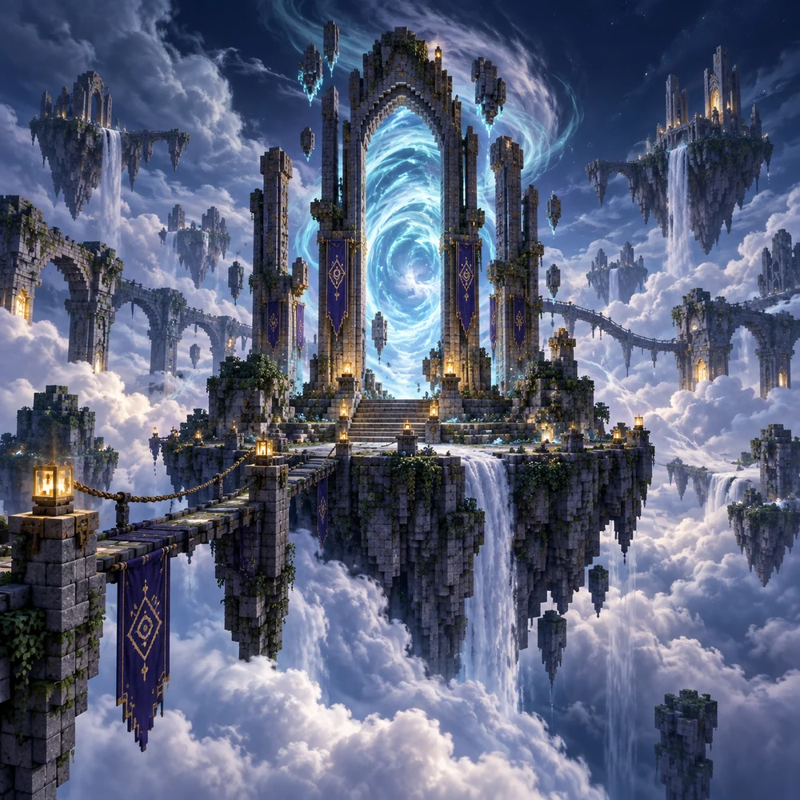
<figcaption>TSR artwork</figcaption>
</figure>

<h2>Wind Elemental Portal</h2>

Mysticism&#x27;s registered wind portal structure for biomes tagged with the wind element.

<dl class="reference-card-stats"><dt>Source</dt><dd>TR Mysticism 2.1.2</dd><dt>Spacing</dt><dd>200 chunks</dd><dt>Biomes</dt><dd>Mysticism wind-element biomes</dd></dl><small class="reference-card-source-note">TR Mysticism 2.1.2 artifact; server terrain may differ.</small>
Open reference →

</a>
</article>
<article class="reference-card" data-letter="W" data-search="wizard tower a rare elemental tower whose biome variant determines which magic tomes can be found inside.">
<a href="structures-wizard-tower/" aria-label="Open Wizard Tower">
<figure class="reference-card-media reference-card-media--theme">
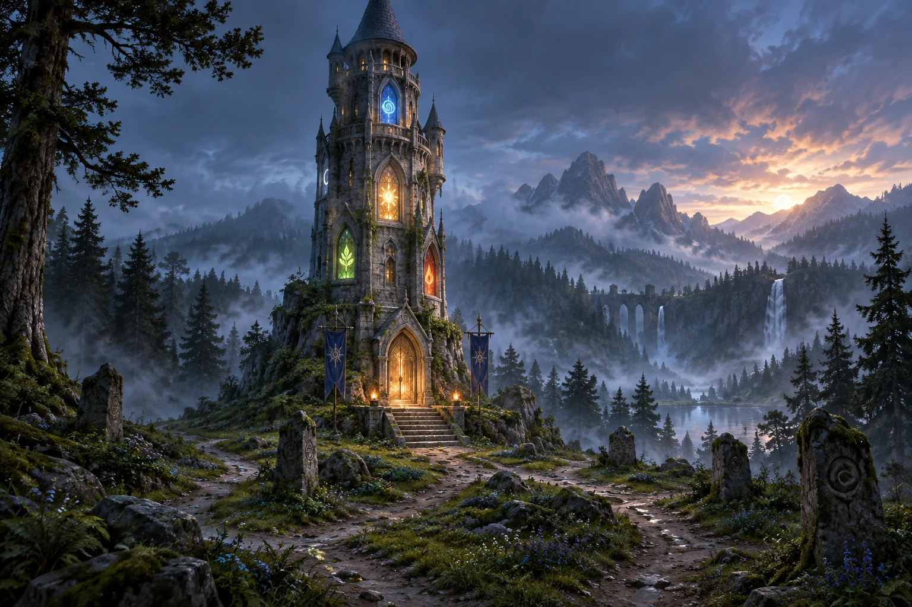
<figcaption>TSR artwork</figcaption>
</figure>

<h2>Wizard Tower</h2>

A rare elemental tower whose biome variant determines which magic tomes can be found inside.

<dl class="reference-card-stats"><dt>Biomes</dt><dd>Forestsdesertsbadlandsmiasmic plainssnowy plains</dd></dl><small class="reference-card-source-note">Upstream reference values; server settings may differ.</small>
Open reference →

</a>
</article>

No matching articles. Try a broader search.

</section>
