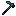
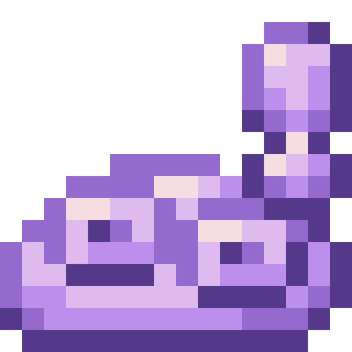
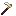
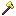
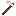
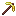
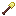

<section class="reference-directory" data-reference-directory="tools">
<header class="reference-directory-hero reference-theme-world">

Tensura reference collection

<h1>Tools</h1>

Tools and utility equipment.

<strong>30</strong> articles

</header>

<label class="reference-filter-label">
Filter this collection
<input type="search" class="reference-filter-input" placeholder="Search titles and summaries…" autocomplete="off">
</label>

<button type="button" class="is-active" data-letter="all" aria-pressed="true">All</button>
<button type="button" data-letter="A" aria-pressed="false">A</button>
<button type="button" data-letter="C" aria-pressed="false">C</button>
<button type="button" data-letter="H" aria-pressed="false">H</button>
<button type="button" data-letter="L" aria-pressed="false">L</button>
<button type="button" data-letter="M" aria-pressed="false">M</button>
<button type="button" data-letter="O" aria-pressed="false">O</button>
<button type="button" data-letter="P" aria-pressed="false">P</button>
<button type="button" data-letter="S" aria-pressed="false">S</button>

Showing 30 of 30 articles

<article class="reference-card" data-letter="A" data-search="adamantite axe obtainable through killing mobs while having pure magisteel axe in your offhand or equipped">
<a href="adamantite-axe/" aria-label="Open Adamantite Axe">
<figure class="reference-card-media reference-card-media--source">

<figcaption>Source media</figcaption>
</figure>

<h2>Adamantite Axe</h2>

Obtainable through killing mobs while having Pure Magisteel Axe in your offhand or equipped

Open reference →

</a>
</article>
<article class="reference-card" data-letter="A" data-search="adamantite hoe obtainable through killing mobs while having pure magisteel hoe in your offhand or equipped">
<a href="adamantite-hoe/" aria-label="Open Adamantite Hoe">
<figure class="reference-card-media reference-card-media--source">

<figcaption>Source media</figcaption>
</figure>

<h2>Adamantite Hoe</h2>

Obtainable through killing mobs while having Pure Magisteel Hoe in your offhand or equipped

Open reference →

</a>
</article>
<article class="reference-card" data-letter="A" data-search="adamantite pickaxe obtainable through killing mobs while having pure magisteel pickaxe in your offhand or equipped">
<a href="adamantite-pickaxe/" aria-label="Open Adamantite Pickaxe">
<figure class="reference-card-media reference-card-media--source">

<figcaption>Source media</figcaption>
</figure>

<h2>Adamantite Pickaxe</h2>

Obtainable through killing mobs while having Pure Magisteel Pickaxe in your offhand or equipped

Open reference →

</a>
</article>
<article class="reference-card" data-letter="A" data-search="adamantite shovel obtainable through killing mobs while having pure magisteel shovel in your offhand or equipped">
<a href="adamantite-shovel/" aria-label="Open Adamantite Shovel">
<figure class="reference-card-media reference-card-media--source">

<figcaption>Source media</figcaption>
</figure>

<h2>Adamantite Shovel</h2>

Obtainable through killing mobs while having Pure Magisteel Shovel in your offhand or equipped

Open reference →

</a>
</article>
<article class="reference-card" data-letter="C" data-search="caster tools tutorial caster tools include grimoires and staffs, storing spells and enabling their use through the tool.">
<a href="caster-tools-tutorial/" aria-label="Open Caster Tools Tutorial">
<figure class="reference-card-media reference-card-media--source">

<figcaption>Source media</figcaption>
</figure>

<h2>Caster Tools Tutorial</h2>

Caster Tools include grimoires and staffs, storing spells and enabling their use through the tool.

Open reference →

</a>
</article>
<article class="reference-card" data-letter="H" data-search="high magisteel axe obtainable through killing mobs while having low magisteel axe in your offhand or equipped">
<a href="high-magisteel-axe/" aria-label="Open High Magisteel Axe">
<figure class="reference-card-media reference-card-media--source">

<figcaption>Source media</figcaption>
</figure>

<h2>High Magisteel Axe</h2>

Obtainable through killing mobs while having Low Magisteel Axe in your offhand or equipped

Open reference →

</a>
</article>
<article class="reference-card" data-letter="H" data-search="high magisteel hoe obtainable through killing mobs while having low magisteel hoe in your offhand or equipped">
<a href="high-magisteel-hoe/" aria-label="Open High Magisteel Hoe">
<figure class="reference-card-media reference-card-media--source">

<figcaption>Source media</figcaption>
</figure>

<h2>High Magisteel Hoe</h2>

Obtainable through killing mobs while having Low Magisteel Hoe in your offhand or equipped

Open reference →

</a>
</article>
<article class="reference-card" data-letter="H" data-search="high magisteel pickaxe obtainable through killing mobs while having low magisteel pickaxe in your offhand or equipped">
<a href="high-magisteel-pickaxe/" aria-label="Open High Magisteel Pickaxe">
<figure class="reference-card-media reference-card-media--source">

<figcaption>Source media</figcaption>
</figure>

<h2>High Magisteel Pickaxe</h2>

Obtainable through killing mobs while having Low Magisteel Pickaxe in your offhand or equipped

Open reference →

</a>
</article>
<article class="reference-card" data-letter="H" data-search="high magisteel shovel obtainable through killing mobs while having low magisteel shovel in your offhand or equipped">
<a href="high-magisteel-shovel/" aria-label="Open High Magisteel Shovel">
<figure class="reference-card-media reference-card-media--source">

<figcaption>Source media</figcaption>
</figure>

<h2>High Magisteel Shovel</h2>

Obtainable through killing mobs while having Low Magisteel Shovel in your offhand or equipped

Open reference →

</a>
</article>
<article class="reference-card" data-letter="H" data-search="hihiirokane axe obtainable through killing mobs while having adamantite axe in your offhand or equipped">
<a href="hihiirokane-axe/" aria-label="Open HihiIrokane Axe">
<figure class="reference-card-media reference-card-media--source">

<figcaption>Source media</figcaption>
</figure>

<h2>HihiIrokane Axe</h2>

Obtainable through killing mobs while having Adamantite Axe in your offhand or equipped

Open reference →

</a>
</article>
<article class="reference-card" data-letter="H" data-search="hihiirokane hoe obtainable through killing mobs while having adamantite hoe in your offhand or equipped">
<a href="hihiirokane-hoe/" aria-label="Open HihiIrokane Hoe">
<figure class="reference-card-media reference-card-media--source">

<figcaption>Source media</figcaption>
</figure>

<h2>HihiIrokane Hoe</h2>

Obtainable through killing mobs while having Adamantite Hoe in your offhand or equipped

Open reference →

</a>
</article>
<article class="reference-card" data-letter="H" data-search="hihiirokane pickaxe obtainable through killing mobs while having adamantite pickaxe in your offhand or equipped">
<a href="hihiirokane-pickaxe/" aria-label="Open HihiIrokane Pickaxe">
<figure class="reference-card-media reference-card-media--source">

<figcaption>Source media</figcaption>
</figure>

<h2>HihiIrokane Pickaxe</h2>

Obtainable through killing mobs while having Adamantite Pickaxe in your offhand or equipped

Open reference →

</a>
</article>
<article class="reference-card" data-letter="H" data-search="hihiirokane shovel obtainable through killing mobs while having adamantite shovel in your offhand or equipped">
<a href="hihiirokane-shovel/" aria-label="Open HihiIrokane Shovel">
<figure class="reference-card-media reference-card-media--source">

<figcaption>Source media</figcaption>
</figure>

<h2>HihiIrokane Shovel</h2>

Obtainable through killing mobs while having Adamantite Shovel in your offhand or equipped

Open reference →

</a>
</article>
<article class="reference-card" data-letter="L" data-search="low magisteel axe to craft the weapon, one must have used a low magisteel gear schematic . to craft, you need a smithing bench .">
<a href="low-magisteel-axe/" aria-label="Open Low Magisteel Axe">
<figure class="reference-card-media reference-card-media--source">

<figcaption>Source media</figcaption>
</figure>

<h2>Low Magisteel Axe</h2>

To craft the weapon, one must have used a Low Magisteel Gear Schematic . To craft, you need a Smithing Bench .

Open reference →

</a>
</article>
<article class="reference-card" data-letter="L" data-search="low magisteel hoe to craft the tool, one must have used a low magisteel gear schematic . to craft, you need a smithing bench .">
<a href="low-magisteel-hoe/" aria-label="Open Low Magisteel Hoe">
<figure class="reference-card-media reference-card-media--source">

<figcaption>Source media</figcaption>
</figure>

<h2>Low Magisteel Hoe</h2>

To craft the tool, one must have used a Low Magisteel Gear Schematic . To craft, you need a Smithing Bench .

Open reference →

</a>
</article>
<article class="reference-card" data-letter="L" data-search="low magisteel pickaxe to craft the tool, one must have used a low magisteel gear schematic . to craft, you need a smithing bench .">
<a href="low-magisteel-pickaxe/" aria-label="Open Low Magisteel Pickaxe">
<figure class="reference-card-media reference-card-media--source">

<figcaption>Source media</figcaption>
</figure>

<h2>Low Magisteel Pickaxe</h2>

To craft the tool, one must have used a Low Magisteel Gear Schematic . To craft, you need a Smithing Bench .

Open reference →

</a>
</article>
<article class="reference-card" data-letter="L" data-search="low magisteel shovel to craft the tool, one must have used a low magisteel gear schematic . to craft, you need a smithing bench .">
<a href="low-magisteel-shovel/" aria-label="Open Low Magisteel Shovel">
<figure class="reference-card-media reference-card-media--source">

<figcaption>Source media</figcaption>
</figure>

<h2>Low Magisteel Shovel</h2>

To craft the tool, one must have used a Low Magisteel Gear Schematic . To craft, you need a Smithing Bench .

Open reference →

</a>
</article>
<article class="reference-card" data-letter="M" data-search="mithril axe to craft the weapon, one must have used a mithril gear schematic . to craft, you need a smithing bench .">
<a href="mithril-axe/" aria-label="Open Mithril Axe">
<figure class="reference-card-media reference-card-media--source">

<figcaption>Source media</figcaption>
</figure>

<h2>Mithril Axe</h2>

To craft the weapon, one must have used a Mithril Gear Schematic . To craft, you need a Smithing Bench .

Open reference →

</a>
</article>
<article class="reference-card" data-letter="M" data-search="mithril hoe to craft the tool, one must have used a mithril gear schematic . to craft, you need a smithing bench .">
<a href="mithril-hoe/" aria-label="Open Mithril Hoe">
<figure class="reference-card-media reference-card-media--source">

<figcaption>Source media</figcaption>
</figure>

<h2>Mithril Hoe</h2>

To craft the tool, one must have used a Mithril Gear Schematic . To craft, you need a Smithing Bench .

Open reference →

</a>
</article>
<article class="reference-card" data-letter="M" data-search="mithril pickaxe to craft the tool, one must have used a mithril gear schematic . to craft, you need a smithing bench .">
<a href="mithril-pickaxe/" aria-label="Open Mithril Pickaxe">
<figure class="reference-card-media reference-card-media--source">

<figcaption>Source media</figcaption>
</figure>

<h2>Mithril Pickaxe</h2>

To craft the tool, one must have used a Mithril Gear Schematic . To craft, you need a Smithing Bench .

Open reference →

</a>
</article>
<article class="reference-card" data-letter="M" data-search="mithril shovel to craft the tool, one must have used a mithril gear schematic . to craft, you need a smithing bench .">
<a href="mithril-shovel/" aria-label="Open Mithril Shovel">
<figure class="reference-card-media reference-card-media--source">

<figcaption>Source media</figcaption>
</figure>

<h2>Mithril Shovel</h2>

To craft the tool, one must have used a Mithril Gear Schematic . To craft, you need a Smithing Bench .

Open reference →

</a>
</article>
<article class="reference-card" data-letter="O" data-search="orichalcum axe to craft the weapon, one must have used a orichalcum gear schematic . to craft, you need a smithing bench .">
<a href="orichalcum-axe/" aria-label="Open Orichalcum Axe">
<figure class="reference-card-media reference-card-media--source">

<figcaption>Source media</figcaption>
</figure>

<h2>Orichalcum Axe</h2>

To craft the weapon, one must have used a Orichalcum Gear Schematic . To craft, you need a Smithing Bench .

Open reference →

</a>
</article>
<article class="reference-card" data-letter="O" data-search="orichalcum hoe to craft the weapon, one must have used a orichalcum gear schematic . to craft, you need a smithing bench .">
<a href="orichalcum-hoe/" aria-label="Open Orichalcum Hoe">
<figure class="reference-card-media reference-card-media--source">

<figcaption>Source media</figcaption>
</figure>

<h2>Orichalcum Hoe</h2>

To craft the weapon, one must have used a Orichalcum Gear Schematic . To craft, you need a Smithing Bench .

Open reference →

</a>
</article>
<article class="reference-card" data-letter="O" data-search="orichalcum pickaxe to craft the weapon, one must have used a orichalcum gear schematic . to craft, you need a smithing bench .">
<a href="orichalcum-pickaxe/" aria-label="Open Orichalcum Pickaxe">
<figure class="reference-card-media reference-card-media--source">

<figcaption>Source media</figcaption>
</figure>

<h2>Orichalcum Pickaxe</h2>

To craft the weapon, one must have used a Orichalcum Gear Schematic . To craft, you need a Smithing Bench .

Open reference →

</a>
</article>
<article class="reference-card" data-letter="O" data-search="orichalcum shovel to craft the weapon, one must have used a orichalcum gear schematic . to craft, you need a smithing bench .">
<a href="orichalcum-shovel/" aria-label="Open Orichalcum Shovel">
<figure class="reference-card-media reference-card-media--source">

<figcaption>Source media</figcaption>
</figure>

<h2>Orichalcum Shovel</h2>

To craft the weapon, one must have used a Orichalcum Gear Schematic . To craft, you need a Smithing Bench .

Open reference →

</a>
</article>
<article class="reference-card" data-letter="P" data-search="pure magisteel axe obtainable through killing mobs while having high magisteel axe in your offhand or equipped">
<a href="pure-magisteel-axe/" aria-label="Open Pure Magisteel Axe">
<figure class="reference-card-media reference-card-media--source">

<figcaption>Source media</figcaption>
</figure>

<h2>Pure Magisteel Axe</h2>

Obtainable through killing mobs while having High Magisteel Axe in your offhand or equipped

Open reference →

</a>
</article>
<article class="reference-card" data-letter="P" data-search="pure magisteel hoe obtainable through killing mobs while having high magisteel hoe in your offhand or equipped">
<a href="pure-magisteel-hoe/" aria-label="Open Pure Magisteel Hoe">
<figure class="reference-card-media reference-card-media--source">

<figcaption>Source media</figcaption>
</figure>

<h2>Pure Magisteel Hoe</h2>

Obtainable through killing mobs while having High Magisteel Hoe in your offhand or equipped

Open reference →

</a>
</article>
<article class="reference-card" data-letter="P" data-search="pure magisteel pickaxe obtainable through killing mobs while having high magisteel pickaxe in your offhand or equipped">
<a href="pure-magisteel-pickaxe/" aria-label="Open Pure Magisteel Pickaxe">
<figure class="reference-card-media reference-card-media--source">

<figcaption>Source media</figcaption>
</figure>

<h2>Pure Magisteel Pickaxe</h2>

Obtainable through killing mobs while having High Magisteel Pickaxe in your offhand or equipped

Open reference →

</a>
</article>
<article class="reference-card" data-letter="P" data-search="pure magisteel shovel obtainable through killing mobs while having high magisteel shovel in your offhand or equipped">
<a href="pure-magisteel-shovel/" aria-label="Open Pure Magisteel Shovel">
<figure class="reference-card-media reference-card-media--source">

<figcaption>Source media</figcaption>
</figure>

<h2>Pure Magisteel Shovel</h2>

Obtainable through killing mobs while having High Magisteel Shovel in your offhand or equipped

Open reference →

</a>
</article>
<article class="reference-card" data-letter="S" data-search="sissie tooth pickaxe to craft, you need a smithing bench .">
<a href="sissie-tooth-pickaxe/" aria-label="Open Sissie Tooth Pickaxe">
<figure class="reference-card-media reference-card-media--source">

<figcaption>Source media</figcaption>
</figure>

<h2>Sissie Tooth Pickaxe</h2>

To craft, you need a Smithing Bench .

Open reference →

</a>
</article>

No matching articles. Try a broader search.

</section>
