<section class="reference-directory" data-reference-directory="weapons">
<header class="reference-directory-hero reference-theme-world">

Tensura reference collection

<h1>Weapons</h1>

Documented weapons and combat equipment.

<strong>91</strong> articles

</header>

<label class="reference-filter-label">
Filter this collection
<input type="search" class="reference-filter-input" placeholder="Search titles and summaries…" autocomplete="off">
</label>

<button type="button" class="is-active" data-letter="all" aria-pressed="true">All</button>
<button type="button" data-letter="A" aria-pressed="false">A</button>
<button type="button" data-letter="B" aria-pressed="false">B</button>
<button type="button" data-letter="C" aria-pressed="false">C</button>
<button type="button" data-letter="G" aria-pressed="false">G</button>
<button type="button" data-letter="H" aria-pressed="false">H</button>
<button type="button" data-letter="K" aria-pressed="false">K</button>
<button type="button" data-letter="L" aria-pressed="false">L</button>
<button type="button" data-letter="M" aria-pressed="false">M</button>
<button type="button" data-letter="O" aria-pressed="false">O</button>
<button type="button" data-letter="P" aria-pressed="false">P</button>
<button type="button" data-letter="S" aria-pressed="false">S</button>
<button type="button" data-letter="T" aria-pressed="false">T</button>
<button type="button" data-letter="U" aria-pressed="false">U</button>
<button type="button" data-letter="W" aria-pressed="false">W</button>

Showing 91 of 91 articles

<article class="reference-card" data-letter="A" data-search="adamantite great sword obtainable through killing mobs while having pure magisteel great sword in your offhand or equipped">
<a href="adamantite-great-sword/" aria-label="Open Adamantite Great Sword">
<figure class="reference-card-media reference-card-media--source">

<figcaption>Source media</figcaption>
</figure>

<h2>Adamantite Great Sword</h2>

Obtainable through killing mobs while having Pure Magisteel Great Sword in your offhand or equipped

Open reference →

</a>
</article>
<article class="reference-card" data-letter="A" data-search="adamantite katana obtainable through killing mobs while having pure magisteel katana in your offhand or equipped">
<a href="adamantite-katana/" aria-label="Open Adamantite Katana">
<figure class="reference-card-media reference-card-media--source">

<figcaption>Source media</figcaption>
</figure>

<h2>Adamantite Katana</h2>

Obtainable through killing mobs while having Pure Magisteel Katana in your offhand or equipped

Open reference →

</a>
</article>
<article class="reference-card" data-letter="A" data-search="adamantite kodachi obtainable through killing mobs while having pure magisteel kodachi in your offhand or equipped">
<a href="adamantite-kodachi/" aria-label="Open Adamantite Kodachi">
<figure class="reference-card-media reference-card-media--source">

<figcaption>Source media</figcaption>
</figure>

<h2>Adamantite Kodachi</h2>

Obtainable through killing mobs while having Pure Magisteel Kodachi in your offhand or equipped

Open reference →

</a>
</article>
<article class="reference-card" data-letter="A" data-search="adamantite long sword obtainable through killing mobs while having pure magisteel long sword in your offhand or equipped">
<a href="adamantite-long-sword/" aria-label="Open Adamantite Long Sword">
<figure class="reference-card-media reference-card-media--source">
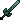
<figcaption>Source media</figcaption>
</figure>

<h2>Adamantite Long Sword</h2>

Obtainable through killing mobs while having Pure Magisteel Long Sword in your offhand or equipped

Open reference →

</a>
</article>
<article class="reference-card" data-letter="A" data-search="adamantite odachi obtainable through killing mobs while having pure magisteel odachi in your offhand or equipped">
<a href="adamantite-odachi/" aria-label="Open Adamantite Odachi">
<figure class="reference-card-media reference-card-media--source">

<figcaption>Source media</figcaption>
</figure>

<h2>Adamantite Odachi</h2>

Obtainable through killing mobs while having Pure Magisteel Odachi in your offhand or equipped

Open reference →

</a>
</article>
<article class="reference-card" data-letter="A" data-search="adamantite scythe obtainable through killing mobs while having pure magisteel scythe in your offhand or equipped">
<a href="adamantite-scythe/" aria-label="Open Adamantite Scythe">
<figure class="reference-card-media reference-card-media--source">

<figcaption>Source media</figcaption>
</figure>

<h2>Adamantite Scythe</h2>

Obtainable through killing mobs while having Pure Magisteel Scythe in your offhand or equipped

Open reference →

</a>
</article>
<article class="reference-card" data-letter="A" data-search="adamantite short sword obtainable through killing mobs while having pure magisteel short sword in your offhand or equipped">
<a href="adamantite-short-sword/" aria-label="Open Adamantite Short Sword">
<figure class="reference-card-media reference-card-media--source">

<figcaption>Source media</figcaption>
</figure>

<h2>Adamantite Short Sword</h2>

Obtainable through killing mobs while having Pure Magisteel Short Sword in your offhand or equipped

Open reference →

</a>
</article>
<article class="reference-card" data-letter="A" data-search="adamantite sickle obtainable through killing mobs while having pure magisteel sickle in your offhand or equipped">
<a href="adamantite-sickle/" aria-label="Open Adamantite Sickle">
<figure class="reference-card-media reference-card-media--source">

<figcaption>Source media</figcaption>
</figure>

<h2>Adamantite Sickle</h2>

Obtainable through killing mobs while having Pure Magisteel Sickle in your offhand or equipped

Open reference →

</a>
</article>
<article class="reference-card" data-letter="A" data-search="adamantite spear obtainable through killing mobs while having pure magisteel spear in your offhand or equipped">
<a href="adamantite-spear/" aria-label="Open Adamantite Spear">
<figure class="reference-card-media reference-card-media--source">

<figcaption>Source media</figcaption>
</figure>

<h2>Adamantite Spear</h2>

Obtainable through killing mobs while having Pure Magisteel Spear in your offhand or equipped

Open reference →

</a>
</article>
<article class="reference-card" data-letter="A" data-search="adamantite sword obtainable through killing mobs while having pure magisteel sword in your offhand or equipped">
<a href="adamantite-sword/" aria-label="Open Adamantite Sword">
<figure class="reference-card-media reference-card-media--source">

<figcaption>Source media</figcaption>
</figure>

<h2>Adamantite Sword</h2>

Obtainable through killing mobs while having Pure Magisteel Sword in your offhand or equipped

Open reference →

</a>
</article>
<article class="reference-card" data-letter="A" data-search="adamantite tachi obtainable through killing mobs while having pure magisteel tachi in your offhand or equipped">
<a href="adamantite-tachi/" aria-label="Open Adamantite Tachi">
<figure class="reference-card-media reference-card-media--source">

<figcaption>Source media</figcaption>
</figure>

<h2>Adamantite Tachi</h2>

Obtainable through killing mobs while having Pure Magisteel Tachi in your offhand or equipped

Open reference →

</a>
</article>
<article class="reference-card" data-letter="B" data-search="beast horn spear to craft, you need a smithing bench .">
<a href="beast-horn-spear/" aria-label="Open Beast Horn Spear">
<figure class="reference-card-media reference-card-media--source">

<figcaption>Source media</figcaption>
</figure>

<h2>Beast Horn Spear</h2>

To craft, you need a Smithing Bench .

Open reference →

</a>
</article>
<article class="reference-card" data-letter="B" data-search="blade tiger scythe to craft, you need a smithing bench and great sword schematic + spear schematic .">
<a href="blade-tiger-scythe/" aria-label="Open Blade Tiger Scythe">
<figure class="reference-card-media reference-card-media--source">

<figcaption>Source media</figcaption>
</figure>

<h2>Blade Tiger Scythe</h2>

To craft, you need a Smithing Bench and Great Sword Schematic + Spear Schematic .

Open reference →

</a>
</article>
<article class="reference-card" data-letter="C" data-search="centipede dagger to craft the weapon, one must have used a ???. to craft, you need a smithing bench .">
<a href="centipede-dagger/" aria-label="Open Centipede Dagger">
<figure class="reference-card-media reference-card-media--source">
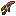
<figcaption>Source media</figcaption>
</figure>

<h2>Centipede Dagger</h2>

To craft the weapon, one must have used a ???. To craft, you need a Smithing Bench .

Open reference →

</a>
</article>
<article class="reference-card" data-letter="G" data-search="gear/tachi tachi&#x27;s are the combination of the japanese schematic and the long sword schematic which do mid-range damage, have buffed attack reach, and have a 100% sweeping chance.">
<a href="gear-tachi/" aria-label="Open Gear/Tachi">
<figure class="reference-card-media reference-card-media--theme">

<figcaption>TSR artwork</figcaption>
</figure>

<h2>Gear/Tachi</h2>

Tachi&#x27;s are the combination of the Japanese Schematic and the Long Sword Schematic which do mid-range damage, have buffed attack reach, and have a 100% sweeping chance.

Open reference →

</a>
</article>
<article class="reference-card" data-letter="H" data-search="high magisteel great sword obtainable through killing mobs while having low magisteel great sword in your offhand or equipped">
<a href="high-magisteel-great-sword/" aria-label="Open High Magisteel Great Sword">
<figure class="reference-card-media reference-card-media--source">
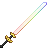
<figcaption>Source media</figcaption>
</figure>

<h2>High Magisteel Great Sword</h2>

Obtainable through killing mobs while having Low Magisteel Great Sword in your offhand or equipped

Open reference →

</a>
</article>
<article class="reference-card" data-letter="H" data-search="high magisteel katana obtainable through killing mobs while having low magisteel katana in your offhand or equipped">
<a href="high-magisteel-katana/" aria-label="Open High Magisteel Katana">
<figure class="reference-card-media reference-card-media--source">

<figcaption>Source media</figcaption>
</figure>

<h2>High Magisteel Katana</h2>

Obtainable through killing mobs while having Low Magisteel Katana in your offhand or equipped

Open reference →

</a>
</article>
<article class="reference-card" data-letter="H" data-search="high magisteel kodachi obtainable through killing mobs while having low magisteel kodachi in your offhand or equipped">
<a href="high-magisteel-kodachi/" aria-label="Open High Magisteel Kodachi">
<figure class="reference-card-media reference-card-media--source">

<figcaption>Source media</figcaption>
</figure>

<h2>High Magisteel Kodachi</h2>

Obtainable through killing mobs while having Low Magisteel Kodachi in your offhand or equipped

Open reference →

</a>
</article>
<article class="reference-card" data-letter="H" data-search="high magisteel long sword obtainable through killing mobs while having low magisteel long sword in your offhand or equipped">
<a href="high-magisteel-long-sword/" aria-label="Open High Magisteel Long Sword">
<figure class="reference-card-media reference-card-media--source">

<figcaption>Source media</figcaption>
</figure>

<h2>High Magisteel Long Sword</h2>

Obtainable through killing mobs while having Low Magisteel Long Sword in your offhand or equipped

Open reference →

</a>
</article>
<article class="reference-card" data-letter="H" data-search="high magisteel odachi obtainable through killing mobs while having low magisteel odachi in your offhand or equipped">
<a href="high-magisteel-odachi/" aria-label="Open High Magisteel Odachi">
<figure class="reference-card-media reference-card-media--source">

<figcaption>Source media</figcaption>
</figure>

<h2>High Magisteel Odachi</h2>

Obtainable through killing mobs while having Low Magisteel Odachi in your offhand or equipped

Open reference →

</a>
</article>
<article class="reference-card" data-letter="H" data-search="high magisteel scythe obtainable through killing mobs while having low magisteel scythe in your offhand or equipped">
<a href="high-magisteel-scythe/" aria-label="Open High Magisteel Scythe">
<figure class="reference-card-media reference-card-media--source">

<figcaption>Source media</figcaption>
</figure>

<h2>High Magisteel Scythe</h2>

Obtainable through killing mobs while having Low Magisteel Scythe in your offhand or equipped

Open reference →

</a>
</article>
<article class="reference-card" data-letter="H" data-search="high magisteel short sword obtainable through killing mobs while having low magisteel short sword in your offhand or equipped">
<a href="high-magisteel-short-sword/" aria-label="Open High Magisteel Short Sword">
<figure class="reference-card-media reference-card-media--source">

<figcaption>Source media</figcaption>
</figure>

<h2>High Magisteel Short Sword</h2>

Obtainable through killing mobs while having Low Magisteel Short Sword in your offhand or equipped

Open reference →

</a>
</article>
<article class="reference-card" data-letter="H" data-search="high magisteel sickle obtainable through killing mobs while having low magisteel sickle in your offhand or equipped">
<a href="high-magisteel-sickle/" aria-label="Open High Magisteel Sickle">
<figure class="reference-card-media reference-card-media--source">

<figcaption>Source media</figcaption>
</figure>

<h2>High Magisteel Sickle</h2>

Obtainable through killing mobs while having Low Magisteel Sickle in your offhand or equipped

Open reference →

</a>
</article>
<article class="reference-card" data-letter="H" data-search="high magisteel spear obtainable through killing mobs while having low magisteel spear in your offhand or equipped">
<a href="high-magisteel-spear/" aria-label="Open High Magisteel Spear">
<figure class="reference-card-media reference-card-media--source">
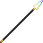
<figcaption>Source media</figcaption>
</figure>

<h2>High Magisteel Spear</h2>

Obtainable through killing mobs while having Low Magisteel Spear in your offhand or equipped

Open reference →

</a>
</article>
<article class="reference-card" data-letter="H" data-search="high magisteel sword obtainable through killing mobs while having low magisteel sword in your offhand or equipped">
<a href="high-magisteel-sword/" aria-label="Open High Magisteel Sword">
<figure class="reference-card-media reference-card-media--source">

<figcaption>Source media</figcaption>
</figure>

<h2>High Magisteel Sword</h2>

Obtainable through killing mobs while having Low Magisteel Sword in your offhand or equipped

Open reference →

</a>
</article>
<article class="reference-card" data-letter="H" data-search="high magisteel tachi obtainable through killing mobs while having low magisteel tachi in your offhand or equipped">
<a href="high-magisteel-tachi/" aria-label="Open High Magisteel Tachi">
<figure class="reference-card-media reference-card-media--source">

<figcaption>Source media</figcaption>
</figure>

<h2>High Magisteel Tachi</h2>

Obtainable through killing mobs while having Low Magisteel Tachi in your offhand or equipped

Open reference →

</a>
</article>
<article class="reference-card" data-letter="H" data-search="hihiirokane great sword obtainable through killing mobs while having adamantite great sword in your offhand or equipped">
<a href="hihiirokane-great-sword/" aria-label="Open HihiIrokane Great Sword">
<figure class="reference-card-media reference-card-media--source">

<figcaption>Source media</figcaption>
</figure>

<h2>HihiIrokane Great Sword</h2>

Obtainable through killing mobs while having Adamantite Great Sword in your offhand or equipped

Open reference →

</a>
</article>
<article class="reference-card" data-letter="H" data-search="hihiirokane katana obtainable through killing mobs while having adamantite katana in your offhand or equipped">
<a href="hihiirokane-katana/" aria-label="Open HihiIrokane Katana">
<figure class="reference-card-media reference-card-media--source">

<figcaption>Source media</figcaption>
</figure>

<h2>HihiIrokane Katana</h2>

Obtainable through killing mobs while having Adamantite Katana in your offhand or equipped

Open reference →

</a>
</article>
<article class="reference-card" data-letter="H" data-search="hihiirokane kodachi obtainable through killing mobs while having adamantite kodachi in your offhand or equipped">
<a href="hihiirokane-kodachi/" aria-label="Open HihiIrokane Kodachi">
<figure class="reference-card-media reference-card-media--source">

<figcaption>Source media</figcaption>
</figure>

<h2>HihiIrokane Kodachi</h2>

Obtainable through killing mobs while having Adamantite Kodachi in your offhand or equipped

Open reference →

</a>
</article>
<article class="reference-card" data-letter="H" data-search="hihiirokane long sword obtainable through killing mobs while having adamantite long sword in your offhand or equipped">
<a href="hihiirokane-long-sword/" aria-label="Open HihiIrokane Long Sword">
<figure class="reference-card-media reference-card-media--source">

<figcaption>Source media</figcaption>
</figure>

<h2>HihiIrokane Long Sword</h2>

Obtainable through killing mobs while having Adamantite Long Sword in your offhand or equipped

Open reference →

</a>
</article>
<article class="reference-card" data-letter="H" data-search="hihiirokane odachi obtainable through killing mobs while having pure magisteel odachi in your offhand or equipped">
<a href="hihiirokane-odachi/" aria-label="Open HihiIrokane Odachi">
<figure class="reference-card-media reference-card-media--source">

<figcaption>Source media</figcaption>
</figure>

<h2>HihiIrokane Odachi</h2>

Obtainable through killing mobs while having Pure Magisteel Odachi in your offhand or equipped

Open reference →

</a>
</article>
<article class="reference-card" data-letter="H" data-search="hihiirokane scythe obtainable through killing mobs while having adamantite scythe in your offhand or equipped">
<a href="hihiirokane-scythe/" aria-label="Open HihiIrokane Scythe">
<figure class="reference-card-media reference-card-media--source">

<figcaption>Source media</figcaption>
</figure>

<h2>HihiIrokane Scythe</h2>

Obtainable through killing mobs while having Adamantite Scythe in your offhand or equipped

Open reference →

</a>
</article>
<article class="reference-card" data-letter="H" data-search="hihiirokane short sword obtainable through killing mobs while having adamantite short sword in your offhand or equipped">
<a href="hihiirokane-short-sword/" aria-label="Open HihiIrokane Short Sword">
<figure class="reference-card-media reference-card-media--source">

<figcaption>Source media</figcaption>
</figure>

<h2>HihiIrokane Short Sword</h2>

Obtainable through killing mobs while having Adamantite Short Sword in your offhand or equipped

Open reference →

</a>
</article>
<article class="reference-card" data-letter="H" data-search="hihiirokane sickle obtainable through killing mobs while having adamantite sickle in your offhand or equipped">
<a href="hihiirokane-sickle/" aria-label="Open HihiIrokane Sickle">
<figure class="reference-card-media reference-card-media--source">

<figcaption>Source media</figcaption>
</figure>

<h2>HihiIrokane Sickle</h2>

Obtainable through killing mobs while having Adamantite Sickle in your offhand or equipped

Open reference →

</a>
</article>
<article class="reference-card" data-letter="H" data-search="hihiirokane spear obtainable through killing mobs while having adamantite spear in your offhand or equipped">
<a href="hihiirokane-spear/" aria-label="Open HihiIrokane Spear">
<figure class="reference-card-media reference-card-media--source">

<figcaption>Source media</figcaption>
</figure>

<h2>HihiIrokane Spear</h2>

Obtainable through killing mobs while having Adamantite Spear in your offhand or equipped

Open reference →

</a>
</article>
<article class="reference-card" data-letter="H" data-search="hihiirokane sword obtainable through killing mobs while having adamantite sword in your offhand or equipped">
<a href="hihiirokane-sword/" aria-label="Open HihiIrokane Sword">
<figure class="reference-card-media reference-card-media--source">

<figcaption>Source media</figcaption>
</figure>

<h2>HihiIrokane Sword</h2>

Obtainable through killing mobs while having Adamantite Sword in your offhand or equipped

Open reference →

</a>
</article>
<article class="reference-card" data-letter="H" data-search="hihiirokane tachi obtainable through killing mobs while having adamantite tachi in your offhand or equipped">
<a href="hihiirokane-tachi/" aria-label="Open HihiIrokane Tachi">
<figure class="reference-card-media reference-card-media--source">

<figcaption>Source media</figcaption>
</figure>

<h2>HihiIrokane Tachi</h2>

Obtainable through killing mobs while having Adamantite Tachi in your offhand or equipped

Open reference →

</a>
</article>
<article class="reference-card" data-letter="K" data-search="kodachi schematic kodachi does not have a schematic">
<a href="items-schematics-kodachi/" aria-label="Open Kodachi Schematic">
<figure class="reference-card-media reference-card-media--source">

<figcaption>Source media</figcaption>
</figure>

<h2>Kodachi Schematic</h2>

Kodachi does not have a schematic

Open reference →

</a>
</article>
<article class="reference-card" data-letter="L" data-search="low magisteel great sword to craft the weapon, one must have used a low magisteel gear schematic . to craft, you need a smithing bench .">
<a href="low-magisteel-great-sword/" aria-label="Open Low Magisteel Great Sword">
<figure class="reference-card-media reference-card-media--source">
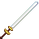
<figcaption>Source media</figcaption>
</figure>

<h2>Low Magisteel Great Sword</h2>

To craft the weapon, one must have used a Low Magisteel Gear Schematic . To craft, you need a Smithing Bench .

Open reference →

</a>
</article>
<article class="reference-card" data-letter="L" data-search="low magisteel katana to craft the weapon, one must have used a low magisteel gear schematic and a japanese schematic . to craft, you need a smithing bench .">
<a href="low-magisteel-katana/" aria-label="Open Low Magisteel Katana">
<figure class="reference-card-media reference-card-media--source">

<figcaption>Source media</figcaption>
</figure>

<h2>Low Magisteel Katana</h2>

To craft the weapon, one must have used a Low Magisteel Gear Schematic and a Japanese Schematic . To craft, you need a Smithing Bench .

Open reference →

</a>
</article>
<article class="reference-card" data-letter="L" data-search="low magisteel kodachi to craft the weapon, one must have used the following schematics: low magisteel gear schematic , short sword schematic and a japanese schematic .">
<a href="low-magisteel-kodachi/" aria-label="Open Low Magisteel Kodachi">
<figure class="reference-card-media reference-card-media--source">

<figcaption>Source media</figcaption>
</figure>

<h2>Low Magisteel Kodachi</h2>

To craft the weapon, one must have used the following schematics: Low Magisteel Gear Schematic , Short Sword Schematic and a Japanese Schematic .

Open reference →

</a>
</article>
<article class="reference-card" data-letter="L" data-search="low magisteel long sword to craft the weapon, one must have used a low magisteel gear schematic and a long sword schematic . to craft, you need a smithing bench .">
<a href="low-magisteel-long-sword/" aria-label="Open Low Magisteel Long Sword">
<figure class="reference-card-media reference-card-media--source">

<figcaption>Source media</figcaption>
</figure>

<h2>Low Magisteel Long Sword</h2>

To craft the weapon, one must have used a Low Magisteel Gear Schematic and a Long Sword Schematic . To craft, you need a Smithing Bench .

Open reference →

</a>
</article>
<article class="reference-card" data-letter="L" data-search="low magisteel odachi to craft the weapon, one must have used a low magisteel gear schematic . to craft, you need a smithing bench .">
<a href="low-magisteel-odachi/" aria-label="Open Low Magisteel Odachi">
<figure class="reference-card-media reference-card-media--source">

<figcaption>Source media</figcaption>
</figure>

<h2>Low Magisteel Odachi</h2>

To craft the weapon, one must have used a Low Magisteel Gear Schematic . To craft, you need a Smithing Bench .

Open reference →

</a>
</article>
<article class="reference-card" data-letter="L" data-search="low magisteel scythe to craft the weapon, one must have used a low magisteel gear schematic . to craft, you need a smithing bench .">
<a href="low-magisteel-scythe/" aria-label="Open Low Magisteel Scythe">
<figure class="reference-card-media reference-card-media--source">

<figcaption>Source media</figcaption>
</figure>

<h2>Low Magisteel Scythe</h2>

To craft the weapon, one must have used a Low Magisteel Gear Schematic . To craft, you need a Smithing Bench .

Open reference →

</a>
</article>
<article class="reference-card" data-letter="L" data-search="low magisteel short sword to craft the weapon, one must have used low magisteel gear schematic and a short sword schematic . to craft, you need a smithing bench .">
<a href="low-magisteel-short-sword/" aria-label="Open Low Magisteel Short Sword">
<figure class="reference-card-media reference-card-media--source">

<figcaption>Source media</figcaption>
</figure>

<h2>Low Magisteel Short Sword</h2>

To craft the weapon, one must have used Low Magisteel Gear Schematic and a Short Sword Schematic . To craft, you need a Smithing Bench .

Open reference →

</a>
</article>
<article class="reference-card" data-letter="L" data-search="low magisteel sickle to craft the tool, one must have used a low magisteel gear schematic . to craft, you need a smithing bench .">
<a href="low-magisteel-sickle/" aria-label="Open Low Magisteel Sickle">
<figure class="reference-card-media reference-card-media--source">

<figcaption>Source media</figcaption>
</figure>

<h2>Low Magisteel Sickle</h2>

To craft the tool, one must have used a Low Magisteel Gear Schematic . To craft, you need a Smithing Bench .

Open reference →

</a>
</article>
<article class="reference-card" data-letter="L" data-search="low magisteel spear to craft the weapon, one must have used a low magisteel gear schematic . to craft, you need a smithing bench .">
<a href="low-magisteel-spear/" aria-label="Open Low Magisteel Spear">
<figure class="reference-card-media reference-card-media--source">
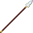
<figcaption>Source media</figcaption>
</figure>

<h2>Low Magisteel Spear</h2>

To craft the weapon, one must have used a Low Magisteel Gear Schematic . To craft, you need a Smithing Bench .

Open reference →

</a>
</article>
<article class="reference-card" data-letter="L" data-search="low magisteel sword to craft the weapon, one must have used a low magisteel gear schematic . to craft, you need a smithing bench .">
<a href="low-magisteel-sword/" aria-label="Open Low Magisteel Sword">
<figure class="reference-card-media reference-card-media--source">

<figcaption>Source media</figcaption>
</figure>

<h2>Low Magisteel Sword</h2>

To craft the weapon, one must have used a Low Magisteel Gear Schematic . To craft, you need a Smithing Bench .

Open reference →

</a>
</article>
<article class="reference-card" data-letter="L" data-search="low magisteel tachi to craft the weapon, one must have used a low magisteel gear schematic . to craft, you need a smithing bench .">
<a href="low-magisteel-tachi/" aria-label="Open Low Magisteel Tachi">
<figure class="reference-card-media reference-card-media--source">

<figcaption>Source media</figcaption>
</figure>

<h2>Low Magisteel Tachi</h2>

To craft the weapon, one must have used a Low Magisteel Gear Schematic . To craft, you need a Smithing Bench .

Open reference →

</a>
</article>
<article class="reference-card" data-letter="M" data-search="mithril great sword obtainable through killing mobs while having mithril great sword in your offhand or equipped">
<a href="mithril-great-sword/" aria-label="Open Mithril Great Sword">
<figure class="reference-card-media reference-card-media--source">

<figcaption>Source media</figcaption>
</figure>

<h2>Mithril Great Sword</h2>

Obtainable through killing mobs while having Mithril Great Sword in your offhand or equipped

Open reference →

</a>
</article>
<article class="reference-card" data-letter="M" data-search="mithril katana to craft the weapon, one must have used a mithril gear schematic and a japanese schematic . to craft, you need a smithing bench .">
<a href="mithril-katana/" aria-label="Open Mithril Katana">
<figure class="reference-card-media reference-card-media--source">

<figcaption>Source media</figcaption>
</figure>

<h2>Mithril Katana</h2>

To craft the weapon, one must have used a Mithril Gear Schematic and a Japanese Schematic . To craft, you need a Smithing Bench .

Open reference →

</a>
</article>
<article class="reference-card" data-letter="M" data-search="mithril kodachi to craft the weapon, one must have used a mithril gear schematic . to craft, you need a smithing bench .">
<a href="mithril-kodachi/" aria-label="Open Mithril Kodachi">
<figure class="reference-card-media reference-card-media--source">

<figcaption>Source media</figcaption>
</figure>

<h2>Mithril Kodachi</h2>

To craft the weapon, one must have used a Mithril Gear Schematic . To craft, you need a Smithing Bench .

Open reference →

</a>
</article>
<article class="reference-card" data-letter="M" data-search="mithril long sword to craft the weapon, one must have used a mithril gear schematic . to craft, you need a smithing bench .">
<a href="mithril-long-sword/" aria-label="Open Mithril Long Sword">
<figure class="reference-card-media reference-card-media--source">

<figcaption>Source media</figcaption>
</figure>

<h2>Mithril Long Sword</h2>

To craft the weapon, one must have used a Mithril Gear Schematic . To craft, you need a Smithing Bench .

Open reference →

</a>
</article>
<article class="reference-card" data-letter="M" data-search="mithril odachi to craft the weapon, one must have used a mithril gear schematic . to craft, you need a smithing bench .">
<a href="mithril-odachi/" aria-label="Open Mithril Odachi">
<figure class="reference-card-media reference-card-media--source">

<figcaption>Source media</figcaption>
</figure>

<h2>Mithril Odachi</h2>

To craft the weapon, one must have used a Mithril Gear Schematic . To craft, you need a Smithing Bench .

Open reference →

</a>
</article>
<article class="reference-card" data-letter="M" data-search="mithril scythe to craft the weapon, one must have used a mithril gear schematic . to craft, you need a smithing bench .">
<a href="mithril-scythe/" aria-label="Open Mithril Scythe">
<figure class="reference-card-media reference-card-media--source">

<figcaption>Source media</figcaption>
</figure>

<h2>Mithril Scythe</h2>

To craft the weapon, one must have used a Mithril Gear Schematic . To craft, you need a Smithing Bench .

Open reference →

</a>
</article>
<article class="reference-card" data-letter="M" data-search="mithril short sword to craft the weapon, one must have used a pure magisteel gear schematic . to craft, you need a smithing bench .">
<a href="mithril-short-sword/" aria-label="Open Mithril Short Sword">
<figure class="reference-card-media reference-card-media--source">

<figcaption>Source media</figcaption>
</figure>

<h2>Mithril Short Sword</h2>

To craft the weapon, one must have used a Pure Magisteel Gear Schematic . To craft, you need a Smithing Bench .

Open reference →

</a>
</article>
<article class="reference-card" data-letter="M" data-search="mithril sickle to craft the tool, one must have used a mithril gear schematic . to craft, you need a smithing bench .">
<a href="mithril-sickle/" aria-label="Open Mithril Sickle">
<figure class="reference-card-media reference-card-media--source">

<figcaption>Source media</figcaption>
</figure>

<h2>Mithril Sickle</h2>

To craft the tool, one must have used a Mithril Gear Schematic . To craft, you need a Smithing Bench .

Open reference →

</a>
</article>
<article class="reference-card" data-letter="M" data-search="mithril spear to craft the weapon, one must have used a mithril gear schematic . to craft, you need a smithing bench .">
<a href="mithril-spear/" aria-label="Open Mithril Spear">
<figure class="reference-card-media reference-card-media--source">

<figcaption>Source media</figcaption>
</figure>

<h2>Mithril Spear</h2>

To craft the weapon, one must have used a Mithril Gear Schematic . To craft, you need a Smithing Bench .

Open reference →

</a>
</article>
<article class="reference-card" data-letter="M" data-search="mithril sword to craft the weapon, one must have used a mithril gear schematic . to craft, you need a smithing bench .">
<a href="mithril-sword/" aria-label="Open Mithril Sword">
<figure class="reference-card-media reference-card-media--source">

<figcaption>Source media</figcaption>
</figure>

<h2>Mithril Sword</h2>

To craft the weapon, one must have used a Mithril Gear Schematic . To craft, you need a Smithing Bench .

Open reference →

</a>
</article>
<article class="reference-card" data-letter="M" data-search="mithril tachi to craft the weapon, one must have used a mithril gear schematic . to craft, you need a smithing bench .">
<a href="mithril-tachi/" aria-label="Open Mithril Tachi">
<figure class="reference-card-media reference-card-media--source">

<figcaption>Source media</figcaption>
</figure>

<h2>Mithril Tachi</h2>

To craft the weapon, one must have used a Mithril Gear Schematic . To craft, you need a Smithing Bench .

Open reference →

</a>
</article>
<article class="reference-card" data-letter="O" data-search="odachi schematic odachi does not have a schematic">
<a href="items-schematics-odachi/" aria-label="Open Odachi Schematic">
<figure class="reference-card-media reference-card-media--theme">

<figcaption>TSR artwork</figcaption>
</figure>

<h2>Odachi Schematic</h2>

Odachi does not have a schematic

Open reference →

</a>
</article>
<article class="reference-card" data-letter="O" data-search="orichalcum great sword to craft the weapon, one must have used a orichalcum gear schematic . to craft, you need a smithing bench .">
<a href="orichalcum-great-sword/" aria-label="Open Orichalcum Great Sword">
<figure class="reference-card-media reference-card-media--source">

<figcaption>Source media</figcaption>
</figure>

<h2>Orichalcum Great Sword</h2>

To craft the weapon, one must have used a Orichalcum Gear Schematic . To craft, you need a Smithing Bench .

Open reference →

</a>
</article>
<article class="reference-card" data-letter="O" data-search="orichalcum katana to craft the weapon, one must have used a orichalcum gear schematic . to craft, you need a smithing bench .">
<a href="orichalcum-katana/" aria-label="Open Orichalcum Katana">
<figure class="reference-card-media reference-card-media--source">

<figcaption>Source media</figcaption>
</figure>

<h2>Orichalcum Katana</h2>

To craft the weapon, one must have used a Orichalcum Gear Schematic . To craft, you need a Smithing Bench .

Open reference →

</a>
</article>
<article class="reference-card" data-letter="O" data-search="orichalcum kodachi to craft the weapon, one must have used a orichalcum gear schematic . to craft, you need a smithing bench .">
<a href="orichalcum-kodachi/" aria-label="Open Orichalcum Kodachi">
<figure class="reference-card-media reference-card-media--source">

<figcaption>Source media</figcaption>
</figure>

<h2>Orichalcum Kodachi</h2>

To craft the weapon, one must have used a Orichalcum Gear Schematic . To craft, you need a Smithing Bench .

Open reference →

</a>
</article>
<article class="reference-card" data-letter="O" data-search="orichalcum long sword to craft the weapon, one must have used a orichalcum gear schematic . to craft, you need a smithing bench .">
<a href="orichalcum-long-sword/" aria-label="Open Orichalcum Long Sword">
<figure class="reference-card-media reference-card-media--source">

<figcaption>Source media</figcaption>
</figure>

<h2>Orichalcum Long Sword</h2>

To craft the weapon, one must have used a Orichalcum Gear Schematic . To craft, you need a Smithing Bench .

Open reference →

</a>
</article>
<article class="reference-card" data-letter="O" data-search="orichalcum odachi to craft the weapon, one must have used a orichalcum gear schematic . to craft, you need a smithing bench .">
<a href="orichalcum-odachi/" aria-label="Open Orichalcum Odachi">
<figure class="reference-card-media reference-card-media--source">

<figcaption>Source media</figcaption>
</figure>

<h2>Orichalcum Odachi</h2>

To craft the weapon, one must have used a Orichalcum Gear Schematic . To craft, you need a Smithing Bench .

Open reference →

</a>
</article>
<article class="reference-card" data-letter="O" data-search="orichalcum scythe to craft the weapon, one must have used a orichalcum gear schematic . to craft, you need a smithing bench .">
<a href="orichalcum-scythe/" aria-label="Open Orichalcum Scythe">
<figure class="reference-card-media reference-card-media--source">
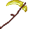
<figcaption>Source media</figcaption>
</figure>

<h2>Orichalcum Scythe</h2>

To craft the weapon, one must have used a Orichalcum Gear Schematic . To craft, you need a Smithing Bench .

Open reference →

</a>
</article>
<article class="reference-card" data-letter="O" data-search="orichalcum short sword to craft the weapon, one must have used a orichalcum gear schematic . to craft, you need a smithing bench .">
<a href="orichalcum-short-sword/" aria-label="Open Orichalcum Short Sword">
<figure class="reference-card-media reference-card-media--source">

<figcaption>Source media</figcaption>
</figure>

<h2>Orichalcum Short Sword</h2>

To craft the weapon, one must have used a Orichalcum Gear Schematic . To craft, you need a Smithing Bench .

Open reference →

</a>
</article>
<article class="reference-card" data-letter="O" data-search="orichalcum sickle to craft the weapon, one must have used a orichalcum gear schematic . to craft, you need a smithing bench .">
<a href="orichalcum-sickle/" aria-label="Open Orichalcum Sickle">
<figure class="reference-card-media reference-card-media--source">

<figcaption>Source media</figcaption>
</figure>

<h2>Orichalcum Sickle</h2>

To craft the weapon, one must have used a Orichalcum Gear Schematic . To craft, you need a Smithing Bench .

Open reference →

</a>
</article>
<article class="reference-card" data-letter="O" data-search="orichalcum spear to craft the weapon, one must have used a orichalcum gear schematic . to craft, you need a smithing bench .">
<a href="orichalcum-spear/" aria-label="Open Orichalcum Spear">
<figure class="reference-card-media reference-card-media--source">

<figcaption>Source media</figcaption>
</figure>

<h2>Orichalcum Spear</h2>

To craft the weapon, one must have used a Orichalcum Gear Schematic . To craft, you need a Smithing Bench .

Open reference →

</a>
</article>
<article class="reference-card" data-letter="O" data-search="orichalcum sword to craft the weapon, one must have used a orichalcum gear schematic . to craft, you need a smithing bench .">
<a href="orichalcum-sword/" aria-label="Open Orichalcum Sword">
<figure class="reference-card-media reference-card-media--source">

<figcaption>Source media</figcaption>
</figure>

<h2>Orichalcum Sword</h2>

To craft the weapon, one must have used a Orichalcum Gear Schematic . To craft, you need a Smithing Bench .

Open reference →

</a>
</article>
<article class="reference-card" data-letter="O" data-search="orichalcum tachi to craft the weapon, one must have used a orichalcum gear schematic . to craft, you need a smithing bench .">
<a href="orichalcum-tachi/" aria-label="Open Orichalcum Tachi">
<figure class="reference-card-media reference-card-media--source">

<figcaption>Source media</figcaption>
</figure>

<h2>Orichalcum Tachi</h2>

To craft the weapon, one must have used a Orichalcum Gear Schematic . To craft, you need a Smithing Bench .

Open reference →

</a>
</article>
<article class="reference-card" data-letter="P" data-search="pure magisteel great sword obtainable through killing mobs while having high magisteel great sword in your offhand or equipped">
<a href="pure-magisteel-great-sword/" aria-label="Open Pure Magisteel Great Sword">
<figure class="reference-card-media reference-card-media--source">
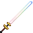
<figcaption>Source media</figcaption>
</figure>

<h2>Pure Magisteel Great Sword</h2>

Obtainable through killing mobs while having High Magisteel Great Sword in your offhand or equipped

Open reference →

</a>
</article>
<article class="reference-card" data-letter="P" data-search="pure magisteel katana obtainable through killing mobs while having high magisteel katana in your offhand or equipped">
<a href="pure-magisteel-katana/" aria-label="Open Pure Magisteel Katana">
<figure class="reference-card-media reference-card-media--source">

<figcaption>Source media</figcaption>
</figure>

<h2>Pure Magisteel Katana</h2>

Obtainable through killing mobs while having High Magisteel Katana in your offhand or equipped

Open reference →

</a>
</article>
<article class="reference-card" data-letter="P" data-search="pure magisteel kodachi obtainable through killing mobs while having high magisteel kodachi in your offhand or equipped">
<a href="pure-magisteel-kodachi/" aria-label="Open Pure Magisteel Kodachi">
<figure class="reference-card-media reference-card-media--source">

<figcaption>Source media</figcaption>
</figure>

<h2>Pure Magisteel Kodachi</h2>

Obtainable through killing mobs while having High Magisteel Kodachi in your offhand or equipped

Open reference →

</a>
</article>
<article class="reference-card" data-letter="P" data-search="pure magisteel long sword obtainable through killing mobs while having high magisteel long sword in your offhand or equipped">
<a href="pure-magisteel-long-sword/" aria-label="Open Pure Magisteel Long Sword">
<figure class="reference-card-media reference-card-media--source">

<figcaption>Source media</figcaption>
</figure>

<h2>Pure Magisteel Long Sword</h2>

Obtainable through killing mobs while having High Magisteel Long Sword in your offhand or equipped

Open reference →

</a>
</article>
<article class="reference-card" data-letter="P" data-search="pure magisteel odachi obtainable through killing mobs while having high magisteel odachi in your offhand or equipped">
<a href="pure-magisteel-odachi/" aria-label="Open Pure Magisteel Odachi">
<figure class="reference-card-media reference-card-media--source">

<figcaption>Source media</figcaption>
</figure>

<h2>Pure Magisteel Odachi</h2>

Obtainable through killing mobs while having High Magisteel Odachi in your offhand or equipped

Open reference →

</a>
</article>
<article class="reference-card" data-letter="P" data-search="pure magisteel scythe obtainable through killing mobs while having high magisteel scythe in your offhand or equipped">
<a href="pure-magisteel-scythe/" aria-label="Open Pure Magisteel Scythe">
<figure class="reference-card-media reference-card-media--source">

<figcaption>Source media</figcaption>
</figure>

<h2>Pure Magisteel Scythe</h2>

Obtainable through killing mobs while having High Magisteel Scythe in your offhand or equipped

Open reference →

</a>
</article>
<article class="reference-card" data-letter="P" data-search="pure magisteel short sword obtainable through killing mobs while having high magisteel short sword in your offhand or equipped">
<a href="pure-magisteel-short-sword/" aria-label="Open Pure Magisteel Short Sword">
<figure class="reference-card-media reference-card-media--source">

<figcaption>Source media</figcaption>
</figure>

<h2>Pure Magisteel Short Sword</h2>

Obtainable through killing mobs while having High Magisteel Short Sword in your offhand or equipped

Open reference →

</a>
</article>
<article class="reference-card" data-letter="P" data-search="pure magisteel sickle obtainable through killing mobs while having high magisteel sickle in your offhand or equipped">
<a href="pure-magisteel-sickle/" aria-label="Open Pure Magisteel Sickle">
<figure class="reference-card-media reference-card-media--source">

<figcaption>Source media</figcaption>
</figure>

<h2>Pure Magisteel Sickle</h2>

Obtainable through killing mobs while having High Magisteel Sickle in your offhand or equipped

Open reference →

</a>
</article>
<article class="reference-card" data-letter="P" data-search="pure magisteel spear obtainable through killing mobs while having high magisteel spear in your offhand or equipped">
<a href="pure-magisteel-spear/" aria-label="Open Pure Magisteel Spear">
<figure class="reference-card-media reference-card-media--source">
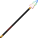
<figcaption>Source media</figcaption>
</figure>

<h2>Pure Magisteel Spear</h2>

Obtainable through killing mobs while having High Magisteel Spear in your offhand or equipped

Open reference →

</a>
</article>
<article class="reference-card" data-letter="P" data-search="pure magisteel sword to craft the weapon, one must have used a pure magisteel gear schematic . to craft, you need a smithing bench .">
<a href="pure-magisteel-sword/" aria-label="Open Pure Magisteel Sword">
<figure class="reference-card-media reference-card-media--source">

<figcaption>Source media</figcaption>
</figure>

<h2>Pure Magisteel Sword</h2>

To craft the weapon, one must have used a Pure Magisteel Gear Schematic . To craft, you need a Smithing Bench .

Open reference →

</a>
</article>
<article class="reference-card" data-letter="P" data-search="pure magisteel tachi obtainable through killing mobs while having high magisteel tachi in your offhand or equipped">
<a href="pure-magisteel-tachi/" aria-label="Open Pure Magisteel Tachi">
<figure class="reference-card-media reference-card-media--source">

<figcaption>Source media</figcaption>
</figure>

<h2>Pure Magisteel Tachi</h2>

Obtainable through killing mobs while having High Magisteel Tachi in your offhand or equipped

Open reference →

</a>
</article>
<article class="reference-card" data-letter="S" data-search="scythe schematic scythe does not have a schematic">
<a href="items-schematics-scythe/" aria-label="Open Scythe Schematic">
<figure class="reference-card-media reference-card-media--theme">

<figcaption>TSR artwork</figcaption>
</figure>

<h2>Scythe Schematic</h2>

Scythe does not have a schematic

Open reference →

</a>
</article>
<article class="reference-card" data-letter="S" data-search="spider dagger to craft the weapon, one must have used a ???. to craft, you need a smithing bench .">
<a href="spider-dagger/" aria-label="Open Spider Dagger">
<figure class="reference-card-media reference-card-media--source">
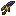
<figcaption>Source media</figcaption>
</figure>

<h2>Spider Dagger</h2>

To craft the weapon, one must have used a ???. To craft, you need a Smithing Bench .

Open reference →

</a>
</article>
<article class="reference-card" data-letter="T" data-search="tachi schematic tachi does not have a schematic">
<a href="items-schematics-tachi/" aria-label="Open Tachi Schematic">
<figure class="reference-card-media reference-card-media--theme">

<figcaption>TSR artwork</figcaption>
</figure>

<h2>Tachi Schematic</h2>

Tachi does not have a schematic

Open reference →

</a>
</article>
<article class="reference-card" data-letter="T" data-search="tempest scale sword to craft, you need a smithing bench .">
<a href="tempest-scale-sword/" aria-label="Open Tempest Scale Sword">
<figure class="reference-card-media reference-card-media--source">

<figcaption>Source media</figcaption>
</figure>

<h2>Tempest Scale Sword</h2>

To craft, you need a Smithing Bench .

Open reference →

</a>
</article>
<article class="reference-card" data-letter="U" data-search="unicorn horn spear to craft, you need a smithing bench .">
<a href="unicorn-horn-spear/" aria-label="Open Unicorn Horn Spear">
<figure class="reference-card-media reference-card-media--source">

<figcaption>Source media</figcaption>
</figure>

<h2>Unicorn Horn Spear</h2>

To craft, you need a Smithing Bench .

Open reference →

</a>
</article>
<article class="reference-card" data-letter="W" data-search="wooden great sword this gears schematic is enabled by default. to craft, you need a smithing bench .">
<a href="wooden-great-sword/" aria-label="Open Wooden Great Sword">
<figure class="reference-card-media reference-card-media--source">
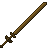
<figcaption>Source media</figcaption>
</figure>

<h2>Wooden Great Sword</h2>

This gears schematic is enabled by default. To craft, you need a Smithing Bench .

Open reference →

</a>
</article>
<article class="reference-card" data-letter="W" data-search="wooden long sword this gears schematic is enabled by default. to craft, you need a smithing bench .">
<a href="wooden-long-sword/" aria-label="Open Wooden Long Sword">
<figure class="reference-card-media reference-card-media--source">

<figcaption>Source media</figcaption>
</figure>

<h2>Wooden Long Sword</h2>

This gears schematic is enabled by default. To craft, you need a Smithing Bench .

Open reference →

</a>
</article>
<article class="reference-card" data-letter="W" data-search="wooden short sword this gears schematic is enabled by default. to craft, you need a smithing bench .">
<a href="wooden-short-sword/" aria-label="Open Wooden Short Sword">
<figure class="reference-card-media reference-card-media--source">

<figcaption>Source media</figcaption>
</figure>

<h2>Wooden Short Sword</h2>

This gears schematic is enabled by default. To craft, you need a Smithing Bench .

Open reference →

</a>
</article>

No matching articles. Try a broader search.

</section>
